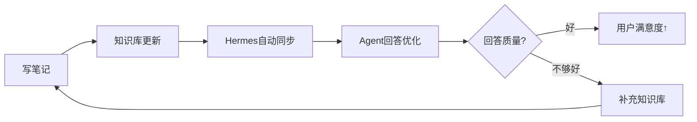

# 🍅 模块6：总结回顾篇（番茄30）

> ⏱ **总时长**：1番茄 = 25分钟专注 + 5分钟休息
> 📖 **学习目标**：费曼回顾全局、建立刻意练习计划、构建持续学习体系
> 🧠 **费曼核心**："教是最好的学——现在你能把这个体系教给别人了吗？"

---

## 🍅 番茄30：课程总回顾与刻意练习计划

> ⏱ 25分钟 | 📌 核心技能：知识体系梳理、学习路径规划、持续迭代

### 30.1 全局架构回顾

```
┌─────────────────────────────────────────────────────────┐
│              30番茄 Hermes+Obsidian+GitHub               │
│                   云服务器知识库体系                       │
├─────────────────────────────────────────────────────────┤
│                                                         │
│  基础层 ──── 阿里云(2vCPU/2GiB/40G) + Ubuntu 24.04      │
│              SSH密钥 + UFW + Fail2Ban                    │
│                                                         │
│  核心层 ──── Hermes Agent + OpenRouter API               │
│              微信/QQ/飞书/钉钉 四通道集成                  │
│                                                         │
│  知识层 ──── Obsidian LLM-WIKI + Git同步                 │
│              本地↔GitHub↔服务器 三端联动                   │
│                                                         │
│  应用层 ──── 心理咨询Agent + 法律咨询Agent                │
│              故事创作Agent + 剧本Agent + 文案Agent        │
│                                                         │
│  进阶层 ──── RAG优化 + 多Agent协作 + 安全运维             │
│                                                         │
└─────────────────────────────────────────────────────────┘
```

### 30.2 核心技能总结

完成本教程后，你应该掌握：

| # | 技能 | 熟练度标准 | 番茄来源 |
|:--|:----|:---------|:--------|
| 1 | 阿里云服务器创建与初始化 | 从0到SSH连接 < 10分钟 | 🍅1 |
| 2 | Ubuntu基础环境配置 | 一键安装脚本 | 🍅2 |
| 3 | SSH密钥管理与Git配置 | 多设备免密登录 | 🍅3-4 |
| 4 | Hermes安装部署 | 一键部署+Web界面 | 🍅5 |
| 5 | 多模型API配置 | 切换模型Provider | 🍅6 |
| 6 | 四通讯平台集成 | 任意平台消息收发 | 🍅7-10 |
| 7 | Obsidian知识库设计 | LLM-WIKI架构搭建 | 🍅11-12 |
| 8 | Git多端同步 | 本地↔GitHub↔服务器 | 🍅13-15 |
| 9 | Hermes知识库部署 | AI基于知识库问答 | 🍅16 |
| 10 | 心理学知识库+Agent | 心理咨询问答 | 🍅17-19 |
| 11 | 法律知识库+Agent | 法律咨询问答 | 🍅20-22 |
| 12 | 写作知识库+Agent | 故事/剧本/文案创作 | 🍅23-25 |
| 13 | RAG调优 | 分块/嵌入优化 | 🍅26 |
| 14 | 多Agent协作 | Pipeline工作流 | 🍅27 |
| 15 | 安全加固 | HTTPS+Fail2Ban+SSH | 🍅28 |
| 16 | 监控运维 | 健康检查+备份 | 🍅29 |

### 30.3 费曼终极检验

**用你自己的话（不需要技术术语），向一个完全不懂技术的朋友解释：**

```
1. "你做的这个系统到底是干什么的？"
   → [你的费曼解释]
   
   示例："就是给自己做了一个AI大脑——把笔记存在云上，
   然后AI可以基于这些笔记来回答问题，就像有了一个知道
   你所有知识的私人助理。"

2. "它和直接用ChatGPT有什么区别？"
   → [你的费曼解释]
   
   示例："ChatGPT用的是公开知识，我的系统用的是我
   自己的知识。就像一个是图书馆管理员，一个是你的
   私人日记管理员。"

3. "你花了15个小时就为了这个？"
   → [你的费曼解释]
   
   示例："这15小时搭建的是基础设施——就像盖房子打地基。
   之后我就可以在这个基础上无限扩展：加新知识库、训练
   新Agent、集成更多平台。这是一次投入，长期受益。"
```

### 30.4 刻意练习计划

#### 初级（7天巩固）

| 天 | 练习内容 | 预估时间 |
|:--|:--------|:-------|
| Day1 | 从0开始重新部署一台服务器（不用看教程） | 2小时 |
| Day2 | 配置所有4个通讯平台，确保都能收发消息 | 1小时 |
| Day3 | 创建1个完整领域的知识库（20+条目） | 2小时 |
| Day4 | 配置对应Agent，测试问答效果 | 1小时 |
| Day5 | 调试RAG参数，优化回答质量 | 1小时 |
| Day6 | 配置安全加固和HTTPS | 1小时 |
| Day7 | 搭建监控和备份系统 | 1小时 |

#### 中级（21天进阶）

| 周 | 练习内容 | 目标 |
|:--|:--------|:----|
| 第1周 | 完善3个知识库每个到50+条目 | 知识库质量提升 |
| 第2周 | 优化Agent提示词，进行A/B测试 | Agent效果提升 |
| 第3周 | 搭建多Agent协作Pipeline | 自动化工作流 |

#### 高级（自定义项目）

**项目方向建议**：

```markdown
## 方向1：专业知识库
选择你自己的工作/学习领域，构建垂直知识库
- 程序员：技术栈知识库 + 代码助手Agent
- 教师：学科知识库 + 教学助手Agent
- 创业者：行业知识库 + 商业顾问Agent
- 投资者：投资知识库 + 分析Agent

## 方向2：多语言知识库
- 构建中英双语知识库
- 配置翻译Agent
- 跨语言知识检索

## 方向3：团队协作知识库
- 多人协作的Obsidian仓库
- 团队Agent配置
- 权限管理和审计

## 方向4：知识库自动化
- 自动从网页导入内容（Web Clipper）
- RSS源自动抓取
- AI自动分类和摘要
```

### 30.5 知识体系持续迭代



**迭代周期建议**：
- **日迭代**：写笔记 → 自动同步（Obsidian Git）
- **周迭代**：检查Agent回答质量 → 补充知识缺口
- **月迭代**：重构知识库结构 → 优化Agent提示词
- **季迭代**：评审整体架构 → 升级组件 → 新增功能

### 30.6 毕业项目

完成以下所有项目，即为本课程的"毕业设计"：

- [ ] 从一个全新的阿里云服务器开始，完全复现本教程的所有配置
- [ ] 心理学、法律、写作三个知识库各至少30个条目，形成知识网络
- [ ] 所有Agent在实际使用中能稳定运行（连续7天无故障）
- [ ] 至少教会一个人使用这个系统（费曼检验）
- [ ] 设计一个你自己的专业知识库方案

---

## 📊 课程总回顾

### 番茄总进度

- [x] 🍅 模块0：学习准备
- [x] 🍅 模块1：基础准备篇（4番茄）
- [x] 🍅 模块2：Hermes部署篇（6番茄）
- [x] 🍅 模块3：知识库构建篇（6番茄）
- [x] 🍅 模块4-1：心理学实战（3番茄）
- [x] 🍅 模块4-2：法律实战（3番茄）
- [x] 🍅 模块4-3：写作实战（3番茄）
- [x] 🍅 模块5：进阶扩展篇（4番茄）
- [x] 🍅 模块6：总结回顾篇（1番茄）

### 知识体系总览

```
技术栈   ┌────────────────────────────────────┐
         │ Hermes + Obsidian + GitHub + 阿里云  │
         └────────────────────────────────────┘
         
应用场景  ┌───────┐ ┌───────┐ ┌───────┐ ┌────────┐
         │ 心理   │ │ 法律   │ │ 写作   │ │  更多   │
         └───────┘ └───────┘ └───────┘ └────────┘
         
核心能力  ┌───────────┐ ┌───────────┐ ┌───────────┐
         │ 云部署+运维 │ │ 知识库设计  │ │ Agent开发  │
         └───────────┘ └───────────┘ └───────────┘
```

### 最后的建议

> **"不要追求一次性完美——30番茄只是起点。每天花1个番茄维护知识库，30天后你将拥有别人30倍的知识积累。"**

**保持迭代的三个习惯**：
1. **每天写笔记**：用Obsidian记录日常学习和思考
2. **每周查一次**：看看Agent的回答质量，补充知识缺口
3. **每月升一次**：升级Hermes、优化提示词、扩展知识库

---

**🎉 恭喜你完成了30番茄的全部课程！你的云服务器知识库已经上线运行。**

> **创建时间**：2026-06-20
> **创建者**：Claudian (AI助手)
> **关联课程**：[[README]]
> **看下一篇**：[[模块0-学习准备与课程概述]]
