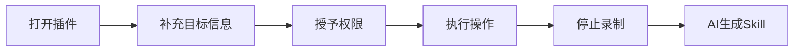
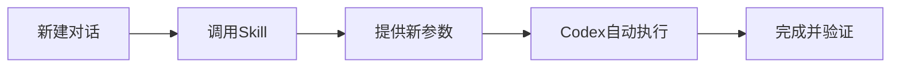

# 🍅 3番茄数量掌握Codex录制技能

> ⏱ **学习结构**：3个番茄钟（25分钟 × 3）+ 刻意练习间隔
> 🎯 **学习方式**：边读边操作，每个知识点后跟着做
> 🧠 **教学方法**：费曼学习法 × 刻意练习法
> 📅 **更新日期**：2026-06-21（Codex Record & Replay 发布后第3天）
> 💡 **新闻背景**：2026年6月18日，OpenAI 为 Codex 推出 **Record & Replay** 功能，用户只需在 Mac 上演示一次操作流程，Codex 就能自动生成可复用的 **Skill**——从此重复工作不用再手动干了。

---

## 前置准备（3分钟，在番茄钟之前完成）

开始前确保你已满足以下条件：

| 条件 | 说明 | 检查 |
|------|------|------|
| ✅ macOS 系统 | Record & Replay **仅支持 macOS**（Windows/Linux 不支持） | ☐ |
| ✅ Codex 最新版 | 更新 Codex 至 2026年6月18日之后的版本 | ☐ |
| ✅ 开启 Computer Use | 设置中打开 Computer Use 功能 | ☐ |
| ✅ 授予辅助权限 | 系统设置中允许 Codex 获取 Accessibility + Screenshots 权限 | ☐ |
| ✅ 不在受限区域 | EEA（欧洲经济区）、英国、瑞士用户暂不可用 | ☐ |

---

## 番茄钟1：理解本质 —— Record & Replay 到底在干什么（25分钟）

### 1.1 用一个故事讲清楚「录制技能」

**用大白话讲：**

想象你有一个实习生在旁边看着你干活。你操作一遍电脑，他就在旁边拿小本本记下你的每一步——先点哪里、输入什么、怎么判断下一步。记完之后，你说"以后这事你帮我做"，他就能照着你的步骤自己完成。

**Record & Replay 就是把这个实习生变成了 AI 版本。**

- **Record（录制）** = 你当着 Codex 的面操作一遍
- **Replay（复现）** = Codex 记住后，下次帮你自动操作
- **Skill（技能）** = Codex 自动生成的"操作说明书"，包含步骤、输入、验证方法

> 🧠 **核心思维转变**：
>
> | 以前 | 现在 |
> |------|------|
> | 写脚本/写指令告诉 AI 做什么 | **做一遍给 AI 看**，它自己学会 |
> | 每次重复手动操作 | 一次录制，反复复现 |
> | 需要懂代码才能自动化 | **零代码**，操作即技能 |

> ✋ **费曼自测 ①**：用三句话向一个不懂技术的朋友解释 Record & Replay 是什么。不许用"录制""复现""技能"这三个词。

---

### 1.2 Record & Replay 的完整工作流

整个过程分两个阶段：

**阶段一：录制（你只做这一次）**



| 步骤 | 操作 | 时间预估 |
|------|------|----------|
| ① 打开插件 | Codex 左侧 Plugins → "+" → Record a skill | 10秒 |
| ② 补充信息 | 告诉 Codex 录制目标和可变输入 | 1分钟 |
| ③ 授予权限 | 允许 Accessibility + Screenshots | 10秒 |
| ④ 执行操作 | 正常完成工作流程（最⻓30分钟） | 3-15分钟 |
| ⑤ 停止录制 | 菜单栏或说"录制完成" | 5秒 |
| ⑥ 生成 Skill | Codex 自动复盘，生成 Skill | 1-2分钟 |

**阶段二：复现（每次让 Codex 帮你做）**



> ✋ **费曼自测 ②**：闭眼复述一遍录制的6个步骤。能说完 ①→⑥ 才算过关。卡住了就回头重读，**别糊弄自己**。

---

### 1.3 录制的最优实践

**✅ 这样做：**

- 演示**短而完整**，聚焦单一目标
- 录前告诉 Codex **目标和可变输入**（比如"这次文件名是 X"）
- 使用**真实数据**，但绝对不要录密码
- 操作完**立即停止**，别拖到无关操作
- 录完后补充**隐性偏好**（命名规范、决策标准等）

**❌ 不要这样做：**

- 一次录制包含多个不相干任务
- 在录制中处理敏感信息
- 流程做完后继续做其他操作
- 跳过向 Codex 说明可变输入

> 🧠 **刻意练习要点**：
>
> 刻意练习不是"重复操作"，而是**带着明确目标反思差异**。录完一次后问自己：
> - 我的操作有没有冗余步骤？
> - Codex 生成的 Skill 是否漏掉了某个关键判断？
> - 如果换一批输入数据，Skill 还能正确处理吗？

---

### 🍅 番茄钟1 结束，休息5分钟

**番茄1 核心回顾清单：**
- ☐ 能说清 Record & Replay 的核心思想（做一遍给 AI 看）
- ☐ 能列出录制6步骤
- ☐ 知道复现阶段怎么用 Skill
- ☐ 了解录制的最优实践

🫵 **休息时做一件事**：打开 Codex 确认你的环境满足前置条件（Computer Use + 权限）。

---

## 番茄钟2：掌握流程 —— 录制技能完整实操（25分钟）

### 2.1 录前三步准备

每次录制前，花1分钟做这三件事，**能省掉后面80%的返工**：

**① 确定边界**
- 这次录制从哪开始？到哪结束？
- 示例：从"打开浏览器"到"页面显示提交成功"

**② 识别可变输入**
- 哪些内容每次操作会变？
- 示例：文件名、日期、文案内容、目标URL

**③ 检查隐私**
- 屏幕上有个人信息吗？
- 密码/Token/API Key 千万别录进去

> ✋ **费曼自测 ③**：给自己接下来想录制的任务做一次"录前三问"。写下来。

---

### 2.2 操作示例一：录制「发布博客到个人网站」

**场景描述**：每次写完一篇 Markdown 博客，你需要打开网站后台 → 新建文章 → 粘贴内容 → 设置标签 → 点击发布。

**录制准备：**

| 项目 | 内容 |
|------|------|
| 录制目标 | 将一篇 Markdown 文件发布到个人博客 |
| 边界 | 从「博客后台首页」到「看到发布成功提示」 |
| 可变输入 | 文章标题、标签、发布日期 |
| 固定流程 | 登录 → 新建 → 填写标题 → 粘贴内容 → 设置标签 → 点发布 |

**录制步骤演示：**

```
① 打开插件 → 选择 Record a skill
② 告诉 Codex："我将演示如何发布一篇博客文章。每次的标题、标签会变化"
③ 开始录制
④ 操作流程：
   ├─ 打开浏览器 → 进入博客后台
   ├─ 点击「新建文章」
   ├─ 输入标题栏（输入示例标题）
   ├─ 粘贴文章正文（从本地 Markdown 复制）
   ├─ 设置标签（点选 2-3 个标签）
   └─ 点击「发布」→ 确认发布
⑤ 说"录制完成"
⑥ 查看 Codex 生成的 Skill 草稿
```

**Skill 草稿审查要点：**
- Codex 是否识别了"标题"和"标签"为可变输入？
- 是否有遗漏步骤（如添加封面图、设置摘要）？
- 技能描述是否准确？

> ✋ **费曼自测 ④**：不看上面的步骤，自己在纸上写出录制这个博客发布流程的步骤。写完后对照检查。

---

### 2.3 操作示例二：录制「创建 GitHub Issue」

**场景描述**：团队规定每次发现 Bug 必须创建一个格式化 Issue，包含标题、标签、描述模板、指派人。

**录制准备：**

| 项目 | 内容 |
|------|------|
| 录制目标 | 创建一个带模板的 GitHub Issue |
| 边界 | 从「项目 GitHub 页面」到「Issue 创建成功」 |
| 可变输入 | Bug 标题、描述内容、优先级 |
| 固定流程 | 点 Issues → New Issue → 选模板 → 填写 → 提交 |

**录制步骤演示：**

```
① 打开插件 → Record a skill
② 告诉 Codex："我将演示创建 Bug Issue。每次的标题、描述和优先级会变化"
③ 开始录制
④ 操作流程：
   ├─ 打开浏览器 → 进入项目 GitHub 页面
   ├─ 点击 Issues 标签 → New Issue
   ├─ 选择 Bug Report 模板
   ├─ 填写标题（输入示例"登录页按钮点击无响应"）
   ├─ 填写描述模板（填充具体信息）
   ├─ 选择标签（bug、frontend）
   ├─ 指派给对应负责人
   └─ 点击 Submit new issue
⑤ 说"录制完成"
⑥ 检查生成的 Skill
```

**Skill 优化提示**：
生成 Skill 后，告诉 Codex 补充这些隐性偏好：
- Issue 标题格式统一为 `[Bug] 模块名: 问题简述`
- 标签固定加一个 `priority-` 前缀的优先级标签
- 描述中必须包含「复现步骤」「期望结果」「实际结果」

> 🧠 **刻意练习要点**：
>
> 对比示例一和示例二，**主动找模式**：
> - 两个录制流程的共同结构是什么？
> - 不同场景下，"告诉 Codex 可变输入"的方式有哪些差异？
> - 哪种类型的操作更适合录制？为什么？

---

### 2.4 操作示例三：录制「下载周期性销售报表」

**场景描述**：每周一需要登录公司后台 → 按日期筛选 → 导出 CSV → 下载到本地 → 重命名 → 发送邮件。

**录制准备：**

| 项目 | 内容 |
|------|------|
| 录制目标 | 按指定日期范围下载销售报表 |
| 边界 | 从「公司后台首页」到「CSV 保存到桌面」 |
| 可变输入 | 起始日期、结束日期 |
| 固定流程 | 登录 → 进报表 → 筛选 → 导出 → 下载 → 重命名 |

**录制步骤演示：**

```
① 打开插件 → Record a skill
② 告诉 Codex："我将演示下载周报。每周起止日期会不同"
③ 开始录制
④ 操作流程：
   ├─ 打开公司后台 → 登录
   ├─ 进入「销售报表」模块
   ├─ 设置筛选：日期范围（演示 6/15-6/21）
   ├─ 点击导出 → 选择 CSV 格式
   ├─ 等待下载完成
   ├─ 重命名文件为 "销售周报_2026W25.csv"
   └─ 移到桌面「周报存档」文件夹
⑤ 说"录制完成"
⑥ 检查 Skill 是否记录了日期筛选和重命名规则
```

**Skill 优化提示**：
- 告诉 Codex：文件命名规则是 `销售周报_YYYY"W"WW.csv`
- 补充：下载后需要**检查数据完整性**（行数不低于上周的80%）

> ✋ **费曼自测 ⑤**：选一个你日常工作中**重复做**的操作，用上面的"录前三问"做一次规划。写出你的录制目标、边界和可变输入。

---

### 🍅 番茄钟2 结束，休息5分钟

**番茄2 核心回顾清单：**
- ☐ 掌握"录前三问"（边界、可变输入、隐私检查）
- ☐ 能独立完成一次完整的录制（从打开插件到生成 Skill）
- ☐ 知道如何优化 Codex 生成的 Skill 草稿
- ☐ 看过3个操作示例，理解它们的共同模式

🫵 **休息时做一件事**：选一个你日常工作里5分钟内能完成的重复操作，准备作为自己的第一个录制实验。

---

## 番茄钟3：刻意练习 —— 从"会"到"熟练"（25分钟）

### 3.1 刻意练习的第一个循环：录制你自己的第一个 Skill

现在你已经看了3个示例，是时候**自己动手**了。

**练习任务：录制一个你日常工作中的真实操作**

遵循刻意练习的 **3F 框架**：

```
┌─────────────────────────────────────┐
│        刻意练习 3F 框架               │
├─────────────────────────────────────┤
│  Focus（聚焦）→ 选一个5分钟内能完成的任务 │
│  Feedback（反馈）→ 对比 Skill 和自己的预期 │
│  Fix（修正）→ 迭代优化操作流程           │
└─────────────────────────────────────┘
```

**Step 1：Focus（2分钟）**

从以下清单选一项（或选你自己的任务）：

| 难度 | 适合初次录制的任务 | 预估时长 |
|------|-------------------|----------|
| ⭐ | 创建 Trello/Notion 卡片 | 2分钟 |
| ⭐ | 在 Slack 中发送格式化消息 | 2分钟 |
| ⭐⭐ | 下载某个后台报表 | 4分钟 |
| ⭐⭐ | 提交代码 Review 申请 | 3分钟 |
| ⭐⭐⭐ | 发布一篇博客文章（有后台操作） | 5分钟 |

选择标准：**选你闭着眼睛都能操作的**，这样你才能把注意力放在"录制"本身，而不是操作上。

**Step 2：Do + Feedback（15分钟）**

1. 按"录前三问"准备 → 2分钟
2. 执行录制 → 3-5分钟
3. 查看生成的 Skill 草稿 → 1分钟
4. **跟你的预期对比**，找出差异：
   - Codex 多记录了哪些没必要的步骤？
   - 漏掉了哪些关键判断（比如"如果 XX 就 YY"）？
   - 可变输入识别得准确吗？
5. 补充隐性偏好 → 2分钟

**Step 3：Fix（5分钟）**

根据 Feedback 的结果：
- 如果 Skill 完美：🎉 恭喜，你已经掌握了！
- 如果少了细节：补充说明，重新生成
- 如果流程不对：重新录制一遍，这次操作更慢更清晰

> 🧠 **刻意练习的关键**：
>
> 不是"录了就行"，而是 **录完 → 检查差异 → 思考为什么 → 优化重录** 这个循环。一次高质量的迭代 > 十次无脑重复。

> ✋ **费曼自测 ⑥**：录完你的第一个 Skill 后，用自己的话总结一下："Codex 是怎么判断哪些步骤是固定流程、哪些是可变的？"（提示：思考你的鼠标点击模式、输入内容的类型...）

---

### 3.2 刻意练习的第二个循环：Skill 优化进阶

第一个 Skill 录完之后，进阶到**质量优化**。

**练习任务：优化你刚生成的 Skill**

对照这个清单逐项检查：

```
Quality Checklist for Skill Review:
☐ 描述是否准确？（能让另一个人看懂这个 Skill 是做什么的）
☐ 输入参数是否完整？（所有可变项都识别了？）
☐ 执行步骤是否完整？（有没有漏掉前置条件？）
☐ 验证方法是否明确？（怎么知道操作成功了？）
☐ 是否有错误处理？（如果某一步失败怎么办？）
```

**常见问题与修复方案：**

| 问题 | 表现 | 修复方法 |
|------|------|----------|
| 步骤遗漏 | 生成 Skill 少了一个点击 | 重新录制，操作放慢，每个步骤停顿2秒 |
| 输入识别不全 | 漏掉了某个可变参数 | 录制前更明确告诉 Codex 哪些会变 |
| 边界模糊 | Skill 把无关操作也录进去了 | 操作一完成立即停止，不要拖 |
| 缺少验证 | Skill 没写怎么确认成功 | 补充：最后加一个确认步骤（截图检查/状态提示） |

> ✋ **费曼自测 ⑦**：选一个你身边重复性最高的工作流，评估一下用 Record & Replay 录制它的 ROI（投入产出比）：
> - 录制耗时：X 分钟
> - 每次手动耗时：Y 分钟
> - 每周重复次数：Z 次
> - 回本周期 = X ÷ (Y × Z) 周
>
> 如果回本周期 < 4 周，**立即录制它**。

---

### 3.3 刻意练习的第三个循环：复现与调试

最后一个循环，练习**使用 Skill** 和**调试失败**。

**练习任务：在新对话中调用你录制的 Skill**

1. 新建一个 Codex 对话
2. 告诉 Codex："使用刚才录制的 [Skill名称]，这次输入是 [新参数]"
3. 观察 Codex 执行过程
4. **不要主动帮忙**——看它能不能独立完成

**如果执行失败，调试方法：**

| 失败表现 | 原因 | 修复 |
|----------|------|------|
| Codex 点错了按钮 | 录制时路径不够清晰 | 重录时放慢，添加中间确认步骤 |
| Codex 用了错误的值 | 可变输入识别有误 | 在 Skill 描述中明确标注输入格式 |
| Codex 卡在某一步 | 缺少决策条件（if-else） | 补充分支逻辑描述 |
| 界面变了导致失败 | 页面更新后和录制时不一致 | 重新录制最新版本 |

> 🧠 **刻意练习的核心洞察**：
>
> 这三个循环是一个**递进阶梯**——
> ① **会录制** → ② **录得好** → ③ **能复现**
>
> 每个循环都包含 **Focus → Feedback → Fix**。这不是简单的重复，而是每次带着明确目标改进。这才是刻意练习和普通练习的区别。

---

### 🍅 番茄钟3 结束，休息5分钟

**番茄3 核心回顾清单：**
- ☐ 完成了自己的第一次录制实验
- ☐ 用 Quality Checklist 检查了生成的 Skill
- ☐ 完成了"录 → 审 → 优"的一个完整迭代
- ☐ 理解刻意练习的 3F 框架（Focus → Feedback → Fix）

---

## 刻意练习计划表（番茄钟之外的持续精进）

> 番茄钟教会你"会了"，刻意练习让你"熟练"。建议接下来一周按此计划执行。

| 天数 | 练习内容 | 练习目的 | 预计耗时 |
|------|---------|----------|----------|
| Day 1 | 录制一个简单的单页操作（如创建卡片） | 建立信心，熟悉流程 | 15分钟 |
| Day 2 | 录制一个多步骤流程（如发布文章） | 掌握复杂操作的录制技巧 | 20分钟 |
| Day 3 | 录制一个涉及**判断条件**的流程（如审核通过/驳回） | 学习如何处理分支逻辑 | 20分钟 |
| Day 4 | 复现 Day1-3 的全部 Skill，用不同输入测试 | 验证鲁棒性，找出问题 | 25分钟 |
| Day 5 | 优化 Day4 发现的问题，重新录制 | 迭代改进，追求质量 | 20分钟 |
| Day 6 | 录制一个"真正解放双手"的长期重复任务 | ROI 最大化 | 25分钟 |
| Day 7 | 复盘：哪些任务适合录制？哪些不适合？总结原则 | 建立你自己的决策框架 | 15分钟 |

---

## 附录：速查卡

### 录制快捷键 & 命令

| 操作 | 方法 |
|------|------|
| 开始录制 | 左侧 Plugins → + → Record a skill |
| 停止录制 | 菜单栏操作 / 说"录制完成" / "停止录制" |
| 调用已录制的 Skill | 新建对话 → 说出 Skill 名称 |
| 优化 Skill | "补充一下：还需要加上 XX 的判断" |

### 录前三问速查

```
① 边界：从哪开始 → 到哪结束？
② 可变输入：哪些每次不同？
③ 隐私：屏幕上有敏感信息吗？
```

### Skill 质量检查清单

```
录完后对照检查：
☐ 描述是否能让别人看懂？
☐ 所有可变输入都标注了？
☐ 步骤是否完整无遗漏？
☐ 有验证成功的标准吗？
☐ 有错误处理/异常分支吗？
```

---

## 学习自检清单

- [ ] **番茄1：** 能用大白话解释 Record & Replay 的本质
- [ ] **番茄1：** 能说出录制流程的6个步骤
- [ ] **番茄1：** 了解录制的最佳实践和禁忌
- [ ] **番茄2：** 掌握"录前三问"方法论
- [ ] **番茄2：** 看过3个完整操作示例
- [ ] **番茄2：** 能独立完成录制全过程
- [ ] **番茄3：** 完成了自己的第一次录制
- [ ] **番茄3：** 用 Quality Checklist 审查过 Skill
- [ ] **番茄3：** 理解 3F 刻意练习框架

---

> **下一步推荐学习：**
> - [[AI系统学习课/10个番茄学会SKILL.md]] — 深入学习 SKILL 开发的高级技巧
> - [[AI系统学习课/番茄费曼教程SKILL.md]] — 了解如何创建你自己的番茄费曼教程
> - 官方文档：[OpenAI Codex Record & Replay](https://developers.openai.com/codex/record-and-replay)

---

> **📚 资料来源**
>
> 本教程基于 2026年6月18日 OpenAI Codex 新功能发布信息编写：
> - [刚刚，Codex 大更新，你在电脑的操作正在成为 AI 经验包 - 爱范儿](https://www.ifanr.com/1669204)
> - [Codex大更新，你在电脑的操作正在成为AI经验包 - 腾讯新闻](https://news.qq.com/rain/a/20260619A03F4500)
> - [OpenAI、Codexが作業を見て覚える「Record & Replay」- Impress Watch](https://www.watch.impress.co.jp/docs/news/2118707.html)
> - [OpenAI Codex 推出 Record and Replay - 电脑王阿达](https://www.koc.com.tw/archives/646598)
