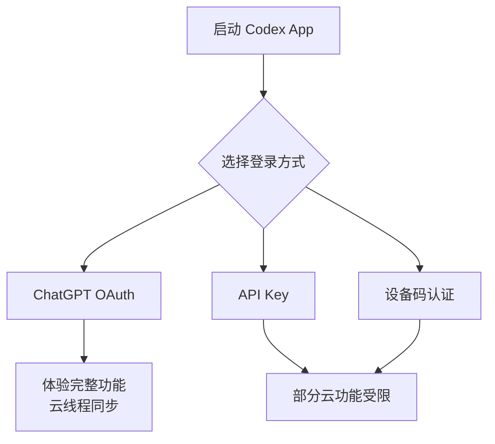
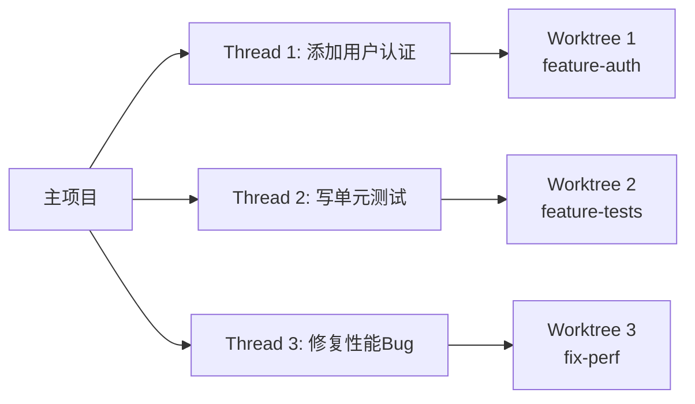
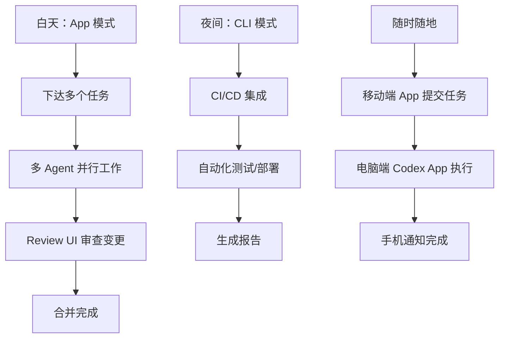

# 📱 Codex Desktop App 完整指南：安装 → 配置 → 高级运用 → 项目实战

> ⏱ 预计学习时间：6个番茄钟（约2.5小时）
> 🧠 类型：独立参考文档，可与 Day 1-7 配合使用
> 📅 更新日期：2026-06-11

---

## 为什么需要单独学 Codex App？

CLI 和 Desktop App 共享同一个 Agent 引擎，但 **交互范式的差异巨大**：

```
CLI 模式：
  你在终端里 → 打字 → Codex 干活 → 看文字反馈
  适合：脚本化、CI/CD、终端的"心流"体验

App 模式：
  你在 GUI 中 → 下任务 → 多个 Agent 并行工作 → 可视化审查
  适合：多任务并行、图形化审查、GUI 自动化、非开发者
```

**核心差异一句话：CLI 是指令终端，App 是指挥中心。**

---

## 番茄钟1：App 安装与配置（25分钟）

### 1.1 系统要求

| 平台 | 要求 | 说明 |
|:-----|:-----|:------|
| **macOS** | macOS 14+（Sonoma 或更高） | Apple Silicon M1-M4 推荐；Intel Mac 需 x86 二进制 |
| **Windows** | Windows 11（推荐）；10 v1809+ | 原生支持，不依赖 WSL2 |
| **内存** | 最低 8GB，推荐 16GB+ | 多 Agent 并行时内存消耗大 |
| **网络** | 稳定互联网连接 | 需要连接 OpenAI API |
| **订阅** | ChatGPT Plus ($20/月) 或更高 | 免费/Go 用户限时有限访问 |

### 1.2 安装方式大全

#### macOS

```bash
# 方式一：App Store（最推荐）
# 打开 App Store → 搜索 "Codex" → 获取

# 方式二：Homebrew Cask
brew install --cask codex

# 方式三：官方安装脚本
curl -fsSL https://chatgpt.com/codex/install.sh | sh

# 方式四：手动下载 DMG
# 访问 https://openai.com/codex/download
# 如遇安全提示：
xattr -d com.apple.quarantine /Applications/Codex.app
```

#### Windows

```powershell
# 方式一：Microsoft Store（最推荐）
# 打开 Microsoft Store → 搜索 "Codex" → 获取

# 方式二：winget
winget install Codex -s msstore --accept-source-agreements --accept-package-agreements

# 方式三：GitHub Release
# 下载 https://github.com/openai/codex/releases 的最新 .exe
```

### 1.3 登录认证

启动 App 后，需要登录：



**推荐使用 ChatGPT OAuth 登录**，可获得云线程同步、配置备份等完整功能。

### 1.4 设置中文界面

```
File → Settings → General → Language for the app UI → 中文 (China)
```

切换后需联网下载语言包，重启生效。

### 1.5 首日启动流程

```
1. 启动 App → 选择/创建项目目录
2. App 自动扫描代码库（建立索引）
3. 显示项目概览：文件数、语言分布、代码行数
4. 在对话输入框中下达第一个任务
5. 观察 Agent 工作 → Review UI 审查变更
```

> ✋ **费曼自测**：App 安装完成后，启动它并完成一次项目扫描。对比 CLI 的启动体验，App 多了什么、少了什么？

---

## 番茄钟2：App 界面与交互（25分钟）

### 2.1 界面布局

```
┌─────────────────────────────────────────────────────────────┐
│  Codex App                                   用户头像 | 设置 │
├───────────────────┬─────────────────────────────────────────┤
│                   │                                         │
│  左侧面板         │  主工作区                               │
│  ┌─────────────┐  │  ┌──────────────────────────────────┐  │
│  │ 项目列表     │  │  │  对话/审查/Worktree 内容          │  │
│  │ ├─ my-project│  │  │                                  │  │
│  │ │  ├─ Thread1│  │  │  [Agent 消息]                    │  │
│  │ │  ├─ Thread2│  │  │  [代码 Diff]                     │  │
│  │ │  └─ Thread3│  │  │  [审查操作按钮]                   │  │
│  │ └─────────────│  │  └──────────────────────────────────┘  │
│  │               │  │                                         │
│  │  [New Thread] │  │  底部：输入框                           │
│  │  [Automations]│  │  ┌──────────────────────────────┐      │
│  │  [Skills]   │  │  │  Describe what you want... │      │
│  └───────────────┘  │  └──────────────────────────────┘      │
│                     │                                         │
└─────────────────────┴─────────────────────────────────────────┘
```

### 2.2 核心区域说明

| 区域 | 功能 |
|:-----|:------|
| **左侧面板** | 项目列表、Thread 管理、Worktree 切换、Automations、Skills 库 |
| **主工作区** | 对话记录、代码审查 Diff、Agent 状态更新 |
| **底部输入框** | 输入任务描述、支持 `/` 命令 |
| **右上设置** | 模型切换、权限控制、语言、主题 |

### 2.3 Thread（线程）系统

**Thread 是 App 的核心组织单元**——每个 Thread 是一个独立的 Agent 会话：



| Thread 特性 | 说明 |
|:------------|:------|
| **独立上下文** | 每个 Thread 有独立的对话历史和代码上下文 |
| **独立 Worktree** | 每个 Thread 默认在独立 Worktree 中工作 |
| **独立终端** | Cmd+J 打开 Thread 专属终端（运行测试、启动服务） |
| **独立 Sandbox** | 每个 Thread 可设置不同的权限级别 |
| **可存档** | 完成后可归档，Worktree 自动清理 |

### 2.4 创建你的第一个 Thread

```markdown
1. 打开 Codex App
2. 点击左侧面板的 "New Thread"（或 Cmd+N）
3. 输入你的第一个任务：
   "阅读当前项目，总结它的架构和功能"
4. 观察 Agent 如何工作：
   - 扫描目录结构
   - 读取关键文件
   - 生成分析报告
5. 审查输出结果
```

> ✋ **费曼自测**：Thread 系统和 CLI 的单会话模式相比，最大的优势是什么？什么场景下你会同时开多个 Thread？

---

## 番茄钟3：Worktree 系统深入（25分钟）

### 3.1 用大白话理解 Worktree

**没有 Worktree 的问题：**

```
你在 main 分支上工作
Agent A 说"我要改 auth.ts"
Agent B 也说"我要改 auth.ts"
→ 冲突！谁先改？谁后改？改坏了谁的？
→ 你必须等一个做完再做下一个
```

**有了 Worktree：**

```
你的 main 分支：不动
Agent A 的 Worktree（feature-auth）：独立副本 ← 随便改
Agent B 的 Worktree（fix-perf）：独立副本 ← 随便改
→ 没有冲突！各自在各自的"平行宇宙"里工作
→ 审查满意后才合并到你的主目录
```

### 3.2 Worktree 的工作原理

```
Git 仓库
├── .git/                     ← 共享 Git 对象存储
├── main/                     ← 你的主工作目录
├── .worktrees/
│   ├── feature-auth/         ← Agent A 的独立副本
│   │   ├── src/
│   │   ├── package.json
│   │   └── ... (完整副本)
│   ├── fix-perf/            ← Agent B 的独立副本
│   └── ...
```

**关键技术：** 基于 Git Worktree 实现，每个 Worktree 共享 `.git` 对象存储但有自己的工作目录和索引。

### 3.3 Worktree 的三种创建方式

```bash
# 方式一：App 中自动创建（推荐）
# 新建 Thread 时自动创建 Worktree

# 方式二：CLI 命令创建
codex /fork "feature-auth"    # 创建 Worktree 并切换

# 方式三：CLI 参数创建
codex --fork "feature-auth" "实现 OAuth 登录"

# 方式四：手动创建 Worktree Thread
# 在 App 中：右键 Thread → Switch to Worktree → New
```

### 3.4 Worktree 实战工作流

```
典型的多 Agent 并行工作流：

1️⃣  你在 App 中打开项目 my-app
2️⃣  创建 Thread 1："添加 Stripe 支付集成"
     → 自动创建 worktree: .worktrees/stripe-payment
3️⃣  创建 Thread 2："优化数据库查询"
     → 自动创建 worktree: .worktrees/db-optimize
4️⃣  两个 Agent 同时工作，互不干扰
5️⃣  Thread 1 完成后，Review UI 审查变更
6️⃣  审查通过 → 合并到主目录
7️⃣  Thread 2 完成后，同样审查 → 合并
8️⃣  两个功能并行完成，零冲突
```

### 3.5 Worktree 最佳实践

| 实践 | 说明 |
|:-----|:------|
| **一个 Thread 一个功能** | 保持 Worktree 粒度单一，便于审查和合并 |
| **及时归档** | 完成后归档 Thread，Worktree 自动清理 |
| **注意磁盘空间** | 每个 Worktree 复制 node_modules/ 等依赖，大项目注意空间 |
| **不要手动编辑 Worktree** | 在 Worktree 中手改的代码不会被 Agent 感知 |
| **Pinned Worktree** | 需要长期保留的 Worktree 可 Pin 住，避免自动清理 |

> ✋ **费曼自测**：Worktree 解决了"人机协作"中的什么问题？如果三个 Agent 需要改同一个配置文件，Worktree 能解决冲突吗？

---

## 🍅 番茄钟1-3结束，休息5分钟

**核心概念回顾：**
- [ ] App 的四种安装方式（App Store/Homebrew/winget/手动）
- [ ] Thread = 独立 Agent 会话，每个 Thread 有独立上下文
- [ ] Worktree = 基于 Git 的独立工作副本，多 Agent 并行零冲突

---

## 番茄钟4：Review UI — 可视化代码审查（25分钟）

### 4.1 为什么需要 Review UI？

```
CLI 审查：
  /diff → 终端里看文字 diff → 确认/拒绝
  问题：大 diff 看得眼睛疼，没法逐行评论

App 审查：
  图形化 diff 视图 → 点击接受/拒绝 → 可逐行评论
  优势：像 GitHub PR Review 一样直观
```

### 4.2 Review UI 功能详解

```
┌─────────────────────────────────────────────────────────────┐
│  Review: Thread 1 - "添加 Stripe 支付"                       │
├─────────────────────────────────────────────────────────────┤
│  Files changed (3)                          [Accept All]    │
│                                                             │
│  ☑ src/services/payment.ts  (+120/-30)                     │
│  ┌─────────────────────────────────────────────────────────┐│
│  │ - old code                          ← 红色：删除        ││
│  │ + new code                          ← 绿色：新增        ││
│  │                                     ← 可逐行点击评论    ││
│  └─────────────────────────────────────────────────────────┘│
│                                                             │
│  ☐ src/config/stripe.ts  (+45/-0)                          │
│  ☐ src/__tests__/payment.test.ts  (+200/-0)                │
│                                                             │
│  [Approve & Merge]  [Approve]  [Request Changes]  [Discard] │
└─────────────────────────────────────────────────────────────┘
```

| 功能 | 操作 |
|:-----|:------|
| **逐行审查** | 点击代码行查看详细 Diff |
| **行内评论** | 点击行号添加评论，Agent 可回复 |
| **接受/拒绝** | 每个文件/每个 Hunk 独立审批 |
| **全部接受** | 审查满意后一键合并 |
| **请求修改** | 标注问题，Agent 自动重新修改 |
| **放弃更改** | 整个 Thread 的改动全部丢弃 |

### 4.3 安全审查循环

OpenAI 推荐的 App 安全工作流：

```
1. 下达任务 → Agent 在 Worktree 中工作
2. 完成通知 → Review UI 中显示变更
3. 审查 Diff → 逐行检查每处改动
4. 运行测试 → Thread 终端中运行测试（Cmd+J）
5. 批准/修改 → 满意则合并，不满意则标注修改
6. 合并完成 → 变更写入本地 Git 仓库
```

> Codex **不会**自动触及你的本地 Git 状态——直到你在 Review UI 中显式合并。

### 4.4 审查最佳实践

**✅ 审查时关注：**
- 逻辑正确性（AI 容易犯逻辑错误）
- 边界条件（空值、异常）
- 安全漏洞（SQL 注入、XSS、硬编码）
- API 兼容性（改动是否破坏现有接口）
- 测试是否充分

**❌ 不需要关注的（交给 AI）：**
- 语法错误（AI 很少犯）
- 代码格式（交给格式化工具）
- 简单命名（可以信任 AI 的命名）

> ✋ **费曼自测**：人类审查者和 AI 审查者各有什么优势？Review UI 是怎么帮助人类发挥优势的？

---

## 番茄钟5：Computer Use 与内置浏览器（25分钟）

### 5.1 Computer Use 是什么？

**用大白话讲：** Codex App 能像人一样"看"你的电脑屏幕，然后操作鼠标和键盘。

```
你说："帮我测试这个登录页面的注册流程"

Codex 会：
  → 打开你的浏览器
  → 导航到 localhost:3000/register
  → 填写表单（姓名、邮箱、密码）
  → 点击"注册"按钮
  → 截图结果给你看
  → 报告测试是否通过
```

### 5.2 Computer Use 的技术原理

```
Codex App
  ├── 截图模块 → 每 2-5 秒截图一次
  ├── 视觉理解 → AI 识别屏幕上的按钮/输入框
  ├── 动作规划 → 决定下一步操作（点击/输入/滚动）
  └── 执行器 → 通过系统 Accessibility API 执行
```

**限制说明：**
- 仅 macOS 支持（Windows 版本开发中）
- 欧盟/英国/瑞士暂不支持
- 仅前台应用（不能控制后台不可见窗口）
- 每个动作需用户可见，不会"偷偷操作"

### 5.3 Computer Use 实用场景

| 场景 | 示例 Prompt | 效果 |
|:-----|:------------|:------|
| **UI 测试** | "打开 localhost:3000，测试注册流程" | 自动填表+截图验证 |
| **跨应用操作** | "把 Figma 设计稿的配色提取出来生成 CSS 变量" | AI 看设计→写代码 |
| **软件配置** | "打开系统偏好设置，帮我配置代理" | 自动点击设置项 |
| **应用测试** | "测试 macOS 计算器的所有功能" | 自主探索式测试 |
| **Bug 复现** | "模拟用户在设置页修改密码的操作步骤" | 录制操作序列 |

### 5.4 内置浏览器

App 内置浏览器让 Codex 可以直接"看"网页：

```
你： "把我们的网站首页和竞品的首页做个对比分析"

Codex：
  1. 在内置浏览器中打开你的网站
  2. 截图分析页面结构和设计
  3. 打开竞品网站
  4. 生成对比分析报告
```

**Chrome 扩展联动（2026.05+）：**
- 在任意网页上右键 → "Ask Codex"
- Codex 读取当前页面内容作为上下文
- 可在后台操作网页（填表、爬数据）

### 5.5 实战：用 Computer Use 做 B 站视频分析

```markdown
在 Codex App 中输入：

"打开 B 站，搜索 'Codex CLI 教程'，
  列出前 10 个视频的标题、播放量和发布时间，
  分析这些视频的共性主题，
  生成一份内容创作建议报告"
```

Codex 会：
1. 打开内置浏览器 → 访问 bilibili.com
2. 搜索关键词
3. 提取结果数据
4. 总结分析

> ✋ **费曼自测**：Computer Use 最让你兴奋的应用场景是什么？它和传统 API 集成的方式相比，有什么根本不同？

---

## 🍅 番茄钟4-5结束，休息5分钟

**核心概念回顾：**
- [ ] Review UI = 可视化 Diff 审查，类似 GitHub PR Review
- [ ] 安全闭环：Worktree 工作 → Review 审查 → 合并
- [ ] Computer Use = AI 能"看"屏幕 + 操作鼠标键盘
- [ ] 内置浏览器 + Chrome 扩展 = AI 能理解网页内容

---

## 番茄钟6：Automations 与 Skills（25分钟）

### 6.1 Automations（自动化工作流）

**Automations** 是 Codex App 的"定时任务"系统——无需手写 Cron 脚本。

**配置界面：**

```
Automations
├── Daily CI Check
│   ├── 触发：每天 9:00
│   ├── 动作：检查 CI 运行结果，报告失败
│   └── 输出：Review Queue 中查看
├── Weekly Dependency Audit
│   ├── 触发：每周一 10:00
│   ├── 动作：检查依赖更新和安全告警
│   └── 输出：生成审计报告
└── PR Triage
    ├── 触发：每当有新的 PR 提交
    ├── 动作：自动分析 PR 并添加标签
    └── 输出：Review Queue 中显示
```

**Automation 类型：**

| 类型 | 触发方式 | 示例 |
|:-----|:---------|:-----|
| **定时** | Cron 表达式 | 每天 9 点检查 CI |
| **事件** | Git 事件 | 新 PR 时自动审查 |
| **手动** | 手动点击 | "运行安全检查" |

**安全原则：**
- 默认**只读**——Automation 只能执行读操作
- 需要写操作 → 显式授权
- 不能自动发送消息、自动合并 PR

### 6.2 App 中的 Skills

**Skills** 在 App 中有专门的 UI 界面：

```
Skills Library
├── 🚀 Deploy to Vercel
├── 🔍 Security Audit
├── 📝 Generate Changelog
├── 🧪 Test Generation
├── 🎨 Figma to Code
├── 🐛 Bug Report Analysis
├── 📊 Performance Review
└── 📦 Dependency Audit
```

**安装 Skills：**

```
方法一：内置 Skills 库
  App → Skills → Browse → Install

方法二：从 GitHub 安装
  App → Skills → Import from GitHub → 输入仓库 URL

方法三：手动创建
  App → Skills → Create New → 编辑 SKILL.md

方法四：社区市场
  Awesome Codex Skills: https://github.com/ComposioHQ/awesome-codex-skills
```

### 6.3 App 插件系统（90+ 插件）

2026 年 Codex 拥有 **90+ 官方插件**：

| 类别 | 插件 |
|:-----|:------|
| **开发者工具** | GitHub、GitLab Issues、CircleCI、CodeRabbit、JIRA |
| **设计与创意** | Figma、Canva、Shutterstock、Picsart |
| **生产力** | Slack、Notion、Gmail、Google Sheets、Microsoft Office |
| **数据分析** | Snowflake、Databricks、Tableau、Hex |
| **销售** | Salesforce、HubSpot、Outreach |
| **金融** | S&P、PitchBook、Moody's |

**安装插件：** App → Settings → Plugins → Browse Marketplace

### 6.4 6 大角色插件包（2026.06 重磅更新）

OpenAI 在 2026 年 6 月发布了 **6 个面向非技术用户的职业插件包**：

| 角色 | 集成工具 | 使用场景 |
|:-----|:---------|:---------|
| 📊 **数据分析师** | Snowflake、Databricks、Tableau | 自动生成 SQL、可视化报告 |
| 🎨 **创意/营销** | Figma、Canva、Shutterstock | 简报→广告创意一键生成 |
| 💼 **销售** | Salesforce、HubSpot、Slack | CRM 数据分析、客户跟进 |
| 🏗️ **产品设计** | Figma、Canva | PRD→交互式原型 |
| 📈 **投行/研究** | Moody's、FactSet、S&P | 财务建模、尽调报告 |
| 🏥 **医疗** | EHR 系统 | 病历分析、合规检查 |

> ✋ **费曼自测**：Automations 和 Skills 有什么区别？插件系统和 Skills 系统又有什么区别？

---

## 番茄钟7：App 实战项目（25分钟）

### 7.1 项目：并行开发 + 可视化审查

**场景：** 为一个 Node.js Web 应用同时添加三个功能

**Step 1：创建三个 Worktree Thread**

```
Thread 1: "添加用户注册/登录 API（JWT 认证）"
Thread 2: "添加数据导出功能（CSV/Excel）"
Thread 3: "添加管理员仪表盘统计 API"
```

**Step 2：下达任务**

```
每个 Thread 分别下达：

Thread 1:
  "在 Express 中添加用户注册和登录 API：
   - POST /api/auth/register
   - POST /api/auth/login
   - JWT token 认证
   - 密码 bcrypt 加密
   - 输入验证（Zod）
   完成后运行 npm test 验证"

Thread 2:
  "添加数据导出功能：
   - GET /api/export/csv
   - GET /api/export/excel
   - 支持日期范围过滤
   使用 json2csv 和 exceljs 库"
```

**Step 3：审查变更**

```
每个 Thread 完成后，Review UI 会显示变更：
  → 逐文件查看 Diff
  → 在行内添加评论
  → 运行测试（Cmd+J 打开 Thread 终端）
  → 批准或要求修改
```

**Step 4：合并完成**

```
审查通过后，点击 "Approve & Merge"
变更自动合并到你的主目录
```

### 7.2 项目：Computer Use 自动化测试

**场景：** 用 Computer Use 测试 Web 应用 UI

```markdown
在 Codex App 中：

1. 启动本地开发服务器
2. 创建新的 Thread
3. 输入：
   "打开 localhost:3000，
    - 测试用户注册流程
    - 测试登录流程
    - 测试密码重置流程
    每一步截图保存到 screenshots/ 目录
    最后生成测试报告"
```

**Codex 会做的事：**
1. 打开内置浏览器 → 访问 localhost:3000
2. 模拟用户操作（点击、输入、提交）
3. 每一步截图
4. 发现 Bug 时自动记录
5. 生成完整测试报告

### 7.3 项目：Sites 功能——文档秒变网页

**Sites 功能**（2026.05，Business/Enterprise）让你一句话创建可分享的网页：

```markdown
在 Codex App 中输入：

"把项目的 README.md 变成一个交互式文档网站，
  包含：
  - 自动生成的导航目录
  - 代码语法高亮
  - 搜索功能
  - 响应式设计
  部署为一个可分享的 URL"
```

特点：
- 生成永久 URL，可直接发给团队/客户
- 支持数据看板、文件分享、原型展示
- 无需手动配置服务器或域名

### 7.4 App 与 CLI 的协作流程



**无缝切换：** CLI 会话中输入 `/app` 即可跳转到 App 界面，上下文不丢失。

> ✋ **费曼自测**：结合你的日常工作流，设计一个"App + CLI + 移动端"的组合使用方案。

---

### 刻意练习——App 核心功能操作

**练习目标**：在 25 分钟内，完成 App 三大核心功能的操作练习：多线程任务管理、可视化代码审查、Plugin 配置与 Computer Use

**任务序列（重复×3）：**

```
===== 循环 1：多线程任务管理 =====
1. 在 App 中创建 3 个 Thread，每个 Thread 分配一个不同的功能任务
2. 在每个 Thread 中观察 Agent 在独立 Worktree 中工作
3. 在 Thread 间切换，查看各自的进度和输出
验证方式：3 个 Thread 各自在独立 Worktree 中并行工作，互不干扰

===== 循环 2：可视化代码审查 =====
1. 选择一个 Thread 完成后，打开 Review UI
2. 逐行审查至少 3 个文件的变更 Diff
3. 在至少一处添加行内评论，然后点击 "Approve & Merge"
验证方式：成功完成一次完整的 Worktree → Review → Merge 流程

===== 循环 3：Plugin 配置与 Computer Use =====
1. 在 App 中安装一个 Plugin（如 GitHub 或 Figma）
2. 尝试使用 Computer Use 操作本地浏览器（如打开一个网页并截图）
3. 记录操作过程和结果
验证方式：Plugin 安装成功 + Computer Use 至少完成一个屏幕操作
```

**自检清单：**

| 技能 | 1次 | 2次 | 3次 |
|:-----|:---:|:---:|:---:|
| 创建和管理 Thread | ⬜ | ⬜ | ⬜ |
| 使用 Review UI 审查代码 | ⬜ | ⬜ | ⬜ |
| 安装 Plugin 和使用 Computer Use | ⬜ | ⬜ | ⬜ |

> ✋ **费曼自测**：App 的 Thread + Worktree 系统与 CLI 的单一会话模式相比，最大的效率提升在哪里？什么场景下你一定会选择 App 而不是 CLI？

---

## 番茄钟8：App 设置与最佳实践（25分钟）

### 8.1 App 设置详解

```
File → Settings:

General
├── Language: 中文 / English
├── Theme: Light / Dark / System
├── Font Size: 12-20
└── Notifications: On/Off

Model
├── Default Model: o4-mini / gpt-5.5 / o3
├── Reasoning Effort: Low / Medium / High
└── Temperature: 0.0-1.0

Permissions
├── Default Approval: Suggest / Auto Edit / Full Auto
├── Sandbox Mode: workspace-write / read-only / danger-full-access
└── Network Access: Allowed / Blocked / Ask

Worktree
├── Auto-clean on Archive: On/Off
├── Default Branch: main / current
└── Max Worktrees: 5 / 10 / Unlimited
```

### 8.2 App 安全设置建议

| 级别 | 适用场景 | Sandbox | 审批模式 | 网络 |
|:-----|:---------|:--------|:---------|:-----|
| 🟢 **安全** | 生产环境仓库 | read-only | Suggest | Blocked |
| 🟡 **标准** | 本地开发 | workspace-write | Auto Edit | Ask |
| 🔴 **全开** | 个人/沙箱项目 | danger-full-access | Full Auto | Allowed |

### 8.3 效率技巧

| 技巧 | 说明 |
|:-----|:------|
| **Cmd+N 快速建 Thread** | 每个新功能开一个新 Thread |
| **Cmd+J 开终端** | 每个 Thread 都有独立终端 |
| **Shift+Cmd+A** | 打开 Automations 面板 |
| **Skills 快捷键** | 设置常用 Skills 的快捷键 |
| **Drag & Drop 文件** | 拖入文件作为上下文 |
| **截图粘贴** | 粘贴 Bug 截图让 Codex 理解问题 |
| **Appshots** | 保存当前 App 状态快照，稍后恢复 |

### 8.4 App 常见问题排查

| 问题 | 原因 | 解决方案 |
|:-----|:------|:---------|
| App 启动闪退 | 系统版本过低 | 升级到 macOS 14+ / Windows 11 |
| 中文界面未生效 | 需联网下载语言包 | 检查网络，重启应用 |
| Worktree 创建失败 | Git 未配置 | `git config user.name/email` |
| Computer Use 不可用 | 地区限制 | EU/UK/CH 暂不支持 |
| Agent 不工作 | API 额度用完 | 检查 ChatGPT 订阅状态 |
| Thread 太多卡顿 | 内存不足 | 归档不用的 Thread |
| 插件搜索不到 | 地区或订阅限制 | 检查 Business/Enterprise 订阅 |

### 8.5 App 选择决策树

```
我应该用 App 还是 CLI？
          │
          ├── 我需要同时做多个任务？
          │   ├── 是 → App（Worktree 多线程）
          │   └── 否 ↓
          │
          ├── 我需要图形化审查代码？
          │   ├── 是 → App（Review UI）
          │   └── 否 ↓
          │
          ├── 我需要 GUI 自动化/看网页？
          │   ├── 是 → App（Computer Use + 内置浏览器）
          │   └── 否 ↓
          │
          ├── 我是 CI/CD 集成？
          │   ├── 是 → CLI（codex exec --json）
          │   └── 否 ↓
          │
          ├── 我喜欢键盘流/终端的专注感？
          │   ├── 是 → CLI
          │   └── 否 → App（或两者都用）
```

---

## 附录：App 命令与操作速查

### 启动与导航

| 操作 | 功能 |
|:-----|:------|
| `codex app` | 启动桌面 App |
| `codex app /path/to/project` | 指定项目启动 |
| `codex /app` | CLI 中切换到 App |
| Cmd+N | 新建 Thread |
| Cmd+J | 打开/关闭 Thread 终端 |
| Cmd+W | 关闭当前 Thread |
| Cmd+, | 打开设置 |

### App 专属功能

| 功能 | 入口 | 说明 |
|:-----|:------|:------|
| **Worktree** | 自动/`/fork` | 独立工作副本 |
| **Review UI** | Thread 完成后自动显示 | 图形化 Diff 审查 |
| **Computer Use** | Prompt 中描述 GUI 操作 | AI 控制屏幕 |
| **内置浏览器** | App 内 Tab | AI 可见的浏览器 |
| **Automations** | 左侧面板 | GUI 定时任务 |
| **Skills** | 左侧面板 | 可复用工作流 |
| **Plugins** | 设置面板 | 第三方集成 |
| **Sites** | Prompt 描述 | 文档→网页应用 |
| **Appshots** | 右上菜单 | 保存状态快照 |

---

## 学习自检清单

- [ ] **番茄1**：App 安装完成，成功登录
- [ ] **番茄2**：理解 Thread 系统，创建了第一个 Thread
- [ ] **番茄3**：理解 Worktree 原理，用多个 Thread 并行工作
- [ ] **番茄4**：使用 Review UI 审查变更并合并
- [ ] **番茄5**：体验 Computer Use 或内置浏览器
- [ ] **番茄6**：配置了一个 Automation 或安装了 Skills/插件
- [ ] **番茄7**：完成了至少一个 App 实战项目
- [ ] **番茄8**：掌握了 App 设置和最佳实践

---

> **相关文件：**
> - [[README]] - 教程总览
> - [[Day1-入门与基础]] - CLI 安装与基础
> - [[Day5-高级特性与工作流]] - SDK 与多 Agent
> - [[Day7-精通与生态]] - Skills 开发与插件
