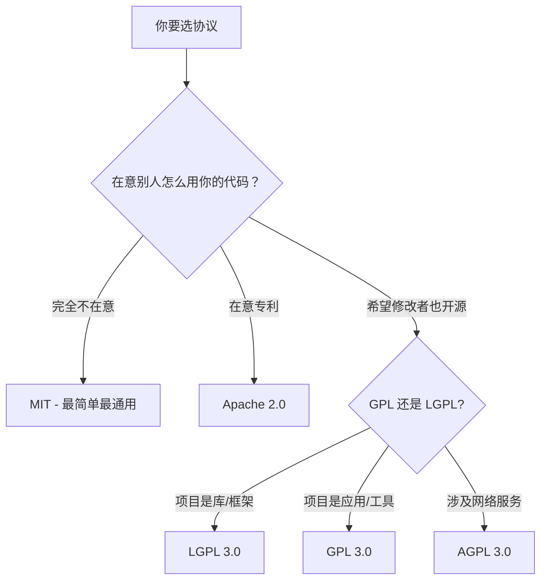

# Day 6：实战项目二 - 开源贡献实战

> ⏱ 预计学习时间：8个番茄钟（约3.5小时）
> 🎯 学习目标：为真实开源项目贡献代码
> 🧠 教学方法：费曼学习法 × 刻意练习
> 🎯 刻意练习重点：Fork→PR→Review→Merge 全流程

---

## 今日学习路径

```
🍅 番茄1-2：理解开源协作模式 + 协议选择
🍅 番茄3-4：Fork → PR 完整操作流程
🍅 番茄5-6：【刻意练习】Fork→PR→Review→Merge 全流程模拟
🍅 番茄7-8：复习巩固 + 输出成果
```

---

## 番茄钟1：开源协作模式（25分钟）

### 1.1 用大白话理解开源

**开源是什么？**

想象你盖了一栋房子，你把设计图纸公开了：

```
闭源（你的私人别墅）：
  - 只有你能进去看
  - 别人想改？不行
  - 别人想复制？违法

开源（你的共享社区）：
  - 谁都能来看图纸
  - 谁都能提建议改设计
  - 但改了想合并回来需要你审核
  - 别人可以用你的设计盖自己的房子（遵守规则的话）
```

**开源不是"免费"的同义词**，它是一种**协作模式**。

### 1.2 开源贡献全景图

贡献开源不只是写代码。在你的第一个 PR 之前，先建立全景认知：

```
开源贡献金字塔
            ╱  ╲
          ╱ 核心维护  ╲         ← 1% 的人
        ╱  频繁贡献者  ╲       ← 5% 的人
      ╱   偶尔贡献者   ╲      ← 15% 的人
    ╱     Issue 报告   ╲     ← 30% 的人
  ╱      文档/翻译/回答 ╲    ← 49% 的人
```

**贡献开源的方式（按难度递增）：**

| 贡献类型 | 难度 | 需要技能 | 适合新手？ |
|:---------|:-----|:---------|:-----------|
| ⭐ 点 Star / 分享项目 | ★☆☆ | 无 | ✅ 完美 |
| 📝 修复文档错别字 | ★☆☆ | 英语/写作 | ✅ 最佳起点 |
| 🐛 报告 Bug（提 Issue） | ★☆☆ | 问题描述能力 | ✅ |
| 💬 帮别人回答问题 | ★★☆ | 领域知识 | ✅ |
| 🌐 翻译文档 | ★★☆ | 双语能力 | ✅ |
| 🔧 修复简单 Bug | ★★★ | 编程基础 | ✅ |
| ✨ 添加小功能 | ★★★★ | 编程 + 项目理解 | ⚠️ 需熟悉项目 |
| 🏗️ 大功能/重构 | ★★★★★ | 深度领域知识 | ❌ 需先积累 |
| 👑 成为维护者 | ★★★★★★ | 社区管理 + 技术领导力 | ❌ |

> 💡 **新手策略：从左边开始，别一上来就写代码。** 很多人的第一个开源贡献是修了一个 README 里的拼写错误——这完全合理且值得鼓励！

### 1.3 Fork & PR 协作模型

这是开源协作的**标准流程**，也是今天学的核心：

```
                   ┌─────────────────┐
                   │  上游仓库 (Upstream)  │  ← 官方的、权威的
                   │  owner/repo       │
                   └────────┬────────┘
                            │ Fork（分叉）
                            ▼
                   ┌─────────────────┐
                   │  你的 Fork       │  ← 你 GitHub 账号下的副本
                   │  yourname/repo   │
                   └────────┬────────┘
                            │ Clone（克隆到本地）
                            ▼
                   ┌─────────────────┐
                   │  本地仓库         │  ← 你电脑上的代码
                   └────────┬────────┘
                            │ 创建功能分支
                            ▼
                   ┌─────────────────┐
                   │  feature-branch  │  ← 在这个分支上修改
                   └────────┬────────┘
                            │ 修改 → 提交 → 推送
                            ▼
                   ┌─────────────────┐
                   │  你的 Fork (远程) │  ← feature-branch
                   └────────┬────────┘
                            │ Pull Request
                            ▼
                   ┌─────────────────┐
                   │  上游仓库         │  ← 维护者审核
                   │  PR #123          │
                   └─────────────────┘
```

> 对比 Day 2 学的**同仓库协作**（直接在同一个仓库开分支），**开源协作**多了一步 Fork 因为你没有上游仓库的写入权限。

### 1.4 Fork 和 Clone 的区别

很多人搞混，这里彻底讲清楚：

| 操作 | 发生在哪 | 结果 | 权限 |
|:-----|:---------|:-----|:-----|
| **Fork** | GitHub 网页 | 你账号下多了一个仓库副本 | 你对 Fork 有写权限 |
| **Clone** | 终端 | 你电脑上多了一个本地仓库 | 读写本地文件 |

> ✋ **费曼自测**：用"复印一本书"和"借阅一本书"的类比来解释 Fork 和 Clone 的区别。为什么在开源世界需要 Fork 而不是直接 Clone 改完就提交？

---

## 番茄钟2：开源协议速览（25分钟）

### 2.1 为什么需要开源协议？

**没有协议 = 默认保留所有权利**

这是一个很多人不知道的关键点：
- 你在 GitHub 上公开了代码，**不等于**别人可以自由使用
- 没有附上开源协议，法律上别人**不能**复制、修改、分发你的代码
- 所以给项目加协议不是"形式主义"，是**法律基础**

### 2.2 六大常见协议速览

```
宽松 ← ─ ─ ─ ─ ─ ─ ─ ─ ─ ─ ─ ─ → 严格

MIT → Apache 2.0 → BSD → LGPL → GPL 3.0 → AGPL 3.0
(最自由)                               (最"传染")
```

### 2.3 核心区别一张表

| 协议 | 一句话总结 | 商用允许？ | 修改后闭源？ | 必须开源？ | 必须注明作者？ | 适合场景 |
|:-----|:-----------|:----------:|:------------:|:----------:|:--------------:|:---------|
| **MIT** | "你想怎样都行，只要提一下我就行" | ✅ | ✅ | ❌ | ✅ | 绝大多数项目首选 |
| **Apache 2.0** | "和 MIT 差不多，再加专利保护" | ✅ | ✅ | ❌ | ✅ | 涉及专利的企业项目 |
| **BSD 3-Clause** | "MIT 的亲戚，加个不许用我的名字打广告" | ✅ | ✅ | ❌ | ✅ | 学术项目 |
| **LGPL 3.0** | "你改了核心库要开源，但调用可以闭源" | ✅ | ⚠️ 改库需开源 | ⚠️ 改核心才会触发 | ✅ | 库/框架类项目 |
| **GPL 3.0** | "你用了我，你就得也开源"（传染性） | ✅ | ❌ 必须开源 | ✅ 整个项目必须开源 | ✅ | 希望推动开源生态 |
| **AGPL 3.0** | "GPL + 网络使用也算分发" | ✅ | ❌ | ✅ 网络服务也算 | ✅ | 云服务/后端项目 |

### 2.4 快速选择指南



> 💡 **新手建议**：如果你的项目没有特殊需求，**选 MIT**。Simple, permissive, 全世界都在用。

### 2.5 如何给项目添加协议

```markdown
# 方法 1：在 GitHub 创建仓库时直接选
New Repository → 勾选 "Add a license" → 选择 MIT

# 方法 2：给已有仓库加协议
# 在项目根目录创建 LICENSE 文件，内容从以下地址复制：
# https://choosealicense.com/
# 或者直接用 GitHub 网页：
# 仓库 → Add file → Create new file → 文件名输入 "LICENSE"
# GitHub 会自动提供模板选择
```

### 2.6 作为贡献者需要注意

**你提交到开源项目的代码，默认按项目的协议授权。**

这意味着：
- 你给 MIT 项目贡献的代码 = 按 MIT 协议授权
- 你给 GPL 项目贡献的代码 = 按 GPL 协议授权
- **不要**给 GPL 项目贡献你不希望被 GPL 传播的代码

> ✋ **费曼自测**：选 MIT 协议的项目，A公司拿来改成了闭源的商业产品，一分钱没给原作者——这合法吗？如果你不希望这种情况发生，应该选什么协议？

---

## 🍅 番茄钟1-2结束，休息5分钟

**验证清单：**
- [ ] 能说出 Fork 和 Clone 的区别
- [ ] 能解释为什么开源协议不是形式主义
- [ ] 能区分 MIT、Apache 2.0、GPL 3.0 的核心差异
- [ ] 知道新手贡献开源的 5+ 种方式（不仅限于写代码）

---

## 番茄钟3：Fork → PR 完整操作流程（25分钟）

### 3.1 找到你的第一个目标项目

**推荐的新手友好项目（2026）：**

| 项目 | 语言 | 推荐理由 | 新手任务类型 |
|:-----|:-----|:---------|:------------|
| **[first-contributions](https://github.com/firstcontributions/first-contributions)** | 无特定 | **专为第一次贡献设计**，有交互式教程 | 文档/简单操作 |
| **[freeCodeCamp](https://github.com/freeCodeCamp/freeCodeCamp)** | JavaScript/TypeScript | 大量 `help wanted` 标签，社区活跃 | 文档/翻译/简单 Bug |
| **[React](https://github.com/facebook/react)** | JavaScript/TypeScript | 有 `good first issue` 标签 | Bug 修复 |
| **[VS Code](https://github.com/microsoft/vscode)** | TypeScript | 有 `up-for-grabs` 标签，文档完善 | 文档/Bug 修复 |
| **[tensorflow](https://github.com/tensorflow/tensorflow)** | Python/C++ | `good first issue` + 详细贡献指南 | 文档/测试 |
| **[odoo](https://github.com/odoo/odoo)** | Python | 标签完备，社区大 | Bug 修复/翻译 |

**找项目的技巧：**

```bash
# 1. GitHub Explore → https://github.com/explore
# 2. 搜索 "good first issue" 标签
#    https://github.com/search?q=label%3A%22good+first+issue%22&type=Issues
# 3. 专门收集新手任务的网站：
#    - https://goodfirstissue.dev/
#    - https://up-for-grabs.net/
#    - https://contributor.ninja/
# 4. 在感兴趣的项目仓库内搜索
#    - Labels: `good first issue` / `help wanted` / `beginner friendly` / `easy`
```

### 3.2 Step-by-Step: Fork → PR 完整流程

我们用 **first-contributions** 作为练习项目（它是专门为新手第一次贡献设计的）。

**Step 1: Fork 项目**

```bash
# 1. 浏览器打开 https://github.com/firstcontributions/first-contributions
# 2. 点击右上角的 "Fork" 按钮
# 3. 选择 Fork 到你自己的账号
# 4. 完成后你会在自己的 GitHub 看到：
#    https://github.com/你的用户名/first-contributions
```

**Step 2: Clone 你的 Fork**

```bash
# 克隆你的 Fork（不是上游仓库！）
git clone git@github.com:你的用户名/first-contributions.git

# 进入目录
cd first-contributions
```

**Step 3: 添加上游仓库（upstream）**

这是**最关键也最容易被新手忽略**的一步！

```bash
# 添加上游仓库（原项目的地址）
git remote add upstream https://github.com/firstcontributions/first-contributions.git

# 查看所有远程仓库
git remote -v
# origin    → git@github.com:你的用户名/first-contributions.git (你的 Fork)
# upstream  → https://github.com/firstcontributions/first-contributions.git (官方仓库)
```

> ⚠️ **为什么需要 upstream？** 你 Fork 之后，官方仓库还在继续更新。如果不添加上游地址，你就无法同步官方的更新，你的 Fork 会越来越"落后"。

**Step 4: 创建功能分支**

```bash
# 永远不要在 main 分支上修改！
git checkout -b add-your-name
# 命名规则：用描述性的分支名
# 例如：fix-readme-typo, add-contributor-name, doc-update-install
```

**Step 5: 做修改**

```bash
# 这个项目的任务是：在 Contributors 列表中添加你的名字
# 编辑 Contributors.md 文件，加上你的名字
echo "- Your Name (@yourusername)" >> Contributors.md

# 或者用编辑器手动编辑
```

**Step 6: 提交**

```bash
# 查看修改
git status
git diff

# 暂存并提交
git add Contributors.md
git commit -m "添加贡献者：Your Name"
```

**Step 7: 推送到你的 Fork**

```bash
# 推送到 origin（你的 Fork）的 add-your-name 分支
git push origin add-your-name
```

**Step 8: 发起 Pull Request**

```bash
# 推送后终端会显示一个链接，点击打开
# 或者在浏览器手动操作：
# 1. 打开你的 Fork：https://github.com/你的用户名/first-contributions
# 2. 会看到一个黄色的提示框："add-your-name had recent pushes" → 点击 "Compare & pull request"
# 3. 或者手动切换到 add-your-name 分支 → 点击 "Contribute" → "Open Pull Request"
# 4. 填写 PR 描述（下面会详细讲怎么写）
# 5. 点击 "Create pull request"
```

**Step 9: 等待 Review**

PR 提交后，项目维护者会审核。你可能需要：
- 等待（有时是几小时，有时是几天）
- 回应评论
- 做修改

**Step 10（高级）：删除分支**

```bash
# PR 合并后，可以删除远程和本地分支
git push origin --delete add-your-name
git branch -d add-your-name
```

> ✋ **费曼自测**：不看笔记，写出 Fork→PR 的完整命令序列。`git remote add upstream` 这一步为什么重要？如果忘了会有什么后果？

---

## 番茄钟4：PR 沟通技巧 + 同步 Fork（25分钟）

### 4.1 怎么写一个好的 PR 描述

**坏的 PR 描述：**
```
标题：修复 bug
内容：（空白）
```

**好的 PR 描述模板：**

```markdown
## 摘要

[一句话说明这个 PR 做了什么]

## 相关 Issue

Fixes #123

## 变更内容

- [x] 添加了用户登录验证
- [x] 增加了错误处理逻辑
- [ ] 需要添加单元测试（后续 PR）

## 测试方式

1. 启动项目：`npm start`
2. 访问 `/login` 页面
3. 输入错误密码，应看到错误提示

## 截图（如果是 UI 变更）

[截图]

## 检查清单

- [ ] 代码通过了 lint 检查
- [ ] 新增代码有对应的测试
- [ ] 文档已更新（如需要）
- [ ] 自测通过
```

**PR 标题的黄金法则：**

```
[类型] 简短的描述（50字以内）

类型对照表：
  feat:    新功能      → "feat: 添加用户注册功能"
  fix:     Bug 修复    → "fix: 修复登录页面崩溃"
  docs:    文档更新    → "docs: 更新安装指南"
  refactor: 重构       → "refactor: 重构用户服务层"
  test:    测试相关    → "test: 添加登录模块单元测试"
  chore:   杂项        → "chore: 升级依赖版本"
```

### 4.2 如何回应 Review 反馈

这是很多新手最紧张的部分，其实有套路：

**心态准备：**
```
收到 Review 反馈 = 项目维护者在帮你提高代码质量
                 ≠ 针对你个人
                 ≠ 你的代码太烂
```

**常见 Review 场景应对：**

| Review 反馈 | 正确回应 | 错误回应 |
|:------------|:---------|:---------|
| "这里需要改 X" | 👍 好的我改了，请看下 | （沉默不回应） |
| "我觉得可以用 Y 方法" | "好思路！我试一下" 或 "我试了 Y 但遇到 Z 问题" | "我那样写也行啊" |
| "这里缺测试" | "已添加测试用例，覆盖率 ✓" | "这还要测吗？" |
| "PR 太大了，拆开" | "明白，我拆成两个 PR" | "懒得拆了就这样吧" |
| "这不符合项目规范" | "抱歉，我调整一下" | "我觉得我的方式更好" |
| "LGTM（Looks Good To Me）" | 🎉 谢了！ | （不需要再回复了） |

**Review 回复礼仪：**
```
👍 好的，已经按建议修改了。

→ 表示你接受了建议并改了
→ 维护者不需要再打开看

我试了一下这个方案，发现 X 问题。还有别的思路吗？

→ 有理有据地讨论，维护者会尊重
→ 但不要争论超过 2 轮，如果仍有分歧，听从维护者决定
```

### 4.3 同步 Fork 的两种方式

你的 Fork 会随时间落后于上游仓库。**在每次开新 PR 之前，先同步！**

**方式一：GitHub 网页（简易版，GitHub 2024+ 新功能）**

```bash
# 1. 打开你的 Fork 页面
# 2. 点击 "Sync fork" 按钮
# 3. 点击 "Update branch"
# 4. GitHub 会自动将上游的更新合并到你的 Fork
```

**方式二：命令行（推荐，更灵活）**

```bash
# 1. 切换到 main 分支
git checkout main

# 2. 从上游拉取更新
git fetch upstream

# 3. 将本地的 main 重置为上游的 main（完全一致）
git rebase upstream/main

# 4. 强制推送到你的 Fork
git push --force-with-lease origin main
```

**解释每一步做了什么：**
```
同步前：
  你的 Fork main:    A---B---C
  上游 main:         A---B---C---D---E
                                     
同步后：
  你的 Fork main:    A---B---C---D---E
  上游 main:         A---B---C---D---E
```

**⚠️ 很重要的注意事项：**
- 在同步前确保你的 main 分支**没有未合并的修改**
- 使用 `--force-with-lease` 而不是 `--force`（前者更安全）
- 如果上游做了 rebase/force push，你可能需要 `git fetch upstream && git reset --hard upstream/main`

### 4.4 保持分支整洁的最佳实践

```bash
# 在开新分支前，先同步 main
git checkout main
git fetch upstream
git rebase upstream/main
git push --force-with-lease origin main

# 从最新的 main 创建新分支
git checkout -b my-feature

# 在功能分支上工作
# ... 修改代码 ...

# 在提交 PR 前，如果有新的上游更新：
git fetch upstream
git rebase upstream/main  # 把上游更新"垫"在你的修改下面
# 需要 git push --force-with-lease（因为 rebase 修改了历史）

# 推荐避免：git merge upstream/main
# 这会产生合并提交，让 PR 历史变乱
```

> ✋ **费曼自测**：用"写论文"的类比解释 rebase 的作用。为什么 rebase 比 merge 更适合同步 Fork？使用 rebase 后为什么要 force push？

---

## 🍅 番茄钟3-4结束，休息5分钟

**验证清单：**
- [ ] 能独立完成 Fork → Clone → Branch → Change → PR 全流程
- [ ] 会写结构化的 PR 描述
- [ ] 知道如何回应 Review 反馈
- [ ] 会用两种方式同步 Fork（网页版 + 命令行）
- [ ] 理解 rebase 在同步中的应用

---

## 番茄钟5：找到你的第一个开源项目（25分钟）

### 5.1 项目选择原则

不是所有开源项目都适合新手。评估一个项目是否适合你：

```markdown
## 新手友好度评估矩阵

评分标准（1-5分，5分最高）：

1. 文档完善度：README 详细吗？有 CONTRIBUTING.md 吗？
2. 新手友好标签：有 "good first issue" 标签吗？
3. 社区活跃度：最近一个月有新的 PR/Issue 吗？
4. 响应速度：Stale bot 多久关 Issue？Review 多久回复？
5. 技术栈匹配：你熟悉这个项目的语言/框架吗？
6. 项目规模：代码量越大，上手越难（但也有更多新手任务）

最低要求：总分 ≥ 18 分 或 第1项+第2项 ≥ 8 分
```

### 5.2 推荐项目深度解析

#### 1️⃣ first-contributions（最佳入门）

```markdown
GitHub: https://github.com/firstcontributions/first-contributions
语言: 无（Markdown）
难度: ★☆☆☆☆
新手任务: 在 Contributors 列表添加自己的名字
目标: 体验完整的 Fork → PR 流程
预计时间: 15 分钟
```

#### 2️⃣ freeCodeCamp（最佳长期项目）

```markdown
GitHub: https://github.com/freeCodeCamp/freeCodeCamp
语言: JavaScript / TypeScript
难度: ★★☆☆☆
新手任务:
  - 校对/翻译文档（多国语言支持）
  - 修复课程中的错别字或代码错误
  - 帮助回答讨论区问题
标签: `help wanted` / `first timers only`
指引: CONTRIBUTING.md 非常详细，还有专门的贡献者聊天室
```

#### 3️⃣ VS Code（最佳产品级项目）

```markdown
GitHub: https://github.com/microsoft/vscode
语言: TypeScript
难度: ★★★☆☆
新手任务:
  - 文档改进（文档和博客）
  - 本地化翻译
  - 简单的 UI Bug（如图标不对、文本截断）
标签: `up-for-grabs` / `good first issue`
优势: 代码规范极其严格，学到的都是工业级最佳实践
注意: Issue 讨论量大，建议先找最近更新的
```

#### 4️⃣ React（最佳"含金量"项目）

```markdown
GitHub: https://github.com/facebook/react
语言: JavaScript / TypeScript
难度: ★★★★☆
新手任务:
  - 测试用例补充
  - 开发工具（DevTools）相关
  - 文档改进
标签: `good first issue` / `Component: Documentation`
优势: React 团队 Review 极其专业，能学到顶级开源协作
注意: 对代码质量要求高，建议先多看几个合并的 PR 学习风格
```

#### 5️⃣ Odoo（最佳 Python 项目）

```markdown
GitHub: https://github.com/odoo/odoo
语言: Python / JavaScript
难度: ★★☆☆☆
新手任务:
  - Bug 修复（标签: `bug` + `easy`）
  - 翻译
  - 测试用例
标签: `good first issue` / `easy` / `bug`
优势: 模块化架构，可以只关注一个模块
注意: 项目较大，克隆可能需要一些时间
```

### 5.3 Issue 筛选实操

```bash
# 1. 在仓库中搜索 good first issue
# GitHub Issues 页面 → Labels 下拉 → 选择 "good first issue"
# 或直接在 URL 后加：
# ?q=is%3Aissue+is%3Aopen+label%3A%22good+first+issue%22

# 2. 筛选条件优先级
#    a. 标签匹配: good first issue > help wanted > bug
#    b. 更新时间: 最近 1 个月内更新过的
#    c. 评论数量: < 10 条评论（竞争少）
#    d. 有没有被 assign: 没有被分配给别人

# 3. 判断能不能做
#    - 读 Issue 描述：你能理解问题吗？
#    - 读相关代码：能大致看懂吗？
#    - 读已有讨论：别人试过什么方案？
#    - 如果以上都是"是"：在 Issue 下留言 "I'd like to work on this"
```

### 5.4 Issue 留言礼仪

```markdown
# 你想认领一个 Issue 时：

好的回复 ✅：
"I'd like to work on this issue. Could you assign it to me?
I have experience with [相关技术] and I think I can fix this."

不好的回复 ❌：
"give me this" / "i can do it" / "我要了"

# 你对 Issue 有疑问时：

好的回复 ✅：
"I'm interested in working on this. I have a question about
the expected behavior: when X happens, should it do Y or Z?
Any guidance would be helpful."

不好的回复 ❌：
"how do i do this?" / "i don't understand" / "help"

# 你想提出新的 Idea 但不确定是否需要的：

好的回复 ✅：
"I noticed that [问题描述]. I'm happy to work on this if you
think it would be valuable. Otherwise feel free to close this."

不好的回复 ❌：
"you should add this feature" / "this is broken fix it"
```

> ✋ **费曼自测**：你在浏览一个项目时发现了一个小 Bug，但仓库里没有对应的 Issue。你应该直接提 PR？先提 Issue？还是直接找维护者？为什么？

---

## 番茄钟6：【刻意练习】Fork→PR→Review→Merge 全流程模拟（25分钟）

### 6.1 练习目标

在 25 分钟内完成一次**完整的开源贡献模拟**，形成肌肉记忆。

### 6.2 练习任务

**场景：** 你发现一个开源项目 `first-contributions` 的 Contributors 列表中有个错别字，你决定提 PR 修复它。

**如果你的网络可以访问 GitHub，按真实流程做：**

```bash
# ===== Step 1: Fork 项目 =====
# 浏览器打开 https://github.com/firstcontributions/first-contributions
# 点击 Fork → 选择你的账号

# ===== Step 2: 克隆你的 Fork =====
git clone git@github.com:你的用户名/first-contributions.git
cd first-contributions

# ===== Step 3: 添加上游仓库 =====
git remote add upstream https://github.com/firstcontributions/first-contributions.git
git remote -v  # 确认两个 remote 都存在

# ===== Step 4: 从最新的 main 创建分支 =====
git checkout main
git fetch upstream
git rebase upstream/main
git push origin main
git checkout -b fix-typo

# ===== Step 5: 做修改 =====
# 编辑 Contributors.md，在末尾加上你的名字
# 例如：- Claudian (@claudian)

# ===== Step 6: 提交 =====
git add Contributors.md
git commit -m "docs: 在 Contributors 列表中添加 Claudian"

# ===== Step 7: 推送 =====
git push origin fix-typo

# ===== Step 8: 打开 PR =====
# 浏览器会自动显示提示，或者打开：
# https://github.com/你的用户名/first-contributions/pull/new/fix-typo
# 填写 PR 描述（用下面的模板）

# ===== Step 9: 等待合并 =====
# 项目会自动合并（first-contributions 是自动合并的）

# ===== Step 10: 验证并清理 =====
git checkout main
git fetch upstream
git rebase upstream/main
git push origin main
git branch -d fix-typo
git push origin --delete fix-typo
```

**如果不能访问 GitHub，用本地模拟：**

```bash
# ===== 在本地模拟完整的 Fork→PR 流程 =====

# 1. 创建"上游仓库"（模拟官方项目）
mkdir -p ~/open-source-practice
cd ~/open-source-practice

# 模拟上游仓库
git init --bare upstream-repo.git

# 2. 模拟"你的 Fork"
git clone upstream-repo.git your-fork
cd your-fork

# 添加初始内容
echo "# Open Source Project" > README.md
echo "## Contributors\n" > Contributors.md
git add .
git commit -m "Initial commit"
git push origin main

# 3. 回到上级目录
cd ~/open-source-practice

# 4. 模拟：你（贡献者）操作
# 克隆你的 Fork
git clone your-fork my-local
cd my-local

# 添加上游
git remote add upstream ../upstream-repo.git

# 创建功能分支
git checkout -b add-contribution

# 做修改
echo "- Claudian" >> Contributors.md
git add Contributors.md
git commit -m "添加贡献者"

# 推送到你的 Fork
git push origin add-contribution

# 5. 模拟维护者 Review 并合并
cd ~/open-source-practice/your-fork
git fetch origin
git checkout -b review-branch origin/add-contribution
# 检查代码
cat Contributors.md
# 模拟 Review 通过
git checkout main
git merge review-branch
git push origin main
git branch -d review-branch

# 6. 贡献者同步上游
cd ~/open-source-practice/my-local
git checkout main
git fetch upstream
git rebase upstream/main
git push origin main

# 7. 清理分支
git branch -d add-contribution
git push origin --delete add-contribution

# 验证
echo "=== 验证 ==="
cat Contributors.md
echo "=== 同步成功！==="
```

### 6.3 刻意练习自检表

每完成一步，在对应格子打勾：

| 步骤 | 命令/操作 | 第1次 | 第2次 | 第3次 |
|:-----|:----------|:-----:|:-----:|:-----:|
| 1 | `Fork`（网页操作） | ⬜ | ⬜ | ⬜ |
| 2 | `git clone <your-fork>` | ⬜ | ⬜ | ⬜ |
| 3 | `git remote add upstream <url>` | ⬜ | ⬜ | ⬜ |
| 4 | `git remote -v` 确认两个 remote | ⬜ | ⬜ | ⬜ |
| 5 | `git checkout -b feature-branch` | ⬜ | ⬜ | ⬜ |
| 6 | 修改文件 + `git add` | ⬜ | ⬜ | ⬜ |
| 7 | `git commit -m "描述性消息"` | ⬜ | ⬜ | ⬜ |
| 8 | `git push origin feature-branch` | ⬜ | ⬜ | ⬜ |
| 9 | 打开 PR（网页操作） | ⬜ | ⬜ | ⬜ |
| 10 | `git fetch upstream` + rebase | ⬜ | ⬜ | ⬜ |
| 11 | `git push --force-with-lease` | ⬜ | ⬜ | ⬜ |
| 12 | 删除本地+远程分支 | ⬜ | ⬜ | ⬜ |

### 6.4 进阶挑战：模拟 Review 过程

在有伙伴的情况下，可以进行更真实的 Review 模拟：

```bash
# 角色分配：
# 角色 A = PR 提交者
# 角色 B = 维护者（Reviewer）

# === 角色 A：提交 PR ===
echo "### 功能：添加用户头像" > feature.md
git add feature.md
git commit -m "feat: 添加用户头像功能"
git push origin feature-avatar

# === 角色 B：做 Review ===
# 检查角色 A 的 PR
git fetch origin
git diff origin/main origin/feature-avatar
# 给出 Review 反馈（模拟在 GitHub 上评论）

# === 角色 A：回应 Review ===
# 修改后再次提交
echo "Updated: 根据 Review 建议调整" >> feature.md
git add feature.md
git commit -m "fix: 根据 Review 调整头像样式"
git push origin feature-avatar

# === 角色 B：批准合并 ===
git checkout main
git merge feature-avatar
git push origin main
# 在 PR 页面评论 "LGTM! Merged."
```

### 6.5 练习后反思

```markdown
完成刻意练习后，回答以下问题：

1. 哪个步骤花了最长时间？____
2. 哪个命令你还需要查资料？____
3. git remote -v 显示了什么？____
4. 如果你忘了加 upstream，merge 之后会怎样？____
5. 如果用 merge 代替 rebase 来同步，会有什么不同？____
6. force push 的风险是什么？--force-with-lease 如何降低这个风险？____
```

> ✋ **费曼自测**：假设你有一天没有写代码了，半年后回来想给一个项目做贡献。画一张流程图：从打开 GitHub 到提交 PR 你需要做哪些步骤？

---

## 🍅 番茄钟5-6结束，休息5分钟

**刻意练习成果：**
- [ ] 完成 Fork→PR 完整流程至少 1 次
- [ ] 理解 upstream 和 origin 的区别
- [ ] 会在 PR 前同步 Fork
- [ ] 知道 PR 被 Review 后如何更新

---

## 番茄钟7：今日复习（25分钟）

### 7.1 核心概念回顾

**开源贡献完整流程图：**

```
┌─────────────────────────────────────────────────────────┐
│                  开源贡献完整流程                          │
├─────────────────────────────────────────────────────────┤
│                                                         │
│  ① 找项目                                              │
│     ├── GitHub Explore / goodfirstissue.dev              │
│     └── 关注 good first issue / help wanted 标签         │
│                                                         │
│  ② 了解项目                                            │
│     ├── 读 README.md（项目介绍）                         │
│     ├── 读 CONTRIBUTING.md（贡献指南）                   │
│     ├── 读 CODE_OF_CONDUCT.md（行为准则）                │
│     └── 看最近的 PR/Issue 了解社区风格                   │
│                                                         │
│  ③ Fork + Clone                                        │
│     ├── Fork 到你的账号                                  │
│     ├── git clone 你的 Fork                             │
│     └── git remote add upstream 上游地址                 │
│                                                         │
│  ④ 创建分支 + 修改                                      │
│     ├── git checkout -b feature-name                     │
│     ├── 修改代码                                        │
│     └── git add + git commit                            │
│                                                         │
│  ⑤ 提交 PR                                             │
│     ├── git push origin feature-name                    │
│     ├── 在 GitHub 上创建 PR                             │
│     └── 填写描述（关联 Issue、说明变更、截图）            │
│                                                         │
│  ⑥ Review & Iterate                                    │
│     ├── 回应 Review 反馈                                │
│     ├── 做修改 → git commit → git push                   │
│     └── 直到维护者批准或你需要重新开 PR                  │
│                                                         │
│  ⑦ Merge & Cleanup                                     │
│     ├── PR 被合并 ✅                                    │
│     ├── 同步上游更新到你的 Fork                          │
│     └── 删除功能分支                                    │
│                                                         │
└─────────────────────────────────────────────────────────┘
```

### 7.2 你今天学到的所有命令

| 命令 | 功能 | 使用场景 |
|:-----|:-----|:---------|
| `git remote add upstream <url>` | 添加上游仓库地址 | Fork 后第一步 |
| `git remote -v` | 查看所有远程仓库 | 检查配置是否正确 |
| `git fetch upstream` | 获取上游仓库的更新 | 同步前获取最新代码 |
| `git rebase upstream/main` | 将本地提交"垫"到上游最新之上 | 同步 Fork 和 PR |
| `git push --force-with-lease` | 强制推送（安全模式） | rebase 后需要 force push |
| `git push origin --delete <branch>` | 删除远程分支 | PR 合并后清理 |
| `git log --oneline --graph` | 查看图形化提交历史 | 查看分支情况 |

### 7.3 开源贡献相关文件

在一个规范的开源项目中，你会看到这些文件：

| 文件 | 作用 | 贡献者需要关注什么 |
|:-----|:-----|:------------------|
| `README.md` | 项目介绍、快速开始 | 读懂项目是干什么的 |
| `CONTRIBUTING.md` | **贡献指南**（必读！） | PR 流程、代码规范、测试要求 |
| `CODE_OF_CONDUCT.md` | 行为准则 | 相互尊重的社区规范 |
| `LICENSE` | 开源协议 | 了解你的贡献按什么协议授权 |
| `SECURITY.md` | 安全漏洞报告方式 | 如何负责任地报告漏洞 |
| `CHANGELOG.md` | 版本更新日志 | 了解项目版本历史 |

### 7.4 刻意练习复盘

回答三个问题：

1. **今天哪个操作最不熟练？** ____
   - 答案可能是：rebase 与 force push、upstream 的配置、Review 响应流程
   - 对策：再读番茄钟4的同步部分，或者在模拟环境中多练 3 次

2. **哪个概念最抽象？**
   - `rebase` vs `merge`：rebase 是把你的提交"移植"到另一条基线，merge 是创建一个合并节点
   - `upstream` vs `origin`：origin 是你的 Fork，upstream 是官方仓库

3. **哪些场景会用到今天学的技能？**
   - 参与任何开源项目贡献
   - 在公司用 Fork 工作流协作（部分团队不用分支而是用 Fork）
   - 维护自己的开源项目，理解贡献者的视角

---

## 番茄钟8：输出成果（25分钟）

### 8.1 创造你的学习笔记

```markdown
# GitHub 学习笔记 - Day 6

> 日期：2026-06-11
> 完成状态：✅

## 核心结论
开源贡献的核心流程是 Fork → Branch → Change → PR → Review → Merge，
关键是要理解 upstream/origin 的区别和同步策略。

## 关键要点
1. Fork 在 GitHub 上操作，Clone 在本地操作，两者不同
2. 永远在功能分支上修改，不要在 main 分支上直接改
3. 开新 PR 前先同步 Fork：fetch upstream → rebase → push
4. PR 描述要清晰：做了什么、为什么、怎么测
5. Review 反馈是帮助你提高的，不是针对你

## 三种同步 Fork 的方式
1. 网页版：Sync fork → Update branch（最简单）
2. rebase 方式：fetch upstream → rebase → force push（推荐）
3. merge 方式：fetch upstream → merge → push（会产生额外合并提交）

## 开源协议选择
- 啥都不在意 → MIT
- 在意专利 → Apache 2.0
- 希望修改也开源 → GPL 3.0

## 刻意练习记录
- Fork→PR 全流程完成 1 次
- 最不熟练的操作：____
- 需要加强的概念：____
- 感兴趣的项目：____
```

### 8.2 今日自检清单

- [ ] **番茄1-2**：能解释 Fork & PR 模式和三种常见开源协议的区别
- [ ] **番茄3-4**：能独立完成 Fork → PR 完整流程，会写 PR 描述
- [ ] **番茄5-6**：完成了 Fork→PR→Review→Merge 刻意练习
- [ ] **番茄7-8**：创建了今日学习笔记

### 8.3 从今天起成为开源贡献者

**7 天行动计划：**

```markdown
- [ ] 今天（Day 6）：理解流程，完成刻意练习
- [ ] 明天（Day 7）：在 first-contributions 提一个真实的 PR
- [ ] 3 天内：关注 3 个感兴趣的项目，设置 watch
- [ ] 1 周内：找到一个 good first issue，留言认领
- [ ] 2 周内：提交你的第一个真实开源 PR
- [ ] 1 个月内：累计 3 个 PR 被合并
- [ ] 3 个月内：成为某个项目的活跃贡献者
```

### 8.4 进阶挑战（可选）

```markdown
# 进阶挑战 1：成为开源项目的维护者
- 学习如何 Review PR（读 CONTRIBUTING.md 中的 Review 指南）
- 尝试在朋友的项目中做 Review
- 学习 CI/CD 配置（Day 3 的内容）

# 进阶挑战 2：创建你的第一个开源项目
- 写一个自己用的小工具
- 添加完善的 README、LICENSE、CONTRIBUTING
- 分享到社交媒体或技术社区
- 体验"被提 PR"的感觉

# 进阶挑战 3：深入理解 Git 协作模型
- 研究 GitFlow vs GitHub Flow vs Trunk-Based Development
- 理解什么时候用 merge、rebase、cherry-pick
- 学习用 git bisect 找 Bug
```

### 8.5 今日命令速查卡

```bash
# === Fork 后必做 ===
git remote add upstream <上游地址>
git remote -v

# === 同步 Fork ===
git checkout main
git fetch upstream
git rebase upstream/main
git push --force-with-lease origin main

# === 开新分支 ===
git checkout -b my-feature

# === 提交 PR 前检查 ===
git status
git diff               # 检查修改内容
git log --oneline      # 检查提交历史
git fetch upstream     # 最后一次检查上游更新

# === PR 被合并后清理 ===
git checkout main
git branch -d my-feature                 # 删除本地分支
git push origin --delete my-feature      # 删除远程分支
git fetch upstream && git rebase upstream/main  # 同步上游
```

---

## 🎉 Day 6 完成！

**今日成果：**
- ✅ 理解开源协作模式和贡献的多种方式
- ✅ 掌握 MIT、Apache 2.0、GPL 3.0 协议的核心区别
- ✅ 能独立完成 Fork → PR 完整操作流程
- ✅ 掌握两种同步 Fork 的方式
- ✅ 学会写结构化的 PR 描述和回应 Review 反馈
- ✅ 完成 Fork→PR→Review→Merge 刻意练习
- ✅ 知道如何找到适合自己的第一个开源项目

**明天预告：** [[Day7-复习与生态全景]] - 七天速通总复习、GitHub 生态全景图、安全最佳实践、综合能力评估

---

## 附录：快速参考

### A. 推荐的开源贡献入门资源

| 资源 | 链接 | 说明 |
|:-----|:-----|:------|
| First Contributions | https://firstcontributions.github.io/ | 交互式新手教程 |
| Good First Issue | https://goodfirstissue.dev/ | 聚合新手友好 Issue |
| Up For Grabs | https://up-for-grabs.net/ | 新手任务集合 |
| Choose A License | https://choosealicense.com/ | 帮我选开源协议 |
| Open Source Guide | https://opensource.guide/ | GitHub 官方开源指南 |
| Contributing to OSS | https://contributing.md/ | 贡献指南模板 |

### B. 开源协议速查

```
MIT       → 随便用，只要保留版权声明
Apache 2.0 → MIT + 明确专利授权
GPL 3.0   → 用了我的代码，你的项目也必须开源
LGPL 3.0  → 只调用可以闭源，修改了库必须开源
AGPL 3.0  → GPL + 网络访问也算分发
BSD 3-Clause → 类似 MIT，加"禁止用作者名义推广"
```

### C. PR 标题格式速查

| 类型 | 格式 | 示例 |
|:-----|:-----|:------|
| 新功能 | `feat: 描述` | `feat: 添加用户注册页面` |
| Bug 修复 | `fix: 描述` | `fix: 修复空指针异常` |
| 文档 | `docs: 描述` | `docs: 更新安装指南` |
| 重构 | `refactor: 描述` | `refactor: 用户服务模块化` |
| 测试 | `test: 描述` | `test: 添加登录组件测试` |
| 性能 | `perf: 描述` | `perf: 优化图片加载速度` |
| 样式 | `style: 描述` | `style: 格式化代码风格` |
| CI | `ci: 描述` | `ci: 添加 GitHub Actions 配置` |

---

> **相关文件：**
> - [[README]] - 教程总览
> - [[Day5-高级特性与AI协作]] - 前一天内容
> - [[Day7-复习与生态全景]] - 下一天内容
> - [[Day2-分支与协作工作流]] - PR / Code Review 基础
> - [[Day3-GitHub-Actions与CI-CD]] - CI/CD 相关知识
