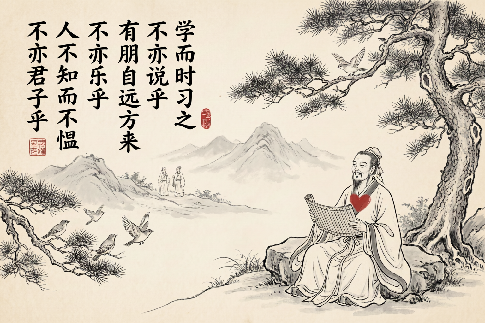
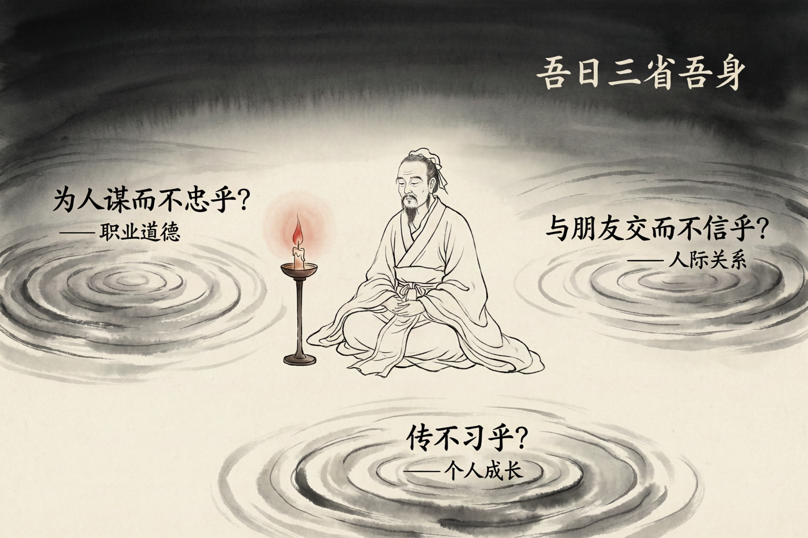
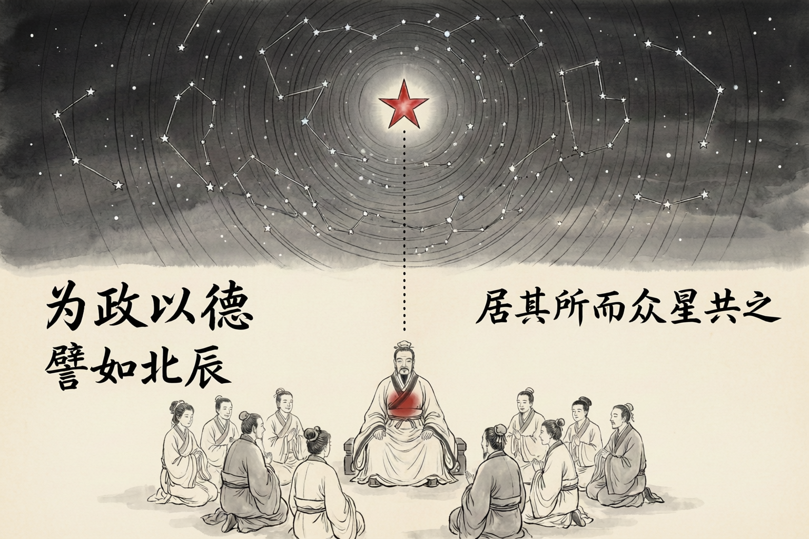
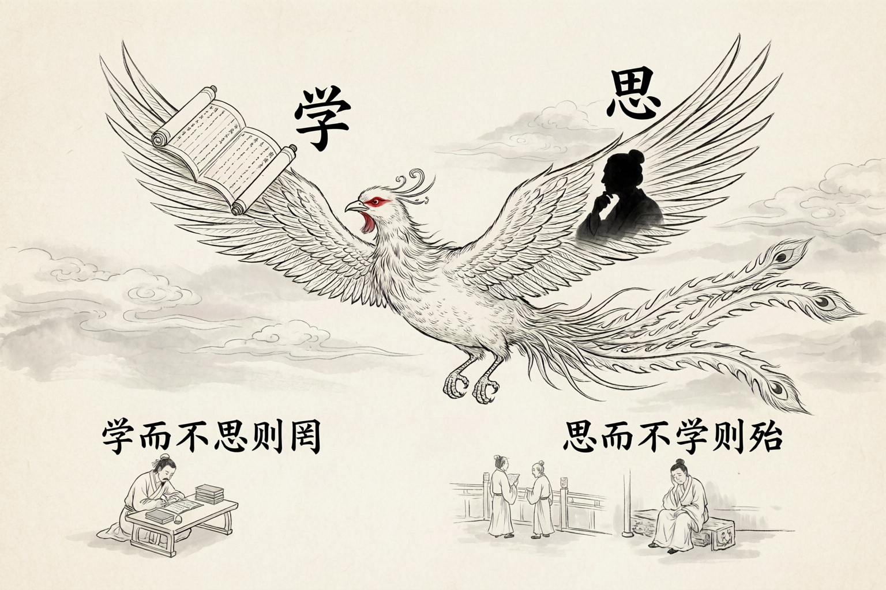
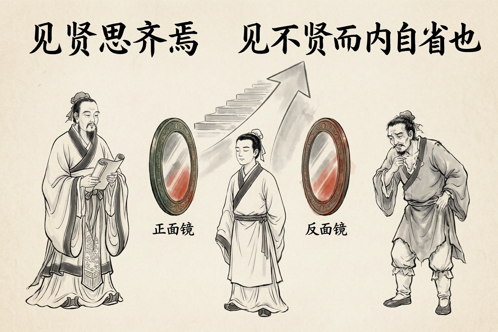
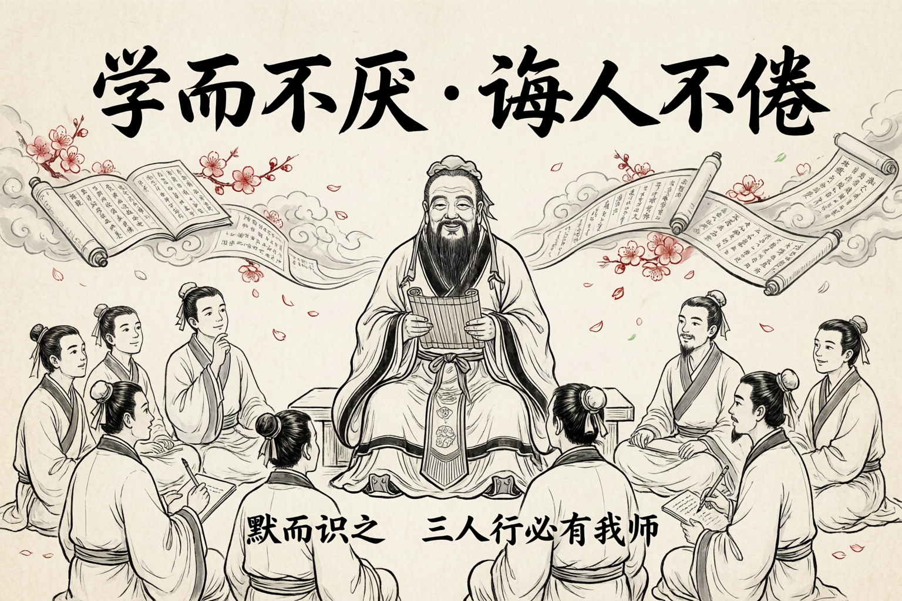
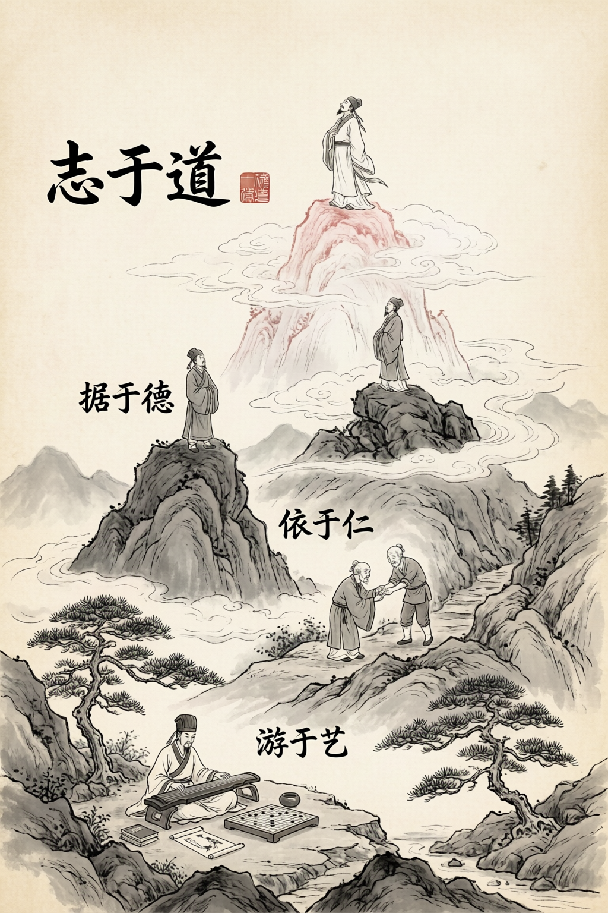

# 论语别裁 · 一周学习计划

> 📚 **书名**：论语别裁
> ✍️ **作者**：南怀瑾
> 📖 **字数**：645千字
> ⏱ **学习周期**：1周（8个番茄钟，约3.5小时）
> 🎯 **学习方法**：番茄时钟 + 费曼学习法 + 刻意练习

---

## 书籍概览

### 作者背景

南怀瑾先生（1918-2012），浙江温州人，当代著名国学大师。一生致力于弘扬中华传统文化，于儒、释、道皆有精深造诣。《论语别裁》是其代表作之一，1976年出版后成为台湾最畅销的学术著作之一。

### 核心主题

《论语别裁》是南怀瑾先生对《论语》的独到解读，与传统注疏不同，南师以"经史合参"的方法，将《论语》与《春秋》史迹相融会，结合人生经验与历史典故，揭示孔子思想的真正内涵。

### 学习目标

完成本周学习后，你将能够：
- ✅ 理解《论语》的核心精神与南师的解读方法
- ✅ 掌握"学而时习之""为政以德""仁者爱人"等核心概念
- ✅ 用自己的话复述5个以上论语名句的深层含义
- ✅ 将儒家智慧与现代生活相联系

---

## 学习时间表

| 日期 | 番茄钟 | 学习内容 | 重点章节 |
|------|--------|----------|----------|
| 周一 | 🍅🍅 | 学而第一：开篇明义 | 学而时习之、孝悌为本 |
| 周二 | 🍅🍅 | 为政第二：政者正也 | 为政以德、君子不器 |
| 周三 | 🍅🍅 | 里仁第四：仁者安仁 | 仁者爱人、义利之辨 |
| 周四 | 🍅🍅 | 述而第七：述而不作 | 学而不厌、诲人不倦 |
| 周五 | 📝 | 复习总结 + 刻意练习 | 全书核心概念 |

---

## Day 1：学而第一 · 开篇明义

### 🍅 番茄钟1：学而时习之（25分钟）



#### 📖 核心原文

> 子曰：「学而时习之，不亦说乎？有朋自远方来，不亦乐乎？人不知而不愠，不亦君子乎？」

#### 💡 南师解读要点

**1. "学"的真义**

南师认为，"学"不是单纯的知识积累，而是"学做人"——学做君子、学做真人。

```
传统理解 → 学习知识、技能
南师解读 → 学习做人、修身养性
```

**2. "习"的深意**

"习"字从羽，本义是鸟练习飞翔。学习如鸟学飞，需要反复实践，才能翱翔。

**3. 三句话的逻辑关系**

| 句子 | 层次 | 含义 |
|------|------|------|
| 学而时习之 | 个人修行 | 自我成长的快乐 |
| 有朋自远方来 | 人际关系 | 与同道交流的喜悦 |
| 人不知而不愠 | 社会境界 | 不被理解的从容 |

> ✋ **费曼自测**
>
> 请用自己的话，向一个初中生解释"学而时习之"的真正含义。限时2分钟。

---

#### 📖 延伸阅读：孝悌为本

> 有子曰：「其为人也孝弟，而好犯上者，鲜矣；不好犯上，而好作乱者，未之有也。君子务本，本立而道生。孝弟也者，其为仁之本与！」

**南师解读：**

孝悌是"仁"的根本。儒家讲究"本立而道生"——根本建立了，道自然生发。

```
孝 → 对父母的敬爱
悌 → 对兄弟的友爱
↓
仁 → 对天下人的博爱
```

> ✋ **费曼自测**
>
> 为什么说"孝悌"是"仁"的根本？请用一个比喻来解释。

---

### 🍅 番茄钟2：三省吾身（25分钟）



#### 📖 核心原文

> 曾子曰：「吾日三省吾身：为人谋而不忠乎？与朋友交而不信乎？传不习乎？」

#### 💡 南师解读要点

**1. "三省"的真义**

南师指出，"三"在古代常表示"多"，"三省"不是只检查三件事，而是多次自我反省。

**2. 三问的层次**

| 问题 | 层面 | 核心要求 |
|------|------|----------|
| 为人谋而不忠乎？ | 职业道德 | 尽心尽力 |
| 与朋友交而不信乎？ | 人际关系 | 诚实守信 |
| 传不习乎？ | 个人成长 | 温故知新 |

**3. 反省的方法**

南师建议每天睡前花几分钟，问自己三个问题：
- 今天我做的事，对得起委托我的人吗？
- 今天我说的话，兑现了吗？
- 今天学的东西，复习了吗？

> ✋ **费曼自测**
>
> 请设计一套适合自己的"日省清单"，包括3-5个具体问题。

---

#### 📝 笔记要点

今天的学习中，最触动你的是哪句话？为什么？

```
我的感悟：

________________________________________________________________

________________________________________________________________

________________________________________________________________
```

---

## Day 2：为政第二 · 政者正也

### 🍅 番茄钟3：为政以德（25分钟）



#### 📖 核心原文

> 子曰：「为政以德，譬如北辰，居其所而众星共之。」

#### 💡 南师解读要点

**1. "为政"的本质**

南师强调，"为政"不只是政治管理，更是一种生活方式——"正己而后正人"。

**2. 北辰之喻**

```
北辰（北极星）
    ↓
位置固定不动
    ↓
众星自然环绕
    ↓
比喻：有德之人
    ↓
不用强求，自然有影响力
```

**3. 德的力量**

南师认为，真正的领导力来自"德"，而不是权力或谋略。有德之人如北辰，别人自然愿意跟随。

> ✋ **费曼自测**
>
> 请用"北辰之喻"来解释什么是"影响力"，而不是"权力"。

---

#### 📖 延伸阅读：君子不器

> 子曰：「君子不器。」

**南师解读：**

"器"是器具，器具只有特定用途。君子不器，是说君子不要像器具一样只有单一功能，而要通晓事理、多才多艺。

```
器 → 功能单一，用途有限
君子 → 博学多能，适应变化
```

> ✋ **费曼自测**
>
> 在现代社会，如何理解"君子不器"？请举一个具体例子。

---

### 🍅 番茄钟4：学思结合（25分钟）



#### 📖 核心原文

> 子曰：「学而不思则罔，思而不学则殆。」

#### 💡 南师解读要点

**1. 学与思的关系**

南师指出，学与思如鸟之双翼，缺一不可。

| 只学不思 | 只思不学 |
|----------|----------|
| 迷茫无所得 | 危险无根基 |
| 知识堆砌 | 空想虚妄 |
| 成为"书呆子" | 成为"空想家" |

**2. 正确的学思循环**

```
学 → 接受新知识
  ↓
思 → 消化理解
  ↓
行 → 实践验证
  ↓
学 → 再学习深化
```

**3. 现代应用**

南师特别强调，现代人信息过载，更需要"思"来消化。每天留出思考时间，比不断学习更重要。

> ✋ **费曼自测**
>
> 你平时的学习习惯是"学多思少"还是"学思平衡"？请设计一个改进方案。

---

#### 📝 笔记要点

今天的"为政"思想，如何应用到你的工作或生活中？

```
我的应用计划：

________________________________________________________________

________________________________________________________________

________________________________________________________________
```

---

## Day 3：里仁第四 · 仁者安仁

### 🍅 番茄钟5：仁者爱人（25分钟）


#### 📖 核心原文

> 子曰：「唯仁者能好人，能恶人。」

> 子曰：「苟志于仁矣，无恶也。」

#### 💡 南师解读要点

**1. "仁"的核心**

南师认为，"仁"是儒家的最高境界，核心是"爱人"——真诚地关爱他人。

**2. 仁者的好恶**

为什么只有仁者才能"好人"和"恶人"？南师解释：

```
普通人 → 好恶出于私心
    ↓
仁者 → 好恶出于公心
    ↓
能公正地评判是非
```

**3. 志于仁**

"苟志于仁矣，无恶也"——只要立志于仁，就不会做坏事。南师强调，修行的关键是"立志"。

> ✋ **费曼自测**
>
> 为什么说"仁者能好人，能恶人"？这和普通人的喜欢讨厌有什么区别？

---

#### 📖 延伸阅读：义利之辨

> 子曰：「君子喻于义，小人喻于利。」

**南师解读：**

南师指出，这并非说君子不食人间烟火，而是价值取向不同：

| 君子 | 小人 |
|------|------|
| 以义为先 | 以利为先 |
| 考虑"该不该做" | 考虑"有没有好处" |
| 长远眼光 | 眼前利益 |

> ✋ **费曼自测**
>
> 在职场中，遇到"义"与"利"的冲突，如何运用这一智慧？

---

### 🍅 番茄钟6：见贤思齐（25分钟）



#### 📖 核心原文

> 子曰：「见贤思齐焉，见不贤而内自省也。」

#### 💡 南师解读要点

**1. 学习的两面镜子**

南师说，人有两面镜子：
- 看到贤人，是"正面镜子"，照出自己的不足
- 看到不贤的人，是"反面镜子"，检查自己是否有同样问题

**2. 具体方法**

```
见贤 → 他有什么优点？我如何学习？
    ↓
见不贤 → 他有什么问题？我有没有类似问题？
    ↓
自我提升
```

**3. 持续改进**

南师强调，这种方法不是一时一事，而是终身习惯。每天、每周、每月都要"思齐"和"自省"。

> ✋ **费曼自测**
>
> 回想最近遇到的人，选择一位"贤者"和一位"不贤者"，完成"思齐"和"自省"。

---

#### 📝 笔记要点

今天你对"仁"的理解有什么变化？

```
我对"仁"的新理解：

________________________________________________________________

________________________________________________________________

________________________________________________________________
```

---

## Day 4：述而第七 · 述而不作

### 🍅 番茄钟7：学而不厌（25分钟）



#### 📖 核心原文

> 子曰：「默而识之，学而不厌，诲人不倦，何有于我哉？」

#### 💡 南师解读要点

**1. 孔子的三件事**

| 默而识之 | 学而不厌 | 诲人不倦 |
|----------|----------|----------|
| 默默记住所学 | 学习永不满足 | 教人不知疲倦 |
| 内化于心 | 持续成长 | 分享智慧 |

**2. 学而不厌的精神**

南师特别强调"不厌"二字——学习一辈子不厌倦，这是极难的境界。大多数人学到一定程度就满足了，但真正的学者永远保持好奇心。

**3. 学习的态度**

```
好奇心 → 学习的动力
    ↓
谦卑 → 学习的前提
    ↓
坚持 → 学习的保障
```

> ✋ **费曼自测**
>
> 你对什么领域有"学而不厌"的热情？为什么？

---

#### 📖 延伸阅读：三人行必有我师

> 子曰：「三人行，必有我师焉。择其善者而从之，其不善者而改之。」

**南师解读：**

南师指出，每个人都是"老师"——从好人学优点，从坏人学教训。关键是保持谦虚的学习心态。

> ✋ **费曼自测**
>
> 今天你可以从身边的哪三个人身上学到什么？

---

### 🍅 番茄钟8：志道据德（25分钟）



#### 📖 核心原文

> 子曰：「志于道，据于德，依于仁，游于艺。」

#### 💡 南师解读要点

**1. 四个层次**

南师认为这是儒家修行的完整体系：

| 层次 | 内容 | 说明 |
|------|------|------|
| 志于道 | 立志追求真理 | 方向目标 |
| 据于德 | 以德为根基 | 立身之本 |
| 依于仁 | 以仁为依归 | 行为准则 |
| 游于艺 | 游泳于六艺之中 | 实践方式 |

**2. "游"的深意**

南师特别解释"游于艺"——"游"是游泳，在技艺中自由畅游，不是苦练，而是享受。学习技艺应如鱼在水中，自由自在。

**3. 现代应用**

```
志于道 → 确立人生使命
据于德 → 建立道德底线
依于仁 → 保持善良本性
游于艺 → 发展专业技能
```

> ✋ **费曼自测**
>
> 请用"志道据德依仁游艺"来规划你的个人成长路径。

---

#### 📝 笔记要点

今天的学习让你对孔子有了什么新的认识？

```
我眼中的孔子：

________________________________________________________________

________________________________________________________________

________________________________________________________________
```

---

## Day 5：复习总结 · 刻意练习

### 📋 核心概念回顾

请用自己的话解释以下概念：

| 概念 | 我的理解 |
|------|----------|
| 学而时习之 | |
| 为政以德 | |
| 仁者爱人 | |
| 学思结合 | |
| 见贤思齐 | |

---

### 🎯 刻意练习任务

#### 任务1：费曼输出（30分钟）

选择一个论语名句，写一篇500字的解读文章，要求：
- 用大白话解释
- 结合现代生活案例
- 提出具体应用建议

#### 任务2：行动计划（15分钟）

根据本周学习，制定一个"论语实践计划"：

```
我要践行的论语智慧：_________________

具体行动：___________________________

检验标准：___________________________

开始日期：___________________________
```

#### 任务3：分享交流（15分钟）

找一个朋友或家人，向他讲解你本周学到的最重要的一点。

---

### ✅ 自检清单

完成本周学习后，请检查：

- [ ] 能用自己的话解释"学而时习之"的真正含义
- [ ] 理解"为政以德"的北辰之喻
- [ ] 能说出"仁"的三个层次
- [ ] 知道"学思结合"的重要性
- [ ] 能背诵并理解5个论语名句
- [ ] 完成一篇费曼输出文章
- [ ] 制定了一个实践计划

---

## 学习资源

### 原书章节

- [[书库/南怀谨/南怀瑾著作全收录 (套装52套)_part01.md]] - 学而第一、为政第二
- [[书库/南怀谨/南怀瑾著作全收录 (套装52套)_part02.md]] - 八佾第三、里仁第四
- [[书库/南怀谨/南怀瑾著作全收录 (套装52套)_part03.md]] - 述而第七

### 补充资料

- [[书库/南怀谨/.书库索引/README.md]] - 南怀谨书库索引
- [[AI系统学习课/南怀谨书籍学习/README.md]] - 学习计划总览

### 相关链接

- [[话说中庸-学习计划]] - 下周学习
- [[孟子旁通-学习计划]] - 后续学习

---

## 学习笔记

### 疑问记录

学习过程中遇到的疑问：

```
1. _______________________________________________________________

2. _______________________________________________________________

3. _______________________________________________________________
```

### 感悟记录

最触动我的三点：

```
1. _______________________________________________________________

2. _______________________________________________________________

3. _______________________________________________________________
```

---

## 维护记录

- **创建日期**：2026-06-07
- **学习状态**：⬜ 待开始
- **完成日期**：________

---

> **下周预告**：《话说中庸》——中庸之道，不偏不倚的中道智慧。
