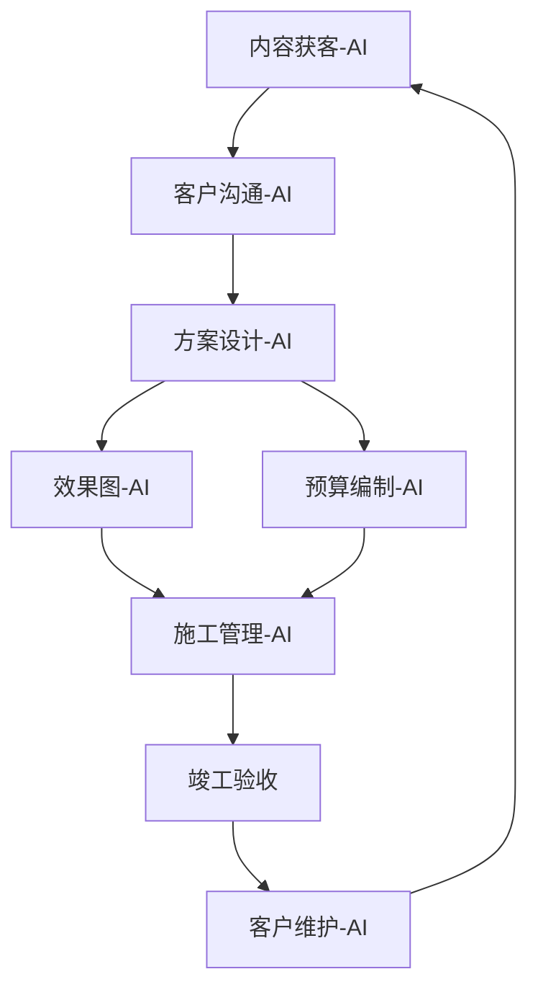

# 🍅 模块E：综合实战与交付（10🍅）

> 🎯 目标：跑通从获客到交付的全流程，输出完整案例
> ⏱ 预计：10天（每天1🍅）或 2.5天（每天4🍅）

---

## 🍅 番茄41：AI辅助客户初次沟通——需求挖掘

### 📖 费曼三句话

1. **第一次客户沟通的目标不是报价，是"建立信任 + 挖出真实需求"**——大多数客户说不清楚自己要什么。你说"什么风格？"他说"简约就行"——但简约分现代简约、北欧简约、日式简约，差很远。
2. **AI帮你准备"需求挖掘问题清单"**——提前让AI生成一份20个问题的清单，覆盖：空间需求、风格偏好、预算范围、生活习惯、特殊需求。第一次见面时按清单聊，不会漏项。
3. **AI辅助的"记录→整理→输出"**：沟通时用手机录音（征得同意）→ 会后发给AI整理成《客户需求文档》→ AI生成初步方案方向 → 下次沟通前发给客户确认。专业感拉满。

### 🛠 刻意练习

1. 让AI生成"装修客户需求挖掘问题清单"：
   ```
   你是一个经验丰富的室内设计师。请帮我生成一份
   "第一次客户沟通的需求挖掘问题清单"，
   至少20个问题，覆盖以下维度：
   - 空间需求（哪些空间要改）
   - 风格偏好（喜欢的/不喜欢的）
   - 生活习惯（做饭频率、在家办公等）
   - 预算（总预算+分期预期）
   - 特殊需求（老人/儿童/宠物）
   - 时间预期（什么时候入住）
   每个问题后面标注"必问"或"选问"。
   ```
2. 选出你认为最重要的10个问题，排好顺序
3. 模拟一次和客户的对话（你问问题，AI扮演客户回答）

### ✅ 完成标准

- [ ] AI生成了20个需求挖掘问题
- [ ] 你精选了10个并按顺序排好
- [ ] 模拟了一次客户沟通

---

## 🍅 番茄42：AI辅助量房与数据记录

### 📖 费曼三句话

1. **量房是装饰行业中"最不能被AI替代"的环节**——AI不能帮你爬梯子、测尺寸、看梁柱结构。但AI可以帮你"整理量房数据"——量完回家，把数据口述转文字，AI自动生成标准量房记录表。
2. **AI量房记录工作流**：量房时用手机拍每个空间的照片+录一段语音描述（"客厅3.5×4.2米，南向大窗，层高2.7米，横梁在中间位置"）→ 回家让AI根据语音和照片整理成结构化文档。
3. **AI自动生成的"现场问题清单"**——把现场照片发给AI，让它识别可能的问题："这个墙体疑似承重墙""窗户有漏水痕迹""地面不平整需要找平"。可以作为量房报告的补充。

### 🛠 刻意练习

1. 找一套你熟悉的房子（你自己的或之前做过的）
2. 模拟量房后，口述一段语音记录：
   ```
   客厅：宽3.8米，长5.2米，层高2.65米。
   南向落地窗，采光好，但窗户不是双层玻璃。
   地面是瓷砖，有3处空鼓。
   墙面有轻微裂缝，疑似沉降造成。
   ```
3. 把这段话发给AI，让它整理成标准量房记录表格式
4. 追加提问："根据以上量房数据，请提醒我在改造中需要注意哪些问题"

### ✅ 完成标准

- [ ] 完成了模拟量房数据整理
- [ ] AI生成了结构化的量房记录
- [ ] AI提示了至少3个需要注意的问题

---

## 🍅 番茄43：AI辅助施工管理——进度跟踪与质检

### 📖 费曼三句话

1. **装饰施工管理的核心不是"管工人"，是"管节点"**——拆改结束→水电验收→瓦工进场→木工进场→油漆进场→安装→竣工验收。每个节点验收合格再进入下一步，就不会出大问题。
2. **AI帮你做的三件事**：①生成《各节点验收标准清单》（每个环节验收什么、怎么验、合格标准）；②根据照片判断施工是否规范（把施工现场照片发给AI，让它指出问题）；③生成施工进度表（自动排工期）。
3. **最简单的AI施工管理工具**：一个共享相册（每天拍2张现场照片）+ AI每周分析一次进度 + AI生成周报发给客户。客户不用到现场，也知道进度。

### 🛠 刻意练习

1. 让AI生成"水电改造验收标准清单"：
   ```
   请生成一份家庭装修水电改造的验收标准清单。
   包含验收项目、验收方法、合格标准三项。
   格式：表格。
   ```
2. 练习：拍一张你手边的电路/水管照片（或网上找一张），发给AI问"这张水电照片有什么问题？"
3. 根据AI生成的验收清单，设想一个"施工周报"模板

### ✅ 完成标准

- [ ] AI生成了水电验收清单
- [ ] 练习了"让AI检查施工照片"
- [ ] 设想了施工周报模板

---

## 🍅 番茄44：AI辅助客户关系维护——交付后持续服务

### 📖 费曼三句话

1. **装饰行业最浪费的资源是"老客户"**——你花500元获客成本搞来的客户，做完一次就丢了。而老客户的转介绍成交率是新客户的3倍，成本为零。
2. **AI帮你做持续客户维护**：
   - 完工1个月：AI发"入住体验回访"消息
   - 完工3个月：AI发"免费检修"邀约
   - 完工6个月：AI发"新增需求咨询"（"家里需不需要加个柜子？"）
   - 完工1年：AI发"年度保养提醒"
   - 全部自动化、个性化。
3. **每个完工客户 = 一个"内容素材来源"**——完工后请客户帮你做三件事：写一段评价、拍几张实景照片、推荐一个朋友。AI帮你生成请求话术，让客户觉得帮你忙是件自然的事。

### 🛠 刻意练习

1. 让AI生成"客户回访消息模板"：
   ```
   请为装修完工后的客户生成5条回访消息模板：
   1. 完工1个月：入住体验回访
   2. 完工3个月：免费检修邀约
   3. 完工6个月：新增需求咨询
   4. 完工1年：年度保养提醒
   5. 求好评/转介绍（温和版）
   要求：每条不超过100字，语气温暖不打扰。
   ```
2. 根据你真实的说话风格，修改其中2条
3. 设想你的"老客户维护计划"（每年联系几次？通过什么方式？）

### ✅ 完成标准

- [ ] AI生成了5条回访消息
- [ ] 你修改了2条（变成你的风格）
- [ ] 有了初步的老客户维护计划

---

## 🍅 番茄45：AI辅助社会价值项目策划——适老改造公益

### 📖 费曼三句话

1. **适老化改造公益项目 = "最聪明的营销"**——免费为困难老人做适老评估和轻改，成本2000元/户，但换来的可能是社区口碑+媒体报道+政府关注+源源不断的客户转介绍。
2. **AI帮你策划公益项目**：选址分析（哪个社区的适老需求最大？）、方案设计（低成本+高安全性的改造方案）、宣传文案（让更多人知道你在做的事）。
3. **公益项目的"一鱼多吃"**：
   - 社会价值：帮助老人安全居家
   - 品牌价值：树立"有温度的装修设计师"形象
   - 内容价值：改造过程就是最好的内容素材
   - 商业价值：参与公益的社区会成为你的客户来源

### 🛠 刻意练习

1. 让AI策划一个适老改造公益项目：
   ```
   我是一名装修设计师，想策划一个"适老改造公益计划"。
   请帮我输出一份计划书框架：
   1. 项目名称（有记忆点）
   2. 目标人群（什么条件的老人可以申请）
   3. 服务内容（免费做什么，收费做什么）
   4. 合作渠道（如何找到需要帮助的老人）
   5. 宣传方案（如何让更多人知道）
   6. 预算估算（每户成本多少）
   ```
2. 根据AI的输出，调整成你真正能执行的版本
3. 想想你的第一个公益项目可以找谁合作

### ✅ 完成标准

- [ ] AI输出了公益项目计划书框架
- [ ] 你调整了至少3处让计划可执行
- [ ] 明确了第一个公益项目的合作对象

---

## 🍅 番茄46：全流程整合——从获客到交付的AI工作流

### 📖 费曼三句话

1. **装饰行业的全AI工作流 = 6个节点 × AI提效**：
   - 获客 → AI内容生产
   - 沟通 → AI需求挖掘
   - 方案 → AI设计+效果图
   - 报价 → AI预算编制
   - 施工 → AI进度管理
   - 售后 → AI客户维护
   - 每个节点AI提效2-5倍，整体效率提升3倍。
2. **关键不是每个环节都用AI，而是"连起来"**——获客内容吸引来的客户，直接进入AI需求沟通流程；方案阶段的AI效果图，直接成为内容素材进入下一轮获客。形成闭环。
3. **你一个人 = 传统装修公司的"设计部+市场部+客服部+工程部"**——AI不是让你做更多事，是让你一个人能做完以前4个人做的事。这不仅是效率，这是商业模式的质变。

### 🛠 刻意练习

**绘制你的AI工作流地图**：



**练习**：画出你自己的AI工作流，标注每个环节使用的工具和耗时

### ✅ 完成标准

- [ ] 画出了你的AI工作流图
- [ ] 每个环节标注了使用的AI工具
- [ ] 你识别了"目前最需要AI提效的环节"

---

## 🍅 番茄47：模块E综合考核——从零到一的完整案例

### 📖 费曼三句话（模块E前半总结）

1. **全流程跑通一次比学10个技巧更重要**——就像学游泳，在岸上学再多动作，不如下水扑腾一次。今天的工作就是"下水"。
2. **每个环节的"AI最小可用方案"**——不求每个环节完美，但求每个环节都能跑通。从获客到售后，每个步骤都有一个"最简AI方案"可用。
3. **你的AI工作流就是你的"数字护城河"**——传统设计师靠经验，你靠经验+AI效率。同等的价格，你出方案快3倍、效果好2倍、服务周期长5倍——这就是竞争优势。

### 🛠 刻意练习——模块E综合考核

**任务**：模拟一个完整案例，跑通全流程（120分钟内）

| 阶段 | 任务 | AI工具 | 时间 |
|:----|:----|:-------|:----:|
| 1. 获客 | 用AI写一篇获客内容并发布 | 大模型+Canva | 20min |
| 2. 沟通 | 生成需求清单，模拟客户沟通 | 大模型 | 15min |
| 3. 方案 | 生成方案+效果图+预算 | 大模型+绘图 | 30min |
| 4. 展示 | 制作方案展示板 | Canva | 15min |
| 5. 施工 | 生成验收清单+周报模板 | 大模型 | 15min |
| 6. 售后 | 生成回访消息模板 | 大模型 | 10min |
| 7. 复盘 | 总结全过程效率提升 | 反思 | 15min |

### ✅ 完成标准

- [ ] 7个阶段全部跑通（可不完美，但要完整）
- [ ] 每个阶段都有明确的产出物
- [ ] 记录了每个阶段的实际耗时
- [ ] 计算了AI带来的效率提升倍数

---

## 🍅 番茄48：效率度量——你的AI投资回报率

### 📖 费曼三句话

1. **AI的ROI = （节省的时间 × 你的时薪） - AI工具成本**——如果你月薪1万（时薪约60元），AI让你每天省2小时（120元/天），一年省3万元——而AI工具成本不超过200元/月（2400元/年）。ROI = 1250%。
2. **装饰行业AI投入产出表**：

| 投入项 | 月成本 | 产出项 | 月价值 |
|:------|:-----:|:------|:-----:|
| AI大模型订阅 | ¥0-200 | 方案效率提升5× | ¥2000+ |
| AI绘图工具 | ¥0-100 | 效果图效率10× | ¥3000+ |
| AI内容工具 | ¥0-50 | 获客成本降低90% | ¥5000+ |
| **合计** | **¥0-350** | **合计** | **¥10000+** |

3. **比省钱更重要的是"省时间"**——AI省下的时间，你应该用来做三件AI做不了的事：和客户面对面沟通、到现场看施工、学习和思考。这些才是你不可替代的价值。

### 🛠 刻意练习

**算你的AI ROI**：

```
你的月收入目标：______ 元
你的工作时薪（目标÷22天÷8小时）：______ 元/小时
AI工具月支出：______ 元
使用AI后每天省下的时间：______ 小时
月省时价值 = 时薪 × 日省时 × 22天 = ______ 元
月净收益 = 月省时价值 - AI成本 = ______ 元
AI年ROI = 月净收益 × 12 ÷ AI年成本 × 100% = ______ %
```

### ✅ 完成标准

- [ ] 计算了你的AI ROI
- [ ] 明确知道了AI每月帮你省多少钱
- [ ] 决定了下个月要在哪个环节多投入AI

---

## 🍅 番茄49：总结复盘——50番茄学到的核心技能

### 📖 费曼三句话（50🍅总复盘）

1. **这50个番茄的真正收获不是"学会了用AI工具"，而是建立了"AI + 装饰行业"的工作思维**——遇事第一反应从"我自己做"变成"我能用AI怎么加速"。这个思维迁移，价值超过所有工具操作技巧。
2. **你现在的AI能力状态：从0到1已经完成，从1到10需要持续练习**——你能独立完成从获客到交付的全AI流程，但速度和精确度还需要时间积累。每天用、每天练，3个月后你会觉得自己"离不开AI"。
3. **50🍅只是起点，不是终点**——AI工具每月都在进化。保持学习的方法：每月花2个番茄了解新功能、每年重新看一遍本教程（很多内容会随着工具升级过时，但思维框架不会）。

### 🛠 刻意练习——50🍅总复盘

**50🍅自评表**：

| 技能领域 | 学前水平(1-5) | 学后水平(1-5) | 提升 | 后续练习方向 |
|:---------|:------------:|:------------:|:----:|:-----------|
| AI大模型使用 | | | | |
| 提示词工程 | | | | |
| AI效果图生成 | | | | |
| AI内容创作 | | | | |
| AI获客运营 | | | | |
| 全流程整合 | | | | |

**50🍅行动承诺**（写下你要坚持的3件事）：

1. 
2. 
3. 

### ✅ 完成标准

- [ ] 完成了自评表
- [ ] 写下了3个行动承诺
- [ ] 知道了自己哪个技能最需要持续练习

---

## 🍅 番茄50：未来规划——AI + 装饰行业的进阶之路

### 📖 费曼三句话（终篇）

1. **现在你掌握了"会用AI"，但竞争的下半场是"会教AI"**——提示词工程越做越精，你能让AI输出80分的方案，别人只能输出60分。这20分的差距，就是你的溢价空间。
2. **AI + 装饰行业的三个进阶方向**：
   - 方向A：AI设计专家（把提示词做到极致，专攻高难度方案）
   - 方向B：AI内容IP（用AI批量生产内容，打造个人品牌）
   - 方向C：AI效率教练（教其他设计师用AI，做培训）
   - 三年后，选一个方向深耕。
3. **最后一句送给你的话**：AI不会让好的设计师失业，但会让"不用AI的设计师"慢慢被淘汰。你今天花50🍅学的不是工具，是未来5年的竞争力。

### 🛠 刻意练习——毕业设计

**你的AI + 装饰行业宣言**（写一段200字以内的个人宣言）：

```
我，________，通过50🍅的学习，
掌握了________________________________的能力。
我承诺在未来3个月内，
________________________________。
我相信________________________________。
```

**你的后续学习计划**：

| 时间 | 学习内容 | 预计番茄 |
|:----|:--------|:--------:|
| 下个月 | 深度学习提示词+积累词库 | 20🍅 |
| 第2-3个月 | 建立内容矩阵+稳定获客 | 30🍅 |
| 第4-6个月 | 打造差异化AI设计IP | 40🍅 |

### ✅ 完成标准

- [ ] 写完了你的"AI + 装饰行业宣言"
- [ ] 制定了后续学习计划
- [ ] 你清楚知道自己下一个45分钟的番茄要学什么

### 📝 最终复盘

```
50🍅总耗时：______ 个番茄（实际完成）
50🍅总天数：______ 天

最惊喜的发现：
最大的挑战：
下一步的第一件事：
```

---

# 🎉 恭喜完成50🍅教程！

> 你从AI基础 → 提示词工程 → AI效果图 → AI内容获客 → 全流程实战
> 建立了一套完整的"装饰行业AI工作体系"

## 证书

```
本教程由 Claudian 基于以下方法论设计：
🧠 番茄工作法（时间管理）
📖 费曼学习法（深度理解）
🎯 刻意练习（技能内化）

参考文档：[[Script/装饰行业五年发展规划]]
完成日期：____年____月____日
```

---

> 📅 创建日期：2026-06-18
> 🧠 教学法：番茄工作法 × 费曼学习法 × 刻意练习
> 📚 基于：[[Script/装饰行业五年发展规划]]
