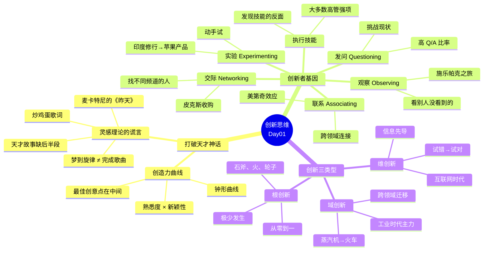

# 💡 Day01：创新思维的真相——打破天才神话

> **5🍅 · 从《昨天》的旋律到"北美鹰"的疯狂，拆解创造力的底层密码**

---

## 🍅1 悬疑开场：保罗·麦卡特尼做梦的时候，到底发生了什么？

### 🎬 悬疑钩子

1963年11月，伦敦温坡街57号顶楼。

保罗·麦卡特尼醒来的时候，脑子里回响着一段旋律。他三步并作两步走到小钢琴前，试着把那些音符敲出来。G大调、升F小调减七、B大调、E小调、E大调。

他说那段旋律"太熟悉了"，熟悉到他不确定是不是自己做梦时不小心剽窃了别人的作品。

他去找约翰·列侬。"没听过。"他又去找著名作曲家莱昂内尔·巴特。巴特一脸茫然。他又去找女歌手阿尔玛·柯冈。柯冈听完说："太好听了，是你原创的。"

这段在梦中诞生的旋律，后来成了披头士的《昨天》——人类历史上被翻唱次数最多的歌曲，超过3000个版本。

**麦卡特尼自己怎么说？**

他在纪录片里说："这首曲子是通过梦境传递给我的，太神奇了。音乐本身太过神秘。"

听起来像不像标准答案？天才的灵感从天而降，凡人只能仰视。

### 📖 叙事主体

**但这个故事还有另一半。**

麦卡特尼在梦里得到的只是一段和弦旋律。没有歌词。没有结构。不是一首完整的歌。

那首《昨天》最终需要填词。当他在阿尔玛·柯冈家里弹奏时，柯冈的母亲走进来问："有人想吃炒鸡蛋吗？"

**"炒鸡蛋"**——这就是最初的临时歌词。

没错，人类历史上最伟大的旋律之一，第一版歌词是：

> Scrambled eggs, oh my baby how I love your legs
> （炒鸡蛋，噢宝贝我多爱你的腿）

这不是天才的灵光一闪。这是一个21岁的音乐家花了几个星期打磨一段梦里捡到的旋律——改了无数遍，写了无数版歌词——才最终变成《昨天》。

**创造力灵感的真相是什么？**

不是天启。是**梦里捡到一块石头，然后自己把它雕成一座雕像。**

这也引出了我们第一个核心概念：**创造力曲线**。

艾伦·甘尼特在《创造力曲线》中做了一件很残忍的事——他把创造力天才们的故事翻了个底朝天，发现那些"灵感时刻"全都有另一面：

- J.K.罗琳在火车上想到"哈利·波特"？那个念头她已经在脑子里转了四年。
- 莫扎特能毫不费力地谱曲？他的父亲从三岁就开始训练他，比任何音乐学校都残忍。
- 乔布斯说"创造就是联系事物"？他说的联系，是建立在十几年的跨领域积累上的。

甘尼特的结论很直接：**整个"创造力灵感理论"是一个谎言。**

创造力不是某种神秘的内在过程。它是一种**可以识别、可以复制、可以练习**的模式。

### 📝 费曼三句话

```
🧠 费曼三句话
1. 创造力≠天才的灵光一闪。大多数"灵感故事"只讲了前半段（灵光），
   没讲后半段（苦工）。
2. 创造力曲线是一条钟形曲线：创造力的本质 = 熟悉度 × 新颖性。
   太熟悉 = 陈词滥调。太新颖 = 没人理解。最佳点在中间。
3. 你认为自己"没有创造力"——这不是事实，这是你还没学会方法论。
```

### 📌 连线笔记

想想你最近一次说"我没什么创意"是什么时候。那件事，是真的需要"天启"，还是你只是不知道从哪里开始？——保存这个问题，第三天我们会回来拆它。

---

## 🍅2 核心工具拆解：创新者的基因——5项发现技能

### 🎬 悬疑钩子

你有同卵双胞胎吗？假设你有。

现在给你俩一周时间，各自想一个创新的商业想法。

你这周怎么做？大概率是坐在书桌前，绞尽脑汁，跟自己较劲。

你那位双胞胎呢？他做了五件事：

1. 跟十个人聊了天——工程师、音乐家、设计师、家庭主妇、程序员
2. 参观了三家刚成立的公司，观察他们怎么运营
3. 买了五个新上市的产品，拆了研究
4. 给五个人展示了他组装的模型，看他们什么反应
5. 以上所有活动过程中，他每隔一会儿就问自己："试试这样行不行？""什么因素会让这个想法失败？"

你觉得一周之后，谁的商业想法更有创意？

这不是假设。杰夫·戴尔、赫尔·葛瑞格森和克莱顿·克里斯坦森（对，就是写《创新者的窘境》那位）花了八年时间，研究了近500名创新企业家，包括乔布斯、贝佐斯、贝尼奥夫、雷富礼这些人，还比照了5000名普通高管。

他们发现什么？

**创新者的创造力只有25%-40%由遗传因素决定。剩下2/3是后天习得的。**

这个比例跟智商（IQ）完全不同——IQ的80%是遗传决定的。创造力恰恰相反：它**主要靠练，不是靠生**。

### 📖 叙事主体

那这2/3可以习得的能力到底是什么？作者们总结出**5项发现技能**：

#### 技能1：联系（Associating）——把不相关的东西连起来

这是创新者基因的核心认知技能。爱因斯坦管它叫"组合游戏"。

乔布斯在里德学院退学后去旁听了一门书法课——学会了衬线体、无衬线体、字母间距、版面美学。十年后，这些知识全部涌进Mac电脑，让它成为第一台拥有优美版面的个人计算机。

**联系能力的关键**：创新者会有意识地把脚伸进不同领域。你接触的东西越杂，能建立的联系就越多。这就是所谓的**美第奇效应**——当雕塑家、科学家、诗人、哲学家和建筑家共聚佛罗伦萨时，行业交叉地带爆发了创造力海啸。

#### 技能2：发问（Questioning）——挑战理所当然

乔布斯问过的问题：
- "为什么电脑一定要装风扇？"（然后有了无风扇电源系统）
- "为什么软件不能像亚马逊那样按需使用？"（然后有了Salesforce的云计算）

作者们发现，创新者的**提问/回答比率（Q/A ratio）**远高于普通高管——他们在对话中提的问题比给出的答案更多。他们不是在展示自己知道什么，而是在挖自己不知道什么。

#### 技能3：观察（Observing）——看别人没看到的东西

1979年，乔布斯去施乐帕克研究中心参观。他看到了一台使用图形界面和鼠标的原型机——那是施乐自己都不知道怎么变现的东西。他观察了十分钟，然后说："这就是未来所有计算机的模样。"

五年后，Mac电脑诞生了。

**关键**：创新者不是"看"，是"观察"。他们看顾客怎么使用产品、看工人怎么走流程、看失败的项目留下了什么线索。

#### 技能4：交际（Networking）——找到不同频道的人

创新者的交际不是发名片、加微信。他们找的是**观念不同的人**——跟一个做音乐的朋友聊天，可能解决了一个工程问题；跟一个生物学家吃饭，可能翻新了你的商业模式。

乔布斯跟苹果员工艾伦·凯聊天，凯说："你去看看那些疯子在加州圣拉斐尔干的事儿。"那些"疯子"是皮克斯动画的前身。乔布斯去了，看了，十分钟后决定收购——这桩交易后来市值十亿美元。

#### 技能5：实验（Experimenting）——动手试试

乔布斯去印度修行、去学冥想、去上书法课、去素食——所有这些看起来跟电脑毫无关系的体验，最后全变成了苹果产品的基因。

**实验的本质**：不是"我知道这个行不行"，而是"我不确定，但试一下总比坐着猜强"。

### 发现技能 vs. 执行技能

《创新者的基因》里还有一个扎心的发现：

大多数大公司的高管，**执行技能（分析、计划、细节化实施、纪律化管理）都很强，但发现技能很弱**。因为他们被选上来，靠的是把事做成的能力，不是把事想出来的能力。

这也是为什么大公司越大，创新能力越弱。

这也是为什么你如果只会执行不会发现，你永远是个"好员工"，而不是"那个有想法的人"。

### 📝 费曼三句话

```
🧠 费曼三句话
1. 创造力的70%是技能，不是天赋。5项技能：联系、发问、观察、
   交际、实验。联系是认知技能，其他四者是行为技能。
2. 这5项技能可以练。每周多花一天时间干"发现"的事——
   提问、观察、跟不同的人聊、试新东西。
3. 大公司选人标准偏向"执行"而非"发现"——这意味着如果你
   主动练习发现技能，你在市场上是稀缺品。
```

### 📌 连线笔记

拿手机备忘录，记下你这一周的经历：你提了多少问题？观察了什么？跟几个不同领域的人聊了天？试了什么新东西？——答案很真实。

---

## 🍅3 案例深挖："北美鹰"与创新的三种类型

### 🎬 悬疑钩子

2008年，美国。

一个70多岁的老头，从一个废品堆放场花2.5万美元买回一架报废的F-104战斗机，然后和他的团队——弹射专家、喷气发动机机械员、电脑技术员、汽车迷——把它改装成了一辆超音速汽车。

是的，你没看错：**汽车。战斗机改装的。**

这辆车叫"北美鹰"。它的发动机来自战斗机，20秒内能从静止加速到1280公里/小时。它的车轮是铝制的——因为橡胶轮胎在超高速度下会瞬间爆掉。它的刹车流程分四个阶段：先释放阻流片，再打开减速伞，然后启动磁性刹车，最后在全速降到160公里时打开全身刹车片。

一个问题：**你会买这辆车当代步工具吗？**

肯定不会。你的1.6L老爷车虽然慢，但至少不会"在二环刹车，到四环才停下来"。

### 📖 叙事主体

这个故事来自杨旸的《创新简史》。作者用它来引出一个很关键的问题：

**什么是"好"的创新？**

技术最牛 = 最有价值的创新？不一定。"北美鹰"技术上燃爆了，但商业上毫无意义。而iPhone当年没有"北美鹰"的技术难度，却改变了全世界。

杨旸把创新分成了三种类型，这个分类对于理解"我该往哪个方向创新"非常重要：

#### 类型1：根创新（Root Innovation）

**定义**：从零到一，创造出一个根本不存在的东西。它改变的是"这个世界有什么"这个事实。

**例子**：
- 石斧（人类第一个工具）
- 火的使用
- 轮子
- 文字

**特点**：根创新极少发生。它在历史上只有那么几次。你的微信里不会有"根创新"——因为根创新的前提是人类文明出现新要素。

#### 类型2：域创新（Domain Innovation）

**定义**：把一个领域已经存在的创新，搬到另一个领域去用。它改变的是"这个领域能用什么"这个问题。

**例子**：
- 蒸汽机从煤矿抽水 → 火车
- 计算机从军方 → 个人电脑
- 互联网从学术 → 电商

**杨旸的洞见**：工业时代的创新主要是域创新——技术从一个领域扩散到另一个领域。扩散的动力来自**货币的进化**（从贝币到金属到纸币到数字货币），它扩大了人类交换的规模和速度。

#### 类型3：维创新（Dimension Innovation）

**定义**：在信息时代，通过获取足够的信息先找到"终点"，然后反向整合资源去实现它。它改变的是"我怎么到达那里"的方法论。

**例子**：
- 乔布斯做iPhone：先想清楚"我要一个什么手机"（大屏幕、应用商店、快速处理器），然后在全世界找到能做这些零部件的供应商
- Airbnb：先看到"大量空房+游客需求+信任机制成熟"这几个信息要素，然后搭平台

**维创新的核心是"从试错到试对"的转变**：

- **工业时代**：爱迪生试了上千种材料才找到灯丝。这就是**试错**——信息匮乏时代唯一的选择。
- **互联网时代**：你可以在做之前先收集足够的信息，用信息优势减少试错。这就是**试对**——先建立理论框架，再用理论指导实践。

### 三种创新怎么选？

| 类型 | 频率 | 风险 | 需要什么 |
|------|------|------|---------|
| 根创新 | 几百年一次 | 极高 | 基础科学突破 |
| 域创新 | 几十年一次 | 中高 | 跨领域认知 |
| 维创新 | 随时可做 | 低中 | 信息整合能力 |

对于大多数人来说，**维创新是你最应该关注的**。它不需要你发现新物理定律，只需要你比对手更会收集和整合信息。《创新简史》的核心理念就是这个：在信息时代，"试对"比"试错"更聪明。

### 📝 费曼三句话

```
🧠 费曼三句话
1. 创新分三种：根创新（创造新东西）、域创新（搬到新领域）、
   维创新（用信息优势找终点）。大多数人能做的是维创新。
2. 工业时代我们只能"试错"（因为没信息），互联网时代我们可以
   "试对"（因为有信息）。这是创新认知的最大转变。
3. "北美鹰"技术牛但商业失败——好创新的标准不是"技术上多牛"，
   而是"是否解决了某个真实问题"。
```

### 📌 连线笔记

你手上现在有没有一个"正在琢磨的问题"？别急着试错——先停下来，想想你能收集到什么信息来帮你做判断。这就是"试对"的第一步。

---

## 🍅4 🧠 思维导图 + 费曼大复习

### 思维导图



### 费曼大复习

```
📢 今天你学到了什么？用你自己的话，给一个外行讲清楚：

1. "创造力不是天才的专利，我也可以有"——凭什么这么说？
   （提示：创造力曲线的钟形、2/3后天习得的数据）

2. "如果我今天想变得更creative，我能做什么？"
   （提示：5项发现技能，挑一个开始练）

3. "同样是想一个解决方案，试错和试对有什么不同？"
   （提示：爱迪生 vs. 乔布斯）

▶ 花2分钟，大声讲出来（或写下来）
```

---

## 🍅5 刻意练习

### 🎯 练习1：你的5项发现技能评分

诚实评估自己（1-5分）：

| 技能 | 得分 | 你最近一次使用是什么时候？ |
|------|:----:|---------------------------|
| 联系（跨领域连接） | __/5 | |
| 发问（挑战假设） | __/5 | |
| 观察（注意细节） | __/5 | |
| 交际（多元人脉） | __/5 | |
| 实验（动手尝试） | __/5 | |

**哪个最低？** 明天我们来重点练这个。

### 🎯 练习2：维创新实战

选你当前工作中遇到的一个问题（或想做的事情），按照维创新的逻辑思考：

```
【第1步】列出你"已经知道"的信息：
（关于这个问题，你知道多少？）

【第2步】列出你"还需要知道"的信息：
（你需要什么信息才能做出更好的判断？）

【第3步】你想达到的"终点"是什么？
（不要想"怎么走"，先想"去哪儿"）

【第4步】如果你已经在这个终点，倒推：
（要到达这里，前一步是什么？再前一步呢？）
```

保存这份笔记。明天回来会有用。

### 🎯 练习3：反灵感日记

接下来的24小时，注意记录你遇到的**任何小灵感**（不需要多伟大）：

- 几点？在哪里？
- 当时在做什么？（洗澡？走路？发呆？）
- 这个想法从哪儿来的？

**数据收集目的**：大多数人"有灵感"的时刻高度一致——在做不需要大脑过度活跃的事情时。了解你自己的"灵感模式"是第一个实用的创新工具。

---

**🏁 第一天结束。明天进入工具箱环节——你会拿到第一性原理、六顶思考帽、设计思维、TRIZ这四把真正的创新武器。**
