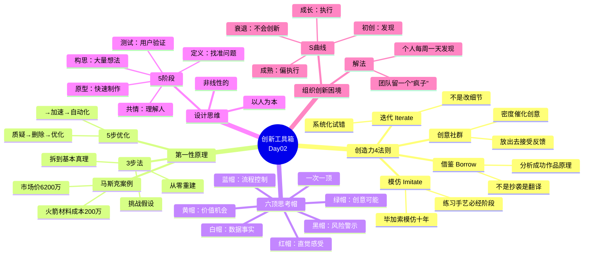

# 💡 Day02：创新工具箱——从第一性原理到设计思维

> **5🍅 · 四套经过验证的创新方法论，让你从"有想法"变成"能实现"**

---

## 🍅6 创造力曲线的4条法则：创意的工业化生产流程

### 🎬 悬疑钩子

讲一个让你不舒服的事实：

**毕加索抄袭了。**

他早期的作品——他成名前那些画——几乎可以在他崇拜的画家（戈雅、埃尔·格列柯、塞尚）的画里找到影子。他花了将近十年时间模仿别人，然后才找到了自己的风格。

披头士也是。他们早期的歌听起来像查克·贝里和巴迪·霍利的混合体——因为那本来就是。

史蒂夫·乔布斯也是。Mac电脑的图形界面和鼠标抄的是施乐，iTunes抄的是SoundJam（他买了然后改了个名），iPhone的触屏交互灵感来自一家叫FingerWorks的小公司。

**那他们算什么创新者？**

答案是："借鉴"本身就是创造力法则的一部分。问题不是你"抄没抄"，而是**你把抄来的东西变成了什么**。

### 📖 叙事主体

艾伦·甘尼特在《创造力曲线》里提出了**创造力的4条法则**。这四条法则构成了一个完整的创新流程，任何人都可以用：

#### 法则1：借鉴（Borrow）

这不是"抄袭"——这是**有选择地吸收**。

甘尼特研究了历史上最有创造力的天才，发现他们有一个共同习惯：**他们都是贪婪的读者和观察者**。他们不是在等灵感，而是在别人的作品里"挖"可用的元素。

**怎么借鉴**：
- 在你想创新的领域，找出5个最成功的作品/产品/方案
- 逐一分析：它们做对了什么？
- 不要抄"形式"，抄"原理"
- 然后问自己：这些原理能不能组合？能不能应用到另一个领域？

#### 法则2：模仿（Imitate）

借鉴是"拿来元素"，模仿是"练习手艺"。

每个领域的初学者都会经历这个阶段——毕加索模仿了十年，披头士在汉堡的小酒吧里翻唱了几百首别人的歌，昆汀·塔伦蒂诺在音像店看了七年电影才拍了第一部片子。

**模仿不是最终目的，但它是必经阶段。** 你在模仿过程中会建立对这个领域的基本认知——哪些元素有效、哪些无效、为什么。

> "不好的艺术家抄袭，伟大的艺术家剽窃。"——毕加索（这句名言本身也是偷的）

#### 法则3：创意社群（Creative Community）

创造力不是孤独的天才坐在山顶上等灵感。创造力发生在**人与人之间**。

蒙德里安的抽象画启发了包豪斯的设计师，包豪斯的设计影响了伊夫·圣·罗兰的时装，圣·罗兰的时装改变了整个时尚界——这是一条链。

**核心机制**：
- 把你的作品/想法放出去，让别人看
- 接受反馈（尤其是你不爱听的那种）
- 看别人的反馈，然后迭代
- 在一个"大家都在试"的群体里，你会被带着走

这也是为什么硅谷的创业者都挤在一个小地方，而不是分散在全国各地。**密度本身就是创意的催化剂。**

#### 法则4：迭代（Iterate）

这是被误解最深的法则。

大多数人对"迭代"的理解是"改改就好"。不对。迭代的意思是：**用同样的核心元素，不断尝试新的组合方式，直到找到最优解**。

**真正的迭代不是改一两处细节**——而是：
- 换一个完全不同的方式去解决同一个问题
- 对比两个方案，找出优缺点
- 把两个方案的优点融合
- 再换一个角度试

甘尼特举了一个例子：一家数据公司分析了上百万条互联网标题，想搞清楚"什么样的标题点击率高"。他们没靠直觉猜，而是让机器跑了上万次迭代测试，最后发现了一个公式——现在这个公式成了他们公司的核心资产。

**迭代的核心不是努力，是系统。**

### 📝 费曼三句话

```
🧠 费曼三句话
1. 创造力的4条法则：借鉴（拿元素）、模仿（练手艺）、
   创意社群（放出去接受反馈）、迭代（系统化试错）。
   它们构成一个完整流程，缺一不可。
2. "借鉴"不是抄袭。抄袭是原封不动搬过来，借鉴是理解原理
   之后应用到新领域。一个是搬运，一个是翻译。
3. 大多数人卡在"想一步到位"——他们不愿意先模仿、不愿意
   放出去被骂、不愿意反复改。但他们想要"创新"的结果。
   这就是悖论。
```

### 📌 连线笔记

回顾你最近做的一个项目/作品。你使用了4条法则中的哪几条？哪一条跳过了？——跳过的那条可能就是你的作品"少了点什么"的原因。

---

## 🍅7 深度工具：第一性原理 + 六顶思考帽

### 🎬 悬疑钩子

你听说过火箭很贵，对吧。一枚猎鹰9号的发射价格是6200万美元。

马斯克问了一个问题：**一枚火箭的材料成本是多少？**

他拆解了火箭：航空级铝合金、钛、铜、碳纤维。然后他去查了伦敦金属交易所这些原材料的价格——所有的材料加在一起，**大概值200万美元**。

6200万 vs 200万。30倍的差距。

这30倍不是物理定律决定的。是制造方式、供应链、行业惰性、一次性使用习惯决定的。

所以马斯克做了SpaceX，自己造火箭，实现了可重复使用。把发射成本降到了原来的十分之一。

**这是魔法吗？不是。这是他用的思考方法——第一性原理。**

### 📖 叙事主体

#### 工具1：第一性原理（马斯克 / 亚里士多德）

第一性原理的概念来自亚里士多德："一个不能再被推导的基本真理。"

马斯克把它变成了一个3步方法论：

**第1步：识别并挑战假设**

大多数人用"推理类比"思考——"别人这么做，我也这么做，因为大家都这么做。"

马斯克说："我完全不做市场调研。"

不是因为他傲慢，而是因为市场调研问你的是"你想要的未来是什么"——但人们不知道他们想要什么。他们只知道过去。

**第2步：拆解到不可再分的基本真理**

不停问"我**确实**知道什么"——而不是"我**认为**我知道什么"。

火箭的"基本真理"是什么？
- 它的原材料是铝、钛、铜、碳纤维
- 这些材料在市场上卖什么价格
- 物理定律允许这些材料达到什么性能

不是"火箭一直这么贵"——那是"假设"，不是"真理"。

**第3步：从零重建**

一旦你有了基本真理，**无视"所有人都是这么做的"**，从头设计解决方案。

马斯克的5步优化法（他亲口说的——他认为大多数工程师把顺序搞反了）：

| 步骤 | 动作 | 马斯克的铁律 |
|:----:|------|-------------|
| **1** | **质疑** | 让你的需求"不那么蠢" |
| **2** | **删除** | 如果你删了10%的东西没有加回来，就说明你删得还不够 |
| **3** | **优化** | 删除之后再优化——顺序不能错 |
| **4** | **加速** | 加快迭代周期 |
| **5** | **自动化** | 最后才考虑自动化——先保证你自动化的是"不该被删掉的东西" |

> "聪明工程师犯的最大错误，是优化了一个根本不应该存在的东西。"——埃隆·马斯克

**第一性原理适合什么时候用？**
- 成本高得离谱且没人能解释为什么
- 行业似乎已经很久没有真正突破了
- 所有人都说"这事儿就是这样"

**不适合什么时候用？**
- 日常小事（第一性原理要花大量脑力，不能每件事都用）

#### 工具2：六顶思考帽（爱德华·德·波诺）

如果说第一性原理是"深挖"，六顶思考帽就是"扩面"。

德·波诺发现一个普遍问题：**一群人讨论问题的时候，每个人戴着不同的"帽子"——一个在说风险，一个在说机会，一个在感觉不对，一个在抠数据。然后他们吵。**不是因为他们不对，而是因为他们根本没在同一个频道上聊。

**方案**：让所有人**同时戴同一顶帽子**，一次只从一个角度思考。

| 帽子 | 颜色 | 思考模式 | 你在这个模式下做的事 |
|:----:|:----:|----------|-------------------|
| ⚪ **白帽** | 数据 | 事实模式 | 只看数字和数据。没有观点，没有判断，只有信息 |
| 🔴 **红帽** | 情感 | 直觉模式 | 你的直觉是什么？不需要理由。"我就是觉得不对"——可以 |
| ⚫ **黑帽** | 谨慎 | 批判模式 | 这有什么问题？风险在哪？为什么行不通？ |
| 🟡 **黄帽** | 阳光 | 乐观模式 | 这有什么价值？机会在哪？如果行得通会怎样？ |
| 🟢 **绿帽** | 生长 | 创造模式 | 还有没有别的可能性？换一个方式试试？ |
| 🔵 **蓝帽** | 天空 | 过程模式 | 我们现在在讨论什么？下一步该用什么帽子？ |

**使用技巧**：
- 每次只戴一顶帽子。所有人同时戴同一顶。
- 蓝帽控制流程（通常由主持人戴，决定顺序）
- 红帽只需要30秒——直觉不需要论证
- 典型顺序：蓝→白→绿→黄→黑→红→蓝

德·波诺声称这个方法能让会议时间**减少20%-90%**。原因很简单：不吵架了。

### 📝 费曼三句话

```
🧠 费曼三句话
1. 第一性原理 = 拆到底层真理，从零重建。别问"别人怎么做的"，
   问"物理定律允许什么"。
2. 六顶思考帽 = 一次只从一个角度思考。数据→直觉→风险→
   价值→创造→流程。六顶帽子轮流戴，比你跟一群人吵到半夜强。
3. 这两个工具不矛盾：第一性原理帮你"深挖问题的根"，
   六顶思考帽帮你"把问题看全"。结合使用。
```

### 📌 连线笔记

明天开会的时候，试试用六顶思考帽：提议"我们先花2分钟只看数据（白帽），再花2分钟只说风险（黑帽），然后再聊别的。"——看看和你们平时的开会方式有什么不同。

---

## 🍅8 设计思维的创新勇气：从共情到迭代的完整闭环

### 🎬 悬疑钩子

IDEO的设计师被要求设计一个更好的购物车。

大多数人会怎么做？画一张更结实的、轮子更顺滑的、把手更舒服的购物车。

IDEO的做法呢？他们先派了一个团队去停车场**观察**。不是看购物车——是看人的行为。他们发现：

- 有人把购物车当婴儿车用（因为孩子坐里面）
- 有人靠购物车支撑走路（因为腿脚不便）
- 有人把购物车当"移动办公桌"（一边挑东西一边回手机）
- 购物车被塞进奇怪的角落取不出来（因为停车场的动线设计不合理）

然后他们问了一个不在"购物车"这个框子里的问题：**"人到底在超市里需要什么？"**

他们最终设计的购物车——不是"更好的购物车"，而是一个全新的东西。有可拆卸的篮子（你在车里装东西时不用整个车搬）、有孩子座椅、有灵活的轮子系统。

这个故事来自**设计思维**的核心方法论：**不是从"解决方案"出发，是从"人"出发。**

### 📖 叙事主体

#### 工具3：设计思维（斯坦福d.school 5阶段模型）

设计思维是一个**以人为本的创新流程**。它有5个阶段，但**不是线性的**——你可以在任何阶段回到之前的阶段重来。

**阶段1：共情（Empathize）**

不是"做调研"，是**真正理解用户在做什么、为什么做、卡在哪里**。

关键方法：
- 观察（而不是问——人们说的和做的不一样）
- 沉浸（自己去当一次用户）
- 访谈（别问"你想要什么"——问"你上次……的时候发生了什么"）

**阶段2：定义（Define）**

把你的洞察浓缩成一个**清晰的问题陈述**。注意——不是"我们需要一个更好的X"，而是"Y用户需要一种方式来Z"。

糟糕的问题定义："我们需要改进购物车。"
好的问题定义："在超市购物的老年人需要一个不依赖他人力量就能完成购物的方式。"

**问题定义的质量直接决定了后面的解决方案质量。** 这个阶段值得花最多时间。

**阶段3：构思（Ideate）**

不做筛选地产生大量想法。越多越好，越离谱越好。

关键规则：
- 数量优先，质量靠后
- 不批评（在这个阶段，任何批评都会切断思路）
- 建立在别人的想法上继续发散

**阶段4：原型（Prototype）**

把你的想法变成"东西"——不需要精致。纸板、便利贴、白板画、简易模型。越快越好，越便宜越好。

**原则**：每个原型只测试一个假设。如果你不知道它失败在哪里，说明你做得太复杂了。

**阶段5：测试（Test）**

把原型放到真实用户面前，看他们怎么用。不是"你觉得怎么样"——是**看他们做了什么**。

然后——回到阶段1或阶段3，重新来。

#### 创新勇气：为什么大多数组织会杀死创新

讲一个残酷的真相。

《创新者的基因》里有一个重要的观察：**大多数公司的生命周期杀死创新。**

- **初创期**：创始人靠发现技能（发问、观察、实验）活下来
- **成长期**：公司需要执行技能（分析、计划、管理）来规模化
- **成熟期**：执行型高管掌权，发现型人才被边缘化
- **衰退期**：公司发现自己不会创新了，于是花大价钱请顾问来教创新——但你的高管都是执行型选手，怎么可能突然学会发现？

**这就是"创新者的窘境"的真正根源**——不是技术问题，是人才结构问题。

**怎么解决？** 两个方法：

1. **个人层面**：刻意保持你的发现技能练习。不管你的工作是什么，每周至少花一天在做"发现"的事，而不是执行的事。
2. **组织层面**：如果你的团队全是执行者，找一个"戴红帽子的疯子"进来——他会让你不舒服，但你需要他。

### 📝 费曼三句话

```
🧠 费曼三句话
1. 设计思维的5个阶段：共情（先理解人）→定义（找准问题）→
   构思（大量想法）→原型（快速做出来）→测试（看用户反应）。
   核心：不是从解决方案出发，是从人出发。
2. 原型的原则：每个原型只测试一个假设。一次测三个假设的
   原型，失败了你不知道错在哪一步。
3. 大公司杀死创新的原因不是"管理不行"，是人才结构偏执行。
   自己保持发现技能的方法：每周至少一天做"发现"——提问、
   观察、试新东西、跟不同的人聊。
```

### 📌 连线笔记

你的团队/组织里，"疯子指数"有多高？如果一个新人进来提了一个"根本不现实"的想法，大家的第一反应是"有意思，展开说说"还是"这不现实"？——这个反应就是你组织的创新温度计。

---

## 🍅9 🧠 思维导图 + 费曼大复习

### 思维导图



### 费曼大复习

```
📢 今天你学到了什么？用你自己的话，给一个外行讲清楚：

1. "我抄了别人的，算不算没有创意？"
   （提示：4条法则里的"借鉴"和"模仿"）

2. "如果老板说'火箭一直这么贵，没别的办法'——你怎么用
   第一性原理反驳他？"
   （提示：拆解到原材料成本）

3. "一群人开会总吵架怎么办？"
   （提示：六顶思考帽——一次只戴一顶）

▶ 花2分钟，大声讲出来（或写下来）
```

---

## 🍅10 刻意练习 + 跨界应用

### 🎯 练习1：第一性原理实战

选一个你工作中遇到的"成本高/效率低/没人质疑"的问题：

```
【问题描述】

【第1步·假设清单】"人们觉得"这件事是这样的：
列举3-5个"所有人都知道"的假设

【第2步·拆到基本真理】哪些是物理/经济/逻辑的硬约束？
（不是"公司规定"，不是"行业惯例"——是那些真的不可改变的东西）

【第3步·重建】如果你现在是一张白纸，不准用任何"现有做法"，
你会怎么设计新的解决方案？
```

### 🎯 练习2：六顶思考帽——开一个"颜色会议"

下次需要做决策时，尝试用这个方法：

```
会议议程：
🔵 蓝帽（2分钟）：今天我们决定的是【具体决策】。顺序如下：
⚪ 白帽（3分钟）：只看数据。没人可以说"我觉得"，只说"数据显示"。
⚫ 黑帽（3分钟）：风险排查。如果这个方案行不通，原因最可能是什么？
🟡 黄帽（3分钟）：如果行得通，最好的结果是什么？
🟢 绿帽（3分钟）：还有没有我们没想过的方案？
🔴 红帽（1分钟）：不解释，只投票——你现在直觉上支持哪个方案？
🔵 蓝帽（2分钟）：结论和下一步。
```

### 🎯 练习3：交叉训练——4条法则循环

选一个你现在正在做的项目/写作/创作，用创造力4条法则跑一遍：

```
【借鉴】找出3个类似方向的作品，分析它们做得好的具体元素

【模仿】选其中一个元素，原封不动做一遍（练习不是发表）

【社群】把成果发给1-2个你信任的人，问："哪里不对？"
   ——注意：不是"你觉得怎么样"，是"哪里不对"

【迭代】根据反馈，改一版。然后再改一版。对比：
   - 第一版和第二版有什么区别？
   - 你从反馈中学到了什么？
```

### 🎯 练习4：设计思维速跑（1小时版）

如果你有一个下午的时间，可以做一个**迷你设计思维冲刺**：

```
⏰ 0:00-0:15 共情：找一个真正在使用你产品/服务的人，聊15分钟
  问：你最头疼的是什么？上次你因为这个骂人的时候发生了什么？

⏰ 0:15-0:25 定义：把你的发现写成一句"XX需要一种方式来XX"

⏰ 0:25-0:40 构思：在白板上写20个可能的解决方案（先不筛选）

⏰ 0:40-0:50 原型：选一个方案，用纸/便利贴/白板画做成"原型"

⏰ 0:50-1:00 测试：把原型给另一个人看，观察他的反应
```

---

## 🏁 课程总结

**两天、10个番茄、一套完整的创新工具箱：**

| 工具 | 解决什么问题 | 一句话总结 |
|------|-------------|-----------|
| 创造力曲线 | "我不够creative"的自我怀疑 | 创造力=熟悉度×新颖性，可学可练 |
| 5项发现技能 | "我该怎么练创新" | 联系+发问+观察+交际+实验 |
| 创新三类型 | "我该往哪个方向创新" | 根/域/维，大多数人的机会在维创新 |
| 4条法则 | "创意怎么落地" | 借鉴→模仿→社群→迭代 |
| 第一性原理 | "这事儿能不能从根本上改变" | 拆到底层真理，从零重建 |
| 六顶思考帽 | "一群人怎么有效讨论" | 一次只戴一顶帽子 |
| 设计思维 | "怎么设计出用户真正需要的东西" | 从人出发，快速原型，反复测试 |

**最后一句话**：

> "创造力不是一种天赋，而是一种行为方式。"
> ——你可以从今天开始，用这套工具箱中的任何一件，给自己做一个"创意实验"。
> 不需要等"灵感"——它大概率不会来。
> 但你可以自己走过去。

---

**🏁 本教程结束。现在去试试第一性原理那个练习——你可能会吓到自己。**
