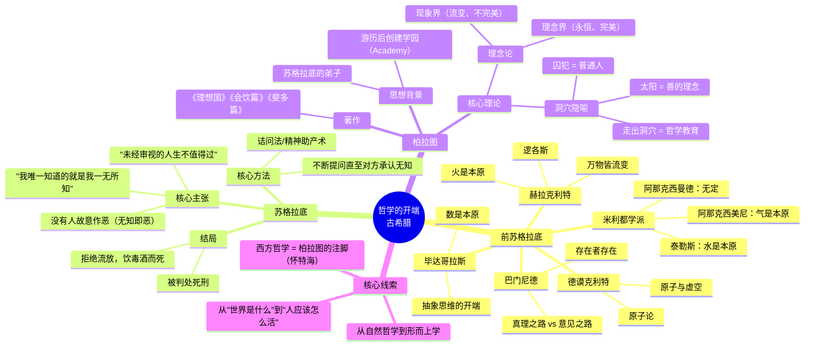

# Day 1：哲学的开端 · 从希腊的惊奇开始

> **本日目标**：理解哲学为什么从古希腊开始，前苏格拉底哲学家在追问什么，苏格拉底如何改变了哲学的方向，以及柏拉图的洞穴隐喻为什么两千五百年后还能让你脊背发凉。

---

## 🍅 1：第一个问"为什么"的人

**悬疑钩子**：泰勒斯说"水是万物的本原"——当时人们觉得他疯了。但他不是第一个给出答案的人，他是第一个**问出问题**的人。为什么人突然不满足于神话传说，非要追问一个"本原"？

### 泰勒斯与米利都学派

公元前6世纪，古希腊人相信世界是由宙斯、波塞冬和哈迪斯兄弟三人分管的。闪电是宙斯发怒，地震是波塞冬跺脚。这个解释体系很完整，也很方便——你不需要再问为什么，因为"神的意志"可以解释一切。

然后来了个叫泰勒斯（约前624—前546）的人。他没说神话是错的，他只是提出了另一个问题：**世界本质上是由什么构成的？**

这个问题在当时是爆炸性的。因为它在暗示：世界可能是有"本原"（arche）的——一个可以解释万物的**唯一原则**。泰勒斯观察万物都需要水的滋润才能生长，于是得出结论：水是万物的本原。

从现代科学的角度看，这个答案当然错了。但**问题本身比答案重要一万倍**。泰勒斯开启的不是"水本原说"，而是一种新的思维方式：**用自然解释自然，而不是用神话解释自然**。

他的学生阿那克西曼德觉得老师的说法不够抽象，提出本原应该是"无定"（apeiron）——一个没有任何规定性的东西。阿那克西曼德的学生阿那克西美尼又说，这个"无定"其实就是"气"。

三代师徒，一路追问。哲学，就这么开始了。

> **原文片段**：亚里士多德在《形而上学》中写道："泰勒斯认为水是万物的本原，他之所以产生这种看法，可能是因为他观察到万物都以湿的东西为养料，并且热本身是从湿气中产生并靠湿气维持的。"

✅ **费曼三句话**

```markdown
1. 泰勒斯是第一个从"神话模式"切换到"理性模式"问问题的人——他不问"谁创造了世界"而问"世界是由什么构成的"。
2. 他给出的答案（水）是错的，但他开启的追问方式是对的：用自然的、可观察的原因解释世界，而不是用神的意志。
3. 米利都学派三代师徒不断修正老师的观点，说明哲学从一开始就不是"找正确答案"，而是"持续追问"——这个问题比答案重要。
```

❓ **悬疑追问**：如果你现在说"世界本质上是能量/信息/数学结构"，两千年后的人会不会觉得你像泰勒斯一样天真？

📌 **连线笔记**：泰勒斯开启的自然哲学路线，在两千多年后演化成了自然科学。但哲学没有消失——它转向了苏格拉底式的问题。见 [[Day02-亚里士多德与希腊化哲学·幸福是什么|Day02]]。

---

## 🍅 2：苏格拉底——"我唯一知道的就是我一无所知"

**悬疑钩子**：苏格拉底不写书，他只在雅典大街上抓人聊天。他的"精神助产术"把自以为是的人逼疯到想杀了他——而雅典人确实这么干了。如果苏格拉底活到今天，你觉得他会在微博上干什么？

### 把哲学从天上拉回人间

泰勒斯之后的哲学家们继续追问"世界的本原是什么"，赫拉克利特说"火"，德谟克利特说"原子"，毕达哥拉斯说"数"。这些讨论很有趣，但有一个秃头胖子站出来说：**你们都在瞎忙活。**

苏格拉底（前469—前399）一辈子没写过一行哲学著作。我们今天知道他，全靠他的学生柏拉图的记载。西塞罗后来评价："**他是第一个把哲学从天上拉回人间的人。**"

苏格拉底关心的不是"世界是什么"，而是"人应该怎么活"。他问的是：什么是正义？什么是勇敢？什么是美德？如果你连这些基本概念都说不清楚，你怎么能说你"知道"任何东西？

### 精神助产术

苏格拉底的母亲是助产士。苏格拉底说，他做的是同样的事——帮别人"生出"他们内心已有的思想。他的方法叫"诘问法"（elenchus）：

1. 找一个大言不惭的人（比如某个自以为聪明的雅典政客）
2. 请对方给一个概念下定义（比如"什么是正义"）
3. 从对方的定义中找出逻辑矛盾
4. 逼对方承认"我不知道"
5. 循环，直到对方被逼疯或者开始真正思考

这招极其狠毒。因为它不是攻击你的知识不足，而是**攻击你以为自己知道但实际上不知道的东西**。苏格拉底曾经去问一位著名的将军"什么是勇气"，将军给出了一个漂亮定义，苏格拉底举了几个反例就把将军的体系拆光了。最后将军满头大汗，苏格拉底说：别急，我们重新来。

### 苏格拉底之死

公元前399年，苏格拉底被雅典民主法庭判处死刑，罪名是"不敬神"和"败坏青年"。在法庭上，他有机会认罪求饶，流放出境。但他拒绝了。他说了那句著名的话：

"**未经审视的人生是不值得过的。**"

他饮下毒酒，和朋友谈笑风生到最后一刻。

> **原文片段**（柏拉图《申辩篇》）：苏格拉底在法庭上说："雅典人啊，我敬爱你们，但我要服从神胜过服从你们。只要我一息尚存，还有力量，我就不会停止哲学实践，我会劝诫你们，我会向我遇到的每一个人说：'你是雅典人，属于这座最伟大、最以智慧和力量著称的城邦，但你只关心聚敛钱财、追求名声和荣誉，却不关心智慧和真理，也不关心如何使灵魂变得更好，你不感到羞愧吗？'"

✅ **费曼三句话**

```markdown
1. 苏格拉底不写书、不建学派、不搞理论体系——他只做一件事：拦住自以为懂的人，用提问把他们问到哑口无言。
2. 他的核心洞察是：大多数人生活在"以为自己知道"的幻觉里。承认无知不是耻辱，拒绝审视才是。
3. 他选择赴死而不是放弃哲学，因为他认为哲学的使命就是"审视"——而一个不让审视的社会，不值得活。
```

❓ **悬疑追问**：苏格拉底说"没有人会故意作恶"——所以坏人只是蠢而不是坏？你同意吗？想想你遇到过最可恶的人——他知不知道自己在作恶？

📌 **连线笔记**：苏格拉底的诘问法在当代演变成了"辩证思维"的基础。他的"知其无知"影响了笛卡尔的"我思故我在"。见后续 [[Day05-近代哲学·理性的觉醒|Day05]] 笛卡尔部分。

---

## 🍅 3：柏拉图——洞穴隐喻与理念论

**悬疑钩子**：那个著名的洞穴：一群人被锁链拴着面朝墙壁，只能看到墙上的影子。他们以为影子就是全部真实。直到有一个人挣脱锁链，走出洞穴，看到了太阳。你确定你现在不是还在洞穴里？你的"真实"有多少是墙上的影子？

### 理念论

柏拉图（前427—前347）是苏格拉底的学生。苏格拉底死了以后，柏拉图对雅典民主心灰意冷，离开雅典四处游历，回来后建立了一所学园（Academy）——这被认为是西方第一所大学。

柏拉图面对一个根本问题：**如果世界永远在变化，知识如何可能？**

你看，赫拉克利特说"人不能两次踏进同一条河"，万物皆流变。但如果你今天认为"正义是好的"，明天又觉得不是，你怎么能说你"知道"正义？真正的知识必须是**不变的、永恒的**。

柏拉图由此推导出了他的核心理论——**理念论**（Theory of Forms）：

- 我们所感知的物质世界是**流变的、不完美的**——这是"现象界"
- 在现象界背后，存在一个**永恒不变的、完美的世界**——这是"理念界"
- 我们看到的每一匹具体的马，都是"马的理念"的不完美复制品
- 我们感受到的每一次正义行为，都是"正义的理念"的模糊投影

这不是一个容易理解的理论，但柏拉图用了一个极其形象的比喻来解释它。

### 洞穴隐喻

想象一个地下洞穴。一群人从小就被锁链拴着，面朝墙壁，不能转头。他们身后有一堆火，火和犯人之间有一道矮墙，墙后有各种人形雕塑和道具被举着来回移动。火光把那些道具的影子投射到墙壁上。

对于这些囚犯来说，**影子就是全部的世界**。他们给影子命名，研究影子的变化规律，争论哪个影子更真实。

直到有一天，有一个人挣脱了锁链。他转过头，看到了火和道具，发现原来影子只是投影。他继续往外走，走出洞口，一开始被阳光刺得睁不开眼。慢慢地，他看到了真实的世界——花、树木、阳光。最后他看到了太阳——**一切可见之物的最终根源**。

他回到洞穴，告诉同伴们真相。但同伴们觉得他疯了，甚至要杀了他。

柏拉图说：这个走出洞穴的过程，就是**哲学教育的过程**。我们大多数人都是洞穴里的囚犯，以为墙上的影子就是真实。

> **原文片段**（柏拉图《理想国》，第七卷）："请你想象一个洞穴式的地下室，它有一道长长的通道通向外面，可让阳光照进洞穴。有一些人从小就住在这洞穴里，头颈和腿脚都绑着，不能走动也不能转头，只能向前看着洞穴的后壁……你认为这样的人会认为真实的东西除了这些阴影之外还会是什么？"

✅ **费曼三句话**

```markdown
1. 柏拉图认为我们感知的世界不是真正的"真实"——它只是真实世界的影子。真正"真实"的东西是理念：像"正义""美""马"这样的抽象概念，它们存在于一个永恒不变的理念世界中。
2. 洞穴隐喻就是人类认知状态的比喻：大多数人活在墙上的影子里（接受媒体、传统、权威告诉他们的"真实"），只有少数人挣脱锁链去看真实的世界（哲学家）。
3. 这个理论的疯狂之处在于：你无法证明自己现在不是还在洞穴里。你怎么确定你看到的"真实"不是另一层投影？
```

❓ **悬疑追问**：我们今天活在数字时代——你刷的短视频、看到的新闻、朋友圈里展示的"完美生活"——这些会不会就是洞穴墙上的影子？谁在操控火把和道具？

📌 **连线笔记**：柏拉图理念论影响了整个西方哲学——包括基督教（上帝在天上的完美国度）、康德（现象界与物自体）、甚至当代的"模拟世界"假说。见 [[Day04-中世纪与经院哲学|Day04]]。

---

## 🍅 4：🧠 思维导图



---

## 🍅 5：刻意练习

### 练习一：苏格拉底诘问法实践

**主题**：找一个你"确信无疑"的概念（比如"成功""自由""公平"），用苏格拉底的方法拷问自己。

**步骤**：
1. 写下你对这个概念的定义（比如："成功就是实现自己的目标"）
2. 问自己：什么是"目标"？所有目标都值得实现吗？如果一个人实现了伤害他人的目标，他算成功吗？
3. 修正定义，重复步骤2
4. 观察你自己是不是变得越来越不确定了？

**目标**：不要追求"找到正确答案"，而是体验"已知自己无知"的过程。

**示例**：

```
原始定义："自由就是做自己想做的事。"
苏格拉底反问：那如果我想打人，是不是该自由地打？
修正："自由是在不伤害他人的前提下做想做的事。"
苏格拉底反问：什么是"伤害"？精神伤害算吗？我开一家酒吧让人酗酒算伤害吗？
修正："自由是……等等，我发现我好像说不清楚。"
```

### 练习二：洞穴隐喻现代版改写

**任务**：把柏拉图的洞穴隐喻改写成一个**2026年的版本**。

你可以选择的角度：
- **社交媒体版**：算法推送给你的一切内容，就是墙上的影子。谁是那个走出洞穴的人？ta看到了什么？
- **职场版**：你从小被告知"好好读书、找好工作、买房结婚"——这套叙事是否就是洞穴墙上的影子？
- **AI时代版**：当AI可以生成以假乱真的视频、文字、图像，我们是否比柏拉图时代的人更分不清影子与现实？

**要求**：写200-300字，用现代场景重构洞穴隐喻，最后用一个反问句结束。

**示例开头**：
> 想象一个现代人，每天早上睁眼先看手机。他的信息茧房就像柏拉图的洞穴——算法是墙后的火把，朋友圈是投在墙上的影子。他以为世界就是这样的，直到有一天……

---

### 📝 今日备考卡片

| 问题 | 答案 |
|------|------|
| 泰勒斯为什么被称为"哲学之父"？ | 他第一个用自然原因（而非神话）解释世界的本原 |
| "精神助产术"是谁的方法？核心是什么？ | 苏格拉底。通过不断提问帮对方发现自己的无知 |
| 苏格拉底为什么被判死刑？ | "不敬神"和"败坏青年"，实质是他挑战了雅典权威 |
| 柏拉图理念论的核心是什么？ | 真正的实在不是物质世界，而是永恒不变的"理念" |
| 洞穴隐喻中的"太阳"代表什么？ | "善的理念"——一切存在和认识的最终根源 |

---

> **Day 1 完成度**：🍅🍅🍅🍅🍅 **5/60 番茄**
>
> 下一站：[[Day02-亚里士多德与希腊化哲学·幸福是什么|Day 2 —— 亚里士多德与希腊化哲学：幸福是什么？]]
> 
> **预告**：柏拉图的得意门生亚里士多德在学园待了20年，然后说了一句让整个雅典震动的话——"吾爱吾师，吾更爱真理。"他到底不同意老师什么？明天见。
