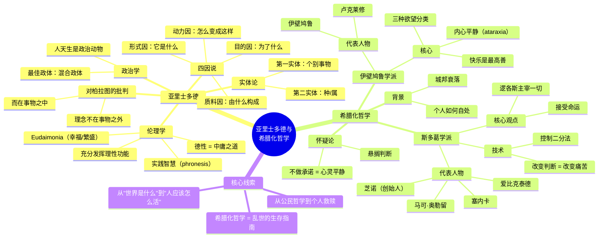

# Day 2：亚里士多德与希腊化哲学 · 幸福是什么

> **本日目标**：理解亚里士多德如何修正了柏拉图的理念论，他的"四因说"和"中庸之道"是什么，斯多葛和伊壁鸠鲁这两大希腊化哲学流派如何在乱世中教你获得内心平静。

---

## 🍅 6：柏拉图的叛徒

**悬疑钩子**：亚里士多德在柏拉图学园待了20年，是老师最得意的门生。柏拉图死后，他离开学园说了一句话——"吾爱吾师，吾更爱真理。"他到底不同意老师什么？

### 师徒恩怨

亚里士多德（前384—前322）17岁被送到雅典的柏拉图学园，一待就是20年。柏拉图称他是"学园之灵"。表面上，这对师徒关系好得不能再好。

但柏拉图去世后，亚里士多德没有继承学园领导权，而是离开了雅典。这段历史留下了诸多猜测：是亚里士多德不满学园的新领导，还是他根本就想另立门户？

真正值得关注的分歧在**理论层面**。

柏拉图的理念论认为：有一个独立的、超越的"理念世界"，物质世界只是这个理念世界的影子。你看到的每一匹马——它们之所以是"马"，是因为分享了"马的理念"。

亚里士多德说：**不对。**

他说理念如果与具体事物分离，那它就无法解释具体事物。理念不在天上，**就在事物本身之中**。你要理解"马"，不是去看一个抽象的马的理念，而是去**解剖一匹真实的马**——研究它的结构、功能、生长过程、目的。

这个分歧从根本上改变了西方思想的方向。柏拉图说"向上看"——去追寻超越的理念世界。亚里士多德说"向下看"——去研究眼前这个真实的世界。某种意义上，现代科学的精神继承的是亚里士多德的方法，不是柏拉图的。

> **原文片段**（亚里士多德《尼各马可伦理学》第一卷）：亚里士多德没有直接和老师翻脸，他用了更委婉的方式："虽然友爱和真理都是我们珍爱的，但虔诚要求我们更尊重真理。"

✅ **费曼三句话**

```markdown
1. 亚里士多德不同意柏拉图"理念在另一个世界"的说法——他认为普遍性（理念/形式）存在于具体事物之中，而不是之外。
2. 这看起来是个技术性争论，但它决定了后来两千年的思维方向：是"向上看"追求抽象真理，还是"向下看"研究具体世界。
3. 亚里士多德对具体事物的兴趣让他成为西方科学的重要起点——他写了从生物学到政治学几乎所有学科的基础著作。
```

❓ **悬疑追问**："吾爱吾师，吾更爱真理"这句话今天经常被用来合理化背叛或争论。你有没有遇到过这样的情况——明知老师的观点有问题，但说出来就是"大逆不道"？你选择了什么？

📌 **连线笔记**：亚里士多德的这个"接地气"的哲学方向，后来被经验论者（洛克、休谟）继承并发展为"一切知识来源于经验"的立场。见 [[Day05-近代哲学·理性的觉醒|Day05]] 经验论部分。

---

## 🍅 7：亚里士多德的形而上学与伦理学

**悬疑钩子**：亚里士多德说每件事都有"目的"——一把刀的目的就是切割，一颗橡果的目的就是长成橡树。那你的目的是什么？如果亚里士多德告诉你，你人生的目的就是"活得兴旺"——你会不会觉得他在说废话？

### 四因说

亚里士多德认为，要理解一个事物，必须回答四个问题：

1. **质料因**——它是由什么构成的？（雕像的青铜）
2. **形式因**——它是什么？（雕像的形状/本质）
3. **动力因**——它是怎么变成这样的？（雕刻家的手艺）
4. **目的因**——它是为了什么？（装饰神庙/审美）

这四个问题合在一起，才算"知道"了一个事物。

值得注意的是"目的因"——亚里士多德认为**一切事物都有内在的目的**。橡果的目的是长成橡树。眼睛的目的是看。人的功能（ergon）是理性活动。好的生活，就是充分发挥你自己特有的功能。

这引出了亚里士多德的伦理学核心：**幸福（eudaimonia）**。

### 幸福是什么

Eudaimonia 很难翻译成中文。不是"快乐"（happiness），"快乐"太浅了。更接近"**人的繁盛**"或"**活得好**"。

亚里士多德的论证是这样的：
- 每一个行为都指向某个目的
- 有些目的是手段（为了赚钱去工作），有些目的是自身（快乐、荣誉、知识）
- 最终需要一个**最高的、自足的目的**——它不是为了别的东西而被追求的
- 这个目的就是 eudaimonia

要获得这种幸福，你需要两样东西：
1. **德性（arete）**——卓越地发挥你的理性能力
2. **实践智慧（phronesis）**——在具体情境中做出正确判断的能力

### 中庸之道

"美德在于取中庸之道。"这句话常被误解为"什么事都别做过头"——但亚里士多德不是这个意思。

他说：面对危险时，勇气是懦弱和鲁莽之间的中点。但这个中点不是数学上的平均，而是**在合适的时间、对合适的人、以合适的方式、为合适的目的**做出合适的反应。

关键区别：**对谁来说的"中"**。一个相扑选手的中午餐量和一个模特的中午餐量能一样吗？

> **原文片段**（亚里士多德《尼各马可伦理学》第二卷）："伦理德性就是中道，它是对两恶之间的中道的把握——一恶是过度，一恶是不及……因此，从其本质和定义来看，德性是一种中道，但从其最好的角度来看，它又是极端。"

✅ **费曼三句话**

```markdown
1. 亚里士多德说万物都有"目的因"——理解一个东西就是知道它"为了什么"。你的人生目的是"活得好"（eudaimonia），不是单纯地快乐或有钱。
2. 要活得好，你需要培养德性（卓越的品质），并在每个具体情境中用实践智慧判断"什么才是合适的"——中庸之道就是这种判断能力。
3. 亚里士多德式的幸福不是一种感觉，而是一种状态：你充分发挥了自己作为理性人的潜能，并且在共同体中和他人一起生活得很好。
```

❓ **悬疑追问**：你觉得"幸福"是一种主观感受（你感觉幸福就是幸福），还是客观状态（你可能觉得幸福，但旁观者觉得你活得一塌糊涂）？亚里士多德选后者——你呢？

📌 **连线笔记**：亚里士多德的"德性伦理学"在20世纪复兴——麦金泰尔等哲学家认为现代道德哲学走错了方向，应该回到亚里士多德。见 [[Day11-冯友兰与中国哲学史|Day11]] 德行论视角。

---

## 🍅 8：希腊化哲学——斯多葛与伊壁鸠鲁

**悬疑钩子**：亚历山大死后，希腊世界陷入了战乱和动荡之中。哲学家们不再问"宇宙的本质是什么"，而是问一个更紧迫的问题：**世界这么乱，我怎么才能不崩溃？** 这两个学派都在乱世中教人获得内心平静——我们是不是也活在某种"乱世"里？

### 背景：当世界失控

亚里士多德去世（前322）后的三百年间，希腊世界经历了亚历山大帝国的分裂、城邦制的崩塌、专制王权的兴起。在此之前，哲学家探讨"世界是什么"；在此之后，哲学家紧急讨论"**我该如何活**"。

### 斯多葛学派

创始人芝诺（约前336—前264）在雅典的"彩绘柱廊"（Stoa Poikile）下讲课，因此得名"斯多葛"（Stoic）。

核心思想听起来有点"丧"但异常有力：

**世界受理性（逻各斯）支配，一切发生的事都有其必然性。你无法改变命运，但你可以改变对命运的态度。**

斯多葛有一个著名的比喻：你像一条被拴在车后的狗。车往前走，你跟着走就不会被拖伤，你抵抗就会被勒死。**你唯一的选择不是车往哪走，而是——别被拖得太难看。**

斯多葛最重要的技术是**控制二分法**（爱比克泰德提出）：
- 有些事情取决于你（你的判断、选择、欲望、态度）
- 有些事情不取决于你（你的健康、财富、名声、甚至生死）

把精力集中在前者，对后者保持平静接受。

**塞内卡**（罗马政治家、斯多葛哲学家）提醒我们：我们不是因为事情本身痛苦而痛苦，而是因为**我们对事情的判断**让我们痛苦。改变判断，痛苦就消失了。

**马可·奥勒留**（罗马皇帝、哲学家）在《沉思录》中写："**你无法掌控别人对你的看法——这根本不关你的事。**" 他写这句话的时候正在多瑙河边指挥军队对抗蛮族入侵，老婆死了，孩子夭折了，帝国在崩溃。

> **原文片段**（马可·奥勒留《沉思录》卷二）："清晨，当你赖床不想起来时，就这样想：我要起来去做一个人的工作。我生来就是为了做这个工作的，难道我该为此抱怨吗？我生来就是为了躺在我被窝里取暖的吗？……那么每一件事都是恰当的吗？难道大自然是为了让你享受温暖而赋予你生命的吗？"

### 伊壁鸠鲁学派

伊壁鸠鲁（前341—前270）说：**快乐是最高善**。但他说的"快乐"不是你想象的那种——不是狂欢宴饮、放纵欲望。

伊壁鸠鲁区分了三种欲望：
1. **自然且必要的**——比如食物、住所。不满足就会痛苦。应该满足。
2. **自然但不必要的**——比如美食美酒。满足会带来短暂快乐，但不满足也不会死。谨慎满足。
3. **既不自然也不必要的**——比如权力、名望、奢侈品。满足它们是痛苦的开始，**最好完全避免**。

伊壁鸠鲁的"快乐"其实是**无痛苦状态**（aponia）和**内心平静**（ataraxia）。他说：你不需要很多，只需要足够。一个简单的生活加上几个真心的朋友，就是快乐。

> **原文片段**（伊壁鸠鲁《致美诺西斯的信》）："当我们说快乐是最终目的时，我们说的不是那些挥霍无度的人的快乐，也不是感官享受的快乐——就像有些无知的人所理解的那样。我们说的是身体的无痛苦和灵魂的无纷扰。"

✅ **费曼三句话**

```markdown
1. 斯多葛和伊壁鸠鲁都是为了在一个动荡不安的世界中找到内心平静——但方法不同：斯多葛说"接受你不能改变的"，伊壁鸠鲁说"减少你的欲望"。
2. 斯多葛的核心武器是控制二分法：把精力放在你能控制的事（判断、态度）上，对不能控制的（财富、健康、他人看法）保持平静。
3. 伊壁鸠鲁的"快乐"不是放纵，反而是"减法"——减少不必要欲望后达到的无痛苦、无焦虑状态。
```

❓ **悬疑追问**：斯多葛说"控制你能控制的"，伊壁鸠鲁说"减少欲望"。这两种策略在今天的消费主义社会中各自有什么陷阱？你觉得哪条路更难走？

📌 **连线笔记**：斯多葛学派对基督教伦理影响极大（特别是早期教父哲学）。伊壁鸠鲁的原子论和快乐主义影响了近代经验论者。认知行为疗法（CBT）的底层逻辑和斯多葛哲学高度一致。见 [[Day04-中世纪与经院哲学|Day04]]。

---

## 🍅 9：🧠 思维导图



---

## 🍅 10：刻意练习

### 练习一：斯多葛"控制二分法"日常应用

**场景**：假设你明天有一个重要面试（或演讲、考试）。你很紧张，担心表现不好。

**第一步**：划出下面这个表格，填入你能控制的 vs 不能控制的因素：

| 你能控制的 | 你不能控制的 |
|------------|-------------|
| e.g. 准备程度 | e.g. 面试官的心情 |
|            |              |
|            |              |
|            |              |

**第二步**：针对"你能控制"的列，列出一个行动计划。

**第三步**：针对"你不能控制"的列，**意识到担心它们毫无意义**，并练习说"这不关我的事"。

**反思**：这个练习让你感觉如何？有没有哪件事是你本来以为不能控制，但写下来发现其实可以控制的？

### 练习二：亚里士多德"中庸之道"分析

**任务**：针对下面这些品质，找出两个极端（过度和不及），并说出"中道"是什么。

| 情境 | 不及（恶） | 中道（德性） | 过度（恶） |
|------|-----------|-------------|-----------|
| 面对危险 | 懦弱 | 勇气 | 鲁莽 |
| 消费 | 吝啬 | 慷慨 | 挥霍 |
| 自我评价 | 自卑 | 真诚 | 吹嘘 |
| 表达愤怒 | 麻木 | 义愤 | 暴怒 |
| 社交 | 孤僻 | 友善 | 谄媚 |

**深度追问**：亚里士多德说"中道"不是数学平均——它因人和情境而异。请举一个例子，说明在某个人身上的"中道"，对另一个人来说可能是"过度"或"不及"。

---

### 📝 今日备考卡片

| 问题 | 答案 |
|------|------|
| 亚里士多德为什么不同意柏拉图的理念论？ | 因为理念如果与事物分离，就无法解释事物——形式就在事物本身之中 |
| 四因说是哪四因？ | 质料因、形式因、动力因、目的因 |
| Eudaimonia 是什么意思？ | 人的繁盛/繁荣——不是短暂快乐，而是充分发挥理性功能的良好状态 |
| 中庸之道的真正含义是什么？ | 在合适的时间对合适的人以合适的方式做合适的事——不是平均主义 |
| 斯多葛学派控制二分法是什么？ | 把精力放在你能控制的事情上（判断、态度），平静接受你不能控制的（命运、他人） |
| 伊壁鸠鲁说的"快乐"是什么意思？ | 不是纵欲，而是减欲后的无痛苦（aponia）和内心平静（ataraxia） |

---

> **Day 2 完成度**：🍅🍅🍅🍅🍅 **10/60 番茄**
>
> 下一站：[[Day03-中国哲学之根·先秦诸子|Day 3 —— 中国哲学之根：先秦诸子]]
>
> **预告**：黑格尔说中国没有哲学——因为他不懂中文。雅斯贝尔斯说，公元前800年到前200年，中国、印度、希腊同时出现了伟大的思想家，这叫"轴心时代"。孔子和柏拉图是同一代人。明天我们回来看看，东方人问的问题和西方人到底有什么不一样。
