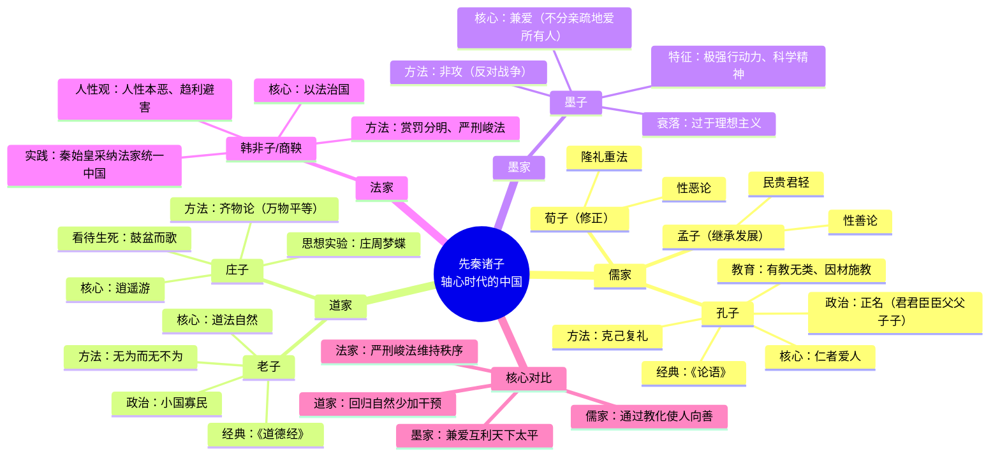

# Day 3：中国哲学之根 · 先秦诸子

> **本日目标**：理解中国哲学的独特提问方式，掌握儒家（孔子）和道家（老子、庄子）的核心思想，对比儒道法墨四家的不同答案，思考"中国有没有哲学"这个问题的真正含义。

---

## 🍅 11：西方人说中国没有哲学？

**悬疑钩子**：这是黑格尔说的——而且他不懂中文。雅斯贝尔斯提出"轴心时代"概念：公元前800-200年，中国出现了孔子和老子，印度出现了佛陀和《奥义书》，希腊出现了苏格拉底、柏拉图和亚里士多德。他们彼此不知道对方的存在，却几乎同时在追问人类最根本的问题。这是巧合吗？

### "中国没有哲学"——这句话是什么意思？

黑格尔在《哲学史讲演录》里说了这么一句话：**"中国没有哲学。"** 说实话，他确实没资格下这个结论——他不懂中文，对中国的了解主要靠传道士的报告和翻译质量可疑的典籍。

但他这句话之所以被反复提及，是因为它触碰了一个真正的问题：**"哲学"这个范畴，到底是普世的，还是希腊-欧洲特有的？**

如果"哲学"被定义为"从泰勒斯开始的、以逻辑论证为基础的、对存在和知识的系统研究"，那么中国确实"没有哲学"——就像中国没有"马拉松"一样。

但如果你把"哲学"定义为**"关于人生根本问题的理性反思"**——那中国不仅有，而且非常丰富。

德国哲学家卡尔·雅斯贝尔斯（1883—1969）提出了一个更有包容性的框架——**轴心时代**（Axial Age）。他认为公元前800到前200年间，整个人类文明发生了一场精神革命。中国、印度、波斯、希腊同时出现了一批伟大的思想家：

| 地区 | 核心人物 | 核心关怀 |
|------|---------|---------|
| 中国 | 孔子、老子、庄子、墨子、韩非 | **人应该如何生活？社会如何治理？** |
| 印度 | 佛陀、大雄（耆那教） | 如何从轮回中解脱？ |
| 希腊 | 苏格拉底、柏拉图、亚里士多德 | **世界的本原是什么？真理和正义是什么？** |
| 波斯 | 琐罗亚斯德 | 善恶二元对立的终极意义 |

关键区别在这里：**西方哲学从"世界是什么"开始，中国哲学从"人应该怎么活"开始。**

这不是"落后"或"先进"的区别——这是出发点的不同。西方人问"真"，中国人问"善"。不能说问善比问真低级，就像不能说思考怎么活比思考宇宙是什么低级。

> **原文片段**：雅斯贝尔斯在《历史的起源与目标》中写道："人类历史中，最深邃的转折点出现在公元前800年至前200年之间……正是在这个时期，中国出现了孔子和老子，印度出现了《奥义书》和佛陀，波斯出现了琐罗亚斯德，巴勒斯坦出现了以利亚和以赛亚，希腊出现了荷马、巴门尼德、赫拉克利特、柏拉图和修昔底德。这个时代产生了至今仍在指导人类思考的基本范畴。"

✅ **费曼三句话**

```markdown
1. 黑格尔说"中国没有哲学"是因为他站在希腊定义的标准上——但那是文化傲慢。轴心时代表明中国、印度、希腊在差不多同期出现了独立的思想革命。
2. 中国哲学的出发点和西方不同：西方从"宇宙是什么"开始（本体论/认识论），中国从"人应该怎么活"开始（伦理学/政治哲学）。
3. 这两种路径没有高低之分——你关心世界的终极实在，还是关心如何在这个世界上好好活着？两个都是哲学的根本问题。
```

❓ **悬疑追问**：你觉得"哲学"这个词应该只用来描述西方传统，还是可以广义地包括所有文明的"根本思考"？如果把中医叫"医学"，把孔子叫"哲学"——这是在尊重其他文明，还是在用别人的标准衡量自己？

📌 **连线笔记**：轴心时代的概念也和西方存在主义思想家（雅斯贝尔斯本人就是存在主义哲学家）的"临界境遇"（Grenzsituation）概念有关。见 [[Day08-现象学与存在主义|Day08]]。

---

## 🍅 12：孔子——仁与礼

**悬疑钩子**：孔子周游列国十四年，到处碰壁，被人形容为"丧家之犬"。如果你穿越回去，你劝他放弃吗？他没有放弃——所以他成了孔子。是信念让他坚持，还是倔强？

### 孔子和他的时代

孔子（前551—前479）生活在春秋末期——一个"礼崩乐坏"的时代。周天子的权威不复存在，诸侯互相征伐，贵族僭越礼制。孔子看到了什么？他看到了**秩序的崩塌**和**人心的迷失**。

但他的解决方案和同时代的希腊哲学家完全不同。苏格拉底追问"什么是正义"——他想要一个**概念上的定义**。孔子不搞这套。孔子直接说：**你做一个好人，世界就会好一点。**

### 仁者爱人

孔子的核心概念是**仁**。这个字在《论语》中出现了109次，但孔子从来没有给出一个标准定义。他给不同学生以不同的回答，这是他的教学方法——"因材施教"。

但如果我们试着提炼核心，"仁"最朴素的解释就是**"爱人"**。不是抽象地爱全人类，而是从身边做起：爱父母（孝）、爱兄弟（悌）、爱朋友（信），然后把这个"爱的能力"扩大到更广的范围。

孔子说："**己所不欲，勿施于人。**"（《论语·颜渊》）这句话被后世称为"黄金法则"——全世界所有道德体系中几乎都有类似表述。

### 礼乐教化

孔子"仁"的外在表现是"礼"。礼不是我们今天说的"礼貌"，而是一整套社会行为规范。孔子认为，一个人的内在仁德必须通过外在的礼来表现出来。

孔子还特别重视**乐**——音乐教育。他认为好的音乐可以陶冶性情，促进社会和谐。

### 正名

孔子还提出了一个影响深远的思想——**正名**。"名不正则言不顺，言不顺则事不成。"意思是：每个社会角色都对应着特定的责任和规范。君要像君，臣要像臣，父要像父，子要像子。

这个思想后来被很多人批评为"维护等级制度"。确实有这个问题。但孔子的出发点不是压迫，而是**秩序**——他相信每个人的身份都有其内在的道德要求，你不是简单地"当官"，你要"像官一样做人"。

> **原文片段**（《论语·颜渊》）："樊迟问仁。子曰：'爱人。'……颜渊问仁。子曰：'克己复礼为仁。一日克己复礼，天下归仁焉。为仁由己，而由人乎哉？'"

✅ **费曼三句话**

```markdown
1. 孔子哲学的核心不是抽象理论，而是实践智慧：做一个好人，不是"知道什么是对的"，而是"去做对的事"。
2. "仁"就是爱人，从爱身边的人开始，逐步扩展到更大的范围。"己所不欲，勿施于人"是全世界道德的共同底线。
3. 孔子不是保守派，他是理想主义者——他相信通过教育（而不是武力）可以改变人性，进而改变社会。他周游列国被人嘲笑，但从未放弃。
```

❓ **悬疑追问**：孔子说"为仁由己"——做一个好人完全取决于你自己。但你也知道好人没好报的例子比比皆是。如果让你选：做一个幸福但不道德的人，还是做一个痛苦但有德的人？你选哪个？

📌 **连线笔记**：孔子的"仁义礼智信"五常形成了东亚文明两千年的道德基础。他的"正名"思想影响了后来的法家（韩非）和政治哲学。见 [[Day07-中国哲学的发展·从汉唐到宋明|Day07]] 程朱理学部分。

---

## 🍅 13：老子与庄子——道与自然

**悬疑钩子**：庄子梦见自己成了一只蝴蝶，飞来飞去好不自在。醒来后他问了一个让所有哲学家失眠的问题：**我怎么知道我是梦见蝴蝶的庄子，而不是梦见庄子的蝴蝶？** 两千多年后，《黑客帝国》问的是同一个问题。

### 老子和《道德经》

老子（约前571—约前471）比孔子年长一些。据说孔子曾经向他请教过"礼"。老子的生平极其模糊——司马迁在《史记》中已经说不清楚他是谁了。传说他出函谷关时被关令尹喜拦住，非要他留下著作，于是他写了五千字——这就是《道德经》。

《道德经》的核心概念是**道**。

"道"可以理解但难以定义。老子开篇就说：**"道可道，非常道。"**——如果能说清楚的"道"就不是那个永恒的"道"了。

道的几个特征：
- 它是万物的根源："道生一，一生二，二生三，三生万物"
- 它不刻意作为，但一切自然成就——"无为而无不为"
- 它柔弱如水，但水滴石穿——"天下莫柔弱于水，而攻坚强者莫之能胜"

老子的哲学可以用两个字概括：**自然**。不是"大自然"的自然，而是"**自己本来的样子**"。不要用力过猛，不要人为过度干预，让事物按照自己的本性发展。

### 庄子与逍遥

庄子（约前369—前286）继承并发展了老子的思想。如果说老子是深沉的政治哲学，庄子就是狂放的文学哲学。

庄子的核心概念是**逍遥**——绝对的精神自由。他的"逍遥游"就是人如何摆脱一切束缚、达到精神上的完全自由。

庄子最著名的思想实验是**庄周梦蝶**：

> 昔者庄周梦为胡蝶，栩栩然胡蝶也，自喻适志与！不知周也。俄然觉，则蘧蘧然周也。不知周之梦为胡蝶与，胡蝶之梦为周与？

用现代话说：庄子梦见自己是蝴蝶，飞来飞去很开心，完全不知道自己曾是庄子。醒过来发现自己又是庄子了。然后他问了一个毛骨悚然的问题：**我怎么知道我是庄子在梦里成了蝴蝶，还是一只蝴蝶在梦里成了庄子？**

这个思想实验在公元前4世纪就被提出来了。两千年后的笛卡尔用"我思故我在"回应类似的怀疑，两千年后的《黑客帝国》拍了同样的主题。

### 无为

"无为"不是什么都不做。老子说的"无为"是**不妄为**——不违背事物的自然规律去强作妄为。水往低处流，不争不抢，但是没有什么能阻挡它。

庄子把"无为"发挥到了极致：他妻子去世了，他鼓盆而歌。朋友惠子批评他，庄子说：生死如同四季轮回，我为什么要哭？

> **原文片段**（《道德经》第二十五章）："人法地，地法天，天法道，道法自然。"

> **原文片段**（《庄子·齐物论》）：庄周梦蝶全文："昔者庄周梦为胡蝶，栩栩然胡蝶也，自喻适志与！不知周也。俄然觉，则蘧蘧然周也。不知周之梦为胡蝶与，胡蝶之梦为周与？周与胡蝶，则必有分矣。此之谓物化。"

✅ **费曼三句话**

```markdown
1. 道家哲学的核心是"道"和"自然"——道是万物的根源和运行规律，但不是有意志的神；自然是让事物按自己的本性发展，不要过度干预。
2. "无为"不是躺平——是不违背规律地做事。像水一样：柔而不争，但没有什么能阻挡它。你对抗洪水的努力是徒劳的，但引导水流才是智慧。
3. 庄周梦蝶提出了一个两千多年都未被解决的哲学问题：如何确定什么是真实？《黑客帝国》里的尼奥面临的就是庄子的同一个困境。
```

❓ **悬疑追问**：如果你今天真的发现自己是"缸中之脑"——所有的一切都是模拟——你会崩溃，还是会像庄子一样"栩栩然"地对这个发现感到自由？如果你的痛苦、焦虑都是虚假的，它们还重要吗？

📌 **连线笔记**：道家的"无为"思想影响了中国政治哲学（汉初黄老之学）、美学（中国画的水墨意境）、禅宗（自然任运）。和西方存在主义有深刻的共鸣——海德格尔的"存在"和老子的"道"经常被放在一起比较。见 [[Day07-中国哲学的发展·从汉唐到宋明|Day07]] 禅宗部分。

---

## 🍅 14：🧠 思维导图



---

## 🍅 15：刻意练习

### 练习一：儒家 vs 道家人生困境对比分析

**场景**：你是一个公司中层管理者。你的下属犯了严重错误，给公司造成了不小的损失。这个下属平时工作很努力，这次主要是客观原因。按照公司规定，他应该被开除。你是他的直接领导，你也很喜欢他。

**儒家视角的分析**：
- 仁：你要"爱人"——你要考虑这个人的处境和他家庭的命运
- 义：但你要做"对的事"——不是滥好人，而是基于原则的判断
- 礼：公司规定有其正当性和必要性，不能随意打破
- 中庸：既不冷酷开除，也不包庇纵容——中间道路是什么？

你的答案（儒家）：
_________________________________

**道家视角的分析**：
- 道：事情的发生有其自然的因果，不要强为——这是"客观原因"导致的，不是你或他能完全控制的
- 无为：顺应自然的处理方式是什么？不要用"规章制度"来扭曲自然的判断
- 柔：用水的方式——不硬碰，但找到一条让各方都能接受的路

你的答案（道家）：
_________________________________

**反思**：儒家和道家给出了不同方向的引导。在现实生活中，你会更偏向哪一边？有没有可能两者兼用？

### 练习二："庄周梦蝶"现代版思想实验

**任务**：将庄周梦蝶改写成三个不同的2026年版本。

**版本A：AI版**
想象你是一个正在和ChatGPT对话的人。对方的回答如此自然、有深度，以至于你开始怀疑——也许你自己也是一个人工智能，只是被植入了"我是一个人类"的记忆。你怎么证明你不是？

**版本B：虚拟现实版**
你戴上VR头盔进入一个极其逼真的世界。在里面待了整整一年。当你脱掉头盔时，你完全恍惚了——你怎么确定你现在所处的"现实"不是另一个层级的VR？

**版本C：你想要的任何现代版**

**核心追问**：庄子的问题不是"哪个世界是真实的"，而是**"如果两个世界都同样真实地被我体验，'真实'这个词还有意义吗？"**

---

### 📝 今日备考卡片

| 问题 | 答案 |
|------|------|
| 什么是"轴心时代"？ | 雅斯贝尔斯提出，公元前800-200年中国、印度、希腊同时出现伟大思想家，奠定人类精神基础 |
| 中国哲学和西方哲学的根本区别是什么？ | 西方从"世界是什么"（存在论）出发，中国从"人应该怎么活"（伦理学）出发 |
| 孔子"仁"的核心含义是什么？ | 爱人。从爱身边的人做起，推己及人 |
| "己所不欲，勿施于人"是孔子在哪提出的？ | 《论语·颜渊》——被称为道德的"黄金法则" |
| "道可道，非常道"是什么意思？ | 能被说清楚的道就不是永恒的道——道超越语言和概念 |
| 庄周梦蝶提出了什么哲学问题？ | 如何确定什么是真实？感知到的真实是否就是真实本身？ |
| "无为"是躺平什么都不做吗？ | 不是。是"不妄为"——不违背事物自然规律地行动 |

---

> **Day 3 完成度**：🍅🍅🍅🍅🍅 **15/60 番茄**
>
> 下一站：[[Day04-中世纪与经院哲学|Day 4 —— 中世纪与经院哲学：信仰与理性之争]]
>
> **预告**：罗马帝国灭亡后，欧洲进入了漫长的中世纪。哲学成了神学的婢女。但基督教需要面对一个棘手的问题：信上帝和用理性思考——这两者矛盾吗？如果神是全善全能的，世界上为什么还有恶？奥古斯丁和阿奎那为此用了一千年来吵架。我们明天见。
>
> 🔙 回顾：[[Day01-哲学的开端·从希腊的惊奇开始|Day 1]] | [[Day02-亚里士多德与希腊化哲学·幸福是什么|Day 2]]
