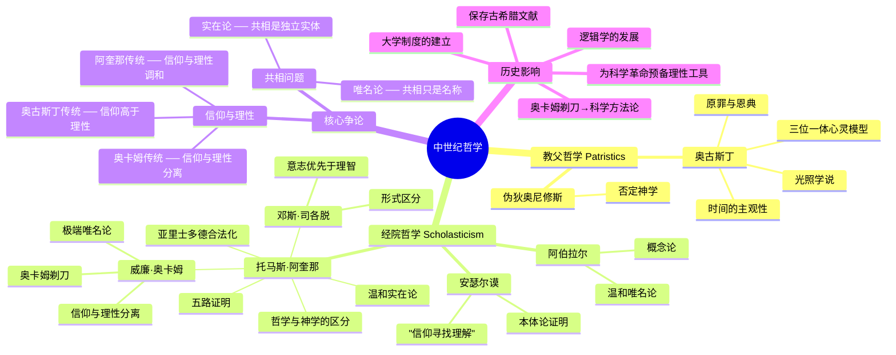

# Day 4：中世纪哲学与经院哲学——信仰寻找理解

> **悬疑预告**：人们常说"中世纪是黑暗的"，哲学被神学当了女仆。但事情没那么简单——如果没有中世纪的经院哲学家保存和翻译古希腊文献，文艺复兴和科学革命可能永远不会发生。最反转的是：奥卡姆剃刀——一个神学家发明的原则，最终成了推翻神学的科学方法论。

---

## 🍅 番茄16：哲学被关了一千年？

### 🎬 悬疑开场：谁偷走了哲学？

公元529年，东罗马皇帝查士丁尼关闭了雅典的柏拉图学园——运营了将近九百年的哲学圣地，关门了。

如果你是一个生活在公元7世纪的欧洲人，你大概率不会写自己的名字。你不会希腊语。你从没见过亚里士多德的任何一本书。你甚至不确定"哲学"是个什么东西。

传统叙事里，"中世纪黑暗期"把哲学关进了神学的牢笼，哲学变成了"神学的婢女"——听起来像个闷得发慌的千年囚禁故事。

但反转来了：**如果没有中世纪，你可能永远读不到柏拉图和亚里士多德。**

因为真正把古希腊文献保存下来并发扬光大的，不是文艺复兴人，而是中世纪的经院哲学家。只不过他们的版本有一个"中间商"——阿拉伯世界。

公元8世纪起，阿拉伯帝国的翻译运动（巴格达的"智慧宫"）大规模翻译了亚里士多德、柏拉图的著作。然后这些文本通过西班牙的托莱多传回拉丁世界。到了13世纪，亚里士多德恐慌症爆发——教会发现这位异教徒哲学家的思想已经在大学里疯狂传播，学生们宁愿听亚里士多德也不听神学课。

怎么办？封杀？还是消化？

教会选择了后者。于是托马斯·阿奎那出场。他干了一件前无古人的事：证明亚里士多德和基督教不矛盾。

这就是中世纪哲学的真正面目——不是哲学被杀死了一千年，而是一场长达千年的**信仰与理性的谈判桌**。

### 📜 原文片段

> "哲学是神学的婢女。"（Philosophia ancilla theologiae）——中世纪流行语，出自彼得·达米安

这句话经常被用来证明中世纪哲学地位卑微，但完整语境的意思是："哲学可以作为工具来为信仰服务"——教会之所以容忍哲学存在，是因为它有用。

### ✋ 费曼三句话

1. 中世纪不是哲学被消灭了，而是哲学成了神学的"御用顾问"——有地位，没自由，但活着。
2. 如果没有阿拉伯世界的翻译运动，亚里士多德会在欧洲失传——我们今天对古希腊哲学的了解会少一大半。
3. 经院哲学家所做的"信仰寻找理解"（fides quaerens intellectum），无意中为后来的科学理性打下了基础。

### ❓ 悬疑追问

如果中世纪的哲学是为神学服务的，那它凭什么能被称作"哲学"？换个角度问：一个被限制了选题范围的思想家，还能做出真正的哲学贡献吗？

### 🔗 连线笔记

- 想想[[Day01-古希腊哲学·本体论的诞生|古希腊本体论]]——古希腊人追问"世界的本原"，到了中世纪变成追问"上帝的本质"
- [[Day05-近代哲学·理性的觉醒|Day05-近代哲学]]——文艺复兴的关键前提之一，正是经院哲学积累的逻辑和理性工具

---

## 🍅 番茄17：奥古斯丁——时间是什么？

### 🎬 悬疑开场：你不问的时候知道，一问就不知道

> "你不问我时间是什么的时候，我知道时间是什么。你一问，我就不知道了。"

这句话出自奥古斯丁的《忏悔录》第11卷，写于公元397年。距笛卡尔"我思故我在"还有1200年。距康德《纯粹理性批判》还有近1400年。

奥古斯丁提出了一个让当代物理学家都头疼的问题：**时间不是客观存在的**——它只是人的主观感受。

他说：过去已经不存在，未来还没到来，而"现在"转瞬即逝。所以时间到底是什么？答案是：时间是灵魂的伸展（distensio animi）。过去是记忆，现在是注意，未来是期待——它们都存在于心灵之中。

这个观点比康德早了14个世纪。康德说空间和时间是"先天直观形式"——时间和空间不在外部世界，而在我们的认知结构里。奥古斯丁在公元4世纪就触及了类似的结论。

奥古斯丁还发明了**三位一体的心灵模型**：记忆（memoria）、理智（intellectus）、意志（voluntas）。这三者对应上帝的圣父、圣子、圣灵。当代认知心理学中的"工作记忆模型"——中央执行系统、视觉空间模板、语音回路——你能看到一种惊人的结构相似性。

一个公元4世纪的北非主教，在思考上帝的时候，无意中为两千年后的认知科学画了一张草图。

### 📜 原文片段

> "我的灵魂在燃烧，因为我想知道这个最复杂的谜。主啊，我向你忏悔——向你承认我仍然不知道时间是什么。但我同时知道，我在时间里说这些话，并且我已经谈了很久'时间'这件事了……" ——奥古斯丁《忏悔录》

### ✋ 费曼三句话

1. 奥古斯丁把时间"主观化"了——时间不是外部世界的属性，而是人心的功能。
2. 他的"记忆-理智-意志"三位一体模型，和现代认知心理学的脑功能分区在结构上有惊人的对应。
3. 奥古斯丁说"我怀疑所以我存在"比笛卡尔早了1200年——虽然他的目的不是建立主体性哲学，而是为了论证上帝之光。

### ❓ 悬疑追问

奥古斯丁的"上帝之光"（illuminatio）说：真理之所以能被认识，是因为上帝的光照在我们心灵上。这听起来很神秘。但如果把"上帝之光"换成"进化赋予人类的认知结构"——你还觉得它离谱吗？

### 🔗 连线笔记

- [[Day05-近代哲学·理性的觉醒#🍅21 悬疑开场|笛卡尔的"我思"]] ← 奥古斯丁的"我怀疑所以我存在"
- 奥古斯丁对时间的分析 → [[Day05-近代哲学·理性的觉醒#🍅23 康德|康德"先天直观形式"]]

---

## 🍅 番茄18：阿奎那与奥卡姆——两个神学家如何改变了世界

### 🎬 悬疑开场：证明上帝的五种方式和一个剃刀

**托马斯·阿奎那（1225-1274）**——一个号称能同时向三个人口述不同论文的超级大脑。

阿奎那干了三件大事：
1. **把亚里士多德合法化**——让教会在"亚里士多德恐慌"中找到了一条"如果能打败他，不如消化他"的路径。
2. **五路证明**——五种用理性证明上帝存在的方式。
3. **温和实在论**——给"共相问题"一个折中方案。

五路证明分别是：

| 序号 | 名称 | 逻辑 |
|:----|:-----|:-----|
| 1 | 不动的推动者 | 万物有运动，必有第一推动者 |
| 2 | 第一因 | 因果链不能无限回溯，必有第一因 |
| 3 | 偶然性论证 | 万物都有"可能不存在"，必有一个必然存在 |
| 4 | 等级论证 | 好的程度有高低，必有最高的"至善" |
| 5 | 目的论论证 | 万物有目的，必有设计者 |

这些论证看似严密，但注意一个隐藏前提：**阿奎那默认"无限回溯是不可能的"**。你接受这个前提吗？

**威廉·奥卡姆（约1285-1349）**——比阿奎那小一代的英国修士。

他提出了一个后来被称为"奥卡姆剃刀"的原则：

> "如无必要，勿增实体。"（Entia non sunt multiplicanda praeter necessitatem）

奥卡姆用这把剃刀砍向了"共相实在论"：你不需要假设"人性"这种实体来理解人类行为和差异。你只需要看具体的人就够了。

讽刺在哪里？奥卡姆剃刀成了科学方法论的核心原则。科学不需要假设上帝来解释自然现象——因为"上帝"是一个不必要的实体。一个神学家发明的思维工具，最终被用来从科学中驱逐了神学。

### 📜 原文片段

> "切勿浪费较多的东西去做用较少的东西同样可以做好的事情。" ——奥卡姆，《箴言书注》

这句话被浓缩为"如无必要，勿增实体"——科学史上最有影响力的格言之一。

### ✋ 费曼三句话

1. 阿奎那的五路证明每个都有逻辑漏洞，但它们的意义不是"证明上帝存在"，而是"证明可以用理性讨论信仰"——这在当时是革命性的。
2. 奥卡姆剃刀的核心是"简单的解释通常比复杂的更好"，它后来成了科学方法论的基本原则。
3. 唯名论（共相只是名称，不是实体）的兴起，直接动摇了经院哲学的基础，为宗教改革和科学革命清扫了道路。

### ❓ 悬疑追问

奥卡姆剃刀说"最简单的解释往往是最好的"。但有没有一种可能——宇宙本身就是复杂的，一个"简单"的解释反而会错过真相？爱因斯坦的"尽可能简单，但不能过于简单"——你知道你真正要问的是什么吗？

### 🔗 连线笔记

- [[Day05-近代哲学·理性的觉醒#🍅22 经验主义|经验主义的起源]] ← 唯名论"只有个别事物存在"→ 洛克的白板说
- 阿奎那的理性论证 → [[Day05-近代哲学·理性的觉醒#🍅23 康德|康德对理性边界的批判]]

---

## 🍅 番茄19：🧠 思维导图——中世纪哲学地图

---

## 🍅 番茄20：刻意练习——两把思想剃刀

### 🧪 实验一：用奥卡姆剃刀分析一个现代决策

**场景**：你的朋友小张最近总迟到、工作出错、睡眠不好、和同事吵架。他的解释是"我最近的星座运势不好，水星逆行影响了我的磁场"。老板的解释是"他睡眠不足，效率下降"。心理学家的解释是"他可能有轻度抑郁，需要关注"。

**你的任务**：
1. 用奥卡姆剃刀原则分析上述三个解释，选出"最简洁、假设最少"的一个。
2. 思考：有没有可能"最简洁"的解释恰恰是错的？奥卡姆剃刀是一个**真理标准**还是一个**启发式工具**？
3. 延伸到科学：哥白尼的日心说在早期其实不比托勒密模型更准确（甚至更不准），为什么它最终胜出了？

**引导思考**：奥卡姆剃刀告诉你"不要不必要地增加实体"。但"不必要"才是关键问题——你怎么判断一个实体"不必要"？小张的"水星逆行"可能就是不必要的；但"轻度抑郁"呢？

### 🧪 实验二：五路证明批判性分析

阿奎那的第一路证明说的是：

> 万物都在运动，而每个运动都需要一个推动者。这个链条不能无限倒退，所以必须有一个"不动的推动者"——上帝。

**你的任务**（三选一完成即可）：

**选项A**（逻辑挑战）：找出上面论证中的两个隐藏假设。提示：①阿奎那默认"无限回溯"不可能——这个假设成立吗？②"不动的推动者"= 基督教上帝吗？为什么是？

**选项B**（现代物理学视角）：如果量子力学告诉我们，在微观层面，粒子可以自发运动（量子涨落）而无需"外部推动者"，这对阿奎那的第一路证明意味着什么？

**选项C**（思想实验）：假设你是一个生活在中世纪的怀疑论者。你不能否认上帝（会被烧死），但你觉得五路证明的逻辑有问题。你怎么在"承认上帝存在"的前提下，指出这些证明的漏洞？

### 📋 今日备考卡片

| 问题 | 答案 |
|:----|:-----|
| 教父哲学和经院哲学的核心区别是什么？ | 教父哲学以柏拉图主义为基础，强调信仰排斥理性；经院哲学以亚里士多德为基础，强调用理性论证信仰 |
| 奥古斯丁如何定义时间？ | 时间是灵魂的伸展——过去是记忆，现在是注意，未来是期待，三者都存在于心灵 |
| "我疑故我在"是谁先提出的？ | 奥古斯丁（比笛卡尔早1200年），但他是为了论证上帝之光 |
| 阿奎那五路证明各是什么？ | 不动的推动者、第一因、偶然性论证、等级论证、目的论论证 |
| 奥卡姆剃刀的原话和含义是什么？ | "如无必要，勿增实体"——最简单的解释通常是最好的 |
| 唯名论和实在论争论什么？ | 共相（普遍概念）是否独立于个别事物而存在 |
| 为什么说奥卡姆剃刀科学方法论？ | 它剔除了不必要的理论假设，后来成为科学中的"节俭原则" |
| 中世纪哲学如何影响了现代科学？ | 保存了古希腊文献，训练了逻辑思维，建立了大学制度，培育了理性讨论的习惯 |

---

> **⏭️ 下一站：[[Day05-近代哲学·理性的觉醒|Day 5 —— 近代哲学：理性的觉醒]]**
>
> 从怀疑一切到为理性立法，从笛卡尔的火炉边到康德的柯尼斯堡——哲学迎来了它最激荡的世纪。
