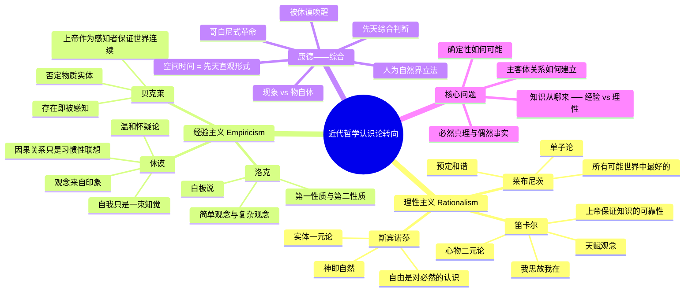

# Day 5：近代哲学——理性的觉醒

> **悬疑预告**：你确定你此刻不是一个被邪恶天才欺骗的大脑？你怎么证明窗外有一棵树而不是一团模拟数据？康德把哲学颠倒过来——不是认识符合对象，而是对象符合认识。一个苏格兰人把因果律拆了，一个德国人把它重建了。欢迎来到近代哲学，这里没有什么是理所当然的。

---

## 🍅 番茄21：我在怀疑，所以我存在

### 🎬 悬疑开场：火炉边的那个人在想什么？

1619年冬天。法国。一个年轻人把自己关在一个烧着炉子的小房间里。

窗外是欧洲三十年战争的硝烟。屋内是一个人的思想战争。

他决定做一件前所未有的事：**怀疑一切可以怀疑的东西。**

感官？感官会骗人——筷子插在水里看起来是弯的，远处的方塔看起来是圆的。数学？也许有一个"邪恶的魔鬼"（malin genie）在欺骗我，让我以为 1+1=2 是对的，其实不然。

他一路拆下去，拆到怀疑自己有没有身体，拆到怀疑整个世界是不是一场精心设计的骗局。

然后他停住了。

有一件事是绝对不可怀疑的——**我正在怀疑这件事本身。**

如果我在怀疑，说明我在思考。如果我在思考，说明我在存在。

> "我思故我在。"（Cogito, ergo sum.）

这句话不是"因为我思考，所以我存在"的逻辑推理。它更像一个直觉顿悟：当我在怀疑一切的时候，那个在怀疑的"我"是最确定的事实。

笛卡尔（1596-1650）由此找到了哲学的"阿基米德点"——一个不可动摇的起点。然后他重新建构了整个世界：上帝（我有一个"无限"的观念，这个观念不可能来自有限的我自己，所以一定是上帝放进来的），物质世界（上帝不会欺骗我，所以物质世界是真实的）。

他以为自己找到了确定性。但事实上，他挖了一个坑，后面三百年所有的哲学家都在这个坑里打转。

那个坑叫做：**意识和外部世界之间的鸿沟。**

你坐在沙发上读这段话，你的意识里有一个"外部世界"的表象。但你怎么知道这个表象和外部世界是匹配的？

你唯一能直接接触到的，是你的意识本身。

这个问题被称为"近代哲学的认识论转向"——从追问"世界是什么"变成了追问"我怎么知道世界是什么"。

### 📜 原文片段

> "那么，假定有某一个不是真正的上帝——他是非常强大、非常狡猾的邪恶天才，用尽他的全部机智来欺骗我。我将会认为天、空气、地、颜色、形状、声音以及所有外部事物都仅仅是他用来骗取我信任的梦幻。我要认为自己没有手、没有眼睛、没有肉、没有血，什么都没有，只是错误地相信我有这些东西。" ——笛卡尔《第一哲学沉思集》

### ✋ 费曼三句话

1. 笛卡尔的"普遍怀疑"不是虚无主义，而是为了找到一个绝对的确定性起点——他的目标是重建，不是摧毁。
2. "我思故我在"不是一个三段论推理，而是一个直觉——在怀疑的瞬间，那个怀疑的"我"直接显现为不可怀疑的存在。
3. 笛卡尔开启了"心物二元论"——精神和物质是完全不同的两种实体——这个框架既解决了问题也制造了更大的问题，后面三百年都在处理它留下的烂摊子。

### ❓ 悬疑追问

你今天怎么确定你不是在《黑客帝国》里？或者更精确地说——你怎么知道此刻的你不是一个在缸中被连接了脑机接口的"本体"，而"现实世界"其实是 Matrix 给你的模拟？笛卡尔的方法是"上帝不会骗我"，但你如果不是信徒呢？

### 🔗 连线笔记

- [[Day04-中世纪哲学与经院哲学·信仰寻找理解#🍅17 奥古斯丁|奥古斯丁的"我疑故我在"]]— 笛卡尔强化了这个思路但走向了不同方向
- 笛卡尔对"确定性"的追求 → [[#🍅23 康德|康德对理性界限的批判]]

---

## 🍅 番茄22：经验主义——白板、存在即被感知、因果律的崩塌

### 🎬 悬疑开场：一个婴儿的大脑是一块白板

如果笛卡尔说有些观念是"天赋"的，他的对手们说：放屁。

**约翰·洛克（1632-1704）** 说：人的心灵出生时是一块白板（tabula rasa）。所有知识都来自经验——要么是感觉（外部经验），要么是反省（内部经验）。

天赋观念？不存在。

这听起来很合理。但洛克的理论有一个隐含的漏洞：如果所有知识都来自经验，那你怎么知道经验本身是可靠的？

**乔治·贝克莱（1685-1753）** 把这个漏洞推向了极致。他说：

> "存在即被感知。"（Esse est percipi.）

不存在一个独立于感知的物质世界。你看到一棵树，不是因为你看到一个"物质实体"——你只是有一些视觉印象、触觉印象、嗅觉印象。把这些印象加起来，"树"这个概念就被构造出来了。

问"没有人在看的时候树还存在吗？"——贝克莱说：存在，因为上帝一直在看。

你以为这是个笑话。但现代物理学比你想象的更接近贝克莱：量子力学说，在测量之前，粒子的状态是"叠加态"——某种意义上，没有被观察的粒子不存在确定的实在。

**大卫·休谟（1711-1776）** 干得更狠。他拆了三样东西：

**第一，自我是什么？** 你闭上眼睛内省，能找到一个"自我"吗？不，你只能找到一个个飘过的念头、情绪、感觉。所谓"自我"不过是一束知觉的集合。

**第二，因果律是什么？** 你看到台球A撞击台球B，B开始运动。你以为你看到了"因果关系"。不，你只看到了一件事跟随另一件事，但"因果"本身是看不见的。休谟说：因果关系只是**习惯性的联想**——因为两件事总是一起发生，我们的大脑就学会了把它们连在一起。

**第三，归纳法靠谱吗？** 凭什么过去太阳每天升起就能证明明天太阳也会升起？你用的是"归纳法"，但归纳法的有效性本身就是用归纳法证明的——循环论证。

休谟说完了这些，自己去吃饭了。但他留下的烂摊子让整个欧洲哲学界陷入恐慌——如果因果律只是习惯，那科学的基础是什么？

这个问题把康德从"独断论的迷梦"中唤醒了。

### 📜 原文片段

> "我们凭什么说'因为A发生了，所以B必然会发生'？经验只告诉我们A和B经常在一起出现，但没有告诉我们A必然导致B。必然性……存在于心灵中，而不是对象中。" ——休谟《人性论》

### ✋ 费曼三句话

1. 洛克说心灵是白板——经验主义的基础，但也是它的陷阱：如果一切来自经验，怎么证明经验的可靠性？
2. 贝克莱说"存在即被感知"——物质世界没有独立实在性，一切存在都是被心灵感知的。
3. 休谟拆了因果律——"因果关系"不是客观存在的必然联系，只是人类心理上的习惯性联想。

### ❓ 悬疑追问

一个苏格兰人怎么改变了整个德国哲学？休谟证明了"从经验事实中推导不出必然真理"——这意味着所有声称具有必然性的知识（数学、物理学、形而上学）要么是纯粹逻辑的（与事实无关），要么是或然的（没有必然性）。康德读到休谟时的反应是：我被唤醒了！

### 🔗 连线笔记

- 休谟拆了因果律 → [[#🍅23 康德|康德"人为自然界立法"]] —— 如果因果关系不在物体本身，那就在我们心里
- 洛克的白板论 → 教育学和现代心理学的基础——人是由环境塑造的

---

## 🍅 番茄23：康德——哲学界的哥白尼

### 🎬 悬疑开场：一个从未离开柯尼斯堡的人如何颠覆了世界

伊曼努尔·康德（1724-1804）一辈子没离开过东普鲁士的柯尼斯堡小镇。他的日程准到邻居用他散步的时间来调表。

一个无聊的人。

但1770年，46岁的康德读到休谟的作品，被彻底击中了。他说："休谟把我从独断论的迷梦中唤醒了。"

之后的十年，他一个字都没发表。康德在想什么？

**他在想一个问题：如果休谟是对的——因果律、必然性都不在外部世界——那科学知识（比如牛顿物理学）的确定性从哪来？**

康德的回答是一记反转，哲学史上最漂亮的"翻盘"：

> **不是我们的认识符合对象，而是对象符合我们的认识形式。**

这听起来像是玄学。让我用一个类比解释：

你戴着一副红色墨镜看世界。你看到的一切都是红色的。这不是因为世界是红色的——是因为你戴着红色墨镜。

康德说：空间和时间就是这副墨镜。它们不是外部世界的属性——它们是我们心灵的"先天直观形式"。世界本身（康德叫它"物自体"或"自在之物"）是什么样，我们永远不知道。我们只能认识"现象"——经过我们的认知结构过滤后的世界。

空间、时间、因果律、实体……这些都不是世界的特征，而是大脑的"软件"。

这被称为"哥白尼式的革命"——就像哥白尼不是让太阳围绕地球转，而是让地球围绕太阳转——康德不是让认识符合对象，而是让对象符合认识。

康德说：我们只能认识"现象"（phenomena），不能认识"物自体"（noumena）。但别急着悲观——康德接着说：人是什么？人应该做什么？人可以期望什么？这才是哲学真正要问的问题。

**头上的星空，心中的道德律。**

### 📜 原文片段

> "有两种东西，我对它们的思考越是深沉和持久，它们在我心灵中唤起的惊奇和敬畏就会日新月异，不断增长，这就是：我头上的星空和心中的道德律。" ——康德《实践理性批判》结论

### ✋ 费曼三句话

1. 康德说空间和时间不是外部世界的特征，而是我们大脑自带的"认知滤镜"——我们永远戴着这副眼镜看世界，摘不下来。
2. "物自体"不可知——我们只能认识经过认知结构加工后的"现象"，世界本身的真面目我们永远无法直接接触。
3. 哥白尼革命的核心翻转：不是认识去符合对象，而是对象反过来符合我们主体的认识形式——人不再是知识的被动接收者，而是知识的主动建构者。

### ❓ 悬疑追问

康德说"物自体不可知"。但等一下——如果你不知道物自体是什么，你怎么知道它存在？这个反问一百多年来一直是康德哲学最致命的痛点。你怎么回答？或者换个角度：你能举出一样你"知道它存在但又不知道它是什么"的东西吗？

### 🔗 连线笔记

- 康德的"先天直观形式" ← 奥古斯丁的时间主观化 [[Day04-中世纪哲学与经院哲学·信仰寻找理解#🍅17 奥古斯丁]]
- 休谟唤醒康德 → [[#🍅22 经验主义|经验主义的困境]] → 康德给出解决方案
- 康德对理性的批判 → [[Day06-德国观念论与意志哲学#🍅26 黑格尔|黑格尔的绝对精神冒险]]

---

## 🍅 番茄24：🧠 思维导图——理性主义 vs 经验主义

---

## 🍅 番茄25：刻意练习——两场思想地震

### 🧪 实验一："恶魔欺骗"思想实验

**场景**：

假设你刚听说了一个全新的科技：一家叫"NeuraLink+"的公司可以完美模拟任何体验。他们把一个芯片植入你的大脑，你睁着眼睛躺在床上，体验到的却是"正常生活"。你的手机、你的朋友、你的咖啡——全部是模拟信号。

现在回答这三个问题：

1. **不可证伪性**——你怎么证明你现在不在这个系统里？任何试图证明"外面有真实世界"的行为，都可能是系统给你制造的模拟体验。所以你能做出什么**实验**来区分真实和模拟？

2. **实用回应**——即使你无法确定，你应该如何生活？笛卡尔的回答是"在实践上接受世界是真实的，但理论上保持怀疑"。你同意吗？

3. **自我定位**——如果你有 51% 的确信你在模拟里，那你还会认真对待你的工作、关系、道德选择吗？为什么？如果你的答案是否定的，那这意味着你认为"真实"是意义的必要条件？这本身是不是一个要审视的假设？

**引导思考**：这个思想实验没有标准答案。哲学家们（从笛卡尔到普特南到查尔默斯）争论了几百年。你应该关注的不是"找到答案"，而是"发现你在回答这个问题时所依赖的那些默认假设"。

### 🧪 实验二：康德的认知滤镜——你看到的世界 vs 别人看到的世界

> **核心概念**：康德说我们在理解世界时带着"先天直观形式"（空间、时间、因果）。但现代认知科学告诉我们，人的认知滤镜比康德想象的更具体。

**你的任务**：

选择一个具体的场景，分析不同人"看到"的同一件事如何因他们的"先天形式"不同而截然不同。

**场景参考**（三选一）：

**A. 品酒师 vs 普通人喝同一杯酒**
品酒师尝到的是"黑醋栗、雪松、皮革、一丝烟草的尾韵"。
你尝到的是"嗯，红酒"。
两者的感官输入是一样的（同一杯酒），但品酒师的"认知结构"经过了专业训练，形成了更精细的"范畴"。
**康德的问题**：如果"先天范畴"也可以被训练塑造，那它是"先天的"吗？还是说品酒师只不过在"后天"发展出了康德式的内在归类系统？

**B. 围棋世界冠军 vs AI 同一手棋**
AlphaGo 下出了一手"人类绝不会下"的棋。职业棋手的第一反应是"这手棋错了"。事后分析发现，那是一手天才的棋。
**问题**：这手的"正确性"是由人类认知结构以外的客观标准决定的——即它增加了胜率。这是否意味着存在一种"超越康德认知滤镜"的客观知识？

**C. 色盲 vs 正常人 vs 蜂鸟**
一个红绿色盲和一个正常人和一只蜂鸟看同一朵花。
红绿色盲：灰绿色的叶子。
正常人：红色的花瓣，绿色的叶子。
蜂鸟：红色花瓣在紫外线下有复杂的图案，人类完全看不见。
**康德的推论**：三个人看到的都是"被各自的认知结构加工后的世界"。问题在于——有"正确答案"吗？还是每种都是一种"有效"的现象世界？

**引导思考**：康德的"先天形式"概念在今天面临的最大挑战就是"个体差异"——如果每个人的认知结构都不一样，那康德所谓的"普遍有效的知识基础"还存在吗？

### 📋 今日备考卡片

| 问题 | 答案 |
|:----|:-----|
| 笛卡尔普遍怀疑的最终目的是什么？ | 找到不可怀疑的确定性起点，而不是为了怀疑而怀疑 |
| "我思故我在"到底在说什么？ | 在怀疑这个行为中，那个在怀疑的"我"直接显现为不可怀疑的存在 |
| 休谟对因果关系的态度是什么？ | 因果关系不是客观必然联系，而是心理习惯性联想 |
| 经验主义和理性主义的核心分歧是什么？ | 知识来源：经验主义说来自感觉经验，理性主义说来自理性固有观念 |
| 康德"哥白尼式革命"是什么意思？ | 不再是认识去符合对象，而是对象符合我们的认识形式 |
| 什么是"物自体"？ | 独立于我们认知之外的那个世界本身，不可知 |
| 康德的空间和时间是什么？ | "先天直观形式"——是我们认知结构的一部分，不是外部世界本身的属性 |
| 为什么说休谟"唤醒"了康德？ | 休谟证明因果律不是客观的，这让康德意识到必须重新解释科学知识的基础 |
| 洛克的白板说和现代教育的关联是什么？ | 如果心灵是白板，环境决定人——这是教育万能论和现代教育体系的哲学基础 |

---

> **⏭️ 下一站：[[Day06-德国观念论与意志哲学|Day 6 —— 德国观念论与意志哲学]]**
>
> 康德留下了一个巨大的尾巴：物自体不可知，但那个不可知的领域成了下一个世代疯狂进攻的方向。黑格尔说绝对精神正在自我实现，叔本华说世界是盲目的意志，尼采说上帝死了而你还没准备好。
