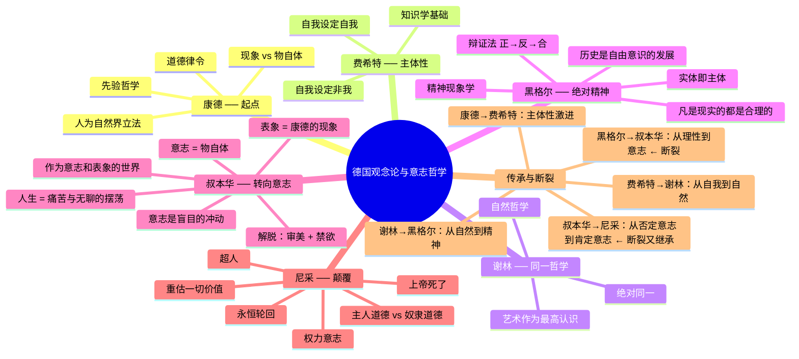

# Day 6：德国观念论与意志哲学——绝对精神的冒险

> **悬疑预告**：黑格尔说"凡是现实的都是合理的"——这句话被右派当保皇宣言，被左派当革命口号，到底谁读对了？叔本华说人生本质上就是痛苦——一个悲观主义者怎么成了尼采、弗洛伊德、维特根斯坦的思想父亲？尼采说"上帝死了"——他不是在炫耀，他是在恐惧。

---

## 🍅 番茄26：绝对精神的冒险之旅

### 🎬 悬疑开场：一句话引发的百年血案

> "凡是合理的都是现实的，凡是现实的都是合理的。"

黑格尔（1770-1831）写下这句话时，他以为自己在陈述一个深刻的哲学原理。

右派读了："现实的就是合理的"——普鲁士国家是现实的，所以它是合理的！维护现状就是哲学的义务！

左派读了："合理的才会成为现实"——现在的普鲁士国家不"合理"，所以它应该灭亡！革命有理！

谁读对了？

**两个都错了。**

黑格尔的意思是：事物的发展有一个内在的理性逻辑。一杯水在变成冰的过程中，"水"作为纯液体消失了，"冰"作为固体出现了。水"否定"了自己变成了冰，但水和冰共享同一个本质——H₂O。

这是黑格尔辩证法的基本结构：**正题 → 反题 → 合题**

- **正题**：一个概念/状态（比如"存在"）
- **反题**：这个概念的内在矛盾（"非存在"）
- **合题**：矛盾被扬弃（aufheben），达到更高的统一（"生成"——既是存在又不是存在，是两者的统一）

"Aufheben"是德语中一个神奇的词，同时意味着"取消"、"保存"和"提升"。一个概念被否定（取消），但它的合理内核被保留（保存），提升到一个更高的层次。

黑格尔说：整个历史，整个宇宙，整个精神世界，都在按这个逻辑展开。绝对精神（Geist）——你可以粗暴地理解为"世界的终极理性/意识"——在自我认识的过程中经历了一个漫长的旅程：从最抽象的逻辑范畴（存在/非存在）开始，穿越自然世界，进入人类意识，最后在哲学中认识到自己。

听起来玄乎。但关键在这里：**黑格尔不只是在说哲学——他在说一切。**

艺术、宗教、历史、政治、科学，全部是绝对精神自我展开的环节。没有一个领域是独立的。

然后把黑格尔"倒过来"？

**马克思干了这件事。** 马克思说黑格尔是头足倒立的——黑格尔说意识决定物质，马克思说物质决定意识。不是"绝对精神"在推动历史，而是生产力和生产关系（经济基础）在推动历史。但马克思保留了黑格尔的辩证法结构——阶级斗争就是正题（统治阶级）→ 反题（被统治阶级）→ 合题（无阶级社会）。

### 📜 原文片段

> "真理是全体。但全体仅仅是那个通过其自身发展而得以圆满的本质。" ——黑格尔《精神现象学》前言

### ✋ 费曼三句话

1. 黑格尔辩证法（正→反→合）不只是哲学方法——他说整个历史、社会、思想都在按这个逻辑运行，矛盾是推动前进的动力。
2. "凡是现实的都是合理的"不是政治保守主义——它的意思是，凡是出现的东西都有其必然性，但这种必然性会随着条件变化而消亡。
3. 马克思把黑格尔"倒过来"——不是思想决定现实，而是经济基础决定上层建筑——但辩证法这个"发动机"保留下来了。

### ❓ 悬疑追问

如果历史真的按辩证法的逻辑展开，那今天的全球资本主义是正题，它的反题是什么？你看到它的反题正在形成吗？如果合题一定会到来——那它会是马克思预言的共产主义，还是某种完全不同的东西？

### 🔗 连线笔记

- [[Day05-近代哲学·理性的觉醒#🍅23 康德|康德的"物自体"不可知]] → 黑格尔说没有不可知的东西——绝对精神最终会完全认识自己
- 马克思的"唯物主义辩证法" ← 黑格尔的"唯心主义辩证法"倒置
- [[Day03-古希腊哲学·本体论与伦理学|亚里士多德的"隐德莱希"]] → 黑格尔的"精神自我实现"——一个古希腊的概念在德国被赋予了全球历史的意义

---

## 🍅 番茄27：叔本华——作为意志和表象的世界

### 🎬 悬疑开场：世界是一团永不满足的冲动

1818年，亚瑟·叔本华（1788-1860）出版了他最重要的著作《作为意志和表象的世界》。它几乎无人问津。

叔本华很愤怒。他跑去柏林大学开设讲座，故意把时间安排在黑格尔的讲座同一时间。结果是：黑格尔的教室坐满了人，叔本华对着空椅子讲哲学。

他终生未婚，和母亲决裂，唯一陪伴他的是狮子狗。他骂黑格尔是"碌碌无为的江湖骗子"，骂女人——虽然他的厌女言论和他母亲的糟糕关系脱不了干系。

然后，在生命的最后十年，他终于出名了。不是因为他的思想变了——是时代赶上了他。

**他说了什么？**

世界有两面：

**第一面：表象（Vorstellung）**

我们感知到的世界——由空间、时间、因果编织而成的现象之网。这部分，叔本华基本同意康德：我们能认识的只有表象。

**第二面：意志（Wille）**

但叔本华说康德错了——物自体并非不可知。我们有通向物自体的秘密通道：**我们的身体。**

当我想要举起手臂，手臂就举起来了。在这个过程中，我同时体验了两件事：作为表象的"手臂在举起"，和作为意志的"我想要举起"。后者就是物自体——不是通过感官，而是通过**直接的内心体验**。

叔本华由此推出：整个世界的本质都是意志——一种盲目的、永不满足的、持续冲动的力量。

意志没有目的，没有终点。它不断地渴求，短暂地满足，然后继续渴求。这就像海浪——每一波浪都在追逐什么，但海浪本身就是大海。

**所以人生本质上就是痛苦。**

得不到的时候是痛苦（匮乏），得到之后是无聊（满足的短暂），然后又回到痛苦。快乐只是痛苦的暂时缺席。人生就是在这两极之间摆荡的钟摆。

**怎么解脱？**

叔本华给出了两种途径：

1. **审美静观**——当你完全沉浸在一件艺术品或自然美景中时，你暂时忘记了意志，成了"无意志的认识主体"。那一刻，你是自由的。但这是暂时的。

2. **禁欲**——放弃欲望，否定生命意志。叔本华从印度教和佛教中吸取了资源——涅槃就是意志的熄灭。

一个有意思的事实：叔本华餐前必去最好的餐厅吃饭，但他写的却是"放弃欲望是唯一的解脱"。他自己也没做到。

### 📜 原文片段

> "人生就像钟摆，在痛苦和无聊之间来回摆动。……当欲望得不到满足时就痛苦，当欲望得到满足后就无聊。" ——叔本华《作为意志和表象的世界》

### ✋ 费曼三句话

1. 世界有两面：表象（我们看到的因果时空世界）和意志（盲目的冲动力），意志是本质，表象是现象。
2. 身体是通向"物自体"的秘密通道——我同时体验到"我想举手"的意志和"手举起来"的表象，证明意志就是世界的本质。
3. 生命就是永恒的缺乏感和不满足感——痛苦是常态，快乐只是痛苦的短暂缺席——这就是叔本华的悲观主义核心。

### ❓ 悬疑追问

叔本华影响了尼采、弗洛伊德（他把"生命意志"改成了"力比多"）、维特根斯坦（早期维特根斯坦的世界观有明显的叔本华痕迹）、甚至爱因斯坦也读过他。一个悲观主义者为什么能成为这么多伟大思想家的源头？答案可能在于：**悲观主义不是放弃，而是清醒。** 看清楚生活的真相之后，你反而可以更真实地活着。

### 🔗 连线笔记

- 叔本华的"意志" → [[#🍅28 尼采|尼采的"权力意志"]] —— 尼采接受"意志"是核心，但不接受"否定意志"
- 叔本华的艺术救赎 → [[Day05-近代哲学·理性的觉醒#🍅23 康德|康德的审美判断力批判]]
- 叔本华与东方哲学 → 《奥义书》和佛教对叔本华的影响

---

## 🍅 番茄28：尼采——上帝死了，然后呢？

### 🎬 悬疑开场：那个抱住马脖子的人

1889年1月3日，意大利都灵。一个留着大胡子的中年男人看到街头马夫在鞭打一匹马。他突然冲上去，抱住马的脖子，然后摔倒在地。

从此以后他再也没有清醒过。接下来的11年，他在母亲和妹妹的照顾下度过了精神失常的余生。

那是弗里德里希·尼采（1844-1900）。

他之前写下了西方思想史上最大胆的宣言之一：

> **"上帝死了。是我们杀死了他。"**

这不是狂欢。这是恐惧。

尼采的意思是：**传统价值观的根基崩塌了。**

两千年来，西方人把自己的道德、意义、真理感建立在"上帝"这一根基上。但现代科学和启蒙理性已经让这个根基坍塌——不是因为有人证明了上帝不存在，而是因为"相信上帝"已经不再是人们内心的本能了。

问题在于：**上帝死了，但人类还没准备好自己当父母。**

尼采说：传统的道德是"奴隶道德"——它是弱者为了保护自己不被强者欺负而制造出来的。谦卑、同情、忍耐、平等——这些被基督教奉为美德的东西，在尼采看来是弱者对强者的怨恨（ressentiment）变成的价值体系。

真正的强者不需要这种道德。他们创造自己的价值。尼采称之为"权力意志"（der Wille zur Macht）——不是政治意义上的"权力"，而是**生命自我超越、自我创造的内在驱力**。

**超人（Ubermensch）**——不是希特勒搞出来的那个种族主义漫画角色。尼采的超人是"超越了自己的人"——一个人征服了自己的怨恨、软弱、从众本能，创造了属于自己的价值体系，过着本真（authentic）的生活的那个"未来的哲学家"。

**永恒轮回**——尼采说：如果你要永远重复你现在的生活，每一次都和原来一样，你会怎样？这个念头会让你崩溃？还是会让你更加慎重地对待每一个选择？

### 📜 原文片段

> "上帝死了！上帝真的死了！是我们杀死了他！我们这些最残忍的凶手，该如何安慰自己？这个世界上最神圣、最强大的人已经在我们刀下流血——谁来擦去我们手上的血？……这件大事还在路上，还在游荡——它还没有抵达人的耳朵里。" ——尼采《快乐的科学》第125节

### ✋ 费曼三句话

1. "上帝死了"不是宣言，而是诊断——尼采认为西方传统价值观的基础已经崩塌，但大多数人还没意识到。
2. "超人"不是政治概念，而是"克服了自己的人"——一个人征服了自己的软弱和从众本能，创造了属于自己的价值体系。
3. "权力意志"不是政治权力欲，而是生命自我超越的本能——它不是"统治他人"，而是"超越自我"。

### ❓ 悬疑追问

尼采被纳粹滥用了（他的妹妹伊丽莎白操纵出版了《权力意志》，纳粹用它作为意识形态工具）。他被女权主义者又爱又恨（"你走向女人时别忘了带鞭子"）。但如果我们把他的核心概念"权力意志"从政治和性别的语境中解放出来——它当得起一个深刻的哲学概念吗？你自己的"权力意志"在生活的哪个领域最清晰地体现？

### 🔗 连线笔记

- [[#🍅27 叔本华|叔本华的"生命意志"]] → 尼采的"权力意志" —— 叔本华说要否定意志，尼采说要肯定意志
- [[Day05-近代哲学·理性的觉醒#🍅23 康德|康德的"人为自己立法"]] → 尼采的"超人创造自己的价值"
- [[#🍅26 黑格尔|黑格尔的历史辩证法]] → 尼采的"永恒轮回" —— 历史不前进，而是循环

---

## 🍅 番茄29：🧠 思维导图——从康德到尼采的传承与断裂

---

## 🍅 番茄30：刻意练习——两场高风险思想实验

### 🧪 实验一：用辩证法分析一个当代社会冲突

**场景**：

选择一个你熟悉的当代社会冲突——比如"言论自由的边界在哪里"、"AI替代人类工作"、"全球化的逆流"，或者其他你关心的议题。

**步骤**：

1. **确定正题**：主流立场/现状是什么？谁在拥护它？它的合理性在哪里？
2. **确定反题**：反对立场/挑战力量是什么？谁在推动它？它所暴露的正题的问题是什么？
3. **尝试构造合题**：不要折中主义（"双方各打五十大板"），而是"扬弃"——找到一种能同时吸纳正题和反题合理内核的新框架。

**示例**——以"AI替代人类工作"为例：

- **正题**：技术进步是好的，AI提高效率创造新职业（技术乐观主义）
- **反题**：AI大面积替代工作会导致失业和社会动荡，加剧不平等（技术批判主义）
- **可能的合题**：不等于"不要发展AI"或"完全拥抱AI"——而是重新设计社会契约（全民基本收入？重新定义"工作"的概念？教育改革？），让AI的红利被更公平地分配

**引导思考**：黑格尔式合题不是"双方握手"，而是一种**质的飞跃**——原来的正题和反题各自都无法完整解决问题，但在合题中，两者的合理内核被保留并超越了。

### 🧪 实验二："如果你信仰的价值观突然崩塌了"——尼采式危机模拟

**背景**：

尼采说西方人失去了上帝的信仰之后，陷入了价值真空——旧的道德标准不再有说服力，但新的标准还没有被建立起来。这是"虚无主义"的根源。

**场景设定**：

假设你深信不疑的一个价值突然被证明了是"错误的"或"无根基的"——选择一个你真正在意的东西，不是随便选的（否则实验无效）。

**价值观选项**（或自己选一个真的）：

- **"努力一定会得到回报"**——有一天你发现生活中大量不公平的事例证明，努力和回报之间几乎没有任何相关性。你怎么调整你的行为框架？
- **"婚姻是爱情的归宿"**——如果是被社会建构出来的制度呢？如果所谓的"爱情"只是进化给你的基因骗局呢？
- **"人的尊严是不容侵犯的"**——如果有一天你被说服了：人只是碳基机器，所谓的"尊严"只是我们为了社会稳定编出来的。然后呢？

**你的任务**（三步走）：

1. **坠落**——认真描述如果你真的不再相信这个价值了，你的生活会有什么具体变化。不是抽象的，是"明天早上起床我会怎么做"的变化。
2. **直面虚无**——尼采说经历了虚无主义之后，人有两个选择：被虚无吞噬，或者成为价值的创造者。在第一步的废墟上，你能凭空创造一个新的价值来替代旧的吗？
3. **超人测试**——尼采的超人是"能够为自己的生命赋予意义的人"，不是等待上帝或传统来告诉你怎么活。如果让你重新选择并且验证你的人生价值——你选择什么？这个选择经过"永恒轮回"的测试吗？(如果你要无限次重复这个选择，你会更慎重还是更坚定？)

**引导思考**：这个实验的残酷之处在于——大多数人其实没有自己想象的那么相信自己的价值观。这个实验只是让你发现：你是个"信徒"还是"创造者"？还是某个介于两者之间的尴尬状态？

### 📋 今日备考卡片

| 问题 | 答案 |
|:----|:-----|
| 黑格尔辩证法三要素是什么？ | 正题 → 反题 → 合题（扬弃：取消+保留+提升） |
| "凡是现实的都是合理的"到底什么意思？ | 现实的事物有其出现的必然性，但也会随条件变化而消亡 |
| 马克思如何"倒置"了黑格尔？ | 黑格尔说精神决定物质，马克思说经济基础决定上层建筑 |
| 叔本华认为世界的本质是什么？ | 意志——一种盲目的、永不满足的冲动力 |
| 为什么叔本华认为人生本质上是痛苦的？ | 欲望产生痛苦（得不到），满足产生无聊（得到了），人生是这之间的摆荡 |
| 叔本华的解脱途径有哪些？ | 审美静观（暂时解脱）和禁欲（彻底否定意志） |
| 尼采"上帝死了"到底在说什么？ | 西方传统价值体系（基督教道德）的根基已经崩塌，但大多数人还没意识到 |
| 尼采的"超人"是什么？ | 克服了自己的人——不是统治者的超人，而是创造自己价值体系的独立个体 |
| "权力意志"不是政治意义上的权力，那是什么？ | 生命自我超越、自我创造、自我肯定的内在驱力 |
| 主人道德和奴隶道德的区别？ | 主人道德：强者肯定自己的价值；奴隶道德：弱者把怨恨变成道德（谦卑、同情） |
| 永恒轮回的思想实验有什么作用？ | 测试你对你当前生活的真实态度——如果重复无数次你还愿意这样活吗？ |

---

> **⏭️ 下一站：[[Day07-存在主义与现象学·在荒谬中寻找意义|Day 7 —— 存在主义与现象学]]**
>
> 德国观念论之后，哲学不再相信"有一个包罗万象的宏大体系"了。克尔凯郭尔说"真理是主观的"，海德格尔说人被"抛"进了这个世界，萨特说"存在先于本质"——欢迎来到没有安全网的时代。你准备好自己飞了吗？
