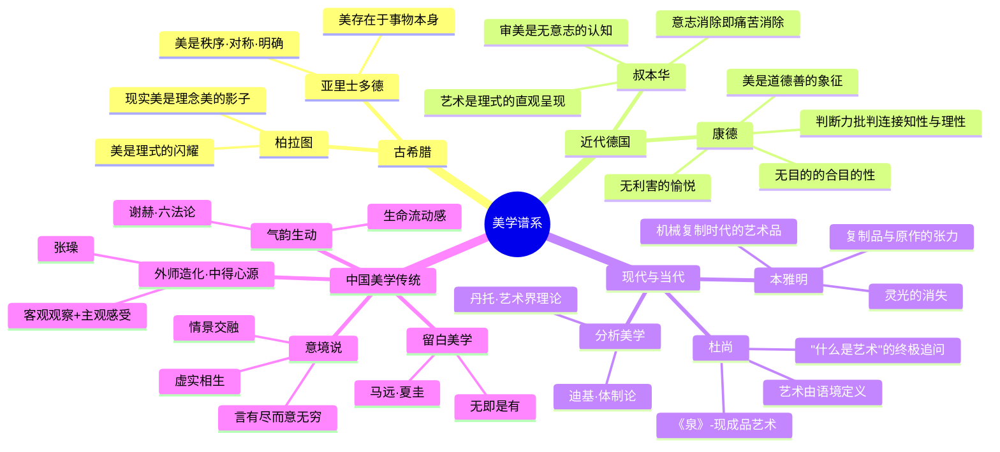

# Day 10：美学与艺术哲学——美是客观的吗？

> **悬疑提要**：你站在梵高的《星月夜》前，心跳加速，说不出话。同一时刻，你旁边的人看了一眼说："这画得也不像啊。"——谁是对的？美到底存在于画里，还是存在于你的大脑里？两千多年来，哲学家为了这个问题差点打起来。今天我们就来当这场"美学官司"的陪审团。

---

## 🍅 番茄 46/60：悬疑开场——一个西瓜是美的吗？

### 世界上最古老的审美实验

公元前5世纪，苏格拉底在雅典街头拦住一个帅哥，问了一个让后者脸红的问题："你长得这么好看，你知道'美'是什么吗？"

帅哥支支吾吾说："美就是……漂亮姑娘？"

苏格拉底追问："那漂亮的马算不算美？漂亮的罐子算不算美？"

帅哥："……也算。"

苏格拉底："那你说说，马的美、姑娘的美、罐子的美——它们有什么共同点，让你把它们都叫做'美'？"

帅哥崩溃了。

这就是柏拉图在《[[书库/政经md/伟大的思想（中英双语版·全6辑·共48册） - 会饮篇|会饮篇]]》里记录的经典场景。苏格拉底问的问题，至今没有标准答案：**到底什么是"美"？**

柏拉图自己给出的答案是：美是"理式"（Form）的闪耀。他相信在现实世界之外，存在一个永恒不变的"理式世界"——那里有最完美的"美本身"。现实中的一切美的事物（帅哥、漂亮罐子、好马），都只是那个"美本身"的不完美复制品。

他的学生亚里士多德不干了。亚里士多德务实得多，他说：别扯啥理式世界了。美就在事物本身——**秩序、对称与明确**。一座建筑美，是因为它的比例协调；一首诗美，是因为它的结构完整。美是客观的，可以用尺子量。

**悬疑钩子：如果美是客观的，为什么唐朝人以胖为美，我们今天以瘦为美？为什么你觉得周杰伦的歌好听，你爸觉得那就是在念经？**

### ✅ 费曼三句话

```markdown
🧠 **费曼三句话**
1. 柏拉图认为美是"理式世界"的闪耀——现实中的美人、美物都只是"完美理式"的不完美拷贝。
2. 亚里士多德认为美是事物本身的属性——秩序、对称、明确，可以像科学一样分析。
3. 让我头疼的是：如果美是客观的，那审美分歧怎么解释？如果美是主观的，那"这画很美"和"这画很丑"难道只是个人口味问题？
```

### ❓ 悬疑追问

**柏拉图说美是"理式"的闪耀——也就是说，你之所以觉得一朵花美，不是因为你个人品味好，而是因为这朵花"分有"了那个完美的"美本身"。但问题是：如果"美本身"存在，它在哪里？在另一个世界？在你的脑子里？还是根本不存在，只是柏拉图为了解释审美编出来的一个概念？**

---

## 🍅 番茄 47/60：康德与审美判断力

### 哥尼斯堡的矮个子给出了一个漂亮的答案

伊曼努尔·康德，一个身高不到一米六的德国老头，一辈子没出过他的小城哥尼斯堡，却干了一件让人惊叹的事：他在《判断力批判》里，把"审美"这件事安排得明明白白。

康德问了一个非常聪明的问题：**我们审美的时候，到底在做什么？**

他说：审美判断既不是纯粹主观的（"我喜欢"），也不是纯粹客观的（"这符合黄金比例"）。它是一种特殊的判断——**"无利害的愉悦"**。

什么意思？

你把一朵玫瑰花插在花瓶里，看着它，觉得它美。这个过程里：
- 你不是在想着"这花能卖50块钱"（那是**利害**）
- 你不是在想"这花香得泡杯茶"（那是**欲望**）
- 你不是在分析"这花瓣排列符合斐波那契数列"（那是**科学判断**）

你只是在看它，**纯粹地欣赏它的形式**，然后就觉得愉悦。这就是康德说的"无目的的合目的性"——这朵花看起来像是有某种"目的"或"设计"，但你又说不上来它的目的是什么，你也不需要知道。你只需要欣赏就够了。

**这就解释了为什么我们看一朵真花觉得美，看一朵做得一模一样的假花也觉得美——因为审美发生在你的内心，不看这花是真还是假，只看它的"形式"是否唤起了你的审美愉悦。**

康德还抛出了一个更猛的观点：**"美是道德善的象征。"**

他说，我们在审美中体验到的那种"无利害的愉悦"，和我们做道德行为时的那种"无利害的尊重感"是相通的。你看到一个善良的人，你说"他心灵美"——康德说这不是比喻，这是审美和道德的深层连接。

**悬疑钩子：仔细想想——你觉得"美的人一定善良"吗？如果你的答案是"不一定"，那康德说的"美是道德善的象征"还成立吗？还是说，康德说的"美"和你理解的"美"根本就不是一回事？**

### 📜 原文片段

> "为了判别某一对象是美或不美，我们不是把[它的]表象凭借悟性连系于客体以求得知识，而是凭借想象力（或者想象力和悟性相结合）连系于主体和它的快感或不快感……审美的规定根据只能是主观的，不可能是别的。" ——康德《判断力批判》

### ✅ 费曼三句话

```markdown
🧠 **费曼三句话**
1. 康德说审美判断是"无利害的愉悦"——你欣赏一朵花不是因为想用它做什么，就是纯粹地觉得它好看。
2. "无目的的合目的性"——好看的东西像是有某种"设计"，但你不知道这设计是什么，也不需要知道。
3. 康德还说"美是道德善的象征"——审美和道德用的是同一种"无利害"的欣赏能力。但是……这真的能解释所有审美体验吗？
```

### ❓ 悬疑追问

**康德说审美是"无利害的"——但你真的在审美时完全不考虑利害吗？你在美术馆看一幅画时，难道不会因为它标价一亿而多看了一眼？你对"名画"的敬畏感，是审美的一部分，还是社会给你的心理暗示？**

---

## 🍅 番茄 48/60：现当代美学 + 中国美学传统

### 当一个小便池成了最著名的艺术品

1917年，一位叫马塞尔·杜尚的法国艺术家，走进一家五金店，买了一个小便池。他在上面签了一个假名"R. Mutt"，然后把它送到纽约的独立艺术家展览上。

这个小便池，就是《泉》——20世纪最著名的艺术品之一。

杜尚什么都没做。他没画它，没雕它，没设计它。他只是**选**了一个现成的工业品，签上名，放进展厅。然后问了一个让所有人抓狂的问题：**凭什么这个是艺术？**

如果你说"不，这不是艺术"，杜尚会追问：那什么是艺术？谁有权力决定什么是艺术？

如果你说"好吧，它是艺术"——那好，杜尚干了什么？他没创作，他只是**选择**。选择=艺术？那是不是说，艺术品的意义不在于它"是什么"，而在于它"在哪里"——在博物馆里，它就是艺术；在五金店里，它就是商品。

这是现代美学最核心的革命：**从"什么是美的"转向"什么是艺术"**。

本雅明在《机械复制时代的艺术品》里一针见血地指出：照相术和电影的出现，让"原作"这个概念死了。以前你看《蒙娜丽莎》，你得去卢浮宫亲眼看到那个画框里的那一幅画。现在你在手机上搜索一下，就能看到高清大图——你这个数字复制品和卢浮宫里的那幅画，在观感上有本质区别吗？

本雅明的答案是：有。**区别在于"灵光"**——那个独一无二的、此时此地的、原作自带的光环。复制品没有灵光。

### 🌸 中国美学不是"美"学

中国美学走了一条完全不同的路。

它不是问"什么美"，而是问**"意境"怎么造**。唐代画家张璪说：**"外师造化，中得心源。"** 向外观察自然（造化），向内调动心灵（心源）——艺术是主客观相遇的那一瞬间的产物。

- **意境**：不是画得像，而是画出了"氛围"。马远画一角山水，留大片空白，那空白不是"没画完"——那是"虚"，让你的想象力去填。
- **气韵生动**：比画得"像"更重要的，是画里有没有"气"——那种流动的生命感。你看到八大山人画的一条翻白眼的鱼，忍不住笑，那就是气韵生动。
- **外师造化，中得心源**：不管你学了多少技法（外师），最后打动人的是你内心的感受（中得）。没有心源，画得再像也是死的。

这跟西方美学的根本不同在于：西方追问"美是什么"，中国追问"如何让人感受到美"。

**悬疑钩子：杜尚把一个便池放进博物馆，不是在"创作"，而是在"提问"——他问的是：谁定义了"艺术"？博物馆？艺术评论家？市场？还是你自己？**

### 📜 原文片段（叔本华论美学）

> "美的形而上学，其核心问题可简述如下：客体与欲望无关，如何能引起我们的愉悦？……在美的事物中，我们总能觉知生物界与非生物界内在和本原的形式，即柏拉图所说的理式，由此衍生了无意志参与的认识主体，即无关目的或意愿的纯粹智能。这样，当审美发生时，意志完全从意识中消失，而意志是我们所有烦恼和痛苦的唯一根源，审美伴随的愉悦感由此产生。"

——[[书库/政经md/伟大的思想（中英双语版·全6辑·共48册） - 论美学|叔本华《论美学》]]

### ✅ 费曼三句话

```markdown
🧠 **费曼三句话**
1. 杜尚的《泉》一直在追问"什么是艺术"——一幅画之所以是艺术，不是因为它的材质或技法，而是因为它被放置在"艺术"的语境里。
2. 本雅明说机械复制让艺术失去了"灵光"——你今天看手机里的《蒙娜丽莎》和去卢浮宫看，体验根本不同。
3. 中国美学的核心不是"美"，而是"意境"——不是画得"像"，而是画出了那种"说不清但感受到了"的氛围。
```

### ❓ 悬疑追问

**杜尚说"什么都可以是艺术"——这句话可以有两种解读：一是"一切都平等了，人人都可以是艺术家"；二是"艺术这个概念本身已经没意义了"。你觉得杜尚是在解放艺术，还是在谋杀艺术？**

---

## 🍅 番茄 49/60：🧠 思维导图——西方美学史谱系



---

## 🍅 番茄 50/60：刻意练习

### 🎯 练习一："这是艺术吗？"——判断练习

以下场景，请用你今天学到的理论判断——这是艺术吗？为什么？

| 场景 | 你的判断 | 用哪个理论？ |
|------|---------|------------|
| 1. 一根香蕉用胶带贴在墙上，卖12万美元 | | |
| 2. ChatGPT写了一首诗，你觉得很美 | | |
| 3. 你三岁儿子的涂鸦，你说"太抽象了"，贴在了冰箱上 | | |
| 4. 一个行为艺术家在展厅里坐了736小时，什么都不做 | | |
| 5. 一棵被台风刮倒的古树，没有人动它，就让它躺在原地 | | |

**自问自答指南**：
- **康德派**会问：这是"无利害的愉悦"吗？
- **杜尚派**会问：它被放在"艺术语境"里了吗？
- **中国美学派**会问：它有"意境"吗？

### 🎯 练习二：用"无利害的愉悦"分析你最近一次审美体验

回想你最近一次被"美"击中的瞬间——可能是一片晚霞，一首歌，一条街转角看到的风景，或者一个人。

**用康德的框架分析这个瞬间**：

1. **利害检查**：你在那个瞬间，有没有任何实用性的念头？（"这个很贵"、"这个人可以认识一下"）
2. **欲望检查**：你想占有它吗？（想拍下来发朋友圈算不算欲望？）
3. **纯粹形式**：到底是什么打动了你？颜色？形状？声音的旋律？
4. **有没有"无目的的合目的性"**：这个美的对象，看起来像是有"设计"或"目的"吗？

> 提示：康德会说——如果你看晚霞时想到的是"明天是个好天气"，那你就不是在审美，你是在做天气预报。

### 📚 今日备考卡片

| 问题 | 答案 |
|------|------|
| 柏拉图认为美是什么？ | 美是理式的闪耀，现实美的事物是完美"美本身"的不完美复制品 |
| 亚里士多德对美的定义？ | 美是秩序、对称和明确——存在于事物本身的客观属性 |
| 康德"无利害的愉悦"指什么？ | 审美时不带任何实用目的或欲望，纯粹欣赏对象的形式而产生愉悦 |
| "无目的的合目的性"是什么意思？ | 美的事物看起来像是有"设计"或"目的"，但你说不出是什么目的 |
| 康德为什么说"美是道德善的象征"？ | 审美和道德都涉及"无利害"的判断能力，两者在深层相通 |
| 叔本华认为审美时发生了什么？ | 意志从意识中完全消失，人从"欲念的主体"变成"纯认知的主体"，痛苦随之消失 |
| 本雅明的"灵光"指什么？ | 艺术品独一无二、此时此地的存在感——机械复制使其消失 |
| 杜尚的《泉》问了什么问题？ | "什么是艺术？"——艺术是由语境定义的，而非材质或技法 |
| "外师造化，中得心源"出自谁？ | 唐代画家张璪——艺术是客观观察（造化）和主观感受（心源）的结合 |
| 中国美学的核心概念有哪几个？ | 意境、气韵生动、留白、虚实相生 |

---

> 🎯 **今日番茄进度：5/5 | 累计：50/60** | 下一站：[[Day11-冯友兰与中国哲学史·打通东西方的尝试|Day11-冯友兰与中国哲学史]]
