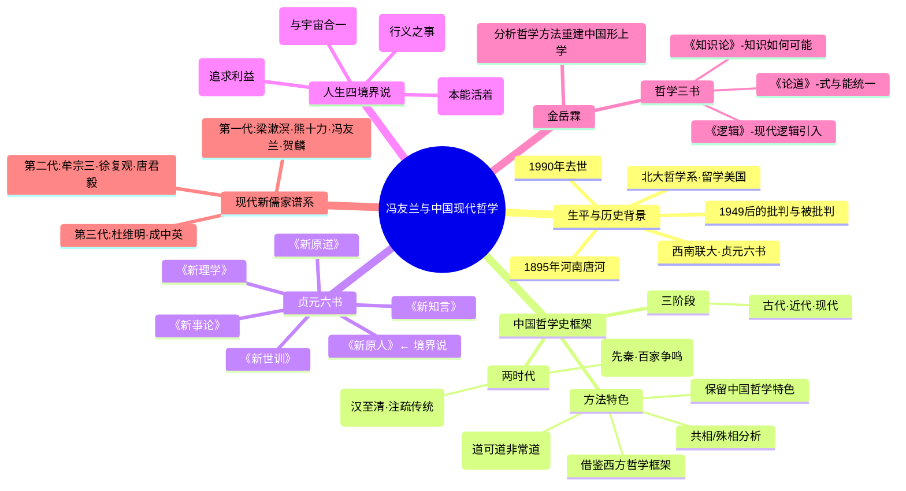

# Day 11：冯友兰与中国哲学史——打通东西方的尝试

> **悬疑提要**：黑格尔说中国没有哲学。胡适的《中国哲学史大纲》只有上半卷就断更了。冯友兰——一个河南唐河县人，在抗战的炮火中，用两卷本《中国哲学史》回答了黑格尔，并且让世界不得不重新审视"哲学"这个词的定义。这不仅是一个学者的故事，更是一个文明如何应对"现代化挑战"的缩影。

---

## 🍅 番茄 51/60：悬疑开场——"中国没有哲学"

### 黑格尔的一句话，刺痛了一个民族

1820年代，黑格尔在柏林大学的讲台上说了一句让所有中国知识分子坐不住的话：

**"中国没有哲学。"**

他的理由是：哲学是"自由思想"的产物——需要概念、逻辑、体系化的论证。而中国那些所谓的"哲学"——孔子、老子、庄子——不过是些"道德格言"和"直觉体悟"，没有系统的论证，没有概念分析，不能算哲学。

黑格尔不知道，一百年后，一个河南人会用一生来回应他。

### 冯友兰的"三重困境"

冯友兰（1895-1990）面对的不仅仅是一个学术问题，而是三重困境：

**困境一（定义问题）**：如果"哲学"是希腊词philosophia（爱智慧）的翻译，那中国几千年的思想著作——按西方标准没有形式逻辑体系、没有概念分析方法——算不算"哲学"？

**困境二（材料问题）**：中国古人的思想散布在语录、注疏、书信、诗歌里，没有像柏拉图对话录或康德三大批判那样的"专著"。你怎么把这些零散的材料整理成一个"哲学史"？

**困境三（方法问题）**：是套用西方的哲学概念框架（形而上学、宇宙论、认识论）来分析中国思想，还是坚持中国特有的范畴（道、理、气、心、性）？前者容易扭曲中国思想的本来面目，后者西方人看不懂。

### 冯友兰的解题思路

冯友兰的回答既聪明又勇敢：

**第一，他承认"哲学"这个词来自西方**，但他说：每个文明都有对"宇宙、人生、知识"的终极追问，这就是哲学。中国古人的表达方式与西方不同，但追问的问题是一样的。

**第二，他大胆使用西方哲学的概念工具**——形而上学、宇宙论、认识论——来梳理中国思想。但他同时保留了"中国哲学的特色"：关注人生、注重修养、强调直觉。

**第三，他说中国哲学最大的特色是"入世而超越"**——不离开日常生活去追求超验的世界，而是在日常人伦中体会宇宙大道。不像西方哲学那样纯粹思辨，但正因如此，它更适合指导人生。

**悬疑钩子：冯友兰说中国哲学是"入世而超越"的——意思是你不需要出家、不需要隐居、不需要离开工作岗位，就在你每天的工作、家庭、人际关系中，就可以达到最高的精神境界。这听起来是不是比"洞穴之喻"更实用？**

### ✅ 费曼三句话

```markdown
🧠 **费曼三句话**
1. 黑格尔说中国没有哲学——因为中国思想缺乏概念化、体系化的论证，更像是道德格言和直觉体悟。
2. 冯友兰没有否认"哲学"概念的西方起源，但他坚持：每个文明都有对终极问题的追问，只是表述方式不同。
3. 冯友兰用西方哲学的概念工具（形而上学、宇宙论、认识论）来梳理中国思想，同时保留了"入世而超越"的中国特色。
```

### ❓ 悬疑追问

**如果哲学的标准是"用概念做系统推理"——那禅宗的"不立文字、直指人心"算不算哲学？如果哲学可以不用概念推理，那"顿悟"和"灵感"是不是也是一种哲学方法？哲学家会因为"没法论证你的顿悟"而拒绝你——但谁说只有能论证的才是真知？**

---

## 🍅 番茄 52/60：冯友兰的《中国哲学史》框架

### 子学时代 vs 经学时代

1934年，冯友兰出版了《中国哲学史》两卷本，立刻震惊学界。陈寅恪在审查报告中写下了一句极高的评价：

> **"窃以为此作可称中国哲学史之正宗。"**

冯友兰的框架可以概括为"两时代+三阶段"：

**两时代**：

| 时代 | 时间 | 特点 | 代表 |
|------|------|------|------|
| **子学时代** | 先秦（孔子→秦） | 思想自由，百家争鸣，诸子各自著书立说 | 孔、孟、老、庄、墨、韩非 |
| **经学时代** | 汉→清 | 以儒家经典为权威框架，在注疏中发挥思想 | 董仲舒、朱熹、王阳明 |

为什么这么分？冯友兰说：子学时代是"创作"的时代——诸子百家自己立论，没人拿经典压你。经学时代是"述而不作"的时代——你不可能绕过"四书五经"去创新，只能在注疏中悄悄地表达自己的观点。

**你以为是思想退步了？不是。冯友兰说：经学时代不是没有创新，而是创新的方式变了——你必须先说你"注"的是孔子的意思，然后才能说自己的话。**

### 冯友兰的方法论革命

冯友兰在书中做了两件开创性的事：

**第一，"共相"分析**：他用西方哲学的"共相/殊相"框架来分析先秦名家（公孙龙"白马非马"）。他说公孙龙的"白马非马"不是在玩文字游戏——他是在讨论"共相"（马的概念）和"殊相"（具体的白马）的关系。这个问题在西方哲学里叫"共相问题"——从柏拉图吵到奥卡姆。

**第二，"负的方法"**：冯友兰说中国哲学有一种独特的表达方式——"负的方法"，即**不说它是什么，而说它不是什么**。

> 典型的例子是《道德经》的开篇："道可道，非常道。"——你没法说"道"是什么，但你可以说"道"不是什么。禅宗的"说似一物即不中"也是这个道理。

**悬疑钩子：陈寅恪的"正宗"评价背后有一个潜台词——冯友兰之前，中国"哲学史"要么是西方人写的充满偏见，要么是中国人写的没有方法。冯友兰是第一人真正找到了"用中国材料讲哲学故事"的方法。**

### 📜 原文片段

> "中国哲学家的著作，大多是因事而发，不尚空谈。他们所用的名词，也大多是有具体的内容的。中国哲学史之取材，不能专以哲学家的著作之形式为凭，而须就其内容之实质判定。中国哲学家的言论，往往散见于语录、书信、注释之中，但其间的哲学思想，并不因此减少其哲学的价值。"

——冯友兰《中国哲学史·绪论》（大意概括）

### ✅ 费曼三句话

```markdown
🧠 **费曼三句话**
1. 冯友兰把中国哲学史分成"子学时代"（先秦百家争鸣）和"经学时代"（汉到清的经典注疏）。
2. 他用"共相/殊相"框架分析公孙龙"白马非马"——这个中国古老命题其实是哲学史上经典的"共相问题"。
3. 中国哲学有一种"负的方法"——不说道是什么，而说不是什么。道可道，非常道。
```

### ❓ 悬疑追问

**冯友兰用西方哲学的框架来"翻译"中国哲学——这到底是"让世界理解中国"，还是"用西方的眼镜看中国，把中国看变形了"？如果你用康德的框架去分析庄子的"逍遥游"，你得到的还是庄子吗？**

---

## 🍅 番茄 53/60：冯友兰的"境界说"+ 金岳霖

### 人生的四个层次

冯友兰在抗战期间写了"贞元六书"（六大哲学著作），其中最著名的就是《新原人》，里面提出了**人生四境界说**。

他说：人和动物的区别不在于"活着"，而在于"觉解"——你对你的生活有所觉悟和理解。**你的"觉解"程度，决定了你活在哪个"境界"里。**

```markdown
🏔️ 冯友兰人生四境界

第四层 ┌─────────────────────────────────┐
天地境界 │ 你觉解到自己是宇宙的一部分      │ 人即天
第三层 ┌─────────────────────────────────┐
道德境界 │ 你觉解到社会中有"应该"做之事    │ 人即社会人
第二层 ┌─────────────────────────────────┐
功利境界 │ 你觉解到自己在追求利益            │ 人即经济人
第一层 ┌─────────────────────────────────┐
自然境界 │ 你只是活着，没有觉解              │ 人即生物人
```

**自然境界**：一个婴儿、一个原始人、一个按本能活着的人——他不知道自己在做什么，就是"活着"。没有反思，没有自觉。

**功利境界**：大部分人停留在这里。你知道自己在追求什么——钱、名、权力、爱情——你的行为是有目的的，但目的只是"对自己有利"。

**道德境界**：你开始意识到，有些事不是因为"对我有利"才去做，而是因为"应该做"。你做事的出发点从"利己"变成了"义"——道义。

**天地境界**：这是最高境界。你不仅意识到自己是社会的一员，还意识到自己是**宇宙**的一员。你和天地万物为一体，你的行为不仅是为了社会，更是符合"天道"的。这不是宗教（不需要信仰神），而是一种"觉解"——你"了解"到了自己在宇宙中的位置，并且自然地按照这个理解来生活。

冯友兰说：**天地境界不是逃避世界，而是在世界里超越世界。** 你的工作和生活没有变，但你对它们的"觉解"变了。圣人不是不做饭、不扫地的人——圣人就是"即世间而出世间"的人。

### 金岳霖：用分析哲学重建中国形上学

和冯友兰同时代的另一位哲学大家——**金岳霖**，走了另一条路。

如果冯友兰是在用"历史"的方式讲中国哲学，那金岳霖是用"逻辑"的方式重建中国哲学。

金岳霖早年留学美国，是第一个把现代数理逻辑系统引入中国的人。[[书库/未归类md/逻辑：金岳霖哲学三书的理论基础|他的《逻辑》]]被贺麟称为"国内唯一具有新水准的逻辑教材"，殷海光更是说"其分析之精密，叙述之清晰，直如彗星临空，光芒万丈"。

金岳霖写了三部书：**《逻辑》《论道》《知识论》**——后人合称"金岳霖哲学三书"。

- **《逻辑》**（1936）：系统介绍现代数理逻辑，批评传统逻辑的局限。
- **《论道》**：用分析哲学的方法重新阐释"道"——他把"道"定义为"式与能的统一"。"式"是形式（逻辑结构），"能"是质料（未经规范的材料）。这不是在复古，而是在用20世纪的逻辑工具重建中国形上学。
- **《知识论》**：一本80万字的巨著，探讨"我们如何知道外部世界"——他完全是用分析哲学的严格方法在写，但问题的根在中国。

金岳霖说："哲学不是军备，不是科学，而是一种精神的修养，一种生活的态度。"

**悬疑钩子：冯友兰的"天地境界"不需要信仰神，只需要"了解"。如果你了解了你和宇宙的关系——你真的会因此改变行为方式吗？还是说，知和行之间永远有一条鸿沟——"我知道我应该不在意，但我还是在意的要死"？**

### ✅ 费曼三句话

```markdown
🧠 **费曼三句话**
1. 冯友兰的四境界：自然（本能活着）→ 功利（追求利益）→ 道德（做该做的事）→ 天地（与宇宙合一）。
2. 天地境界不是宗教——不需要信神，只需要"觉解"到自己是宇宙的一部分，然后自然按照这种觉解生活。
3. 同期的金岳霖用现代逻辑和分析哲学的方法来重新建构中国形而上学——他的"道"是"式与能的统一"。
```

### ❓ 悬疑追问

**冯友兰说最高境界是"天地境界"——你和宇宙合一，你的行为自然而然就是天道的体现。但历史上那些在"天地境界"里杀人的人呢？十字军东征，圣战，自杀式袭击——他们都"觉解"到自己是某种大事业的一部分。你怎么区分"真正的天地境界"和"被洗脑的狂热"？**

---

## 🍅 番茄 54/60：🧠 思维导图——冯友兰学术体系



---

## 🍅 番茄 55/60：刻意练习

### 🎯 练习一：用"四境界说"分析你最近的一个决定

回想你最近做的一个**需要纠结**的决定。比如：
- 跳槽还是不跳？
- 说真话还是说假话？
- 帮人还是不帮？
- 买还是不买？

**用冯友兰的四境界，逐层分析你的决定动机：**

| 境界 | 如果在这个境界，你会怎么决定？ | 你的实际情况 |
|------|-------------------------------|-------------|
| **自然境界** | 凭习惯/本能做出选择 | |
| **功利境界** | 哪种选择对我更有利？ | |
| **道德境界** | 哪种选择是"应该"做的？ | |
| **天地境界** | 从宇宙的角度看，这件事重要吗？ | |

**自问**：
- 你发现自己的决策机制主要以"功利境界"为主吗？
- 你有没有在某个瞬间达到过"天地境界"——在那个瞬间，你觉得平时纠结的事根本不重要？
- 如果你知道你是宇宙的一部分——这个"知道"会改变你的决定吗？

### 🎯 练习二："如果冯友兰和罗素对话"——思想实验

场景设定：1945年，西南联大的防空洞里。冯友兰正在写《新原人》，英国哲学家伯特兰·罗素匆匆走进来躲空袭。两人聊了起来。

**罗素问冯友兰：** "您说中国哲学的'负的方法'——不说它是什么，而说它不是什么——但这不是'不可知论'吗？如果我不说一个东西是什么，那我怎么教别人认识它？怎么用它来做推理？"

**冯友兰会怎么回答？**

你的任务：

1. **站在冯友兰的角度**，帮他想一个回应——
   - 提示：冯友兰可能会说"负的方法不是否定知识，而是超越知识"
   - 或者"禅宗的指月之指——你不需要分析手指的结构，你只需要看月亮"

2. **站在罗素的角度**，追问一句——
   - 提示：罗素这个坚定的分析哲学家肯定会说："超越知识？你说的'超越'可不可以翻译成我能理解的句子？如果不能——那我怎么知道你不是在胡说？"

3. **你站哪边？** 写一句话表明你的立场。

> **写作提示**: 这个问题没有标准答案。中国哲学的"直觉体悟"和分析哲学的"逻辑论证"之间的张力，至今仍是比较哲学的核⼼问题。你的立场就是你的哲学态度。

### 📚 今日备考卡片

| 问题 | 答案 |
|------|------|
| 黑格尔为什么说中国没有哲学？ | 他认为哲学需要概念化、体系化的论证，中国思想只是道德格言和直觉体悟 |
| 冯友兰如何回应黑格尔？ | 他承认"哲学"是西方概念，但每个文明都有对终极问题的追问，只是表达方式不同 |
| "子学时代"和"经学时代"的划分 | 子学时代=先秦百家争鸣；经学时代=汉到清在经学注疏中发挥思想 |
| "负的方法"指什么？ | 中国哲学的特色方法——不说"是什么"，而说"不是什么" |
| 冯友兰的人生四境界？ | 自然→功利→道德→天地 |
| 天地境界是什么？ | 觉解到自己与宇宙合一，不需要宗教，只需要"了解" |
| 金岳霖的"哲学三书"是哪三本？ | 《逻辑》《论道》《知识论》 |
| 金岳霖怎么定义"道"？ | "式与能的统一"——形式（逻辑结构）+ 质料（未经规范的材料） |
| 贞元六书是哪六本？ | 《新理学》《新事论》《新世训》《新原人》《新原道》《新知言》 |
| 陈寅恪对冯友兰《中国哲学史》的评价？ | "窃以为此作可称中国哲学史之正宗" |

---

> 🎯 **今日番茄进度：5/5 | 累计：55/60** | 最后一站：[[Day12-当代哲学与总复习·哲学还有什么用|Day12-当代哲学与总复习]]
