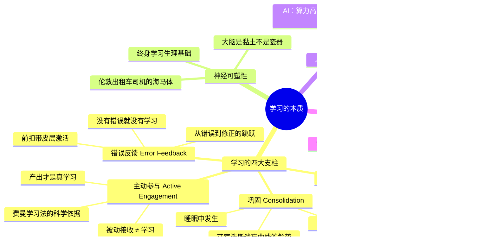

# Day 1：学习的本质——大脑这个东西到底怎么工作的？

> 你学了就忘，不是因为你笨，是因为你的大脑出厂设置就是为了"忘记"而设计的。理解这一点，是你学会学习的开始。

---

## 🍅 1：悬疑开场——亨利·莫莱森先生教会我们的事

1953年9月，一位名叫亨利·莫莱森（Henry Molaison）的27岁男子接受了一次脑部手术。医生切掉了他的内侧颞叶——包括大部分海马体。手术后，亨利活了下来，但再也无法形成新的长期记忆。

他会在镜子中看见自己，被镜中那个"陌生人"吓到——因为他不记得自己长了这张脸。他会和医生握手，转身，五分钟后再次见到医生，像从未见过一样伸出手。他每天读同一本杂志，觉得每一期都很新鲜。他的智力、语言能力、短时记忆全部正常——他甚至可以记住一个电话号码，只要他在心里不断默念。但一旦被打断，号码就消失了，像被按了删除键。

亨利的故事告诉我们一个极其残酷的事实：**大脑的"学习"不是你想象的那样。**

你以为是"把信息存进硬盘"？不。大脑没有硬盘。它连"文件夹"的概念都没有。大脑是通过建立和强化神经元之间的连接来完成学习的——这个过程极其耗能，所以大脑进化出了一整套"能忘就忘"的节能机制。

**你懂了。你不是记性差，你是被进化坑了。**

迪昂（Stanislas Dehaene）在他的《How We Learn》中提出了一个问题：为什么人类婴儿是地球上最好的学习机器，而成年人的学习能力却断崖式下跌？答案藏在四个词里，也就是他著名的**学习的四大支柱**。

这四个支柱就是你这趟旅程的起点。接下来你终将明白：不是学习太难，是你一直在用错误的方式对抗你的大脑。

> ### ✅ 费曼三句话
> 1. 学习的本质不是"存入"，而是"连接"——你的大脑是一个神经网络，不是一块硬盘，每次学习都在物理上改变它的结构。
> 2. 我过去以为"记忆力差"是天赋问题，但其实是我没有尊重大脑的节能机制——它天生就想忘，我得给它理由让它记住。
> 3. 如果亨利·莫莱森连自己每天都在变老都不知道，那我凭什么觉得自己"听听课就能学会"？

> ### ❓ 悬疑追问
> 既然大脑天生为"忘记"而设计，那我们有没有办法"骗"过这个系统？如果能，方法是什么？

> ### 📌 连线笔记
> 想想你最近一次"学了就忘"的经历——是哪个环节出了问题？输入方式？重复频率？还是你根本没有真正"关注"过它？

---

## 🍅 2：核心原理——迪昂四大支柱与神经可塑性

现在我们把迪昂请到台上。斯坦尼斯拉斯·迪昂，法国认知神经科学家，世界顶级的阅读与数学认知研究者。他的核心贡献不是发现了什么新大陆——而是用fMRI扫描仪证明了所有有效的学习，都必须满足四个条件。缺一不可。

### 支柱一：注意（Attention）

大脑每秒钟接收大约1100万比特的信息，但意识层面只能处理约50比特。这意味着**你学到的，就是你注意到的。你没注意到的，等于不存在。**

迪昂的fMRI实验显示：当受试者将注意力集中在某个刺激上时，对应脑区的激活程度提高300%-400%。换句人话说——开小差的时候，你的大脑根本就没在学习。它只是在假装。

这就是为什么边刷手机边听课是彻头彻尾的自欺欺人。你以为你在"同时处理"，事实上你在交替丢失两个信息流。

### 支柱二：主动参与（Active Engagement）

你学骑自行车的时候，摔了一百次，第一百零一次会了。你背书的时候，盯着一页纸看半小时，然后发现自己脑子里在想晚饭吃什么。看出区别了吗？

**被动接收 ≠ 学习。**

迪昂指出：真正有效的学习必须包含某种"测试"或"产出"。当你主动回忆、主动解释、主动应用时，大脑才会真正开始编码。这就是为什么费曼学习法有效——不是因为它"有趣"，是因为它强迫你主动产出。

### 支柱三：错误反馈（Error Feedback）

错误的信号是大脑学习的燃料。fMRI显示，当你犯错并收到反馈时，前扣带皮层剧烈激活——这是你的大脑在说"卧槽，搞错了，赶紧修！"

没有错误，就没有修正。没有修正，就没有学习。这就是为什么"只给答案不讲解"的辅导是浪费钱——你错过了学习发生的那个关键瞬间：**从错误到修正的那个跳跃。**

### 支柱四：巩固（Consolidation）

这是最反直觉的一个。**你是在睡觉的时候学习的。**

睡眠期间，你的大脑会重放白天的经历，将短期记忆转化为长期记忆。这个过程叫"巩固"。如果没有巩固，白天学到的一切都会像写在沙滩上的字——下一波潮水（下一段新信息）一来，就没了。

艾宾浩斯遗忘曲线说：学完20分钟后，你忘了42%；1小时后，你忘了56%；1天后，你忘了74%。但这条曲线的前提是——**你没有巩固**。

### 神经可塑性：大脑不是瓷器，是黏土

很久以前，科学家们以为成年人的大脑是固定的：过了关键期，你就只能凑合用了。错了。成年人的大脑终身具有改变的能力，这叫**神经可塑性**。

伦敦出租车司机需要记住25000条街道，他们的海马体（记忆中枢）比普通人明显更大。小提琴演奏者左手的脑区比普通人更发达。这些变化发生在成年之后。

**你的大脑不是硬盘——它是一块肌肉。你用则进，不用则废。**

这就是为什么"我学不会"这个说法是错的。你不是学不会，你是还没给大脑足够的时间和刺激去长出新连接。就像你不可能去健身房一次就长出腹肌——学习也是一样：它需要重复、需要强度、需要时间。

> ### ✅ 费曼三句话
> 1. 学习的四大支柱是：注意（你聚焦什么就学什么）、主动参与（产出才是学习）、错误反馈（犯错是学习的燃料）、巩固（睡眠中发生真正的学习）——缺一不可，就像汽车的四个轮子。
> 2. 我过去最大的问题是只做了"注意"这一步（听课、看书），然后等着魔法发生——但魔法不会发生，因为剩下的三个支柱一个都没搭。
> 3. "我学不会"这句话应该改成"我还没给我的大脑足够的时间去长新连接"——这不仅仅是文字游戏，这是科学事实。

> ### ❓ 悬疑追问
> 如果巩固需要睡眠，那我熬夜学习的行为，是不是本质上等于"把水倒进一个有洞的桶里，然后怪桶不装水"？

> ### 📌 连线笔记
> 回想你上次"拼命学却什么都没记住"的经历——你踩了四大支柱里的哪一个坑？还是全踩了？

---

## 🍅 3：实战案例——同一个你，为什么打游戏比学习厉害？

让我们来做一个人体实验。

场景A：你打《艾尔登法环》（或者任何一款需要操作的动作游戏）。你死了一百次，每一百零一次你终于过了。你记得每个Boss的出招规律，你知道什么时候该滚，什么时候该砍。你没看攻略（好吧，看了一点），但你现在确实会了。

场景B：你准备一个职业资格考试。你看了三章教材，划了重点，做了笔记。一周后，你连第一章的核心概念都说不清楚了。

**为什么？**

用迪昂的四大支柱来分析：

| 维度 | 打游戏 | 备考 |
|------|--------|------|
| 注意 | 不专心就死，绝对的生死压力 | "待会儿再回来翻一下"的松弛感 |
| 主动参与 | 每个按键都在操作，不做就死 | 被动阅读，划重点时手在动脑在飞 |
| 错误反馈 | 死了立刻知道"哦这个Boss会这招" | 考试前根本没有反馈，考完才有——晚了 |
| 巩固 | 睡一觉起来，"肌肉记忆"帮你打更顺 | 学完就下一章，没有间隔，没有重温 |

**发现没有？你打游戏的时候，无意中凑齐了四大支柱。而你学习的时候，一个都没凑齐。**

这能怪你吗？教材又没说你要这么学。但你看看你的教育经历：从小到大，老师教你的是"认真听讲、做好笔记、考前突击"。这套模式在四大支柱面前唯一符合的是"注意"——如果你真的认真听了的话。剩下的三个？根本没有被设计进去。

《Make It Stick》（《认知天性》）这本神书讲的就是这个道理：大多数我们以为的"学习"（反复阅读、划重点、集中突击），在认知科学看来都是效率最低的。而真正有效的（自测、间隔重复、交错练习），感觉上却像"没在学"。

这就是荒诞之处：**你觉得在学习的时候，你可能没在学。你觉得没在学的时候，你可能正在学。**

周岭在《认知觉醒》里说了一句很刺耳但真实的话："真正的学习不是努力，是反馈。"你机械地看三个小时书，不如用10分钟给自己做一个小测试——前者让你安心（"我好努力"），后者让你真学会（"我真懂了"）。

> ### ✅ 费曼三句话
> 1. 你打游戏比学习厉害的原因不是游戏更有趣——而是游戏强制了你四大支柱的完整运作，而学习没有。
> 2. 我发现自己过去很多"学习"其实是在表演努力——做笔记、划重点、反复阅读，这些动作让我觉得"我在学"，但实际上大脑根本没开工。
> 3. 如果真正的学习感觉像"没在学"（因为它在自测、在犯错、在痛苦地回忆），那我该怎么区分"有效率的学习"和"无效的努力"？

> ### ❓ 悬疑追问
> 既然"反复阅读"是最被高估的学习方法，那"做笔记"、"划重点"、"写摘要"这些我们从小被训练的"经典方法"，有哪个是真正有效的？

> ### 📌 连线笔记
> 选一件你最近想学的事——用四大支柱给它打分（每个1-10分）。你缺的那根"支柱"，就是你的突破口。

---

## 🍅 4：🧠 思维导图 + 费曼大复习

### 思维导图

### 费曼大复习

现在，尝试用你自己的话，给一个完全不懂的朋友解释今天的内容。闭眼想一下，然后看你能不能说清楚这三个问题：

1. **学习的本质是什么？** ——不是存储，是连接；不是接收，是产出。
2. **为什么同样的你，有些东西学得快，有些慢？** ——因为你无意中满足了四大支柱时，学习就发生了；当缺了其中任何一根，它就是没发生，不管你花了多少时间。
3. **我能做什么？** ——检查你的学习过程是否覆盖了注意、主动参与、错误反馈、巩固。缺哪个补哪个。

如果你现在能流畅地回答以上三个问题并给出例子——恭喜，你今天的学习真正发生了。如果你还支支吾吾——你应该感谢这个发现，因为**知道自己不懂，比装作懂了有价值一万倍**。这就是元认知的起点。

> ### ✅ 费曼三句话
> 1. 今天一整天的内容可以用一句话总结：**学习是你大脑的物理改变，而这种改变需要四大条件同时满足才会发生。**
> 2. 我过去所有的"无效努力"，本质上都是在这四个条件不满足的情况下假装学习——就像在没水的锅里做饭，煮了一辈子也煮不熟。
> 3. 我最大的收获不是"知道了四大支柱"，而是知道了"怎么检查自己是不是在学习"——这个检查机制本身，比四大支柱更有价值。

> ### ❓ 悬疑追问
> 知道了四大支柱是"什么"，下一步显然是"怎么用"——但有没有一种可能：知道得更多，反而会让你更焦虑？信息过载和学习之间的边界在哪？

> ### 📌 连线笔记
> 今天的思维导图值得保存。下次你学习某个新东西感觉"学不进去"的时候，回来看看：你是四大支柱哪个掉了？

---

## 🍅 5：刻意练习——诊断你的学习模式

今天是第一天，不给你重活儿。今天的刻意练习是**一次诊断**。

### 练习：学习模式CT扫描

选一个你**正在进行中**的学习项目。它可以是：
- 一门在线课程
- 一本正在读的非虚构书
- 一个想掌握的技能（编程、语言、乐器、工具）
- 甚至是你在工作中需要了解的新领域

然后，用迪昂的四大支柱进行诊断：

| 支柱 | 你的当前做法 | 评分 (1-10) | 改进空间 |
|------|------------|:----------:|---------|
| **注意** | 你学习时是否有专注的环境？是否有多任务？ | | |
| **主动参与** | 你是否在产出？在自测？在用费曼？还是只在输入？ | | |
| **错误反馈** | 你有获得即时反馈吗？你在犯错吗？（不在犯错 = 不在学习） | | |
| **巩固** | 你给大脑留了巩固时间吗？你睡觉够吗？你有间隔重复吗？ | | |

### 实战题

选四个支柱中**得分最低的那根**，设计一个"微小的改变"——不需要惊天动地，只需要一个可以在明天就执行的动作。比如：

- 如果"注意"得分最低：明天学习时把手机扔到另一个房间。就这个动作。
- 如果"主动参与"最低：读完一章后，合上书，用三句话解释给空气中的人听。
- 如果"错误反馈"最低：做一套练习/测试，允许自己错得一塌糊涂——然后把错的搞懂。
- 如果"巩固"最低：今晚睡够8小时，明天早上醒来回忆一下今天学的内容。

### 拓展思考

把你选的这个学习项目和你打游戏/运动/做饭的过程比较。有什么共同点？有什么不同？你最强的学习模式是什么——是视觉？操作？社交？——你可以如何把这个模式"移植"到你的弱势领域？

**这个小练习的价值不在于"今天做一下"，而在于：从今天开始，你有了一个框架去评估每一次学习活动的质量。有了这个框架，你再也不能自欺欺人地说"我在学习"了——因为你会知道：你到底是真在学，还是在表演努力。**

> ### ✅ 费曼三句话
> 1. 刻意练习的核心不是"练"，而是"带着诊断框架练"——今天你得到的这个四支柱框架，比任何学习方法本身都值钱，因为它给了你一个评估标准。
> 2. 我最大的认知升级是：我过去经常把"时间的投入"等同于"学习的进度"，但四大支柱教会我——学习不是计时制，是计件制，不是"学了多久"，而是"改变了多少"。
> 3. 有一个让我不安的追问：如果我用四大支柱评估我人生中最重要的几个学习项目，发现我是一个"假装学习者"——那我该怎么办？

> ### ❓ 悬疑追问
> 我们知道了"学习需要四大支柱"，但为什么大多数教育体系（学校、企业培训、在线课程）根本没有按这个设计？这是一个巧合，还是一个阴谋？

> ### 📌 连线笔记
> 把今天的诊断结果写下来，贴在你能看到的地方。Day 5 的时候又会用到这个框架——到时候看看你有没有进步。这不仅是一堂课，这是一个起点。
