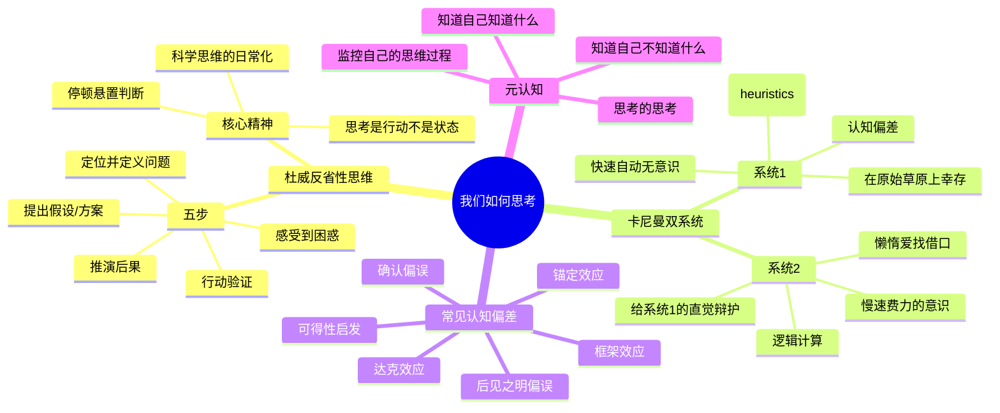

# Day 2：我们如何思考——反省性思维的底层架构

> 你以为是你在"思考"？醒醒吧。你大部分时间只是在"给已经做出的决定找理由"——这叫叙事，不叫思考。杜威在1910年就看透了这件事，而现代认知科学只不过是在给他的洞察加注脚。

---

## 🍅 6：悬疑开场——寺庙着火了，你在想什么？

1909年，约翰·杜威给了一个经典的例子。

一个人走在街上，突然看见街对面的寺庙着火了。他脑子里发生了什么？一系列想法像弹珠一样弹出来：

1. "着火了！"（本能反应）
2. "我得去看看怎么办。"（行动冲动）
3. "等等——寺庙东边有座水池，我去提水。"（方案浮现）
4. "但火势这么大，一桶水够吗？还是先报警？"（评估）
5. "报警号码是多少来着——等等，为什么寺庙会着火？这个时间没人在里面才对..."（转向疑问）
6. "不对——这个季节寺庙电路改造过没？该不会是电路老化？"（猜想）
7. "算了，先打119再说。"（决定）

杜威问了一个极其刁钻的问题：**从第1步到第7步，哪些是"思考"？**

答案是：1不是（那是反射），2不是（那是直觉驱动的冲动），3也不是（那是联想），4到6才是——因为你开始"停顿"了。你没有立即跳到行动，而是悬置判断，回过头审视"着火"这件事本身。

这就是杜威著名的**反省性思维（Reflective Thinking）** 的核心：思考不是你意识到"着火"的那一刻，是你意识到"我需要确认我关于着火的假设"的那一刻。

**大白话翻译：你大部分时间都没在思考。你只是在"叙事"——编一个关于你经历了什么的故事，然后信以为真。**

杜威的《How We Think》（《我们如何思考》）出版于1910年。一百多年后，丹尼尔·卡尼曼用实验心理学证明了同一件事——并且给它起了一对更性感的名字：系统1和系统2。

你所谓的思考，90%的时间都是由系统1完成的：快速、自动、无意识。你只有在遇到"6 × 37 = ?"这种计算时，才会勉为其难地调用系统2——慢速、费力、有意识。

但系统2很懒。它会想尽一切办法把问题推给系统1。于是你活在一种幻觉里：**你以为你在理性决策，你在深思熟虑，但你的大脑其实在用"话术"——"好像也对"、"差不多就行了"、"听起来没问题"——来骗你自己。**

> ### ✅ 费曼三句话
> 1. 思考不是你想的那回事——真正的思考发生在你"停顿"下来、悬置判断、回头审视自己假设的那一刻，而不是你顺着直觉冲动行动的时候。
> 2. 我发现自己95%的所谓"思考"都是在编故事——先有一个结论，然后找理由证明它是对的。这和杜威说的"反省性思维"完全是两回事。
> 3. 如果我已经习惯了"不思考"（或者说，习惯了把叙事当思考），那我还有救吗？还是说，我已经被系统1劫持了一辈子？

> ### ❓ 悬疑追问
> 如果连"我此刻在思考"这个判断本身都可能是一种错觉——那我们有没有可能真正地"思考"？还是说，我们能做到的最好程度，就是"意识到自己在用系统1"而已？

> ### 📌 连线笔记
> 回忆一个你最近做的"重大决定"——买房？跳槽？分手？当时你觉得你"深思熟虑"了，但现在回头看，那个决定有多少是"直觉驱动，事后找理由"？

---

## 🍅 7：核心原理——杜威五步法与系统1/2双加工理论

### 杜威的五步反省性思维

杜威认为，真正的思考是一个有结构的流程。不是你脑子里的万马奔腾，而是有意识的方法论。他给出了五个步骤：

1. **感受到困难/困惑/疑问** —— 思考的起点不是"我要思考"（这个太抽象），而是你撞到了某个具体问题，让你觉得"嗯？不对劲"。没有困惑，就没有思考。

2. **定位并定义这个困难** —— 不是"我好焦虑"，而是"我焦虑是因为我在犹豫要不要跳槽，而犹豫是因为我不确定新工作的成长空间是否值得放弃现在的稳定"。把模糊的感觉变成清晰的问题。

3. **提出可能的解决方案/假设** —— 这就是发散思维阶段。不要评判，先把可能的方案列出来："A. 跳，B. 不跳，C. 骑驴找马，D. 和新公司谈更大的涨幅..."

4. **推演每个方案的含义和后果** —— 收敛思维阶段。A的后果是？B的后果是？谁获益？谁受损？短期？长期？

5. **进一步观察和实验，决定接受或拒绝** —— 用行动验证。小规模试错，收集更多数据，然后决定。

你看，这个流程和一个科学家做实验的流程一模一样。这也是为什么杜威说：**思考不是你的一部分——思考是你做的一件事。它是一种行动，不是一个状态。**

大多数人停在第一步——"嗯，不对劲"——然后就被情绪/直觉带走了。少数人走到第二步——"我知道问题是什么"——就停在了一个看似清晰的表象上。更少的人走到第三步和第四步——列方案、评估后果。几乎没有人真正走到第五步——用行动验证。

### 卡尼曼：系统1和系统2

快五十年后，卡尼曼在《思考，快与慢》中给出了杜威理论的一个惊人的"神经科学配图"。

**系统1：快速、自动、无意识、基于经验、情绪驱动。** 它的座右铭是"先开枪再问问题"。

**系统2：慢速、费力、有意识、基于逻辑、需要计算。** 它的座右铭是..."算了，让系统1干吧，我累。"

卡尼曼和他已故的搭档阿莫斯·特沃斯基（Amos Tversky）做了一系列精美的实验来展示系统1的"套路"：

| 现象 | 系统1的表演 | 你错过的关键 |
|------|------------|-------------|
| **锚定效应** | 谈判时先出价的人定调 | 第一个数字会对你的判断产生长达数小时的影响 |
| **可得性启发** | 飞机失事比车祸更让你害怕 | 因为你更容易"想起"飞机失事的画面 |
| **确认偏误** | 你优先看到支持你观点的证据 | 你像一个"只为控方辩护"的律师 |
| **后见之明偏误** | "我早就知道会这样" | 你忘了你在事情发生前其实完全不确定 |
| **框架效应** | "90%存活率" vs "10%死亡率" | 明明是同一个信息，你的感受天差地别 |

这些不是"偶尔发生的错误"——它们是**系统1的正常运行模式**。系统1的工作方式就是走捷径、用经验、信直觉。这套模式在原始草原上救过你的命（"草动了一下，快跑！"），但在现代世界，它让你买多余保险、选错股票、嫁错人。

最可怕的是什么？**当系统1犯了错，系统2经常会帮它"圆回来"——不是纠正，而是辩护。** 你做了一个直觉决定，然后你的"理性"不是去质疑它，而是去给它编一个"合理的理由"。你以为是思考在驱动决定，其实是决定在驱动思考。

> ### ✅ 费曼三句话
> 1. 杜威说思考有五个步骤（困惑→定义问题→假设→推演→验证），卡尼曼说你的大脑有两个系统——系统1（快、直觉、自动）和系统2（慢、逻辑、费力）——而糟糕的决定通常来自系统1独断专行、系统2充当它的辩护律师。
> 2. 我过去特别自豪于自己"思考速度快"——但现在我怀疑，"快"可能只是"在用系统1"，我引以为傲的东西可能正是我最该警惕的弱点。
> 3. 如果系统2这么懒，那我有没有办法让它勤快一点？还是说，最好的策略不是训练系统2，而是设计一个让系统1很难犯错的环境？

> ### ❓ 悬疑追问
> 杜威说"困难是思考的起点"——那现代社会恰恰在消灭"困难"：有导航你就不会迷路，有推荐算法你就不用选择。如果思考的燃料是困难和困惑，那当算法替我们把所有困难都消灭了——思考本身还会发生吗？

> ### 📌 连线笔记
> 你最近做的最让你感到"聪明"的决定是什么？重新审视它：你的决定依据是什么？你收集了哪些反面证据？如果你要"故意反驳"这个决定，你会编出什么理由？

---

## 🍅 8：实战案例——那个"直觉很强"的经理，和那个"很会思考"的经理

### 场景

某科技公司的产品团队遇到了一个问题：用户留存率连续三个月下跌，从65%跌到了42%。

**经理A：直觉型决策者**

开会，听了一轮汇报。直觉反应："肯定是新版本的上线出了问题。新UI用户不喜欢。降级回退。"

动作：技术团队开始准备回退方案。

花费：2周开发时间 + 大量沟通成本。

结果：回退后留存率回升到58%——还是低。而且更关键的问题来了：旧版本也有问题，不然当初为什么要改？

**经理A的思考过程分析：**

这是一个典型的系统1决策流程：
- 收到"留存率跌"的信号 → 联想到"最近一次大变更" → 因果归因："新UI → 用户不喜欢 → 留存跌" → 行动指令："回退"
- 这个过程只用了5秒。几乎是瞬间完成的。
- 经理A自认为"做出了果断的决策"。他在向团队解释时，编了一个完全合理的叙事："用户体验第一，新版本不好用我们就回到好的版本。"
- 画面很美好。逻辑很自洽。全是错的。

**经理B：反省性思维者**

同样开会，同样听汇报。但经理B没有立即表态。她问了一个额外的问题：

"留存率跌是从6月份开始的。新版本是5月底上的。但旧版本6月份也跌——只不过没有新版本跌得那么厉害。所以，**是什么让所有人的留存率都跌了？**"

她定义了一个不同的"困难"：不是"新版本导致留存下跌"，而是"整个产品线的留存都在变化，新版本可能只是加剧了某个更大的趋势"。

然后她提出了多个假设：
- H1: 夏季来了，用户活跃度季节性下降
- H2: 竞争对手在6月上线了新功能
- H3: 我们投放的渠道变了，带来了质量更低的用户
- H4: 新版本确实有问题（但她没有假设这是唯一原因）

她推演了每个假设的含义——如果是H1，什么都不用做，等秋天自然恢复；如果是H2，需要竞品分析；如果是H3，查投放数据；如果是H4，细分用户看错误报告和反馈。

她没花两周去回退，而是花了两天做了数据验证。结果是H1+H3的组合——夏季本身就是行业的淡季，加上投放渠道从精准的搜索广告换成了泛人群的信息流广告，带来了大量"看看就走"的留存毒药。

**行动方案**：不做回退。优化投放渠道。针对夏季做一波社区运营。和新版本无关。

这个决策用了同样的时间（两周），但前者的两周让事情变更好吗？其实没有。后者的两周是"花在思考上的"，而前者的两周是"花在弥补缺乏思考上的"。

### 要命的问题

为什么组织里经理A比经理B多？

因为**经理A看起来像一个更好的领导者**——果断、干脆、有决策力。而经理B看起来"犹豫"、"较真"、"想太多"。

但这个判断本身就是系统1的产物。**你很习惯用一种"领导气质"的标准来评估决策者，这个标准——你猜对了——和决策质量没有任何关系。**

杜威在1910年就警告过："一个快速但错误地行动的人，比一个慢但正确的人更危险，因为他的错误会被他的行动速度放大。"

> ### ✅ 费曼三句话
> 1. 经理A和经理B的区别不是"直觉 vs 理性"——经理A也用"理性"（她编了一个很合理的叙事来合理化她的直觉判断），真正的区别是：经理B在回答之前先重新定义了问题，而经理A直接回答了她以为的问题。
> 2. 这个案例让我很不舒服——因为我发现自己就是经理A，甚至为"果断"沾沾自喜。我现在怀疑，我的职业发展过程中，"果断"这个特质的被高估，可能让我养成了不思考的习惯。
> 3. 如果"停顿"和"重新定义问题"是高质量思考的关键，那为什么社会环境在奖励那些不停顿的人？这是不是意味着——高质量的思考本身就是反社会期待的？

> ### ❓ 悬疑追问
> 经理B的做法明显更周密——但她在实际组织里会被怎么评价？"想太多"、"效率低"、"不够果断"。有没有可能：在当下的工作环境中，"思考"本身已经变成了一种奢侈品，而不是一种能力？

> ### 📌 连线笔记
> 你的工作环境中，你是经理A还是经理B？更重要的是——你的老板鼓励你做A还是做B？你上一次被表扬，是因为你"快速做了决定"，还是因为你"问了一个好问题"？

---

## 🍅 9：🧠 思维导图 + 费曼大复习

### 思维导图

### 费曼大复习

闭上眼。给你自己讲一遍今天的核心内容：

1. **什么叫"思考"？** ——杜威说：是"停顿一下"，把你脑子里那个直觉驱动的自动反应按个暂停，重新审视问题本身，而不是直接跳到结论。"思考"和"叙事"是两回事。

2. **为什么你觉得自己在思考，其实没有？** ——卡尼曼说：你的大脑有两个系统。系统1又快又懒，系统2又慢又懒。大多数时候系统1在做决定，系统2在写辩护词。

3. **这对你有什么用？** ——下次你觉得自己在"深思熟虑"的时候，先别信自己的感觉。问自己一句："我的结论是之前就已经有的，还是我真的一步一步推理出来的？"如果你发现自己其实已经有一个偏好了——恭喜你，你至少发现了自己的系统1在干活。

> ### ✅ 费曼三句话
> 1. 今天的内容可以浓缩成一个悖论：**你越觉得自己在思考的时候，你越可能只是在"叙事"（给直觉找理由）；而你真的在思考的时候，你反而会觉得很痛苦、很慢、很不确定。**
> 2. 这个洞察对我来说是一个"元认知武器"——它告诉我：如果我觉得一个决定做得很顺、很爽、很果断，我反而应该警惕；如果我觉得很纠结、很难、很慢，那才说明系统2终于上线了。
> 3. 但如果"思考"本身就意味着"不舒服"，那一个人的思考质量，很大程度上取决于他忍受不确定性的能力——这个能力要怎么练？

> ### ❓ 悬疑追问
> 杜威说思考的起点是"困惑"和"困难"——那如果一个人的生活太顺畅、工作太熟练、日常太自动化，他是不是会慢慢失去"思考的能力"？舒适区不仅仅是能力的敌人——它是思考的敌人？

> ### 📌 连线笔记
> 一个很私人的问题：你上次在"思考"这件事上感到真正的困难/不确定/痛苦，是什么时候？那个艰难的过程，最终有没有产生好的结果？

---

## 🍅 10：刻意练习——反省性思维的五步训练

今天的刻意练习只有四个字：**慢下来。**

但我们具体一点。

### 练习：五步日志

选一个你目前**正在纠结**的问题——工作中、生活里、关系中，都可以。不要太大（"我的人生意义是什么"），但也不要太小（"今晚吃什么"）。最好是一个中等规模、有不确定性、让你有情绪反应的问题。

用杜威的五步法，写下每一步：

#### 第一步：感受到困难

你在什么情境下意识到"有问题"？把当时的场景写下来——不要分析，只描述。

> 示例：每次开周会，我汇报进度的时候，领导总是皱眉头。不是批评，但就是有一种"不满意"的感觉。我说完以后，她会说"好的"然后跳过，不像对其他人一样追问细节。

#### 第二步：定义困难（这是最关键的一步）

"我感觉领导对我不满意"——但这是一个模糊的感受。把它变成一个可验证的问题。

> 你原来的定义：领导不满意我的工作。
> 更好的定义：领导对我的汇报风格有意见？还是我做的事情本身不符合她的预期？还是这是我想多了？

**关键技巧：把你的定义变成两个相互竞争的假设。**
- 假设A：我的工作质量有问题，领导确实不满意
- 假设B：我的工作质量没问题，但我的汇报方式让她很难理解我在做什么
- 假设C：这是纯粹的"我感觉"——领导对所有人都是这个态度，只是我刚来，还不习惯她的管理风格

#### 第三步：提出可能的方案

针对每个假设，提出一个行动方案。

- 如果A是对的：我需要主动约领导谈一次，问她对我近期工作的反馈
- 如果B是对的：我应该改变汇报方式，先讲结论再讲过程，多用数据
- 如果C是对的：我可以观察领导和其他同事的互动方式，验证这个假设

#### 第四步：推演后果

每个方案的后果是什么？

- 方案A：如果我直接去问，最坏的结果是得到负面反馈（但这也可能是好事）
- 方案B：改变汇报方式没有成本，可以立刻执行
- 方案C：观察同事互动可以侧面验证，但不解决根本问题

#### 第五步：行动验证

选一个方案，小规模执行。

> 建议：先做B（改变汇报方式）——因为成本最低、可立即执行、而且有反馈。观察两周，看看领导的反应是否有变化。如果有变化，问题锁定在B。如果没变化，执行A。

### 为什么这个练习有效？

因为大多数人的"纠结"本质上是停在第一步（"嗯，不对劲"）和第二步之间（"领导对我不满意"），然后直接跳到第三步（"我要找个机会和她谈谈"）——跳过了"定义困难"这个最重要的环节。

你定义的"问题"，决定了你的"答案"的质量。

> **一个定义不清的问题，只配得到一个没用的答案。**

### 拓展：偏误检查清单

用这个检查清单过一遍你的五步日志：

- [ ] 我有没有"确认偏误"在作祟——我只找了支持我直觉的证据？
- [ ] 我有没有把"最容易想到的解释"当成了"最可能的解释"？（可得性启发）
- [ ] 我的"问题定义"是否过于狭窄？有没有可能这个问题其实是另一个更大问题的子问题？
- [ ] 我是否跳过了假设推演，直接进入了行动？
- [ ] 我有没有给"这个思考过程本身"留出足够的时间？

**最后，也是最重要的：**

写下你做完这个五步练习后的**感受**。是不是很不舒服？是不是觉得"想太多了"？是不是有一种"还不如直接干"的冲动？

这种不舒服感——**就是对它。**

如果你觉得"思考原来这么累"——恭喜，你终于开始思考了。

> ### ✅ 费曼三句话
> 1. 反省性思维本质上是一种"减速"——用杜威的五步（困惑→定义→假设→推演→验证）来对抗你大脑的默认设置（系统1的快速判断），而五步中最关键的一步是"定义困难"，因为一个错的问题只会得到一个错的答案。
> 2. 这个五步法最让我震惊的不是它有多高明——而是它那么简单，而我在三十年的"思考"生涯中从来没有刻意练习过它。我一直在用系统1的"自动驾驶"模式处理复杂问题，还自我感觉很良好。
> 3. 一个好的"思考者"和一个普通人的区别，可能不是智商——只是一个习惯：在"想"和"做"之间多停三秒。就三秒。这真的有用吗？还是这只是认知科学家的自我欺骗？

> ### ❓ 悬疑追问
> 杜威的五步法和卡尼曼的双系统理论看起来天衣无缝——但你有没有注意到一个漏洞：如果系统2真的那么懒，为什么我们会相信"学了思考方法以后，自己就会用系统2思考"这个幻觉？**思考方法本身，是不是也只是一个"更高级的叙事工具"？**

> ### 📌 连线笔记
> 从今天开始，坚持一周"五步日志"——每天选一个决策，用杜威五步法过一遍。不需要正式地写下来（但你写下来的效果更好），但至少在脑子里过一遍。一周后回来看——你的决策质量有没有变化。如果有，继续。如果没有，我们在Day 6再聊。
