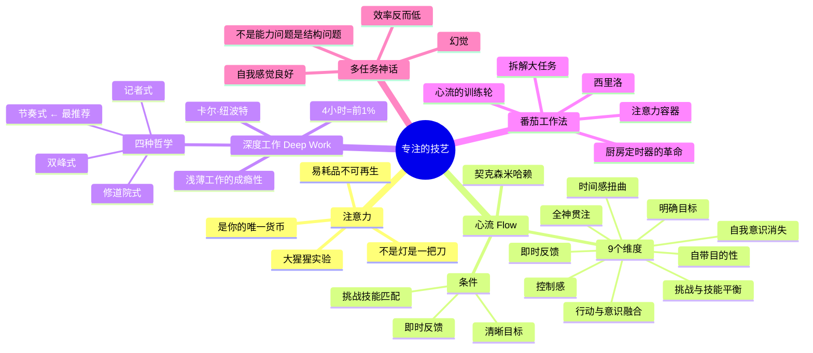

# Day 3：专注的技艺——注意力是你唯一的货币

> 你损失的每一分钟注意力，都是永远追不回来的。钱可以再赚，时间可以再挤，但"专心地活过的每一秒"——花掉了就没有了。而你用这些换来的，是什么呢？

---

## 🍅 11：悬疑开场——大猩猩在你面前跳舞，你没看见

1999年，哈佛心理学家丹尼尔·西蒙斯（Daniel Simons）做了一个后来成为心理学史上最著名的实验之一。

他让受试者看一段视频：穿白色和黑色衣服的两队人在传球。任务是数白队传了多少次。

视频播放到一半，一个穿大猩猩套装的人走进画面中央，对着镜头捶胸，然后走出去。整个过程持续了大约9秒。

视频结束后，西蒙斯问受试者："你们看见大猩猩了吗？"

约一半的人回答："什么大猩猩？"

**大猩猩在他们面前跳舞了9秒——他们没看见。**

不是他们"没注意到"——他们是真的没看见。视觉系统直接在"数据处理管道"中把它过滤掉了。因为大脑的能量有限，当所有资源都分配给"数白队传球"时，"检查画面中是否有大猩猩"这个进程被直接当作"不重要"给砍了。

这个实验没有告诉我们"人很蠢"（虽然这个结论也很受欢迎）。它告诉我们一个更根本的东西：**注意力不是一盏灯——它是一把刀。你把它插在哪里，哪里就变得清楚，其他地方全都变成模糊的背景。**

而你现在正在做的事——如果你正在"同时处理多个任务"——你其实是在把刀扔向空中，指望它同时切中所有东西。它做不到。它会在空中转几圈，然后掉在地上，把什么都切不好。

弗朗西斯科·西里洛（Francesco Cirillo）在20世纪80年代末发现了这一点。他当时是个大学生，学不进去，觉得自己"注意力有问题"。他找到一个厨房定时器——番茄形状的——对自己说："我就专注25分钟。就25分钟。25分钟以后，我可以休息。"

惊讶地发现：居然可以。

这就是**番茄工作法**的起源。不是什么高深的科学，就是一个焦躁的学生对一个厨房定时器的实验。但这个简单的实验揭示了一个反直觉的真理：**你不需要"更多的注意力"——你需要给自己的注意力一个边界。**

25分钟之所以有效，不是因为25分钟是一个"神奇的数字"，而是因为它创造了一个**注意力容器**：你知道它很短（所以你不怕开始），你知道它有终点（所以你可以忍受），你知道结束以后有奖励（所以你的多巴胺系统愿意配合）。

西里洛的番茄工作法和两百年后的契克森米哈赖的心流理论（Flow）有什么关系？关系很大。米哈赖发现：当一个人完全沉浸在某件事中时，时间感消失，自我意识消失，行为与意识完全融合——这就是"心流"。但心流不会凭空发生。它需要特定的条件：**清晰的目标、即时的反馈、以及挑战与技能的平衡。**

番茄工作法恰好满足了前两个条件。它不是心流本身，但它是心流的"引子"——如果你连25分钟都坐不住，谈论心流就像从没下过泳池的人在讨论蛙泳的技巧。

而卡尔·纽波特（Cal Newport）的《Deep Work》（《深度工作》）进一步把这个洞察推向了极端——在充满微信、邮件、短视频的时代，能进行深度工作的人将成为稀缺资源。

他说："深度工作"不是在公园散步顺便想问题——那是分心。深度工作是在**无干扰的状态下进行的、将认知能力推到极限的专业活动。它创造新价值、提升技能、难以复制。**

而记住这个事实：如果你每天能深度工作4小时，你在任何知识领域都会成为前1%的人。**四个小时。不是12个小时。不是996。四个小时。**

今天我们要做的一件事：重新理解"专注"到底是什么。它不是一种"性格特质"——它是一个**肌肉记忆、一个技术动作、一个你可以通过练习获得的技能**。

如果你曾经觉得自己"注意力有问题"，你不是一个人。西里洛也觉得自己注意力有问题。而他用一个厨房定时器无意中创造了一个全世界都在使用的生产力系统。

> ### ✅ 费曼三句话
> 1. 注意力不是你的性格——它是一个你可以在特定条件下调用的心理资源。条件对了，谁都可以专注；条件不对，谁也专注不了。大猩猩在你面前跳舞你没看见——不是因为你不专注，恰恰是因为你太专注了。
> 2. 我过去经常责备自己"注意力不集中"——但我从来没有问过：我的环境、我的工具、我的任务设计，有没有为"注意力集中"创造过哪怕一个条件？我一边开着微信一边看书，然后怪自己看不进去——这就像一边把水龙头拧开一边埋怨地板为什么会湿。
> 3. 番茄工作法的真正价值不是"25分钟"——而是它为注意力创造了一个"容器"：有起点、有终点、有奖励。没有这个容器，注意力就像水一样四处流淌，什么也浇灌不了。

> ### ❓ 悬疑追问
> 如果番茄工作法的核心是"给注意力一个容器"，那25分钟是最佳容器吗？有没有可能——对于某些类型的工作，"番茄"应该反过来——更长或更短？

> ### 📌 连线笔记
> 你今天花了多少时间在"假装专注"上？——开着文档、眼睛盯着屏幕、但脑子里在想着别的事。你可以诚实地估算一下吗？

---

## 🍅 12：核心原理——心流、深度工作与番茄工作法的"三角联盟"

### 心流（Flow）：身体在动，时间在飞

米哈赖在他的巨作《Flow》（《心流》）中提出了一个让整个心理学界为之侧目的发现：**人类最幸福的状态不是"放松"——而是"全神贯注"**。
他花了数十年时间采访了成千上万的人——登山者、棋手、外科医生、舞者、程序员——问他们同一个问题："什么时候你最快乐？"答案出奇一致：不是躺在沙滩上的时候。是在**挑战与技能恰好匹配**的时候。

米哈赖总结了心流的9个维度：

| 维度 | 描述 | 用大白话说 |
|------|------|-----------|
| 1. 挑战与技能平衡 | 任务难度刚好比你的能力高一点点 | 不太难（不想放弃）又不太简单（不会无聊） |
| 2. 行动与意识融合 | 你不"想"了，你在"做" | 像跳舞一样——你不会思考"左脚迈一步"，你只是移动 |
| 3. 明确的目标 | 你知道你要做什么 | 不是"我要变好"，而是"我要在这25分钟内写完引言" |
| 4. 即时反馈 | 你立刻知道自己做得好不好 | 写代码—编译—看结果，而不是"准备半年后的一次考试" |
| 5. 全神贯注 | 你只关注当下 | 手机？什么东西？ |
| 6. 控制感 | 你觉得你能搞定 | "我控制着局面，而不是局面控制着我" |
| 7. 自我意识消失 | 你忘了自己 | 不会想着"我这样看起来聪明吗" |
| 8. 时间感扭曲 | 时间变快或变慢 | 抬头一看："什么？已经过了两小时？" |
| 9. 自带目的性 | 做这件事本身就是奖励 | 不是为了钱/名/未来——因为'现在'已经是奖励了 |

这9个条件，本质上是在说同一件事：**当你的大脑被一项"恰到好处"的任务完全占用时，它就没有多余的资源去焦虑、去自我怀疑、去关心谁给你发了微信。**

这就是注意力悖论的一个极其优美的印证：**你越是想要快乐，你就越得不到快乐（因为你在"想要"）；你越是专注，快乐反而自己找上门来。**

### 深度工作（Deep Work）：浅薄的自由，深度的稀缺

卡尔·纽波特的《Deep Work》是一本带着愤怒写的书。他愤怒的是：这个时代正在系统性地摧毁人们的专注能力，而大多数人对此毫无知觉，甚至引以为傲。

他定义了深度工作的对立面——**浅薄工作（Shallow Work）**：那些不需要高认知投入的、逻辑上可以被替代的任务——回邮件、刷社交媒体、填表格、参加你不需要参加的会议。这些任务占用你80%的时间，产出可能只占20%的价值。

而更可怕的是：**浅薄工作具有成瘾性。** 每一次你从深度工作中"逃"到回邮件，你的大脑都会获得一个小小的多巴胺奖励——"你看，我做了点事！"——你感觉良好。但你刚刚放弃了最值钱的活动（深度思考），换来了最不值钱的活动（回一封其实不急的邮件）。

纽波特提出了四种深度工作哲学：

1. **修道院式**：完全隔离，几个月不出门（适合写书的人）
2. **双峰式**：把一天分成深度工作时间和浅薄工作时间（适合学者）
3. **节奏式**：每天固定时间做深度工作，形成习惯（最适合普通人）
4. **记者式**：随时在极短时间内进入状态（不适合初学者）

对于90%的知识工作者，节奏式是最现实的选择：每天上午9:00-11:00是深度工作时间。手机静音。微信退出。门关上。雷打不动。

### 番茄工作法：心流的"训练轮"

这就是为什么西里洛的番茄工作法放在这里理解才最有价值。

心流是"自由泳"——很美，但不会的人下水就呛。番茄工作法是"游泳圈"——笨拙，但安全。你不用一上来就追求那种"两个小时忘记时间"的境界——那需要技能和任务难度的精密匹配。你只需要做到：**接下来25分钟，我不碰手机。**

25分钟结束时，你甚至不需要等待心流——但神奇的是，心流经常在没有邀请的情况下自己出现。因为番茄工作法的结构恰好碰瓷了心流的前几个条件：

- 一个25分钟的目标 = 心流的"明确目标"
- 番茄结束铃响 = 心流的"即时反馈"
- 专注25分钟的中断禁止 = 心流的"全神贯注"的门票

它不保证心流。但它为你买了一张彩票。

> ### ✅ 费曼三句话
> 1. 心流不是靠"追求"得到的——它是一系列条件的产物（挑战与技能平衡、明确目标、即时反馈），而番茄工作法恰好用最低的门槛满足了这些条件中的一部分，所以它成了心流最可靠的"引子"。
> 2. 我过去以为"深度工作"是指"工作很认真"——但我现在知道，它是指一种特定的"高认知投入状态"，而这种状态的敌人不是"懒"，是"浅薄工作"——那些看起来在做、实际上不需要动脑的事情。而我最擅长的就是"用浅薄工作把自己填满，假装自己在忙"。
> 3. 如果浅薄工作有"成瘾性"——那我戒掉它的方法就不应该只是"更努力"，而是应该设计一个让成瘾无法发生的环境。这一点我过去从来没想过——我一直在用"意志力"对抗"成瘾机制"，这就像用手掐灭电路板上的火。

> ### ❓ 悬疑追问
> 番茄工作法和心流之间存在一个有趣的矛盾：番茄定时器的响声会打断你，但心流恰恰需要"不被打断"。如果番茄工作法打断了心流，它还算不算一个好的心流入口？

> ### 📌 连线笔记
> 你每天花多少时间在"浅薄工作"上？诚实点。可以打开你的手机屏幕时间统计——那个数字可能会让你沉默很久。

---

## 🍅 13：实战案例——一个"番茄"怎么救了三个人的命

### 案例一：写作者——"每天四页书"的奇迹

一位研究者（我们叫他张老师）被要求半年内完成一本书。他之前没写过书，面对"写一本书"这个巨大任务，他的反应很诚实——恐惧。他每天打开电脑，盯着空白文档，焦虑，然后去刷微博。然后更焦虑。然后更刷。一天过去了，文档还是空的。

他开始用番茄工作法——不是因为他信，而是因为他已经走到绝路上去了。

他的做法：
- 定一个极小的目标：每个番茄只写"三句话"。
- 不是一段，不是一页——三句话。一个番茄只写三句话。写不完？你没资格休息。写完了？你可以开心地玩剩下的时间。
- 实际效果：三个番茄后，他已经写了9句话。四个番茄后，他发现"三句话"的约束太松了——因为一旦开始写，句子会自己带出句子。五个番茄后，他已经写了整整一页。

六个月后，书出版了。他后来说了一句话："我从来没有觉得自己在'写一本书'——我每天只是在'写50个番茄的几句话'。一本书，是顺便完成的。"

**他的秘笈不是"番茄工作法"——而是"把大目标拆成小到可笑的步骤，从而骗过大脑的恐惧中枢"。**

### 案例二：软件工程师——为什么"10倍效率程序员"存在？

一位资深程序员在团队里被认为是"10倍效率"——他一个顶五个。同事们不服气：他明明不加班，每天6点准时走。

有人观察了他一周，发现了一个事实：

**他每天上午9:30到11:30是"消失"的状态。** 不看邮件、不接电话、不回Slack。戴着降噪耳机，屏幕上是全屏IDE。

他一天"深度工作"的时间大约是2-3小时。但他的产出，是整个团队其他人在剩下的6-7小时"浅薄工作"里加起来的总和。

因为他只做两件事：

1. **上午写核心逻辑**（深度模式）——这时候他处理的是"真正需要思考"的问题。架构设计、核心算法、复杂的Bug。这些活，需要在心流状态下做。一旦心流被切断，重新进入的时间成本是15-20分钟——所以"绝对不能被打断"。

2. **下午查邮件、开会、回消息**（浅薄模式）——这些事不需要深度思考。当他的精力在下午自然下降时，他正好做这些不需要精力的事。

不是他"天赋异禀"。是他**把高难度任务和低难度任务，分配给了大脑的不同模式。**

### 案例三：多任务处理的幻觉

一项斯坦福大学的研究：让两组学生分别做"多任务"和"单任务"。
- 多任务组：同时处理三个信息流（阅读+听讲+打字）
- 单任务组：依次处理三个信息流

结果：多任务组**每一个任务的完成质量都低于单任务组**。而且——这一点很关键——多任务组**自我感觉更良好**。他们觉得自己"效率很高"、"同时做了很多事"。

多任务处理最大的危害不是效率低——效率低是可以被观察到的。最大的危害是：**它让你感觉自己效率很高。** 你在不同任务之间切换带来的"忙碌感"，被你的大脑解读为"生产力"。这是一种自我欺骗。你感觉自己像一个连续投出十个好球的投手——但仔细一看，十个球都是高飞球，对手已经跑回本垒了。

《全神贯注的方法》（台湾译者译作"专注的力量"）里面讲了一个道理：**多任务不是一个"能力问题"——它是一个"结构问题"。** 当你的环境被设计成"随时可以被打断"时，你就会被打断。当你的手机可以随时推送任何东西时，你就会分心。这不是你的错。这是设计的问题。

> ### ✅ 费曼三句话
> 1. 三个案例说明了同一个道理：专注不是性格，是条件——把任务拆到"小到可笑"（张老师）、把深度和浅薄时间分开（程序员）、认识到多任务只是一个感觉良好的幻觉（斯坦福研究），这些都不是天赋，是技术动作。
> 2. 最刺痛我的是"多任务组自我感觉更好"这个发现——我过去经常在一天结束时感觉到"今天好忙"，然后觉得"我很高效"。但现在我怀疑：我的"好忙"感觉和"高效率"之间，可能根本不存在任何正相关。
> 3. 如果环境设计决定了注意力质量，而我的手机就是那个"最坏的设计"——那我是不是应该把手机从工作环境中"物理移除"，而不是指望自己"更有意志力"？

> ### ❓ 悬疑追问
> 案例二中的软件工程师上午深度工作、下午浅薄工作——但如果他的公司文化是"上午开会、下午自由"，他还能坚持这个节奏吗？**深度工作需要环境支持，而大多数环境是在奖励浅薄——这个结构性矛盾怎么破？**

> ### 📌 连线笔记
> 你做一个"注意力审计"：记录你在接下来的4小时里，每15分钟你在做什么、注意力状态如何。4小时后回看——你有多少时间是在"真专注"，多少时间在"假装专注"，多少时间在"根本没在意"？

---

## 🍅 14：🧠 思维导图 + 费曼大复习

### 思维导图

### 费曼大复习

用你的话给一个朋友讲清楚：

1. **注意力到底是什么？** ——它不是你可以"多任务"的无限资源。它是一把刀。你只能把它插在一个地方。同时插在三个地方的结果不是"三个都切了"——是"三个都切得稀烂"。

2. **心流、深度工作和番茄工作法是什么关系？** ——心流是理想状态（挑战匹配、目标明确、反馈即时），深度工作是高认知投入的工作方式（不做浅薄的事），番茄工作法是这两者的"入门券"——它用25分钟的结构骗你的大脑进入专注状态。

3. **多任务处理的危害是什么？** ——它让你自我感觉很有效率，实际上你什么也没做好。就像在跑步机上打电话、发微信、追剧——你觉得你完成了好多事，但你还在原地。

> ### ✅ 费曼三句话
> 1. 今天的内容可以用一个比喻总结：你的注意力是一把激光刀——切一个东西的时候锋利无比，但如果你试图同时切三个东西，你只会得到一把无用的、到处乱晃的笨铁棒。
> 2. 我过去对自己"注意力不集中"这个问题的理解是完全错的——我一直以为这是"意志力问题"，但今天我知道了，这是"条件问题"：我没有给我的注意力创造"可以集中的条件"——没有目标、没有容器、没有排除干扰。
> 3. 三个方法（心流、深度工作、番茄工作法）之间有一个共同的线索：它们都在说"少即是多"。但我们的文化在说"多即是多"。我该怎么在"多即是多"的环境里践行"少即是多"的方法？

> ### ❓ 悬疑追问
> 番茄工作法说"25分钟"，但有的工作（写代码、写作）需要更长的沉浸时间，而有的工作（客服、管理）天然就是碎片化的——有没有可能：**"番茄"的大小应该根据工作的性质来调整，而不是死守25分钟？**

> ### 📌 连线笔记
> 从今天开始，尝试在你的日历上"封锁"一段深度工作时间——每天上午或者下午，至少1小时。那是你"不见任何人、不看任何消息、只做一件事"的时间。就一小时。试试一周，看看它对你的一周产出有什么影响。

---

## 🍅 15：刻意练习——设计你的专注系统

今天不是一个思考练习——它是一个**设计任务**。你要为自己设计一个"专注系统"。

### 第一步：做一次"注意力审计"

在启动番茄计时器之前，先做一个冷静的现状分析。打开你的手机设置，查看今天的"屏幕使用时间"——如果超过4小时（在工作之外），我们就知道问题在哪了。

然后用下面的表格评估你的典型工作日：

| 时间段 | 你在做什么 | 专注度 (1-10) | 中断次数 | 中断源 |
|--------|-----------|:-----------:|:-------:|--------|
| 9:00-10:00 | | | | |
| 10:00-11:00 | | | | |
| 11:00-12:00 | | | | |
| ... | | | | |

### 第二步：设计你的"番茄容器"

番茄工作法的经典结构是：25分钟工作 + 5分钟休息。但你得找到**你自己的节奏**。有些人适合35分钟，有些人15分钟就是极限。

**实验周任务**：接下来一周，每天至少完成3个番茄。记录每次番茄的时间长度和你主观的感受。

| 番茄 # | 时长 | 任务 | 心流程度 (1-10) | 中断次数 | 备注 |
|:-----:|:---:|------|:--------------:|:-------:|------|
| 1 | 25min | | | | |
| 2 | 25min | | | | |
| 3 | 25min | | | | |

一周后复盘：哪种时长最适合你？什么时候你的注意力最好？什么类型的中断最多？

### 第三步：安装"防中断系统"

识别你最大的三个中断源。对每个中断源，设计一个"拦截策略"：

| 中断源 | 拦截策略 |
|--------|---------|
| 手机微信通知 | 番茄期间把手机放另一房间 |
| 同事来找你 | 门口贴"深度工作中，11:30后在线" |
| 自己分心（想刷网页） | 在笔记本上写下"分心想法"然后继续 |
| ... | ... |

### 第四步：设计你的"心流入口"

深度工作最难的部分是**开始**。你不想开始。你的大脑会找一百个理由不开始。

所以你需要一个仪式感——一个"心流入口"动作。它可以很简单，但每次开始深度工作前一定要做：

> 我的心流入口仪式：
> - 倒一杯水
> - 戴上降噪耳机（或者耳塞）
> - 打开[某个特定app/文档]
> - 关掉手机通知
> - 启动一个"番茄"
> - 然后开始

### 第五步：费曼复盘

> ### ✅ 费曼三句话
> 1. 今天设计专注系统不是因为你"没有意志力"——是因为意志力是最不可靠的资源，而环境设计远比意志力可靠。你的"防中断系统"不是道德的产物，是工程学的产物。
> 2. 我过去总想"通过更努力来更专注"——但这个思路本身就是错的。专注不是"努力"的结果，是"设计"的结果。我应该在环境设计上花功夫，而不是在自我责备上花功夫。
> 3. 如果说有一个"最值得带走"的工具——那就是"心流入口仪式"。不是因为仪式很神奇，是因为"开始"这个动作是整个专注过程中最难的环节，一个仪式可以绕过大脑的拖延防御。

> ### ❓ 悬疑追问
> 我们花了一整天讨论"怎么专注"——但有没有一种可能：**专注本身被高估了？** 所谓的"神游"、做白日梦、让思绪飘荡——这些"不专注"的状态，是不是也有它们的价值？什么时候应该专注，什么时候应该放任？

> ### 📌 连线笔记
> 明天早上，你的第一个任务不是打开邮箱——是完成一个番茄里的深度工作。就一个番茄。25分钟。用它去攻昨天最让你头疼的问题。在你处理那些"紧急但不重要"的消息之前，先给今天的"真正重要的事"一个番茄。就这样，一天一个番茄的胜利。
