# Day 4：理解与记忆——如何让知识真正"长"在脑子里

> 你装了那么多知识，但它们是一盘散沙还是钢结构？

---

## 🍅 16: 你的记忆是个筛子——以及为什么费曼决定当个"傻子"

### 悬疑开场

你花了三小时读完一本改变人生的书。三天后有人问你："那本书到底讲了什么？"

你张了张嘴。封面颜色还记得。作者名字……好像是两个字？内容？大脑一片空白。

这不是你记忆力差。**这是你大脑的出厂默认设置——它设计出来就不是为了"记住"，而是为了"忘记"。**

### 故事

1940年代，普林斯顿。一个年轻物理学家站在黑板前，看着对面坐着的人——那是整个曼哈顿计划最聪明的大脑们：奥本海默、玻尔、费米、贝特。

他在给他们讲课。

他有一个规矩：**每讲完一个概念，他一定要用一个连高中生都能听懂的方式重新讲一遍。** 如果做不到，说明他自己还没真正理解。

这个年轻人叫理查德·费曼。

费曼发现了一个惊人的真相：**学术界的大多数人都在用华丽术语掩盖自己理解上的漏洞。** "用专业术语解释专业概念"——这不是教学，这是**知识界的庞氏骗局**。你用一个你没搞懂的术语去解释另一个你没搞懂的概念，然后两个错误互相担保，形成了一个虚假的"理解"。

费曼不干这种事。他发明了一种方法：**如果你不能用最简单的语言说清楚一个东西，你就没真懂。** 这就是后来被称为"费曼技巧"（Feynman Technique）的学习方法——它本质上是一个**谎言检测器**，用来揪出你自己大脑里的"假装理解"。

但这个故事有一个更反直觉的层面：费曼不只是"教别人"，他是在**用最简单的语言讲给自己听**。他的"学生"从根本上说，是他自己。

**你的大脑是个极其高效的筛子。** 它每天接收的信息如果全部保留，你的头会炸。所以它的策略是：**信息必须证明自己有被记住的价值。** 怎么证明？通过被**主动处理**。被重新组织、被改写、被用另一种方式说出来。每一次这样的"主动处理"，都是一次**记忆的巩固信号**。

### 费曼三句话

1. **费曼技巧的核心不是"教别人"，而是"逼自己用最简单的语言说出来"——它的本质是在你脑子里安装一个"假理解警报器"。**
2. **我过去踩过的坑：读完一本书感动得不行，觉得"我全懂了"，结果一个月后连三个要点都说不出来——因为我从来没逼自己用简单语言总结过。**
3. **我想追问：费曼技巧对于直觉型理解（比如"你会说法语但你讲不出语法规则"）是否也一样有效？语言学习中的"语感"算不算一种无需费曼技巧的理解？**

### 悬疑追问

你有没有想过——为什么"考试前通宵背下来的东西，考完就忘"？因为你用了一种欺骗大脑的策略：**你营造了"这个信息马上要被使用了"的假象，你的大脑信了，暂时保存了它。考试一过，警报解除，大脑说："清理掉吧。"** 但费曼技巧处理的记忆不一样——它改写了信息的结构，你的大脑会说："这玩意被改了格式，好像很重要，留着。"

### 连线笔记

- **和我的工作/学习的连接**：我能不能把每周读的一本书，用费曼三句话写进Obsidian？这不仅是笔记，更是一次记忆加固。
- **行动**：以后每学一个新概念，先用大白话写一遍。如果超过三句话还说不清楚——我还没真懂。

---

## 🍅 17: 艾宾浩斯的诅咒——遗忘不是敌人，它是记忆的合伙人

### 核心理论

1885年，柏林。一个德国心理学家把自己关在实验室里，做了一件近乎自虐的事。

他制造了2300个无意义音节——像"ZOF"、"KEB"、"VUL"这样的玩意儿——然后拼命背它们，背到能准确复述，然后等一段时间，再测自己还记得多少。

他每天重复这个实验，持续了几年。

这个疯子叫赫尔曼·艾宾浩斯。他的受虐成果就是我们今天熟知的**艾宾浩斯遗忘曲线（Ebbinghaus Forgetting Curve）**：

- **20分钟后**：你记得58%
- **1小时后**：你记得44%
- **1天后**：你记得26%
- **1周后**：你记得13%
- **1个月后**：你记得...几乎为零

这幅图看起来像是给所有学习者判了死刑。**但艾宾浩斯没有停在这里。**

他发现了一个更重要的规律：**如果在特定的时间点"提醒"大脑——不是在信息刚进来的时候，而是在它即将被遗忘的临界点——记忆的保持率会呈指数级上升。**

这叫**间隔效应（Spacing Effect）**。

具体来说：

| 复习时机 | 效果 |
|----------|------|
| 学完后立即复习 | 短期记忆巩固，但长期收益有限 |
| 1小时后复习 | 增强了第一次遗忘阻击 |
| 1天后复习 | 大脑开始觉得："这玩意好像被多次调用，可能真的重要" |
| 1周后复习 | 记忆开始进入长期存储区 |
| 1个月后复习 | 基本固化——这成了你"不假思索就知道"的东西 |

**为什么？** 因为大脑不是硬盘，它是**一个预测机器**。一个信息被多次在不同时间点提取——大脑的逻辑是："这玩意被反复调用，应该很重要，给它分配一个永久存储位。"

这解释了为什么"考前突击"是世界上最糟糕的学习策略：**你把所有信息在同一天塞进去，大脑只会觉得"这是一次性垃圾邮件"——它永远不会把短期工作内存里的东西转移进长期存储。**

### 从曲线到策略

遗忘曲线告诉你一个残酷但解放性的真相：

**"记不住"不是你的失败，它是你的大脑在按正确策略运行。** 你没有失败，你只是没有配合大脑的运行规则。

好的复习策略不是"多复习"，而是**在正确的时间点复习**。这就是**间隔重复（Spaced Repetition）**的底层逻辑。它不是在和遗忘作战——它是在**利用遗忘**作为信号，告诉大脑："注意，这段信息在被遗忘之前又被提取了一次，它很重要。"

**Agenda遗忘而没Agenda遗忘**——很多信息你忘了是因为你从来没给它一个被记住的"理由"。你的大脑问："为什么要记住这个？"你没回答。它就把这行代码删了。

### 费曼三句话

1. **遗忘曲线的真正启示不是"你会忘记一切"，而是"你的大脑只在信息被反复提取时才认为它值得保存"——遗忘不是bug，是feature。**
2. **我过去踩的坑：买各种记忆软件、做精美的复习计划，但从来没理解过背后的机制——我不是在"利用遗忘"，我是在"对抗遗忘"，所以累死了还没效果。**
3. **我想追问：如果某类知识（比如骑自行车）是"程序性记忆"，遗忘曲线还适用吗？身体记忆和语义记忆的遗忘规律是不是完全不同的两套系统？**

### 悬疑追问

艾宾浩斯的实验对象是**无意义音节**——他刻意排除了"意义"这个变量。但你学的不是无意义音节。你学的是有故事、有体系、有情感连接的知识。**意义本身就是最强的记忆锚点。** 这就是为什么下一颗番茄我们要讲"心智模型"——这个东西不是"存储知识"，它是给你的知识盖房子。

### 连线笔记

- **和我的工作/学习的连接**：我在Obsidian里做笔记时，是不是应该设计一个"间隔复习工作流"？比如每天随机抽取3条30天前的笔记？
- **行动**：在Obsidian里建一个"待复习"查询，每天自动推送N条过期的笔记让我回顾。

---

## 🍅 18: 心智模型——专家和普通人的本质区别不是一个聪明一个笨

### 实战案例

让我们做一个小实验。

请记住以下文字：

```
DJFJDISOSMNZJCNSODJC
```

好，现在记住另一段文字：

```
THE_CAT_SAT_ON_THE_MAT
```

第二段是不是容易得多？但你仔细看——第二段的字母数量和第一段差不多。区别是什么？**第二段是一个有结构的模式。**

你的大脑不是为记忆"字母"而生的，它是为记忆**模式**而生的。

**心智模型（Mental Models）**，简单说，就是大脑中关于"世界如何运作"的简化模式。

### 专家 vs 初学者的本质区别

1970年代，心理学家德格鲁特（de Groot）和后来的蔡斯（Chase）与西蒙（Simon）做了一个经典实验：

他们给国际象棋大师和业余爱好者看一个棋局——**一个真实比赛中出现的棋局**——只给5秒钟。然后要求他们在另一个棋盘上复现。

结果：**大师几乎完美复现；业余爱好者只能摆对几个棋子。**

然后他们做了一个关键的变化：**把棋子随机摆在棋盘上**——不是真实比赛中的合法棋局。

结果：**大师和业余爱好者的表现几乎一样差。**

这说明什么？

**大师不是比业余者"记忆力更好"。大师的记忆力在非棋局场景下就是个普通人。** 差别在于：大师的大脑中存储了成千上万个"棋局模式块（chunks）"——每一块包含了多个棋子的位置关系和战略意义。看到真实棋局时，大师不是在"记位置"——他在用模式识别，把整个棋局作为一个单一"块"来理解。

这就是**组块化（Chunking）**。

### 组块化：把知识压缩成乐高块

"组块"是认知心理学最强大的概念之一。它的工作原理：

1. **新手阶段**：你学习的每一个知识点都是一个孤立的"原子"——很小、很散、记起来很费劲。这就是为什么学新东西总是感觉"信息过载"。
2. **熟练阶段**：你的大脑开始把经常一起使用的原子"打包"成一个组块。调用这个组块时，原子级别的信息不需要逐一提及——**一个组块就是一个"认知快捷方式"**。
3. **专家阶段**：你的大脑里有了大量的组块，而且组块之间也建立了连接，形成了**组块网络**——这就是"心智模型"。

**用乐高来比喻：**

- 原子知识 = 单个乐高颗粒
- 组块 = 你预先拼好的小模块（墙壁、窗户、车轮）
- 心智模型 = 整套城堡的建筑蓝图

新手是一次拼一个颗粒。专家是直接用预制模块搭建——快了几个数量级。

### 真实案例：为什么好的医生"看一眼"就知道你得了什么病？

不是因为她有"直觉"。是因为她的大脑中存储了数千个"病例组块"——症状A+B+C组合在一起时，她不是逐个分析A、B、C——她直接调取了一个组块："这看起来像是某某疾病的典型表现。"

更恐怖的是：**组块的建立是无意识的。** 你不断接触某一领域的案例，你的大脑会自动形成组块——不管你有没有刻意"学习"。这就是为什么你在某一行干久了会有"直觉"——那其实是你大脑中自动形成的组块网络在帮你做快速判断。

**但这里有个陷阱。** 组块也可以是错的。你的大脑如果反复看到"A和B一起出现"，它会自动建立"A+B"组块——即使A和B之间根本没有因果关系。这就是偏见的认知根源。

### 费曼三句话

1. **专家和普通人的本质区别不是"存储的信息量不同"，而是"信息的组织方式不同"——一个是一房间散落的乐高颗粒，一个是拼好的建筑模块。**
2. **我过去的体会：写代码十年后，我"一看就知道"这个bug在哪个模块——这不是直觉，是我大脑中已经形成了数千个"bug-模块"组块。**
3. **我想追问：如果组块是自动形成的，那刻意练习的角色是不是不是为了"形成组块"（大脑会自动做这事），而是为了"确保组块的正确性"？**

### 悬疑追问

既然心智模型这么好用——为什么"专家"也会犯极其愚蠢的错误？因为**组块的优势也是它的致命弱点**：一旦你形成了稳定的心智模型，你就会**自动忽略不符合这个模型的信息**。这就是"确认偏误"的认知根源。你的模型越强大，你"看不见"的东西就越多。**所以最危险的不是没有心智模型的人——是有一个错误但运行稳定的心智模型的人。**

### 连线笔记

- **和我的工作/学习的连接**：我在学习一个新领域时，能不能有意识地"偷"专家的组块？比如通过研究他们的决策过程、他们的分类方式？
- **行动**：每次学习时，记录自己"组块形成"的过程——从哪些原子开始？什么时刻感觉"通了"？这是我个人的学习元认知日志。

---

## 🍅 19: 🧠 知识钢结构——思维导图+费曼大复习

### 知识钢结构全景

```mermaid
mindmap
  root((理解与记忆))
    费曼技巧
      谎言检测器
      简单语言原则
      "教"给自己听
      假装理解的克星
    记忆的底层机制
      艾宾浩斯遗忘曲线
        20分钟 → 58%
        1小时 → 44%
        1天 → 26%
        1周 → 13%
      遗忘是feature不是bug
      大脑是预测机器
    间隔重复
      利用遗忘信号
      正确时机复习
      从短期到长期
    心智模型
      组块化
        原子 → 组块 → 网络
        乐高颗粒 → 预制模块
      专家 vs 新手
        模式识别而非记忆术
        无意识组块形成
      组块的陷阱
        错误组块 = 偏见
        确认偏误
    刻意复习设计
      正确的复习节奏
      主动提取vs被动重读
      制造"必要难度"
```



### 费曼大复习：把Day 4用三句话说清楚

#### 第一句：理解与记忆到底是什么？

> 你的大脑不是硬盘，是一个会偷懒的预测引擎。它不会自动记住你喂给它的东西——它需要你**主动处理**信息（费曼技巧）、**在遗忘临界点反复提取**（间隔重复）、**把原子知识拼成可复用的模块**（组块化），然后这些知识才算真正"长"在了你脑子里。

#### 第二句：最反直觉的一个真相

> **"理解"和"记忆"不是两个不同的过程——它们是同一个硬币的两面。** 你没法真正理解一个你不记得的东西，你也很难长期记住一个你根本不理解的东西。费曼技巧和间隔重复之所以有效，是因为它们都做了同一件事：**逼你的大脑对信息进行深层加工。**

#### 第三句：我该怎么用？

> 每天学任何新东西，做三件事：(1) 用费曼三句话逼自己说清楚；(2) 把新知识和旧组块连接起来（"这就像……"）；(3) 设置一个1天/1周/1个月的复习提醒。**90%的学习类App都是在帮你做表面功夫——真正的功夫只有这三个动作。**

### 悬疑追问

你有没有想过——为什么"教学相长"是真的？（教是最好的学）因为当你教别人的时候，你不仅在提取记忆，你还在**被迫重构你的组块网络**——你必须把一个复杂的组块拆解成原子，再用别人能理解的方式重新组块。这个"拆解-重组"的过程，是记忆加固最猛烈的形式。**所以费曼技巧的本质是：假装教别人，真实是在炸毁并重建自己的心智模型。**

### 连线笔记

- **整体结构反思**：Day 4的四颗番茄形成了一个递进——从"如何检测自己是否真理解"（费曼）到"如何对抗遗忘"（记忆曲线/间隔重复）到"如何把知识组织成专家模式"（组块化/心智模型）。每个工具都有一个"好"和"危险"的两面——**理解工具的副作用，才是真正的理解**。
- **行动**：把这张思维导图作为我Obsidian笔记系统的顶层组织框架——每次新笔记都问自己："这属于哪个层次？原子？组块？还是心智模型？"

---

## 🍅 20: 刻意练习——当《Make It Stick》遇上费曼，你该拿什么拯救你的学习计划

### 认知战场："必要难度"理论

你辛辛苦苦做了一本精美的学习笔记——用彩色笔标注、画了思维导图、整理了关键词。结果发现，考试的时候你根本不记得自己写过什么。

为什么？

因为你被**流畅度幻觉（Fluency Illusion）**给骗了。

流畅度幻觉是指：**当信息看起来"容易加工"时，你的大脑会误以为自己已经掌握了它。** 你画了漂亮的笔记，你的大脑看到这些整齐的图表，产生了一种"这玩意看起来很清晰 = 我理解了它"的错觉。

**但学习的真相是反直觉的：越"费力"的学习，效果越好。**

这就是**必要难度（Desirable Difficulties）**理论——由认知心理学家比约克夫妇（Bjork & Bjork）提出。核心观点：**如果学习过程太轻松，你记住的东西一定少。轻快的学习是无效学习最可靠的信号。**

### 刻意练习：不是"练一万小时"，是"正确地练一万小时"

安德斯·埃里克森（Anders Ericsson）的刻意练习（Deliberate Practice）有五个核心条件。注意：**大部分人对"刻意练习"的理解都停留在"反复练习"——这是彻底错的。** 重复≠刻意练习。下面是真正的条件：

| 条件 | 解释 | 普通人做的是什么 |
|------|------|------------------|
| 1. 明确的目标 | 不是"今天学Python"，是"今天用递归写一个斐波那契，不参考任何资料" | "我要学编程"——太模糊，无法衡量 |
| 2. 即时反馈 | 你每一步都知道自己是对是错 | 一个人在房间里看书——零反馈 |
| 3. 舒适区边缘 | 你感到吃力但不是不可能 | 永远在重复你会的东西——或者去挑战你完全不会的东西 |
| 4. 可重复 | 同一个动作反复做，直到自动化 | "我今天练了一次，然后明天换别的" |
| 5. 有教练/模板 | 有人告诉你"标准答案"是什么 | 自学——你根本不知道你练得对不对 |

### 今天的刻意练习：用费曼组块法攻克一个你"一直想学但没学进去"的东西

**练习目标**：选择一个你"听过很多次但从来没真正理解"的概念，用20分钟完成一次费曼组块化学习。

**步骤：**

1. **选概念**（2分钟）：选一个你一直"想学但觉得太难"的东西。比如："区块链到底是怎么运作的？"或"什么是贝叶斯定理？"或"为什么飞机能飞起来？"——选完之后，写下你当前的理解（哪怕是一团浆糊）。

2. **拆原子**（5分钟）：不要试图理解整个概念。你去维基百科或者一篇好的科普文章里，找5个这个领域最核心的"术语"。比如区块链：去中心化、哈希函数、共识机制、工作量证明、分布式账本。**只理解这5个术语的定义，不用管它们怎么组合。**

3. **组块尝试**（5分钟）：现在，用你自己的话，把这5个原子连成一个故事。**不要看资料。** 用费曼技巧：假装你在跟一个完全不懂的朋友解释。如果你卡住了——恭喜，你找到了"假装理解"的漏洞。回去查那个卡住的地方。

4. **结构反思**（5分钟）：写下你的"组块过程"——你从哪些原子开始？它们是怎么组合起来的？哪个连接点让你卡住了？这个"卡住"暴露了你对哪个原子的理解还不够？

5. **间隔设置**（3分钟）：在日历上设置三个复习提醒——24小时后、7天后、30天后。每一个提醒不要只写"复习区块链"——写一个具体的费曼问题：比如"30天后问我：用三句话说清楚工作量证明解决了什么问题。"

**练习注意事项：**

- **不要追求完美。** 你的第一个组块一定是粗糙的。专家的组块是数千次迭代后的产物——你的目标不是"变成专家"，而是"体验组块化的过程"。
- **如果你发现自己又想"整理笔记"——停下来。** 这很可能是流畅度幻觉在作祟。整理笔记≠学习。主动提取才是。
- **如果卡住了就高兴一下。** 那不是失败——那是你精准地找到了自己理解的边界。大多数人的问题不是"不理解"，而是"不知道自己不理解在哪里"。

### 费曼三句话

1. **刻意练习不是"重复"，是"在舒适区边缘，带着明确目标和即时反馈，反复纠正错误"——一万小时定律是鸡汤，埃里克森的实验数据才是真相。**
2. **我过去踩过的大坑：我学了十年英语，大部分时间都在"重复我已经知道的东西"——而不是在边缘区挣扎。我根本没有刻意练习过。**
3. **我想追问：在"没有教练"的领域（比如写作、创造力类），刻意练习怎么落地？自我反馈的有效性会不会太低？**

### 悬疑追问

今天的练习你做了吗？如果你"读了"但"没做"——请停下来，认真地问自己一个问题：**"我是在学习，还是在消费学习内容？"** 读这篇教程本身并不能让你变聪明。只有当你真的停下来，拿起笔，逼自己说出"我用三句话解释区块链"——这时候学习才真正开始。前面十几颗番茄的内容，如果不做最后的刻意练习，**它们的命运就是被你的遗忘曲线无情地清理掉。**

### 连线笔记

- **和我的工具链的连接**：我的Obsidian笔记系统可以增加一个"费曼卡壳记录"——专门记录我"以为自己懂但说不清楚"的概念。这些才是真正需要投入学习时间的点。
- **行动承诺**：今天下班前，完成上面的练习——选一个概念，拆原子，组块，记录卡壳点。不求完美，只求"在边缘区挣扎了20分钟"。
