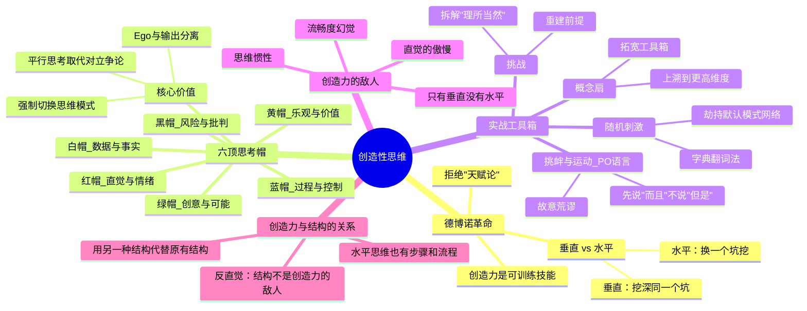

# Day 5：创造性思维——从一个想法到另一个想法的非直线路径

> 创造力是天赋还是技术？德博诺说：是后者。

---

## 🍅 21: "天才的闪电"是个谎言——德博诺的革命

### 悬疑开场

阿基米德大喊"尤里卡！"从浴缸里跳出来，裸奔过西西里岛的街头——这个画面如此生动，以至于两千多年后我们仍然用它来代表"灵光一现"。

这个画面也是人类关于创造力的**最大误导**。

它告诉你：**伟大的想法像闪电一样，突然劈中一个幸运的天才。**

它没告诉你的是：阿基米德已经在浴缸里思考了三个星期。他的"灵光一现"不是毫无征兆的奇迹——它是一系列逻辑推导的终点，**只是因为推导过程太快，被压缩成了一个"顿悟"的幻觉。**

### 故事：那个和"垂直思维"宣战的医生

1960年代，牛津大学。一个叫爱德华·德博诺（Edward de Bono）的年轻医生正在做一件几乎被所有心理学家嘲笑的事：**他想用系统化的方法"制造"创造性思维。**

当时的主流认知是：创造力是一种天赋。你有就是有，没有拉倒。爱因斯坦被闪电劈中，其他人只能等着被劈。

德博诺说：放屁。

他在诊所里观察了大量病人的思维模式后，得出一个在当时看来极其叛逆的结论——**创造力不是一种"天赋特质"，它是一种"技能"。就像骑自行车——你**可以**通过训练学会它。**

他提出了一个颠覆性的框架：**垂直思维（Vertical Thinking）** 和 **水平思维（Lateral Thinking）** 的二分法。

**垂直思维**是什么？
- 你站在一个起点，沿着一条逻辑路径向下挖。
- "如果我往下挖，我会挖到什么？"
- 它的口号是："更深、更准、更对。"
- 适用场景：你有一个明确的问题，需要找到最精确的答案。比如算账、写代码、做手术。

**水平思维**是什么？
- 你不是往下挖，而是换一个坑。
- "如果我不从这个起点出发呢？如果问题不是我想的那样呢？"
- 它的口号是："不同方向、不同角度、更多可能性。"
- 适用场景：你需要跳出框架、突破惯性、产生新的可能性。

**关键洞察：创造性思维不是"不思考逻辑"，而是"在同一时间不只用一条逻辑路径思考"。**

德博诺用了一个绝妙的比喻：

> 垂直思维是挖一个洞——不断挖深。水平思维是换一个地方挖洞——因为你挖的这个地方可能根本不在正确的位置。

**企业界和学术界最大的问题是什么？** 所有人都在把同一个洞挖得越来越深，但没有人停下来问："这个洞的位置对吗？"

### 思维的惯性系统

你的大脑本质上是一台**模式识别和模式维持的机器**。它会在遇到相似情况时，自动调用过去成功的思维模式——这叫"思维惯性"或"认知框架固化"。

从进化的角度看，这是好事：你不需要每天重新学会怎么开车回家。

但从创新角度，这是灾难：**你不需要每天重新思考，所以你停止了重新思考。**

德博诺的诊断一针见血：**我们不是缺少创造力，我们是太依赖"够用"的思维模式。** 够用不等于最优。够用只等于"还没死"。

### 费曼三句话

1. **创造力不是天才的专利，而是一种可训练的技能。德博诺的核心洞察是区分"垂直思维"和"水平思维"——不是一个要取代另一个，而是你得知道什么时候该用哪个。**
2. **我过去的偏见：我总以为好想法是"突然出现"的。现在我明白了——它们出现的前提是我先把"垂直思维"停掉，刻意换一个方向看问题。**
3. **我想追问：水平思维会不会产生大量"看起来很新颖但完全没有价值"的想法？如何保证水平思维的质量？总得有个判断标准吧？**

### 悬疑追问

德博诺说过一句让很多人不舒服的话："**你永远无法通过更努力地思考，跳出你现有的思维框架。**" 因为你的思维框架本身就是你的"思考算法"——用同样的算法试图跳出算法，这在逻辑上是不可能的。你需要一个**外部的触发器**。下一颗番茄就是关于这个外部触发器的——它叫"随机刺激"（Random Stimulation）。

### 连线笔记

- **和我的工作/学习的连接**：我每天在用的思维模式是垂直的还是水平的？我有没有在"不需要垂直"的时候过度使用它？
- **行动**：今天开会时，尝试问一次："如果我们反过来看这个问题呢？"——哪怕这个问题已经被讨论了一百遍。

---

## 🍅 22: 六顶思考帽——一场思维的大逃杀

### 核心理论

1999年，一个叫约翰·德·莫尔的记者被邀请到一个四面白墙的会议室。房间里没有桌椅，只有六张不同颜色的椅子，分别放在六个不同的位置。

他说："坐下。每一张椅子代表一种思考方式。你需要坐到那张椅子上，用那种方式思考。"

这是六顶思考帽的现场版——只不过帽子的颜色成了椅子的颜色。

**六顶思考帽（Six Thinking Hats）** 是德博诺最著名的工具。它的核心前提非常简单，但极其有力：

**人的大脑在同一时间只能处理一种思维模式。你不可能同时"分析数据"、"担心风险"和"天马行空"。** 如果你试图在同一时间做这些事，结果只有一个——思维瘫痪。

### 六顶帽子：角色分明的思维军队

| 帽子 | 颜色 | 代表的思维模式 | 你需要做什么 | 常见的误用 |
|------|------|----------------|--------------|------------|
| **白帽** | ⚪ | 客观·数据·事实 | 只陈述已知信息："我们知道什么？我们不知道什么？" | 把"我觉得是对的"当成数据 |
| **红帽** | 🔴 | 直觉·情绪·预感 | 说你的直觉判断，不需要解释理由 | 把情绪伪装成客观分析 |
| **黑帽** | ⚫ | 谨慎·风险·批判 | 挑刺："这东西可能出什么问题？" | 过度使用变成否定一切 |
| **黄帽** | 🟡 | 乐观·价值·机会 | 找优点："这个想法的价值在哪？" | 变成盲目的"正能量" | 乐观·价值·机会 |
| **绿帽** | 🟢 | 创造·新可能·新想法 | 产出一堆新点子，不管多离谱 | 变成漫无目的的胡思乱想 |
| **蓝帽** | 🔵 | 过程·控制·元认知 | 指挥："我们现在用哪顶帽子？" | 忘了自己也是参与者 |

### 为什么六顶帽子有效？——彻底拆解

德博诺的设计天才体现在一个细节：**他把"思考者"和"思考内容"分离了。**

举个例子：你戴着黑帽时说的"这个方案会失败"，不是你这个人"反对这个方案"——只是"黑帽思维状态下的输出"。这听起来像文字游戏，但它解决了一个人类团队协作中最致命的问题：**ego卷入（ego involvement）。**

**因为"帽子的输出"不代表"我这个人"，所以人们更容易接受批评，也更容易在批评之后切换回黄帽找优点。**

这套系统真正的力量在于：

1. **平行思考（Parallel Thinking）**：所有人同时在同一个模式下思考。不是A攻击B的提案、B辩护——而是一起戴白帽看数据，再一起戴黑帽找风险。**争论变成了协作探索。**

2. **强制切换（Forced Switching）**：大多数团队的问题不是"没人想"，而是"所有人都卡在同一个模式里"。比如一家技术公司，所有人都是黑帽——每天都在挑刺。六顶帽子的强制切换，强迫团队从"默认模式"里出来。

3. **时间的结构化**：给每种思维模式分配特定时间段——"前5分钟只找数据，后5分钟只找风险。"这听起来机械，但机械恰恰是它的优势：**当思考被结构化的时候，混乱就不会乘虚而入。**

### 一个有趣的实验

下次团队讨论时，做一件事：在会议开始前，**每个人把他们的"初步意见"写在纸上**。然后告诉他们："我们先用绿帽思考15分钟——只产出新想法，不许批评、不许说'但是'。"

你会看到一群人突然不知所措。因为大多数人习惯了"提出想法-立即批评"的循环。"只产出不批评"让他们的大脑短路了。

**但这种短路正是创造力需要的空间。**

### PO语言——德博诺最被忽视的发明

除了六顶帽子，德博诺还创造了一个很有意思的语言工具：**PO语言**。

"PO"是"Provocative Operation"（挑衅性操作）的缩写。它的用法是：在讨论中，你用一个"PO"标记来引入一个**故意挑衅、明显不合理、甚至荒谬的提议**——目的是打破思维僵局。

举例：
- "PO：我们取消所有产品线，只卖一个产品。"
- "PO：我们的竞争对手是我们的客户。"
- "PO：时间不是线性的，是倒流的。"

PO标记的作用是告诉你身边的人：**"我知道这句话听起来很蠢，但你先把批评放一放，当作一个思想实验来玩一玩。"**

德博诺观察到：**人类的大脑对"荒谬"有天生的排斥反应。** 你的第一个反射是："这不可能，因为……"但创新往往正是从不可能的地方冒出来的。

PO语言给了荒谬一张通行证。

### 费曼三句话

1. **六顶思考帽不是让你"变得更有创意"——它是给混乱的群体思维加上节奏和纪律，让不同的思维模式按顺序而不是同时打架。**
2. **我过去开会踩过的坑：所有人都戴着黑帽互怼，讨论三小时没结论。如果当时有人喊一句"现在我们戴黄帽，只找这个方案的优点"，讨论方向可能完全不同。**
3. **我想追问：六顶帽子在实际应用中最常见的失败模式是什么？是"蓝帽失控"（没人指挥）？还是"黑帽垄断"（全员挑刺停不下来）？**

### 悬疑追问

你注意到没有——所有这些工具（水平思维、六顶帽子、PO语言）都有一个共同的敌人：**直觉的傲慢。** 当一个人说"我凭直觉就知道这个方案不行"——他其实是在堵死任何进一步思考的可能。红帽不是让你不用直觉，它是让你**把直觉明确地说出来，然后放在一边，继续用其他帽子思考。** 直觉是起点，不是终点。

### 连线笔记

- **和我的工作/学习的连接**：我是否可以在下一次1对1讨论时，先和对方约定"我们用六顶帽子"？哪怕只是在心里切换。
- **行动**：在Obsidian里建一个"帽子切换记录"模板——每次遇到决策困难时，写下：白帽（数据）、黑帽（风险）、黄帽（机会），然后对比输出。

---

## 🍅 23: 创造时间——德博诺工具箱的实战演练

### 实战案例：为什么Netflix的"自由与责任"文化不是拍脑袋想出来的？

时间回到2001年。Netflix正面临一场危机：互联网泡沫破灭，公司现金流紧张，裁员了三分之一。CEO里德·哈斯廷斯和首席人才官帕蒂·麦科德坐在一个会议室里，面临一个看起来"正常"的决定：**要不要像其他公司一样，建立一套严格的考勤和休假管理制度？**

这是一个典型的垂直思维问题：
- 问题：员工会滥用自由吗？
- 垂直逻辑：会的。所以需要制度来约束。
- 结论：建立制度。

但哈斯廷斯和麦科德没有走这条路。他们做了一个水平思维的跳跃。

他们问了另一个问题：**"如果我们不管理休假呢？"**

这不是一个"理性"的问题。这是一个PO式的挑衅。

然后他们开始探索这个PO：如果不管理休假，会发生什么？
- 可能1：有人完全不干活，拿工资。——这对公平是问题。
- 可能2：但那些真正干活的人，会因为觉得被信任而更投入。——这对文化是收益。
- 可能3：管理成本会大幅下降。——这对效率是收益。
- 可能4：无法衡量"出勤"，所以只能衡量"产出"。——这对公司可能是质变。

最终的结果：Netflix取消了休假制度——没有年假、没有病假、没有上下班打卡。**唯一的原则：做对Netflix最有利的事。**

这听起来疯狂。它后来变成了商业史上最著名的文化创新之一。

**这是水平思维的具体案例：换一个坑，而不是把现成的坑挖得更深。**

### 德博诺的四大实战技术

德博诺在他的数十本书中，给出了几十种具体的"制造创造力"的技巧。以下是四个最实用的：

#### 1. 随机刺激（Random Stimulation）

**原理**：打开字典，翻到随机一页，闭眼指一个词。然后逼自己把这个词和你的问题联系起来。

**为什么有效**：你的大脑太擅长"沿着熟悉的路径思考"了。随机词的作用是**劫持你的大脑，强迫它建立新的连接**。这不是玄学——这是有认知科学依据的：新奇刺激会激活大脑的默认模式网络（DMN），而这个网络正是和"远距离联想"、"灵感"相关的。

**实战**：如果你在写营销文案没灵感——翻字典，指到"潜水艇"。然后问："我的产品和潜水艇有什么共同点？" 答案可能是："它在'水下'——你的客户看不见它，但它在运作。" → 文案角度："看不见的基础设施。"

#### 2. 概念扇（Concept Fan）

**原理**：从一个具体问题开始，不断"上溯"到更广泛的概念层面，然后在更宽的层面产生新想法，再"下溯"回具体方案。

**步骤**：
1. **问题**：我应该怎么提高这个月的销售额？
2. **上溯**：这属于什么概念？"增加收入" → "创造价值" → "改善客户体验"
3. **更宽的概念**：不仅仅是"卖东西"——"改变客户对产品的认知方式"
4. **下溯**：如果目标是"改变认知"，方案可能不是"打折"——而是"讲一个更好的品牌故事"

**为什么有效**：因为你在"问题层面"思考时，你的选项被问题的框架限制了。上溯到概念层面，你突然有了一个更大的工具箱。

#### 3. 挑衅与运动（Provocation & Movement）

**原理**：先制造一个明知不对的"挑衅"（PO），然后不是批评它，而是"运动"它——"如果这个挑衅是真的，那会怎样？"

**标准流程**：
- **PO**：我们的产品免费送。
- **运动**（不评价，只探索）：
  - "免费的话，我们靠什么赚钱？——售后服务？数据？平台效应？"
  - "免费会吸引什么类型的用户？——大量的、但未必付费的用户。"
  - "免费的竞争对手会怎么反应？——他们会骂我们扰乱市场，然后被迫跟进。"

**关键规则**：运动阶段**禁止**说"但是"。说"而且"。

#### 4. 挑战（Challenge）

**原理**：找到你思考中的一个"理所当然"的前提，然后挑战它。不是因为它错了——只是为了看看如果不成立会怎样。

**常见的"理所当然"陷阱**：
- "产品必须有说明书。" → 挑战：如果没有呢？→ 苹果的iPhone没有说明书。
- "学习需要老师。" → 挑战：如果不需要呢？→ Khan Academy。
- "开会要有议程。" → 挑战：如果没议程呢？→ Basecamp的"无议程会议"。

### 费曼三句话

1. **德博诺的创造力工具箱不是"让人产生灵感"——它是"破坏你大脑的自动思维路径"——因为创造力不是来自"更多的思考"，而是来自"不同的思考路径"。**
2. **我过去以为创造力是"等待闪电劈中"——现在我知道，创造力的核心是"主动制造随机扰动"，然后对扰动保持开放。**
3. **我想追问：随机刺激这种方法，是不是对某些类型的问题更有效？比如对"需要突破性想法"的问题有效，但对"需要渐进优化"的问题无效？**

### 悬疑追问

注意一个反直觉的事情：**这些"创造力技巧"本质上全是"结构化"的。** 随机刺激有步骤。概念扇有流程。六顶帽子有时序。**创造力不是"没有结构"——创造力是"用另一种结构代替原有的结构"。** 如果"创造力=自由散漫"，那最有创造力的人应该是五岁的孩子——但他们并不能发明iPhone。**结构不是创造力的敌人，它是创造力的脚手架。**

### 连线笔记

- **和我的工作/学习的连接**：我在Obsidian里建一个"PO挑战"笔记——每次卡住的时候，写一个PO，然后探索"如果这是真的……"
- **行动**：今天选择一个"理所当然"的日常习惯（比如"早上要喝咖啡"），挑战它：如果不喝呢？不是真的要戒——只是做一次PO练习。

---

## 🍅 24: 🧠 思维的平行宇宙——思维导图+费曼大复习

### 思维导图：创造性思维的全景地图

### 费曼大复习：把Day 5用三句话说清楚

#### 第一句：创造性思维到底是什么？

> 创造力不是"没来由的灵光一现"——它是一套可以系统化操作的思维技能集合。核心是**水平思维**：不是沿着一条路径死磕，而是主动换一条路径——而且你知道"换路径"本身也是有方法的。

#### 第二句：最反直觉的一个真相

> **创造力需要结构——而且是比你日常工作更严格的结构。** 你平时开会时大家想说什么说什么，这叫"不思考"；你给每人发一顶不同颜色的帽子然后规定"先戴白帽10分钟"，这叫"创造力的结构"。**无序不是创造力的温床，有序才是。**

#### 第三句：我该怎么用？

> 当你在任何讨论中感到"卡住了"——不管是一个人还是团队——执行三件事：(1) 问"这是不是一个垂直思维问题？我需不需要水平思维？" (2) 如果是水平思维，用概念扇上溯一级：这个问题更上层的概念是什么？ (3) 如果还卡着，翻字典找一个随机词，逼自己建立连接。**创造力不是一个开关——它是一套你可以随时启动的操作流程。**

### 悬疑追问

德博诺的方法有效——但为什么大多数人知道这些工具之后，还是不会用它？答案是：**工具本身不难，难的是"放弃你惯用的思维模式"。** 你已经习惯了用你习惯的方式思考。让你戴绿帽"只产出不批评"的时候，你的大脑会抗议——因为批评让你感到安全、聪明、有控制感。**创造力工具的真正障碍不是你不懂方法，是你舍不得放弃"我本来就会思考"的自信。**

### 连线笔记

- **结构化反思**：Day 5的五颗番茄的递进关系——先颠覆"创造力是天赋"的认知（🍅1），然后给出第一套结构化工具：六顶帽子（🍅2），然后扩展工具箱（🍅3），然后用思维导图整合（🍅4），最后动手练（🍅5）。
- **行动**：我想在Obsidian里建一个"创造力工具卡"——每张卡片是一个德博诺工具+一个我的实战案例。

---

## 🍅 25: 刻意练习——从"我知道六顶帽子"到"我真的在用它"

### 认知战场：你最大的敌人是"方法收藏癖"

承认吧——你现在已经"知道"了六顶帽子、概念扇、PO语言。你知道它们是什么、为什么有效、甚至你能给别人讲一遍。

**但你知道吗？99%的人到这里就停住了。**

他们会感到一阵短暂的智力满足——"哦，原来创造力是有方法的，有意思！"——然后关闭页面，回到他们原来的思维模式里，像什么都没发生过一样。

这叫**方法收藏癖（Method Collecting Syndrome）**。它是自我提升领域最隐蔽的陷阱：**用"知道了方法"的满足感，替代"真正去练习"的痛苦。**

德博诺本人说过一句狠话：**"知道自己应该改变，和真正改变，中间隔着一整个人生。"**

### 今天的刻意练习：用六顶帽子做一个真实的决策

**练习目标**：找一个你正在纠结的真实决策——不要虚构，必须是真实的——然后用六顶帽子走一遍完整的流程。

**选一个你的真实决策：**
- 是否要换工作？
- 是否要开始一个副业？
- 是否要搬到一个新的城市？
- 是否要投资某个课程或项目？

必须是真实的、你纠结的、有实际影响的决策。

**六顶帽子流程（每个帽子5分钟）：**

| 步骤 | 帽子 | 你的任务 | 写下来 |
|------|------|----------|--------|
| 1 | **蓝帽** | 定义问题。用一句话写下你要决策的是什么，以及你希望达到的目标。 | "我要不要[决策]？我的目标是[目标]。时间限制：[时间]。可用资源：[资源]。" |
| 2 | **白帽** | 只写事实和数据。不写"我觉得"。只写你知道的、可验证的信息。 | "目前我知道的事实有：[清单]。我不确定的是：[清单]。" |
| 3 | **绿帽** | 产生选项。不评价。越多越好。越奇怪越好。至少写5个选项——包括"不选"这个选项。 | "可能的选项有：[至少5个]。最疯狂的选项：[1个]。" |
| 4 | **黄帽** | 对每个选项找价值。"这个选项如果对了，有什么好处？" | "选项A的好处：… 选项B的好处：…" |
| 5 | **黑帽** | 对每个选项找风险。"这个选项如果错了，会出什么问题？" | "选项A的风险：… 选项B的风险：…" |
| 6 | **红帽** | 读完以上所有分析后，你的直觉是什么？**不需要理由。** | "我的直觉是：[选项X]。" |
| 7 | **蓝帽** | 总结。你现在能做出决定吗？如果不能，还需要什么信息？ | "我的决定/下一步：… 我缺失的关键信息是：…" |

**关键规则（违反一条，练习效果减半）：**

1. **严格按顺序，不要跳步。** 最常犯的错误是：先戴了黑帽，发现风险太多，直接跳到"我不干了"——跳过了绿帽和黄帽。**风险在没有看到价值之前是无效的。**

2. **每顶帽子严格限时。** 用计时器。5分钟。时间到了就换。**不要超时。** 白帽超时是因为你在"找完美数据"——世界上没有完美的数据。黑帽超时是因为你太享受批评的快感了。

3. **写下你的输出，不要只在脑子里想。** 写下来的过程会逼你清晰化。而且写完后你可以对比自己的思考过程。

4. **冷静下来后再做最终决策。** 完成帽子流程后，放一晚上再做最终决定。让潜意识处理。

**练习后的反思问题：**

- 哪顶帽子对你来说最容易？哪顶最难？这暴露了你习惯用什么思维模式？
- 你注意到"戴某顶帽子时，你的身体反应有什么不同"吗？（比如戴黑帽时肩膀紧张，戴黄帽时放松）
- 这个练习之后，你的决策有没有变得清晰？即使没有直接答案——你是否更清楚"我卡在哪里"了？

### 费曼三句话

1. **六顶帽子的刻意练习不是"学了新工具"——它是让你**看到**自己惯用的思维模式并意识到你还有别的选择。**
2. **我发现自己最难的帽子是绿帽——因为我习惯了快速批判，让我"只产出不评价"时浑身不舒服——但这恰好说明我最需要练绿帽。**
3. **我想追问：如果六顶帽子对团队讨论效果很好，那对我自己一个人思考时效果会不会打折？独处时是不是更需要某种特定的帽子组合？**

### 悬疑追问

你有没有发现——即使知道了六顶帽子，你刚才在做练习的时候，可能还是会忍不住"跳回"自己最舒服的那顶帽子？这就是为什么德博诺说：**知道方法不等于会用方法。** 你的大脑有几十年的惯性路径。一次练习不会改变它。但如果你每周用一次六顶帽子做决策——持续三个月——你大脑中"默认的思维路径"就会开始发生变化。**不是你在练习创意工具——是你的大脑在重新布线。**

### 连线笔记

- **和我的工作/学习的连接**：我把这个练习结果保存到Obsidian，标记为"Day5-练习-[决策主题]"。这不仅是决策记录，也是我思维模式变化的轨迹。
- **行动承诺**：往后一个月，每一次重大决策（哪怕是买一件超过500块的东西），都用六顶帽子过一遍——哪怕只在脑子里快速过。
