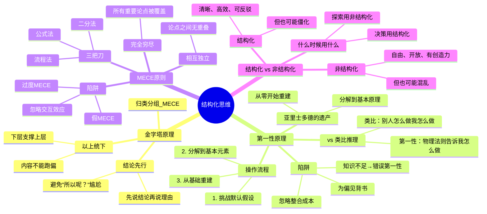

# Day 6：结构化思维——混乱世界里的逻辑锚点

> 聪明人和普通人的区别：一个是结构，一个是散沙。

---

## 🍅 26: 混乱中的秩序——为什么有人能在30秒内说清楚别人30分钟说不明白的事

### 悬疑开场

你参加了一场会议。

第一个同事讲了10分钟——背景、过程、遇到的困难、谁说了什么、他要做什么。

第二个同事补充了8分钟——更多的细节、更多的问题、更多的顾虑。

第三个同事开始反驳第一个同事的某些假设——12分钟。没完没了。

30分钟后，你看了看表，想死。

然后那个你一直觉得"也没什么了不起"的同事站起来，说了三句话：

> "我们的核心问题是X。目前有A和B两个方案。A的问题是Y，B的问题是Z。我的建议是选B，原因是——但我们需要先确认一个前提：Z是否可接受。"

30秒。会议结束了。所有人都觉得："他说得对。"

**这不是天赋。这是结构化思维。**

### 故事：麦肯锡新人的"文件夹测试"

芭芭拉·明托（Barbara Minto）在1960年代加入麦肯锡的时候，她遇到了一个令她终生难忘的"文化冲击"。

她是哈佛商学院第一批女毕业生之一——能进哈佛商学院的，智商绝对在线。但在麦肯锡的第一周，她的项目总监看了一眼她写的报告，只说了一句话：

> "重写。我看不到你的论点在哪里。"

她重写了。总监又说：

> "你还是在罗列事实。谁关心事实？我要的是结论——你的判断是什么？"

她开始明白了：**商业世界的竞争不是"谁有更多信息"的竞争，而是"谁能更快地组织信息并得出结论"的竞争。**

她在麦肯锡干了几年后，开始研究一个问题：**为什么有些人说话一听就懂，而另一些人说了一堆你还要问"所以呢？"**

她的结论后来成了一本书——《金字塔原理》（The Pyramid Principle）。这本书最初只是麦肯锡的内部培训材料，后来被译成几十种语言，成了全球咨询行业和商学院的必读经典。

### 金字塔原理的核心：自上而下的思考，自下而上的表达

明托的核心发现可以用一句话概括：**人类的大脑天生喜欢金字塔结构。**

具体来说：

> **任何复杂的信息，都被大脑自动理解为一种金字塔形的结构——顶端是一个核心结论，下面是支撑这个结论的多个分论点，再下面是支持每个分论点的证据。**

如果你不给你的信息装上这个结构，你的听众（或读者）就会自己装一个——而他们装的版本很可能和你想表达的不一样。

#### 金字塔原理的三条铁律

**铁律一：结论先行（Conclusion First）**

绝大多数人的表达方式是"过程式的"——"我先做了什么，然后发生了什么，遇到了什么问题……"

这是**人类大脑默认的叙事模式**。但它是**最低效的沟通方式**。

为什么？因为你的听众在听你说第一句话的时候，就在心里问了一个问题：**"所以呢？你到底想说什么？"**

你一直不回答，他就开始走神了。

金字塔原理的铁律一：**先说结论，再说理由。** 永远不要让你的听众猜"所以呢？"

**铁律二：以上统下（Top-Down）**

金字塔中的每一层，都是对上一层内容的"解释"或"支撑"。不能出现"上层讲A，下层讲B"的情况。

举例：
- 上层："我们应该收购这家公司。"
- 下层必须是支持这个结论的理由——"1.估值合理；2.战略契合；3.整合风险可控。"
- 不能出现："1.估值合理；2.今天天气不错；3.整合风险可控。"

**铁律三：归类分组（MECE）**

同一层级的论点必须符合**MECE原则**——Mutually Exclusive, Collectively Exhaustive（相互独立，完全穷尽）。

- **相互独立**：同一层级的论点之间不能有重叠。就像"男性"和"女性"——没有重叠。
- **完全穷尽**：所有重要论点都被覆盖了。就像"男性"和"女性"——覆盖了所有人类（在二元性别语境下）。

MECE是结构化思维最强大的武器之一。我们会在下一颗番茄详细讲。

### 一个简单的诊断方法

怎么判断自己在"结构化思维"还是"混乱思维"？

一个简单的测试：**你能不能把你的核心论点用一句话说清楚？**

如果你需要三句话才能把你的核心论点说清楚——你的核心论点实际上不存在。你只是有三颗散沙。

### 费曼三句话

1. **金字塔原理的核心不是"表达技巧"——它是"思维的组织方式"：先有结论，再有理由，理由之间不重叠、不遗漏。**
2. **我过去踩过的大坑：跟老板汇报时，我说了五分钟的背景和数据，然后老板问我"所以呢？"——因为我习惯了"过程式思维"，忘记了结论先行。**
3. **我想追问：金字塔原理要求"结论先行"，但如果我的结论不一定对呢？是不是先说了结论，会让听众忽视我推理中的漏洞？**

### 悬疑追问

对于第三句追问的答案：**是的，有风险。** 但这不是金字塔原理的错——这是"过早下结论"的错。金字塔原理和"过早下结论"有一个关键区别：后者没有支撑，前者有。**如果你能清楚地列出支撑结论的论据和证据，结论先行就不是"武断"，而是"效率"。** 这就是为什么麦肯锡的报告永远先写"我们的建议是"，然后才是"理由"——因为"理由"部分才是真正用来被质疑和讨论的。

### 连线笔记

- **和我的工作/学习的连接**：我下次写笔记、写邮件、写方案时，能不能先用一句话写出"核心论点"，然后再填充支撑论据？
- **行动**：今天开始，任何超过一段文字的输出，都先用一句话写下"核心论点"——然后问自己：这句话有没有出现在文章的第一段？

---

## 🍅 27: MECE——逻辑的原子弹

### 核心理论

先说一个你可能经历过但没意识到的场景：

你是一家公司的产品经理。你在讨论"我们为什么销售下滑"。市场部说"因为品牌知名度不够"；销售部说"因为渠道覆盖率下降"；产品部说"因为竞品功能比我们多"；客服部说"因为用户投诉率上升了"。

每个人说的都对。

但你听完之后——更混乱了。因为这些都是**不同层面**的原因，它们之间**有重叠**，有没有哪个是**最根本的**？

这时候你需要MECE。

### MECE的诞生

"相互独立，完全穷尽"——这个概念不是明托发明的。它来自数学和逻辑学，特别是集合论中的"划分"（Partition）概念。

但明托把它引入了商业和沟通领域，让它成了一个可落地的思维工具。

**MECE的核心价值是什么？**

它解决了一个极其常见的问题：**你的分析是杂乱无章的。**

当你分析一个问题时，如果你列的"原因"之间互相重叠、层级混乱、还有遗漏——你的分析是无效的。因为你可能：
1. 把同一个原因重复计算了多次
2. 遗漏了某个关键原因
3. 把原因和结果混在一起

### MECE实战：三把刀

#### 第一把刀：二分法（Dichotomy）

最简单、最强大的MECE切分方式。把一个集合切成两个互补的子集：

| 二分法 | 切分方式 |
|--------|----------|
| 时间 | 过去 / 现在 / 未来（三分，也是MECE） |
| 空间 | 内部 / 外部 |
| 性质 | 定性 / 定量 |
| 可控性 | 可控 / 不可控 |
| 优先级 | 重要且紧急 / 重要不紧急 / 紧急不重要 / 不重要不紧急（艾森豪威尔矩阵——四个象限完美MECE） |

**应用示例**："我们为什么销售下滑？"

用二分法第一步：把原因切成"内部原因"和"外部原因"。

- 内部：产品、定价、渠道、团队
- 外部：市场竞争、宏观经济、政策变化、消费者偏好变化

这已经是MECE了吗？是的——任何一个原因，要么是内部要么是外部，不可能同时是两者，也不可能既不是内部也不是外部。

然后对"内部原因"再细分——产品、定价、渠道、团队——这四个是MECE的吗？不完全是。它们之间可能有重叠。比如"产品定价过高"既是"产品"的问题也是"定价"的问题。所以我们需要调整——直到每一类之间没有重叠。

#### 第二把刀：流程法（Process）

按时间或流程顺序切分。比如一个销售流程：

```
产生线索 → 初步沟通 → 需求分析 → 方案呈现 → 谈判签约 → 售后服务
```

这六步是MECE的：客户在任何时刻都只处于其中一步，不会同时处于两步。

**应用示例**："为什么我们的销售转化率低？"

不用猜了——直接看流程的每一步的转化率。在哪一步下降最严重？那就是问题所在。**这就是流程法MECE的力量——它不让你盲目地"想想可能的原因"，它帮你"系统扫描"整个链条。**

#### 第三把刀：公式法（Formula）

把问题拆成一个数学公式。

**应用示例**："利润为什么下降？"

```
利润 = 收入 - 成本
收入 = 单价 × 销量
成本 = 固定成本 + 可变成本
```

不需要"猜想"——直接用公式把问题拆到底层，然后看每一个变量发生了什么变化。

**公式法的好处是：你不可能遗漏。** 因为数学公式本身是MECE的。

### 常见的MECE陷阱

**1. 假MECE（False MECE）**

你列出了"男生、女生、程序员"作为一个群体分类——这**不是MECE**。因为程序员不是和"男生、女生"在同一层级的分类。程序员里有男有女。

**2. 过度MECE（Over-MECE）**

你为了追求"穷尽"，把问题拆成了37个部分——然后你无法整合了。MECE的"完全穷尽"不是指"穷尽到最细的原子级别"——而是"穷尽到对决策有意义的程度"。

**3. 非线性原因（Non-linear causes）**

有些原因之间不是"相加"的关系，而是"相乘"或"互动"的关系。MECE假设分类是独立的——但如果两个原因会互相放大呢？（比如"市场萎缩×产品过时"的效果不是两者相加，而是两者相乘。）MECE对这种"交互效应"不太擅长——你需要其他工具来补充。

### 费曼三句话

1. **MECE不是"分类术"——它是一种"不允许你有模糊地带"的思维纪律：每一个论点必须有一个确定的位置，而且不同论点之间不能打架。**
2. **我过去的体会：每次写方案列出三条原因但总觉得"哪里不对劲"——后来懂了，是因为那些原因不是MECE的，它们之间互相包含。**
3. **我想追问：MECE在现实世界中是不是太理想化了？很多问题本来就是模糊的、互相纠缠的——强行用MECE会不会导致"削足适履"？**

### 悬疑追问

**对，MECE在现实中永远无法100%做到。** 这不是它的缺陷——这是它设计的一部分。MECE的价值不是"完美无缺的分类"——它是一个**极限方向**。你往MECE的方向走，你的思维就会越来越清晰。哪怕你只做到80%MECE，你的分析已经比90%的人清楚了。**它不是一把能切开一切的手术刀——它是一块磨刀石，你每次用它磨一下，你的思维就更锋利一点。**

### 连线笔记

- **和我的工作/学习的连接**：我在Obsidian里的笔记分类是不是MECE的？我的标签系统、文件夹结构是不是有重叠和遗漏？
- **行动**：今天检查我的笔记系统中一个主要的"分类点"（比如"工作/生活/学习"）——它们MECE吗？不MECE的话重构一下。

---

## 🍅 28: 第一性原理——回到原点，然后重新出发

### 实战案例：马斯克和亚里士多德的跨时空对话

说一个你可能听过但没真正理解过的故事。

2002年，马斯克想买火箭——送一个温室到火星上。他发现市场上最便宜的火箭也要6500万美元。

太贵了。

大多数人在这个点就停止了：因为"火箭就是贵"，这是"行业常识"。

但马斯克提出了一个看起来"很蠢"的问题：**"火箭的原材料值多少钱？"**

他去查了一下——火箭用的铝合金、钛合金、铜——这些材料在市场上的零售价格加在一起，只占火箭总售价的**2%**。

**这不是一个成本问题。这是一个思维问题。**

#### 第一性原理 vs 类比推理

亚里士多德在公元前4世纪提出了"第一性原理"（First Principles）的概念：**所有事物都可以被分解到最基本的、不可再分的"第一性"元素。真正的理解是从这些第一性元素出发，重新构建你的推理。**

但大多数人不用这种方式思考。

大多数人用的是**类比推理**——"别人怎么做，我就怎么做"或者"过去怎么做，现在就怎么做"。

| 思维模式 | 定义 | 优点 | 缺点 |
|----------|------|------|------|
| **类比推理** | 参考现有做法，做渐进式调整 | 高效、安全、省脑力 | 永远无法突破现有框架 |
| **第一性原理** | 回到最基本的真理/物理法则，从零开始推导 | 可能产生颠覆性突破 | 费力、可能被现有知识局限 |

**类比推理不是错的。** 它非常有效——在你不需要突破的时候。但如果你想做的是"打破行业规则"、"创造一个新品类"、"解决一个没人解决过的问题"——类比推理只能把你带到现有答案的边界。

要超越边界，你需要第一性原理。

#### 第一性原理的操作流程

**步骤1：识别并挑战你的"默认假设"**

你当前对这个问题有哪些"理所当然"的假设？

马斯克的"火箭就是贵"是假设。你的可能是什么？
- "学习必须老师教"
- "开会必须一小时"
- "好产品必须贵"

**写下来。** 大多数人的问题不是"不知道答案"——是"从来没质疑过问题的前提"。

**步骤2：分解到最基础的元素**

"一根吸管多少钱？"——一个荒唐的问题。但如果你在做一家环保吸管公司，这就是你需要回答的第一性问题。

从"默认假设"向下拆，直到你碰到**物理法则**（在科学领域）或**基本人性**（在商业/社会学领域）。

举例：
- "火箭为什么贵？" → "因为制造流程复杂、材料特殊、供应链垄断。" → "但铝合金+钛合金的原材价格是多少？" → **这就是第一性：材料成本。** （物理）

**步骤3：从基础元素开始重建**

"如果我用铝合金+钛合金的原材价格来算——加上合理的制造费用——火箭的成本应该是多少？"

马斯克的答案：**大约是他们报价的十分之一。**

这不是"砍价"。这是**思维重构**。

#### 第一性原理的致命陷阱

第一性原理不是万能的。它有至少三个致命陷阱：

**陷阱1：知识不足导致错误的第一性**

你以为你找到的"第一性"是物理法则——但你对物理的理解可能错了。如果马斯克当时搞错了铝合金的价格，他做出的"颠覆性决策"就是错的。

**第一性原理的质量上限，取决于你对基础知识的理解深度。**

**陷阱2：忽略"最后一公里"成本**

马斯克的"原材价格"分析忽略了一个关键因素：整合成本。把铝合金和钛合金变成一枚可以发射的火箭，需要大量的工程整合——这些成本是第一性原理算不出来的。

**第一性原理擅长找到"理论最小值"，但不擅长估算"实际整合成本"。**

**陷阱3：用第一性原理来为自己的偏见背书**

这是最危险的：你"选择性地"找到一些支持你已有观点的"基本事实"，然后用第一性原理给自己披上"理性"的外衣。**这不是第一性原理——这是确认偏误的变种。**

### 一个完整的案例：第一性原理在个人决策中的应用

**问题**："我应不应该辞职创业？"

**类比推理的典型思路**："别人创业成功了吗？风险多高？成功率多少？"——结论通常是"别创了，太危险。"

**第一性原理的思考方式**：

1. **挑战假设**：我假设"创业=高风险"。这是真的吗？还是因为"大多数人创业失败了"这个统计事实被误解了？

2. **分解到底层**：
   - 基本事实1：我目前的月收入是X。
   - 基本事实2：我每月的固定支出是Y。
   - 基本事实3：我有一笔储蓄Z。
   - 基本事实4：我的最小可行产品（MVP）可以在N个月内开发完成。
   - 基本事实5：我的"最坏情况"是有W个月没有收入。

3. **重新推导**：
   - 我的"生存时间" = Z / Y = **我可以撑多久**
   - 如果我的生存时间 > N（开发MVP的时间）+ 3个月（找下一个客户的时间）——**我在数学上是安全的**
   - 这比"创业=高风险"的笼统判断精确了十倍

**第一性原理没有给出"是或否"——但它把你的模糊恐惧变成了一个可以计算的数学问题。**

### 费曼三句话

1. **第一性原理不是"学别人重新推导一遍"，而是"找到你最底层的物理/人性事实，然后允许自己推翻一切建立在其上的假设"。**
2. **我过去用过但没意识到的场景：我告诉自己"必须上大学才有出路"——后来我挑战了这个假设，发现底层事实是"我需要的是能力和人脉"——而上大学只是其中一种获取方式，不是唯一方式。**
3. **我想追问：第一性原理和"幼稚"有什么区别？一个孩子也可以说'为什么火箭不能便宜？'——马斯克和一个孩子的区别是什么？**

### 悬疑追问

**伟大答案：孩子问了问题但没有能力回答。马斯克问了问题之后，去学习了火箭物理、材料科学、供应链管理——然后用知识给出了答案。** 第一性原理不是"勇气"的游戏——它是"知识深度"的游戏。你越了解基础原理，你的"原理性推导"就越可靠。**所以第一性原理的学习者是那些"不断追问为什么直到没得问"的人——这个过程本身就在加深你的知识深度。**

### 连线笔记

- **和我的工作/学习的连接**：我在Obsidian里建一个"第一性原理笔记"——针对一个我一直"默认接受"的假设，写下当前默认假设、挑战它、分解到最底层、重新推导。
- **行动**：今天找一个"我以为理所应当"的行业常识或生活规则，用第一性原理拆解它——写下来，保存在Obsidian。

---

## 🍅 29: 🧠 逻辑的锚点——思维导图+费曼大复习

### 思维导图：结构化思维的全景地图



### 费曼大复习：把Day 6用三句话说清楚

#### 第一句：结构化思维到底是什么？

> 结构化思维就是"在混乱中找到秩序"的能力——它不是让你变成机器人，而是给你一套工具（金字塔、MECE、第一性原理），让你在需要清晰的时候快速清晰、在需要深度的时候快速触底。

#### 第二句：最反直觉的一个真相

> **结构化思维最大的敌人不是"混乱"——是"你以为你有结构但实际上没有"。** 大多数人的"分析"其实是"随意列举了几个我喜欢的原因"——这不是结构化。真正的结构化是：我的结论是什么？第一层支撑有几个？每个支撑内部又细分什么？它们之间MECE吗？

#### 第三句：我该怎么用？

> 写任何东西之前，先用一句话写结论。然后列出支撑结论的三个理由——检查它们是否MECE。然后在每一个理由下展开。如果遇到一个"大家都这么认为"的行业铁律——停下来用第一性原理问三遍"为什么"。**结构化思维不是天赋——它是一种可以随时调用的思维操作流程。**

### 悬疑追问

金字塔原理和第一性原理之间有冲突吗？**有。** 金字塔原理是"自上而下"的——你先有一个结论，然后找支撑。第一性原理是"自下而上"的——你先拆到基本事实，然后重建结论。**什么时候用哪个？** 答案：当你需要沟通时用金字塔（结论先行），当你需要思考时用第一性（从基础重建）。它们是互补的——金字塔让你的表达清晰，第一性原理让你的推理深刻。

### 连线笔记

- **结构化反思**：Day 6的三件武器——金字塔原理（框架）、MECE（分类纪律）、第一性原理（深度穿透）——它们的共同点是什么？**都是在跟"默认思维模式"作对。** 金字塔在跟"过程式表达"作对，MECE在跟"模糊分类"作对，第一性原理在跟"类比惰性"作对。
- **行动**：我想做一个"思维武器对照组"——在Obsidian里建一个笔记，左边是我的默认思考，右边是"如果用结构化工具会怎样"。

---

## 🍅 30: 刻意练习——从"杂乱无章的思考者"到"结构即兴大师"

### 认知战场：结构不是枷锁，它是即兴的乐谱

爵士乐手在台上那种行云流水的即兴——看起来是"随心所欲"的灵感迸发。

但你知道爵士乐手在台下练习的是什么吗？**音阶、和弦级进、模式。** 极其重复、极其枯燥的结构化训练。

结构主义的奠基人列维-斯特劳斯说过一句很适合这里的话：**"即兴不是'想怎么弹就怎么弹'——即兴是'在限制条件内做出最优选择'。"**

没有结构就没有自由。

大多数人之所以"思考混乱"，核心原因不是"不会思考"——是**缺乏足够的思维脚手架**。当你脑子里只有"问题"和"答案"两个抽屉的时候，你是没有选择的。但当你脑子里有"金字塔、MECE、二分法、流程法、第一性原理"一套系统之后，你的"混乱"就不是真的混乱——它只是**还没选定用哪个结构**。

### 今天的刻意练习：结构即兴挑战

**练习目标**：在15分钟内，用三个不同的结构化方式分析同一个问题。然后对比三种方式的优劣。

**选一个问题（真实的问题）：**

选择一个你正在面对的真实问题——工作中、学习中、生活中都好。例如：
- "为什么这个月我的效率这么低？"
- "为什么这个项目延期了？"
- "我怎么选择我的下一份工作？"

**第一轮（5分钟）：用MECE+金字塔分析**

1. 先用MECE拆解：把问题可能的方面按二分法或流程法拆开
2. 然后金字塔化：你的核心结论（假设）是什么？MECE拆出来的支点可以作为金字塔的支撑层

**示例**：问题"为什么这个月效率低？"
- MECE拆法：二分法——"内部原因/外部原因"
- 内部：睡眠质量下降 | 任务管理混乱 | 动力不足
- 外部：团队协作成本增加 | 办公环境变化 | 家庭事务干扰
- 金字塔结论："效率下降的主要原因是内部时间管理问题——尤其是任务优先级混乱。"

**第二轮（5分钟）：用第一性原理分析**

1. 找出你默认的一个"理所当然"的假设
2. 拆到最底层（基本物理事实或人性事实）
3. 从底层重建推理

**示例**：
- 默认假设："我效率低 = 我不够自律"
- 挑战："自律"是什么？——是"在不想做的时候强迫自己做的能力"
- 底层事实1：意志力是有限资源，不是无限供应的
- 底层事实2：人的注意力天然会被新鲜刺激吸引
- 底层事实3：人的精力在一天中不是恒定的——它有波峰和波谷
- 重建："效率低不是'我不够自律'——是我**在精力波谷期给自己安排了需要高度专注的任务**，同时在精力波峰期把时间浪费在了低价值事务上。"
- **这是一个比"我不够自律"更有操作性的诊断。**

**第三轮（5分钟）：用概念扇（从Day5借的工具）**

1. 从"我的具体问题"开始
2. 上溯到更高层的概念
3. 在高层概念层面重新定义问题
4. 下溯回具体方案

**示例**：
- 具体问题："这个月效率低"
- 上溯："效率"属于什么概念？——"能量管理"、"注意力投资"
- 更高层面：这不是"时间管理"问题——这是一个"我如何设计我的一天让精力自然流向高价值任务"的设计问题
- 下溯新方案：不是"做更详细的时间表"——是"重新设计上午第一个小时做什么"

**反思对比（5分钟）：**

| 分析方式 | 你得到了什么结论？ | 这个结论和你的"直觉结论"一样吗？ | 这个工具给你的最大启发是什么？ |
|----------|-------------------|----------------------------------|------------------------------|
| MECE+金字塔 | | | |
| 第一性原理 | | | |
| 概念扇 | | | |

**核心反思问题：**

1. 三种分析的结果一样吗？如果不一样——哪种分析让你感觉"更接近真相"？
2. 你更习惯用哪种工具？**注意：你最习惯的，未必是你最需要的。** 如果你发现你一直在用金字塔（因为你喜欢"有结论"的确定感）——你可能缺少第一性原理的深度。
3. 这个练习之后，你对"结构化思维"的看法有没有改变？它还是"束缚创造力"吗？

### 费曼三句话

1. **结构化思维的刻意练习不是"学会一个工具"——是训练你的大脑在遇到任何问题时能自动弹出多个分析框架供你选择。**
2. **我的个人诊断：我最习惯用的是MECE（因为我是个喜欢分类的人）——但我最缺的是第一性原理（因为我很少挑战自己的默认假设）。**
3. **我想追问：有没有一个"元框架"告诉我——在什么情况下应该先用金字塔、什么时候先用MECE、什么时候该用第一性原理？**

### 悬疑追问

关于"元框架"的追问——答案是：**有，但不是一个固定规则，而是一个简单的顺序判断：**

- **如果问题是"如何说清楚" → 金字塔**（先有结论，后有支撑）
- **如果问题是"如何分析清楚" → MECE**（先把所有可能性排好队）
- **如果问题是"这个结论的基础是否牢靠" → 第一性原理**（拆到最底层检验假设）
- **如果问题是"我们需要新思路" → 概念扇/水平思维**（上溯到更高维度）

**结构化思维不是"用一把锤子砸所有钉子"——它是"你有一个工具箱，你知道每把工具的适用场景"。** 这也是这门课60颗番茄在做的事——不是教你一个"万能方法"——是给你一个工具箱，让你在需要的时候知道该拿哪一把。

### 连线笔记

- **和我的工具链的连接**：我在Obsidian里创建一个"结构化思维模板"——每次遇到复杂问题，打开模板，自动提示"你想用哪种结构？"然后引导你操作。
- **行动承诺**：接下来的一个月，每当我遇到"想不清楚"的问题——不是在脑子里纠结，而是选一个今天的方法，写下来，结构化分析。这是我对抗"思维惰性"的第一个武器。
