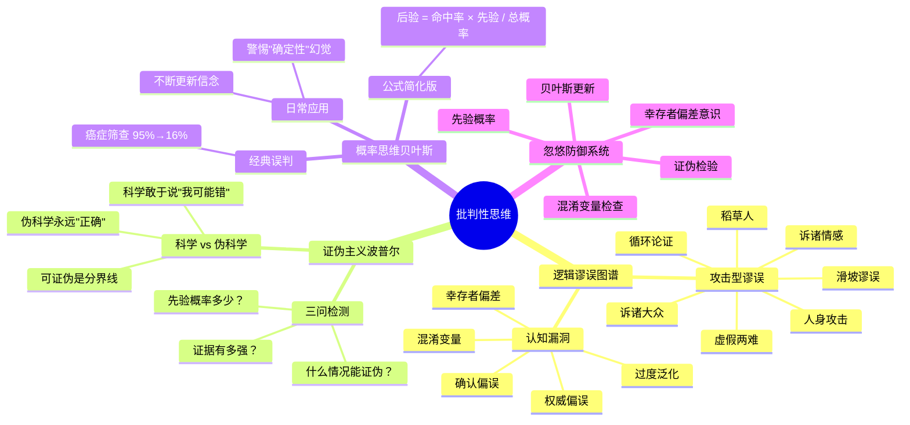

# Day 7：批判性思维——别人是怎么忽悠你的

> 你知道得越多，被忽悠的空间反而越大——除非你拥有一根叫做"证伪主义"的天线。

---

## 🍅 31：当你以为你在思考的时候

你以为你是一个理性的人。每次做决策前，你都会权衡利弊，分析数据，得出结论——就像一台生物版的Spock，逻辑严密，情绪绝缘。

**这是一个让你舒适的幻觉。**

现实是：你的大脑是一台"先下结论，再找理由"的机器。哈佛大学法学院毕业的顶级律师、摩根士丹利年薪百万的分析师、拿了诺贝尔奖的物理学家——他们和你一样，每天被几十种认知偏误和逻辑谬误轮番轰炸，且大部分时候毫无察觉。

来，让我给你讲一个让人极其不适的故事。

**2008年，一个叫伯尼·麦道夫的人，用一个极其简单的庞氏骗局，骗了全球最聪明的一群人——对冲基金经理、银行高管、甚至诺贝尔和平奖得主埃利·威塞尔。总额：650亿美元。**

这些受害者不是傻瓜。他们是全世界最擅长"分析数字"的人。他们每年花几百万美元请人做尽职调查。他们读过几百份财务报表，见过上千个投资方案。

**那他们为什么会上当？**

不是因为麦道夫太聪明（虽然他确实狡猾），而是因为他们的批判性思维系统在关键时刻**宕机**了——宕机的理由非常"人性化"：

1. **权威偏误**："他是纳斯达克前主席，这种人怎么会骗我？"
2. **从众效应**："高盛投了，摩根也投了，这么多人信的肯定没问题。"
3. **确认偏误**：他们找了无数数据"证明"麦道夫的策略是有效的，却无视了那些说"不可能持续"的警告。

换句话说，他们不是在"分析"，他们是在**为自己的决定找辩护律师**。

杜威在《思维的本质》里区分了两种"思考"：一种是真正的**反省性思维**——主动、持续、谨慎地检视一个信念背后到底有什么依据；另一种是"我以为我在思考但其实只是在做白日梦"。他说大部分人终其一生都在第二种里打转——只是给自己的偏见找更华丽的包装纸。

> 你上一次真正"改变想法"是什么时候？不是微调，而是彻底推翻自己之前深信不疑的结论——从"我确定"变成"我错了"？

如果你需要想很久才能回答这个问题——恭喜，你已经被自己的大脑成功忽悠了。

---

✅ **费曼三句话**
1. 批判性思维不是"会挑刺"，而是**主动检视自己的信念是否站得住脚**——就像给你的大脑装了一个"内部反对党"。
2. 我过去以为自己很理性，但其实我花在"为自己的观点找理由"上的时间，远远超过"质疑自己的观点"。
3. 我怀疑——当我终于认为自己"学会批判性思维"的那一刻，恰恰是我最不批判性思维的瞬间。这个悖论有解吗？

❓ **悬疑追问**
麦道夫的受害者都是顶尖聪明人。如果聪明不是防忽悠的疫苗，那什么才是？明天，我们来看波普尔给出的答案——一把叫做"证伪主义"的手术刀。

📌 **连线笔记**
回想最近一次你或你的团队做了一个重大错误决策。当时有哪些"红旗"在飘，但你们集体选择了无视？如果你的团队在每次决策前安排一个人专门扮演"反对党"，代价是什么？收益又是什么？

---

## 🍅 32：逻辑谬误完全图谱与波普尔的证伪之锤

欢迎来到"人类思维Bug大赏"。如果你把大脑比作操作系统，那么逻辑谬误就是它的**零日漏洞**——每个漏洞都很容易被利用，而大部分人甚至不知道补丁的存在。

### 第一部分：攻击型谬误（"你的论证不行，所以我赢了"）

| 谬误 | 看起来像 | 实际上 |
|------|----------|--------|
| **人身攻击** | "你一个没读过大学的人有什么资格谈教育？" | 攻击说话者而非论点 |
| **稻草人** | "你说应该减税？所以你希望学校关门、老人饿死？" | 歪曲对方观点使其更容易被攻击 |
| **诉诸情感** | "想想那些可怜的孩子们……" | 用情绪替代逻辑 |
| **诉诸大众** | "几亿人都信，怎么可能错？" | 用多数替代证据 |
| **虚假两难** | "要么支持我们，要么支持恐怖分子。" | 制造不存在的不可能选择 |
| **滑坡谬误** | "如果允许同性婚姻，下一步就会有人想跟桌子结婚。" | 把可能性推演到荒谬终点 |
| **循环论证** | "这药有效，因为它是有效的。" | 结论就是前提 |

### 第二部分：知识论漏洞（"你以为你知道，但你其实不知道"）

**波普尔的证伪主义**——这是整个20世纪科学哲学最锋利的一把刀。

波普尔说：**一个理论是不是"科学的"，不取决于它有没有证据支持，而取决于它是否可以被证伪。**

举个例子：
- "明天会下雨" → 科学（明天没下就知道错了）
- "明天可能会下雨，也可能不会" → 非科学（永远无法证明错）
- "宇宙中存在一种我们永远无法探测的能量" → 非科学（没有证伪可能）

**这才是"科学"和"伪科学"的真正分界线。** 不是"有证据"——因为伪科学也永远能找到"证据"（星座运势"准"的时候你记住了，不准的时候你忘了）。而是：**这个理论敢不敢说"如果发生X，我就错了"？**

大部分忽悠之所以有效，是因为它们**实际上永远无法被证伪**：
- "你之所以还没成功，是因为你的潜意识在抗拒成功"（弗洛伊德式解释——永远正确，永远无法证伪）
- "市场正在积蓄力量，随时会爆发"（永远正确，因为"随时"可以永远不出现）
- "这个药对某些人的体质不太适用"（万能免责条款）

### 第三部分：概率思维的护体神功

**贝叶斯主义**是人脑对抗忽悠的最后一道防线。它本质上就一句话：**你的信念应该随着新证据动态调整。**

公式（别怕，很简单的乘除法）：
```
P(假设 | 证据) = P(证据 | 假设) × P(假设) / P(证据)
```

换成大白话：
```
更新后的信念 = 证据的命中率 × 原有信念 / 证据总出现率
```

**经典案例：癌症筛查**

某种癌症在人群中的发病率是 1%（先验概率）。一种检测方法：如果真有癌，95%能查出（命中率）；如果没癌，5%会误报（假阳性）。

你拿到一个阳性结果。你有多大概率真有癌症？

大多数医生（是的，医生！）会说："95%左右吧。"

正确答案是：**大约 16%。**

计算：P(癌|阳性) = (95% × 1%) / (95% × 1% + 5% × 99%) = 0.95% / (0.95% + 4.95%) ≈ 16%

**这意味着：拿到阳性结果的人里，84%的人实际上根本没有癌症。**

这就是为什么你需要在看到任何"研究表明……"、"专家指出……"的时候，默默在心里问三个问题：

1. **"这个结论能证伪吗？"** — 在什么情况下它会不成立？
2. **"先验概率是什么？"** — 在这之前，这件事发生的可能性有多大？
3. **"这个证据有多强？"** — 它是真命中的95%，还是假阳性的5%？

《聪明人是如何思考的》总结得很到位：聪明人不是知道更多答案，而是**对"答案"这件事本身更谨慎**。

---

✅ **费曼三句话**
1. 波普尔证伪主义的核心就一句话：**一个理论的价值不在于它"能解释多少"，而在于它"敢不敢说自己在什么情况下是错的"。**
2. 我以前区分"科学"和"伪科学"用的是"有没有证据"——这个标准太弱了，因为伪科学永远能找证据。现在我改用"能不能证伪"。
3. 我想追问的是：证伪主义本身能被证伪吗？（波普尔想了很久，他的回答是：它不是一个科学命题，而是一个方法论规则——但这是不是一种"豁免"？）

❓ **悬疑追问**
如果"可证伪"是科学和伪科学的分界线，那"可操作"（actionable）是不是好理论和废话理论的分界线？——明天我们用三个真实的忽悠现场来检验这些武器。

📌 **连线笔记**
在你的专业领域里，有没有一些"不能证伪"但被当作真理在用的理论？有没有一些"永远正确"的废话公式（"因为它不够努力"、"时机还没成熟"）？试着用证伪主义重新审视你工作中最常见的三个论断。

---

## 🍅 33：实战案例——抓一个"高级忽悠"现场

好了，武器已经发了。现在我们来**实战**。

### 案例一："研究表明，吃巧克力的人更聪明"

这句话你大概率在某个营销号上见过。我们来解剖它：

**第一步：先验概率分析**
巧克力和聪明之间有因果关系？先验概率极低。更可能的是：收入高的人更可能买得起巧克力，而收入和教育/智力正相关——这是一个**混淆变量**问题。

**第二步：能否证伪？**
"吃巧克力的人更聪明"可以被证伪吗？理论上可以——做个大样本随机对照实验。但如果营销号说的是"高品质黑巧克力中的黄烷醇可能对认知功能有积极影响"——这已经滑向了不可证伪的灰色地带。

**第三步：贝叶斯更新**
一个新研究说"吃巧克力的人认知测试分数高10%"。我们需要问：这个研究的样本量多大？有没有控制收入、教育水平？这个"10%"的效应量，在控制了混淆变量后还成立吗？

**结论：** 标题党。正确的陈述应该是："一项相关性研究发现，在未控制社会经济变量的情况下，巧克力消费量与认知测试得分呈弱正相关。"

### 案例二："为什么90%的初创公司都失败了——因为你不够坚持"

这是另一种经典谬误：**幸存者偏差**。

论证结构：
- 大多数失败的公司是因为"不够坚持"
- 成功的公司（如Airbnb、Uber）都很坚持
- 所以，坚持是成功的关键

**问题：** 那些"很坚持但依然失败了"的公司呢？它们不存在于这个数据集里，因为——它们失败了，没人写关于它们的书、文章、TED演讲。

这就好比采访彩票中奖者，发现他们都买彩票，然后得出结论"买彩票是致富的关键"。

### 案例三：你的同事说"这个方案我们去年试过了，不行"

这是一个**过度泛化** + **语境忽略**的组合谬误。

表面上听起来很合理——有历史经验。

但我们需要问三个问题：
1. "去年试的时候，条件是什么？现在有什么变化？"
2. "去年是怎么'试'的？尝试了多久？投入了多少资源？评价标准是什么？"
3. "有没有可能正是去年'失败'的经验，让这次更容易成功？"

**波普尔式反击**：你的同事在做一个无法证伪的论断——"这个就是不行"。要把它变成可检验的："如果在X条件下，投入Y资源，持续Z时间，达到W指标——我们就说它可行。如果达不到，我们就放弃。"

---

✅ **费曼三句话**
1. 高级忽悠和低级忽悠的区别：低级忽悠让你一眼看出是假的，高级忽悠夹杂了真数据、真研究、真逻辑——只是在关键地方偷换了一个概念或隐藏了一个假设。
2. 我过去经常被"数据显示"这四个字击穿防线——现在我会先问"什么数据？怎么收集的？控制了哪些变量？"
3. 我怀疑：即使学了这些，在真实决策中我依然会被忽悠——因为不是"不知道"，而是"那一刻太想相信了"。

❓ **悬疑追问**
当你拆解别人的忽悠时，你有没有想过：你对自己使用的那些"自我说服"（"我再刷五分钟就学习"、"这个项目还有救"）——用的也是完全相同的逻辑谬误？最会忽悠你的人，可能不是营销号，是你自己。

📌 **连线笔记**
找一个你今天看到的新闻标题（或微信群里的热文），用三连问拆解它：（1）能不能证伪？（2）先验概率是多少？（3）证据有多强？把你拆解的过程写下来——你会惊讶地发现，大部分信息经不起三问。

---

## 🍅 34：🧠 思维导图 + 费曼大复习

### 🧠 思维导图



### 费曼大复习（30秒闭眼自述版）

批判性思维不是一个"技能"，它是一个**免疫系统**。正常人的大脑出厂设置是"先相信，后质疑"（因为这样更省能量），批判性思维就是把这个顺序反过来。

波普尔给了我们第一把刀：**可证伪性**——这是分辨科学与伪科学、事实与废话的分界线。

贝叶斯给了我们第二把刀：**动态信念更新**——每次新证据进来，你的信念就应该调整一点点。这不是"软弱"，这才是理性。

逻辑谬误清单是你的**第三道防线**——当别人在你面前堆砌人身攻击、稻草人、虚假两难时，你能一眼识别。

这三者合在一起，构成了一套**忽悠防御系统**。但这个系统最大的敌人，永远不是外部的忽悠者——而是你自己"想相信"的欲望。

---

✅ **费曼三句话**
1. 批判性思维就三样东西：**可证伪性的刀、贝叶斯更新的秤、逻辑谬误清单的盾。**
2. 我过去把批判性思维等同于"喜欢抬杠"——现在知道区分了：抬杠是为了赢，批判性思维是为了**接近真相**。
3. 我还有一个没答案的问题：当所有人都陷入群体性谬误（比如郁金香狂热、加密币狂热）时，批判性思维真的能独善其身吗？还是说它也有"社交天花板"？

❓ **悬疑追问**
我们花了4个番茄学了"如何不被别人忽悠"。但有一个更棘手的问题：**如果"没时间"是你对自己说的最大谎言——你信了它多少年？** 明天我们用暗时间拆解这个骗局。

📌 **连线笔记**
在今天的四个番茄中，哪一个对你的思维方式冲击最大？是证伪主义、贝叶斯计算、还是那个癌症筛查的16%？把它写下来，然后思考：明天上班时，它会在哪个决策场景中第一次浮现？

---

## 🍅 35：刻意练习——打造你的忽悠防御系统

### 练习一：谬误捕捉训练（5分钟）

读下面三段话，找出所有的逻辑谬误：

> "那些反对人工智能的人就是害怕进步。他们说AI会取代人类工作，但历史上每次技术革命都创造了更多就业——所以这次也一样。而且，支持AI发展的包括比尔·盖茨和埃隆·马斯克，他们都是这个时代最聪明的人。"

**可能的谬误：**
1. 稻草人（歪曲反对者的观点为"害怕进步"）
2. 历史类比谬误（"每次都这样，所以这次也一样"——忽略了AI可能与前几次技术革命有本质不同）
3. 诉诸权威（比尔·盖茨和马斯克说的不一定是对的）

### 练习二：贝叶斯思维训练（5分钟）

> 一个城市里有两种出租车：绿色占85%，蓝色占15%。一个目击者指证肇事逃逸的出租车是蓝色的。法庭测试发现，这个目击者在类似条件下正确辨认颜色的概率是80%。
>
> 问：肇事出租车真的是蓝色的概率是多少？

**计算：**
P(蓝|指证蓝) = P(指证蓝|蓝) × P(蓝) / P(指证蓝|蓝) × P(蓝) + P(指证蓝|绿) × P(绿)
= 80% × 15% / (80% × 15% + 20% × 85%)
= 12% / (12% + 17%) = 12% / 29% ≈ 41.4%

**直觉陷阱：** 大部分人说80%——但他们忘了城市里大部分出租车是绿色的。

### 练习三：自我忽悠审计（10分钟）

回顾你最近一个月做的一个重大决策（换工作、买大件、选择offer、投资……），诚实回答：

1. 你在做这个决定前，花了多少时间**找支持它的证据** vs **找反对它的证据**？
2. 如果这个决定最终被证明是错的，最可能的原因是什么？
3. 你现在有哪些信念，是你明知道"可能不对"但依然抱着不放的？

这个练习不是为了让你自我否定——而是为了让你建立一种**元认知的警觉**：你知道自己什么时候在"理性分析"，什么时候在"找理由支持直觉"。

### 练习四：跨界思考——把批判性思维用到"你对自己的认知"上（5分钟）

你已经花了5个番茄学别人的忽悠。现在，用同样的武器审视你自己：

**"我是一个____的人。"**

填空（比如"我是一个善于学习的人"、"我是一个不太自律的人"、"我是一个直觉很准的人"）。

现在，用证伪主义问自己：
- 这个自我认知可以被证伪吗？在什么情况下，你会承认自己不是？
- 你选择了哪些"证据"来支持这个认知？忽略了哪些反例？
- 你的自我认知，有多少是"真正的你"，有多少是"别人告诉你的你"？

**细思极恐的真相：** 你现在相信的关于"我是谁"的叙事，可能也只是你大脑为了维持一致性而编造的故事。

---

✅ **费曼三句话**
1. 批判性思维最终极的应用不是"拆别人的台"，而是**拆自己的台**——你信以为真的那个"我"，可能就是最大的忽悠。
2. 以前我只会用批判性思维对付别人（"他说得不对"），从今天开始我要用它对付自己（"我为什么相信这件事？"）。
3. 我怀疑：如果彻底贯彻批判性思维，会不会陷入一种"什么都不确定"的虚无主义？还是说，承认不确定本身就是一种更高的确定？

❓ **悬疑追问**
我们已经学了如何不被别人忽悠（Day 7），但有一个比"被骗"更普遍的问题——你不是没脑子，你是**没时间**。但真的是"没时间"吗？明天，刘未鹏的《暗时间》会给你一个极其不舒服的答案。

📌 **连线笔记**
选一个你深信不疑但从未质疑过的信念（关于职业、关于自己、关于世界运行的方式），在今天用证伪主义审视它。把整个过程记下来——你可能会发现，你最坚固的信念，往往是你最需要怀疑的东西。

---

**📚 本日参考：**
- [[书库/思维&行动方法论/思维的本质]] — 杜威论反省性思维
- [[书库/学习方法/聪明人是如何思考的]] — 认知偏误与概率思维
- Karl Popper — 《The Logic of Scientific Discovery》（科学发现的逻辑）
- Daniel Kahneman — 《Thinking, Fast and Slow》（系统1与系统2）
- 刘未鹏 — 《暗时间》（关于理性思维的博客文章合集）
