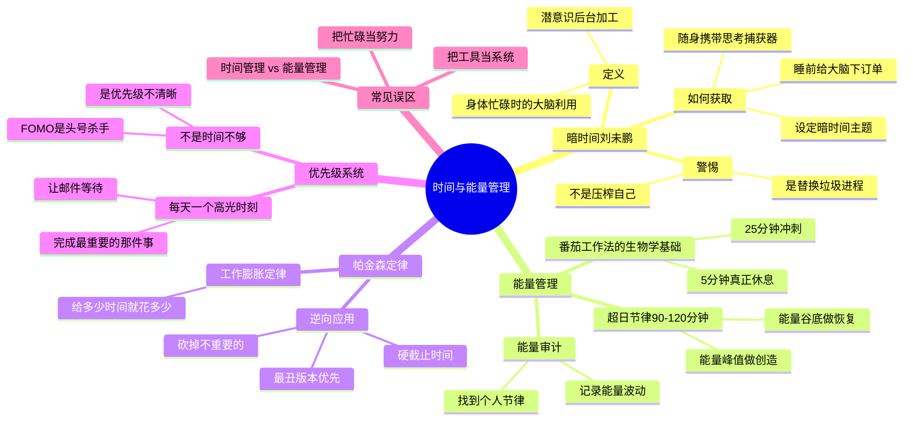

# Day 8：时间与能量管理——你不是没时间，你是没能量

> "没时间"是21世纪最大的谎言——你真正缺的不是时间，是注意力、是能量、是优先级。

---

## 🍅 36：悬疑开场——你每天有25个小时

让我给你讲一个关于时间错觉的故事。

作家尼尔·斯蒂芬森在写那本一千页的巨著《编码宝典》时，被问到："你怎么有时间写这么厚的书？"

他的回答极其凡尔赛："哦，很简单。我只需要每天花6-8小时写作，然后剩下的时间用来生活。"

——等等，这不就是"正常工作"吗？哪里凡尔赛了？

**凡尔赛的地方在于：** 绝大多数人每天6-8小时的"工作"里，真正有效的"产出时间"不到3小时。而斯蒂芬森——他每天6-8小时写作，**就是真的在写作**。没有刷社交媒体、没有回邮件、没有"我在思考所以我在沙发上躺了一个小时"。

这不是时间的问题。这是**注意力纯度**的问题。

刘未鹏在《暗时间》里提出了一个概念，如果你的大脑在2010年代曾经被冲击过，你一定还记得它——**暗时间**。

什么叫暗时间？

你每天走路、吃饭、洗澡、做家务、通勤——这些时间里，你的身体在忙，但你的大脑在"待机"。如果你能把大脑也利用起来——在走路的时候思考问题、在洗澡的时候推演逻辑、在做家务的时候构思文章——你就相当于**每天都比别人多出了几个小时**。

听起来像是"要你做更多"的压榨鸡汤？

**不。恰恰相反。**

刘未鹏真实的意思是：你的大脑从来没有真正"休息"过——它在你走路、洗澡、睡觉的时候都在后台运行。问题不是"你要不要利用这些时间"，问题是你**已经在利用这些时间了**——只不过你的大脑在这些时间里处理的是"刚才那条抖音"、"中午和同事的尴尬对话"、"明天穿什么"。

换句话说：你的暗时间已经被垃圾信息占用了。你想拿回来，不需要"更努力"——只需要"换一个后台进程"。

**这就引出了一个更深刻的真相：**

"时间管理"这个词本身就是谎言。时间不能被管理——一天24小时，对每个人都是固定的，总统、亿万富翁、流浪汉——大家都一样。你不可能"省出"时间，因为时间不是钱，它不能存储、不能借贷、不能预支。

**你能管理的只有两样东西：注意力和能量。**

这才是Day 8真正的主题。当我们说"我没时间"的时候，真实的意思是：
1. **"这件事在我的优先级里不够靠前。"**（优先级问题）
2. **"我现在没有精力/注意力去做这件事。"**（能量问题）
3. **"我对这件事有抗拒心理。"**（动机问题）

没有一个是真正的时间问题。

---

✅ **费曼三句话**
1. "没时间"是谎言。真相是：**你的注意力和能量是稀缺资源，时间不是。** 管理注意力而不是管理时间。
2. 我过去最爱说"没时间读书"——但我每天在通勤、吃饭、洗澡上花了至少2小时。那些时间我在刷手机——暗时间被浪费了，不是没有。
3. 我怀疑："利用暗时间"是不是另一种形式的焦虑？——永远不让自己"下线"，永远在思考。会不会有一天，"暗时间"这个概念本身就变成了压榨自己的工具？

❓ **悬疑追问**
如果你每天真的比你以为的多出2-3小时的"暗时间"——那这些时间现在去哪了？答案很残酷：它们被你"情绪反刍"和"信息过载"吃掉了。

📌 **连线笔记**
记录你明天从起床到睡觉的"暗时间"片段（通勤、吃饭、走路、洗澡、做家务）。在每个片段结束时，问自己：刚才那段时间，我的大脑在跑什么进程？是"有用思考"还是"垃圾循环"？

---

## 🍅 37：核心理论——能量是新的时间

### 理论一：你的电池容量不是无限的

传统的"时间管理"假设你每天24小时都是同样质量的——但这是错的。

你早上9点和晚上9点的"一小时"，在产出效率上相差可能**超过10倍**。

这就引出了《精力管理》的核心洞见：**你的能量是波动的，不是线性的。**

人类能量周期大约90-120分钟一个循环——这是"超日节律"（ultradian rhythm）。在这个周期里，你的专注力从高到低，再到高。所以最有效的不是"连续工作8小时"，而是**90分钟冲刺 + 20分钟恢复**的节奏。

**这就是番茄工作法的生物学基础**——25分钟工作 + 5分钟休息，不是西里洛随便拍脑袋想出来的，而是在模仿你大脑的自然节律（只不过切成更小、更容易控制的块）。

### 理论二：帕金森定律的逆向应用

英国历史学家帕金森在1955年提出了一个让人细思极恐的定律：

**"工作会自动膨胀，以填满分配给它的所有时间。"**

你给它两小时，它就花两小时。你给它两周，它就花两周。同一件事。

原因很微妙：不是因为你懒，而是因为"完美主义"+"安全感缺失"+"社会期望"的组合会让你不自觉地把工作拖到截止日期。

**逆向操作（这是《创造时间》的核心策略）：**

1. **给任务一个"不可能"的截止时间** — 不是让你996，而是逼你砍掉不重要的事
2. **每天选一个"高光时刻"（Highlight）** — 不是做更多，而是确保今天最重要的一件事被完成了
3. **把"看邮件"从第一优先级降级** — 邮件是别人的优先级，不是你的

### 理论三：极简时间的悖论

《极简时间》作者洛塔尔·赛韦特提出了一个反直觉的命题：

**"做更少的事，产生更大的影响。"**

这不是废话。他的逻辑是：我们之所以"没时间"，是因为我们试图做**所有**的事。而解决方法是——不是做得更快（那是竞赛，会累死），而是**选择不做**。

这听起来很简单。但真正做的时候，你会发现一个心理障碍：**"万一错过了呢？"**

- 万一会错过这家公司的重要更新呢？（取消订阅了）
- 万一会错过朋友们的精彩生活呢？（关掉朋友圈了）
- 万一会错过这个行业的重要新闻呢？（新闻聚合器删掉了）

**FOMO（Fear Of Missing Out）是时间管理的头号杀手。** 你越怕错过，你的时间越会被填满——填满的全是别人的优先级。

### 理论四：刘未鹏的暗时间系统

说回《暗时间》。刘未鹏给出的不是一个"时间管理技巧"，而是一套认知操作系统：

1. **任务切换的损耗是巨大的** — 每次从任务A切换到任务B，你的大脑需要10-15分钟来"热起来"。频繁切换意味着你的一天大部分时间都在"热身"
2. **让问题在后台运行** — 睡前把一个明确的难题放进大脑，第二天醒来经常有答案。这不是玄学，这是"潜意识加工"——趁你睡觉的时候，大脑在整理白天的碎片
3. **兴趣是最好的续航** — 真正的问题不是"怎么专注"，而是"怎么找到让你不想分心的事"

合在一起，这四套理论指向同一个结论：**你不是没时间——你是把时间花在了错误的事情上，然后用错误的方式去花剩下的时间。**

---

✅ **费曼三句话**
1. 能量管理比时间管理重要10倍：**你所有的时间不是等价的**，在能量高峰期的一小时，价值可能是低潮期的一小时的十倍。
2. 我以前是个时间管理工具控（GTD、番茄、日历块）——但越管越累，因为工具只解决了"安排"的问题，没解决"能量"和"优先级"的问题。
3. 我有一个不安的预感：即使知道了这些，我可能还是会回到"忙乱"的状态——因为"忙"给人一种道德上的优越感（"我好努力"），而"不忙但高效"看起来很可疑。

❓ **悬疑追问**
帕金森定律说"工作会膨胀到填满你给的时间"。那反过来：如果给工作一个极其紧张的截止时间，质量真的会下降吗？还是说——我们的"质量焦虑"也是一个自我安慰的借口？

📌 **连线笔记**
你最近有没有哪个"做了很久"的项目/任务？试着问自己：如果截止时间突然提前到明天，我会砍掉哪些部分？——那些被你砍掉的，可能就是原本不需要做的事。

---

## 🍅 38：实战案例——设计你的个人能量系统

理论说够了。现在我们来**建系统**。

### 第一步：能量审计（不是时间审计）

时间审计（"我昨天每分每秒做了什么"）是陷阱——它让你觉得自己不够高效，然后更焦虑。

能量审计完全相反：**记录你一天中"能量状态"的波动。**

连续三天，每两小时记录一次：
- **能量水平**（1-10分）：你是精神饱满还是只想趴着？
- **状态类型**（创造/执行/社交/恢复）：你在做什么类型的事？
- **分心指数**（1-10分）：你有多容易被干扰？

**一个真实案例**（来自《精力管理》中的一个高管案例）：

> 一位叫Roger的高管，每天早上第一件事是看邮件——然后陷入被动反应模式。午餐随便吃，下午3点崩溃，靠咖啡撑着开会。晚上回家累到不想和妻子说话。
>
> 能量审计后发现：他的能量高峰在上午10-12点——但他把这段时间全用在回邮件上（低价值、被动的工作）。他的下午低潮在3-4点——但他安排了最重要的战略会议（结果可想而知）。

**改变**：上午10-12点变成"创造时间"（写方案、做策略），下午3-4点变成"恢复时间"（散步、冥想、自由阅读）。早上第一件事不是看邮件——是完成今天最重要的一项工作。

**结果**：他每天的有效产出增加了约3倍——不是因为工作更久，而是因为**在正确的时间做正确的事**。

### 第二步：建造你的"暗时间管道"

刘未鹏的做法——不是靠意志力，而是**设计一个系统让它自动发生**：

1. **随身携带"思考捕获器"** — 一张纸、一个语音备忘录、一个空白Note。当你在走路/洗澡/通勤时冒出想法，立刻记下来
2. **设定"暗时间主题"** — 本周的暗时间都用来思考同一个问题（而不是随机飘荡）
3. **睡前"下订单"** — 睡前三分钟，明确地把你正在解决的难题"喂"给大脑，然后不再主动想它

### 第三步：帕金森定律的反向实践（来自《创造时间》）

**"如何用30分钟做完原本要3小时的事？"**

1. **设定"硬截止"** — 告诉一个人你会在30分钟后给他结果。不是威胁，是创造"人造紧急感"
2. **先做"最丑的版本"** — 不要试图第一次就完美。写出一个"丑到不好意思给别人看"的版本，然后迭代
3. **禁用所有的"完美主义缓冲"** — 那些你告诉自己"先查一下资料"、"先看看别人怎么做"的时间，几乎都是拖延的伪装

**关键心态转换：**

| 错误信念 | 正确信念 |
|----------|----------|
| "我必须找到最高效的方法才能开始" | "先做起来，效率会在过程中自现" |
| "我的时间不够" | "我的注意力不够集中" |
| "我需要更多工具" | "我需要更少的干扰" |
| "我应该做更多" | "我应该做更少，但更好" |

### 第四步：番茄工作法的"元应用"

你正在用番茄工作法学习番茄工作法——这是元学习的经典示范。但要注意：

番茄工作法真正的力量不是"25分钟计时"——它是**强制你进入能量-恢复循环**。如果你强行在能量耗尽时继续"番茄"，你其实在违反它的核心原理。

**高级用法：**
- 在能量高峰期用50分钟番茄（适合深度工作）
- 在能量低潮期用15分钟番茄（只做不需要动脑的事）
- 永远不要在休息时刷社交媒体（那不是休息，是让你的大脑更累）

---

✅ **费曼三句话**
1. 个人能量系统的核心不是"更努力"，而是**把对的事放在对的能量时段**——早上第一件事不是看邮件，是完成今天最重要的创造任务。
2. 我以前一直以为"时间管理"就是让自己更快——现在我知道了，真正有效的是"让自己在正确的时间做正确的事"。
3. 我怀疑：即使设计了完美的系统，我还是会忍不住在能量高峰期刷手机——不是因为系统不好，是因为"即时满足"的诱惑比"长期收益"更真实。

❓ **悬疑追问**
你的能量审计结果出来了——你发现你上午10点才是能量巅峰，但你每天上午9-10点都在开会/回邮件/被动响应。这个冲突怎么解决？答案不是"换个时间开会"——而是**重新定义你的工作价值单位**。

📌 **连线笔记**
现在就做三件事：（1）找出你明天最重要的一个"创造型任务"；（2）把它放在你明天能量最高的时段；（3）在之前和之后各留30分钟的"缓冲"（不做任何安排）。明天结束后，记录这个安排的效果。

---

## 🍅 39：🧠 思维导图 + 费曼大复习

### 🧠 思维导图

### 费曼大复习（30秒闭眼自述版）

"没时间"不是一个事实，是一个**选择**。你把你有限的注意力和能量花在哪里，哪里就是你的"时间"。

刘未鹏的暗时间让你意识到：你每天至少有2-3小时的"隐藏时间"——不是要你更努力，而是要你换掉后台运行的垃圾进程。

能量管理告诉你：你的所有时间不是等价的。在能量巅峰一小时 = 低潮期三小时。

帕金森定律告诉你：紧缩的时间反而会倒逼你砍掉不重要的东西。

到最后，**时间管理的终极秘密不是"你怎么填满24小时"，而是"你选择了不做什么"。**

---

✅ **费曼三句话**
1. 时间不能被管理，能被管理的只有优先级和能量。**"没时间"的真相是"这件事在我的优先级里排得不够靠前"。**
2. 我过去最常犯的错：在能量巅峰期做被动的工作（回邮件、开会），在能量低潮期强迫自己做创造工作——双重低效。
3. 我想到一个问题：如果"利用暗时间"本身就是一种焦虑的表现呢——我们是不是被"高效"这个暴君统治得太久了？

❓ **悬疑追问**
我们花了4个番茄研究怎么管好时间和能量。但还有一个更深的问题：**你拼命解决的"没时间"问题，会不会本身就是一个错误的问题？** 明天，细谷功的高维度思考法将带你从"解决问题"进化到"定义问题"——彻底改变你看问题的层次。

📌 **连线笔记**
今天你的"暗时间"里都跑了哪些后台进程？是"刚才那场会上的尴尬发言"、"明天穿什么"——还是"我正在学的这个方法论"？如果你有选择，你想把哪个进程加载到后台？

---

## 🍅 40：刻意练习——建造你的时间-能量操作系统

### 练习一：能量峰值审计（10分钟）

画出你典型一天的能量曲线。横轴是时间（6:00-24:00），纵轴是能量水平（1-10分）。

诚实标记：
📈 你的峰值时段（能量≥8）
📉 你的谷底时段（能量≤3）
🎯 你现在在每个时段做的事
🔄 应该做的事（与能量水平匹配）

**典型错误配置：**
- 创造力任务 → 放在下午低潮期 → ❌
- 琐碎任务（回邮件、填表）→ 放在上午巅峰期 → ❌
- 社交会议 → 放在午饭后（食困期）→ ❌（没人能在食困期做出好决策）

**正确配置：**
- 巅峰期 → 创造、战略、深度写作、编程
- 平稳期 → 协作、会议、讨论、阅读
- 低潮期 → 回复、整理、机械任务、学习（非创造型）

### 练习二：帕金森挑战（5分钟）

选一个你一直在拖延的任务。不是大项目——是一件30分钟内可以完成但你拖了一周的事（比如填那份表格、回复那个邮件、整理那个文件夹）。

**规则：** 设置一个15分钟计时器。在这15分钟内，用最粗糙的方式完成它。不准查资料、不准完美主义、不准"先做别的放松一下"。

结束之后问自己：如果一开始就知道15分钟能搞定，我会拖一周吗？

### 练习三：暗时间管道设计（10分钟）

设计你的"暗时间利用系统"：

1. **选择一个本周思考主题** — 一个你正在解决的问题或正在学的概念
2. **选择你的捕获工具** — 语音备忘录？口袋笔记本？手机备忘录？（一定要随时可用）
3. **设置触发场景** — 在以下每个场景中加入一个"思考提示"：
   - ☕ 洗漱时 → 思考："关于[主题]，我昨天的结论是什么？"
   - 🚶 走路/通勤时 → 思考："[主题]和我今天遇到的哪件事有关？"
   - 🛁 洗澡时 → 思考："[主题]如果用一个比喻来说是什么？"
   - 🌙 入睡前 → 思考："给大脑下单：明天醒来我希望对[主题]有什么新视角？"

### 练习四：跨界思考——"时间"这个概念本身（5分钟）

我们花了一天谈"时间管理"。但有没有想过——**"时间"本身是一个文化建构？**

- 古人没有"时间管理"的概念——日出而作，日落而息，按季节和节奏生活，不按小时和分钟
- 中世纪欧洲人一天只有"工作时间"和"祷告时间"——没有"高效产出"这种概念
- "浪费时间"的焦虑，其实是工业革命和清教伦理的产物——时间就是金钱

**所以问题变成了：** 你是在管理"时间"本身，还是被"时间管理"这个文化叙事管理了？

你的答案是什么？如果你真的相信"注意力比时间更重要"，那你现在还会因为"刷了30分钟手机"而焦虑吗？或者——你能接受"今天没有产出但过得很开心"也是一天的高光时刻吗？

---

✅ **费曼三句话**
1. 时间管理的终极形态不是"把所有时间填满"，而是**有选择地浪费时间和有策略地使用能量**——玩和吃同等重要。
2. 今天最大的反思：我一直在用"管理"这个工业词汇来对待我的生命节律——难怪会累。也许我需要的不再是"管理"，而是"设计"。
3. 我没有答案的终极问题：如果明天我突然拥有了无限时间（假如我永生），我还会觉得"没时间读书"吗？还是说，"有限"本身才是推动我行动的动力？

❓ **悬疑追问**
如果把"时间"这个框架彻底拆掉——真正限制你的不是"不够"，而是"看不见更高的维度"。明天是真正的升维之战：细谷功告诉你**解决问题的人永远被定义问题的人统治**。

📌 **连线笔记**
今天最后一个练习：写下你明天最重要的三个任务。然后——划掉最后两个。感受一下那种"放下"的不安感。明天只做一件事。把它做到极致。其他的一切，等做完再说。

---

**📚 本日参考：**
- [[书库/学习方法/暗时间]] — 刘未鹏的认知时间理论
- [[书库/学习方法/创造时间：专注于每天最重要的事]] — 高光时刻策略
- [[书库/学习方法/极简时间：如何从忙乱到时间自由]] — 做更少，影响更大
- [[书库/学习方法/番茄工作法]] — 注意力-恢复循环
- Jim Loehr & Tony Schwartz — 《The Power of Full Engagement》（精力管理）
- Parkinson, C. N. — 《Parkinson's Law》（帕金森定律）
