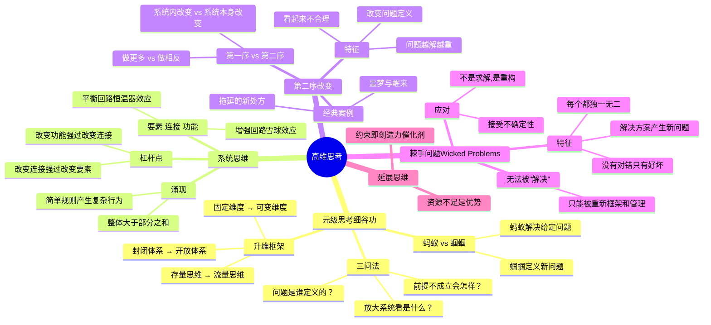

# Day 9：高维思考——从解决问题到定义问题

> 你拼命解决的问题，可能根本是错的问题——而"解决问题的人"永远被"定义问题的人"统治。

---

## 🍅 41：悬疑开场——蚂蚁的困境

细谷功在《高维度思考法》的开头讲了一个寓言：

有一条河。河的下游，每天都有人从上游漂下来，溺水呼救。下游的人很善良，每天拼命救——他们训练了最专业的救援队，研发了最快的救生艇，建立了高效的抢救流程。他们是"解决问题"的冠军。

但有一天，有一个人做了一个奇怪的决定：他不再参与救援，而是**走上游去看看到底是谁在把人推下水**。所有人都觉得他不务正业、没有同情心——"我们在救人命啊！你在干什么？"

但是那个"不务正业"的人发现：上游有一座桥，桥上的栏杆坏了，每天都有几个行人从缺口掉下去。他花了很少的钱修好了栏杆——从此，再也没有人从上游漂下来了。

**下游的救援英雄们失业了。但他们获得了一枚勋章："最伟大的问题解决者。"**

这个故事有无数个变体——但它指向同一个真相：**人类社会的奖励机制，严重偏向"解决问题"，而严重忽略"定义问题"。**

细谷功用"蚂蚁和蝈蝈"的比喻来放大这个差异：

- **蚂蚁型思维**：拼命收集食物（知识），走已知的路，解决已知的问题，勤奋而保守
- **蝈蝈型思维**：站在更高处看路在哪里，不急着搬东西，而是先问"我们是不是在搬正确的东西"

我们从小被教育要当蚂蚁——努力、勤奋、解决问题。但真正改变游戏规则的人——德鲁克、乔布斯、马斯克——他们都是蝈蝈。不是因为聪明，而是因为他们**花更多时间思考"什么问题是值得解决的"。**

让我们看一个真实世界版本的"修栏杆 vs 救溺水"：

**柯达的悲剧。**

柯达的工程师在1975年就发明了数码相机——世界第一台。他们的反应是什么？"这个东西很好，但不能让公司知道。"他们担心数码相机会杀死他们的胶片业务（当时柯达是胶片之王），于是**把这个发明藏了起来**。

柯达的问题是什么？表面上看是"数码相机技术威胁现有业务"——他们的问题是"怎么让胶片继续赚钱"。

但真正的问题是：**"如何在一个技术范式转移的时代保持公司的核心价值？"**

他们定义了错误的问题，所以得到了错误的答案——藏起来。乔布斯定义了正确的问题："如何让每个人口袋里都装一台数码相机？"——答案：iPhone。

**你不是没有问题，你是定义了错误的问题。**

这是高维思考的起点：**任何问题的答案，质量都不会超过你定义问题的水平。**

---

✅ **费曼三句话**
1. "解决问题"和"定义问题"是两回事：前者是在给定的框架里找答案，后者是**质疑框架本身是否对**。前者是蚂蚁，后者是蝈蝈。
2. 我过去所有的"职业努力"几乎全花在解决问题上——老板给什么题就解什么题。我很少停下来问：这个题本身对吗？
3. 我隐隐觉得，"定义问题"比"解决问题"难100倍不是没有原因的——因为定义问题意味着你要对现状说"不"，而且你没有任何现成的评价标准。

❓ **悬疑追问**
你当前最头疼的那个问题——你有没有想过，它可能不是"一个待解决的问题"，而是一个"待质疑的假设"？如果问题本身就是错的，答案再对又有什么用？

📌 **连线笔记**
写下你目前正在努力解决的三个问题。在每个问题后面加一个问号——把问题本身反过来问。比如"我怎么才能升职？" → "我为什么想升职？" → "升职解决了我的什么深层需求？"——不断追问，直到你触达一个更根本的问题。

---

## 🍅 42：核心理论——升维的四种武器

### 武器一：细谷功的"元级思考"

细谷功的核心框架可以用一个词概括：**升维**。

假设你在一个二维平面（比如一张纸）上走迷宫。你被困住了——四周都是墙。你怎么解决？作为二维生物——你可以往左、往右、往前、往后——但你永远出不去。

但如果你能**升到三维**——你直接从上面看，迷宫就变成了一个图案，出路一目了然。你甚至可以跨过那堵墙。

**升维思考的本质就是：当你在一个层面找不到答案时，不是死磕，而是跳到更高一个层面去重新定义问题。**

细谷功给出了三组转换工具：

| 从 | 到 | 说明 |
|----|----|------|
| **存量思维** | **流量思维** | 不要问"我有什么知识"；问"我的知识能流向哪里" |
| **封闭体系** | **开放体系** | 不要把问题限定在现有边界内；问"如果边界不存在呢" |
| **固定维度** | **可变维度** | 不在当前框架里找答案；跳出框架重新画一个 |

**实操方法：** 当你面对一个问题时，先问三个"元问题"：
1. "这个问题是谁定义的？他为什么这么定义？"
2. "如果这个问题的前提条件不成立，会发生什么？"
3. "这个问题放在更大的系统里看，是什么样子的？"

### 武器二：系统思维的反馈回路

如果说细谷功教你"升维"，系统思维教你**在升维之后看什么**。

丹尼斯·梅多斯（《系统之美》）说：系统由三样东西构成——**要素、连接、功能**。大部分人在"要素"层面解决问题（换一个人、加一个部门、买一个工具）——但真正的杠杆点在"连接"和"功能"层面。

**两种关键反馈回路：**

1. **增强回路（Reinforcing Loop）** — 雪球效应：越多越快
   - 例：社交媒体上粉丝越多 → 曝光越多 → 粉丝越多 → 曝光越多……
   - 陷阱：失控增长

2. **平衡回路（Balancing Loop）** — 恒温器效应：偏离了拉回来
   - 例：口渴 → 喝水 → 不渴了
   - 陷阱：刚性不变

**涌现（Emergence）：** 这是系统思维最迷人的概念。简单规则在互动中会产生复杂行为，而这种行为无法通过分析单个要素来预测。

**一只蚂蚁的行为很简单。一千只蚂蚁组成的蚁群——可以建造复杂的巢穴、种植真菌、搭建桥梁。没有任何一只蚂蚁"指挥"了这个过程。这就是涌现。**

人类的大脑也是涌现的产物——单个神经元只是放电或不放电，但86亿个神经元互动产生了意识。你不能通过研究一个神经元来理解意识。

**意义：** 你以为你在"独立做决策"——但你其实是"众多系统（家庭、公司、社会、文化）涌现出来的行为"。高维思考就是意识到这些系统的存在，然后选择——是在系统里优化，还是改变系统本身。

### 武器三：第二序改变——改变"改变的方式"

保罗·瓦茨拉维克（Paul Watzlawick）的《改变：问题形成与解决的原则》提出了一个精妙的框架：

- **第一序改变**：在系统内的改变。比如你做噩梦了，在梦里逃跑。
- **第二序改变**：改变系统本身。比如——**从噩梦中醒来。**

大部分人的"改变"都是第一序：在这家公司不开心 → 换一家公司（但是一样的行业、一样的岗位、一样的工作模式）。这不是改变，这是**更换背景但不更换剧本**。

第二序改变的特征：
1. 它看起来是"不合理的"（因为它在挑战系统的默认规则）
2. 它通常要求你**做相反的事**（而不是更努力地做同一件事）
3. 它改变的是"问题本身被定义的方式"

**李松蔚在《5%的改变》里讲了一个精彩案例：** 一个来访者因为"拖延"来求助——她试过所有"解决拖延"的方法（番茄钟、奖励机制、时间规划）都没用。李松蔚的建议是：**"请你每天专门花30分钟来拖延——不工作、不学习、什么都不做，就坐那里刻意拖延。"**

结果？来访者的"拖延"消失了。为什么？因为"拖延"的定义是"该做A时做了B"——但当"拖延"成了她"该做的事"，她就没法拖延了。**通过重新定义问题，问题本身消失了。**

这就是第二序改变的精髓：**有些问题，你越解决越严重；你停下"解决"，问题反而消失了。**

### 武器四：驯服"wicked problems"

霍斯特·里特尔（Horst Rittel）在1973年提出了一类特殊的问题——**Wicked Problems**（棘手问题）。它们和"温顺问题"（Tame Problems）完全相反：

| 温顺问题 | 棘手问题 |
|----------|----------|
| 可以明确定义 | 每定义一次就变一次 |
| 有确定答案 | 没有"对错"，只有"更好/更差" |
| 解决方法可验证 | 每次解决都是"一次性"的 |
| 类似问题可复用经验 | 每个棘手问题都是独特的 |
| 有明确终点 | 解决方案本身就是新的问题 |

**气候变化、贫困、教育改革、公司文化转型、你的职业生涯——全是wicked problems。**

为什么"解决问题"的思维面对wicked problems会失败？因为这类问题不能被"解决"——**它们只能被"重新框架"和管理**。

---

✅ **费曼三句话**
1. 四把升维武器：**元级思考（跳出框架）、系统思维（看反馈回路）、第二序改变（改变改变的方式）、定义wicked problems（接受有些问题不能被解决）。**
2. 以前我遇到困难时的本能是"更努力"（第一序改变）——现在我学会先问：这个问题所在的系统是什么？有没有可能我不是要改变系统内的变量，而是要换一个系统？
3. 我最大的怀疑：我现在学"高维思考"，本身是不是也在一个"认知消费"的循环里？——学了很多框架但从不真正用，这属于第几序改变？

❓ **悬疑追问**
"第二序改变"最有意思的地方在于：当你试图改变一个系统时，你其实也是系统的一部分。那"如何跳出系统"这个动作本身——是不是也受系统规则的限制？这是不是意味着——你需要第三序改变？第四序？

📌 **连线笔记**
识别你生活中一个"越解决越严重"的问题。比如越想早睡越睡不着、越想省越花得多、越想控制团队越失控。试着问：如果我停止"解决"它，会发生什么？

---

## 🍅 43：实战案例——重新定义你的问题

### 案例一：把"工作效率低"变成"系统设计不良"

**原始问题：** "我工作效率太低了，怎么才能更高效？"

这是典型的"第一序改变"式问题——在现有游戏规则里优化自己。

**升维分析：**

**步骤一：元级思考**
- 谁定义了"效率"？你的老板？行业的隐性标准？还是你自己？
- "效率低"的前提是有一个"正常的效率标准"——这个标准合理吗？
- 如果你在"效率低"的状态下完成了真正重要的事——那你是真的"低效"吗？

**步骤二：系统思维**
- 你的"效率"是哪些系统的输出？睡眠质量？工作环境？任务设计？工具选择？
- 有没有增强回路在让你越来越低效？（比如：效率低 → 加班 → 更累 → 效率更低 → 更长加班……这是一个死亡螺旋）

**步骤三：第二序改变**
- 尝试完全相反的：不是"怎么更高效"——而是"怎么在更少时间里完成同样的产出"？
- 或者更激进：不是"完成更多"——而是"重新定义什么算'完成'"？

**重新定义后的问题：** "我当前的系统（睡眠+工作设计+工具）是如何阻碍我产生有价值产出的？我需要改变哪些连接，而不是改变哪个要素？"

### 案例二：从"我怎么才能找到更好的工作"到"我想过什么样的生活"

**原始问题：** "我要怎么找到更好的工作？"

这看起来很正常。但高维思考会问：

1. "好的工作"是谁定义的？（薪资？title？公司品牌？——这些是你真的在意的吗？）
2. "找工作"这个框架本身的假设是什么？（一个"工作"是你生活的中心？你的身份由你的职业定义？）
3. 如果跳出"打工"这个框架呢？（创造收入的方式只有"找一份工作"这一种吗？）

**再定义后的根本问题：** "我想用我的时间、技能和注意力，创造什么样的价值和生活方式？"

### 案例三：团队冲突的升维解法（系统思维实战）

**症状：** 市场部和产品部天天吵架。

**第一序解法：** 开更多会、明确分工、制定流程——这就像两个在打架的人，你给他们画了一条线说"你们站在线两边打"。

**第二序解法（来自系统思维）：**

1. 画出系统图：
   - 市场部需要"新功能"来吸引客户 → 给产品部提需求 → 产品部被压垮 → 交付慢 → 市场部不满 → 更频繁地提需求……
   - 这是一个**增强回路**——正反馈互相激化

2. 找到杠杆点：
   - 不是加人或加压（改变要素）——而是**改变连接**：比如取消"月度需求会"，改为"季度策略对齐会"，让市场部理解产品 roadmap 的约束
   - 或者改变功能（系统的目的）：从"交付功能数量"改为"客户问题解决率"

3. 问题重定义：
   - 原问题："市场部和产品部沟通不畅"
   - 重新定义："我们没有一个共同的衡量成功的指标——'帮客户解决真问题'"

**结果：** 冲突从"你们vs我们"变成了"我们一起vs客户的问题"——框架变了，问题就不是问题了。

### 案例四：延展思维——拥抱约束

《延展》这本书提出了一个反直觉的命题：**资源不足不是劣势，而是创造力的催化剂。**

当你有无限的预算、无限的人手、无限的时间——你不会变得更创新，你只会变得更浪费。真正的创新往往诞生在"必须用现有的东西搞定"的约束里。

**个人应用：**
- "我没时间学习" → "我每天有2小时暗时间可以用来思考"
- "我没钱做这个项目" → "我有什么免费资源可以重组？"
- "我没有XX技能" → "我怎么用现有技能的组合来靠近目标？"

---

✅ **费曼三句话**
1. 解决一个问题的最高效方法不是"更努力"——而是**重新定义问题本身**。优秀的定义能让问题自己消失。
2. 我以前面对冲突时本能反应是"怎么解决这个冲突"——现在我学会先画系统图，看看冲突是不是系统结构本身的产物。如果是，解决冲突的最好方法可能是改变结构，而不是调解双方。
3. 我还在思考：重新定义问题是一种特权——不是每个人都有权力说"我不解决这个问题，我重新定义它"。如果你在组织底层，定义问题的权力不在你手上。那怎么办？

❓ **悬疑追问**
如果你真的养成了"先定义问题，再解决问题"的习惯，你会发现一个更恐怖的真相：**大部分"问题"之所以存在，是因为某个系统需要它存在。** 你的"拖延"可能是在保护你免于失败。你团队的"内耗"可能是在维持某种权力平衡。如果这是真的——你还敢"解决问题"吗？

📌 **连线笔记**
这是今天最重要的一步：选一个你最近在纠结的问题。用今天的四种武器（元级思考、系统思维、第二序改变、延展）重新定义它。写下来。比较旧定义和新定义的差异——你更愿意解决哪个？

---

## 🍅 44：🧠 思维导图 + 费曼大复习

### 🧠 思维导图

### 费曼大复习（30秒闭眼自述版）

高维思考不是一种"技术"，它是一种**意识层面的转换**——你永远可以选择不在别人给你画好的棋盘上下棋。

细谷功的元级思考让你看见：问题本身不是天然的——它是被某个"框架"定义出来的。换一个框架，问题就变了。

系统思维让你看见：问题的结构比问题的要素更重要。想改变一个系统，不要换零件，要改反馈回路。

第二序改变让你看见：有些问题不能"更努力地解决"——你越用力，系统越稳固。有时候，停下来做相反的事，才是出路。

最后：**Wicked problems 不能被解决——它们只能被度过、被管理、被重新框架。** 接受这一点，本身就是一种升维。

---

✅ **费曼三句话**
1. 高维思考不是"更多的解决方案"，而是**更高层次的问法**——同一个事实，在两个不同的框架里是完全不同的"问题"。
2. 我过去一直在练"解决问题的能力"，现在想想——就像练了一辈子举重，但从来没人告诉我举的那个东西可能根本不需要举。
3. 我没有答案的事：如果每个人都在升维思考、重新定义问题——那谁来解决问题呢？这是一个"元问题"——或者换个角度看，也许"解决问题"本身就是一个wicked problem。

❓ **悬疑追问**
今天我们学到了："定义问题"比"解决问题"更高级。但你有没有发现一个悖论——**你花了一整天"学习"如何思考，而不是"真正"思考。** 明天开始，我们将进入Day 10：阅读与信息处理——如何建立一个让你每年读100本书的输入系统。在那之前，先问自己：你是在阅读，还是在"完成阅读"这个任务？

📌 **连线笔记**
回到你今天第41个番茄开始前写下的三个问题。现在你有了四种武器——重新审视它们。哪个问题其实是"错误的问题"？哪个问题是一个裹着"问题"外衣的假设？如果你只能重新定义其中一个——你选哪个？

---

## 🍅 45：刻意练习——升维实验室

### 练习一：问题重定义工坊（10分钟）

选择你当前职业生涯中最棘手的一个问题。填写下表：

**原始问题陈述：**

> _______________

**升维工具拆解：**

1. **元级思考**
   - 这个问题是谁定义的？_______
   - 他的立场和利益是什么？_______
   - 如果这个问题的假设前提不成立，会怎样？_______

2. **系统思考**
   - 画出这个问题的系统结构——哪些要素在互动？_______
   - 关键的反馈回路是什么？（增强还是平衡？）_______
   - 杠杆点在哪里？_______

3. **第二序改变**
   - 你在这个问题上一直在做什么（第一序）？_______
   - 如果要做"相反的事"，会是什么？_______
   - "停止解决"这个问题的后果是什么？_______

4. **延展思维**
   - 你觉得缺什么资源？_______
   - 如果这些资源永远不会来，你现有的资源里有什么可以重新组合？_______

**重新定义后的问题：**

> _______________

### 练习二：识别你的"温顺问题"与"棘手问题"（5分钟）

把你现在面对的所有问题分成两类：

| 温顺问题（可以被解决） | 棘手问题（只能被管理） |
|------------------------|------------------------|
| 例：这个月的报表怎么做 | 例：公司的文化转型 |
| 1. _______________ | 1. _______________ |
| 2. _______________ | 2. _______________ |
| 3. _______________ | 3. _______________ |

**检查清单：**
- 你是否在把"棘手问题"当"温顺问题"处理？（这是最常见的错误）
- 你是否在"解决"一个无法被解决的问题——并因为"解决不了"而自责？
- 如果接受"这个问题只能被管理，不能被解决"——你的心态和策略会怎么变？

### 练习三：5%的改变实验（5分钟）

从李松蔚的《5%的改变》中拿一个核心原则：**不要试图改变100%，只改变5%。**

选一个你今天识别出的问题。设计一个"5%改变"实验——一件事，如果你去做，不会改变你的整个生活/工作节奏，但会轻微地调整一下系统的某个参数。

**格式：**
- 问题：_______
- 过去做法：_______（第一序）
- 5%改变实验：_______（一个轻量级的第二序扰动）
- 执行时间：_______（明天或这周内）
- 观察指标：_______（你期待什么反应？）

**例子：**
- 问题：团队会议总是超时
- 过去做法：更严格地控制议程
- 5%改变实验：下次会议**不设议程**，只说"每人用3分钟告诉我一件这周最有趣的事"
- 观察指标：会议会不会反而更短？大家会不会说出比"议程更正式"的发言更有价值的内容？

### 练习四：跨界思考——从"解决问题"到"过好生活"（5分钟）

这是我们Day 9的最后一个练习，也是整个"高维思考"主题的终极追问：

你用"解决问题"的思维过了多少年人生？"考上好大学"→"找到好工作"→"升职"→"买房"→"结婚"→"生娃"→"孩子上好大学"→……

**这是"人生"还是一个"待解决问题的列表"？**

如果把"人生"定义成一个wicked problem——它不能被"解决"，只能被"经历"——你对现在的感受会有什么不同？

如果你今天不是在"解决问题"，而是在"体验问题"——你的焦虑会不会少一点？你的好奇心会不会多一点？

**细谷功在书里没有明说、但藏在字里行间的真相可能是：** 人类之所以执着于"解决问题"，是因为解决一个问题能给我们带来"掌控感"——我们讨厌不确定性，喜欢"搞定了"的快感。但真正重要的东西（幸福、意义、爱、创造力）——它们不是"问题"，不能被"解决"，只能被"活出来"。

**这可能就是高维思考的终极形态：从"解决"到"经历"，从"掌控"到"信任"，从"蚂蚁"到"蝈蝈"——不是不做蚂蚁，而是知道什么时候该做蚂蚁，什么时候该做蝈蝈。**

---

✅ **费曼三句话**
1. 今天的终极领悟：**如果人生本身就是一个wicked problem——那它不能被"解决"，只能被"经历"。** 你"过得好不好"不取决于你解决了多少问题，而取决于你定义了什么问题。
2. 我过去把人生当成一个巨大的任务清单——"解决一个，下一个"。现在我更想把它当成一个"待体验的系统"——问题不是要被消灭的敌人，而是系统给我发出的信号。
3. 我最后想问：如果"高维思考"本身就是一种元技能——那学习元技能有没有"元元"方法？还是说，思考的尽头不是技能，是态度——是一种对不确定性乃至荒谬感的拥抱和幽默感？

❓ **悬疑追问**
Day 9结束了。你花了9个番茄学"高维思考"——但你有没有想过，你把"学习"本身定义成了"看书+记笔记+写感悟"？如果重新定义"学习"本身会怎样？明天，Day 10：阅读与信息处理——我们拆了"读书"这件事，告诉你为什么"读得快"根本不重要。

📌 **连线笔记**
回顾今天的5个番茄——你在"学习方法60番茄"的旅程已经过半。在笔记本上写下你到目前为止最大的三个认知转变。当整个课程结束时，再回来看——你可能会发现，最大的转变不在Day 9，而在你把所有碎片拼成系统的那一刻。

---

**📚 本日参考：**
- [[书库/学习方法/高维度思考法：如何从解决问题进化到发现问题]] — 细谷功的元级思维
- [[书库/思维&行动方法论/5%的改变]] — 李松蔚的第二序改变实验
- [[书库/思维&行动方法论/延展：释放有限资源的无限潜能]] — 约束即创造力
- Donella Meadows — 《Thinking in Systems: A Primer》（系统之美）
- Paul Watzlawick — 《Change: Principles of Problem Formation and Problem Resolution》（改变：问题形成与解决的原则）
- Horst Rittel & Melvin Webber — "Dilemmas in a General Theory of Planning"（wicked problems 的原始论文）
