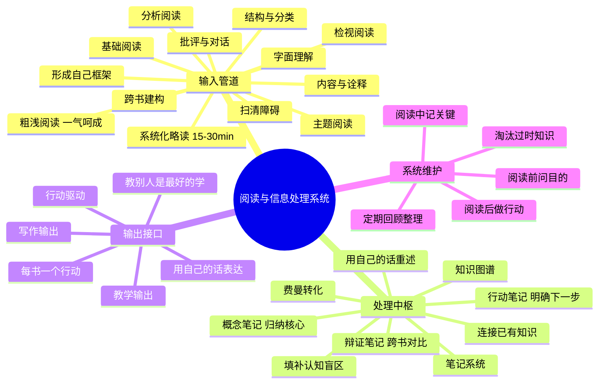

# Day 10：阅读与信息处理——每年100本书的输入系统

> 你读了那么多书，为什么还是过不好这一生？因为你的阅读系统是漏的。

---

## 🍅 46: 读书焦虑症候群——你不是读得少，你是读得"没系统"

你书架上有多少本只看了一半的书？Kindle 里积灰的"买了等于读了"的有多少？每年年初立下"读100本书"的 flag 然后在3月就默默改成"精读12本"——结果12本也没读完？

恭喜你，你患上了**信息时代的阅读焦虑症**。这不是你的错——这是你还在用农耕时代的阅读方法应对信息工业时代的输入量。

**问题不在你，在你的工具包只有一把锤子。**

大多数人从小到大只被教过一种阅读方法——**从头到尾，逐字逐句**。小学语文老师教的朗读法，到了大学应付专业课勉强够用，到了工作之后……你试试用这种方法读100本商业书？你连10本都读不完。

Mortimer Adler 在1940年就戳破了这个幻象。他在《如何阅读一本书》里说了一句石破天惊的话：

> 大多数人在阅读上犯的最大的错误是——**他们用读小说的方式去读所有书。**

你以为阅读是一个单一技能？不，Adler说阅读有**四个层次**。不是四个级别——是四个层次，每一个更高的层次包含并超越前一个。

- **第一层：基础阅读（Elementary Reading）** ——识字就行，"这个句子在说什么？"
- **第二层：检视阅读（Inspectional Reading）** ——快速翻阅，"这本书在整体上说什么？"
- **第三层：分析阅读（Analytical Reading）** ——精读咀嚼，"这本书说得对吗？我同意吗？"
- **第四层：主题阅读（Syntopical Reading）** ——读一堆书，"关于这个主题，这些书各自说了什么？我该怎么建构自己的理解？"

大多数人一辈子卡在第一层和第二层之间。少数人偶尔进入第三层。而第四层——这才是读书高手的秘密武器。

举个让你瞬间理解的例子：你要写一篇关于"人类注意力衰退"的文章。普通人会：找一本叫《注意力危机》的书 → 从头读到尾 → 摘录笔记。主题阅读者的做法是：列出20本相关书（心理学、神经科学、社会学、科技评论）→ 快速检视每本与主题相关的章节 → 跨书对比 → 形成自己的分析框架。

**前者在"读书"，后者在"用书"。你选哪个？**

但Adler只是起点。他老人家写书的时候，还没见过互联网。20世纪90年代，Paul Scheele提出了一个让你下巴掉下来的方法——**10倍速影像阅读法（Photoreading）**。核心不是让你读得更快，而是让你用潜意识"拍照"整本书，然后再有意识地激活。

听起来玄学？其实背后有认知科学的影子：**你大脑的潜意识处理速度远快于意识层面的逐字阅读**。影像阅读法只不过把这个事实用在了阅读上。

当然，你不是真的要用"拍照"代替阅读。但它的核心提示很重要：**你的大脑比你想象的能处理更多信息——前提是你要给它正确的指令。**

这就是我们今天要拆解的东西：**一套完整的输入→处理→输出系统。** 不是教你"怎么读得快"，而是教你"怎么建立一个不漏的阅读管道"。

> 这不是技巧课。这是一次阅读操作系统的手术。

---

✅ **费曼三句话**
1. 大多数人的阅读问题不是"读得慢"，而是"只用一把锤子处理所有钉子"——Adler的四个阅读层次给了你一套完整的工具箱。
2. 我过去读书要么从头到尾啃（累死），要么只看目录（漏掉精华），从来没有在"检视"和"分析"之间灵活切换的意识。
3. 我在想：影像阅读法的"潜意识处理"能否和Adler的检视阅读结合成一套Personal SOP？

❓ **悬疑追问**：你过去一年读的书，如果让你只能带走其中三本的精华，你能立刻说出来是哪三本、它们分别改变了你对什么问题的看法吗？如果说不出来——你读的真的是"书"还是"文字"？

📌 **连线笔记**：回想你上次读完一本书后一个月，你还能记得多少？试着用Adler的理论分析：你当时用的是第几层阅读？如果换成"检视+主题"的组合，效果会不会完全不同？

---

## 🍅 47: 四层阅读——从"识字"到"与作者对话"

现在我们来仔细拆解Adler的四个层次。注意，这不是一个"循序渐进"的线性模型——这是你**根据书籍类型和阅读目的，灵活切换的操作模式**。

### 第一层：基础阅读（Elementary Reading）

这就是你小学学的：认字、理解句子、跟上段落的意思。大多数人高中毕业后就永远停留在这个水平——别笑，你问问自己：读一篇陌生的专业论文，你能轻松地"理解每个句子在说什么"吗？如果不能，你连这第一层都没完全过关。

**用时：** 取决于你的词汇量和领域熟悉度
**适用场景：** 读全新领域的教材、看外文文献
**核心动作：** 扫清词汇障碍，确保字面理解

### 第二层：检视阅读（Inspectional Reading）

这是被大多数人严重低估的一层。**检视阅读的本质是"在有限时间内获取一本书的全景图"**。

两个子类型：

1. **系统化略读（Systematic Skimming）：** 花15-30分钟快速翻阅一本书——看封面、目录、索引、每章开头结尾。核心问题："这本书在整体上说什么？"

2. **粗浅阅读（Superficial Reading）：** 第一遍阅读时，不要停下来查词、不要纠结细节——一口气读完。**先求通盘了解，再求深入理解。**

Adler的原话值得刻在书桌上：

> "第一次读一本难书的时候，不要停下来查单词、不要查资料、不要读注释——先一口气读完。你会在第二遍的时候理解第一遍没懂的地方。"

这一句话就能解决你80%的阅读拖延症：**你读不完一本书，不是因为它难，是你对自己期待太高——你要求自己第一遍就读懂所有东西。**

要命的是，你不需要"读懂所有东西"。第一次读，你只需要知道"这本书在说什么"就够了。细节？那是第三层的事。

### 第三层：分析阅读（Analytical Reading）

这是真正的"精读"。Adler给出了一个堪称完美的结构——15个规则，分四个阶段：

**阶段一：找出一本书在谈什么（结构与规划）**
1. 对书籍进行分类（是实用类还是理论类？）
2. 用最简短的句子说出整本书在说什么
3. 列出全书的大纲（主要部分和顺序）
4. 找出作者要解决的问题

**阶段二：诠释一本书的内容（内容与信息）**
5. 找出全书的关键词（与作者达成共识）
6. 找出关键句子（抓住作者的核心判断）
7. 找出作者的论述（这些句子如何组成论证）
8. 找出作者的解答（哪些问题解决了？哪些没解决？）

**阶段三：评论一本书（批评与对话）**
9. 不要急着说"我不同意"——先确保你真正理解了
10. 当你不同意时，要有理有据
11. 尊重知识与个人观点的区别

**阶段四：形成自己的判断**
12-15. 综合前面所有分析，形成对这本书对你个人的价值和局限的判断

听起来很繁复？对。但这不是每本书都需要做的。Adler明确指出：**每年只有极少数值得分析阅读的书**。大多数书——检视阅读就够了。

**你需要判断的，正是"哪些书值得我的分析阅读时间"。这也是一种能力。**

### 第四层：主题阅读（Syntopical Reading）

这是阅读的终极形态。不是读一本书，而是**围绕一个主题建构你自己的知识体系**。

五个步骤：
1. **找到相关书目**（利用书目、索引、专家推荐——不是豆瓣评分TOP100）
2. **检视所有书**（确定哪些书与你的主题真正相关）
3. **厘清主题术语**（不同作者用不同词说同一件事——你需要统一翻译）
4. **建立议题清单**（这些作者之间存在哪些根本分歧？）
5. **分析讨论**（不是"A这样说B那样说"——而是"基于这些分歧，我的判断是什么"）

**主题阅读的终极产出不是"读书笔记"——是你自己关于这个主题的理论框架。**

如果你只做一次主题阅读，做哪个主题？我建议：**学习方法论本身**。你正在做的这件事——把各种学习方法整合成自己的操作系统——本质上就是一次关于"如何学习"的主题阅读。

---

✅ **费曼三句话**
1. Adler的四层阅读本质上是一套"根据目的切换阅读深度"的操作系统：大多数书只配得上检视阅读，极少数值得分析阅读，而主题阅读是你从"消费者"变成"生产者"的转折点。
2. 我过去犯的致命错误是：把每本书都当分析阅读来读——结果是精读了三五本，但对整个领域的全景一无所知。应该反过来：大量检视 + 少量精读。
3. 我在想：如果我用主题阅读的方法重新学习一个领域（比如"认知科学"），把10-20本核心书的检视笔记作为原材料，我能多快形成自己的理解框架？

❓ **悬疑追问**：你有没有想过——"精读一本书"本身就是一种认知偏见？你把所有精力花在一本书上，可能错过了一个领域真正重要的三本。问题来了：你凭什么认为你精读的那一本恰好是"对的那本"？

📌 **连线笔记**：想想你最近精读的一本书。如果用Adler的分类：这本书属于实用类还是理论类？你的阅读目的是了解还是应用？如果答案是"了解"，检视阅读可能就够了——你多花的时间全部是沉没成本。

---

## 🍅 48: 从"读书"到"用书"——信息输入管道的血泪案例

让我们看三个案例。每个案例代表一种阅读系统的崩溃方式。

### 案例一：王磊的"一年100本"陷阱

王磊是一位35岁的产品经理。2025年他立下flag：一年读100本书。他的方法很"励志"：每天通勤两小时听书，周末半天刷书，每月去一次书店扫货。年底复盘——他确实"读"完了107本。

问题来了：你问他"《思考，快与慢》讲了什么？"他说"系统1和系统2"。再问"那你能举个例子说明你什么时候用了系统1导致判断失误吗？"他沉默。

王磊的100本，本质上只是**100个标题+100个核心概念**。他记住了知识点，但没有形成知识结构。他的阅读系统的问题：**只有输入，没有加工和输出。**

他读的是"文字"，不是"思想"。

### 案例二：Linda的"精读主义"陷阱

Linda是咨询顾问。她恰好是王磊的反面：她极度厌恶"刷书"，认为读书必须精读。一年下来，她精读了8本书——每本都有详细的思维导图和笔记。

但她的问题同样致命：她的8本书互相之间没有对话。她读《金字塔原理》的时候没有联想到《思考，快与慢》——虽然两本书都在讲"人类思维的局限性"，只是角度不同。

她的笔记是一堆**孤立的岛屿**，没有桥。

Linda的阅读系统的问题：**精细度过高，但视野太窄。** 她对每本书的理解都很深，但她对"思维方式"这个领域的理解是碎片化的。

### 案例三：老张的"一切阅读皆为行动"系统

老张是36岁的创业者。他有一套极其朴素的方法：**每读完一本书，必须做一件具体的事。**

读《影响力》→ 在电商产品里加了三个"互惠原则"设计。读《故事力》→ 改了公司官网的"关于我们"。读《刻意练习》→ 建立了团队的"每日复盘十分钟"制度。

他的"阅读完成率"并不高——去年只"读完"了12本，但他说每本都值回了书价的1000倍。他用的就是Adler的**主题阅读**——不过是降维版：他围绕自己当下的业务问题，挑选3-5本书，快速提取每个书中有用的行动方案，然后——行动。

他的阅读系统看起来不像"阅读系统"——更像"学习输入+商业决策系统"。但他恰好做了大多数人做不到的事：**让阅读改变行为。**

### 你的阅读系统诊断

这三个案例反映了阅读系统崩溃的三种典型模式：

| 模式 | 症状 | 病因 | 解药 |
|:-----|:-----|:-----|:-----|
| **囤积型** | 量很大，记不住 | 只有输入，没有转化 | 加入输出环节：每本书写3句话 |
| **精读型** | 质很深，连不上 | 没有跨书连接 | 引入主题阅读：围绕主题读而不是一本书 |
| **被动型** | 读了很多，什么都没变 | 阅读和行为分离 | 阅读前先问"我读这本书要改变什么行动" |

你是哪一种？或者更准确地说——你**同时**是哪几种？

---

✅ **费曼三句话**
1. 阅读系统的三个致命崩溃模式：囤积型（只输入不加工）、精读型（只深入不链接）、被动型（只读书不行动）——大多数人不是其中一个，而是三个的排列组合。
2. 我自己是精读型+被动型的杂交体：喜欢把书读得很细，但读完就忘，因为从来没在行为层面做任何改变。
3. 我在想：如果我在开始读任何一本书之前，先写一句话——"读完这本书我要做一件什么事"——我的阅读ROI会不会直接翻倍？

❓ **悬疑追问**：你上次读完一本书后48小时内采取了具体行动，是什么时候？如果是"好几年前"——你读的书到底是给你增加力量，还是给你提供"我在进步"的幻觉？

📌 **连线笔记**：打开你最近读的一本书的笔记。你现在能不能立刻写出一句"基于这本书，我下周要做的一件事"？如果你写不出来——那本书你根本没读完。不是"没读完最后一页"——是没完成阅读最核心的动作：**转化为行动**。

---

## 🍅 49: 构建你的阅读操作系统——信息输入闭环

现在我们来做一个系统性的梳理和复盘。

### 🧠 思维导图：阅读与信息处理系统

### 如何避免"读了一堆书还是没用"的终极方案

先来看一个残酷的数据（来自《学习的学问》）：

> 大多数人在学习上的投入产出比是 100:1——100个小时的输入（读书、听课），只能转化出1个小时的有效输出（写作、决策、行动）。

不是因为你笨。是因为你把所有时间都花在"输入"这个环节了。

真正的学习闭环是：**输入 → 处理 → 输出 → 反馈 → 调整输入。**

大多数人只做了第一步。然后抱怨"我读了这么多书怎么没用"——废话，你把原材料堆在仓库里不加工，它能自己变成利润吗？

### 知识管理的"三桶水"模型

来自《精进》采铜的隐喻——但被我无耻地改造了一下：

- **第一桶：输入桶** ——你接触到的所有信息（书、文章、播客、课程）。关键指标：**广度**。但光有广度是灾难——信息过载的根源就在这儿。

- **第二桶：处理桶** ——你真正"消化"了的信息。关键指标：**深度**。处理桶的核心动作：费曼三句话 + 跨书连接 + 批判性质疑。

- **第三桶：输出桶** ——你产出的作品、决策、行动。关键指标：**转化率**。这是整个系统的唯一有效产出。

**三个桶必须同时运作。** 任何一桶满了其他桶空了——你就是那个"懂很多但做不了"的人。

### 实操方案：70-20-10 阅读配比

这是我自己编的，但不妨碍它好用：

- **70% 实用阅读**：围绕你当下最需要解决的问题选书。目的：**直接指导行动**。
- **20% 拓展阅读**：与当前问题相邻的领域。目的：**提供跨界视角**。
- **10% 经典阅读**：那些穿越时间的作品。目的：**建立思维深度和审美基准**。

别小看那10%——正是这10%让前面90%有了根基。没有经典的阅读体系就像没有地基的大楼——看着高，风一吹就倒。

---

✅ **费曼三句话**
1. 阅读系统本质上是一个"输入→处理→输出"的闭环管道，三个环节缺一不可——大多数人只做输入，然后用"我很努力"来安慰自己。
2. 我过去的阅读系统是一个只有进水口没有出水口的水池——水越积越多（信息过载），但水体是死水（没有转化）。需要同时打开处理阀和输出阀。
3. 我在想：70-20-10的比例对我是不是合理？我现在的问题是"处理"环节太弱——我应该把阅读速度降下来，把处理深度提上去。

❓ **悬疑追问**：你的三桶水——输入桶、处理桶、输出桶——哪个桶满了哪个桶是空的？如果你的回答是"输入桶满得要溢出来，其他两个桶基本是干的"——你知道该做什么，只是你一直在逃避。

📌 **连线笔记**：按照70-20-10规则重新规划你要读的下一本书：它属于哪个类别？你的阅读目的是什么？读完之后你打算做什么具体的行动？先把这三个问题写下来——再翻开第一页。

---

## 🍅 50: 刻意练习——设计你自己的阅读系统

这是Day10的最后一个番茄。不做理论了——我们设计。

### 练习一：诊断你当前的阅读系统

请诚实地回答以下问题（不要用"我应该"来回答，用"我实际"来回答）：

1. 过去三个月，你读了多少本书？其中多少本是你"读完"的？（你的定义是什么？）
2. 你用什么方法读书？（逐字逐句？跳读？听书？读书笔记？）
3. 你读过的书之间，你有系统地建立过连接吗？
4. 你上次因为一本书而改变了一个行为，是什么时候？
5. 你的阅读优先级是什么？（畅销新书？经典？专业书？娱乐？）

**诊断结果：**

| 题号 | 健康信号 | 危险信号 |
|:----|:---------|:---------|
| 1 | 每月2-3本，能说出核心论点 | 每月5本以上但记不住 | 
| 2 | 根据目的灵活切换方法 | 只用同一种方法对付所有书 |
| 3 | 有跨书笔记 | 每本书笔记互相独立 |
| 4 | 过去一个月内有 | 过去半年甚至没有 |
| 5 | 有明确优先级 | 看到什么读什么 |

### 练习二：一周阅读计划设计

用接下来一周的时间，应用Adler的四层次阅读法：

**周一：选书与检视（45分钟）**
- 选一本你一直想读但没开始的书
- 用15分钟做系统化略读（封面、目录、索引、主要结论）
- 用30分钟做粗浅阅读（一口气读完，不查词不暂停）
- 输出：一句话"这本书在说什么"

**周二到周四：分析阅读（每天45分钟）**
- 每天选择书中的1-2个章节做分析阅读
- 核心问题："作者在这里的论证是什么？我同意吗？"
- 输出：每章3句话笔记

**周五：主题连接（30分钟）**
- 把这本书的核心论点和你之前读过的3本书做比较
- 输出：一张跨书对比表

**周六：行动转化（20分钟）**
- 写下一个具体的行动方案："基于这本书，我要做的一件事"
- 设定截止时间

**周日：复盘与归档（15分钟）**
- 整理笔记到你的知识库
- 写一句"这本书对我价值的最终判断"（以后重读时先看这句）

### 练习三：设计你的阅读环境

阅读不仅是大脑的事，也是环境的事：

- **物理环境：** 你的阅读角落是什么样的？有没有固定的阅读椅？灯光够不够？
- **数字环境：** 你的读书笔记存在哪里？用什么软件？搜索方便吗？
- **社交环境：** 你有读书同好或者读书会吗？输出有没有听众？
- **时间环境：** 你每天/每周固定给阅读留出时间了吗？高能量时段给了阅读还是刷抖音？

花15分钟设计一个"阅读友好环境"的改造方案。不需要大——一个最小改变就好。

---

### 跨日连接：Day10 → Day11

你读了一堆书，找到了一堆可以行动的点——然后呢？

**大多数人的阅读成果死于一件事：没有行动。**

你读完Day10，知道了Adler的四层次阅读法，知道了70-20-10的配比——然后明天又回到了刷朋友圈的日子。这不是你的意志力问题——是**习惯系统**的问题。

下一站（Day11），我们要追问一个让所有方法论爱好者都脸红的问题：

**知道了这么多方法，为什么就是做不到？**

答案不是"你懒"——真相比这复杂得多，也仁慈得多。

---

✅ **费曼三句话**
1. 阅读系统的最终检验标准不是"读了多少本"——是"读的书改变了多少行为和决策"。
2. 我过去的阅读模式是"收集癖"的变体：把读书当作"拥有知识"的错觉，而不是"改变自己"的工具。
3. 我正在构建我自己的阅读SOP：检视（选书+粗读）→ 分析（精读核心章节）→ 连接（跨书对比）→ 行动（至少一件事）。

❓ **悬疑追问**：如果让你从今天开始，**只留下一种阅读方式**——你会留哪一种？这个问题的答案就是你内心深处真正相信的"阅读的价值"。

📌 **连线笔记**：设计你的阅读系统不需要从零开始——从明天开始，只做一件事：在你翻开任何一本书之前，先写一句"我读这本书要改变什么"。试试看，一个月后你的阅读ROI会不会翻倍。
