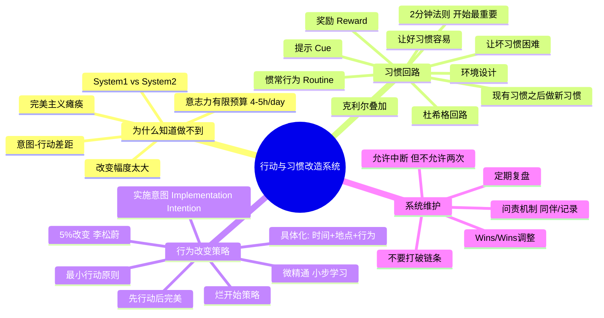

# Day 11：行动与习惯——知道这么多方法为什么就是做不到？

> 你知道你需要运动，你知道你需要早睡，你知道你需要读书——你什么都知道。那为什么你还是原来的你？

---

## 🍅 51: 知识分子的终极幻觉——"知道就是做到"

欢迎来到整门课最扎心的一天。

Day1到Day10，你学到了：神经可塑性、反省性思维、心流理论、费曼技巧、艾宾浩斯遗忘曲线、六顶思考帽、金字塔原理、第一性原理、批判性思维、暗时间、系统思维、四层阅读……

打住。你**用**了哪个？

别急着回答。让我猜猜你的真实情况：你认真读了之前的10天课程，频频点头，觉得"太对了"——然后该干嘛干嘛去了。去年你买的《认知觉醒》、《习惯的力量》、《微精通》还在书架上吃灰——你甚至能背出它们的核心论点，但你一样都没坚持超过三天。

**这不是你的问题。这是"知道-行动"之间那个该死的鸿沟。**

心理学称之为 **"意图-行动差距"（Intention-Action Gap）** 。简单说就是：你的大脑中"想做什么"的区域和"实际做什么"的区域之间，隔着一道比马里亚纳海沟还深的裂缝。

你以为你是"知道但不去做"？错。真相更残酷：

> **你根本不是"知道"——你只是"听说过"。**

"知道"和"听说过"之间的区别是：知道意味着你体验过、实践过、甚至失败过、修正过、再试过。听说过意味着你只是把那段文字编码进了你的语义记忆，随时可以复述——但和你的行为系统没有任何连接。

哈佛商学院教授Chris Argyris用了一个更尖锐的词：**"知行鸿沟"（Knowing-Doing Gap）**。

他的研究结论令人绝望：大多数组织和个人真正的问题不是"不知道怎么做"——而是"知道怎么做，但就是做不到"。管理者们能倒背如流地讲出管理理论，然后转身做出完全相反的管理行为。

但你不需要绝望——你需要的是理解"为什么"，然后对症下药。

### 为什么知道≠做到？

神经科学给你答案：**你的大脑不是一台"输入指令 → 执行"的计算机。**

你的行为由两个系统竞争控制：
- **系统1（直觉/习惯系统）**：低功耗、快速、自动运行。负责你已经内化的行为。
- **系统2（理性/目标系统）**：高功耗、缓慢、需要意志力。负责你的"新计划"。

每次你"知道了一个新方法，决定明天开始做"——你是在调用系统2下命令。但问题是，系统2的能耗太高了：一个典型成年人每天的意志力预算大约是**有限的4-5小时**。一旦预算耗尽——你就回到了系统1的自动导航。

**系统1不认识你的"新年计划"。** 它只知道你已经重复了几十年的自动行为模式。

这就是为什么你每天都说"今天早点睡"然后凌晨两点还在刷手机。你的系统2在白天已经耗尽了所有电量——凌晨的系统1根本不关心你的"早点睡"计划，它只关心"再刷一条"的多巴胺奖励。

---

✅ **费曼三句话**
1. "知道但做不到"真正的科学原因是：你的理性决策系统（系统2）和自动习惯系统（系统1）在抢方向盘——系统2有力但续航短，系统1续航长但方向由历史决定，不是由你的"新年决心"决定的。
2. 我过去把自己的"知道但做不到"归因为"意志力不够"——现在才知道这是归因错误。问题不是意志力，是我一直在用系统2对抗系统1，这就像用一台手机电池对抗核电站。
3. 我在想：如果行为改变的关键不是"增强意志力"，而是"重新编程系统1"——那应该怎么编程？答案在杜希格和克利尔的习惯理论里。

❓ **悬疑追问**：你上次发誓"从明天开始我要XXX"并且真的坚持了超过30天，是什么事？你是怎么做到的？那个成功案例和你那些失败案例之间，真正的区别是什么？

📌 **连线笔记**：回想一下你最近一个"知道但没做到"的目标。现在你知道这是意图-行动差距的产物，而不是你"懒"。下一件要做的事不是骂自己——是理解你当时的系统2电量还剩多少。

---

## 🍅 52: 习惯的底层逻辑——杜希格回路与克利尔叠加

现在我们来拆解习惯的科学。两个关键人物的理论：Charles Duhigg和James Clear。

### 杜希格的"习惯回路"

Duhigg在《习惯的力量》里提出了一个极其优雅的模型：

**提示（Cue） → 惯常行为（Routine） → 奖励（Reward）**

这不是他的原创（这是基础神经科学），但他把这件事讲成了大众能理解的故事。

**提示：** 触发习惯的开关。可能是时间（下午3点）、地点（回到家里）、情绪（感到压力）、或前一个行为（刚吃完饭）。

**惯常行为：** 你自动执行的行为序列。这是习惯回路中的"物理表现"。

**奖励：** 你的大脑得到的回报——让你觉得"哦，这个行为不错，下次继续"。奖励不一定是正面的（刷手机得到多巴胺），也可以是负面的缓解（抽烟缓解焦虑）。

关键是：**提示和奖励之间，大脑对"惯常行为"的内容是相对无意识的。** 这意味着——你可以在不破坏回路的情况下，替换惯常行为。

这就是Duhigg的"黄金法则"：**要改变习惯，保留提示和奖励，替换中间的惯常行为。**

举个例子：你每天下午3点都会去拿一杯含糖奶茶（提示：下午3点的疲劳感；奖励：糖分带来的短暂提神和社交放松）。要改变这个习惯，你不是强迫自己"不去拿"——而是找到另一个能满足"提神+放松"这个奖励的行为。比如：喝一杯黑咖啡+走到窗前站5分钟。

提示不变，奖励不变——中间的行为替换了。

### 克利尔的"习惯叠加"和"2分钟法则"

James Clear在《原子习惯》里把Duhigg的模型实战化了。两个核心概念值得刻进你的日常操作系统：

**概念一：习惯叠加（Habit Stacking）**

> "在[现有习惯]之后，我会[新习惯]。"

格式：`在[当前已有的确定性行为]之后，我立刻做[我想建立的新行为]。`

例：`在早上刷牙之后，我立刻做10个俯卧撑。`

为什么有效？因为"刷牙"已经是一个刻在你系统1里的自动行为——你不需要意志力来触发它。而把它作为"提示"，你跳过了"我需要决定何时做俯卧撑"这个最耗意志力的决策环节。

**概念二：2分钟法则**

> "一个新习惯的建立，前2分钟决定了80%的成功率。"

Clear的洞察很粗暴：**养成习惯的关键不是"做得有多好"——是"开始得有多容易"。**

如果你要建立"每天写作"的习惯，不要先想着"写1000字"。先把目标设为"打开笔记本写一句话"。两分钟。写完就收工。

为什么？因为**行为本身的重复次数比单次行为的质量重要一万倍**。你只需要在初始阶段让行为发生——质量自然会在重复中提升。

### 李松蔚的"5%改变"——最小行动原则

中国心理学者李松蔚在《5%的改变》里提出了一个令人舒适的理念：

> 你不需要改变100%。你只需要改变5%。

绝大多数行为改变失败的原因不是"不够努力"——是"改变幅度太大"。你的系统1在面对"从明天开始我要早起1小时"这种变化时，反应是："这太可怕了，我不干。"

而"5%的改变"——系统1甚至感觉不到变化。然后，在不触发防御机制的情况下，你悄悄撬动了行为。

李松蔚的案例里有一个经典：一个无法开始写论文的研究生。他的建议不是"每天写500字"——是"每天打开论文文件，写50个字，然后关掉。"这50个字就是那5%。

猜猜结果？一旦打开了文件，写了50个字——大多数人会继续写下去。因为**最大的阻力不是"写完"——是"开始"。**

### 微精通（Micro-mastery）——小步学习理论

Robert Twigger在《微精通》里给了另一个视角：学习新技能不需要"一万小时"——你只需要在小范围内达到"精通"即可。

"微精通"的定义：**在一个极小的、可定义的技能范围内，达到能让自己满意的水平。**

比如：不是"学会弹吉他"（太宏大，系统1直接罢工），而是"学会弹C大调的音阶"（小范围，3天就能做到）。

**每一次微精通的成功，都在给你的大脑证明一件事："我可以改变。"** 这种自我效能感（Self-efficacy）的积累，是长期行为改变的唯一燃料。

---

✅ **费曼三句话**
1. 习惯改变的核心不是"增加意志力"——是用"保留提示和奖励、替换行为"（Duhigg回路）+"把旧习惯当触发器、把新习惯压到2分钟内"（Clear叠加）+"只改变5%"（李松蔚）这三把扳手撬动系统1。
2. 我以前每次想建立新习惯都会犯同一个错误：目标定得太宏大、改变幅度太大。结果系统1每次都被吓得直接死机。正确的做法是先骗过系统1——让它觉得"没什么变化"。
3. 我在想：如果我把"每天写1000字"改成"每天打开文档，写50个字，写完就合上"——我能坚持多久？我猜会比一个月前坚持了3天的"每天1000字计划"要久很多。

❓ **悬疑追问**：你有一个"一直想建立但从未成功"的习惯。如果现在把它压到"2分钟就能完成的版本"——它还难吗？如果不难——你为什么不先做那个2分钟的版本？

📌 **连线笔记**：选一个你一直想养成的习惯。用Clear的2分钟法则重新定义它：最简版本是什么？2分钟能做完的版本是什么？然后从明天开始只做这个最简版本，坚持一周再说。

---

## 🍅 53: 从理论到现实——三个习惯改造的血泪案例

理论听起来很美好，现实通常很丑陋。来看看三个用"习惯科学"改造行为的真实案例。

### 案例一：陈姐的"年度计划终结者"

陈姐，38岁，市场总监。她是"年度计划专业户"——每年1月1日写满一页A4的目标，每年12月31日对着同样的一页纸叹气。

2025年她终于受够了。她用了一个极简方法：

**"不写年度计划，只写明天计划。"**

具体操作：每天晚上睡前，用手机备忘录写一句话——"明天我要做的一件最小的事。"比如不是"开始健身"——是"明天上班前做三个深蹲"。不是"写完报告"——是"明天打开报告文档，写一句话。"

听起来蠢到令人发指？结果她坚持了整整一年。

关键洞察：**年度计划激活的是系统2（理性决策），但执行依赖的是系统1（日常习惯）。年度计划本质上是在用一个系统给另一个系统下命令——跨系统通信肯定有延迟和损耗。** 而"明天计划"是系统1可以理解的——明天，一个动作，不复杂。

### 案例二：小林的"微精通"实验

小林，26岁，刚工作的数据分析师。他来北京第一年，发现自己除了工作和刷剧之外什么都不会。他想学点什么——但每次想到"从零开始学一门技能"就感到窒息。

他试了"微精通"策略。

他选了三个微型技能：
- **手冲咖啡**：不追求"成为咖啡大师"，只追求"能冲出一杯不难喝的咖啡"。2周达成。
- **基础书法**：不追求"写一幅作品"，只追求"能把'永'字写得像字"。3周达成。
- **日语五十音**：不追求"看懂日剧无字幕"，只追求"能读出所有假名"。1周达成。

成果：6周、3个微技能、每次成功都给了自己"我是能学会新东西的人"的正反馈循环。半年后他把微精通扩展到了Python自动化脚本和基础的SQL优化——都是从"极小的范围"开始的。

核心原理：**自我效能感是一个复利账户——每次微精通的成功就是一笔存款。账户余额够了，你才敢挑战大任务。**

### 案例三：老周的"烂开始"策略

老周，45岁，国企中层。他有一个"写作梦"——想写一本关于中国工厂变迁的非虚构作品。但他的问题是"无法开始"——每次打开空白的Word文档，他都觉得自己写出来的东西太烂了，于是关掉。

他的转折点来自一句话：**"允许自己写出世界上最烂的初稿。"**

他给自己定了一个规则：每天写500字——不管多烂。错别字、语法不通、逻辑混乱——都可以。他甚至在文档顶部写了一句备注："这是烂初稿，写完之前不准回头改。"

结果：80天写了4万字初稿。质量如何？他自己说"大约有30%能看"——但如果没有那30%，他一字都没有。

这个方法的神经科学依据是：**你大脑中的"批判模式"和"创造模式"不能同时激活。** 当你边写边改的时候，你在让两个互相冲突的神经系统同时工作——结果就是死机。

先创造，再批判。顺序不能错。

---

✅ **费曼三句话**
1. 行为改变的三个现实武器：年度计划拆成"明天一件事"（减少决策成本）、微精通积累自我效能感（复利效应）、允许烂初稿（避免批判模式阻塞创造模式）。
2. 我自己的"完美主义瘫痪"（Perfectionism Paralysis）和老周一模一样——每次写东西都觉得不够好，然后直接不写。"允许自己写出烂东西"这个心理许可对我来说可能比任何技巧都管用。
3. 我在想：如果我把"5%改变"的思想用在我最想改变的三个习惯上——每个习惯只做"最烂版本"——会发生什么？

❓ **悬疑追问**：你说的"等我准备好了再开始"——等了多久了？如果"准备好"永远不来（它确实永远不来），你还要等多久？

📌 **连线笔记**：选一个你拖延了很久的事。用"烂开始策略"重新定义它——最烂的版本是什么？烂到让你不好意思告诉别人那种版本。从那个版本开始。

---

## 🍅 54: 行为改变的系统设计——从意志力到工程思维

是时候做一个系统性的整理了。

### 🧠 思维导图：行动与习惯改造系统

### 实施意图（Implementation Intention）——心理学里最强的行为改变工具

心理学家Peter Gollwitzer给出了一个你可以在60秒内用上的方法：

**实施意图的格式：**
> "当[情境X]出现时，我会做[行为Y]。"

它不是"我打算多运动"——它是"当明天早上闹钟响的时候，我会穿上跑鞋走出门。"

它的力量在于：**把行为决策权从系统2移到了系统1。** 你不需要在"要不要运动"这件事上消耗意志力——你已经在"闹钟响→穿跑鞋"之间建立了一个自动化的条件反射。

Gollwitzer的元分析发现：**使用实施意图的人，行为执行率比对照组高出200-300%。** 没有其他单一技巧能接近这个数字。

### 环境设计——你永远斗不过你的环境

行为科学家Wendy Wood的研究表明：**43%的日常行为是在几乎相同的环境下自动执行的。**

这意味着什么？你不需要成为一个"意志力超人"——你只需要设计你的环境，让好习惯变得简单到不可能不做，让坏习惯变得困难到不可能不小心错过。

**实用技巧：**

- 想多喝水？把水瓶放在办公桌正中央——不要放在柜子里。
- 想少刷手机？把充电器放到另一个房间。
- 想早起运动？把运动服放在床边——穿着它睡觉，醒来第一件事就是穿上。
- 想少喝奶茶？不要买——不要买甘蔗糖浆放在家里。**不要考验你的意志力，因为你一定会输。**

> "圣人也经不起诱惑，如果你把饼干放在他面前。" —— James Clear

### 习惯追踪——你不是在"作弊"，你是在给自己反馈

习惯追踪器（Habit Tracker）的本质不是"监督你"——是**给你行为数据的即时反馈**。

人的大脑不擅长感知细小的变化——你每天做10个俯卧撑，第3天你感觉不到任何变化，于是你放弃了。但如果你能看到一张日历上连续30天的✓——你的大脑会说："等等，这个序列不能断。"

**"不要打破链条"（Don't break the chain）** 是世界上最简单的习惯追踪方法：每天做完习惯动作后，在日历上划一个X。目标：不要让X断掉。

万一断了怎么办？**允许中断，但不允许中断两次。** 一次错过只是失误，两次错过是模式崩塌的开始。

---

✅ **费曼三句话**
1. 行为改变最有效的工具不是"增强动力"——是实施意图（具体化触发条件）+ 环境设计（降低好习惯的启动难度）+ 习惯追踪（提供反馈）三者组合构成的工程系统。
2. 我过去一直在用"Motivation"驱动行为改变——结果就是每次动力高峰之后必然坠入低谷。现在我理解了：可靠的行为系统不需要"动力"——它只需要"触发→行为"的自动化回路。
3. 我在想：如果我把我三个最想改变的习惯都写成实施意图的格式——"当X时我做Y"——然后对应的环境改造（让Y变得极其容易启动）——一周后这三件事的完成率会是多少？

❓ **悬疑追问**：如果你不是"懒"——而是你的环境设计得太"方便"你偷懒了——你会怎么重新布置你的环境？先别说"做不到"——先想想"理论上可以怎么做"。

📌 **连线笔记**：现在做一件事：选一个你想减少的坏习惯，然后把你环境中触发它的"提示"找出来，消除掉。比如把短视频APP从手机首页移到"需要手动搜索"的位置。这个改变比你说100次"我要少刷手机"都管用。

---

## 🍅 55: 刻意练习——设计你的30天行为改变计划

最后一个番茄，我们不谈理论了。这是你的30天计划模板。

### 你的30天行为改变计划

**第一步：选择一个最小改变（30分钟）**

选一个你最想改变的行为。然后用"5%改变"法则把它压到最小——小到你觉得"这也能叫改变？"的程度。

| 原目标 | 5%版本 |
|:-------|:-------|
| 每周运动3次 | 每天穿上运动服站1分钟 |
| 每天写1000字 | 每天打开文档写1行字 |
| 读50本书 | 每天读2页 |
| 早睡 | 比平时早关灯10分钟 |
| 学英语 | 每天背1个单词 |

**第二步：写实施意图（10分钟）**

格式：`当[你的固定习惯/场景]发生时，我会做[你的5%行为]。`

例：
- "当早上刷牙时之后，我会做1个俯卧撑。"
- "当晚饭后洗完碗，我会打开文档写一行字。"
- "当我晚上上床关灯时，我会比昨晚早10分钟。"

**第三步：设计你的环境（15分钟）**

问自己三个问题：
1. 做什么事能让这个5%行为变得更容易？
2. 做什么事能让替代的坏习惯变得更难？
3. 我可以移除什么障碍？

**第四步：安装追踪系统（5分钟）**

找一个日历、一张纸、或者一个App。每天做完后打✓。不要中断——但如果不小心断了，不要中断两次。

### 如果30天后没坚持下来——怎么办？

先恭喜你——你加入了人类的大多数。

不要灰心。这不是"失败"——这是数据。你收集到了一个关键信息：**某个环节的设计有问题。**

回头检查：
1. **改变幅度还是太大？** 再砍一半。从"5%"砍到"2.5%"。
2. **实施意图不够具体？** "当_____时我会做_____。"填空更具体一点。
3. **环境设计有漏洞？** 你是不是还留着那个让你分心的APP？
4. **奖励不够即时？** 完成行为后立刻给自己一个微小的奖励——一杯好咖啡、三分钟发呆、一个✓。

### 最后的忠告

《只管去做》里有句话我深以为然：

> "不是等你有动力了才去做——是去做了才会有动力。"

动力的方向是反的。你以为需要先有动力才能行动——真相是：**行动产生动力，而不是相反。**

所以如果你从Day11只带走一件事，我希望是这一件：

**不要等自己"准备好了"。永远不会有那么一天。现在就开始——从最小、最蠢、最不值得一提的版本开始。**

明天回来上最后一课（Day12）：把所有方法整合成你自己的操作系统。

---

✅ **费曼三句话**
1. 行为改变的起点不是"宏大的决心"——是"微小的、不完美的、但切实发生的行动"。动力不是行动的前提——行动才是动力的燃料。
2. 我以前总想做"完美的计划"——完美的健身计划、完美的写作计划、完美的学习计划。结果是完美的计划从来没有开始过。我应该做的是：一个烂计划，今天就开始。
3. 我在想：如果"行动先于动力"这个概念是真的——那我其实只需要做一件事：不管感受如何、不管有没有动力、不管完美不完美——就是做那个5%的最小动作。做出行动，感受自然会跟上。

❓ **悬疑追问**：你现在知道的11天学习方法的全部内容——最精华的那些。你准备用哪一个？什么时候开始？"等有空的时候"不是回答——你我都知道那个"有空的时候"永远不会来。

📌 **连线笔记**：现在，立刻，写下你的"5%改变"计划。不需要发朋友圈、不需要告诉任何人、不需要完美。只需要一张纸、一支笔、3分钟。写下的那一刻——你就已经比之前的你更接近改变了。
