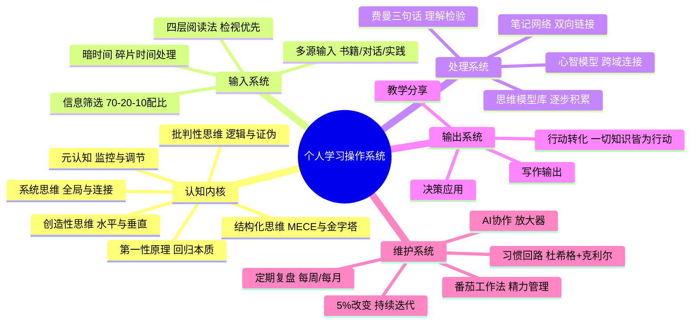

# Day 12：整合与超越——成为自己的方法论设计师

> 你花11天学了50多个番茄的学习方法论。现在把它们都忘掉。你需要的不是一套现成的"最佳实践"——是你自己设计的操作系统。

---

## 🍅 56: 当"学习方法"本身变成知识焦虑——方法论癌患者的自白

说个让你后背发凉的故事。

2024年有个自称"终身学习者"的博主火了——不是因为他学到了什么——是因为他把自己"学到瘫痪"的过程直播了出来。

他叫Alex（化名）。疫情期间开始"系统学习怎么学习"。他买了《如何阅读一本书》、《认知觉醒》、《刻意练习》、《深度工作》、《心流》……然后他做了每个"严肃学习者"都会做的事：用Notion搭了一套"第二大脑"系统，用Obsidian建立了双向链接知识库，每天用番茄钟法学习4个番茄，每本书都做费曼笔记。

一年后他发了条推特炸了：

> "我花了一年时间学'怎么学习'。结果我什么都没学到。我成了一个**学习方法的收藏家，而不是任何领域的专家。**"

他的问题是什么？不是方法错了——是**他把自己变成了方法论的自助餐食客**。每个方法都尝了一口，没有一个咽下去消化掉。

你担心你也可能成为Alex？

别怕——成为一个方法论收藏家不是你的错。这是**学习方法市场的系统性问题**：每个方法都在抢你的注意力，每个方法都在宣称自己是"终极答案"。结果就是你学会了所有方法，但一个都不会用。

这叫 **"方法论瘫痪"（Methodology Paralysis）** ——知道的方法越多，行动的阻力越大。

### 学习风格的真相——VAK模型是伪科学

说到"知道了太多错误的方法"——我们先来拆一个影响了几代人的迷思。

你肯定听过这个说法："有些人学东西靠看（视觉型），有些人靠听（听觉型），有些人靠动手（动觉型），你要找到自己的学习风格。"

听起来很有道理对不对？以至于全球的教育系统都为此改变了教学方法——老师开始为"视觉型学习者"准备幻灯片，为"听觉型学习者"准备录音，为"动觉型学习者"准备动手活动。

**只有一个问题：这个理论是错的。**

2008年，一个大型的学术综述（Pashler et al., 2008）系统地检查了VAK学习风格理论的所有证据。结论干净利落：

> **没有任何可靠的实验证据表明，根据学生的学习风格调整教学方法能提高学习效果。**

理论很漂亮，但经不起检验。后来更全面的元分析（Coffield et al., 2004; Rohrer & Pashler, 2012）反复确认了这个结论。

那为什么VAK模型还这么流行？因为它**感觉是对的**。人有偏好（我喜欢看图胜过看字）→ 偏好被包装成"风格" → "风格"被说成是"更有效的方式" → 整个产业诞生。

一个更准确的表述是：

> 你可能有**偏好**（preference），但偏好不等于**优势**（strength）。你喜欢用视觉方式学习，不代表你用视觉方式学得更有效。

事实上，**最好的学习策略是混合各种方式**——视觉+听觉+动觉+阅读+讨论+……而不是只依赖你"觉得舒服"的那一种。

**所以问题来了：既然"找到你的学习风格"是伪命题——那真正有效的学习方法是什么？**

答案是：**元认知（Metacognition）**——这正是我们下一个番茄要讲的。

但首先，消化一下这个真相：你过去可能花了很多精力"寻找自己的学习风格"。如果你找到了——恭喜你，那可能是个心理安慰剂。如果你没找到——太好了，你省下了继续寻找的时间。

---

✅ **费曼三句话**
1. VAK学习风格理论（视觉/听觉/动觉）已被大量研究证伪——没有任何可靠证据表明按"风格"教学能提高效果。你感到的"偏好"不等于"优势"。
2. 我自己也曾经痴迷于"找到自己的学习风格"——后来发现这不过是另一种"方法论消费主义"，它让我感觉自己"在学习如何学习"而不用真正学任何东西。
3. 我在想：如果学习风格是伪科学——那为什么"读了一本关于学习的书"本身会让我感觉很充实？这个"充实感"是不是另一种认知偏差？

❓ **悬疑追问**：你相信"学习风格"这个概念多久了？如果这个概念是错的——还有多少你深信不疑的"学习常识"也是错的？凭什么是你"恰好信对了"？

📌 **连线笔记**：你过去有没有因为"我是视觉型学习者"而排斥了某个本应有效的学习方式（比如听播客学习）？现在你知道那只是偏好——试试用你不习惯的方式学习同一个内容，感受差异。

---

## 🍅 57: 元认知——你大脑里的那个"监控摄像头"

这是Day12最核心的一个概念。它也是整门60个番茄的**终极心法**。

### 元认知是什么？

"元认知"（Metacognition）——字面意思：**对认知的认知**。

更具体地说：**你对自己思维过程的意识、监控和调节能力。**

说人话：你脑子里有一个"小声音"时不时在问你——

- "这个方法真的有效吗，还是只是让我感觉很忙？"
- "我刚才读的那段话，我真的理解了吗，还是只是感觉读完了？"
- "我现在学不进去，是因为累了还是因为懒？要不要换个方法？"

那个"小声音"就是元认知。

### 为什么元认知是学习的终极技能？

你已经花了11天刷了55个番茄方法论。你知道了番茄工作法、费曼学习法、刻意练习、反省性思维、系统1系统2、心流理论、六顶思考帽、金字塔原理、第一性原理、批判性思维、暗时间、系统思维、四层阅读法、习惯回路、5%改变……

问题来了：**你什么时候用哪个？**

这不是一个"最佳实践"问题——这是一个**元认知决策问题**。

- 当你面对一个新领域 → 用Adler的"检视阅读"快速建立全景图
- 当你理解一个有难度的概念 → 用费曼技巧检查自己是否真的懂了
- 当你做一个复杂决策 → 用德博诺的六顶思考帽或第一性原理
- 当你感到疲惫分心 → 用番茄工作法或"停止规则"（Stop Rule）
- 当你陷入习惯惰性 → 用实施意图+环境设计

**你知道这些方法——但你需要在正确的时间调用正确的方法。这就是元认知的工作。**

### 丹尼尔·威林厄姆的元认知模型

认知科学家Daniel Willingham（《Why Don't Students Like School?》）的模型对元认知的三阶段划分非常实用：

1. **计划（Planning）：** 行动前——"这个任务需要什么方法？我该怎么学？"
2. **监控（Monitoring）：** 行动中——"我现在理解了吗？这个方法有效吗？"
3. **评估（Evaluating）：** 行动后——"我学到了吗？方法对吗？下次怎么改进？"

大多数人的问题不在"智商"——在**元认知的"监控"环节**。他们在学习的时候不会停下来问自己"我在理解吗？"——他们一路往前冲，最后发现什么都没记住。

**元认知弱的表现：**
- 读了一页，发现自己在走神，不知道刚才读了什么
- 觉得"懂了"，但一被提问就卡住
- 花了很多时间复习，但考试时发现自己努力的方向全错
- 看书的时候很爽，合上书发现什么也说不出来

### 邓宁-克鲁格效应——你越蠢，你越不知道自己蠢

说到元认知的失败——必须提邓宁-克鲁格效应（Dunning-Kruger Effect）。

两位心理学家在1999年做了一个实验：让大学生评估自己的逻辑推理、语法和幽默能力，然后实际测试。结果发现：

- **能力最差的25%的学生** ——严重高估自己（实际分数在倒数10%，却认为自己在前30%）
- **能力最强的25%的学生** ——略微低估自己（实际分数在前10%，却认为自己只在中等偏上）

这就是"达克效应"的核心发现：**元认知能力也是能力的一部分——所以能力差的人连"自己能力差"这个事实都无法识别。**

地图上看的话：

```
                   自信度
                     ↑
        愚昧之巅     │      .
        (不知道自己  │    .
         不知道)     │  .
                     │.
                     ├──────────────────→ 能力/知识
                     │    .
                     │        .
         绝望之谷    │            .
        (知道了自己  │                .
         不知道)     │                    .
                     │                         .
                     │                              .
                     │                                   .
                     │                                        开悟之坡
```

这条曲线你应该看过。但大多数人只把它当段子看——"愚昧之巅上的那些傻子真可笑"。很少有人意识到：**你自己就在这条曲线上，只是你无法识别自己当前的位置。**

因为如果你能识别——你就已经不在"愚昧之巅"了。

这就是元认知的悖论：**你越需要它，你越不知道自己需要它。**

---

✅ **费曼三句话**
1. 元认知是你对自己思维过程的"监控摄像头"——它决定你能否在正确的时间调用正确的方法。方法太多不会让你瘫痪——没有元认知才会。
2. 我学到的最有价值的一件事：学习时经常停下来问自己"我真的理解了吗？我是在真学还是只是在浪费时间感觉良好？"——这个简单的元认知问句，比任何学习方法都管用。
3. 我在想：邓宁-克鲁格效应告诉我，我可能处于"愚昧之巅"而不自知。有没有一个可靠的"元认知校准机制"——让我能客观地检验自己真实的认知水平？

❓ **悬疑追问**：你有多确定你现在了解自己——不管是学习上的还是人生上的？如果你现在正处在"愚昧之巅"而不自知——你怎样才能知道？你用什么方法来校准自己的认知？

📌 **连线笔记**：做一个小实验：学完这个番茄后，试着用费曼技巧给自己讲一遍"什么是元认知"。如果你卡住了——那就是你的元认知在对你说话："你看，你其实没完全懂。"

---

## 🍅 58: 在AI时代学习——当你的"工具"比你聪明时

### AI时代的"学习"还是原来那个意思吗？

你正在读这段话的时候，世界上有至少五个AI模型比你的"最佳状态"还要聪明——至少在信息检索、模式识别、生成表达这些维度上。

这不是夸张。GPT-4o、Claude 3.5、Gemini 2.0——它们的知识广度超过任何人类，它们的信息处理速度超过任何人类，它们的"记忆力"（上下文窗口）超过任何人类。

**那么问题来了：在AI比你"知道"得更多、更快、更准的时代——你还要学什么？**

如果答案是"什么都不用学了，交给AI就行了"——那你正在犯一个致命错误。因为AI可以替你"知道"，但无法替你"理解"、"判断"、"创造"和"负责"。

### 人类vs AI：学习的分工

我把AI时代的人类学习重新定义为四个层次：

| 层次 | 内容 | AI能替代吗？ | 人类还需要学吗？ |
|:-----|:-----|:------------|:----------------|
| **事实层** | 知识、信息、数据 | ✅ 完全替代 | 不需要死记，但需要知道"存在什么" |
| **方法层** | 流程、技巧、方法论 | ✅ 大部分替代 | 需要理解原理，才能判断AI的产出 |
| **思维层** | 批判思维、系统思维、第一性原理 | ⚠️ 部分替代 | **必须学**——这是人类的护城河 |
| **元认知层** | 对自己认知的认知、价值判断 | ❌ 无法替代 | **必须学**——这是人类的核心竞争力 |

**AI可以替你读完100本书并写出摘要——但它不能替你判断哪本书值得读。AI可以给你无数个"最佳解决方案"——但它不能替你在两条路之间做出价值选择。**

因为AI没有"你"这个视角。它不了解你的价值观、你的处境、你的独特目标。

这就是你在这个时代学习的真正意义——**不是学会更多知识（AI已经替你存了），而是学会更好地思考（AI无法替你完成的那部分）。**

### 成为"AI协作型学习者"

《成为黑马》里有一个观点可以借过来用：**在个性化的时代，成功不是爬一个固定的阶梯——是你自己定义阶梯。**

在AI时代，最高效的学习者不再是"独自苦读"的人——而是**懂得用AI放大自己思维能力的人**。

操作指南：

1. **让AI做你的检视阅读助手**：让它为你概括一本书的核心论点（用Adler的检视阅读框架），你来做分析阅读中的"批判性判断"。

2. **让AI做你的费曼对话伙伴**：在你用费曼技巧给自己讲清楚一个概念之后，让AI扮演"六岁小孩"追问你——如果你回答不了它的追问，说明你的理解还不够深。

3. **让AI做你的思维激发器**：当你陷入思维定势，让AI用德博诺的水平思考技巧给你10个"不可能的角度"——其中至少有两个会让你眼前一亮。

4. **让AI做你的习惯追踪器**：写下你的实施意图，让AI每天提醒你、追问你、做你的问责伙伴。

**关键的原则：** AI是放大器，不是替代品。**你花在"思考如何思考"上的时间，应该增加，而不是减少。**

---

✅ **费曼三句话**
1. AI时代学习的核心已经从"获取知识"转向了"训练判断力"——AI可以替你读、替你总结、替你生成，但不能替你判断"什么是对的、什么值得做、哪个选择符合你的价值观"。
2. 我以前害怕AI会让我"不用学习"——现在我知道了，恰恰相反：AI让我必须更深入地学习"怎么思考"和"怎么判断"。因为"知道"已经没有护城河了——但"判断"和"选择"还有。
3. 我在想：如果我把AI当作我的"思维训练伙伴"——让它给我出题、追问我的漏洞、挑战我的假设——我是不是能以更快的速度提升我的判断力？

❓ **悬疑追问**：如果你的手机明天开始没有任何AI功能——你的"学习能力"会受到多大影响？如果你的回答是"没什么影响"——那你还没学会用AI。如果你的回答是"会崩溃"——那你太依赖AI了。正确答案在哪里？

📌 **连线笔记**：现在打开一个AI聊天工具（Claude、ChatGPT都行），给它一个你刚学到的概念（比如"元认知"），让它用苏格拉底提问法追问你——直到你发现自己理解中的漏洞。这不是偷懒——这是你在训练自己。

---

## 🍅 59: 成为自己的方法论设计师——构建你的个人学习操作系统

### 🧠 思维导图：个人学习操作系统总架构



### 忘掉"最佳实践"——建立你自己的操作系统

有一个荒诞的真相：**所有的学习方法都有效——但没有一个对所有人在所有情况下都有效。**

番茄工作法对创意工作者有效的前提是：你从事的是能够被拆分为25分钟单元的工作。如果你是个外科医生……你觉得在手术过程中设个番茄钟合理吗？

同样，费曼学习法对理解概念性知识极好，但对程序性知识（如学会游泳）——你得下水。

所以这个60番茄教程的**最终目的**不是让你记住50多个方法——是让你学会**方法设计（Method Design）**：

> 面对一个学习任务，你不是从"我的工具箱里有什么"出发——而是从"这个任务需要什么"出发，然后**设计**你的学习方法。

### 如何设计你的学习方法——五步流程

**第一步：定义任务类型（Task Analysis）**

这个学习任务属于什么性质？
- 概念性（我需要理解什么）→ 费曼技巧、心智模型
- 程序性（我需要学会做什么）→ 刻意练习、微精通
- 综合性（我需要创造什么）→ 主题阅读、水平思考
- 反思性（我需要判断什么）→ 批判性思维、六顶思考帽

**第二步：确定输入策略（Input Strategy）**

- 需要广度 → 检视阅读+70-20-10配比
- 需要深度 → 分析阅读+费曼三句话
- 需要跨界 → 主题阅读+系统思维

**第三步：选择处理方式（Processing Mode）**

- 独立学习 → 费曼、笔记网络、心智模型
- 互动学习 → 教学、讨论、苏格拉底式对话
- 实践学习 → 微精通、行动后复盘

**第四步：设计输出机制（Output Mechanism）**

- 写作输出 → 写文章、做幻灯片
- 行动输出 → 做项目、做产品
- 教学输出 → 教别人、录视频、写教程
- 决策输出 → 用新知识做一次判断

**第五步：安装元认知监控（Metacognitive Check）**

在每个环节都设置"检查点"：
- "我现在用的方法对这个任务真的合适吗？"
- "我是在真学，还是只是在消费内容？"
- "如果效果不好——我应该调整方法还是调整目标？"

### 你的第一版"个人学习OS"

不要从零开始。直接抄袭。用我之前给你11天的内容作为基础组件：

```
操作系统名称：[你的名字]学习系统 v1.0
内核：元认知监控（底层常驻）
输入模块：Adler四层阅读（70-20-10配比）
处理模块：费曼三句话 + 双向链接笔记
输出模块：写作/教学/行动（至少一种）
维护模块：番茄钟（25/5节奏）+ 习惯追踪
外部接口：AI协作（检视+反问+激发）
升级策略：每月一次"学习方法复盘"
```

打印出来，贴墙上。用一个月。然后修改它。

**这不是你的最终版本。这是你的第一个版本。** 操作系统可以升级——但你得有操作系统才能升级。

---

✅ **费曼三句话**
1. 没有"普遍最优"的学习方法——只有"对当前任务最适配"的方法组合。方法设计师的核心能力是：先分析任务类型，再选择和组合方法，然后安装元认知监控来实时调整。
2. 我以前一直在找"终极学习方法"——现在知道了这是方向性错误。正确的问题不是"哪个方法最好"——是"这个任务需要什么方法组合"。
3. 我在想：如果把我的个人学习OS第一条安装到墙上，一个月后我会发现哪些设计缺陷？哪些模块我根本没用？哪些模块我需要更换？

❓ **悬疑追问**：如果60个番茄结束之后你没有立刻开始"用这套系统"——三个月后你还能记得几个番茄的内容？你有"操作系统"，也需要有"启动它的动作"——你的"启动动作"是什么？

📌 **连线笔记**：现在花5分钟，画出你自己的"个人学习OS"第一版架构图。不需要完美——用纸笔都行。关键是：你要有一个"图"——而不是一堆方法在脑子里打架。

---

## 🍅 60: 最后的番茄——学完所有方法之后

这是第60个番茄。最后一个。

没有新方法了。今天最后一个番茄——我们来做一件事：**整合、告别、出发。**

### 60个番茄的终极回顾

来，闭上眼睛30秒。想想这12天你走过的路：

- Day1：大脑的学习机制——神经可塑性，你的大脑可以被重塑
- Day2：反省性思维——卡尼曼的系统1和系统2
- Day3：专注的艺术——心流和深度工作
- Day4：理解与记忆——费曼技巧、艾宾浩斯遗忘曲线
- Day5：创造性思维——德博诺的六顶思考帽和水平思考
- Day6：结构化思维——金字塔原理和MECE
- Day7：批判性思维——逻辑谬误和证伪思维
- Day8：时间与能量管理——暗时间和创造时间
- Day9：高维思考——系统思维和第二序改变
- Day10：阅读与信息处理——Adler四层阅读法
- Day11：行动与习惯——习惯回路和5%改变
- Day12：整合与超越——元认知和个人学习OS

如果你认真跟下来——你现在的脑子里应该有一种"混乱"。不是混乱的混乱——是**太多新结构刚被装进旧脑区的那种混乱**。

这是好事。这叫 **"认知失调"（Cognitive Dissonance）** 。你旧的思维模式正在被新结构撬动，你过去的"学习方法"正在被碾碎重建。

**这个不舒服是成长的价格。你已经付了。**

### 从"知道"到"拥有"

还记得Day11我们讲的那个"意图-行动差距"吗？

从今天开始，你想成为什么样的学习者，**不再取决于你知道什么了**——取决于你从今天起做了什么。

如果你60个番茄全部学完了，但没有做过任何一个"刻意练习"环节的实践——那你不是"学完了"——你是"看完了一本书"。

如果你学了费曼技巧，但没有用它检验过任何一个概念——你就没有费曼技巧。

如果你学了习惯回路，但没有用它改造过任何一个习惯——你就没有习惯回路。

**你知道的不是你的——你用过、失败过、调整过、最终掌握了的东西，才是你的。**

### 给你一个"毕业作业"

从这60个番茄中，选出**一个方法**。**一个就够了。**

在未来30天里，专注于把这个方法练习到"不用想就能用"的程度。

- 如果选费曼——每天找一个概念，用三句话讲清楚
- 如果选番茄——每天至少完成一个番茄钟的深度工作
- 如果选实施意图——每天写一个"当X时我做Y"
- 如果选5%改变——每天做一个微小的行动

30天后，回来——再选第二个方法。

**这不是最"高效"的方法——但这是唯一能让你真正"拥有"这些方法的方法。**

### 成为自己的方法论设计师

我还要告诉你一件事，一件你可能已经猜到但不敢承认的事：

**没有人能靠别人的方法论生活。**

你可以用我的结构开始，你可以照搬我的例子，你可以拷贝我的个人学习OS——但最终，你得自己设计你自己的。

因为：

1. **你的大脑连接方式和任何人都不一样**——你的神经可塑性路径是独特的
2. **你面对的学习任务和别人不一样**——你的工作、你的目标、你的处境是唯一的
3. **你"喜欢"的方式不需要科学依据**——如果你用某种方法感觉好、愿意持续用——那就是好方法

所以最终的问题是：

> 你已经花了60个番茄了解"人类怎么学习"——现在，你准备**怎么学你下一个重要的事**？

答案不需要完美。答案甚至不需要正确。**答案只需要是你的。**

出发吧。你的知识库在等你，你的下一本书在等你，你下一个想成为的自己——也在等你。

---

### 彩蛋：60番茄的暗线

如果你读得够仔细，你会发现：**这套教程本身，就是它教的内容的示范。**

- 每个番茄25分钟的长度——是番茄工作法的示范
- 每个番茄末尾的"费曼三句话"——是费曼学习法的示范
- 刻意练习环节——是刻意练习的示范
- Day12整合所有方法——是你应该对自己做的事

**元学习（Metalearning）** 不是口号——是这个教程从结构到细节的设计原则。

你学到的不只是"方法"——你学到了一套"方法的方法"。这就是整门课60个番茄想送给你的礼物。

---

### 全课结语

在Day1的开头，我们引用了笛卡尔的问题：你脑子里那个一直在走神的声音——它才是真正的"你"。

60个番茄之后，你知道了：

- 那个声音不一定是对的（认知偏差）
- 你可以训练它（神经可塑性）
- 你可以关闭它（心流）
- 你可以分拆它（反省性思维）
- 你可以审视它（元认知）

你花了60个番茄了解你的大脑。现在你有一张它的使用说明书——和一本手写的破解指南。

接下来怎么做，在你。

**祝你在学习之路上，成为一个越来越让自己惊讶的人。**

---

✅ **费曼三句话**
1. 60个番茄学下来，核心结论只有一句：学习不是"输入知识"——是"设计你的认知系统"，而设计者只能是你自己。没有现成的最佳实践，只有不断迭代的个人操作系统。
2. 我学到了很多——但如果未来30天我只能做一件事：每天用费曼三句话检验一个概念。一个方法用透，胜过一百个方法知道。
3. 我在想：如果三个月后我再回来看这个文件——我会是什么样子？我会不会已经成为了另一个版本的自己？我希望答案是肯定的。

❓ **悬疑追问**：这不是一个需要回答的问题——这是一个需要你用未来三个月来回答的问题：**你学了60个番茄的方法，然后呢？**

📌 **连线笔记**：这个文件是你的起点。不是终点。把它加到你的Obsidian知识库中，给它打个tag：`#待实践`。三个月后，回来看它，问自己——我用了哪些？我改变了什么？我还是原来的我吗？
