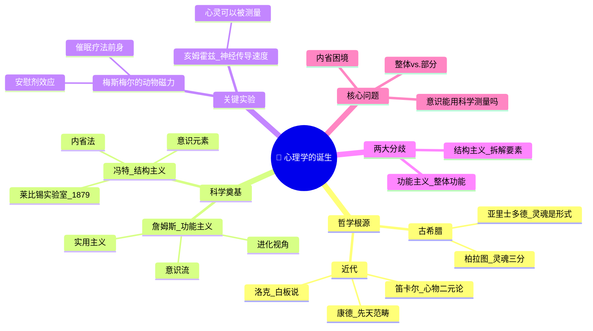

 
# Day 01：心理学的诞生——从哲学到科学的惊险一跃

> **悬疑提要**：1879年，德国莱比锡，一个中年教授在孔维特楼里建了一间实验室。他要做的事情在当时很多人看来是狂妄的——他要把"灵魂"关进实验室来测量。在此之前，人的心灵属于神学和哲学。此后，它属于科学。但这惊险一跃，跳了整整两千年。

---

## 🍅 番茄 1/5：悬疑开场——为什么是莱比锡？

### 开场白：一个疯子的疗法

1784年，巴黎。法国科学院成立了一个委员会，成员包括本杰明·富兰克林（对，就是那个放风筝的）、拉瓦锡（化学之父），以及断头台爱好者吉约坦医生。他们要调查一件让全巴黎名流圈疯狂的事——

一个叫**弗朗茨·梅斯梅尔**的德国医生，宣称他能用"动物磁力"治病。

梅斯梅尔的"治疗"场面堪称十八世纪最魔幻的行为艺术：昏暗的房间里摆满磁化桶，病人手拉手坐成一圈，梅斯梅尔穿着紫色丝绒长袍走进来，用一根铁棍触碰病人身体。然后——**病人开始抽搐、尖叫、甚至昏迷**。醒来后，他们的症状"奇迹般"消失了。

法国科学院得出的结论是什么？"想象力的效果，而非磁力。"

**他们把梅斯梅尔赶出了巴黎，称他为江湖骗子。**

但等一下——如果那些病人确实被治好了呢？如果用"相信会被治好"这种力量来治病，这本身不就是一种疗法吗？只不过两百年后，我们把它叫做——**安慰剂效应**和**催眠疗法**。

梅斯梅尔是错的，但他提出了一问题——这个问题的答案开启了现代心理学。

> **那问题是：有没有一种科学方法，可以研究那个看不见摸不着的"心灵"？**

### 笛卡尔的幽灵：心物二元论的开端

要回答这个问题，我们得先回到1641年。

笛卡尔，这位法国哲学家兼数学家，正坐在荷兰的火炉边思考一个让他毛骨悚然的问题：**如果有一个邪恶的魔鬼在欺骗我，让我以为外面有一个世界，实际上根本没有——我怎么能确定任何东西是真的？**

他的答案改变了西方思想史：我唯一不能怀疑的，是我在怀疑这件事本身——**"我思故我在"**。

然后笛卡尔犯了一个对心理学影响深远的"错误"：他把世界砍成了两半——**心灵**（精神、意识、思考的东西）和**身体**（机器、物质、物理的东西）。两者通过大脑中的松果体互动。

这就是**心物二元论**。

这个理论的好处是：它给了科学"身体"这个领地（所以医生可以研究大脑了），同时保留了宗教的"灵魂"。但坏处是：**它创造了一个两百年都没填平的鸿沟**——你如何用物理的方法研究非物理的东西？

### 两千年都在等一个答案

古希腊人也在问同样的问题：

- **柏拉图说**：灵魂有三部分（理性、激情、欲望），像一辆马车和两匹马。理性要控制欲望——否则会被拖着跑。
- **亚里士多德说**：不对，灵魂和身体不可分，就像印记和蜡块。灵魂是身体的"形式"。
- **奥古斯丁和阿奎那说**：灵魂是不朽的，属于上帝。
- **霍布斯说**：去你的灵魂，人就是一堆运动的物质。
- **洛克说**：人出生是白板一块，经验在上面写字。
- **康德说**：我们永远无法认识"物自体"，我们能认识的只是经过我们心灵范畴加工过的现象。

哲学家们吵了两千年。他们提出了所有正确的问题——但有一个问题他们解决不了：**如何证明谁是对的？**

哲学靠的是思辨和逻辑。但当你认为一件事是对的，我同样聪明地认为它是错的，谁来当裁判？

答案来了：**莱比锡，1879年。**

### ✅ 费曼三句话

```markdown
🧠 **费曼三句话**
1. 心理学成为科学的关键一步，是把"心灵"从神学和哲学的领域拉进实验室——让人可以用测量和实验来验证关于心灵的假设。
2. 生活中的例子：你怀疑朋友"心情不好"。你是靠猜（哲学）还是靠观察他的表情、语气、行为（科学）？后者就是心理学的方法。
3. 我还不清楚的是：用科学方法研究心灵，会不会错过了那些无法被测量的东西？比如"意义"、"爱"、"超越"？
```

### ❓ 悬疑追问

**如果意识本质上无法被"测量"，那么心理学的科学身份是不是一个谎言？现代脑科学和fMRI能在多大程度上真正"看见"思想？** fMRI指功能性磁共振成像，是医学、脑科学领域常用的影像检测技术，为 **functional magnetic resonance imaging** 的缩写。

---

## 🍅 番茄 2/5：冯特——第一个把灵魂关进实验室的疯子

### 主角登场：中年叛逆的教授

**威廉·冯特**，1832年生于德国曼海姆附近的一个牧师家庭。

听起来像标准的好学生履历？不。冯特小时候一点都不出色。他胆小、焦虑、功课平平，唯一的爱好是做白日梦。父亲早逝，他和母亲相依为命，少年时期一度靠当学徒过活。他后来回忆说："我的整个童年就是一场持续的轻微沮丧。"

然后他上了大学。先学医，但他对临床毫无兴趣。然后学生理学，师从**赫尔曼·冯·亥姆霍兹**——十九世纪最伟大的科学家之一。在亥姆霍兹的实验室里，冯特目睹了一件改变他一生的事：**生理学家正在用实验方法测量神经传导速度。**

人感受到痛觉需要多长时间？亥姆霍兹测量出来了——约 50-100 毫秒。

**等等。如果"感觉"可以被测量，那"意识"呢？**

这个想法在冯特脑子里扎了根。1875年，43岁的冯特被聘为莱比锡大学哲学教授。这个已经不算年轻的男人，开始了他最疯狂的十年。

### 1879年，莱比锡，孔维特楼

这栋楼在莱比锡大学校园里，原来是给门卫住的破房子。冯特把它改造成了——**世界上第一个心理学实验室。**

当时的科学界觉得他疯了。物理学研究物质，化学研究元素，生物学研究生命——你冯特想研究什么？**意识？** 那是诗人的领域，不是科学家的。

但冯特不管。他从生理学那里借来了实验方法，从哲学那里借来了问题。然后他提出了一个简单粗暴的策略：**不研究"灵魂是什么"这种大问题，而是研究"感觉的基本单位"这种可以测量的小问题。**

他让学生坐在实验室里，给他们看——

- 节拍器的滴答声（听觉）
- 不同颜色的光斑（视觉）
- 不同重量的砝码（触觉）

然后让他们**内省**——精确报告自己的感受。

### "你现在感觉到什么？"

冯特的实验看起来很简单，但他的想法很深刻：

他不仅仅在测量"刺激"和"反应"之间的关系（那是生理学家做的事）。他在测量**人如何有意识地体验这些刺激**——也就是后来被称为**意识经验**的东西。

他给每个刺激设定精确的时间、强度、频率，然后让被试尽可能客观地报告感受。

他管这个叫**内省法**——但这不是那种"我闭上眼睛感受我的心"那种禅修式的内省。冯特的内省法更像是科学仪器的读数：**在严格控制的实验条件下，训练有素的观察者精确报告自己的意识内容。**

他的目标是找到**意识的元素**——就像化学元素是物质的基本单位一样，冯特想找到意识的基本单位。

他管这个叫**结构主义**。

### 为什么冯特是"父亲"？

不是因为他的理论都对了（事实上，他的很多理论后来被推翻了）。是因为他做了一件前无古人的事：

**他创造了一个制度化的研究领域。**

他有实验室。他有学术期刊（1881年创办《哲学研究》，实际上是心理学研究）。他培养了一百多名博士生，这些人后来散布到全世界，建立了各自的实验室。

**1879年**被公认为心理学的"出生年"，不是因为那一年发生了什么惊天大事，而是因为那一年开始，有一个地方、有一群人、在系统性地用科学方法研究"心灵"这件事，再没有中断过。

> 冯特不是最伟大的心理学家，但他是让心理学"破壳而出"的那个人。

### 🧠 冯特 vs. 日常

你有没有做过这种事：盯着一个人的脸，想判断他是不是在生气。他眼角有细纹，嘴唇紧闭，呼吸变浅——你通过观察这些"元素"得出结论。

**恭喜你，你刚刚完成了一次冯特式的分析。**

### ✅ 费曼三句话

```markdown
🧠 **费曼三句话**
1. 冯特做的大事不是"发现了什么"，而是"建立了一个地方让人可以系统研究心灵"——他让心理学从哲学分离出来成了独立学科。
2. 日常类比：就像健身。你不需要第一个发明举铁，但你需要第一个把"健身方法"变成有场地、有器械、有教练的系统训练。
3. 我困惑的是：内省法听起来有点"主观"。如果每个人报告的不一样，怎么判断哪个是对的？
```

### ❓ 悬疑追问

**内省法的致命缺陷是什么？当一个人"观察自己的意识"时，他观察到的到底是意识本身，还是被观察行为改变了的意识？这就是著名的"内省困境"——你无法在不改变事物的情况下观察它。量子物理有海森堡测不准原理，心理学也有它的测不准难题。**

---

## 🍅 番茄 3/5：威廉·詹姆斯——功能主义的美国牛仔

### 一个不羁的天才

当冯特在莱比锡严谨地组装他的"意识元素"时，大洋彼岸，一个完全相反的人物登场了。

**威廉·詹姆斯**，1842年生于纽约一个富豪家庭。他父亲是神学家（老亨利·詹姆斯），弟弟是小说家（亨利·詹姆斯）。如果说冯特是德国工匠式的严谨，那詹姆斯就是美国牛仔式的狂野。

詹姆斯的人生开局堪称灾难：
- 他想当画家，放弃了。
- 他去哈佛学化学，没兴趣。
- 他转学医学，中途崩溃了。
- 他陷入了深度抑郁症，每天在自杀边缘徘徊，读了法国哲学家雷诺维叶的文章，突然决定："我的第一个自由行动，就是选择相信自由意志是有用的。"
- 他对自己说：**"既然我无法确定自由意志是不是真的，那我就选择相信它是有用的——因为至少这个信念让我活下去。"**

这种实用主义态度，后来成了他整个心理学的底色。

### 意识的溪流

1875年，詹姆斯开始在哈佛教授"生理学与心理学的关系"课程——这比冯特建立实验室还早四年。1890年，他出版了《心理学原理》——被许多史学家认为是有史以来最伟大的心理学著作。

**他的核心攻击目标：冯特的结构主义。**

冯特说：意识是元素的拼凑，就像马赛克。

詹姆斯说：**放屁。** 意识不是马赛克。

> "意识……并不像是被切割成碎片的。像'链'或'串'这样的词并不合适。它无时无刻不在流动。用'河流'或'溪流'来形容它最自然不过了。**因此，我们称它为思想之流、意识之流或主观生命之流。** "

詹姆斯提出了**意识流**这个概念，强调意识是连续的、私人的、不断变化的、有选择性的。你不能把它切成碎片来研究，就像你不能把一条河舀进杯子里再理解河流是什么。

### 功能主义：心理学应该问"为什么"而不是"是什么"

詹姆斯的问题是：**"意识是做什么用的？"**

这听起来很简单，但它完全是**倒过来**的提问方式。

冯特问：意识由什么构成？（结构→元素）
詹姆斯问：意识为什么存在？它帮我们做了什么？（功能→生存价值）

詹姆斯受达尔文进化论的深刻影响。他相信：意识不是大脑的副产品，它有进化上的功能——**它帮我们在各种可能性中做选择，适应环境，更好地生存。**

这就是**功能主义**。

到今天，功能主义的思想已经深深融入心理学各个领域：记忆不是用来"存储信息"的，而是用来"指导未来行为"的。情绪不是"感觉"，而是"行动准备状态"。意识不是"看电影"，而是"做决策"。

### 以不同方式发疯

詹姆斯对心理学的另一个巨大贡献是：**他让心理学变得好看了。**

冯特的文章像德国机器——严谨、精确、乏味。詹姆斯的文章像小说——生动、幽默、充满激情。读完冯特你理解了概念，读完詹姆斯你被心灵点燃。

比如他描述婴儿的体验：

> "婴儿所感受到的，就是一片'繁花似锦、嗡嗡作响的混沌'。"

一句话，比他同时代任何心理学家的整篇论文都更精准地描述了初生意识的体验。

### ✅ 费曼三句话

```markdown
🧠 **费曼三句话**
1. 詹姆斯的核心论点：意识不能用"拆成零件"的方法理解，它有连续性，而且它的功能是帮我们适应和选择。
2. 日常例子：你"凭直觉"做了一个决定。结构主义会分析你的每个感知元素，功能主义会问"这个直觉帮你在这个复杂世界里做出了什么选择？"
3. 我在想：意识流这个概念很美，但它能"测量"吗？如果不能，科学要怎么处理它？
```

### ❓ 悬疑追问

**结构主义 vs 功能主义：这两种路向后来直接演化成了心理学中的"分解派"和"整体派"之争。直到今天，认知神经科学（分解派）和人本主义心理学（整体派）依然在吵同一件事：你要理解人，得先切碎他？还是得先把他看成一个完整的人？你站在哪一边？**

---

## 🍅 番茄 4/5：🧠 思维导图综合复习

> 这个番茄不学新内容。用思维导图把前三颗番茄串起来。

### 🧠 Day 01 思维导图



> **如何阅读此图**：从中心开始向外读。分支代表不同主题，连线代表逻辑关系。建议你根据这张图，把每个节点用自己的话解释一遍——这就是费曼学习法。

### 🎤 费曼大挑战

试着用 **3 岁以下小孩能听懂的方式** 解释"心理学为什么在1879年诞生"。

> *（提示：你可以从"以前人们靠吵架决定谁对，后来有人觉得应该做实验"开始）*

**写下来：**

```
[你的版本]
```

### 🔗 连回生活

- 你今天做的某个决定——是"自由意志"还是过去的条件反射？
- 你某次"直觉很准"——那是不是詹姆斯说的"意识帮你选择了最有利的方向"？
- 有人和你有不同意见时——你们是在用不同的"内省"解释同一个世界吗？

---

## 🍅 番茄 5/5：刻意练习——悬疑推理实验室

### 案例1：错觉实验

想象你参加一个视觉实验。实验者给你看两条同样长的线，但你"看"到它们不一样长（这就是经典的**缪勒-莱尔错觉**）。

现在问题是：你明知道它们一样长，但你的眼睛怎么看还是觉得不一样。

1. **用结构主义的视角**，你会怎么分析这个经验？
2. **用功能主义的视角**，这个"错觉"有什么生存价值？

> *提示：结构主义会拆解你的"感觉"和"知觉"的区别。功能主义会问：如果错觉在我们祖先的生存环境中帮助了他们什么——比如判断远处的洞穴有多大？*

<details>
<summary><b>🔍 参考答案（先写你自己的再点开）</b></summary>

- **结构主义分析**：你的"感觉"（光反射到视网膜的物理过程）是正确的——两条线物理长度相同。但你的"知觉"（大脑对这些感觉的加工和解释）受到了箭头朝向的影响而产生了"错觉"。结构和功能的分离就在这里。
- **功能主义分析**：这种错觉可能是人类视觉系统在处理三维环境时的"副产品"。在自然环境中，向内的箭头暗示远离我们的物体边缘，向外的箭头暗示靠近——这个"深度线索"演化上是有用的（判断距离）。但在二维平面上，它"误触"了我们的深度感知系统。

</details>

### 案例2：日常推理题

**"你最好的朋友突然开始和你的死对头走得很近。你感到一阵强烈的醋意。然后你告诉自己：'我不应该是这种小气的人。'"**

上面这句话描述了三个层级。请指出：
1. 哪个部分是"意识层面的内容"？
2. 哪个部分可能是"下意识/无意识的反应"？
3. 如果你是冯特，你会怎么研究这个场景？如果你是詹姆斯，你会怎么研究？

<details>
<summary><b>🔍 参考答案（先写你自己的再点开）</b></summary>

1. **意识层面**："我不应该是这种小气的人"——你对自己说的话是意识的内容。
2. **下意识层面**：醋意的感觉——那个强烈的情绪反应在你有机会思考之前就已经发生了。
3. **冯特的方法**：让当事人精确内省醋意出现时的"感觉元素"——心跳加速、胃部收紧、想法涌现的顺序。詹姆斯的方法：问这个醋意有什么功能？它可能是在提醒你这段友谊对你的重要性，是保护社会联结的机制。

</details>

### 📊 今日进度

```
Day 01/12 [████████████░░░░░░░░░░] 5/60 🍅
完成了！心理学的童年已经过完，明天我们进入最暗黑的章节。
```

### ✅ 今日备考卡片

| 概念 | 一句话解释 |
|------|-----------|
| 心物二元论 | 笛卡尔说心和身体是两样东西，后人花了三百年想证明它们是一体的 |
| 内省法 | 冯特的方法：让人在实验室里精确报告自己的感受 |
| 结构主义 | 把意识拆成"元素"来研究，像化学分析 |
| 功能主义 | 问"意识有什么用"，像进化论看器官 |
| 意识流 | 詹姆斯说意识像河流，不是马赛克 |

---

**→ 明日预告：[[Day02-弗洛伊德与潜意识的暗黑大陆]]**

你相信你做的每个选择都是"自由"的吗？弗洛伊德不这么认为。明天我们要去的地方，你可能会不舒服——因为你会发现在你意识深处，藏着你不愿承认的自己。
