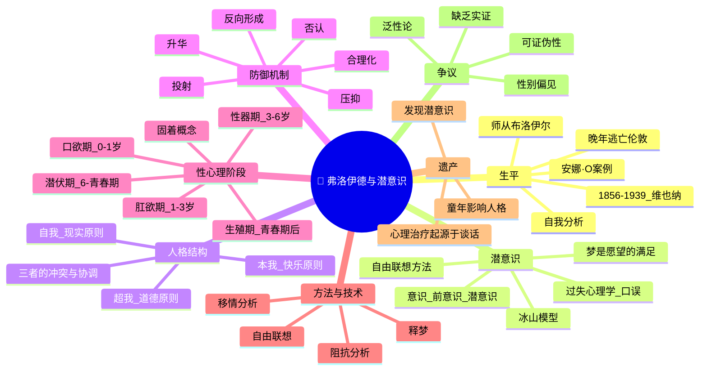

# Day 02：弗洛伊德与潜意识的暗黑大陆

> **悬疑提要**：1880年，维也纳，一个21岁的女孩开始出现奇怪的症状——她咳嗽到呕吐，右臂瘫痪，间歇性失明，还会忽然忘记自己的母语。医生检查了她的神经——没有任何问题。她的身体是健康的。但她的身体不这么认为。这个东西后来有了一个名字：**癔症（Hysteria）**。而探索它的旅程，揭开了人类潜意识大陆的第一张地图。

---

## 🍅 番茄 6/60：悬疑开场——安娜·O的诅咒

### 一桩神秘的"模仿案"

1880年的维也纳，21岁的**贝尔塔·帕本海姆**（在病例中她被称为**安娜·O**）正在照顾她垂死的父亲。她日夜不休，筋疲力尽，然后——她的身体开始叛变。

她先是咳嗽。持续的、无法抑制的干咳，像是肺里有东西出不来。然后是右臂瘫痪。然后间歇性失明。然后她开始无法喝水——不是没胃口，是真的"忘记"怎么吞咽。最奇怪的是：**她会忽然忘记德语，只能说英语**，而且她自己不知道自己在说英语。

如果这发生在300年前，她会被认为是中邪了。如果发生在今天，医生会告诉她这是功能性神经障碍（FND）。但在1880年，她被交给了**约瑟夫·布洛伊尔**——维也纳最受尊敬的内科医生之一。

布洛伊尔是个好人。他没有说"你装的"，也没有说"你疯了"。他做了当时最前卫的事情——**他坐下来，听她说话。**

### 谈话疗法（Talking Cure）的诞生

安娜·O给布洛伊尔的方法起了个名字：**"扫烟囱"（Chimney Sweeping）**。

她说，如果她能把脑子里冒出来的那些奇奇怪怪的念头说出来——不管多荒谬、多羞耻、多不连贯——她的症状就会暂时消失。

比如，她不能喝水这个症状。在催眠状态下，她讲述了自己如何看到一只狗从水杯里喝水，感到恶心但又不好意思说。醒来后，她的恐水症就消失了。

布洛伊尔把这叫作**"谈话疗法"**——你做梦都想不到，整个人类对潜意识的探索，起源于一个女孩觉得"把堵在嗓子眼的话说出来会舒服些"。

然后布洛伊尔干了一件不太光彩的事：他太沉迷于安娜·O的治疗了，以至于他的妻子开始吃醋。据说他最后对安娜·O说"我们的治疗到此为止"，然后和妻子去威尼斯度了蜜月。安娜·O的病情随后急剧恶化。

但在这之前，布洛伊尔已经把这个神奇的案例告诉了另一个医生——**西格蒙德·弗洛伊德**。

### 弗洛伊德的直觉

弗洛伊德听完这个案例，像被雷劈中了一样。

他在想什么呢？他在想：如果一个人的身体出现症状，但神经是完好的——那是什么让她的身体"假装"生病？

他的答案是：**有一种她不知道的力量，在操控她的身体。**

这种力量看不见、摸不着、病人自己意识不到——但它的效果是真实的。胳膊真的瘫痪了，眼睛真的看不见了。不是装的。

弗洛伊德管这个东西叫**潜意识（the Unconscious）**。

他不是第一个发现潜意识的人。哲学家叔本华和尼采都提到过类似的东西。但弗洛伊德是第一个说：**把它当作一个科学假设，然后用临床方法研究它。**

而他的工具，就是布洛伊尔和安娜·O无意中发明的——谈话疗法。只是弗洛伊德对它做了升级：不再需要催眠，只需要病人躺在沙发上，随便说什么都可以。

他把这个升级版叫做——**自由联想（Free Association）**。

> **为什么"随便说什么"能治病？因为你说不下去的地方，就是你潜意识密封的盖子。**

### ✅ 费曼三句话

```markdown
🧠 **费曼三句话**
1. 潜意识不是一个"地方"，而是一个假设——人的心理活动中有一大部分不被自己知道，但真实地影响行为。
2. 日常例子：你忽然对一个陌生人莫名反感——你觉得"没理由"，但弗洛伊德会说你潜意识里把他和你过去的某个人联系起来了。
3. 我不确定的是：潜意识真的能被"揭露"而不造成伤害吗？有些东西锁着，是不是有锁着的理由？
```

### ❓ 悬疑追问

**弗洛伊德说潜意识的盖子一拉开，里面全是性、暴力和禁忌——但你有没有想过：万一潜意识里根本没有这些"黑暗"的东西，是弗洛伊德自己的潜意识投射进去的呢？精神分析究竟是发现了潜意识，还是发明了潜意识？**

### 📌 连线笔记

回想你上一次"口是心非"的时刻——你说"没事"，但心里翻江倒海。弗洛伊德会问：那个"翻江倒海"是什么？你为什么不直接说？

---

## 🍅 番茄 7/60：心灵的地质学——本我、自我、超我

### 你家有三个主人

弗洛伊德最初的心灵模型像是一座冰山：水面以上是意识（conscious），水面以下是前意识（preconscious）和潜意识（unconscious）。

但他后来觉得这个模型太静态了。于是1923年，他提出了另一个更生猛的模型——**人格结构理论**：

**本我（Id）** ——原始欲望的沸腾大锅。它遵循**快乐原则**。"我想要，现在就要，必须给我。"本我没有逻辑，没有道德，没有时间观念。它是一个婴儿：饿了就要吃，不管妈妈在不在睡觉。

**超我（Superego）** ——内化的父母和社会规训。它遵循**道德原则**。"你应该这样，你不该那样。"超我是你五岁时被训斥的每一句话的总和，是你内心里那个严厉的审判官。

**自我（Ego）** ——夹在中间的可怜协调者。它遵循**现实原则**。自我每天的工作就是：安抚本我（"忍一忍，我们等等再吃"）、讨好超我（"我知道这是不对的，我会控制住"）、同时面对现实世界（"但外面的人都在看着呢"）。

弗洛伊德的深刻在于：**他不是说你有"性格弱点"才这样。他说这就是人类心灵的底层结构——每个人都是这样。**

### 三个主人的日常博弈

想象你在减肥。深夜11点。

- **本我**尖叫：**吃那个蛋糕！它就在冰箱里！现在！马上！**
- **超我**怒吼：**你还有脸吃？你昨天也说减肥！你是个没意志力的废物！**
- **自我**呢？自我会想出一些折中方案：**好吧，吃一小口……然后就吃一小口。明天一定好好运动。**

看出来没有？自我永远在"拆东墙补西墙"。它在两个暴君之间当和事佬。

弗洛伊德说，精神健康的关键，是**自我足够强大**——能够在不完全压制本我的情况下，也应对超我的苛责，同时还能在现实中活得好。

### 焦虑的信号系统

当三个主人的冲突升级，自我会发出警报——**焦虑**。

弗洛伊德区分了三种焦虑：
- **现实焦虑**：外面真有一只老虎（正常，跑就对了）
- **神经症焦虑**：潜意识里有个欲望快要冲出来了，自我害怕失控
- **道德焦虑**：超我说"你完蛋了，你是一个坏人"

然后自我会启动**防御机制（Defense Mechanisms）**——潜意识的"谎言"，用来防止自己被冲突压垮：

| 防御机制 | 定义 | 生活中的例子 |
|----------|------|-------------|
| 压抑（Repression） | 把痛苦的记忆推入潜意识 | "我完全记不得那件事" |
| 否认（Denial） | 拒绝接受现实 | "我没醉！我还能再喝！" |
| 投射（Projection） | 把自己不想要的感受说成别人的 | "不是我生气，是你生气了" |
| 合理化（Rationalization） | 编个听起来合理的理由 | "我辞职是因为公司价值观有问题" |
| 升华（Sublimation） | 把原始冲动转化为社会接受的行为 | 愤怒的人去练拳击 |
| 反向形成（Reaction Formation） | 表现与真实感受相反 | 越讨厌一个人，对他越客气 |

> **弗洛伊德最狠的一个洞察：你不是在对自己撒谎——是潜意识在对你撒谎，而你自己信了。**

### ✅ 费曼三句话

```markdown
🧠 **费曼三句话**
1. 本我是"我要"，超我是"不许要"，自我是"那我少要一点"——每个人心里每天都在演这出三角戏。
2. 日常例子：你买了一件很贵的东西然后后悔——本我享受了买的快感，超我开始了审判，自我试图解释。
3. 我在想：防御机制听起来像作弊，但它们可能帮我们活下来了。如果一个人完全没有否认机制——他是不是每天要面对太多真相而崩溃？
```

### ❓ 悬疑追问

**弗洛伊德说心理健康=强大的自我。但一个"过于强大"的自我，是不是就成了一个精于自我欺骗的人？把什么都消化了、什么都看开了的人，到底是真的健康，还是只是麻木了？**

### 📌 连线笔记

下次你因为小事暴怒的时候，试着问自己：这件事真的值得我这样生气，还是它触动了某个被压抑的旧伤？

---

## 🍅 番茄 8/60：性心理发展的五个阶段——你怎么变成现在这个样子的

### 一个让你不舒服的理论

弗洛伊德最招骂的理论，没有之一。

他说人的**性欲（Libido）** 不是青春期才开始的，而是**从出生那一刻就有了**。只不过它最开始不是指向"性"，而是指向身体的某些敏感区域——他叫它们**动欲区（Erogenous Zones）**。

每个阶段，动欲区不一样，冲突也不一样。如果你在某个阶段"卡住了"，成年后的性格就会表现出那个阶段的特征——这叫**固着（Fixation）**。

### 阶段1：口欲期（Oral Stage）——0~1岁

动欲区是嘴巴。婴儿通过吸吮、咬、吃获得快感。信任感和安全感在这里形成。

**如果固着**：
- 口欲期满足不足 → 成年后：咬指甲、吸烟、暴饮暴食、话多
- 口欲期过度满足 → 成年后：过度依赖别人（"我还像个婴儿一样需要被喂"）

**名言**：你是什么时候学会第一次说"不要"的？弗洛伊德说那就是口腔期的对抗——你通过咬来确立你的边界。

### 阶段2：肛欲期（Anal Stage）——1~3岁

动欲区是肛门。如厕训练是人生的第一场"权力的游戏"：父母说"你现在应该自己上厕所了"，孩子发现"我可以用拉不拉来反抗"。

**如果固着**：
- 父母训练太严格 → 成年后：**肛门滞留型**——完美主义、固执、吝啬、爱囤积
- 父母训练太宽松 → 成年后：**肛门排泄型**——邋遢、无序、浪费、过于随性

**名言**：这就是阿德勒后来骂弗洛伊德"你对金钱的态度=你对大便的态度"的出处。

### 阶段3：性器期（Phallic Stage）——3~6岁

动欲区是生殖器。这是最"精彩"也最受争议的阶段。

弗洛伊德说，男孩在这个阶段会对母亲产生性欲望（不是你想的那种，是儿童式的占有欲），同时把父亲视为竞争对手，又害怕被父亲惩罚（阉割焦虑）。女孩则发现自己没有阴茎，产生"阴茎羡妒"（Penis Envy），转向父亲。

这就是著名的**俄狄浦斯情结（Oedipus Complex）**——名字来自那个杀父娶母的希腊悲剧。

**如果固着**：成年后自恋、虚荣、莽撞，或者在性方面有问题。

### 阶段4：潜伏期（Latency Stage）——6岁~青春期

性冲动"休眠"了。孩子把精力投入到学习、交友、运动中。这是相对平静的时期——至少在性心理上。

### 阶段5：生殖期（Genital Stage）——青春期之后

前几个阶段的性冲动重新激活。目标不再是身体某个部位，而是**与他人建立成熟的性关系**。

弗洛伊德说：一个人的心理健康程度，取决于他能否顺利走到这个阶段——也就是能否从"自恋"走向"爱别人"。

### 这理论有什么价值？（除了惹人生气之外）

诚实地说：**弗洛伊德的性心理发展理论，在今天已经不被主流心理学接受**。

但是——

1. **他是第一个说"童年经历影响成年人格"的人**——这是他最大的遗产。今天我们说的"原生家庭"，某种意义上都是弗洛伊德的徒子徒孙。
2. **固着的概念**，虽然具体阶段不对，但"早期经历会留下心理烙印"这个核心思想是对的。
3. 他说性不仅仅是"交配行为"，而是更广义的**生命能量**——快乐、创造、连接。这个视角影响了整个西方文化。

### ✅ 费曼三句话

```markdown
🧠 **费曼三句话**
1. 弗洛伊德说童年的"性"不是成人的性，而是身体快感——嘴巴、肛门、生殖器依次成为快感中心，每个阶段处理不好会留下性格烙印。
2. 日常例子：你是一个特别爱囤东西的人？弗洛伊德会说你可以回想你的如厕训练期……好吧，你先别急着骂我。
3. 我的质疑：这个理论的证据在哪里？大部分来自临床个案而非实验，而且严重性别偏见。但它像一副眼镜——戴上它看人，确实能看到一些以前看不到的东西。
```

### ❓ 悬疑追问

**为什么弗洛伊德的理论——一个被科学反复否定的理论——在文学、电影、艺术、甚至日常对话中依然活得这么好？是否有这样一个可能：科学的"对"和真理的"对"是两回事？**

### 📌 连线笔记

你注意过吗？有些人特别爱囤东西、舍不得扔；有些人特别爱干净、反复洗手。弗洛伊德会说，这些都和你"如厕训练年代"有关。你觉得荒谬？去看看你妈是怎么训练你上厕所的——然后你再想想你的生活习惯。

---

## 🍅 番茄 9/60：🧠 思维导图 + 费曼大复习

> 这个番茄不学新内容。用思维导图把前三颗番茄串起来。

### 🧠 Day 02 思维导图



> **如何阅读此图**：从中心开始向外读。注意"争议"分支——弗洛伊德的伟大不在于他全对，而在于他提出了对的问题。

### 🎤 费曼大挑战

试着用**讲给一个正在约会的人听的方式**解释"防御机制里的投射"。

> *（提示：你可以从"你有没有遇到过那种特别爱吃醋的男朋友？他说是你太招蜂引蝶——其实是他在看别的女生……"开始）*

**写下来：**

```
[你的版本]
```

### 🔗 连回生活

- 你今天有没有"不小心"忘掉什么事？弗洛伊德说没有意外——你是不是不想做那件事？
- 你有没有特别反感某个类型的人？可能是你潜意识里不愿意承认自己也有那部分。
- 你最近做的梦——别急着搜索周公解梦，先想想最近三天发生了什么。

---

## 🍅 番茄 10/60：刻意练习 + 悬疑推理

### 案例1：总是"忘记"重要约会的朋友

你有这样的朋友吗？或者你自己就是——每次说"我们下周见"，结果当天就"哎呀我忘了"。不是一次两次，是**每次**。

**弗洛伊德的分析：**

这不是忘记。这是**抵抗（Resistance）**。

你潜意识里不想赴约。可能是你觉得这个人让你紧张，可能是你怕面对某个话题。但你的意识不允许你承认自己"不想去"（因为那显得你不礼貌、不友善），所以潜意识替你做了个决定——**忘掉**。

记住弗洛伊德的口头禅：**"没有意外。"**

| 你的意识说 | 潜意识真正在想 |
|------------|---------------|
| "我忙忘了" | "我不想见你" |
| "我迟到了，堵车" | "我害怕准时到" |
| "我又把钥匙弄丢了" | "我不想回家" |

**刻意练习**：下次你犯了一个"小错误"——迟到、忘带东西、说错话——停下来问自己：**如果这不是意外，这个行为在帮我避免什么？**

### 案例2：你做了一个梦——这些意象代表什么？

弗洛伊德在《梦的解析》里说，梦是**"愿望的满足"**。不是字面意义的满足，是被压抑的欲望用伪装的方式溜出来。

常见梦的弗洛伊德式分析：

| 梦境内容 | 你醒来的感觉 | 弗洛伊德可能的解释 |
|----------|-------------|-------------------|
| 掉牙齿 | 焦虑、不安全感 | 害怕失去吸引力（牙=性象征）或害怕衰老 |
| 被追赶 | 恐惧、逃不掉 | 你在逃避某个你不愿面对的冲动或记忆 |
| 飞起来 | 自由、快乐 | 性愿望的满足（弗洛伊德什么都能扯到性…有时候他是对的） |
| 考试没准备好 | 焦虑 | 你在现实生活中面临"被评估"的压力 |
| 亲人去世 | 悲伤、内疚 | 可能是你对那个人有隐藏的敌意（！） |

⚠️ **重要警告**：弗洛伊德的释梦不是"查字典"。他认为同一个意象对不同的人有不同的意义。他关注的是**联想链**——梦里那个东西让你想到什么？再想到什么？一直挖到最原始的情感。

**刻意练习**：回忆最近的一个让你印象深刻的梦。写下三个关键词，然后分别问自己：**这个关键词让我想到什么？** 连续问三次，看你能挖到什么。

### 练习题：用弗洛伊德的框架分析一个"口误"

找一个你最近（或曾经）说过的**经典口误**——那种你说完就后悔的话。

用弗洛伊德的框架分析：
1. **你想说的是什么？**（显性意图）
2. **你实际说的是什么？**（口误结果）
3. **这个口误暴露了什么？**（潜在冲突——可能是你不愿承认的念头）

<details>
<summary><b>🔍 示范案例（先写你自己的再点开）</b></summary>

**场景**：你在朋友聚会上介绍你的新男友。你想说："这是我男朋友，我们在一起很开心。" 实际说的是："这是我男朋友，我们在一起很辛苦。"

**弗洛伊德式分析**：
1. **显性意图**：展示你们关系幸福
2. **口误结果**："辛苦"
3. **潜在冲突**：你们的关系最近确实有很多摩擦，但你不愿意在公共场合承认——潜意识替你说出来了。

这就是**口误（Freudian Slip）** ——没说错话，只是说了实话。

</details>

### 📊 今日进度

```
Day 02/12 [████████████████████░░░░] 10/60 🍅
弗洛伊德揭开了潜意识的第一层皮。明天我们去见他的叛徒王储——荣格。
```

### ✅ 今日备考卡片

| 概念 | 一句话解释 |
|------|-----------|
| 潜意识 | 你不让自己知道的那部分心理活动，但它知道你是怎么回事 |
| 自由联想 | 躺下来随便说，说不下去的地方就是问题所在 |
| 本我/自我/超我 | 本我是野兽，超我是警察，自我是夹在中间和稀泥的 |
| 俄狄浦斯情结 | 你小时候想独占妈妈/爸爸，把另一个视为竞争对手 |
| 防御机制 | 潜意识用来保护你免受真实情绪伤害的"谎言" |
| 口误 | 你真实的念头抢在你"得体"的话之前溜出来了 |
| 固着 | 小时候某个阶段没处理好，成年后又在重复那个阶段的行为 |
| 梦是愿望的满足 | 梦是潜意识在睡眠中偷偷实现的愿望（虽然伪装了） |
| 抵抗 | 你在治疗中"突然想不起来"任何事——那是潜意识在保护自己 |
| 移情 | 你把小时候对父母的情感，投射到了治疗师（或者现在的伴侣）身上 |

---

**→ 明日预告：[[Day03-荣格与集体潜意识的深海]]**

弗洛伊德说潜意识是你个人的地下储藏室。但荣格说不对——那个地下室下面还有一个更大的空间，里面住着全人类。明天我们去看一个在塔楼里对着石头说话的男人，如何发现了人类心灵的共同密码。
