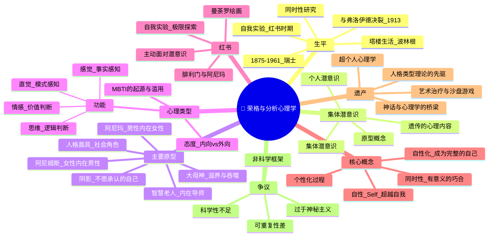

# Day 03：荣格与集体潜意识的深海

> **悬疑提要**：1913年，一个38岁的瑞士男人辞去了大学教职，放弃了他即将到手的国际声望，把自己关进了一间书房。他每天花几个小时和自己的幻觉对话。他听到体内有一个声音在说话。他画了上百幅神秘诡异的曼荼罗。他记录了自己所有的梦和幻象，写成了一本后来被称为《红书》的巨著——这本书在他死后藏了半个世纪才敢出版。外界说他疯了。荣格说：不，我是在做一场人类历史上最大胆的自我实验。

---

## 🍅 番茄 11/60：悬疑开场——王储叛变了

### 精神分析界的世纪决裂

1907年，两个男人第一次见面。他们在弗洛伊德的维也纳公寓里聊了整整13个小时——没有停下来吃饭，完全忘了时间。

一个是52岁的弗洛伊德——精神分析的教父、潜意识大陆的发现者、抽雪茄的维也纳老绅士。另一个是32岁的卡尔·古斯塔夫·荣格——瑞士伯尔尼一个乡村牧师家庭的儿子、苏黎世伯戈尔茨利精神病院的年轻医生，俊朗、高大、充满智慧和魅力。

弗洛伊德认定荣格是他的**王储**——精神分析运动的继承人。他写信给荣格说："你是我最亲爱的儿子。"

为什么是荣格？不是因为荣格是最听话的学生——恰恰相反。弗洛伊德的其他追随者大多是犹太人（弗洛伊德本人也是犹太人），他担心精神分析会被贴上"犹太科学"的标签。他需要一个**雅利安人**来领军，而荣格是完美的选择。

但父子关系从来都不容易，在精神分析界尤其如此。

### 裂缝从哪里开始？

荣格从一开始就觉得弗洛伊德的理论少了些什么。他去维也纳拜访弗洛伊德时，弗洛伊德正在大谈**梦是愿望的满足**。荣格问：弗洛伊德先生，有些梦是不是不止于此？比如一些神话中的意象——那些无法用个人经验解释的东西？

弗洛伊德说：那是"死亡愿望"或"压抑的欲望"。

荣格不服。

然后荣格做了一个有点"淘气"的实验。他问弗洛伊德关于**"心灵感应"**（telepathy）的看法。弗洛伊德当即否认："那是不可能的！那是胡说八道！"

就在那一瞬间，荣格感受到弗洛伊德的身体里传来一声巨响——像是一声**爆炸**。他后来说，那不是物理的声音，是一种心理上的"砰"的感觉。

从此荣格心里有了一个想法：如果弗洛伊德对超自然现象的反应如此激烈——那恰恰说明他自己内心深处也相信它，只是用强力压制着它。

**弗洛伊德最著名的弟子，发现了弗洛伊德也有潜意识。**

### 慕尼黑酒店的最后摊牌

1913年，两个男人在慕尼黑一家酒店里大吵了三天。

分歧太多。

弗洛伊德说：潜意识的内容是被压抑的性欲望。荣格说：潜意识比那深得多——里面有全人类的共同遗产，和性没有直接关系。

弗洛伊德说：宗教是集体幻觉。荣格说：宗教是人类心灵的集体表达——你消灭不了它，你得理解它。

弗洛伊德说：你反对我，是因为你有俄狄浦斯情结，你把我当作父亲来反抗。荣格说：这不再是一个有用的框架了——你把它用成了万金油。

三天后，荣格起身离开了酒店。两人终生再未相见。

### 崩溃与《红书》

和弗洛伊德决裂后，荣格经历了人生最黑暗的六年（1913-1919）。他出现幻觉，看到大洪水淹没欧洲，看到尸体漂在河流上（几个月后一战爆发）。他每天和自己的内心对话，**主动走进精神病状态——然后试图走回来。**

他记录下所有的对话、图像、幻想。用的是一本红色皮革封面的书——这就是后来震惊世界的**《红书》（The Red Book）**。

荣格在里面没有写日记，他在画**曼荼罗**。他在和两个"老师"对话——一个叫**腓利门**（Philemon）的智慧老人（后来他说那是一个存在于他内心的独立人格），还有一个叫**阿尼玛**（Anima）的女性声音。

看到这里你可能会觉得：等等，荣格真的疯了。

但荣格自己知道他没有疯。他说：**"我不是在发疯。我在让潜意识做它想做的事，这样它就不会在我不知情的时候控制我。"**

他把这个过程叫作**自性化（Individuation）**——不是变成"更好的自己"，而是**成为完整的自己**。包括你那些不敢见人的部分。

> **荣格的原话："我不是那些发生在我身上的事，我是我选择成为的样子。"**

### ✅ 费曼三句话

```markdown
🧠 **费曼三句话**
1. 荣格和弗洛伊德决裂的根本原因：弗洛伊德说潜意识=被压抑的个人欲望（尤其是性欲），荣格说潜意识还有一个更深的层次——全人类共享的集体潜意识。
2. 日常类比：弗洛伊德的潜意识像你自己的地下室，堆满了你不敢面对的旧物；荣格的潜意识像海洋——你的个人地下室其实和所有人共用一条暗河。
3. 我不确定的是：荣格的"自我实验"是天才的探索还是危险的自我催眠？一个人和幻觉对话，怎么保证最后走出来的是更清醒的他？
```

### ❓ 悬疑追问

**荣格在《红书》里引导自己"主动发疯"，然后活着回来写成理论。这引出一个可怕的问题：精神病和创造力之间的边界在哪里？如果精神分裂者看到的世界和荣格看到的是一样，区别只是荣格能走出来——那人性的"正常"和"异常"，是不是只有一步之遥？**

### 📌 连线笔记

你曾经有没有过那种"某个直觉强烈到不像是从自己脑子里长出来的"时刻？写作时的灵感、做梦时解开的难题、莫名其妙对一个人做的正确判断——荣格会说，那刚好不是"你"，那是集体潜意识在说话。

---

## 🍅 番茄 12/60：集体潜意识与原型——人类共享的梦境

### 一个让荣格震惊的发现

荣格在治疗病人时注意到一个奇怪的现象：**很多病人报告的梦境和幻觉，和全世界的古老神话、宗教故事、民间传说高度重合。**

一个精神分裂症患者可能会看到一个长着翅膀的太阳轮——他不知道这是什么，但这个意象也出现在古埃及的壁画中。一个从来没读过圣经的病人，会梦到和基督复活一模一样的场景。

荣格想：**这不可能是巧合。这些意象不是从个人经验来的。它们来自某个所有人共享的、更古老的层面。**

他给这个东西起名叫**集体潜意识（Collective Unconscious）**。

你可以这样理解：
- **个人潜意识**：你忘记了的童年记忆、你压抑的冲动——这是弗洛伊德的领地
- **集体潜意识**：你出生之前就存在于人类心灵中的"原始模式"——你的大脑自带的操作系统

### 原型（Archetypes）：心灵的骨架

荣格说集体潜意识的内容，是一些**原型**——普遍的心理模式。

你可以把原型想象成**身体的骨架**：所有人都有骨架（结构相同），但肌肉、脂肪、皮肤（个人经验）让我们看起来不一样。原型就是心理的骨架。

#### 最重要的几个原型：

**1. 人格面具（Persona）**

你在外面给人看的那张脸。上班时的你、见家长的时的你、发朋友圈的你——这些都是面具。你不是在"装"，你是在适应社会。

问题是：当你太认同你的面具，你会忘掉面具下面是啥。

**2. 阴影（Shadow）**

你不愿意承认的那部分自己。所有你觉得自己"不是那样的人"——自私、嫉妒、愤怒、好色、贪婪——都是阴影。

荣格的洞见：**你越是否认你的阴影，它越强大。** 那些一天到晚说"我从来不生气"的人，往往是发怒起来最可怕的人。

**3. 阿尼玛（Anima）/ 阿尼姆斯（Animus）**

每个男人心里有一个内在的女性形象（阿尼玛），每个女人心里有一个内在的男性形象（阿尼姆斯）。

这不是说"男人心里住着女人"那么简单。荣格的意思是：**你需要和你内心的"另一半"对话，才能成为完整的人。** 男人否认自己的情感面（阿尼玛），会变得僵硬、冷漠；女人否认自己的果断面（阿尼姆斯），会失去自己的力量。

**4. 智慧老人（Wise Old Man）**

甘道夫、尤达、邓布利多的原型。象征着指引、智慧、内在的知识。当你在人生中感到迷茫时，你会梦到或遇到"智慧老人"——那是你内在智慧的外在投射。

**5. 大母神（Great Mother）**

大地、子宫、包容、滋养。也包含吞没、窒息、束缚——母亲不只是善良的，她也是让你无法脱离的那个人。

### 为什么所有神话都长一个样？

你去看：
- 每一个文明都有**英雄**（出生卑微→被召唤→历经考验→凯旋归来）
- 每一个文明都有**创造神话**（混沌→分离→诞生）
- 每一个文明都有**救世主**（化身→受难→重生）

约瑟夫·坎贝尔写了《千面英雄》，总结了所有文明的英雄故事的共同结构——他直接受荣格影响。而《星球大战》的乔治·卢卡斯又受了坎贝尔的影响。所以：**尤达=智慧老人原型，达斯·维达=阴影原型的黑暗面，天行者卢克的旅程=每个文明都在讲的同一个故事。**

荣格说了句狠话：**不是前人创造了神话，是神话创造了人类。**

### ✅ 费曼三句话

```markdown
🧠 **费曼三句话**
1. 集体潜意识不是"你"的记忆，是你出生前就存在于人类心灵中的"原始模式"——一些普遍的意象和故事模式，所有文化都会自动地、独立地重复创造它们。
2. 日常例子：你从来没有经历过战争，但你看战争电影时会热血沸腾——那不是你的个人记忆在反应，是"英雄原型"在所有人心中被激活。
3. 我的困惑：集体潜意识到底是怎么"遗传"的？如果它不是生物学的（DNA），也不是文化的（教育），那它是什么？荣格没有给出现代科学能接受的解释。
```

### ❓ 悬疑追问

**如果集体潜意识真的存在，那"我"的边界在哪？你以为是你自己的想法——有没有可能你只是在"借用"全人类思想库里的模板？你的原创性，到底有多原创？**

### 📌 连线笔记

你看电影的时候，有没有某个情节让你莫名其妙地流泪——不是因为故事感动了你，而是有一种"古老而熟悉"的感觉？那个就是原型在说话。你认出了你已经认识了十万年的角色。

---

## 🍅 番茄 13/60：人格类型——内向和外向的发现

### MBTI的真正爹是谁？

你肯定做过MBTI。你是INTJ？ENFP？ISTP？

MBTI（迈尔斯-布里格斯类型指标）的直接来源是荣格1921年出版的《心理类型》——但他要是知道后来MBTI被用成了相亲简历上的标签，估计会从坟墓里翻个白眼。

荣格提出两种基本态度：
- **外向（Extraversion）**：能量流向外部——你通过和人交往、行动、体验外部世界来充电
- **内向（Introversion）**：能量流向内部——你通过独处、思考、沉浸内心世界来充电

这是他第一次有人系统定义这两个概念。在荣格之前，"害羞"和"孤僻"就是内向，"开朗"就是外向。荣格说：**你们搞错了。这不是性格好坏的问题——这是能量流动的方向问题。**

### 关键区分：内向≠社交恐惧

这是后世最大的误解。荣格特别强调：
- **内向的人也能社交**——只是社交会消耗他们的能量，需要独处来恢复
- **外向的人也能思考**——只是思考需要和人交流来激发能量

你不喜欢大型派对？你不是有病。你只是充电方式和别人不一样。

### 四种心理功能

除了内向外向，荣格还提出了四种心理功能：

| 功能 | 描述 | 用大白话说 |
|------|------|-----------|
| **思维（Thinking）** | 用逻辑和原则做决定 | "这合理吗？" |
| **情感（Feeling）** | 用价值和感受做决定 | "这感觉对吗？" |
| **感觉（Sensation）** | 通过五官感知具体事实 | "我看到、听到、摸到什么？" |
| **直觉（Intuition）** | 通过直觉感知模式和可能性 | "这背后意味着什么？" |

然后他把两种态度×四种功能=8种类型。MBTI在此基础上做了扩充——加上了判断/感知维度（J/P）——变成了16种。

### 荣格本人的类型

荣格是**内向直觉型**——极度内向，靠直觉理解世界。他老年时在瑞士塔楼里过着半隐居的生活，每天和石头说话（真的），记梦，画曼荼罗。不了解他的人觉得他怪。了解他的人知道他不是怪——他是用他的方式为人类探索心灵。

他说过一句著名的话：**"孤独不是因为身边没有人，而是因为无法和别人交流对自己来说重要的东西。"**

这句话，内向的人都懂。

### ✅ 费曼三句话

```markdown
🧠 **费曼三句话**
1. 内向和外向不是"好相处"和"难相处"的区别，是能量来源方向的差异——内向的人从内部充电，外向的人从外部充电。
2. 日常例子：周五晚上，外向的人想出去party（充电），内向的人想回家躺着（充电）——两种方式都是在"充电"，不是在逃避。
3. 我想说的是：MBTI被滥用了，但荣格的原始洞察——人类有不同的信息处理方式——是真诚且深刻的。只是后来被做成了星座2.0。
```

### ❓ 悬疑追问

**如果荣格是对的——内向和外向是先天不同的能量系统——那为什么现代社会几乎所有的成功学都在教人"变得更外向"？我们是不是在用一套标准来衡量所有人的健康？而那套标准恰恰是外向者写的？**

### 📌 连线笔记

回想你"充能"最快的方式——是一群人狂欢后身心舒畅，还是一个人读完一本书感觉神清气爽？答案告诉你你的能量方向。不管你是哪种，你都没毛病——但了解这个区别，可能解释你人生中很多"我不知道哪里不对劲"的时刻。

---

## 🍅 番茄 14/60：🧠 思维导图 + 费曼大复习

> 这个番茄不学新内容。用思维导图把前三颗番茄串起来。

### 🧠 Day 03 思维导图



> **如何阅读此图**：从中心开始向外读。注意"争议"分支——荣格是心理学家中最像魔法师的一个。你信他还是不信他，可能取决于你的心理类型。

### 🎤 费曼大挑战

试着用**看电影选角色的方式**解释"什么是原型"。

> *（提示：你可以从"你有没有发现日本漫画和美国超级英雄讲的是同一个故事？不是巧合——"开始）*

**写下来：**

```
[你的版本]
```

### 🔗 连回生活

- 你做的梦里有某些重复出现的角色吗？（追赶你的黑影？帮助你的老人？）那些就是你的原型在做客。
- 你最近在别人身上特别讨厌的一个特质——你能不能在自己身上找到同样的东西？（阴影练习）
- 你在朋友圈和在家里，是一个人吗？差多少？那个差值就是你的面具。

---

## 🍅 番茄 15/60：刻意练习 + 悬疑推理

### 案例1：一个总是梦见被追赶的人

**双重视角分析——弗洛伊德 vs 荣格**

| 维度 | 弗洛伊德会怎么说 | 荣格会怎么说 |
|------|-----------------|-------------|
| **梦的本质** | 被压抑的愿望以伪装形式出现 | 潜意识的补偿功能：意识忽略的东西，梦境会补充 |
| **被追赶代表什么** | 你潜意识里在性方面有冲突——"追赶者"可能是你压抑的性欲望或俄狄浦斯情结的残余 | "追赶者"是你的**阴影**——你不愿承认的那部分自己在追杀你 |
| **为什么是逃不掉** | 因为你无法逃开自己压抑的东西 | 因为你越逃，阴影越强大。解决方案不是逃——是**转身面对它** |
| **治疗方向** | 帮来访者意识到自己压抑的欲望，释放被压抑的能量 | 帮来访者**与阴影对话**——问它"你想告诉我什么" |

**荣格给这个案例的"处方"**：
下次梦见被追赶的时候——**在梦里停下来，转身**。看着那个追赶你的东西。问它：你是谁？你为什么追我？

荣格记录过很多这样的案例：病人被噩梦困扰多年，然后在梦里"转身面对黑影"，发现黑影是一个戴着面具的存在，面具一摘，露出的是某种被抛弃的力量或智慧。

> **荣格的名言："我不喜欢我的阴影，但我不假装它不存在。否则它会在半夜来敲门。"**

### 案例2："影子工作"练习——你在别人身上讨厌的，是你自己不承认的

这是一个荣格式的经典实验。有点尴尬，但极其有效。

**步骤如下：**

1. **想一个你特别讨厌的人**——不一定是大坏蛋，可能是同事、邻居、甚至亲戚。关键是**你一听到他的名字就来气**。

2. **列出你在他身上最不能忍的三个特质**。比如：自大、虚伪、爱抢风头。

3. **现在来真的了**：问自己这三个问题：
   - 我身上有没有一点点（哪怕是一点点）同样的特质？
   - 如果我也有——我是不是特别不愿意承认，所以才那么讨厌别人表现它？
   - 如果我真的完全没有这个特质——那为什么它会引起我这么大的反应？（一个你不吃榴莲的人，会对榴莲生气吗？不会，你只是不吃而已。极端的情绪反应暗示涉己。）

**荣格的论点**：你在这个世界上看到的一切"极度令人不悦"的东西，都是你自己的镜中倒影。

不是说你=坏人。是说：**你没有整合到自己人格里的部分，会投射到外部世界，变成"敌人"。**

### 练习题：用原型分析你最喜欢的电影角色

选一部你最喜欢的电影（或小说、游戏），用原型的框架分析角色：

| 角色 | 可能的原型 | 为什么 |
|------|-----------|--------|
| 卢克·天行者 | **英雄** | 被召唤→历经考验→战胜黑暗→凯旋 |
| 尤达 | **智慧老人** | 引导主角，话中有话，看起来很小但智慧无穷 |
| 达斯·维达 | **阴影**+**堕落英雄** | 主角的内在黑暗面，同时也是英雄的堕落版本 |
| 莱娅公主 | **阿尼玛**（英雄的内在女性面） | 在早期处理中被低估，后来发现她有独立的力量 |

**现在选你自己的：**

```
电影/小说/游戏：_______________
主角：_________ → 原型：_________
反派：_________ → 原型：_________
导师：_________ → 原型：_________
女主角/男主角：_________ → 原型：_________
```

<details>
<summary><b>🔍 更多示例（先写你自己的再点开）</b></summary>

**《哈利·波特》**：
- 哈利→英雄原型（被选中的人、对抗伏地魔的旅程）
- 邓布利多→智慧老人原型（白胡子、关键时刻出现、给建议）
- 伏地魔→阴影原型（哈利不想承认的、自己也有黑暗面的可能性）
- 赫敏→阿尼姆斯（女性角色的理性/知识面向）

**《千与千寻》**：
- 千寻→英雄（被迫进入陌生世界→经历考验→成长→回归）
- 汤婆婆/钱婆婆→大母神（黑暗版本vs光明版本——一个吞噬，一个滋养）
- 无脸男→阴影（被忽视的、需要被看见的欲望）

</details>

### 📊 今日进度

```
Day 03/12 [████████████████████████████] 15/60 🍅
荣格把我们带进了集体潜意识的深海。明天去看那个说"老爸你的性理论不对，核心驱动力是自卑感"的叛徒二号——阿德勒。
```

### ✅ 今日备考卡片

| 概念 | 一句话解释 |
|------|-----------|
| 集体潜意识 | 全人类共用的心灵底层操作系统，装着同样的原始模式 |
| 原型 | 心灵的骨架——普遍的心理模式，在所有文化中自动出现 |
| 阴影 | 你不愿意承认的那部分自己，会投射到别人身上变成"我讨厌的人" |
| 阿尼玛/阿尼姆斯 | 你心里的异性形象——荣格说你需要和它对话才能完整 |
| 人格面具 | 你给别人看的那张脸——别太当真，但也别全扔掉 |
| 自性化 | 成为完整的自己——不是完美的自己，是包括黑暗面的完整的自己 |
| 心理类型 | 内向/外向是能量方向不同，不是社交能力不同 |
| 红书 | 荣格自我实验的记录——人类历史上最疯狂也最深刻的心理学日记 |
| 智慧的老人 | 内在导师原型的投射——甘道夫、邓布利多、尤达的共同祖奶奶 |
| 同时性 | "有意义的巧合"——不是因果关系，但你觉得这巧合不是偶然 |

---

**→ 明日预告：[[Day04-阿德勒与自卑的超越]]**

弗洛伊德说：性是驱动力。荣格说：原始模式是驱动力。阿德勒说：你们俩都错了——驱动力是"我配不上这个世界"的感觉，以及一生都在试图弥补它的努力。
