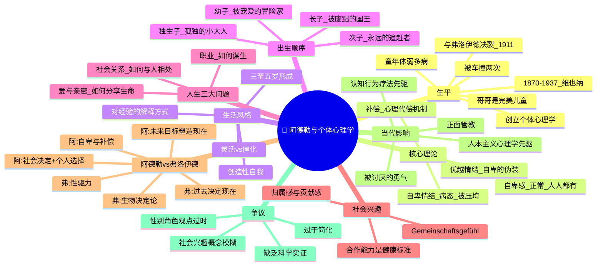

# Day 04：阿德勒与自卑的超越

> **悬疑提要**：1907年，维也纳精神分析学会的周三例会上，一个身材矮小的男人站起来发言。他说："弗洛伊德先生，我认为您搞错了。人类的核心驱动力不是性——是人类从出生就携带的一种'不够好'的感觉。我们一生都在试图摆脱这个感觉——有人因此成了伟人，有人因此成了罪犯。"

全场沉默了十秒钟。然后弗洛伊德阴森地说："阿德勒，你说的是一个我无法接受的观点。"

这场对话之后，精神分析运动最"叛逆"的一支——**个体心理学**——诞生了。而它的创始人，是一个从小在死亡边缘挣扎、被哥哥的光环压得喘不过气来的男孩。

---

## 🍅 番茄 16/60：悬疑开场——弗洛伊德最叛逆的弟子

### 不被看好的开局

**阿尔弗雷德·阿德勒**，1870年生于维也纳郊区一个犹太中产家庭。他是六个孩子中的老三。上面有一个哥哥——**西格蒙德·阿德勒**——家里所有人的骄傲。

哥哥是完美小孩：健康、高大、成绩优异、无可挑剔。阿德勒呢？他小时候患佝偻病，走路有点跛（因为软骨病导致腿形弯曲），差点死于肺炎，被车撞过两次——两次！他的童年记忆里有一个反复出现的画面：他穿着病号服躺在床上，听着哥哥在院子里和别的孩子玩耍的笑声。

他不是那种"考了99分妈妈说为什么扣了一分"的那种自卑。他是**真实的地狱开局**——身体告诉你世界不欢迎你。

但阿德勒后来写了一句话：**"任何一个经历过苦难并克服了它的人，都会变得强大。"**

### 从医学到心理学

阿德勒学的是眼科。后来转到了精神病学。1902年，他写了一篇文章为弗洛伊德的理论辩护，弗洛伊德亲自写信邀请他参加每周三的精神分析讨论会。

那时候弗洛伊德是他的偶像。

但阿德勒很快发现：他不同意弗洛伊德的核心假设。

弗洛伊德说：**潜意识冲突的核心是性。** 阿德勒看着他的病人——那些饥饿的、失业的、被社会碾压的底层人——他们的痛苦来自性压抑？不是。他们的痛苦来自**自卑感、社会地位的焦虑、对生存的恐惧**。

弗洛伊德说：**所有的行为都可以追溯到性驱力（Libido）。** 阿德勒说：那你怎么解释一个有抱负的年轻人拼命学习考医学院而不是去约会的"驱力"？

弗洛伊德说：那是**升华**——性的能量转化了。

阿德勒笑了。**这就像一个理论：所有现象都说明X——当遇到明显不是X的现象时，就说"X转化了"——这不是科学，这是神学。**

### 决裂

1907年，阿德勒发表了他的《器官自卑与心理补偿》——核心思想：**身体的缺陷会导致心理上的补偿努力。** 弗洛伊德看了之后冷淡地评价："阿德勒太有野心了。"

1911年，阿德勒正式退出维也纳精神分析学会，带走了一半的成员。精神分析运动从此分裂。

弗洛伊德后来评价阿德勒：**"一个偏执狂。"**

阿德勒评价弗洛伊德：**"一个天才，但他的天才'太有创造力'了——他的想象力常常跑在他的证据前面。"**

两个人都是对的。

> **当弗洛伊德说"性是所有行为的驱动力"时，阿德勒笑了。他说：不，驱动力不是性——是不够好。**

### ✅ 费曼三句话

```markdown
🧠 **费曼三句话**
1. 阿德勒和弗洛伊德的根本分歧：弗洛伊德说人受原始欲望（尤其是性欲）驱使，阿德勒说人受"我不够好"的感觉驱使——我们一生都在补偿这种感觉。
2. 日常例子：一个拼命追求升职加薪的人——弗洛伊德会说那是本我的欲望，阿德勒会说那是他童年时被哥哥的光芒盖过的"不够好"感受在驱动他。
3. 我在想：阿德勒的理论听起来比弗洛伊德更"合理"——但如果一切行为都是"补偿"，那爱也是补偿吗？创造力也是补偿吗？健康的人和不健康的人的区别在哪？
```

### ❓ 悬疑追问

**阿德勒说自卑不是病，是进步的唯一动力——那为什么有些人在自卑中崛起成马斯克，有的在自卑中沉沦为抑郁症？他们的"自卑"到底有什么区别？是自卑本身不同，还是他们应对自卑的方式不同？**

### 📌 连线笔记

想一个你觉得自己"永远比不上"的人——哥哥？同事？前任？——那种"他做什么都比我好"的感觉。阿德勒会说：那是你生命中最重要的驱动力。你怎么用它，决定了你成为谁。

---

## 🍅 番茄 17/60：自卑感与补偿机制——"我不够好"的超能力

### 自卑不是病，病的是"假装不存在的自卑感"

阿德勒最深刻、也最容易被误解的思想在这里。

首先，他区分了两件事：

**1. 自卑感（Inferiority Feeling）** ——所有人都有，正常，必要。

阿德勒认为：**人类文明的全部成就，都源于自卑感。** 我们打不过狮子、跑不过猎豹、没有熊的力量——我们感到"自卑"。然后呢？我们发明了弓箭、汽车、火箭。

自卑感不是一种病，它是一根刺。让你坐不住的刺。让你想要改变、成长、超越。

**健康的人的自卑感**："我还不够好。那我再努力一下。"

**2. 自卑情结（Inferiority Complex）** ——病态的，被夸大的，瘫痪性的。

"我在所有方面都不如别人。我努力也没用。因为我本来就是一个失败者。"

自卑情结的本质，是**一个人被自卑感压垮了**，失去了解决问题的勇气。他不再尝试超越，而是开始寻找"我是失败者"的证据来自我证实。

**不健康的人的自卑情结**："我还不够好。所以我干脆不做了。这样至少没人看到我失败。"

### 补偿（Compensation）：人类的核心心理动力

阿德勒说：人在面对自卑感时，会试图**补偿**。

就像身体上的代偿：一个盲人的听力特别敏锐。心理上也是一样——某方面的"不足"，会推动你在那方面或其他方面做到"超常"。

| 健康的补偿 | 病态的补偿 |
|-----------|-----------|
| "我数学不好，所以我加倍练习" | "我数学不好，所以我干脆自暴自弃" |
| "我性格内向，所以我学习如何深度连接少数人" | "我性格内向，所以我假装自己是外向者，耗尽了自己" |
| "我失恋了。我痛苦，但我学会了爱人先爱己" | "我失恋了。所有男人/女人都不是好东西" |

### 优越情结（Superiority Complex）：病态成功的面具

阿德勒的另一个毒辣诊断。

有一种人看起来非常"优越"——傲慢、自大、喜欢踩人。你会觉得："这人自信过头了吧？"

阿德勒说：**你看反了。** 真正的自信不会踩人。踩人的人，恰恰是因为内心极其自卑，才需要靠贬低别人来获得短暂的"优越感"。

这就是**优越情结**——它是自卑情结的伪装。

> "一个优越情结的人，不是在追求优越，他是在逃避自己的自卑。"——阿德勒

### 人生三大问题

阿德勒说，所有人一生要面对三大问题——它们共同组成了人生的全部任务：

1. **职业问题**：我如何在这个世界上生存？
2. **社会关系问题**：我如何与他人相处？
3. **爱与亲密关系问题**：我如何与另一个人分享生命？

这三个问题的核心，阿德勒说，是**合作的能力（Social Interest / Gemeinschaftsgefühl）**。

心理健康的人，在面对这三大问题时，表现出的是合作、共情、贡献。心理不健康的人，表现的是逃避、自私、控制。

**阿德勒名言**："所有失败者——神经症患者、精神病患者、罪犯、酗酒者、问题儿童——之所以失败，是因为他们在面对人生三大问题时，缺乏归属感和合作精神。"

### ✅ 费曼三句话

```markdown
🧠 **费曼三句话**
1. 自卑不是病——它是人类进步的唯一动力。病的是"自卑情结"（我被压垮了）和"优越情结"（我要踩别人来证明我不差）。
2. 日常例子：一个同事总是炫耀他的职位和收入——那不是自信，那是优越情结（内心：我害怕被人看不起）。一个真正自信的人不需要反复告诉别人他有多好。
3. 我在想：阿德勒把"社会兴趣/合作能力"作为心理健康的唯一标准——那有没有可能一个心理健康的人，选择了不合作的生活方式？比如隐士、艺术家？
```

### ❓ 悬疑追问

**阿德勒说心理健康=好的社会兴趣+合作能力。但历史上一些最伟大的创造者——卡夫卡、梵高、贝多芬——都是出了名的难相处、不合作的人。难道他们是"不健康"的？或者阿德勒的标准过于"社会适应"导向——忽视了在某种意义上的"创造性孤独"的价值？**

### 📌 连线笔记

下次你遇到一个特别喜欢炫耀的人——不要觉得他自信。试着想：他到底在补偿什么？这个视角会让你对"讨厌的人"多一点理解。不多，就多一点。

---

## 🍅 番茄 18/60：出生顺序与生活风格——家庭是如何编写人生脚本的

### 同一个父母，不同的孩子

你有没有观察过一个奇怪的现象：同一对父母养出来的孩子，性格天差地别？

阿德勒说：这是理所当然的。**每个孩子在家庭中的"心理位置"是完全不同的。**

弗洛伊德关注的是"你的父母怎么对你"。阿德勒关注的是——**你的兄弟姐妹在你前面还是后面，以及你怎么理解这个事实。**

### 阿德勒的出生顺序理论

**长子/长女（First-born）**：

曾经是"唯一的孩子"，享受着全宇宙的关注——然后弟弟妹妹来了。王座被推翻。你被废黜了。

阿德勒说：长子/长女一生都在经历这种**"废黜感"**（dethronement）。

性格特征：保守、责任感强、有领导欲、怀念"过去的好时光"、容易成为权威主义者。在兄弟姐妹中，长子/长女最容易成功——但他们的成功是"维护秩序"型的，不是"打破规则"型的。

**次子/中间子（Second-born / Middle child）**：

从出生就在追。前面有一个已经跑出去很远的——追赶者心态。

阿德勒说：次子/中间子通常最有竞争力、最叛逆、也最容易成功——因为他们**永远在追赶**。

性格特征：野心、竞争心、不愿意被定义、往往成为"打破规则"的人。很多创业者和革命者是中间子。

**幼子/老幺（Youngest child）**：

家里的小宝贝。所有人宠你，所有人帮你。但——**你永远追不上前面的人**。

性格特征：容易依赖别人、需要被关注、寻求刺激、可能长不大、也可能因为"被宠爱"而做出惊人的成就（因为有人兜底）。

**独生子（Only child）**：

没有竞争。唯一焦点。权力集中。但——也没有盟友。

性格特征：早熟、像小大人、完美主义、不擅长合作、习惯了被关注。

### ⚠️ 重要提示：这不是宿命论

阿德勒不是说"你是老大所以你一定怎样"。他说的是：**出生顺序会影响你的人生脚本（Lifestyle），但不决定你的结果。**

你怎样理解你的出生位置——你怎样用它——才是关键。

阿德勒的个体心理学最核心的原则是**创造性自我（Creative Self）**——你不仅仅是环境的产物，你对自己经验的**解释方式**决定了你成为什么样的人。

不是"我是老二，所以我必须超越哥哥"。
而是"**我选择**把'我是老二'解释为'我必须更加努力'——然后我成为了一个勤奋的人。"

### 生活风格（Lifestyle）：你的人生主题

阿德勒说，每个人在三到五岁就形成了一套**生活风格**——你看待世界和应对世界的固定模式。

生活风格形成于：
1. **你的生理条件**（健康vs多病）
2. **你的家庭心理位置**（老大vs老幺）
3. **你对这些事实的解释**（"世界是公平的" vs "世界是危险的"）

然后你带着这个剧本过完一生。你遇到的每一件事，都会被你用这个剧本"套"进去解读。

健康的人：**"我可以通过合作和努力改变我不想要的部分。"** ← 灵活的生活风格
不健康的人：**"我就是这样的人，世界就是这样，没办法。"** ← 僵化的生活风格

**阿德勒式直击灵魂的问题**：如果你知道你现在的"性格"是你三岁时为自己选的剧本——你现在可以重新选一次剧本吗？

答案是：**可以。** 这是阿德勒最激励人的地方——他没有把人格看作宿命。他看作**选择**。

### ✅ 费曼三句话

```markdown
🧠 **费曼三句话**
1. 出生顺序不是命运，但它是你人生获得的"初始剧本"——你如何理解你在家庭中的位置，会极大地影响你的性格和生活策略。
2. 日常例子：创业公司创始人很多是老二或中间子——因为他们从小习惯了"追赶和超越"。大企业CEO很多是长子/长女——因为他们习惯了"守成"。
3. 我在想：现在独生子女这么多——阿德勒的理论还能成立吗？独生子女的"性格"在今天的中国到底有什么特征？也许该有人写一个21世纪版。
```

### ❓ 悬疑追问

**阿德勒说三到五岁就形成了生活风格——那一个人成年后还能"改变人格"吗？如果可以——那他是在"发现真实的自己"还是在"重新选择"？如果阿德勒是对的——性格是选择——那为什么改变自己这么难？**

### 📌 连线笔记

你小时候是第几个孩子？快，不准想太久。你立刻想到的描述性词语（"被忽视的"、"被管太多的"、"被宠坏的"）——可能就是你生活的底色。不是绝对，但值得想一想。

---

## 🍅 番茄 19/60：🧠 思维导图 + 费曼大复习

> 这个番茄不学新内容。用思维导图把前三颗番茄串起来。

### 🧠 Day 04 思维导图



> **如何阅读此图**：从中心开始向外读。特别关注"阿德勒vs弗洛伊德"的对比分支——这能帮你理解为什么阿德勒被称作"心理学的人本主义先驱"。

### 🎤 费曼大挑战

试着用**讲给一个正在和兄弟姐妹闹矛盾的朋友听的方式**，解释"出生顺序如何影响性格"。

> *（提示：你可以从"你知道为什么你哥那么爱管你吗？不是他讨厌你——是他曾经是整个宇宙的皇帝，然后你登基了……"开始）*

**写下来：**

```
[你的版本]
```

### 🔗 连回生活

- 你人生中最"自卑"的一刻是什么？你现在回头看——那个自卑感在你生命中扮演了什么角色？
- 你家里有几个兄弟姐妹？你的性格——和你的出生顺序匹配吗？如果不匹配——那说明你"重新编剧"了你的脚本，这正是阿德勒说的"创造性自我"。
- 你有特别讨厌的某种人吗？（傲慢的、喜欢控制的）——阿德勒会说他们只是没处理好自己的自卑情结。鄙视他们有理由，但也可以多一点怜悯。

---

## 🍅 番茄 20/60：刻意练习 + 悬疑推理

### 案例1：总是"迟到"的人

我们都有这样的朋友——每次约会必迟到15分钟以上。你等了又等，他来了，一脸轻松："哎呀，路上堵车。"

你觉得他为什么迟到？他懒惰？他没时间观念？他的手表坏了？

**阿德勒的分析：**

迟到"是**追求优越感**的一种策略——一种不被意识到但非常聪明的策略。

想想看——当大家都等着你的时候，你是什么感觉？**你是那个被关注的中心。** 所有人都在等你。你控制了场面的节奏。你的出现，是"被期待"的事件。

这不是"恶意的控制"。这是潜意识里一种**追求优越感的补偿行为**——"我是一个值得被等待的人"。

阿德勒说：如果你的朋友在几乎所有事情上都守时，唯独对你迟到——那问题不在时间管理，在你们的关系。他在通过迟到向你传递一个信息：**"我不觉得你的时间比我宝贵。"**

**刻薄但精准的自我检查**：你有没有对某些人总是"找不到时间"回复消息，对另一些人却秒回？那个区别，暴露了你对每段关系的真实价值排序。

**刻意练习**：下次你等一个迟到的人的时候——不要只生气。试着问：**"他在通过迟到告诉我什么？"**

### 案例2：一个完美主义者——健康补偿还是自卑情结？

认识一个人，邮件必须改三遍才发，桌面必须一尘不染，计划必须精确到分钟，连朋友圈的九宫格的配色都要调半小时。

你觉得他好认真负责——直到你发现：他改邮件是因为怕被批评。他桌面干净是因为东西一乱他就焦虑。他计划精确是因为"没有计划他就什么都做不了"。他的完美主义不是追求完美——**是害怕不完美**。

**阿德勒的区分：**

| 特征 | 健康的完美主义（健康补偿） | 神经症的完美主义（自卑情结） |
|------|--------------------------|-----------------------------|
| 动力来源 | "我可以做得更好"（自我超越） | "我必须完美，不然我就是个废物"（逃避差评） |
| 对错误的态度 | 犯错是学习的一部分 | 犯错是灾难（所以根本不敢开始） |
| 对他人评价 | 参考但不依赖 | 过度在意，一句话可以毁掉一天 |
| 本质 | 追求优越（超越自我） | 追求优越感（在别人面前显得优越） |

**阿德勒的处方**：

完美主义者的拯救，是学会一句话：**"足够好就可以了。"**

不是降低标准。是认识到——真正的勇气不是做到完美，而是做到"差不多"之后，依然接受自己。

**刻薄一句**：你那篇反复修改了三个小时最后也没发的文章——它不是不够好。是你不敢承受"发出去之后被人评价"的风险。完美主义很多时候是懦夫的面具。

**刻意练习**：找一件你一直在"准备"但没有开始的事。今天只做五分钟。然后就停。你可能会发现——那五分钟的痛苦远没有你想象的那么可怕。

### 练习题：用出生顺序理论分析你的家庭

**第一步：列阵**

把你家的孩子按出生顺序排列：
```
老大：_______
中间子（如果有）：_______
老幺：_______
```

**第二步：描述**

不用管"理论上老大应该怎样"，用你自己的话：
- 老大在家里的角色是什么？（保护者？管事的？被要求最多的？）
- 你的角色是什么？（追逐者？被忽视的？被宠的？）
- 你父母对每个孩子的期待一样吗？不一样在哪里？

**第三步：对号入座**

看看阿德勒的预测和你的体验是否匹配：

| 出生位置 | 阿德勒的预测 | 我是这样的吗？ |
|----------|-------------|--------------|
| 长子/长女 | 保守、权威、责任感强、怀念被独宠时代 | |
| 次子 | 竞争心强、叛逆、追赶者、不满足现状 | |
| 中间子 | 两头不靠、善于谈判、和平使者、容易被忽略 | |
| 幼子 | 依赖、需要关注、爱冒险、可能长不大 | |
| 独生子 | 早熟、完美主义、不擅长合作、习惯被关注 | |

**第四步：灵魂拷问**

阿德勒说：你不是你的出生顺序的囚徒。**你可以重新选择你对这件事的解释。**

如果你今天重新"编剧"你的出生顺序——你会怎么讲这个故事？

<details>
<summary><b>🔍 示范（先写你自己的再点开）</b></summary>

**我的例子（作者本人）**：

我是老二。上面有一个学霸哥哥。

阿德勒预测：我应该是竞争心强、叛逆、想超越。

*实话*：是的。但"竞争心强"也可以被重新解释为"不怕挑战"。我哥哥选择了安稳的职业路线。我选择了创业的冒险路线。

"我想超越哥哥"——这听起来是小气的竞争。
"因为哥哥的榜样，我看到了'服从'这条路以外还有别的选择"——这听起来是健康的成长。

*同一个事实，两个剧本。阿德勒说：你有选择权——第一个剧本是你小时候给自己写的，第二个剧本是你现在可以重新写的。*

**你现在就可以重新写。**

</details>

### 📊 今日进度

```
Day 04/12 [████████████████████████████████████] 20/60 🍅
三天，三个叛徒——弗洛伊德、荣格、阿德勒。精神分析的英雄史诗暂时告一段落。明天开始，我们要离开"谈话"的世界，进入一个更残酷的领域：行为主义革命。准备好——那里没有潜意识，没有灵魂，只有刺激和反应。
```

### ✅ 今日备考卡片

| 概念 | 一句话解释 |
|------|-----------|
| 自卑感 | 你天生就觉得"我不够好"——这不是病，这是人类进步的唯一引擎 |
| 自卑情结 | 被压垮了——"我不行，所以我什么都不做了" |
| 补偿 | 面对不完美时的心理代偿——你缺什么，就会在别处加倍努力 |
| 优越情结 | 假装自己特别厉害——其实是自卑到了不敢面对 |
| 生活风格 | 你三岁时为自己写的人生剧本——但你随时可以重写 |
| 创造性自我 | 你不是环境的产物，你是你对自己经历的解释方式的产物 |
| 社会兴趣 | 心理健康的核心标准——你多大程度上愿意和他人合作、为群体做贡献 |
| 出生顺序 | 你在兄弟姐妹中的位置影响你的性格——不是因为生理，是因为"心理位置" |
| 人生三大问题 | 职业、社会关系、爱与亲密——阿德勒说人生的全部任务就这三件事 |
| 弗洛伊德vs阿德勒 | 弗说性驱力，阿说自卑感；弗看过去，阿看未来 |

---

**→ 明日预告：[[Day05-行为主义革命·人是被训练出来的吗？]]**

如果我说——你的爱、你的梦想、你的"自由意志"，都只是一堆条件反射的复杂组合——你会不会想打我？明天我们去看那群把心理学彻底"科学化"的疯子。巴甫洛夫的狗，华生的婴儿，斯金纳的箱子。你准备好了吗？
