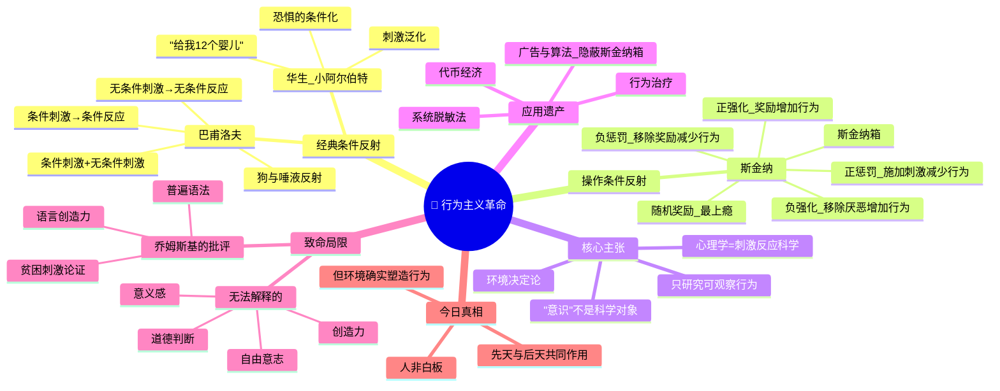

# Day 05：行为主义革命——人是被训练出来的吗？

> **悬疑提要**：1920年，约翰·华生带着一个11个月大的婴儿走进实验室，声称能够用"条件反射"制造出任何恐惧。他说了一句让整个心理学界炸锅的话："给我一打健康的婴儿，我可以把任意一个训练成医生、律师、乞丐或者小偷。"将近一个世纪后，这句话到底是狂妄还是真相？更诡异的是——小阿尔伯特后来怎么样了？

---

## 🍅 番茄 21/25：悬疑开场——小阿尔伯特的悲剧

### 一个被恐惧塑造的婴儿

想象一下：你是11个月大的宝宝，叫阿尔伯特。你正在约翰·霍普金斯大学一间明亮的实验室里玩耍，面前有一只毛茸茸的白鼠。你好奇地伸出手想去摸它——就在这一瞬间，**你的脑后传来一声震耳欲聋的巨响**（那是华生用锤子猛敲一根钢条发出的声音）。

你吓哭了。

下一次，白鼠再次出现——巨响紧随其后。

再下一次，**不需要巨响——你看到白鼠就已经开始哭**。不止白鼠：你开始害怕兔子、毛皮大衣、圣诞老人的胡子——所有毛茸茸的东西。

**华生成功了。他用条件反射在一个婴儿身上制造出了恐惧。**

这就是心理学史上最具争议的实验之一：**小阿尔伯特实验**（1920年）。华生的逻辑简单粗暴到令人不适——如果恐惧可以被"制造"，那其他所有情绪、偏好、乃至整个"人格"是不是都可以被训练出来？

### 华生的宣言：给我12个婴儿

> "给我一打健全的婴儿，把他们带到我特殊的世界里。我可以保证，随机选出一个，**无论他的天资、倾向、能力、职业和种族如何，我都可以把他训练成任何类型的专家**——医生、律师、艺术家、商人，甚至乞丐和小偷。"

这段话出现在华生1924年的著作《行为主义》中。一百年后的今天读来，它依然让人背脊发凉。

华生的前提很简单：
1. **你没法客观研究"意识"**——那玩意儿看不见摸不着，不是科学。
2. **你能客观研究的只有行为**——刺激输入和反应输出。
3. **所以心理学应该只研究行为**——丢掉"心灵"，丢掉"意识"，丢掉"灵魂"，只盯着可观察、可测量、可预测的东西。

这叫**行为主义**。

华生不是第一个这么想的人（巴甫洛夫在他之前就摇铃了），但他确实是最激进、最不要命的那一个。他要把心理学变成一门彻头彻尾的自然科学——像物理和化学那样。

### 小阿尔伯特后来怎么样了？

**这是整个故事最黑暗的部分。**

华生和他的研究生罗莎莉·雷纳在论文末尾讨论说，小阿尔伯特可能形成了"永久性的恐惧反应"——但他们没有进行去条件化治疗。也就是说，他们没有消除这个婴儿的恐惧。

那么小阿尔伯特后来怎么样了？

这个问题困扰了心理学界将近一个世纪。直到2009年，民间心理学家贝克·莱文斯和她的团队花了整整七年时间，最终确认了小阿尔伯特的真实身份：**道格拉斯·梅里特**，一个患有脑积水的婴儿，在实验后不到六年就因脑积水去世了。

**他短暂的一生中一直带着华生"植入"的恐惧，没有人帮助过他。**

> 💀 这个故事的真正悲剧不在于实验本身——而在于没有人负责"收尾"。

### ✅ 费曼三句话

```markdown
🧠 **费曼三句话**
1. 行为主义的核心主张：心理学应该只研究可观察的行为，不研究看不见摸不着的"意识"——因为只有可测量的东西才是科学。
2. 你身边就有例子：你每次听到微信提示音就条件反射地掏出手机——这就是经典条件反射。你和巴甫洛夫的狗没有本质区别，只是铃声变成了提示音。
3. 我困惑的是：如果人真的只是一套刺激-反应机器，那"意义"、"爱"、"创造力"这些东西算什么？华生是不是砍掉了太多不该砍的东西？
```

### ❓ 悬疑追问

**如果行为主义是对的——你所有的选择都只是过去条件反射的产物——那"自由意志"还剩多少空间？或者换个方向：如果行为主义是错的，为什么广告公司、App设计师、赌场老板全都拿它当圣经？**

---

## 🍅 番茄 22/25：经典条件反射 vs 操作条件反射——从流口水的狗到迷信的鸽子

### 巴甫洛夫：一个顺便改变了心理学的生理学家

1904年，**伊万·巴甫洛夫**获得了诺贝尔生理学奖。他研究的是消化系统——狗怎么分泌唾液，胃液怎么工作。他是一位生理学家，压根没想搞心理学。

但他在实验中发现了一个让他烦心的问题：

**狗在他还没给食物的时候就开始流口水了。**

他走进房间，狗流口水。他穿白大褂，狗流口水。他摇铃铛——然后给食物——重复几次后——**摇铃铛，狗就流口水和食物无关了。**

巴甫洛夫管这个叫**条件反射**（conditioned reflex）。他揭示了一个简单的学习机制：

- **无条件刺激**（食物）→ **无条件反应**（流口水）——天生的，不用学
- **条件刺激**（铃声）+ 无条件刺激（食物）→ **无条件反应**（流口水）——重复配对
- **条件刺激**（铃声）→ **条件反应**（流口水）——学会了！

巴甫洛夫用唾液测量的方式，把"学习"这种看似神秘的心理过程变成了可量化的生理数据。他打死也没想到，自己这位生理学家会成为心理学史上被引用次数最多的人之一。

> 这可能是科学史上最著名的"不务正业"。

### 斯金纳：一只鸽子的迷信

如果说巴甫洛夫发现了"经典条件反射"（一个旧的刺激引发反应），那**B.F. 斯金纳**——行为主义的终极掌门人——发现了更牛逼的东西：**操作条件反射**。

斯金纳的发明叫**斯金纳箱**。简单来说：一个封闭的箱子，里面有一个杠杆（或按钮），动物按下它时，会得到食物奖励。

他发现了一个关键区别：

- **经典条件反射**：被动反应。你无法控制铃声会不会响，你只能流口水。
- **操作条件反射**：主动操作。你按杠杆→得到食物→更可能再按。**你的行为改变了环境。**

斯金纳提出了一套完整的"行为塑造"法则：

| 操作 | 效果 | 行为变化 |
|------|------|----------|
| **正强化** | 给予奖励（食物、钱、点赞） | 行为增加 |
| **负强化** | 移除厌恶刺激（噪音停止、疼痛消失） | 行为增加 |
| **正惩罚** | 施加惩罚（电击、罚款） | 行为减少 |
| **负惩罚** | 移除奖励（没收手机、取消特权） | 行为减少 |

但真正绝妙的实验是他的**鸽子迷信实验**。

斯金纳把饥饿的鸽子放进箱子，每隔15秒自动掉下一粒食物——**不管鸽子在做什么**。结果呢？鸽子们开始"迷信"了：

- 一只鸽子学会在箱子里顺时针转圈
- 另一只反复把头伸向角落
- 第三只有节奏地上下摆动

为什么？因为在食物掉下来的那一瞬间，它们"恰好"正在做某个动作。动物的大脑自动建立了联系："我转圈→食物出现。"即使这个联系完全随机——它们依然坚持"迷信"行为。

**想想你手机上的那些仪式感操作。"刷新一下看看有没有新消息"——你和斯金纳的鸽子没有任何区别。**

### 你的手机就是斯金纳箱

现在回到悬疑钩子：为什么你的手机上瘾？

**因为每一个App都是精心设计的斯金纳箱。** 下拉刷新的"加载中"→不定时出现一条有趣内容（不确定的奖励）→你再刷→再出现一条。

斯金纳发现：**不定期的随机奖励，比固定奖励更容易让人上瘾。** 固定奖励你会腻。但随机奖励？那和老虎机是一个道理。

### ✅ 费曼三句话

```markdown
🧠 **费曼三句话**
1. 经典条件反射是"刺激配对"的学习（铃声=食物），操作条件反射是"行为后果"的学习（按杠杆=食物）。
2. 生活例子：你被烫过一次就知道避开炉子（操作条件反射——负强化）；但你可能也像巴甫洛夫的狗一样，闻到香味就流口水（经典条件反射）。
3. 我在想：如果奖励机制可以塑造一切行为——那"自控力"和"意志力"这些概念是不是就多余了？自律的人只是学会了更好的自我强化策略？
```

### ❓ 悬疑追问

**如果你的每一个行为都能用"奖励和惩罚"来解释——那"自由"这个词还有什么意义？更可怕的是：如果操控行为的技术已经如此成熟（广告、算法、游戏设计），你怎么知道自己此时此刻的"选择"到底是谁的选择？**

---

## 🍅 番茄 23/25：行为主义的遗产与局限——乔姆斯基的致命一击

### 行为主义的黄金时代

20世纪上半叶，行为主义统治了美国心理学。它成功的原因是：

1. **它很"科学"**——比弗洛伊德那套"潜意识""力比多"可测量多了。
2. **它真有用**——行为疗法至今是心理治疗的核心工具之一。
3. **它很民主**——你的出身不重要，你的"意识"不重要，环境塑造一切。这意味着改变环境就能改变人。

### 行为疗法的三大遗产

**① 系统脱敏法**

你怕蛇？好，我们一步一步来：
1. 先想象"蛇"这个词
2. 看一张卡通蛇的图片
3. 看一段蛇的视频
4. 站在远处看一条真蛇
5. 靠近蛇
6. 最后——摸蛇

每一步都配合放松训练，直到恐惧反应被"去条件化"。

**沃尔普**发明这个方法时，直接引用了巴甫洛夫的"消退"机制。效果非常好——特别是对恐惧症和焦虑障碍。

**② 代币经济**

精神病院、监狱、学校——用代币（假钱、积分）奖励良好行为。积攒够了可以兑换实物奖励。

表面看像是在"贿赂"人——但它确实有效。因为它直接利用了操作条件反射的原理：**行为→奖励→行为重复。**

**③ 厌恶疗法**

用惩罚来消除不良行为——比如给酗酒者服药，让他一喝酒就想吐。效果有限且争议巨大。

### 乔姆斯基的致命一击

1959年，一个年轻的麻省理工学院语言学家写了一篇书评——**这篇书评直接打爆了行为主义。**

他叫**诺姆·乔姆斯基**。

斯金纳写了一本《言语行为》（Verbal Behavior），试图用操作条件反射解释语言学习：孩子说话是因为被强化——说对了被表扬，说错了被纠正。

乔姆斯基说：**你自己试试看能不能用这套理论解释孩子学说话。**

他的核心攻击：

1. **语言的创造力**：孩子能说出他们从未听过的句子。 "无色的绿思想愤怒地睡觉"——你从没听过这句话，但你能理解它不符合语法。这不是"强化"能解释的。
2. **贫困刺激论证**：孩子接收到的语言输入是有限的、杂乱的。但他们最终掌握的语法系统远远超越输入的复杂性。**输入贫乏，输出复杂——这不能用"模仿+强化"来解释。**
3. **敏感期和普遍语法**：全世界孩子以几乎相同的时间表习得语言——不管在什么文化、什么语言环境中。乔姆斯基认为这是因为人类大脑有先天的**语言装置**——不是训练出来的。

这一击对行为主义是致命的。不是因为乔姆斯基完美证明了"先天语言能力"——而是因为他揭示了行为主义的根本局限：

**有些东西——语言、逻辑、创造力、道德判断——是你训练不出来的。因为大脑不是一块白板。**

### 那么，华生错了吗？

华生说"给我一打婴儿，我可以把任意一个训练成任何专家"——这句话错了吗？

**错了**。证据：
- 同卵双胞胎在不同环境中长大，人格相似度依然显著高于陌生人
- 智力受遗传影响约50%
- 语言习得有生物基础——你训练不出一只说人话的狗

但也**没全错**。证据：
- 创伤记忆可以植入（虚假记忆研究，洛夫特斯）
- 恐惧可以条件化（小阿尔伯特）
- 行为疗法确实改变人的行为
- 广告和算法确实操纵你的选择

**真相是**：人不是白板，但白板上的字确实可以被改写——只要不超出白板本身的材质限制。

### ✅ 费曼三句话

```markdown
🧠 **费曼三句话**
1. 行为主义的伟大遗产是证明了"环境可以塑造行为"——但它的致命缺陷是否认了人类先天的、内在的认知结构。
2. 生活中：你妈从小教你不要撒谎——但你还是学会了说谎。这恰恰说明"教育"(强化)和"内在认知"(理解撒谎的概念)是两回事。
3. 我在想：行为主义证明了一半真相——那另一半呢？如果环境不能完全定义我，那"我"到底是什么东西塑造的？
```

### ❓ 悬疑追问

**如果人是"先天基因"和"后天环境"的乘积——那在这两个因素之间，到底有没有一个叫做"自由意志"的缝隙？或者，自由意志只是我们在两个决定论之间的幻觉？**

---

## 🍅 番茄 24/25：🧠 思维导图综合复习

### 🧠 Day 05 思维导图：行为主义革命



> **如何阅读此图**：从中心向外读。上部分支=核心机制和代表人物；中部分支=主张和应用；下部分支=局限和现代反思。

### 🎤 费曼大挑战

用一句话向一个10岁小孩解释"行为主义"：

> *（提示：可以说"行为主义研究的是做什么而不是想什么"）*

**写下来：**

```
[你的答案]
```

### 🔗 连回生活

- 你的哪些日常行为其实是"操作条件反射"的结果？（刷手机、喝咖啡、吃零食）
- 你相信你的"人格"有多大程度上是后天训练出来的？
- 如果你有一个孩子，你会用行为主义的奖惩体系来教育他吗？边界在哪里？

---

## 🍅 番茄 25/25：刻意练习——悬疑推理实验室

### 案例1：用行为主义分析自己的一个"习惯"

选一个你每天都会做的习惯（最好是你不那么想做的，比如熬夜刷手机）。

**请回答：**

1. 这个行为的**即时奖励**是什么？（让操作条件反射解释你为什么还在做）
2. 这个行为的**延迟惩罚**是什么？（为什么你"知道不对"但还是做）
3. 如果要改变它——你会设计一个怎样的**行为干预方案**？（用正强化替代、用惩罚抑制、还是改变环境本身？）

> *提示：别用"意志力"解释一切。斯金纳会说——你不是意志力差，是你的环境设计得太烂了。*

<details>
<summary><b>🔍 参考答案（先写你自己的再点开）</b></summary>

**拿"熬夜刷手机"举例：**

1. **即时奖励**：每一条新信息就像斯金纳箱的随机奖励——你不知道下一条会是什么，所以一直刷。这是**不定时正强化**——最顽固的行为模式。
2. **延迟惩罚**：第二天困倦、注意力下降、长期记忆变差——但这些都是"延迟的、不确定的"后果。心理学实验反复证明：**行为更多受即时后果控制，而非延迟后果。**
3. **行为干预方案**（基于斯金纳原则）：
   - **改变前因**：睡前把手机放客厅充电（减少刺激的可及性）
   - **替代行为**：睡前用阅读纸质书替代刷手机（用正强化建立新行为）
   - **奖惩机制**：如果做到了，明天奖励自己一杯好咖啡；或者设定"罚款"——每刷一次给朋友转账50元（创造即时负后果）
   - **循序渐进**：不要试图"一下子戒掉"——先做到睡前1小时不碰手机，巩固了再延长

</details>

### 案例2：设计一个改变小习惯的行为干预方案

**情景**：你的朋友小明想每天早起跑步。他买了跑鞋、下了跑步App、设了闹钟——但坚持不到三天就放弃了。

他责怪自己"意志力差""不够自律"。

**你的任务**：用行为主义（操作条件反射）的原理，给小明设计一个**不用"意志力"也能坚持的跑步方案**。

> *提示：斯金纳不关心"意志力"——他关心的是如何重新设计环境。*

<details>
<summary><b>🔍 参考答案（先写你自己的再点开）</b></summary>

**行为主义视角的跑步养成方案：**

1. **即时奖励**（这是关键——斯金纳箱的精华）：
   - 每次跑完步，立刻给自己一个明确的奖励——比如一杯最喜欢的手冲咖啡，或者一集只有跑步后才能看的剧
   - 奖励必须**即时**（跑完30分钟内）和**明确**（和跑步绑定）

2. **渐进行为塑造**（shaping）：
   - 不要一开始就要求跑5公里——第一天只需要穿上跑鞋出门走5分钟，做到就奖励
   - 第二周可以慢跑1分钟+走路4分钟
   - 逐步增加，让每个"小成功"都得到强化

3. **前因控制**：
   - 前一晚把跑鞋和运动服放在床边
   - 设定一个固定的"触发"：闹钟响立刻坐起来（而不是允许自己按掉）

4. **负强化潜力**：
   - 不跑步的"惩罚"不应该是自责（那是自我攻击，不是行为主义）
   - 可以找一个跑步伙伴——不跑就要跟对方说不跑的原因（社交后果本身就是一种惩罚/强化）

**最关键的区别**：斯金纳会说——"自律"不是原因，是结果。当你的环境设计对了，"自律"自然就出现了。

</details>

### 🔍 悬疑推理练习题

**场景推理：**

你走进一家赌场。老虎机整齐排列，灯光闪烁，音乐节奏迷人。赌场里没有时钟，没有窗户，氧气被轻微加浓（这真的是一些赌场的操作），让人保持清醒。老虎机的奖励是完全随机的——你永远不知道下一次中奖是什么时候。

现在请回答：

1. **从行为主义的角度，赌场的设计利用了哪种强化模式？**
2. **为什么"随机奖励"比"固定奖励"更容易让人上瘾？**
3. **如果你是一家社交媒体公司的产品经理——你会如何在"道德"和"用户粘性"之间选择？**

<details>
<summary><b>🔍 参考答案（先写你自己的再点开）</b></summary>

1. **不定时可变强化**——这是行为主义中最难消退的强化模式。斯金纳的鸽子在随机奖励下，即使食物完全停止供应，依然会继续做出"迷信"行为数百次才消退。这就是"赌徒效应"的底层机制。
2. **因为随机奖励创造了持续期待。** 固定奖励可以预测——你知道什么时候会得到什么，腻了就不做了。但随机奖励让你永远在等"下一次可能是大奖"——就像斯金纳箱里的鸽子，永远相信转圈会带来食物。
3. 开放性问题。但值得思考的是：**如果你知道斯金纳箱的原理，你依然在设计让人上瘾的产品——你是产品经理还是行为工程师？**

</details>

### 📊 今日进度

```
Day 05/12 [███████████████░░░░░░░] 25/60 🍅
行为主义到此结束。你被训练了一整天——明天我们来讲讲"人不只是白老鼠"。
```

### ✅ 今日备考卡片

| 概念 | 一句话解释 |
|------|-----------|
| 经典条件反射 | 巴甫洛夫：两个刺激配对产生新的自动反应（铃声=食物→流口水） |
| 操作条件反射 | 斯金纳：行为的后果决定了该行为是否重复（按杠杆→食物→再按） |
| 正强化 | 给好东西鼓励行为——给狗食物让它坐下 |
| 负强化 | 拿掉坏东西鼓励行为——系安全带解除刺耳警报 |
| 随机奖励 | 最上瘾的强化模式——老虎机和手机上瘾的核心机制 |
| 系统脱敏 | 逐步暴露+放松训练，用条件反射消除恐惧 |
| 乔姆斯基批评 | 语言创造力无法用"强化"解释——大脑不是白板 |

---

**→ 明日预告：[[Day06-人本主义与存在主义·人不只是白老鼠]]**

当行为主义说"人就是复杂一点的动物"，当精神分析说"人就是被童年和本能驱动的病人"——有人拍桌子了："去你妈的，人他妈的是人！"明天，我们走进心理学中的"第三势力"。
