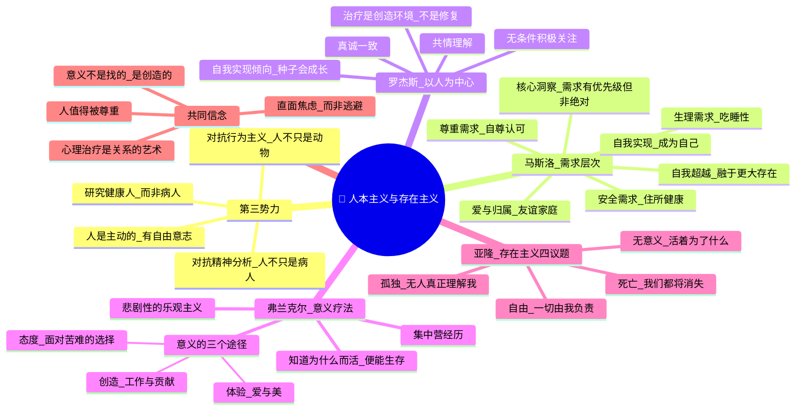

# Day 06：人本主义与存在主义——人不只是白老鼠

> **悬疑提要**：20世纪中叶，心理学被两大势力瓜分：行为主义说你只是一只会被条件反射操控的动物，精神分析说你是一个被童年创伤和本能欲望驱动的病人。然后，一群心理学家拍案而起——"去你妈的，人他妈的是人！"他们把目光投向了人类最独特的那些东西：意义、自由、爱、创造、自我实现。但他们说的这些"高级追求"，到底是人类的本质，还是吃饱了撑的？

---

## 🍅 番茄 26/30：悬疑开场——心理学的"第三势力"

### 当两大门派都让你不爽的时候

20世纪50年代，心理学内部积累了一种越来越强烈的**不满**。

行为主义阵营里，训练老鼠按杠杆的斯金纳正在写《瓦尔登第二》——一本用行为工程设计的乌托邦小说。在他的理想社会里，人的一切行为都被"正强化"精心塑造，没有冲突、没有痛苦、但也**没有自由**。

精神分析阵营里，弗洛伊德的信徒们正在忙着把人的一切痛苦追溯到童年——你的焦虑？你妈没给你喂好奶。你的抑郁？你俄狄浦斯情结没处理好。你什么毛病？**你的童年。**

这两大阵营有一个共同的底层假设：**人不是自己命运的主人。** 行为主义说你被环境控制，精神分析说你被潜意识控制。

然后，一小群心理学家开始问一个危险的问题：

**那，到底谁在活我的人生？**

### 第三势力的诞生

1961年，**亚伯拉罕·马斯洛**和**卡尔·罗杰斯**等人创立了"人本主义心理学协会"。他们称自己为心理学的**"第三势力"**——不同于行为主义和精神分析。

他们的核心立场简单到令人发指：

1. **人不是动物**——你不该拿研究老鼠的结论来研究人
2. **人不是病人**——你不该用研究病人的视角来理解所有人
3. **人是有自由意志的**——你他妈的可以选
4. **人追求意义**——不只是追求快乐和避免痛苦
5. **人是一个整体**——你不能把"心灵"切成零件再理解它

> 听起来像常识？但在当时，这简直是反叛。

### 为什么是"第三势力"？

行为主义关注的是**"怎么做"**（刺激-反应机制），精神分析关注的是**"为什么"**（童年怎么塑造了你），人本主义问的是另一个问题：

**"你能成为什么？"**

这不是研究"病态"，也不是研究"平均"——这是研究**人类潜能的极限**。

马斯洛管这个叫**自我实现**（self-actualization）。他干的第一个"不科学"的事就是：**把研究对象从病人换成了健康人。** 准确说——他去找了历史上和当代他认为"最健康"、"最充分发挥了潜能"的人。

这一换，视角就完全变了。

### ✅ 费曼三句话

```markdown
🧠 **费曼三句话**
1. 人本主义的核心：人是主动的、追求意义的、有自由意志的整体——不是被环境操控的机器，也不是被童年决定的病人。
2. 生活中：你有过一个瞬间觉得"这就是我想要的生活"吗？人本主义关心的就是那种状态——不是"你怎么病了"，是"你怎么才能活得更好"。
3. 我困惑的是：如果人真的有"自由意志"——为什么科学一直找不到它在哪？难道自由意志只是一个好听的幻觉？
```

### ❓ 悬疑追问

**如果"自由意志"在神经科学层面似乎找不到证据——人本主义的整个基础会不会只是"我们喜欢自己这样想"？或者说，即使自由意志是假的，"相信它有"这件事本身，是不是就有治疗价值？**

---

## 🍅 番茄 27/30：马斯洛的需求层次与自我实现——你以为你缺钱？你可能缺的是意义

### 马斯洛这个人

**亚伯拉罕·马斯洛**，1908年生于纽约布鲁克林的一个犹太移民家庭。他是家中七个孩子中的老大，父母是没受过教育的俄罗斯犹太移民，没什么文化，但对他期望极高。

他小时候极度害羞、孤独、自卑。他回忆说："我是一个在图书馆里长大的犹太男孩，没有朋友。"

然后他去了威斯康星大学，开始研究猴子。他对猴子的"优势地位"和"性行为"感兴趣——后来他发现，这些东西在人类身上也有对应的模式。

但他永远不可能成为一个正统的行为主义或精神分析学家。原因很简单：**他对人"能变得多好"比对"人有多病"更感兴趣。**

### 需求层次：一个被滥用但依然伟大的模型

马斯洛在1943年的论文《人类动机理论》中提出了他的**需求层次**。后来他把它发展成了那个著名的金字塔：

```
        /\          
       /  \         
      /自我\        
     /实现  \       
    /  超越  \      
   /__________\     
  /  尊重需求  \    
 /  爱与归属    \   
/   安全需求      \  
/   生理需求        \ 
```

**底层——生理需求：** 吃、喝、睡、性、呼吸。如果你快饿死了，你不会关心我今天是不是活出了意义——你只关心下一顿饭在哪。

**第二层——安全需求：** 身体安全、经济安全、健康、稳定的住所。活在战区的人没法考虑"自我实现"——他们在找藏身的地方。

**第三层——爱与归属：** 友谊、家庭、亲密关系、社群。马斯洛发现：**归属感缺失是当代心理问题的第一大来源。**

**第四层——尊重需求：** 自尊、成就、地位、认可。你需要感觉到"我这个人是有价值的"——对内（自尊）和对外（被尊重）。

**第五层——自我实现：** 发挥全部潜能、成为你能成为的"那个样子"。马斯洛说："音乐家必须创作音乐，艺术家必须画画，诗人必须写诗——如果最终他们不这样做，他们无法与自己和平相处。"

**后来增加的第六层——自我超越：** 超越小我，融入更大的存在——灵性、奉献、与宇宙合一。

### 但等等——这个金字塔不是你想的那样

常见误解：你必须100%满足底层才能去高层。

**事实上马斯洛说：** 你不是。正常人在所有层次上都有部分满足和部分不满足。而且**一个层次的满足会自然释放对更高层次的追求**——这不是梯子，更像是发展的动力。

更关键的是：**不同层次对同一个人意义不同。** 马斯洛说有一个很有意思的现象——那些实现了自我超越的人（特蕾莎修女、甘地），即使生活在极度匮乏中（生理需求严重不满足），依然能感到"充实"。

**这打破了"底层必须满足才能谈高层"的错觉。**

### 你缺钱还是缺意义？

马斯洛被问最多的问题是："怎么才能达到自我实现？"

他的回答让实用主义者和成功学大师都很失望——**你不能"想要"自我实现。**

他说自我实现更像是一个副产品——当你投入到一件比你大的事情中时，它自然发生了。你不可能"追求"自我实现就像你不能"追求"幸福感——幸福是你追求其他东西时的附带结果。

**真正的需求不是"我想要更多"，而是"我需要某种生活的意义"。**

当你问自己"我为什么早上起来"的时候——
- 生理需求会说：因为你饿了
- 安全需求会说：因为你要付房租
- 爱与归属会说：因为有人等你
- 尊重需求会说：因为你想要被认可
- 自我实现会说：因为这件事**让你觉得自己活着**

马斯洛真正在说的是：**你以为你缺钱——但你真正缺的可能是一个让你半夜醒来也兴奋的理由。**

### ✅ 费曼三句话

```markdown
🧠 **费曼三句话**
1. 需求层次的核心洞察：人类的需求是有优先级的，从基本生存到高级意义——但你不需要完全满足底层才能追求高层，有时高层需求能让人忍受底层匮乏。
2. 生活中：你见过那些"明明很成功却非常空虚"的人吧？马斯洛会说——他们满足了尊重需求（地位、钱），但自我实现的需求空洞在发出噪音。
3. 我在想：在现在的社会里，"不被爱"可能比"没钱"更致命。我们的时代是不是制造了大量第三个层次（归属感）的匮乏？
```

### ❓ 悬疑追问

**如果"自我实现"是人生的最高目标——那"赚钱"和"追求意义"到底是什么关系？它们是敌人、工具、还是同一条路的不同侧面？为什么有些人明明已经财务自由却陷入虚无，而有些人穷得叮当响却活得像一团火？**

---

## 🍅 番茄 28/30：罗杰斯的以人为中心疗法 + 弗兰克尔的意义疗法

### 罗杰斯：治疗不是修复，是创造环境

**卡尔·罗杰斯**，这位看起来温和得像牧师一样的人，在心理治疗界引爆了一颗炸弹。

20世纪40年代，主流心理治疗是精神分析——治疗师像个侦探一样坐在你身后，分析你的潜意识、童年创伤、防御机制。治疗师是"专家"，你是"病人"。

罗杰斯说：**放屁。你不是病人，你只是被卡住了。**

他的核心思想极其颠覆：

**人天生就有"自我实现倾向"**——就像种子天生会朝着阳光生长一样，人天生会朝着更完整、更健康的方向发展。不需要被"修复"——只需要被提供一个**合适的成长环境**。

就像一颗橡树的种子——给它阳光、水分、土壤——它自然会长成橡树。不需要你告诉它"你该长出叶子了"。

### 三个核心条件

罗杰斯说，一个"合适的环境"有三个条件——少一个都不行：

**1. 无条件积极关注（Unconditional Positive Regard）**

不是"你考了100分所以我爱你"——是"不管怎样我都重视你这个人"。

罗杰斯发现：绝大多数心理问题来自于"条件性接纳"——你需要达到某些标准才配被爱、被尊重。久而久之，你学会了**只展现被认可的"面具"**，而真实的自己被藏起来了。

**他问：如果有一个地方——你可以完全做自己，没有人评判你，你能被全盘接受——会发生什么？**

答案：你会开始疗愈。

**2. 共情（Empathic Understanding）**

不是"我理解你的感受"那种敷衍——是"我试图钻进你的皮肤，用你的眼睛看世界"。

罗杰斯是第一个把"共情"从鸡汤词变成治疗核心操作的人。他说：**当一个人被真正理解时，他的防御会自然松动。**

**3. 真诚（Congruence）**

治疗师必须是真实的。不戴专业面具，不装逼。

他开创了**以人为中心疗法**——后来被广泛应用于教育、企业管理、亲子关系。他的核心理念简单到让人怀疑："你不是在修复人，你是在创造一个让人自己成长的空间。"

> 罗杰斯改变了心理治疗的方向——从"技术"到"关系"。

### 弗兰克尔：在集中营里找到的意义

**维克多·弗兰克尔**的故事绝对值得你记住——因为它太他妈离谱了：

- 犹太人，二战时被关进奥斯维辛集中营
- 父母、妻子、兄弟——全部死于毒气室
- 他本人在集中营里经历了非人的折磨
- **但他活了下来，而且因此开创了一种全新疗法**

在集中营里，弗兰克尔观察到一个现象：**能活下来的人，往往不是最强壮的，而是有"理由"活下去的。**

一个人如果知道明天为什么要起床——即使今天再痛苦，他也能撑过去。

弗兰克尔说了一个后来被无数人引用的句子（来自尼采）：

> **"知道为什么而活的人，便能生存。"**

他的核心洞察：

**人可以被剥夺一切，除了最后一件——选择自己态度的自由。**

### 意义疗法（Logotherapy）

弗兰克尔管他的疗法叫**意义疗法**。核心只有一个问题：

**"你活着的意义是什么？"**

他发现找到意义有三条路：

1. **创造**：通过工作、创造、贡献——做有意义的事
2. **体验**：通过爱、美、自然——感受生命的价值
3. **态度**：当面对无法改变的苦难时——选择如何承受它

第三条是最牛的：**当一切都被剥夺时，你依然可以选择你对这件事的态度。** 弗兰克尔自己在集中营里发现：那些放弃希望的人——不是死于饥饿，而是死于"不再相信明天"。

他把这个叫做**"悲剧性的乐观主义"**——不是假装痛苦不存在，而是即使在痛苦中依然能找到意义。

### 存在主义的四个终极关怀

弗兰克尔的思想属于**存在主义心理学**的谱系——这个谱系的大佬**欧文·亚隆**（《存在主义心理治疗》的作者）说，人类最深层的焦虑来自四个"终极关怀"：

| 最终议题 | 核心焦虑 | 逃避方式 |
|---------|---------|---------|
| **死亡** | 我们都会死 | 否认、追求不朽的幻觉 |
| **自由** | 一切由我负责 | 推卸责任、假装没得选 |
| **孤独** | 无人能真正理解我 | 用关系填补内心空洞 |
| **无意义** | 活下去的理由是什么 | 沉迷琐事、麻木自己 |

人本主义和存在主义的共同信仰是：**直面这些焦虑——而不是逃避——才是活出真实人生的唯一途径。**

### ✅ 费曼三句话

```markdown
🧠 **费曼三句话**
1. 罗杰斯说人天生会自我成长，只需要"无条件积极关注+共情+真诚"的环境——治疗不是修复人，是让卡住的人重新流动起来。弗兰克尔说找到"活着的理由"能让人承受几乎所有的痛苦。
2. 生活中：你什么时候感觉"被真正理解了"？那可能是你记忆中珍贵的体验之一——罗杰斯会说，那本身就是疗愈。
3. 我困惑的是：如果我找不到"活着的意义"怎么办？弗兰克尔会说——不是"等意义出现"，是你必须主动去发现它。但这个答案是不是太辛苦了点？
```

### ❓ 悬疑追问

**弗兰克尔说"人可以选择态度"——但抑郁症患者的大脑化学物质失衡了，有些患者确实"感受不到任何意义"。这时候"选择态度"是不是一种对病人的苛责？或者说，意义疗法在"一切都还好"时有效，但在真正的绝境中还能用吗？**

---

## 🍅 番茄 29/30：🧠 思维导图综合复习

### 🧠 Day 06 思维导图：人本主义与存在主义



### 🎤 费曼大挑战

用**一句话**对比行为主义、精神分析和人本主义对"人"的定义：

> *（提示：行为主义者眼里的人=环境产物；精神分析=童年产物；人本主义=？？？）*

**写下来：**

```
[你的答案]
```

### 🔗 连回生活

- 你今天或者最近做的一件事——是为了满足哪个层次的需求？
- 你认识的人中，谁是你心中"活得很充实"的人？他满足了哪些需求？
- "如果明天你就不在了，你会遗憾什么？"——这个问题和你的哪种需求有关？

---

## 🍅 番茄 30/30：刻意练习——悬疑推理实验室

### 案例1：需求诊断练习——用需求层次分析自己的现状

拿出一张纸，画一个简单的漏斗。从下到上问自己这五个问题：

**1. 生理需求：我现在吃得好睡得好吗？**
- 如果你长期睡眠不足、饮食不规律——别谈"追求意义"了，先解决这个。你的大脑在饥饿和疲惫状态下是做不出好决策的。

**2. 安全需求：我的基本安全感在哪里受损？**
- 经济焦虑？健康焦虑？对未来的不确定感？
- 马斯洛说：安全感缺失的人会变得极度保守和防御——不敢尝试新事物，不敢冒险。

**3. 爱与归属：我有没有"被接纳"的感觉？**
- 这是当代中产阶级最普遍的缺口。你认识很多人，但有多少"你可以完全做自己"的关系？
- 马斯洛说：当归属感受到威胁时，人会产生强烈的孤独和异化感。

**4. 尊重需求：我有没有从内心认可自己？**
- 注意——是"自尊"不是"被尊重"。你可以拥有全世界的点赞，却依然觉得自己不够好。

**5. 自我实现：我有没有在做"让我觉得自己活着"的事？**
- 这个答案不一定是"伟大的事业"——它可能是做一道好菜、写一篇好文章、和孩子玩一整个下午。
- 关键信号：**忘记时间、完全沉浸、结束后感到充实而非疲惫。**

> **做完这个分析后，问自己最后一个问题：我现在最缺的是哪个层次？我的"症状"是不是这个缺口的信号？**

### 案例2：意义日志练习（3-5分钟）

弗兰克尔说意义可以通过"创造、体验、态度"三条路找到。现在：

**写下今天发生的三件事（可以很小），分别对应三条路：**

| 路径 | 问题 | 你的答案 |
|------|------|---------|
| **创造** | 今天你做了什么有价值的事？（哪怕只是写了一份报告、帮了同事一个忙） | |
| **体验** | 今天你感受到了什么美或爱？（一杯好咖啡、朋友的微笑、夕阳） | |
| **态度** | 今天你面对了什么困难？你选择了什么态度面对它？ | |

> **做完后问自己：如果每天做这个练习——一个月后，我对"生活的意义"的感觉会变吗？**

### 🔍 悬疑推理练习题

**场景推理：**

一位35岁的投行高管来找你（你充当人本主义治疗师）。他的生活在外人看来完美：年薪百万、豪宅、健身身材、交往中的漂亮女友。但他告诉你："我觉得我活得像个骗子。每天早上起来，我不知道我为什么要继续这样过。"

1. **用马斯洛的需求层次分析**：他哪些需求满足了？哪些需求可能空缺？
2. **用罗杰斯的视角**：他的"条件性接纳"可能是什么？（他从小需要达到什么标准才被认可？）
3. **用弗兰克尔的视角**：他"活着的意义"在哪里断裂了？
4. **人本主义和存在主义的治疗方向分别会是什么？**

<details>
<summary><b>🔍 参考答案（先写你自己的再点开）</b></summary>

1. **需求层次分析**：
   - 生理、安全、尊重需求都高度满足（钱够、地位高、被认可）
   - **爱与归属可能缺失**：他的关系可能建立在"角色"而非"真实自我"上——女友爱的可能是"投行精英"这个人设，而不是真实的他
   - **自我实现缺失**：他做的事（金融交易）不一定是他想做的事——他可能从未问过自己"我真正想做什么"

2. **罗杰斯视角**：
   - 他很可能从小生活在"条件性接纳"中——他必须优秀、必须拿第一、必须符合父母的期望才被爱
   - 他发展出了一个完美的"面具"（成功投行家人设），但真实的自己（也许想画画、也许想做老师、也许什么都不想干只想躺着）被藏起来了
   - 结果：外表彰显成功，内心却感觉"我是个骗子"——因为面具和真实自我之间的裂缝太大了

3. **弗兰克尔视角**：
   - 他在追求"成功"（被社会定义的目标），但并没有找到"意义"——他不知道自己为什么在做这些事
   - 弗兰克尔会说：当你只追求"成功"而不是"意义"时，成功后的空虚是必然的。因为"成功"是结果，不是原因
   - 他需要找到的是：**什么让他觉得"这件事本身就是值得做的"**——而不是"这件事能给我带来什么"

4. **治疗方向**：
   - **人本主义方向**（罗杰斯）：创造一个安全的空间让他放下面具——在"无条件积极关注"的环境中，他逐渐敢展示自己的真实想法和感受，直到他自己找到答案
   - **存在主义方向**（弗兰克尔/亚隆）：直面"无意义"的焦虑——不逃避、不转移、不假装一切还好。帮助他找到属于他的"意义"（不是别人给的）——通过创造、体验或态度

**核心洞察**：他的"空心"不是病——是**灵魂在向他发出信号**。问题不在于"怎么消除这个空的感觉"，而在于"这个空的感觉想告诉我什么"。

</details>

### 📊 今日进度

```
Day 06/12 [██████████████████░░░░] 30/60 🍅
人本主义告诉我们——你不是白老鼠，也不是病人，你是那个还在寻找意义的人。明天我们将进入大脑的暗箱。
```

### ✅ 今日备考卡片

| 概念 | 一句话解释 |
|------|-----------|
| 第三势力 | 人本主义心理学——区别于行为主义和精神分析的"第三种"心理学取向 |
| 需求层次 | 马斯洛的金字塔——从生理需求到自我实现，人的需求有优先级 |
| 自我实现 | 成为你能成为的最好的自己——马斯洛说这是人类的最高动机 |
| 无条件积极关注 | 罗杰斯的核心理念——不以条件为前提的接纳和重视 |
| 以人为中心疗法 | 罗杰斯开创的治疗方法——三个条件：无条件积极关注、共情、真诚 |
| 意义疗法 | 弗兰克尔的心理治疗——核心是找到"活着的理由" |
| 悲剧性的乐观主义 | 弗兰克尔的概念——即使在痛苦中依然能选择有尊严的态度 |
| 四个终极关怀 | 亚隆的定义：死亡、自由、孤独、无意义——人类最深层的焦虑来源 |

---

**→ 明日预告：[[Day07-认知革命·大脑是超级计算机吗]]**

1956年，一场革命在悄悄发生。一群科学家说："够了——我们受够了只看"行为"不看"思想"。大脑不是一个黑箱——它是一台信息处理机。"明天，我们进入认知革命——你会看到你的大脑如何欺骗你。
