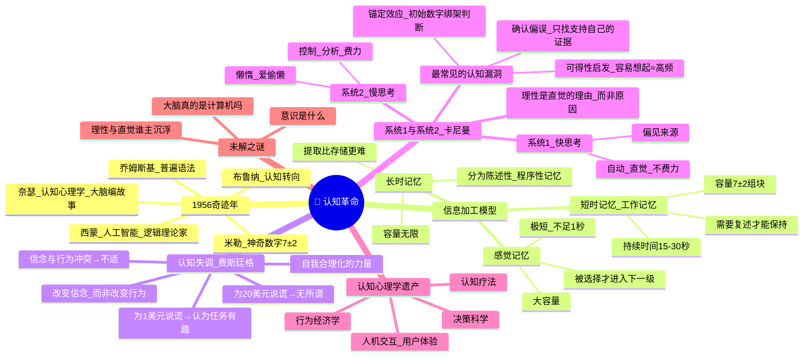

# Day 07：认知革命——大脑是超级计算机吗？

> **悬疑提要**：1956年，世界各地的几个实验室里，一群互不相识的科学家几乎同时在做一个疯狂的梦——把"思想"当作信息来处理。这听起来理所当然——但在当时，这简直是叛国。因为行为主义统治了四十年，没人敢提"思想"这个不科学的词。那一年发生的事，彻底改变了心理学的走向。而这一切的背后，藏着一个更让人不安的问题：你看到的"现实"——有多少是你大脑编造的故事？

---

## 🍅 番茄 31/35：悬疑开场——1956年的奇迹年

### 回到1956年

先给你一个背景：1956年，心理学被行为主义牢牢统治。整个领域都在研究"刺激"和"反应"。你的大脑？那是一个**黑箱**——没人有权讨论里面发生了什么。

然后在短短几个月内，出现了四件改变历史的事：

**第一个炸弹：乔姆斯基的语言学革命**

麻省理工学院，27岁的**诺姆·乔姆斯基**正在写一本名为《句法结构》的小册子。他说："语言不是靠模仿和强化学会的——语言是人脑里一套先天的、高度复杂的规则系统。"

他举了一个著名的例子：

> "无色的绿思想愤怒地睡觉。"

你的第一反应是什么？**这句话符合语法，但没有意义。** 你怎么知道？你没学过"符合语法但没有意义"这个规则——但你脑子里有这个东西。

乔姆斯基说：这叫**普遍语法**——所有人类都能理解结构，因为语言能力是天生的。

这对行为主义是毁灭性打击。

**第二个炸弹：乔治·米勒的"神奇数字7±2"**

**乔治·米勒**在哈佛发表了他那篇将成为经典的论文——《神奇数字7±2：人类信息加工能力的限制》。

他的发现简单但震撼：**人的短时记忆容量大约是7个组块(chunk)，误差2个。**

你记不住一长串电话号码？不是因为你笨——是因为你的记忆"槽位"比行为主义想象的多得多，但比日常需要少得多。

**第三个炸弹：赫伯特·西蒙的人工智能**

**赫伯特·西蒙**和**艾伦·纽厄尔**展示了第一个真正的人工智能程序——**逻辑理论家**（Logic Theorist），它能自己证明数学定理。

西蒙说了一句让心理学家炸锅的话：**"人类思维和计算机信息加工没有本质区别。"**

把大脑比作计算机——这在今天听起来像常识，在1956年简直是邪说。

**第四个炸弹：布鲁纳的"认知"转向**

**杰罗姆·布鲁纳**在哈佛组织了"认知过程研讨会"。他直接挑战行为主义的核心教条：**你不能只研究"反应"，你需要研究"人如何理解世界"。**

> 1956年被后人称为"认知革命元年"。这一年，心理学重新拿回了它的灵魂。

### 乌尔里克·奈瑟的宣言

1967年，**乌尔里克·奈瑟**——一个名不见经传的年轻心理学家——出版了一本书，名字就叫《认知心理学》。他在第一页宣布：

> **"你看到的不是世界本身——是你大脑编造的故事。"**

这太激进了。

奈瑟说：人的感知不是对现实的被动映射——它是一个**主动建构**的过程。你的大脑在接受外界信息的同时，不断在做三件事：
1. **筛选**——只处理对你有用的信息
2. **解释**——给信息赋予意义
3. **填补**——用过去的经验补全缺失的信息

你看的不是"现实"——你看的是你大脑**编辑过**的现实。

### ✅ 费曼三句话

```markdown
🧠 **费曼三句话**
1. 认知革命的核心突破：心理学重新开始研究"内部心理过程"——思维、记忆、决策、语言——这些行为主义禁止谈论的东西。
2. 例子：你刚才读这段话的时候——你在"处理信息"，你在"理解语言"，你在"提取记忆"——这些就是认知心理学研究的内容。
3. 我困惑的是：如果大脑是在"编故事"——那我怎么知道什么时候它编的是对的？有没有一个"真实世界"作为参照？
```

### ❓ 悬疑追问

**如果奈瑟是对的——你看到的世界是大脑编辑过的版本——那么"客观现实"这个概念还有意义吗？更极端的问法：你怎么证明你现在不是在做一个极其逼真的梦？**

---

## 🍅 番茄 32/35：信息加工模型——记忆、认知失调与自欺欺人

### 记忆的三层仓库

认知心理学的信息加工模型简单粗暴：**大脑像计算机一样接收、存储、提取信息。**

**第一层——感觉记忆**

你的感官接收到海量信息。你的眼睛每秒接收约1000万比特的数据——但你的大脑只能处理约50比特。剩下的大部分信息在**不到1秒**内就丢失了。

实验（斯珀林，1960）：给被试快速呈现3行4列的字母，持续50毫秒。被试说能看到"所有字母"——但在报告时已经忘了大部分。如果用一个"音调信号"指示他们回忆某一行——他们能准确回忆。

**结论**：感觉记忆容量很大，但持续时间极短——不到1秒。就像一个临时的"缓冲区"。

**第二层——短时记忆（工作记忆）**

这就是米勒说的**神奇数字7±2**。

你现在试着记住这个号码：**859-272-3946**

你大概能记住——但10分钟后可能就不行了。

短时记忆的特点：
- **容量有限**：7±2个组块
- **持续时间短**：不加复述约15-30秒
- **意识参与**：你现在在读这些字，用的就是工作记忆

**第三层——长时记忆**

理论容量：**无限**。持续时间：**可能是一辈子**。

长时记忆的困境不是"放不进去"——是**"取不出来"**。

你有没有"话到嘴边但想不起来"的时候？那个信息就在你的长时记忆里——你只是找不到通往它的路径。

### 认知失调理论：你越坚信，越看不见

**利昂·费斯廷格**在1957年提出了一个让所有人坐立不安的理论——**认知失调**。

核心观点极其简单：

> **当你的行为和你的信念冲突时——你会感到极度不适。为了消除这种不适，你会改变你的信念——而不是改变你的行为。**

这听起来荒谬，但实验证据稳得像坐钉子。最著名的实验是1959年的那个：

**费斯廷格和卡尔史密斯设计了以下场景：**

被试做了一小时极其无聊的任务（拧螺丝、绕线）。出来后，实验者说："你能不能告诉下一个被试这个任务很有趣？"

一半被试得到**1美元**，另一半得到**20美元**。

然后问所有被试："你觉得这个任务真的有趣吗？"

结果：
- **拿20美元的一组**：觉得任务"一般般无聊"——他们说谎是因为钱够多
- **拿1美元的一组**：觉得任务"其实还挺有意思的"——他们为了合理化"我只为了1美元就说了谎"这个事实，**真的改变了自己的态度**

> 这就是认知失调的恐怖之处：**你不需要欺骗别人——你会欺骗你自己。**

### 为什么你越坚信一件事，越容易忽略反对它的证据？

认知失调给的解释是：

**当你已经公开声明了你的立场——如果你发现反对的证据，你会体验到"我错了"的不适。你不是去质疑自己的立场——你是去质疑证据。**

你找理由说证据有问题、说对方别有用心、说这是个意外。你做的事不是在"接近真理"——你在**保护你的自尊**。

这在政治观点、宗教信仰、甚至购物决策中都极其常见。"我买了这个贵的东西——它肯定好用"——不是吗？

### ✅ 费曼三句话

```markdown
🧠 **费曼三句话**
1. 人类信息加工模型把记忆分为感觉记忆（极短）、短时记忆（7±2）、长时记忆（无限）——认知失调理论则解释了人为什么会在信念受威胁时扭曲事实。
2. 生活中例子：你买了一个昂贵的手机后，不断说服自己它比别的手机都好——这就是认知失调在工作。真正的推理是"我买了它，因为它好"——实际的推理是"它好，因为我买了它"。
3. 我困惑的是：如果认知失调是一种自动防御——那"理性思考"还存在吗？我们到底能在多大程度上"客观"看待事物？
```

### ❓ 悬疑追问

**如果认知失调让我们总是在"合理化"而非"理性化"——那教育有什么用？知道自己的大脑有这种倾向，能不能让我们少犯这种错？还是说——知道归知道，该忽悠自己还是忽悠自己？**

---

## 🍅 番茄 33/35：丹尼尔·卡尼曼——系统1与系统2

### 一个获得诺贝尔奖的心理学家

2002年，**丹尼尔·卡尼曼**获得了诺贝尔经济学奖。**他是一个心理学家。**

这件事本身就是一个信号：认知心理学已经不只是研究"记忆"和"知觉"的学科——它开始解释**人如何做决策**、**为什么总是在某些场景下犯同样的错**、**如何判断和判断失误的底层机制是什么**。

卡尼曼和他的老搭档**阿莫斯·特沃斯基**（如果他没在1996年去世，也会一起拿奖）在20世纪70年代开始了一系列实验——结果令人不安。

他们的核心发现不是你"有时候会犯错"——而是**你犯错的方式是可预测的、系统性的、结构性的**。

也就是说：**你的大脑有固定的、可预见的"认知漏洞"。**

### 系统1和系统2

卡尼曼把人类思维分成两套系统：

| | 系统1：快思考 | 系统2：慢思考 |
|------|-------------|-------------|
| **别称** | 直觉、自动思维 | 分析、理性思维 |
| **速度** | 极快——瞬间完成 | 缓慢——需要努力 |
| **意识参与** | 无意识——自动发生 | 有意识——主动控制 |
| **努力程度** | 不费力 | 费力——消耗能量 |
| **容量** | 无限/并行处理 | 有限/串行处理 |
| **典型例子** | 2+2=? 看愤怒的脸 | 17×24=? 倒车入库 |

**关键洞察：你以为你在用系统2做决策——其实大多数时间你的系统1在做决定了，系统2只是给它找理由。**

### 三个最常见的"认知漏洞"

**① 可得性启发法**

你判断一件事的概率，依据的不是真实统计数据——而是你**能多容易地想起类似例子**。

如果飞机失事的新闻铺天盖地——你会觉得坐飞机很危险。而实际上，飞机是最安全的交通工具。你只是更容易"想起"飞机失事的画面。

**这和现实没关系——和你记忆中的"易提取性"有关系。**

**② 锚定效应**

你看到一个标价5000元的包——然后它打折到2000元，你觉得"好便宜"。

但如果它原价就是2000元呢？**你会觉得贵。**

5000元就是"锚"——你的判断被一个无关的数字绑架了。而且你完全意识不到。

**③ 确认偏误**

你更倾向于寻找、记住、相信那些**证明你原有观点**的证据，忽略那些反对你的。

你不是在找真相——你是在找**你早就想证明的东西。**

这三个漏洞每一个都经过了数十年的实验验证。每一个都在你的日常生活中反复出现。每一个你都**完全意识不到**。

### "理性决策"是一个幻觉

卡尼曼的结论让人不太舒服：

**你做"理性决策"的时候，其实多数时候是在给自己的直觉找理由。**

系统2（理性）的主要工作不是做决策——是给系统1（直觉）的决策做**事后合理化**。

你的直觉告诉你"这个人不靠谱"——然后你的理性开始找理由了："他说话的时候眼神游移，他履历上有几个月的空档，他穿得太随意了……"

但真正决定的是：**你第一眼就不喜欢他。**

### ✅ 费曼三句话

```markdown
🧠 **费曼三句话**
1. 卡尼曼的两系统理论：系统1是自动直觉（快、不费力、常出错），系统2是理性分析（慢、费力、懒惰）——大多数时候系统1在做决定，系统2在编理由。
2. 生活例子：你"第一眼"就决定喜不喜欢一个人——这就是系统1。然后你花了一顿饭的时间找理由来支持这个判断——这就是系统2在打工。
3. 我困惑的是：如果理性系统这么懒——那我们怎么训练它变得更勤快？知道系统1有偏见——能不能靠"知道"这件事来避免它？
```

### ❓ 悬疑追问

**如果系统1真的主导了大多数决策——"理性"还有没有可能成为真正的决策者？还是说，我们花了几千年建立的"理性传统"（科学、法律、逻辑）——本质上只是给直觉盖的一层遮羞布？**

---

## 🍅 番茄 34/35：🧠 思维导图综合复习

### 🧠 Day 07 思维导图：认知革命



> **如何阅读此图**：从中心（1956奇迹年）出发，理解认知心理学诞生的背景；然后追踪信息加工模型（记忆的三层仓库）；再从认知失调到卡尼曼的双系统理论——最后到达认知心理学的应用和未解之谜。

### 🎤 费曼大挑战

用一句"酒吧里对朋友说的话"解释"认知失调"：

> *（提示："你知道你有时候会……"）*

**写下来：**

```
[你的答案]
```

### 🔗 连回生活

- 你今天做了多少个"系统1决策"？（走路、吃饭、刷手机、打招呼）
- 你今天有被"锚定效应"影响吗？（比如看到一个贵的东西然后觉得另一个便宜）
- 你有没有在某件事上"越坚信越看不见相反证据"？

---

## 🍅 番茄 35/35：刻意练习——悬疑推理实验室

### 案例1：识别自己今天的3个"系统1快速判断"

回忆今天（甚至可以是你读这份教程之前的**这25分钟里**）——

你做了哪些快速判断？这些判断基于直觉还是推理？

**举例：**

| 时间 | 判断内容 | 系统1还是系统2？ | 如果切换到系统2会怎么样？ |
|------|---------|----------------|------------------------|
| 早上 | 看到手机推送标题就决定不看 | 系统1——标题不够吸引我 | 可能会错失一篇真正有用的文章 |
| 中午 | 看到同事的表情判断他心情不好 | 系统1——直觉 | 可能误判——其实他只是没睡好 |
| 刚才 | 读到这里觉得"这个说的就是我" | 系统1——快速共鸣 | 慢一点想：这种共鸣是认知偏误吗？ |

**现在填你自己的：**

| 判断 | 系统？ | 如果慢一点会？ |
|------|--------|---------------|
| | | |
| | | |
| | | |

> *关键洞察：**当你开始标记"系统1"和"系统2"时——你已经启动了系统2**。觉知本身就是理性的开始。*

### 案例2：认知失调案例推理

**场景：**

你有一个朋友，花了一万块买了一门"7天改变人生"的课程。你私下觉得这门课很明显是智商税——内容空泛、逻辑混乱、讲师只会灌鸡汤。

但你的朋友——逢人就说这门课"改变了他的人生"。

1. **用认知失调理论解释**：为什么你的朋友会极力推荐这门课？
2. **从卡尼曼的系统1/系统2角度**：他决策时用的是哪个系统？后续合理化用的是哪个系统？
3. **如果你要帮助你的朋友"理性面对"**——你会怎么做？这样做可能有什么反效果？

<details>
<summary><b>🔍 参考答案（先写你自己的再点开）</b></summary>

1. **认知失调的解释**：
   - 朋友的行为（花了一万块，投入了时间）和信念（课程很烂）是冲突的
   - 如果承认"我被骗了"——他不仅要面对经济损失，还要面对"我做了蠢事"的自我否定
   - 所以他的大脑做了一件更"省力"的事：**改变信念**——"这门课太棒了"
   - 他越是到处推广，越是在说服自己。每一次说服都是在降低认知失调

2. **系统分析**：
   - **决策时**（买课）：很可能是系统1——"7天改变人生"这个承诺触发了情绪共鸣（焦虑+希望），感性上做了决定
   - **合理化时**：系统2被征用了——但不是用来"分析课程是否合理"，而是用来**找理由证明这个决定是对的**
   - 卡尼曼会说：这就是系统2的典型工作模式——给系统1擦屁股

3. **怎么帮他**：
   - ❌ **直接告诉他"你被骗了"**——会触发更强的认知失调，他反而会更坚定地维护课程
   - ✅ 更好的方式：不攻击他的决定，而是**帮他建立更好的判断标准**——下一门课他可能会擦亮眼睛
   - ✅ 问开放式问题："你觉得这门课最有价值的是哪部分？如果让你重新评估，你会给几分？"
   - **反效果预警**：认知失调理论预测——当一个人付出了巨大代价后，你直接否定他的付出，他反而会加倍维护。这就是为什么传销受害者最维护传销。

</details>

### 🔍 悬疑推理练习题

**场景推理：**

你是一家科技公司的产品经理。你的产品——一款新闻聚合App——的算法最近被批评"制造信息茧房"（用户只看到符合他们观点的内容，不断强化已有偏见）。

你的CEO问你两个问题：
1. "这是认知心理学里的哪个概念在起作用？"
2. "我们的算法是不是在'利用人性的弱点'？如果是——我们要改吗？"

**请回答：**

<details>
<summary><b>🔍 参考答案（先写你自己的再点开）</b></summary>

1. **核心概念**：
   - **确认偏误**（Confirmation Bias）——人们倾向于寻找、记住、相信符合自己已有观点的信息
   - **认知失调**——当用户遇到相反观点时，会产生不适，所以算法"帮"他们避开这种不适
   - **可得性启发**——用户不断看到同一种观点，会觉得"所有人都这么想"

2. **第二个问题——开放题，但值得深思：**

   **是的——算法在利用确认偏误。**

   但"利用人性的弱点"这个表述太道德化了。更准确地说：**算法优化了用户参与度（engagement），而参与度的核心驱动因素恰好是认知偏误。**

   **要不要改？**

   这是一个经典的两难：
   - **不改**：用户更粘、广告收入更高——但你在制造一个更分裂的社会
   - **改**：用户可能会不舒服、跳出率上升——但你有可能创造一个更健康的信息环境
   
   > 本质上，这不是一个技术问题——是一个**价值观问题**。卡尼曼的工作揭示了认知偏误，但他没有告诉我们应该怎么使用这个知识。这取决于你。

</details>

### 📊 今日进度

```
Day 07/12 [█████████████████████░] 35/60 🍅
认知革命到此结束。你的大脑比你以为的更喜欢偷懒——也比你想象的更擅长编故事。明天我们走出实验室，进入社会——看看你周围的人如何塑造你。
```

### ✅ 今日备考卡片

| 概念 | 一句话解释 |
|------|-----------|
| 1956奇迹年 | 乔姆斯基+米勒+西蒙+布鲁纳——认知心理学在同一年爆发 |
| 感觉记忆 | 大量信息、极短时间（<1秒）——大脑的临时缓冲区 |
| 短时记忆7±2 | 米勒发现人类工作记忆容量大约5-9个组块 |
| 认知失调 | 费斯廷格：行为与信念冲突时，人改变信念而非行为 |
| 系统1 | 快思考：自动、直觉、不费力、常犯系统性错误 |
| 系统2 | 慢思考：分析、逻辑、费力、爱偷懒 |
| 可得性启发 | 卡尼曼：容易想起的≈判断为常见的——但这是错觉 |
| 锚定效应 | 初始数字绑架你的判断——即使你知道它是随机数 |
| 确认偏误 | 你只找证明自己对的证据——忽略反对的 |

---

**→ 明日预告：[[Day08-社会心理学实验·你比自己想象的更从众]]（等待创建）**

你确信自己是个独立思考的人吗？明天我们要做一个思想实验：如果全世界都说2+2=5——你会怀疑自己，还是怀疑这个世界？答案可能比你想象的更黑暗。
