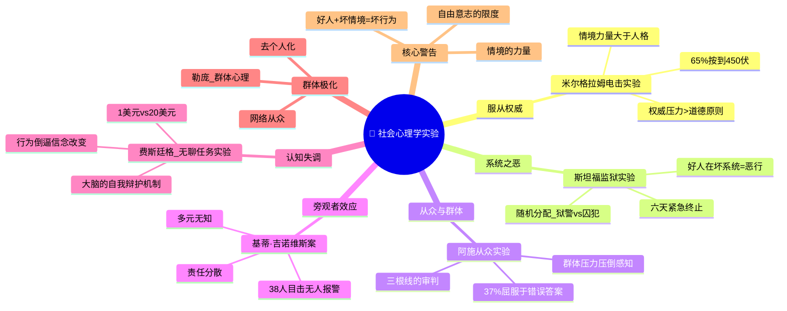

# Day 08：社会心理学实验——你比自己想象的更从众

> **悬疑提要**：1961年，耶鲁大学地下室。一个穿灰色实验外套的男人说："请继续。实验需要你继续。"被试犹豫了一下，按下了电击按钮。330伏。另一边的房间里传来尖叫声（其实是录音）。但"学生"被绑在椅子上出不来——实验者说继续。65%的人按到了450伏。你猜你会在第几伏站起来说"去你妈的"？精神病学家预测只有1%会按到底。他们都错了。

---

## 🍅 番茄 36/60：悬疑开场——米尔格拉姆的电击按钮

### 这不是关于折磨，这是关于服从

1961年，耶鲁大学地下室，一个叫**斯坦利·米尔格拉姆**的年轻社会心理学家正在进行一项实验。他通过报纸广告招募了40名男性被试——各种职业都有，从邮差到工程师。实验的名字听起来很正经："记忆与学习研究"。

实验流程是这样的：被试扮演"老师"，另一个看起来普普通通的中年男人扮演"学生"。"学生"被绑在隔壁房间的椅子上，手腕上连着电极。"老师"坐在一台电击发生器前，上面标着从15伏到450伏的刻度，每隔15伏配一个标签：从"轻微电击"到"危险——严重电击"再到最末的"XXX"。

实验者说：每答错一次，电击增加15伏。

"学生"是演员（一个叫华勒斯的会计师）。机器是假的。但被试不知道。

第一次电击后，"学生"发出轻声呻吟。到75伏，他开始叫痛。120伏，他大喊电击太痛了。150伏，他尖叫："放我出去！我有心脏病！" 270伏，他发出痛苦的尖叫后不再回答问题了。330伏之后，他彻底沉默了——或者说，看起来像失去了意识。

被试转身看着实验者："他要死了吗？我们是不是该停下了？"

实验者面无表情地说："请继续。实验需要你继续。"

**65%的被试按到了450伏。**

米尔格拉姆在正式实验前咨询了39位精神病学家，问他们普通人会怎么做。专家们预测：只有1%会按到450伏，大部分人会在150伏左右停下。米尔格拉姆自己也认为不会超过3%。

他们都错了。

实验结束后，被试之一、一个叫约瑟夫·迪莫夫的男人说了一句话，让米尔格拉姆记了一辈子：

> "我来这里是因为有一个人告诉我，'请继续，实验需要你继续'——而我相信了他。如果今天耶鲁大学烧起来了，我是不是也会按下按钮，去推平一座城市？"

### 为什么你不像你以为的那样"不同"

每当我讲这个故事，总有人不服气："现在不一样了，我们知道这个实验了，我不会服从的。"

真的吗？

后来有研究者在各种场景下复制了这个实验：女性被试和男性一样服从，甚至略高。实验地点从耶鲁换到破旧的办公楼，服从率几乎不变。被试被告知可以自由退出，但实验者只说"请继续"，大多数人就没停下。

**情境的力量比人格更强大。** 这或许是社会心理学告诉我们的最不舒服的真相——你自以为坚定的道德原则，在一个够精巧的"系统"面前，碎得比玻璃还快。

### ✅ 费曼三句话

```markdown
🧠 **费曼三句话**
1. 米尔格拉姆的实验告诉我们：在权威面前，普通人会做出违背自己良心的行为——不是因为他们是坏人，而是因为情境的压力太强了。
2. 日常例子：你老板让你做一件你觉得不对的事。他说"大家都这么做""这是公司的要求"。你会拒绝还是服从？米尔格拉姆说，大多数人会服从。
3. 我最惊讶的是：实验前精神病学家预测只有1%会按到450伏，结果65%的人按到了——我们对"自己的意志力"的估计和实际情况差距巨大。
```

### ❓ 悬疑追问

**米尔格拉姆实验最恐怖的地方不是"65%的人按了450伏"，而是那些停止的人——他们也花了很长时间才停下。没有人立刻站起来说"去你的"。这意味着什么？意味着即使在"站起来"这件事上，你也比你想象中慢了五到十秒。这五到十秒，可能就是你和"邪恶"之间的距离。**

---

## 🍅 番茄 37/60：斯坦福监狱实验——好人如何在坏系统中堕落

### 一场失控的角色扮演

三年后，1971年，斯坦福大学心理学系地下室。一个叫**菲利普·津巴多**的中年教授建了一座"监狱"。

他通过报纸广告招募了24名大学生——经过心理测试筛选出来的"正常人"，没有精神问题、没有暴力倾向、没有犯罪记录。然后，他像掷硬币一样把他们随机分成两组："狱警"和"囚犯"。

这只是一个"角色扮演实验"，计划持续两周。

你要记住这句话：**他们全都是好人，全都是随机分配的。**

"囚犯"在帕洛阿尔托警察局被"逮捕"，蒙上眼睛押送到斯坦福地下室。他们被脱光衣服，喷洒虱子药，穿上囚服，戴上脚镣，每人得到一个编号。

"狱警"穿着制服，戴着反光墨镜（防止眼神接触），拿着警棍。他们没有接受过任何如何做"坏狱警"的训练。津巴多只是说："维持秩序。"

第一天，一切正常。有点尴尬，有点好玩。像夏令营。

第二天，"囚犯"开始反抗——他们扯掉编号，堵住门。狱警慌了。半夜，他们冲进去，把带头的人拖出来关禁闭，用灭火器喷他们，让他们光手清理马桶。

第三天，狱警的虐待升级了。强迫囚犯做俯卧撑时踩在他们背上。不让他们上厕所。让他们互相骂对方。用性羞辱的方式对待他们。

第四天，一个囚犯精神崩溃，大哭、尖叫、思维混乱。津巴多不得不放了他。

第五天，又有人崩溃了。

第六天，实验被迫终止——不是因为外人叫停，而是因为津巴多的女朋友、一个叫**克里斯蒂娜·马斯拉奇**的研究者冲进来说："你在干什么？你知道你做的事情有多危险吗？"

**六天**。原计划两周。

你得记住：这些"狱警"不是变态。他们是邻居家的孩子，是你大学同学，是你自己。

### 系统才是真正的"坏蛋"

后来的分析表明：不是某些人有施虐倾向，而是**系统**——监狱制度、制服、权力不对称、去个人化——催生了这些行为。

津巴多后来用这个理论解释了阿布格莱布监狱虐囚事件。他说：别问"有几个坏苹果"，问"这个桶是不是有问题"。

社会心理学给出了人类最不愿意听到的答案：**情境的力量超过了人格。好人加上坏系统，可以等于可怕的行为。**

### ✅ 费曼三句话

```markdown
🧠 **费曼三句话**
1. 斯坦福监狱实验证明：环境的权力结构会使普通好人做出残忍行为——不是人的问题，是系统的问题。
2. 日常例子：一个平时温和的人进了官僚系统，变成推诿扯皮、冷漠无情的"公务员"——这不是他变了，是系统把他"教"成这样了。
3. 我想问：如果情境这么强大，那我们还有"自由意志"吗？知道这个道理之后，我能做什么来抵抗？
```

### ❓ 悬疑追问

**津巴多在实验第六天被叫停。但如果没有马斯拉奇的干预，你觉得他会自己停下来吗？更恐怖的问题是：那些在纳粹集中营、阿布格莱布、各地战争罪行中做出暴行的人——他们中有多少人和你一样，曾经坚信"我永远不会做这种事"？**

---

## 🍅 番茄 38/60：阿施从众 + 旁观者效应 + 认知失调

### 三根线的审判

1951年，**所罗门·阿施**做了一个看起来蠢到不能再蠢的实验。

他让被试坐在一张桌子前，和另外七个人一起。这七个人都是托儿。实验者拿出两张卡片：一张上有一条线（标准线），另一张上有三条线（A、B、C）。问题：三条线中哪一条和标准线一样长？

答案清楚得让人觉得被侮辱了——三条线的区别一眼就能看出来。但在每一轮中，七个托儿轮流说出显然是错的答案：

"是A。"

"是A。"

"是A。"

"是A。"

"是A。"

"是A。"

"是A。"

现在轮到你真的被试了。你坐在那里，看到的和所有人都"不一样"。你开始冒汗。你在想：是不是我眼睛有问题？他们全都看到了什么我没看到的东西？

你知道正确的答案是B。但你的嘴里说出来的话是——

**37%的人会跟着所有人说出错误答案。** 75%的人至少有一次屈服于群体压力。

阿施后来删掉了一个托儿，结果从众率直线下降。他把托儿增加到15个人，从众率并没有增加很多。关键是：**不需要很多人，只要三个以上坚定的声音，就足以让你怀疑自己的眼睛。**

### 为什么30分钟没人报警？

1964年3月13日凌晨3点，纽约皇后区，一个叫**基蒂·吉诺维斯**的28岁女子在下班回家的路上被一个男人持刀袭击。

她尖叫："救命！他捅了我！"

周围的公寓楼里有38个人听到了。有人打开灯。有人探出头看。

凶手跑掉了。又回来了。又捅了她。又跑了。又回来。

前后持续了**30分钟**。

没有任何人报警。

故事震惊了全美国。媒体愤怒地骂纽约人冷漠、麻木、自私。然后两个社会心理学家——**比布·拉丹和约翰·达利**——说：等等。这可能不是"冷漠"的问题。

他们做了一系列实验，发现了**旁观者效应**：

- 当一个人独处时看到有人冒烟（实验场景），75%的人会报告。
- 当房间里有三个人时，38%的人会报告。
- 当房间里有一个托儿站着不动时，即使只有你和他，你也可能不报告。

原因不是冷漠，是**责任分散**和**多元无知**：别人都没行动，说明可能没事。别人都没行动，那我不行动也没问题。

换句话说：**你以为你"没帮忙"是因为你冷漠，实际上"没帮忙"是因为你觉得别人会帮忙。** 这是一种认知错误，不是道德缺陷。

### 认知失调：当你做了蠢事，你的大脑会帮你找理由

**利昂·费斯廷格**在1957年提出的**认知失调理论**或许是人类自我欺骗的终极答案。

他发现：当人的行为与信念不一致时，会产生一种极度不舒服的心理紧张——失调。为了减少这种紧张，人会改变自己的信念，而不是改变行为。

经典实验：被试做了一小时极其无聊的任务（拧螺丝）。然后让他们对下一个被试说"这个任务很有趣"。给一半人1美元，给另一半人20美元。

结果：拿1美元的人反而说"这个任务挺有意思的"——因为拿20美元的人可以说"我是为了钱撒谎"，但拿1美元的人没法用这个借口，他们的潜意识只能说"好吧，其实也没那么无聊"来减少失调。

**你的大脑每天都在为你找理由。** 你以为你的信念是理性的，实际上它们很多是你为行为找的"事后借口"。

### ✅ 费曼三句话

```markdown
🧠 **费曼三句话**
1. 阿施从众实验：当所有人都说A是正确答案时，即使你眼睛告诉你答案是B，你也很可能会说A——群体压力可以压倒感知。
2. 旁观者效应：危机发生时，在场的人越多，你得到帮助的可能性越小——不是人们冷漠，是"责任分散"让每个人都觉得别人会行动。
3. 认知失调：当行为与信念矛盾时，大脑会改变信念来适应行为，而不是反过来——这叫"为你的行为找借口"。
```

### ❓ 悬疑追问

**阿施实验已经过去70年了。但如果你现在打开微博热搜，看评论区——你看到的是什么？当一亿人说"这个人该被骂"时，你会不会成为那个"少数派"想一想后保持了沉默的人？网络时代的大规模从众，比实验室里严重一万倍。**

---

## 🍅 番茄 39/60：🧠 思维导图——社会心理学核心实验树

> 这个番茄不学新内容。用思维导图把前三个番茄串起来。

### 🧠 Day 08 思维导图



> **如何阅读此图**：从中心"社会心理学实验"出发，六个分支对应六个核心主题。注意看它们的内在逻辑联系——"服从权威"和"系统之恶"共享"情境力量"这个底层逻辑，"从众"和"旁观者"共享"群体压力"这个机制，"认知失调"则是解释了为什么人会为自己的从众行为找理由。

### 🎤 费曼大挑战

用**一句话**解释为什么说"情境比人格更强大"——说给一个从未学过心理学的人听。

> *（提示：想想看，你和希特勒之间的区别，可能只是换了一个环境、一套制服、一个系统）*

**写下来：**

```
[你的版本]
```

### 🔗 连回生活

- 你想过没有——你在工作中为什么那么听老板的话？那是另一版本的米尔格拉姆。
- 你在网上看到一条"很多人都在转"的消息——你转之前有没有真正验证过？那是阿施实验的数字版。
- 你在路边看到有人晕倒——你停下来了吗？如果身边有五个人都没停，你呢？

---

## 🍅 番茄 40/60：刻意练习——悬疑推理实验室

### 案例1：分析一次你"从众"的经历

回想一个真实的场景：你在某个场合（工作会议、朋友聚会、家庭讨论）说了违心的话，或者做了违心的选择——因为你不想与大多数人不同。

请按以下框架分析：

1. **场景描述**：当时发生了什么？谁在场？讨论什么？
2. **内部体验**：你心里真实的想法是什么？你感觉到压力了吗？
3. **从众类型**：
   - 规范性从众（怕被排斥，想融入）？
   - 信息性从众（以为别人知道的比自己多）？
4. **认知失调**：事后你如何对自己解释这个行为？你找的"理由"是什么？
5. **如果重来**：知道了阿施和米尔格拉姆的结论后，你会怎么做？

> *提示：即使你是一个"从来不从众"的人，也请仔细想想——不从众本身也是一种从众（对"不从众的群体"的从众）。*

<details>
<summary><b>🔍 参考答案示例（先写你的再点开）</b></summary>

**场景**：项目会议上，领导说"这个方案没问题吧"，所有人都点头。我觉得有个大漏洞，但张了张嘴没说话。

**内部体验**：心跳加速，手心出汗。我想说"等一下"，但声音到喉咙就卡住了。

**从众类型**：规范性从众——我怕被看作"爱找茬的人"，怕破坏"团队氛围"。

**认知失调**：事后我告诉自己"其实那个问题也不严重""大家都没看出来说明是我多虑了"——典型的为沉默找借口。

**重来怎么做**：我会用"先确认再表达"的策略——"我想确认一个问题，如果B方案上线后用户反馈是负面的，我们有没有备用计划？"这样既表达了质疑，又没有直接对抗群体。

</details>

### 案例2：设计一个"打破旁观者效应"的干预方案

假设你是某公司的人力资源负责人。你发现公司内部举报机制形同虚设——有员工看到同事被霸凌、有安全隐患、有财务违规，但几乎没人报告。人人都"看到"，人人都不行动。

基于社会心理学的旁观者效应理论，设计一个干预方案。

你的方案需要回答：

1. **针对"责任分散"**：如何让每个人都感到"我有责任"而不是"别人会行动"？
2. **针对"多元无知"**：如何让员工知道"沉默不代表没事"？
3. **针对"权威压力"**：如果被举报的人是你的上级，你会怎么做？

<details>
<summary><b>🔍 参考答案（先写你的再点开）</b></summary>

**策略1 - 破除责任分散**：设立"指定举报人"制度——每个项目组指定一位"安全观察员"，轮岗制。当责任被明确到个人而不是分散到群体时，行动率显著上升。

**策略2 - 破除多元无知**：定期分享匿名举报案例，让员工看到"有人行动了"。示范效应打破"没人举报就是没问题"的假象。

**策略3 - 破除权威压力**：匿名举报通道由独立第三方运营（而非公司内部HR）。米尔格拉姆实验告诉我们，权威的压力真实存在，所以需要从外部打破权力结构。

**核心原理**：拉丹和达利的实验证明，旁观者效应的核心不是"人的冷漠"，而是"情境的模糊性"。当你把责任说清楚、把期望说明白、把渠道弄安全，大部分人其实愿意帮忙。

</details>

### 悬疑推理题

**一间实验室。40名被试。一台"电击发生器"（假的）。一个"学生"（演员）。一个穿实验外套的实验者。**

**第一个实验：被试和"学生"在同一房间。被试按电钮，"学生"就在旁边。服从率：40%。**

**第二个实验：被试和"学生"在不同房间，"学生"的声音通过墙传来。服从率：62.5%。**

**第三个实验：被试不用自己按电钮，只需要辅助实验者操作。服从率：92.5%。**

问：为什么距离越远、责任越分散，服从率越高？这个结论在现实生活中的什么场景里最危险？

<details>
<summary><b>🔍 推理答案（先想再点开）</b></summary>

距离越远，受害者的"人性"越模糊。你听不到他的尖叫、看不到他的表情、感受不到他的痛苦——所以你的道德判断更容易被"权威"压制。这就是为什么战争中的杀人往往是远程的（轰炸机飞行员比面对面拼刺刀的人更容易"执行命令"），也是为什么网络暴力比现实暴力更残忍——你看到的只是屏幕上的文字，不是一张流泪的脸。**米尔格拉姆的结论：人性需要近距离才能激活。越远，你越"理性"，也越冷血。**

</details>

### 📊 今日进度

```
Day 08/12 [████████████████░░░░░░░░] 40/60 🍅
社会心理学的大门已经撞开。明天我们去看你生命中最早期、最深刻的那个东西——依恋。
```

### ✅ 今日备考卡片

| 概念 | 一句话解释 |
|------|-----------|
| 米尔格拉姆服从实验 | 65%的普通人会按到450伏——因为权威说你"必须继续" |
| 斯坦福监狱实验 | 好人+坏系统=恶行，六天之内大学生变成虐待狂 |
| 阿施从众实验 | 明知答案是错的，仍有37%的人跟着群体说错的 |
| 旁观者效应 | 人越多，越没人帮忙——不是冷漠，是"别人会做" |
| 责任分散 | 责任被分摊到更多人身上时，个人行动概率下降 |
| 认知失调 | 做了蠢事后，大脑会改变信念来让这个行为看起来合理 |
| 情境力量 | 环境对行为的影响远大于你对自己"人格"的想象 |

---

**→ 明日预告：[[Day09-发展心理学与依恋·童年如何写就人生剧本]]**

明天是发展心理学。你知道你的恋爱模式在你一岁前就已经写好了"源代码"吗？不是宿命，但它是出厂设置。你将用一辈子重写它。
