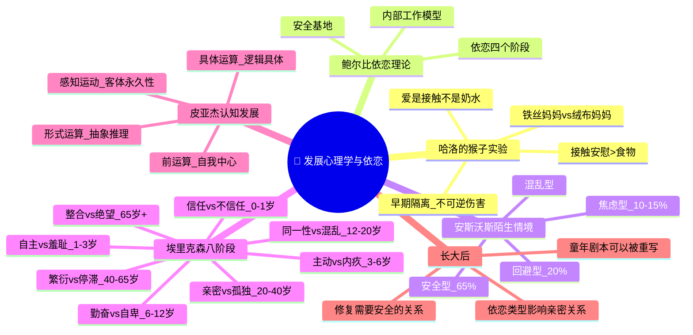

# Day 09：发展心理学与依恋——童年如何写就人生剧本

> **悬疑提要**：铁丝妈妈，vs绒布妈妈。小猴子饿了去找铁丝妈妈吃奶，但害怕时死死抱住绒布妈妈。哈洛的实验粉碎了"孩子爱妈妈是因为妈妈提供食物"这个行为主义教条——爱不是奶水，是接触安慰。但真正让人不寒而栗的是：你今天的恋爱模式、你在一段关系中的焦虑或逃避，很可能在一岁前就写好了"源代码"。

---

## 🍅 番茄 41/60：悬疑开场——哈洛的猴子妈妈

### 一个被低估的残忍天才

**哈里·哈洛**，威斯康星大学的心理学家。他在1950年代做了一系列实验，时至今日仍然是发展心理学中最有影响力的研究之一——也是最残忍的研究之一。

在哈洛之前，心理学界的主流看法是：婴儿爱母亲，是因为母亲提供食物。行为主义大佬**约翰·华生**甚至说过："母爱是一种被滥用的情感，会导致孩子依赖。"斯金纳也认为，爱的本质就是强化——喂奶就是最大的强化。

哈洛觉得这个说法不对。但他需要用实验来证明。

他做了两样东西：
- **铁丝妈妈**：一个裸露的铁丝网制成的猴子模型，胸前装了一个奶瓶。
- **绒布妈妈**：同样的铁丝骨架，但外面裹上了柔软的绒布。没有奶瓶。

刚出生的小猴子被放进笼子里。它们饿了，会跑到铁丝妈妈那儿吃奶。但一旦受到惊吓——哈洛放了一只发条玩具熊进去——小猴子做的第一件事是什么呢？

**冲向绒布妈妈，死死抱住不放。**

只要绒布妈妈在，小猴子就能慢慢平静下来，然后开始探索周围的环境。但如果只有铁丝妈妈在场——即使它有奶——小猴子也会缩在角落里，拼命发抖，无法平静。

哈洛的实验结果简单直接：

> **爱不是奶水。爱是接触安慰。**

### 更黑暗的后续

哈洛没有停下。他想知道：如果小猴子只有铁丝妈妈，没有绒布妈妈，会怎样？

他养了一批小猴子，只有铁丝妈妈没有绒布妈妈。结果令人心碎：这些猴子长大后出现了严重的社交障碍——它们无法与其他猴子正常互动，不会交配。哈洛不得不发明了一个"强暴架"（这是他自己的命名，你感受一下这个人的冷酷程度）来强迫母猴交配。这些母猴怀孕生下小猴子后，对自己的孩子表现出了可怕的冷漠——有些甚至咬掉了自己孩子的手指。

哈洛的结论：早期依恋经验是不可逆的。如果在关键期缺乏亲密接触，社会能力会永久受损。

**悬疑钩子：** 你现在觉得"独立"和"不需要任何人"是自己的优点——但你的大脑可能是在说另一种故事。哈洛的实验逼我们面对一个不舒服的问题：**你此刻的"独立"，是真正的成熟，还是一个从小没得到足够拥抱的人，给自己建的保护壳？**

### ✅ 费曼三句话

```markdown
🧠 **费曼三句话**
1. 哈洛的实验证明：婴儿对母亲的爱不是源于食物（奶水），而是源于接触安慰（柔软的触觉和温暖）——"有奶不是娘"真实存在。
2. 日常例子：为什么小孩摔倒了会哭着找妈妈抱？不是因为妈妈能止痛，而是拥抱本身提供了安全感——这也解释了为什么成年后难过时，一个拥抱比任何安慰的话都管用。
3. 我想知道：如果婴儿期缺爱的影响是不可逆的，那么长大后形成的"假独立"和"不信任他人"该怎么办？能修复吗？
```

### ❓ 悬疑追问

**哈洛的猴子实验已经过去70年了。但你的大脑里还运行着同样的操作系统。当你在一段关系中感到不安全时，你的第一反应是"靠近"还是"逃离"？那不是你的选择——那是你一岁前就写好的代码。**

---

## 🍅 番茄 42/60：鲍尔比的依恋理论——你爱的方式，由谁决定？

### 一个英国精神科医生发现了"出厂设置"

**约翰·鲍尔比**，英国精神科医生。他在1950年代受世界卫生组织委托，研究那些在孤儿院长大的孩子的心理健康状况。

他发现了一个令人不安的事实：在孤儿院长大的孩子，虽然得到了充分的物质照顾（食物、住所、医疗），但很多都出现了严重的情感和社交问题。有些孩子完全无法建立亲密关系；有些则对任何人都过于亲密——他们不知道"界线"是什么。

鲍尔比说：**人类婴儿在进化过程中被预设了一个程序——为了生存，必须与一个主要照顾者建立亲密的情感纽带。** 这叫做**依恋**。

他提出了依恋的四个阶段：
1. **前依恋期**（0-6周）：婴儿对任何人都发出信号（哭、笑），不区分。
2. **依恋形成期**（6周-6-8个月）：开始区分熟悉的人和陌生人。
3. **明确依恋期**（6-8个月-18个月）：出现"分离焦虑"，母亲离开就哭。陌生人焦虑出现。
4. **目标修正的合作关系**（18个月+）：能理解母亲的离开和回来，开始能等待。

### 安斯沃斯的"陌生情境实验"

鲍尔比的理论需要实证。他的同事**玛丽·安斯沃斯**设计了**陌生情境实验**——这个实验后来成为发展心理学中最经典的程序之一。

实验是这样进行的：
1. 妈妈和宝宝（12-18个月）进入一个放满玩具的房间。
2. 妈妈和宝宝一起玩。
3. 一个陌生人进入。
4. 妈妈离开。
5. 妈妈回来。
6. 妈妈再次离开。
7. 陌生人进来。
8. 妈妈再次回来。

重点观察的，不是宝宝在妈妈离开时哭不哭——而是**妈妈回来时，宝宝的反应**。

安斯沃斯发现了三种明确的依恋类型：

**安全型依恋（约65%）**
妈妈离开时，宝宝不开心。妈妈回来时，宝宝开心地迎接，很快被安抚，然后继续探索。这些宝宝的妈妈通常敏感、回应及时——宝宝哭了很快来抱，宝宝笑了她也笑。

**回避型依恋（约20%）**
妈妈离开时，宝宝看起来不在意。妈妈回来时，宝宝也不迎接，甚至转身。但别被骗了——他们的心跳在加速，皮质醇在飙升。表面上"不在乎"，身体很诚实。这些宝宝的妈妈通常拒绝或忽视宝宝的信号——"别惯坏他"。

**焦虑-矛盾型依恋（约10-15%）**
妈妈离开时，宝宝极度痛苦。妈妈回来时，宝宝既想靠近又抗拒——冲到妈妈怀里，然后打她、推她。无法被安抚。这些宝宝的妈妈回应不一致——有时候很热情，有时候很冷漠，宝宝无法预测妈妈的"程序"。

后来有研究者又发现了第四种：**混乱型依恋**——表现出矛盾的行为，冻结、原地打转，通常是受到过忽视或虐待的孩子。

### 把"童年剧本"读到现在

**悬疑钩子：你的恋爱模式在你一岁前就写好了程序。** 这不是宿命，但它是你的"出厂设置"。

- 你是**安全型**：你在关系中不焦虑、不害怕依赖别人、也知道给别人空间。
- 你是**回避型**：你常说"我不需要任何人""我很独立"。但夜深人静的时候，你感到的"孤独"可能不是真的享受，只是你从来没学过怎么靠近别人。
- 你是**焦虑型**：你总是担心对方不爱你，需要反复确认。对方没回消息就开始脑补被抛弃。

好消息是：**出厂设置可以被改写。** 鲍尔比和安斯沃斯的后续研究以及现代依恋研究表明，通过一段安全的关系（好的伴侣、治疗师、朋友），你的"内部工作模型"可以被更新。

### ✅ 费曼三句话

```markdown
🧠 **费曼三句话**
1. 鲍尔比说婴儿天生需要与一个主要照顾者建立情感纽带——这不只是"想要被爱"，而是"没有这个纽带，大脑的正常发育都会受影响"。
2. 日常例子：你为什么会反复爱上同一类"不对的人"？那不是命运，是你一岁时写的"亲密关系脚本"在自动播放——你熟悉的感觉，即使是不健康的，也是你的"安全区"。
3. 我关心的是：如果我成年后变成了不安全型依恋，我要怎么重写这个程序？是不是一定要通过一段新的关系来"修复"？
```

### ❓ 悬疑追问

**安斯沃斯的陌生情境实验只做了20分钟，却能预测孩子未来十几年的行为模式。你觉得这是不是意味着：你一生中最重要的关系模式，在你会说话之前就已经确定了？如果真是这样——你是在"活出"你的童年剧本，还是在"重写"它？**

---

## 🍅 番茄 43/60：埃里克森人生八阶段 + 皮亚杰认知发展

### 埃里克森：一生都在成长

**埃里克·埃里克森**，一个非典型的心理学家。他没有大学文凭（这在当时的哈佛教授中极其罕见），但他的理论可能是发展心理学中最有影响力的框架之一。

他提出了**心理社会发展的八个阶段**——核心思想是：人的一生都处在发展中，不是长大了就"定型"了。每个阶段有一个核心冲突要解决：

**阶段1：信任 vs 不信任**（0-1岁）
核心问题：这个世界是安全的还是危险的？
如果照顾者及时回应，婴儿学会"信任"。如果不被回应或回应不一致，婴儿学会"这个世界不安全"。

**阶段2：自主 vs 羞耻**（1-3岁）
核心问题：我能自己做决定吗？
如果允许尝试，发展自主感。如果过度控制或嘲笑失败，发展羞耻感。

**阶段3：主动 vs 内疚**（3-6岁）
核心问题：我敢于探索和行动吗？
如果鼓励想象和主动，发展主动性。如果惩罚或禁止，发展内疚感。

**阶段4：勤奋 vs 自卑**（6-12岁）
核心问题：我能不能做成事？
如果在学校或活动中得到肯定，发展勤奋感。如果总是失败或被迫比较，发展自卑感。

**阶段5：自我同一性 vs 角色混乱**（12-20岁）
核心问题：我是谁？我要成为什么？
这是最著名的一个阶段——"青春期危机"。尝试不同的身份，最终形成稳定的自我。否则陷入角色混乱。

**阶段6：亲密 vs 孤独**（20-40岁）
核心问题：我能爱别人吗？
如果有了稳定自我，可以与他人建立真正的亲密关系。否则陷入孤独。

**阶段7：繁衍 vs 停滞**（40-65岁）
核心问题：我能为下一代做什么？
通过养育孩子、教导年轻人、创造有价值的东西来"繁衍"。否则陷入停滞和自恋。

**阶段8：自我整合 vs 绝望**（65岁+）
核心问题：我的一生有意义吗？
回顾一生，如果觉得"我尽力了"——获得智慧。如果觉得"我浪费了生命"——陷入绝望。

### 皮亚杰：你的孩子脑回路和你的不一样

**让·皮亚杰**，瑞士心理学家。他的理论被骂过、被修正过，但没有人能绕过他。他的方法是：**观察自己的三个孩子。**

皮亚杰的**认知发展阶段**：

**感知运动期**（0-2岁）
婴儿通过感官和动作认识世界。
关键里程碑：**客体永久性**——知道"看不见的东西仍然存在"。你没发现这个能力有多神奇吗？6个月前的婴儿，你把玩具藏起来，他就觉得玩具"消失了"。他还没有"看不见的东西也存在"的概念。

**前运算期**（2-7岁）
语言爆发。但思维仍然是"自我中心的"——典型的例子：三岁小孩给你打电话，他会对着话筒点头而不是说话。因为他以为你也能看到他。另外，这个阶段的孩子没有"守恒"概念——你把同样多的水倒进一个细高杯子，他觉得水"变多了"。

**具体运算期**（7-11岁）
逻辑思维出现，但只能处理具体、可见的问题。守恒概念建立。能做分类和排序。

**形式运算期**（11岁+）
抽象思维能力出现。"如果……那么……"推理。能思考"正义""自由"这些抽象概念。能系统地思考可能性。

**悬疑钩子：** 你和一个3岁孩子看到的是同一个世界，但你们理解的是完全不同的世界。皮亚杰说：**孩子的思维不是成人的"缩小版"，而是一个完全不同的操作系统。** 你试着用逻辑和一个3岁孩子讲道理——这就是为什么你会崩溃。

### ✅ 费曼三句话

```markdown
🧠 **费曼三句话**
1. 埃里克森说人的一生有八个发展危机——不只是青春期和中年危机，从出生到死亡，每个阶段都有一个需要解决的核心冲突。
2. 皮亚杰说孩子的思维和成人完全不同：2岁前的孩子认为"看不见=不存在"，3岁的孩子认为"别人看到的世界和我看到的一样"。
3. 我觉得最有用的是：埃里克森的"亲密vs孤独"阶段解释了为什么20-40岁之间是建立真正亲密关系的关键期——你需要先知道"我是谁"，才能真的去"爱别人"。
```

### ❓ 悬疑追问

**埃里克森说每个阶段都有一个"关键冲突"——如果你在某一个阶段没有解决好，它不会消失，而是会在后面的阶段中以更丑陋的方式复发。你现在遇到的人生问题——你确定它是"现在"的问题，还是某个你没有通过的"关卡"留到现在的"补考"？**

---

## 🍅 番茄 44/60：🧠 思维导图——发展心理学与依恋

> 这个番茄不学新内容。用思维导图把前三个番茄串起来。

### 🧠 Day 09 思维导图



> **如何阅读此图**：从中心出发，上方两支是"实验发现"（哈洛和鲍尔比），中间是"依恋类型"（安斯沃斯的实验室分类），下方两支是"毕生发展理论"（埃里克森和皮亚杰）。最下方是"长大了怎么办"。注意，埃里克森的八个阶段形成了发展的"纵轴"，而皮亚杰的阶段形成了认知的"横轴"。

### 🎤 费曼大挑战

用**一句话**向一个刚当上父母的朋友解释：为什么"抱孩子"比"喂孩子"对孩子的发展更重要。

> *（提示：哈洛的猴子已经替你做了实验——但人不是猴子，你的孩子更不是。延伸思考一下。）*

**写下来：**

```
[你的版本]
```

### 🔗 连回生活

- 你在亲密关系中的模式——你能否识别出它是"安全型""回避型"还是"焦虑型"？
- 你现在的某个"积极行动"——是不是因为你小时候太"被动"了？
- 你无法跟父母沟通的某些点——是不是因为他们还在你小时候那个阶段？
- 你30岁以后突然开始思考"我是谁"——那可能不是中年危机，是埃里克森的第五阶段延迟到来了。

---

## 🍅 番茄 45/60：刻意练习——悬疑推理实验室

### 案例1：依恋类型自测反思

依恋类型不是标签，而是一个反思工具。请阅读以下描述并诚实地回答：**哪一个最能描述你在亲密关系中的典型模式？**

**模式A - "我需要空间。"**
你被评价为"独立"、"冷静"。你不太依赖别人，也不喜欢别人太依赖你。分手时你恢复得很快——或者说你看起来恢复得很快。但有时你也会觉得"为什么大家都谈恋爱只有我无所谓"——你真的无所谓吗？

**模式B - "你到底爱不爱我？"**
你总在确认对方的态度。一条消息没回就能让你坐立不安。你觉得你付出很多，但总也得不到对等的回报。你害怕被抛弃，而这种恐惧恰好让你变得"太需要对方"，有时候反而把对方推开了。

**模式C - "我可以依赖别人，别人也可以依赖我。"**
你在一段关系中感到安全。对方需要空间你可以给，你需要支持时你会说。分手会难过但不会崩溃。你不觉得你的价值取决于一段关系有没有"成功"。

反思问题：
1. 你的模式可能是什么类型？
2. 这个模式和你小时候的养育经历有什么可能的关联？
3. 如果你是回避型或焦虑型——你是否遇到过某个人（朋友或前任或治疗师），让你感到"安全"？那个人的什么特质让你感到安全？

<details>
<summary><b>🔍 分析参考（先写你的再点开）</b></summary>

**模式A（回避型）形成可能原因**：婴儿期照顾者拒绝或忽视信号。孩子学会了"不需要别人也能活"——这是一种适应策略。问题在于：这个策略在婴儿期有用，在成年后的亲密关系中可能成为障碍。

**模式B（焦虑型）形成可能原因**：婴儿期照顾者回应不一致。孩子学会了"我必须大声求救才能得到关注"——所以成年后也总是在"确认连接"。

**模式C（安全型）**：通常婴儿期得到了一致、敏感的回应。但安全型也可以在童年后期甚至成年后通过修复性关系获得。

**核心信息**：你不是你的依恋类型。它是你学到的模式，而学到的模式可以被重新学习。

**修复最有效的方式**：一段安全的关系——一个好的伴侣、一个好的治疗师、一段真诚的友谊。安全的关系提供了一个"正确的关系体验"，你的大脑会慢慢更新"什么是关系"的底层模型。

</details>

### 案例2：用埃里克森理论分析你目前面临的发展危机

假设你35岁（或者你现在的年龄），你目前正在经历某个让你焦虑、困惑、甚至痛苦的"人生问题"。

用埃里克森的阶段理论来分析：

**第一步：你目前在哪个阶段？**
- 20-40岁 → 亲密 vs 孤独（核心问题：我能爱别人吗？）
- 40-65岁 → 繁衍 vs 停滞（核心问题：我能为世界留下什么？）
- 如果两个阶段都像——那可能是前一阶段的问题没解决，叠加到了后一阶段。

**第二步：你的困扰是什么？** 详细写下来。

**第三步：这个困扰是否可以追溯到早期阶段的未完成任务？**
- 如果你无法建立亲密关系——是不是"同一性"阶段（12-20岁）没完成？你不知道自己是谁，所以无法和别人"融合"？
- 如果你害怕主动行动——是不是"主动vs内疚"阶段（3-6岁）的残留？
- 如果你在亲密关系中无法信任对方——是不是"信任vs不信任"阶段（0-1岁）的痕迹？

**第四步：你在这个阶段可以做什么来"通过考验"？**

<details>
<summary><b>🔍 示例（先写你的再点开）</b></summary>

**假设：** 你32岁，无法建立稳定的恋爱关系。

**当前阶段**：亲密 vs 孤独。

**核心问题**：每次靠近到一定程度就"跑"了——觉得对方不够好/自己还没准备好/时机不对。

**回溯**：第五阶段（同一性）可能没完全解决——你没有确立"我是谁"，所以当另一个人要求你"展示你的全部"时，你感到恐惧——"如果我展示了自己，你不接受怎么办？"或者，更深的——第一阶段（信任）问题——你不相信世界上有人会真的对你好，你的潜意识认为所有的爱都是有条件的。

**解决方案**：埃里克森的理论提示我们——发展阶段是可以"返回"的。你现在可以通过一段安全的关系（不是随便找个人，而是学习识别安全的人），重新经历"信任"的练习。先学会相信一个人，再学会展示自己，最后才可能真正"亲密"。

</details>

### 悬疑推理题

**一个女人带着两岁的儿子去看医生。她说："我儿子从来不哭不闹，摔倒了也不哭，我离开他也不哭，谁抱他都行。我是个好妈妈，不是吗？"**

**医生说："小姐，你儿子可能不是你想象的那样健康。"**

问：为什么医生这么说？这个孩子的"不哭不闹"可能隐藏了什么心理问题？

<details>
<summary><b>🔍 推理答案（先想再点开）</b></summary>

这个孩子的行为表现"过度冷静"——两岁的孩子摔倒不哭、妈妈离开不焦虑，反而是一种危险信号。

在安斯沃斯的分类中，这是一个典型的**回避型依恋**表现。孩子在重复被拒绝后学会了"表达需要也没用"，所以干脆不表达了。看起来"独立"、"好带"——但这是"习得的无助感"的幼儿版。

**关键区别**：安全的独立是"我知道你在，所以我可以去探索"。不安全的"独立"是"反正你不理我，我也不需要你"。从外表看都是不哭不闹，内在机制完全不同。

这就是医生担心的地方：这个孩子不是"不哭不闹"，是"放弃了哭闹"——他在人际关系中已经放弃了表达需求。而婴儿期放弃表达需求的人，长大后往往成了那个"我没事""我不需要任何人""我一个人也很好"的成年人。

**你身边有这样的人吗？**

</details>

### 📊 今日进度

```
Day 09/12 [██████████████████░░░░░░] 45/60 🍅
你的童年剧本已经读完了。但——剧本是可以改写的。明天我们要去的地方更接近本质：你到底是谁？
```

### ✅ 今日备考卡片

| 概念 | 一句话解释 |
|------|-----------|
| 哈洛接触安慰 | 小猴子选择绒布妈妈而不是有奶的铁丝妈妈——爱是拥抱不是食物 |
| 依恋理论 | 鲍尔比说婴儿天生需要与一个主要照顾者建立情感纽带，这影响一生 |
| 安全型依恋 | 妈妈=安全基地 → 能探索世界也能安心回来 |
| 回避型依恋 | 看起来"不需要别人"——实际上是放弃了表达需要 |
| 焦虑型依恋 | 总是在确认对方还在不在——小时候的回应让人无法预测 |
| 埃里克森八阶段 | 从"信任vs不信任"到"自我整合vs绝望"——一生都在发展 |
| 客体永久性 | 皮亚杰发现的：6个月前婴儿以为"看不见=不存在" |
| 陌生情境实验 | 安斯沃斯设计的最经典的依恋分类实验 |

---

**→ 明日预告：[[Day10-人格心理学·你到底是谁]]**

巴纳姆效应说你看星座觉得"太准了"——但心理学家用统计学而不是玄学来研究人格。明天我们解剖"你"。准备好了吗？
