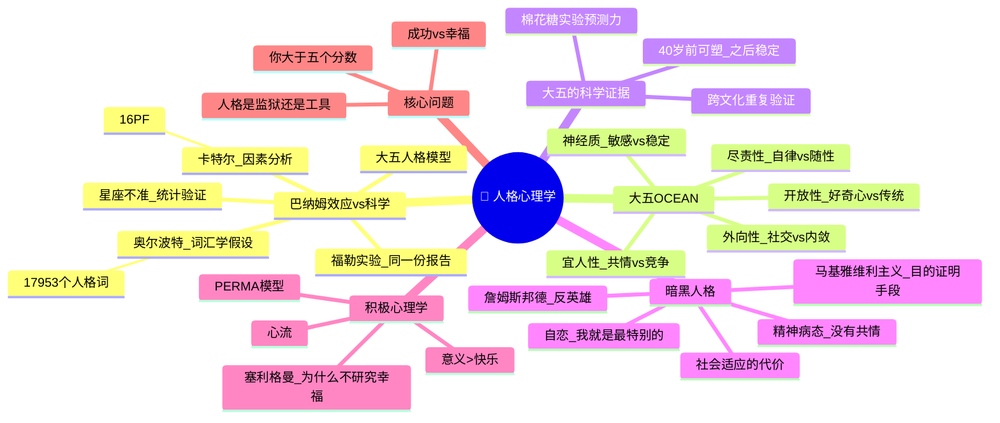

# Day 10：人格心理学——你到底是谁？

> **悬疑提要**：为什么读星座运势你总觉得"太准了"？巴纳姆效应说——因为那些描述对谁都适用。但奥尔波特和卡特尔走上了一条不同的路：用统计学而不是玄学来研究人格。如果你和一万个人做同一个性格测试，你会发现在某些维度上你和其他人完全不一样——这就是人格心理学想捕捉的东西：让你成为"你"的那个独特模式。但问题是——那个"你"，真的存在吗？

---

## 🍅 番茄 46/60：悬疑开场——星座真的准吗？

### 一个实验揭露了一个谎言

1948年，心理学家**伯特伦·福勒**给他的学生们做了一个"性格测试"。一周后，他给每个学生发了一份"针对你个人的性格分析报告"。然后让学生打分：这份报告的准确度如何？

平均分：**4.26分（满分5分）**。

学生们震惊地说："太准了！这就是我！"

他们不知道的是：福勒给所有人发的是**同一份报告**。报告的内容来自于一本星座书。

这些描述听起来确实很准，不是吗？"你有时外向善谈，有时内向谨慎。你希望别人喜欢你，但你也会对自己要求严格。你有一些潜在的能力还没有被充分利用。你表面自律，但内心会感到不安……"

**等一下。谁不是这样？**

这就是**巴纳姆效应**——笼统的、普遍的人格描述，因为足够模糊，所以每个人都会觉得"说的就是我"。

福勒的实验揭示了一个令人不安的事实：**我们对自己并不像想象中那么了解。** 我们那么容易接受一个"权威的"解释——只要它听起来够美好。

### 奥尔波特：走上另一条路

**戈登·奥尔波特**，哈佛大学教授，人格心理学的奠基人之一。他对占星术和弗洛伊德的"深度解释"都不满意——前者是骗术，后者无法被验证。

他说：我们要用科学的方法研究人格。

他的方法非常朴素：**去翻字典。**

1936年，奥尔波特和他的研究生亨利·奥德博特干了一件看起来有点蠢但实际上非常聪明的事——他们翻遍了《韦氏新国际英语词典》，找出了所有描述人的词。

他们找到了**17,953个**。

然后他们删掉同义词，得到**4,504个**。

这4,504个词，就是英语中描述人格的全部词汇库。这个逻辑是：**如果一个特质真实存在，它就一定会在语言中有对应的词。** 这就是"词汇学假设"。

从此，一位心理学家不再需要"猜"人格有什么构成元素。他们只需要分析这4500个词，看它们如何"聚类"——同义词总会自动归到一起。你用"健谈的、活泼的、精力充沛的"来描述一个人时，这些词会互相印证；但它们和"有条理的、谨慎的、整洁的"这一类词不会混在一起。

奥尔波特没有完成最后一步——因为他缺一个数学工具。

### 卡特尔和"因素分析"

**雷蒙德·卡特尔**，英裔美国心理学家，完成了奥尔波特没做完的事。他用一种叫**因素分析**的统计方法，让数据自己"说话"。

因素分析的工作方式：你让成千上万的人用一堆形容词描述自己。如果"健谈的"和"活泼的"总是同时出现（得分相关度高），说明它们背后有同一个"因素"在驱动。如果"健谈的"和"整洁的"不太相关，说明它们属于不同的因素。

卡特尔的初始研究找到了16种"根源特质"（他做了著名的16PF人格测验）。但后来的研究者发现，这16个因素其实可以进一步归纳为5个更大的维度。

这就是**大五人格模型**的诞生——从词汇到数据，从数据到因素，从因素到五个基本维度。

**悬疑钩子：** 星座说你"感性、浪漫、有艺术气质"——大五人格说你在"开放性"维度上得分较高。这两个说法描述的是同一个现象，但一个来自2000年前的占星术，一个来自数万人的统计学数据。你信哪个？

### ✅ 费曼三句话

```markdown
🧠 **费曼三句话**
1. 巴纳姆效应：模糊的描述让人觉得"说得就是我"——星座、算命、某些性格测试都用这个原理让你觉得"准"。
2. 奥尔波特的关键突破：不从理论出发猜人格有什么构成，而是从语言中找——如果一个特质真的存在，语言中一定有描述它的词。
3. 我想知道：如果人格可以用五个维度来"测量"，那"我"到底是一个真实的自我，还是五个分数的组合？人格测量的结果是"我"，还是"我"的一个简笔画？
```

### ❓ 悬疑追问

**奥尔波特花了几年从字典里翻出4500个词来研究人格。但他漏掉了一个问题：这些词描述的"人格"，到底是真实的你，还是社会期待你成为的样子？换句话说，你是真的"外向"，还是因为你生活在一个喜欢外向者的社会里，所以你不得不表现得外向——以至于在问卷里你也勾选了"外向"？**

---

## 🍅 番茄 47/60：大五人格模型——五个数字抓住了你

### OCEAN：人格的"元素周期表"

20世纪80-90年代，经过数十年的研究和跨文化验证，心理学家们达成了共识：**大多数人格差异可以用五个基本维度来描述。**

这五个维度被称为**大五人格**，记忆口诀是**OCEAN**：

**O - 开放性**（Openness to Experience）
高分：好奇心强、想象力丰富、喜欢新体验、不墨守成规。
低分：传统、务实、喜欢熟悉的事物、不太喜欢改变。

**C - 尽责性**（Conscientiousness）
高分：自律、有条理、目标导向、靠谱、能延迟满足。
低分：随性、松散、容易分心、不太在乎计划。

**E - 外向性**（Extraversion）
高分：社交活跃、精力充沛、喜欢成为焦点。
低分：安静、内敛、独处恢复能量（注意：这不等于社交焦虑）。

**A - 宜人性**（Agreeableness）
高分：有同情心、合作、信任他人、避免冲突。
低分：竞争性强、质疑他人动机、直接果断（说白了：不好惹）。

**N - 神经质**（Neuroticism）
高分：容易焦虑、情绪波动大、对威胁信号敏感。
低分：情绪稳定、心态平和、不太容易紧张。

### 米歇尔的棉花糖实验

1970年代，**沃尔特·米歇尔**做了一个后来举世闻名的**棉花糖实验**。

他让4-6岁的孩子单独坐在房间里，面前放着一颗棉花糖。实验者说："我要出去一下。如果你等我回来再吃，我就给你两颗。"然后离开。

一些孩子立刻把棉花糖吃了。一些孩子坚持了几分钟。少数孩子坚持了15分钟等到了第二颗棉花糖。

十几年后，米歇尔追踪这些孩子发现：那些能延迟满足的孩子，在学业成绩、社交能力、压力应对上表现更好。

**这个实验测量的，本质上就是"尽责性"。**

### 大五人格的跨文化验证

大五人格模型最牛逼的地方不在于它"看起来有道理"，而在于它在不同文化中得到了重复验证：

- 美国、德国、日本、中国、土耳其、南非……
- 用不同语言、不同的形容词列表、不同的人群
- **同样的五个维度反复出现**

这说明大五人格不是"西方文化的偏见"，而可能是人类大脑在描述他人时自然采用的**基本分类方式**。

### 人格会变吗？

好消息：**会变。** 但变化比你想象中慢。

大五人格的纵向研究表明：
- 随着年龄增长，神经质会缓慢下降。
- 尽责性和宜人性会缓慢上升——这就是"成熟效应"。
- 外向性和开放性有些波动，但总体稳定。

坏消息是：**40岁之后，人格基本定型。** 不是完全不变，但变化幅度非常小。

人格不是"监狱"，但它是"默认设置"——你可以改写它，但需要付出持续的努力。

### ✅ 费曼三句话

```markdown
🧠 **费曼三句话**
1. 大五人格模型说所有人的人格差异可以归纳为五个维度：开放性、尽责性、外向性、宜人性、神经质——这五个维度在不同文化和语言中都被证实存在。
2. 棉花糖实验测试的是"尽责性"——它预测了十几年后孩子的学习成绩和社交能力，说明人格特质不是随便分类，而是有实际预测力的。
3. 我必须记住的是：大五人格是描述工具，不是铁笼——"你"大于五个分数。而且人格在40岁前是有明显可塑性的。
```

### ❓ 悬疑追问

**大五人格说五个维度就够了。但你真的觉得五个数字能"抓住"一个人吗？你的朋友最让你欣赏的那个"特质"——是善良（归入宜人性）还是坚韧（归入尽责性），还是需要一个更细致的词？五个真的够吗？也许"人格"和"星座"的差别不在于"分类的维度有几个"，而在于"我是否被一个分类减少了"。**

---

## 🍅 番茄 48/60：暗黑人格 + 积极心理学

### 人性的灰暗面：黑暗三人格

如果大五人格是人格的"光明面"——描述了人如何适应和融入社会——那么还有一个"灰暗面"需要正视。

**黑暗三人格**（Dark Triad）是心理学家保罗赫斯和威廉姆斯在2002年提出的模型，包含三个相互关联但各自独立的人格特质：

**1. 自恋（Narcissism）**
核心特征：自我膨胀、需要持续的被赞美、认为自己特殊。
著名案例：纳西索斯爱上了自己水中的倒影。
日常表现：朋友圈全是自拍和成就展示；不能接受批评；在人群中一定要成为焦点。
隐藏真相：高自恋者的自信其实很脆弱——一旦受到批评就会暴怒或崩溃。他们的"自尊"建立在"我比别人好"上，而不是"我本身就是有价值的"。

**2. 马基雅维利主义（Machiavellianism）**
核心特征：操纵、算计、认为目的可以证明手段。
得名来源：尼可罗·马基雅维利的《君主论》——"为了维护权力，君主可以不择手段"。
日常表现：精于算计，总是评估别人"对我有什么利用价值"；善于伪装；说谎时面不改色。
隐藏真相：他们不是"不知道"道德，而是"不在乎"道德。在他们看来，道德是弱者的枷锁。

**3. 精神病态（Psychopathy）**
核心特征：缺乏共情、冲动、感-觉寻求、低焦虑。
注意：这不是"连环杀手"那个意思。大多数高精神病态者不杀人——他们只是无法真正感受别人的痛苦。他们知道什么是对错，但不在乎。他们追求刺激，不计后果。
日常表现：对冲基金经理？某些创业者？冷酷无情的谈判高手？很多高精神病态者混迹在需要"冷血决策"的行业里。

### 哪来的"成功掠夺者"？

2010年，研究者发表了一篇论文，标题是**《谁是詹姆斯·邦德？》**。他们分析了这个虚构角色的黑暗人格——自恋（我是最棒的特工）、马基雅维利主义（操控所有人）、精神病态（杀了人毫无心理负担）。

你认识这样的人吗？

魅力四射、自信满满、出手果断——你觉得他是领袖。但如果他没有共情能力——他是领袖还是**掠夺者**？

更恐怖的是：**这不一定矛盾。** 缺少共情的人，在某些行业中反而"成功"——因为他们不会被情感和道德迟疑拖慢脚步。

### 塞利格曼和积极心理学

面对这种"阴暗"，**马丁·塞利格曼**在1998年当选美国心理学会主席时，提出了一个彻底的反向问题：

> **为什么心理学只研究人怎么"出问题"，而不研究人怎么"变得更好"？**

他发起了**积极心理学运动**。核心不是"消除痛苦"，而是"构建幸福"。

塞利格曼提出了幸福的**PERMA模型**：
- **P**ositive Emotion（积极情绪）：快乐、感恩、希望
- **E**ngagement（投入）：心流状态，完全沉浸
- **R**elationships（关系）：与他人建立有意义的连接
- **M**eaning（意义）：属于比自己更大的东西
- **A**ccomplishment（成就）：达成目标的感觉

积极心理学的核心观点：**幸福不是"没有痛苦"的副产品，而是一种需要主动构建的能力**——就像肌肉可以训练，幸福也可以练习。

**悬疑钩子：** 黑暗三人格告诉你，有些人确实可以没有共情能力也能"成功"。积极心理学告诉你，幸福的关键可能恰恰是共情和关系。问题来了——你要的是"成功"还是"幸福"？你确定你知道这两者之间的区别吗？

### ✅ 费曼三句话

```markdown
🧠 **费曼三句话**
1. 黑暗三人格（自恋、马基雅维利主义、精神病态）的核心是"缺乏共情+只在乎自己的利益"——这些人可能在竞争环境中"成功"，但代价是周围人的痛苦。
2. 积极心理学是心理学的一次"转向"——不再只研究抑郁、焦虑这些负面的东西，而是研究"什么样的人过得幸福"以及"幸福能不能被训练出来"。
3. 我最想质疑的是：在一个奖励黑暗人格的社会里（竞争、优胜劣汰、弱肉强食），积极心理学的"感恩""关系""意义"听起来很美好——但它们真的竞争得过那些"没心没肺"的人吗？
```

### ❓ 悬疑追问

**詹姆斯·邦德的人设让人着迷——他能干、潇洒、什么都不在乎。但如果真实世界里有一个邦德，你敢和他做朋友吗？你敢把你的秘密告诉他吗？你敢让他当你的老板吗？好了——现在你想一下：你身边有没有一个"邦德"？你有没有在羡慕他？这个问题的答案，比任何人格问卷都能告诉你——你内心深处真正在乎的是什么。**

---

## 🍅 番茄 49/60：🧠 思维导图——人格心理学

> 这个番茄不学新内容。用思维导图把前三个番茄串起来。

### 🧠 Day 10 思维导图



> **如何阅读此图**：左上方是"人格研究的方法论革命"（从玄学到科学），中间是大五人格的五因子，右上方是科学证据。下半部分左右分别展开"暗黑"和"积极"两个相反的方向。最底部告诉你：大五人格只是一个工具，不是定义你的监狱。

### 🎤 费曼大挑战

假如有一个朋友兴冲冲地跟你说："哎呀我昨天测了星座/塔罗/某某性格测试，简直太准了！"

用**一段话**（不超过100字）解释为什么她觉得"准"，以及为什么她应该对大五人格模型感兴趣。

> *（提示：既要保留她的体验——"确实感觉很真实"——又要解释巴纳姆效应。否定别人的体验从来不是说服的方法。）*

**写下来：**

```
[你的版本]
```

### 🔗 连回生活

- 你最近一次觉得星座/心理测试"太准了"是什么时候？那描述真的只适用于你吗？
- 你的大五人格画像会是怎样的？你觉得自己在哪个维度上最"极端"？
- 你是否有过"不得不外向"的社交时刻？那是什么感觉？
- 想一想你认识的最"黑暗"的人——他是不是在某些地方还挺"成功"的？

---

## 🍅 番茄 50/60：刻意练习——悬疑推理实验室

### 案例1：分析自己的大五人格

**请诚实回答以下问题（每项选择最接近你的描述）：**

**开放性：**
A. 你喜欢尝试新餐厅、去陌生地方、学新技能
B. 你更愿意去熟悉的餐厅，点你吃过的菜

**尽责性：**
A. 你有计划表，喜欢打勾"已完成"的感觉
B. 你的桌面/bookmarks/计划就像一场"可控的混乱"

**外向性：**
A. 聚会让你充满能量，你享受成为焦点
B. 聚会让你消耗能量，独处让你恢复

**宜人性：**
A. 别人受伤时你感同身受，你宁愿让步也不想冲突
B. 你直言不讳，别人觉得你有时候太直接了

**神经质：**
A. 你容易焦虑，小事也会担心很久
B. 你很少焦虑，即使有大事也比较淡定

**反思问题：**
1. 你的五个"字母"中最突出的那个是什么？
2. 它在你的人生中给你带来了什么好处？又带来了什么麻烦？
3. 如果你能改变其中一个维度，你希望改变哪个？为什么？
4. 你有没有在某个情境下"扮演"了一个与你大五人格相反的人？比如内向的人被迫社交、低尽责性的人被迫管项目？

<details>
<summary><b>🔍 反思参考（先写你的再点开）</b></summary>

大五人格不是"好"或"坏"的标签，而是"风格"的描述。

- **高开放性**的优势是创造力、适应变化；代价是容易分心、难以专注。
- **高尽责性**的优势是成功、健康、长寿；代价是可能过于僵化、焦虑、对自己和他人要求太高。
- **高外向性**的优势是社交网络、积极情绪；代价是可能忽视独处的价值。
- **高宜人性**的优势是人际关系质量；代价是可能被利用、职业竞争中吃亏。
- **高神经质**的优势是对威胁敏感、预防风险；代价是日常焦虑、精神消耗。

最重要的是：**没有"最好"的人格。** 你的人格是你适应自己成长环境的策略。换一个环境，这套策略可能就不适用了。所以人格可塑——但需要你认识到"旧策略"在"新环境"中的局限性。

</details>

### 案例2：识别一个"巴纳姆效应"让你上当的场景

**回想一个这样的经历：**
你读到/听到某段关于人的描述，觉得"天哪，这说的就是我"，然后你发现这段描述其实是写给任何人的。

**常见的巴纳姆效应场景：**
- 星座运势："你这个月会遇到挑战，但最终会克服。"（废话文学）
- 性格测试中的人际描述："你有时外向，有时内向。"（谁不是？）
- 面试时的自我评价："我追求完美，有时候对自己要求太高。"（经典的"戴高帽"式自我批评）
- 某些"人格类型"测试结果："你有很强的领导潜力，但有时候你选择不表现出来。"（？）

**分析框架：**
1. 那个描述里哪些部分是"笼统的"？
2. 哪些部分是真的只适用于你（或你身边的人）的"独特特质"？
3. 如果你把这段描述给你最好的朋友看——TA会觉得"这也是我"吗？

<details>
<summary><b>🔍 分析示例（先写你的再点开）</b></summary>

**场景**：某App上的"性格签"——"你有洞察力，能看透别人的本质。但你有时候选择不说，因为你不想伤害别人。"

**分析**：
1. **笼统部分**："有洞察力"——很多人自我感觉良好地认为自己"看人很准"。"不伤害别人"——大部分人在正常社交中都不会刻意伤害人。
2. **独特部分**：几乎没有。这段描述可以套用在95%的人身上。因为"有洞察力但不伤害人"几乎是所有文化中对"成熟"的期待——如果你否认自己有洞察力，那等于承认自己"迟钝"；如果你否认自己不想伤害别人，那等于承认自己"刻薄"——所以你只能点头。
3. **检测方法**：把这段话发给五个朋友，看他们是不是也觉得"说得是我"。如果五个人都说是——那就是巴纳姆效应。

</details>

### 悬疑推理题

**某个人力资源招聘网站上，一位匿名用户发布了一份数据报告：**
"根据我们大量用户数据的分析，所有员工中，高尽责性+低宜人性的群体，年薪平均比低尽责性+高宜人性的群体高出47%。"

**问题：**
1. 这个数据能不能说明"要挣更多钱，你需要变得更尽责、更不友善"？
2. 如果一家公司根据这个报告辞退了所有"高宜人性"的员工——会造成什么后果？
3. 你能从积极心理学的角度反驳这个"成功=无情"的隐含假设吗？

<details>
<summary><b>🔍 推理答案（先想再点开）</b></summary>

**1. 不能。** 这是相关数据，不是因果。可能的原因是：a) 高尽责性+低宜人性的人更倾向于选择高薪行业（金融、销售、科技高管）而不是低薪行业（教育、公益）。b) 高薪行业本身就更偏好这类"冷酷+勤奋"的组合。c) 也可能是性别因素——宜人性高的女性比例更高，而她们被系统性低估了报酬。

**2. 灾难。** 团队需要各种各样的人。高宜人性的人是团队的"黏合剂"——他们促进合作、减少冲突、维护士气。没有他们，短期看工资支出可能下降，长期看团队崩溃、人才流失。而且，高宜人性的人往往是"支持性"的角色——好的项目经理、客户服务、团队协调——没有他们，高尽责性的人也没法好好干活。

**3. 积极心理学的反驳**：这里的"成功"只被定义为"年薪收入"。PERMA模型说幸福包含五个元素——积极情绪、投入、关系、意义、成就——收入只是"成就"的一部分。研究反复表明：超过一定收入水平后，更多的钱不会带来更多的幸福感。而高宜人性的人有更好的关系质量，这正是幸福的核心来源。所以，也许"成功"的这47%收入溢价，买不回被牺牲掉的人际温暖和生活意义——而且，两种"成功"你并不能同时拥有。

</details>

### 📊 今日进度

```
Day 10/12 [██████████████████████░░] 50/60 🍅
人格心理学完结。OCEAN五个字母已经装进你的大脑。明天我们进入心理学最接地气的领域——应用心理学：情绪、决策、说服、谈判。
```

### ✅ 今日备考卡片

| 概念 | 一句话解释 |
|------|-----------|
| 巴纳姆效应 | 模糊的描述让人觉得"说的就是我"——星座和算命的看家本领 |
| 词汇学假设 | 奥尔波特说：人格特质一定会在语言中有对应的词——所以去翻字典 |
| 大五人格 OCEAN | 开放性、尽责性、外向性、宜人性、神经质——人格的"元素周期表" |
| 棉花糖实验 | 米歇尔测4岁孩子的延迟满足——发现它预测了十几年后的学业和社交能力 |
| 人格稳定性 | 人格在40岁前有可塑性，之后基本稳定——但"基本稳定"不等于"完全不变化" |
| 黑暗三人格 | 自恋+马基雅维利主义+精神病态——没有共情但可能在竞争环境中"成功"的人 |
| 积极心理学 PERMA | 塞利格曼说幸福由五个要素构成：积极情绪、投入、关系、意义、成就 |
| 因素分析 | 用统计学找出哪些人格词总是"一起出现"——大五人格的数学基础 |

---

**→ 明日预告：[[Day11-应用心理学·说服、决策与行为改变]]**

你每天做35000个决定。大多数你以为是"理性"的，其实都是自动反应。明天我们解剖你大脑里的"自动驾驶系统"——并用心理学把方向盘抢回来。
