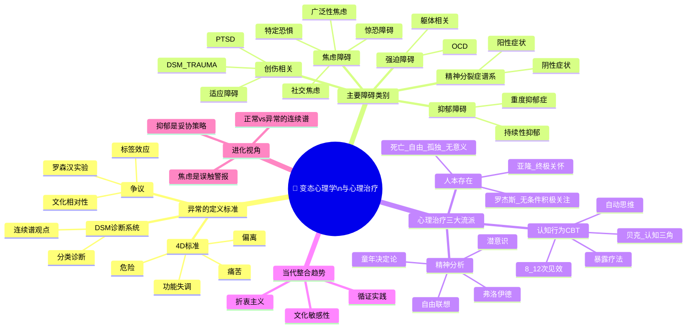

# Day 11：变态心理学与心理治疗——当心灵感冒了

> **悬疑提要**：1973年，一个叫罗森汉的心理学家做了件让整个精神病学行业炸裂的事——他派了8个正常人假裝有幻听，结果全被送进了精神病院。进去后他们表现正常，但没有任何一个医护人员发现他们是装的。最长的呆了52天。罗森汉的结论很刺耳：**我们根本分不清谁是正常人，谁是精神病人。** 那么，"正常"和"不正常"的边界到底是谁画的？

---

## 🍅 番茄 51/60：悬疑开场——谁有权利定义"正常"？

### 罗森汉实验：当"正常人"被关进疯人院

1973年，斯坦福大学心理学家**大卫·罗森汉**做了一个胆大包天的实验。他找了8个人——包括他自己、一个研究生、一个儿科医生、一个精神病学家、一个画家、一个家庭主妇——让他们分别去全国各地的精神病院挂号。他们的"任务"非常简单：

**进去后告诉医生：我听到一些声音，它们说"空虚"、"空洞"、"砰"。**

就这么一句话。除此之外，他们在问卷上填写完全真实的个人信息——姓名、工作、家庭背景。然后，他们告诉医生自己"现在感觉好多了，那些声音消失了"，并表现完全正常的行为。

结果？

**8个人全部被诊断为精神疾病，全都被收治入院。** 诊断包括"精神分裂症"和"躁郁症"。他们被强制住院的平均时间是19天——最长的52天。

入院后他们都表现得完全正常，和医护人员聊天、看书、写日记。但没有人发现他们是装的。真正发现"不对劲"的，反而是其他精神病人。有一个病人对罗森汉说："你没有病，你肯定是来调查医院的记者。"

实验结束之后，罗森汉把结果写成论文发表了——题目叫《精神病房里的正常人》。这篇论文引起了轩然大波。一家教学医院不服气，向罗森汉下战书："未来三个月内，你派假病人来，我们一定能识别出来！"罗森汉同意了。

三个月后，医院骄傲地宣布：在193个新入院的病人中，他们识别出了41个假病人！

罗森汉笑了：**"我根本没派任何人过去。"**

这是一个经典的心理学"反向耳光"。它暴露了一个令人不安的事实：精神病诊断的可靠性，可能比你想象的要低得多。

### 那么，"异常"的标准到底是什么？

心理学的*变态心理学*（Abnormal Psychology）之所以叫"变态"，不是骂人的意思，而是"偏离常态"。但问题来了——

如果一个人在大街上看到不存在的人，和他说"听到了声音"——这算异常吗？**在亚马逊雨林里，萨满在仪式中"召唤祖先的灵魂"——这算异常吗？**

文化心理学家告诉我们的一个刺耳真相：**在一种文化中被视为"疯癫"的行为，在另一种文化中可能是"神圣的使命"。**

现代心理学定义了"异常"的 **4D 标准**：

| 维度 | 含义 | 举个栗子 |
|------|------|----------|
| **Dysfunction 功能失调** | 影响日常生活能力 | 因为焦虑，三个月没出门 |
| **Distress 痛苦** | 给本人带来显著痛苦 | 反复洗手洗到皮肤破溃 |
| **Deviance 偏离** | 偏离社会文化规范 | 对着空气大声争吵回应幻听 |
| **Danger 危险** | 对自己或他人构成威胁 | 有自伤或伤人的想法和行动 |

但这四个 D 也不是铁律。一个热爱蹦极的人——他"偏离"了安全行为，但不异常。一个在葬礼上大笑的人——让周围的人"痛苦"，但他自己不一定有问题。

**正常的边界，从来不是一个二元问题，而是一条连续谱。**

> 罗森汉实验的真正遗产不是"精神病学是骗人的"，而是：**当我们用标签定义一个人时，标签可能比病症本身更危险。**

### ✅ 费曼三句话

```markdown
🧠 **费曼三句话**
1. 判断"异常"不是非黑即白的——它是一个连续谱，要看功能是否受损、是否痛苦、是否偏离文化规范。
2. 生活中的例子：你连续失眠一周，白天困得没法工作——这已经在"功能失调"的范畴了。但如果只是偶尔失眠但不影响生活——那只是"正常的波动"。
3. 我还在困惑的是：如果诊断本身被文化和社会规范绑架，那么"精神疾病"有多少是真实的疾病，多少是社会规训的产物？
```

### ❓ 悬疑追问

**罗森汉实验过去50年了，今天的诊断标准（DSM-5）比当年更科学了吗？答案是：进步了很多——引入了生物学指标和严格的分类系统。但核心问题依然存在：如果"精神疾病"的诊断不能像癌症那样通过血液检测来确认，它到底算不算"真正的疾病"？这场争论一直没有停止。**

---

## 🍅 番茄 52/60：焦虑、抑郁与创伤——当进化保护机制被过度激活

### 焦虑障碍：你的大脑在保护一个不存在的危险

想象你走在非洲稀树草原上，突然草丛里"唰"地一声动了一下。

你的心跳瞬间加速，肾上腺素飙升，瞳孔放大，肌肉紧绷——这是你祖先传下来的**战斗或逃跑反应**。在99%的人类进化史上，这个反应决定了你是活下来还是变成狮子的晚餐。

问题来了：你现在住在城市里。你打开微信，发现老板给你发了一条消息："明天来我办公室一趟。"

你的心跳加速。肾上腺素飙升。瞳孔放大。肌肉紧绷。

**你的身体以为狮子来了。但来的只是一条微信消息。**

这就是焦虑的核心机制：**进化预警系统被现代环境误触发了。**

焦虑障碍有几种常见类型：

| 类型 | 核心特征 | 一个故事 |
|------|----------|----------|
| **广泛性焦虑（GAD）** | 对几乎所有事情持续过度担心，持续6个月以上 | 小张每天早上醒来第一件事就是担心——担心迟到、担心工作完不成、担心朋友对他有意见、担心自己身体有病。他其实知道这些担心过火了，但就是停不下来。 |
| **惊恐障碍** | 突然发作的强烈恐惧，伴有心悸、窒息感、濒死感 | 小李在地铁上突然感到一阵强烈的恐惧——心跳快到像要跳出来，呼吸急促，觉得自己马上要死了。被送到急诊室，检查结果：一切正常。这是典型的惊恐发作。 |
| **社交焦虑** | 对社交场合的极度恐惧，害怕被评价 | 小王在公司会议上从来不发言。不是因为他没想法，而是因为他一想到"所有人都会看着我"，手心就开始出汗，大脑一片空白。 |
| **特定恐惧** | 对特定物体或场景的强烈恐惧 | 小陈怕蜘蛛怕到看到蜘蛛图片就尖叫——尽管她知道这个蜘蛛没有危险。 |

这里有一条惊人的数据：**全球约有 3.6 亿人患有焦虑障碍。** 这是最常见的精神障碍。

### 抑郁障碍：当"低电量"变成了"永远充不进电"

如果说焦虑是"警报拉得太响"，那抑郁就是"系统功率被调到了最低"。

**抑郁症** 不是"心情不好"。不是"想开点就好了"。它是一种让人失去"愉悦感"和"动力"的疾病。

DSM-5 对抑郁症的诊断标准（简化版）：
- 连续两周以上，每天大部分时间有**抑郁情绪**（悲伤、空虚、绝望）
- 对几乎所有活动的**兴趣或愉悦感明显减退**
- 加上以下中的至少4项：
  - 体重显著变化或食欲改变
  - 失眠或嗜睡
  - 精神运动性激越或迟缓（别人看起来"变慢了"）
  - 疲劳或精力丧失
  - 感到自己无价值或不恰当的内疚
  - 注意力减退或犹豫不决
  - 反复出现死亡或自杀念头

人类学家和进化心理学家提出过一个反直觉的解释：**抑郁可能在进化上有"功能"**——当你处于一个无法获胜的冲突中时，抑郁让你退缩、节约能量、重新评估策略。因此被称为"囚禁综合征"或"妥协策略"。

但这个机制在当代社会被严重误触发了——你不是被困住的动物，你只是在工作压力、社交压力、生活意义缺失中耗尽了自己。抑郁症不再是"撤退策略"，它变成了"撤退了再也回不来"。

> **悲伤是对失去的反应。抑郁是对"不知道失去了什么"的反应。**

### PTSD：创伤后应激障碍

PTSD 的独特之处在于：它有一个**明确的诱因**——经历或目睹了严重的创伤事件（战争、性侵、严重事故、自然灾害）。

症状有三组：
1. **再体验**：创伤事件反复在脑海中闪回、做噩梦
2. **回避**：避开一切能想起创伤的事物和人
3. **过度警觉**：易怒、失眠、一惊一乍、难以集中注意力

很多人不知道的是：**PTSD 也有一部分是进化保护机制的过度反应**。闪回的作用是"让你从错误中学习"，避开危险场合；高度警觉是为了"随时应对下一次威胁"。但当威胁已经过去半年，你的大脑还在闪回——这就从保护机制变成了病理性症状。

### ✅ 费曼三句话

```markdown
🧠 **费曼三句话**
1. 焦虑和抑郁不是"性格缺陷"——它们是进化保护机制在现代社会中被过度激活的表现：焦虑是"误触警报"，抑郁是"系统低电量保护模式"。
2. 日常例子：上台演讲前紧张得想逃跑——这就是焦虑（进化在说：这么多双眼睛盯着你，危险！）。失去恋情后整天不想起床——这是正常的悲伤。但如果半年后你还起不来床、觉得活着没意义——这可能就进入了抑郁症的范畴。
3. 我困惑的是：正常的"悲伤"和病理的"抑郁"之间的那条线到底在哪里？时间？强度？功能受损？如果悲伤本身就可以用"重度抑郁"的诊断标准来套——那我们会不会把正常的人类情绪都病理化了？
```

### ❓ 悬疑追问

**DSM（《精神疾病诊断与统计手册》）是心理学的"圣经"，但也饱受争议。每一次新版本更新，都有一些诊断被删掉、一些被加进来。比如"同性恋"曾经在DSM中被列为精神障碍——直到1973年才被移除。如果诊断标准本身就是社会共识的产物，我们如何区分"真正的精神疾病"和"社会不接纳的行为"？**

---

## 🍅 番茄 53/60：心理治疗三大路线——你选哪个流派看自己的内心？

### 精神分析：挖掘过去的考古队

如果心理学有一个"第一个流派"，那大概率是弗洛伊德的精神分析——虽然他在科学界一直备受争议。

弗洛伊德的核心信念：**你现在的问题，根在童年。** 你意识不到的那些被压抑的欲望、创伤、冲突——它们没有消失，只是沉到了"潜意识"里，然后以症状的形式冒出来。比如一个强迫洗手的人，可能深层是对某种"罪恶感"的象征性清洗。

精神分析师的工作方式是让你躺在一张长沙发上（对，就是电影里那种），然后自由联想——想到什么说什么，不筛选、不修饰。分析师在旁边听，寻找你话语中的模式、阻抗、移情。

**精神分析的问题**：太慢、太贵、太难被科学验证。一个完整的精神分析治疗可能需要几年甚至十几年。

### 行为认知：改造现在的工程师

20世纪60年代，**阿伦·贝克** 发现了一个现象：他的抑郁病人在治疗中会不经意地流露出一些"自动思维"——比如 "我一无是处"、"没有人喜欢我"、"事情永远不会好转"。这些思维如此自然，以至于病人自己都没意识到他们在"想"这些。

贝克意识到：**不是事件本身让你难过，而是你对事件的解释让你难过。** 这就是**认知疗法的核心**。

他发明了一套方法：教病人识别自己的"扭曲思维"——然后像律师一样对这些想法进行"庭审"。你有证据吗？有没有其他解释？如果朋友这样想，你会怎么劝他？

与此同时，**行为疗法** 的贡献在于暴露疗法——如果你怕蜘蛛，就让你一步步"接近"蜘蛛：先看图 → 再看视频 → 再隔着玻璃看真实的蜘蛛 → 最后让蜘蛛爬在你手上。每一步都不跳过，直到你的恐惧系统"习惯化"——也就是你的大脑学会了"这个蜘蛛不会伤害我"。

**CBT（认知行为疗法）** 把两者结合起来，成为了目前**实证最有效的心理疗法**——没有之一。

| 疗法 | 核心观点 | 治疗时长 | 实证支持 |
|------|----------|----------|----------|
| 精神分析 | 无意识冲突决定行为 | 数年 | 弱 |
| 人本存在 | 人在寻找意义和自我实现 | 数月至数年 | 中 |
| **CBT** | **想法决定情绪，行为可以改变想法** | **8-20次** | **最强** |

**一个让你意外的数字**：大部分CBT的有效变化发生在**8-12次会谈**内。也就是说，如果你每周见一次治疗师，大约3个月，你就可以看到显著性改善。

### 人本存在：寻找意义的哲学探险

如果说精神分析是"考古"，CBT是"工程"，那**人本-存在主义疗法**就是"哲学漫步"。

**卡尔·罗杰斯** 的人本主义认为：人天生有成长的潜力，只要在"无条件积极关注"的环境中就会自然长好。治疗师要做的是——真诚、共情、无条件接纳。

**欧文·亚隆** 的存在主义则更进一步：人类最深层的焦虑源于四大"终极关怀"——**死亡、自由、孤独、无意义**。治疗的目标是帮助来访者直面这些真相，不是逃避它，而是带着勇气在真相中活着。

> 亚隆的名言："直面死亡并不会让人绝望——它反而会让人更充分地活着。"

### 当代趋势：整合主义

现在的心理治疗已经不再"分门派"了。大部分有经验的治疗师都是**整合取向**的——根据来访者的具体问题，灵活使用不同流派的技术。

比如一个广场恐惧症的来访者：
- 先用CBT的暴露技术让他能出门（快→缓解症状）
- 再用人本主义的方法与他建立信任关系（慢→建立安全联结）
- 同时用精神动力学的视角理解他的恐惧是否与童年脚本有关（深→理解根本原因）

### ✅ 费曼三句话

```markdown
🧠 **费曼三句话**
1. 三大疗法各有侧重：精神分析挖过去、CBT改现在、人本存在找意义——没有"最好的"疗法，只有"最适合你当前问题"的疗法。
2. 日常类比：你手机总是卡。精神分析师说：你小时候摔过它（童年创伤）。CBT说：我们清一下缓存、关掉后台程序（改变现在行为）。人本存在说：你买这部手机的时候，你真正想要的是什么？（寻找意义）
3. 让我意外的是：CBT在8-12次会谈内就能见效——我之前一直以为心理治疗需要"好几年"。但我还是好奇：短期见效的"治标"会忽略深层根源吗？
```

### ❓ 悬疑追问

**CBT是目前实证最有效的疗法——但这个"有效"是什么意思？是症状消失了，还是人真正"变好了"？存在主义治疗师会告诉你：症状消失不等于过上了有意义的生活。有时候"症状"本身是一个信号——告诉你你的生活方式有问题。如果只是消除症状，你可能只是回到了一个"适应不良的常态"。**

---

## 🍅 番茄 54/60：🧠 思维导图——变态心理学与心理治疗全景

> 这个番茄不学新内容。用思维导图把前三颗番茄串起来。

### 🧠 Day 11 思维导图



> **如何阅读此图**：从中心开始，按"定义→分类→治疗→争议"四条主线理解。注意箭头和连线代表不同层次的关系。建议你选一个你最有共鸣的方向开始深入阅读。

### 🎤 费曼大挑战

用一句话向一个完全不了解心理学的人解释：**"心理咨询师和精神科医生有什么区别？"**

> *（提示：精神科医生可以开药，因为他们有医学学位。心理咨询师做谈话治疗。最理想的情况是两者结合——但现实中可能只接触到其中之一。）*

**写下来：**

```
[你的版本]
```

### 🔗 连回生活

- 你最近有没有过"过度担心"某件事的经历？你的身体反应是什么？（心跳、出汗、胃痛——这些就是焦虑的身体信号）
- 你身边有没有人经历了创伤事件后变得"不一样了"？也许是PTSD，也许不是——但创伤对人的改变是真实的
- 如果有人和你说"我想死"，你的第一反应是害怕还是倾听？心理健康素养的第一步是知道：**谈论自杀不会"诱发"自杀，反而可能救人一命。**

---

## 🍅 番茄 55/60：刻意练习——心理诊断的推理实验室

### 案例1："什么都不想干"的人——是抑郁症还是正常悲伤？

**背景**：一个30岁的女性来访者来到咨询室。她看起来有些憔悴，说话声音很轻。以下是她的自述：

> "我最近什么都做不了。以前我很喜欢画画，但现在画笔都不想碰。每天早上醒来，我要在床上躺半小时才能起得来——也不是困，就是感觉没有起床的理由。工作还能勉强应付，但下班后我就躺在沙发上刷手机，刷到半夜，也不知道在刷什么。我感觉自己像一个空壳。上周朋友约我吃饭，我找借口推了。我就想一个人待着——但真的一个人了，我又感觉很空虚。"

**问题**：
1. 以上描述中，哪些症状符合抑郁症的诊断标准？
2. 如果她说"这种状态已经持续了一年多"——那是抑郁症还是"正常的不快乐"？
3. 你问她"最近有发生什么特别的事吗？"她说半年前和相恋五年的男友分手了。这个信息会改变你的判断吗？

<details>
<summary><b>🔍 参考答案（先写你自己的再点开）</b></summary>

1. **符合的症状**：兴趣减退（对画画失去兴趣）、精力丧失（起床困难）、社交退缩（推掉朋友邀约）、睡眠紊乱（熬夜刷手机但非特意失眠）、注意力/动力下降（"空壳感"）。符合多项DSM抑郁标准。
2. **持续时间是关键**：如果"一年多"——这超出正常悲伤反应的时长（通常3-6个月），更可能是持续性抑郁障碍（心境恶劣）。如果只是几周且与特定事件相关——更可能是"情境性"的。
3. **分手的背景**：使问题更复杂。分手后前3个月的剧烈悲伤是"正常"的。但如果超过6个月且功能明显受损，可能是"以分手为触发事件的抑郁症"。临床判断的关键是：**时间 + 功能受损程度 + 症状范围**——如果只是"因为分手所以睡不好吃不下"，可能正常；如果"即使不直接想分手也感觉到处没意义"，就更像抑郁症。

</details>

### 案例2：总在洗手的人——OCD的认知行为解释

**背景**：一个28岁的男性来访者。他有一份体面的工作，但他有一个秘密——他每天洗手超过50次。

> "我知道这听起来很荒谬，但我控制不住。每次我碰了门把手，我就觉得手上沾了什么东西——虽然我知道公用的门把手可能确实不干净，但我的感觉是"沾了什么不好的东西"。然后我就会坐立不安，脑子里一直想"我要去洗手"，直到我真的去洗了才平静下来。但洗完没多久，下一次恐惧又来了。最严重的时候，我的手都洗脱皮了。我女朋友说我疯了。我也觉得自己疯了。"

**问题**：
1. 用CBT的框架，分析这个案例中的：**触发事件** → **自动思维** → **情绪反应** → **行为（强迫行为）** → **短暂缓解**
2. 为什么"强迫行为"反而让问题更严重了？请用"负强化"解释。

<details>
<summary><b>🔍 参考答案（先写你自己的再点开）</b></summary>

1. **CBT分析**：
   - 触发事件：碰门把手
   - 自动思维："有东西沾到我手上了，不干净/不好的东西"
   - 情绪反应：焦虑、恐惧、坐立不安
   - 行为：去洗手
   - 短暂缓解：洗手后焦虑暂时下降

2. **为什么更严重了？——负强化**：
   - 洗手的"行为"减少了焦虑（负强化=通过去除不好的东西来强化行为）
   - 但问题在于：因为你通过洗手逃避了面对焦虑，你的大脑从来没有学会"即使不洗手，也不会发生坏事"
   - 下一次碰到门把手，你更焦虑了——因为你没有机会体验"自然消退"
   - 这就是OCD的恶性循环：**强迫行为是焦虑的"燃料"，不是"灭火器"**

3. **CBT治疗方向**：
   - 暴露与反应阻止（ERP）：碰门把手——但不洗手——带着焦虑忍过去——让大脑学会"不洗也不会出事"
   - 认知重构：挑战"门把手=危险"的自动思维——事实上你每天碰无数东西都没事

</details>

### 练习题：如果你是一位心理咨询师

> 你的一个朋友向你倾诉："我最近一直很焦虑，但我不确定为什么。就是那种——心脏紧着、喘不上气的感觉。好像随时会有什么坏事发生，但我说不出是什么事。"

**问题**：
1. 如果用**CBT**的思路，你会怎么回应他？
2. 如果用**精神分析**的思路，你会怎么回应？
3. 如果用**人本存在主义**的思路，你会怎么回应？
4. 你个人觉得哪个回应最自然？为什么？

<details>
<summary><b>🔍 参考答案（先写你自己的再点开）</b></summary>

1. **CBT回应**："你说的'好像随时有坏事发生'——这是一种典型的自动思维。我们来拆解一下：当你有这种焦虑感的时候，你脑子里具体闪过什么画面或想法？我们试试把这些焦虑的'证据'列出来，然后看看有没有其他可能性。"
2. **精神分析回应**："你说的'不确定为什么'很有意思。也许你的潜意识知道为什么——但你的意识还没准备好接受。最近你的生活中有没有什么你'故意不去想'的事？比如一段关系、一个决定？"
3. **人本存在回应**："我听到你处在一种'不知道方向在哪'的焦虑中。也许这种焦虑不只是症状——它可能是一个信号，告诉你你对现在的生活状态有某种不满。你愿意和我聊聊，你真正想要的生活是什么样的吗？"
4. **没有标准答案**——不同流派的回应方式反映了不同的世界观。重要的是：**你选择的流派，本质上反映了你如何看待"人"和人如何"变好"。**

</details>

### 📊 今日进度

```
Day 11/12 [██████████████████████████░░] 55/60 🍅
还有最后5个番茄！明天我们进入当代心理学的前沿，然后——毕业。
```

### ✅ 今日备考卡片

| 概念 | 一句话解释 |
|------|-----------|
| 罗森汉实验 | 8个假病人被送进精神病院，医生没发现，病人发现了——诊断标签有多靠谱？ |
| DSM-5 | 精神疾病的"圣经"分类系统，但也一直被批评把正常行为医学化 |
| 4D标准 | 功能失调、痛苦、偏离、危险——判断"异常"的四个维度 |
| PTSD三组症状 | 再体验（闪回）+ 回避 + 过度警觉 |
| CBT | 认知行为疗法：你的想法决定你的情绪，改变想法就能改变情绪 |
| 认知三角 | 贝克提出的：想法 → 情绪 → 行为，三者互相影响 |
| 暴露与反应阻止（ERP） | OCD的黄金标准疗法：暴露在恐惧中但不做强迫行为 |
| 无条件积极关注 | 罗杰斯说的：不评判地接纳来访者的全部 |

---

**→ 明日预告：[[Day12-当代前沿与总复习·心理学正在经历什么]]**

如果你的大脑在你"决定"之前7秒就已经做出了选择——那做决定的"你"是谁？明天，最后5个番茄，我们来到心理学的最前沿——然后，让这趟旅程画上句号。
