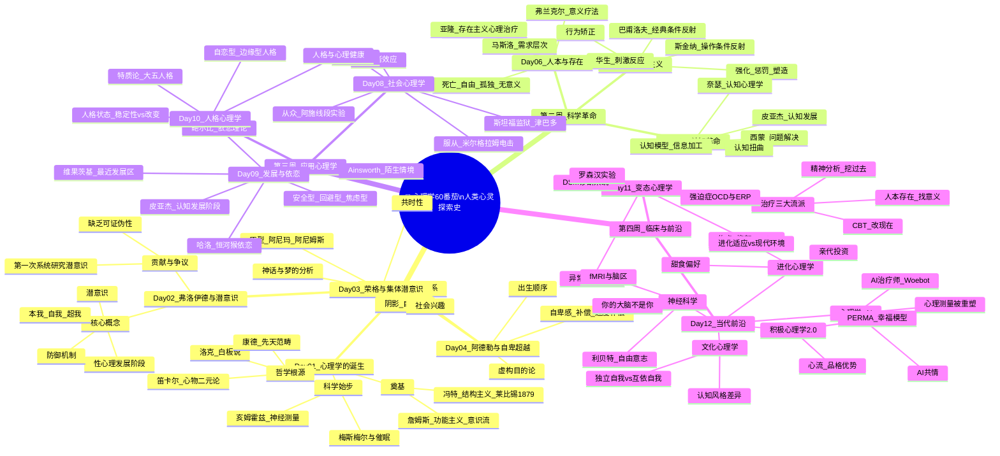

# Day 12：当代前沿与总复习——心理学正在经历什么

> **悬疑提要**：fMRI扫描显示，在你"决定"按按钮之前7秒，你的大脑已经做出了决定。如果"你"不是决策者——那决策者是谁？进化心理学、神经科学、文化心理学，正在从三个方向同时瓦解"自我"这个概念。与此同时，AI正在闯进心理咨询室，心理测量正在被算法重塑。心理学这门学科本身，正在经历一场从内到外的革命。这是最后一课，也是最新的一课。

---

## 🍅 番茄 56/60：悬疑开场——你的大脑不是你？

### 自由意志的幽灵：本杰明·利贝特的实验

1983年，美国心理学家**本杰明·利贝特**设计了一个让整个哲学界和神经科学界都坐不住的实验。

实验很简单：被试坐在一个屏幕前，面前有一个按钮。他们被要求：**随时可以按按钮，但在做出"按"的决定的那一刻——注意你手腕上的钟表指针位置，记下那个时间点。**

同时，利贝特用EEG监测他们的大脑活动。

结果让所有人震惊：**在你"决定"按按钮之前约350毫秒，你的大脑已经发出了一个准备电位（readiness potential，简称RP）。更新的研究把这个时间提前到了整整7秒。**

翻译成人话：你的大脑在你"决定做某事"之前几百毫秒甚至几秒就已经"决定"了。你意识到的那个"决定"——它更像是大脑做出决定后的"事后广播"，而不是原因。

**换句话说：你认为你是"决策者"，但你可能只是决策结果的"新闻发言人"。**

哲学家和神经科学家对利贝特实验的解读至今仍有争论：
- **决定论者说**：看吧，自由意志是幻觉，一切都是神经元的物理过程。
- **兼容论者说**：不，"自由意志"不是"超自然的自由"，而是"在多重动机中做选择的能力"——即使有神经基础，这个过程的"主观体验"仍然有意义。
- **怀疑论者说**：利贝特实验只能证明"有意识决策"不是最初的触发——但不能证明我们的所有行动都是被决定的，因为我们还有"否决权"——你可以"主动取消"一个即将执行的动作。

这场争论至今没有定论。但利贝特的实验暴露了一个让人不安的事实：**你对自己的"掌控感"可能比你以为的要薄得多。**

### 当代心理学三股撕裂"自我"的力量

如果说前11天我们学的是心理学把人"拆开"看——拆成意识、人格、行为、认知——那当代心理学正在做的事情更加激进：**它在追问"人"这个概念本身是否存在。**

三股力量同时在攻击"自我"：

| 力量 | 核心主张 | 对"自我"的冲击 |
|------|----------|----------------|
| **神经科学** | 所有心理活动都是大脑的物理活动 | "你"就是你的神经元放电模式——没有"灵魂"，没有"本质" |
| **进化心理学** | 你的心理机制是自然选择的产物 | "你"的偏好、恐惧、欲望——都是祖先留在你基因里的化石 |
| **文化心理学** | "自我"是被文化建构的 | "自尊"、"个人主义"、"自由选择"——这些概念在东亚文化中意义完全不同 |

这三股力量放在一起，指向一个结论：**你所谓的"我"，可能只是一个由基因、神经元、文化脚本共同编织的叙事。** 但问题来了——如果"我"是编出来的，那"我"到底是谁？

### ✅ 费曼三句话

```markdown
🧠 **费曼三句话**
1. 利贝特实验的核心发现：在你"决定"做某事前，你的大脑已经做出了反应——有意识的决策可能不是原因，而是结果。
2. 日常类比：你看到红灯踩刹车——你觉得"我决定停车"。但你的刹车动作只需要几百毫秒的反应时间。你的"决定"可能只是大脑自动处理后的"通知"。
3. 最让我不安的是：如果"我"只是大脑的新闻发言人——那我到底是那个"做决定的人"还是"被通知结果的人"？这跟《黑客帝国》有什么本质区别？
```

### ❓ 悬疑追问

**如果神经科学最终证明"自由意志"是幻觉——这会改变我们的法律体系（"他不该为犯罪负责，那是他的大脑干的"）吗？会改变我们的亲密关系（"你不该生气，那是你的杏仁核在放电"）吗？还是说，不管科学告诉我们什么，我们都必须"假装"有自由意志才能正常生活？**

---

## 🍅 番茄 57/60：进化心理学 + 文化心理学——祖先留给你的程序和文化给你的剧本

### 你为什么爱吃甜食？——进化心理学的答案

想象你是一个生活在非洲草原上的原始人。你面临着严重的生存问题：能量不足。糖分是地球上最稀缺也最宝贵的能量来源——水果只在特定季节才有，蜂蜜被蜜蜂守护着，你一年能摄入的糖分加起来可能还不到今天一杯奶茶的量。

所以，在几百万年的进化中，你的大脑学会了一件事：**找到甜的东西，拼命吃。**

今天你站在超市冰柜前，面对二十种冰淇淋。你的进化大脑说："快！甜的！能量！吃它！"你的理性大脑说："但我在减脂。"

**理性大脑输了。** 因为理性大脑是几万年前才进化出来的新功能，而那个"想要甜食"的冲动是几百万年前就写好的——它比你强大得多。

这就是**进化心理学**的基本逻辑：**现在的你，带着一颗为石器时代设计的大脑，生活在信息时代。**

进化心理学家问的所有问题都是这种风格的：
- 为什么男性比女性更偏好短期性关系？→ 亲代投资理论：女性每次怀孕要投入巨大的生物成本（9个月孕期 + 哺乳），而男性几乎零成本。所以女性在择偶上更"挑剔"——这对她们的后代生存更有利。
- 为什么出轨如此普遍？→ 从进化角度看，男性的出轨是"以低成本增加后代数量"的策略，女性的出轨是"获得更好的基因或资源"的策略。不是说这是"对的"，而是这是我们的祖先留下的脚本。
- 为什么我们怕蛇不怕枪？→ 蛇在进化史上威胁了我们几百万年，枪才几百年。你的大脑对蛇的恐惧是"硬连线"的，对枪的恐惧则需要学习。
- 为什么我们更容易对陌生人的痛苦"无感"？→ 你的共情能力是给"部落内部"使用的——对陌生人共情在过去没有进化优势（今天这个问题叫"可识别受害者效应"：一个人掉进井里我们会全力救援，但100万人死于饥荒我们可能只捐10块钱）。

### 东亚人 vs 美国人：你的"自我"是文化写的

**理查德·尼斯贝特** 做了一个经典实验：给日本人和美国人看同一个鱼缸场景——里面有鱼、石头、水草。

美国人说："我看到了那条最大的鱼。"

日本人说："我看到了一个池塘——里面有鱼在游，石头上有青苔，水在流动。"

美国人的注意力在**突出的个体**上。日本人的注意力在**背景关系**中。

这就是**独立自我**（西方）vs **互依自我**（东亚）的文化差异。

| 维度 | 西方（个人主义） | 东亚（集体主义） |
|------|------------------|------------------|
| 自我概念 | "我是一个独立的个体" | "我是关系网络中的一个节点" |
| 成功归因 | "因为我的努力和能力" | "因为环境和大家帮忙" |
| 失败归因 | "这次没做好" | "让大家失望了" |
| 情绪表达 | "说出来！表达自己！" | "看场合，别让别人难堪" |
| 认知风格 | 分析性，关注部分 | 整体性，关注关系 |

这些问题不仅仅是"文化差异"这么简单——它们触及了一个根本问题：**"自我"到底是一个普世概念，还是一个西方概念？**

### ✅ 费曼三句话

```markdown
🧠 **费曼三句话**
1. 进化心理学告诉我们：很多你以为是"自己"的选择，其实是祖先在石器时代写好的程序——比如喜欢甜食、怕蛇、偏好某些面孔。
2. 文化心理学告诉我们：你以为的"正常"（比如"我要做自己"）其实是一种文化产品——东亚人可能花一辈子追求的是"我要融入大家"。
3. 把这两个视角放在一起，我开始困惑：如果基因和文化都在我不知情的情况下写好了我的"剧本"，那我到底在多大程度上是真的在"自由选择"？
```

### ❓ 悬疑追问

**如果说进化心理学有争议——最大的争议是它容易被滥用为"生物决定论"。（"男人出轨是因为进化！"——这可能是对的，但它是"解释"还是"借口"？）还有一条经典的批评：进化心理学讲的是"我们如何变成这样"，但不等于"我们应该这样"。从"是"无法推出"应该"——这就是休谟的著名论断。**

---

## 🍅 番茄 58/60：心理学与AI的碰撞——门学科的新生

### AI能当治疗师吗？

2017年，斯坦福大学的研究团队做了一个实验：他们让一个叫**Woebot**的AI聊天机器人给一组抑郁焦虑的大学生做CBT（认知行为疗法）——每周聊天几分钟的那种。

结果让很多人坐不住了：**Woebot显著减少了学生的抑郁和焦虑症状。** 没错，一个没有人类意识、没有共情、甚至没有"人脸"的聊天机器人——居然真的有效。

Woebot的工作原理并不复杂：识别用户语言中的负性认知扭曲（比如"非黑即白思维"、"灾难化"），然后引导用户用CBT的标准技术去挑战这些扭曲。完全是机械化操作，但用户报告说"感觉他真的懂我"。

这引发了一个尖锐的问题：**如果心理治疗的核心机制（比如认知重构）可以被算法自动化——那治疗师还有什么不可替代的价值？**

### ChatGPT能共情吗？

2023年，一个研究发现：当人们向ChatGPT倾诉情绪问题时，ChatGPT的回应在"共情评分"上超过了大多数人类治疗师。

等一下——**一个语言模型，怎么可能比人更有共情力？**

答案是：ChatGPT不是在"感受"你的情绪，它在"识别"你的情绪模式，然后根据训练数据中的最佳回应模板生成回复。它的"共情"是**模拟**的——但因为它是基于数百万条人类对话训练出来的，它的"模拟"可能比大部分未经训练的人类更精准。

这很讽刺：**人类用几百万年的进化才发展出共情能力——而AI用几周的算力就"学会了"。**

但这也暴露了一个问题：**真正的共情和模拟的共情，有本质区别吗？** 如果你的痛苦真的被"处理"了——你还在乎处理你痛苦的东西有没有"意识"吗？

### 心理测量被AI重塑

传统的心理测量是"问卷"式的——你填一堆选择题，然后算分。这种方法有三个大问题：社会赞许性（你不一定说真话）、文化偏差（量表是为西方大学生设计的）、标签化（你得了一个"高神经质"分数，然后你就觉得自己就是"高神经质的人"）。

AI正在改变这一切：

| 传统方法 | AI驱动的新方法 |
|----------|----------------|
| 你填问卷 | 分析你的社交媒体、语音语调、面部表情——不需要你"填"任何东西 |
| 你给自己打分（有偏见） | 算法从你的行为数据中"推断"你的心理特征 |
| 静态测量（今天测的就是今天的） | 连续追踪（每天的数据都在更新你的"画像"） |
| 分类标签（你是抑郁症） | 维度画像（你在抑郁维度上的得分是7.2/10，而且比上周下降了0.5） |

**伦理问题**：如果算法比你自己更了解你——你觉得这是好是坏？

### 积极心理学2.0

**马丁·塞利格曼**——那位早期用电击狗来做习得性无助实验的心理学家——后来做了一件完全反转的事：他发起了**积极心理学运动**。

他的问题很简单：**心理学的"默认模式"是从疾病的角度看待人类。但如果我们也想了解什么让人真正幸福、蓬勃生长呢？**

积极心理学的核心发现包括：
- **心流**（米哈里·契克森米哈赖）：完全沉浸在某件事中忘记时间的状态——这是人类最幸福的体验之一
- **品格优势与美德**（VIA分类）：24种被跨文化验证的品格优势（好奇心、勇气、善良、领导力、宽恕……）
- **幸福五要素 PERMA**：积极情绪、投入、关系、意义、成就——幸福不只是一个"感觉好"的问题，它是一个多维结构

**AI时代对积极心理学的新挑战**：如果AI可以帮你"设计"一个最幸福的人生路径——你是该感谢它帮你避开了弯路，还是该反感它剥夺了你走弯路的自由？

### ✅ 费曼三句话

```markdown
🧠 **费曼三句话**
1. AI已经能通过语言模式识别心理状态、模拟共情、甚至做CBT——这很好，但也让我们不得不重新思考：人类心理治疗师不可替代的核心到底是什么？
2. 日常例子：你现在和一个AI聊心事，AI给了你很好的建议。你感觉好多了。但你知道AI没有"感受"，它只是模式匹配——这时候你会觉得这个"好多了"是假的吗？
3. 我最在意的是：如果有一天，AI的心理学诊断比人类更准、治疗比人类更有效——那心理学这个"人的学科"要怎么定义自己？
```

### ❓ 悬疑追问

**积极心理学有一个"悖论"：追求幸福的人往往不幸福。因为"我一定要幸福"这个想法本身就制造了焦虑。所以积极心理学2.0的解法是：不要追求"幸福"，而是追求"有意义的生活"——幸福是副产品。那问题来了：AI能帮你找到"意义"吗？还是说，"意义"是只有人类才能创造的——或者连人类也创造不了，它只是一种"有用的幻觉"？**

---

## 🍅 番茄 59/60：🧠 总复习思维导图——60番茄全景

> 这不是一个"普通的番茄"。这是你12天、60个番茄、一整部心理学旅程的全景地图。找一个完整的25分钟，把这个导图从头到尾"走"一遍——每一个节点你都应该能用费曼学习法讲给别人听。

### 🧠 60番茄全景思维导图



> **如何一次性消化这张图**：按"周"为单位走——第一周（精神分析谱系）→ 第二周（科学革命）→ 第三周（应用）→ 第四周（临床+前沿）。每走完一个分支，闭上眼睛给自己讲一遍。如果你发现某个节点讲不清楚——那就是你的下一个番茄应该复习的地方。

### 🎤 终极费曼挑战

用 **"电梯演讲"** 的方式，在30秒内向一个陌生人解释心理学这门学科是什么。

> *（提示：不要说"心理学是研究心理的科学"——太无聊了。试试："心理学教你的不是'人是什么'，而是'人以为自己是什么——但实际不是那么回事'。"）*

**写下来（严格限制在100字内）：**

```
[你的版本]
```

### 🔗 连回你的人生

整门课学完了。你还记得第一天的问题吗？——**你的自由意志有多少是真的？**

现在60个番茄之后，你的答案变了吗？

---

## 🍅 番茄 60/60：毕业典礼——你的心理学工具箱

### 欢迎来到终点

**你做到了。**

60个番茄。12天。从1879年莱比锡的一个小实验室出发，穿越了2000多年的思想史，经过了弗洛伊德的暗黑潜意识、斯金纳的操作箱、罗杰斯的无条件接纳、贝克的自幼思维、津巴多的监狱……一直到AI治疗师和进化心理学的草原。

这不是知识点的累加。这是一次对"人"的解构和重建。如果你现在觉得"我好像不那么了解自己了"——那说明学到位了。

> "认识自己"的代价是：你发现自己没那么"自由"，你的思维没那么"理性"，你的爱没那么"纯洁"。但知道真相之后的勇气，才是真正的勇气。

### 从60个番茄中提炼的10个可以立刻使用的心理学工具

| # | 工具 | 源自 | 一句话用法 |
|---|------|------|------------|
| 1 | **三句话费曼法** | 每课内核 | 学任何新概念，逼自己用三句话说清：本质、例子、困惑 |
| 2 | **认知重构** | Day07认知革命 | 当你焦虑时，问自己："我的自动思维是什么？有证据吗？还有其他解释吗？" |
| 3 | **暴露阶梯** | Day11 CBT/ERP | 怕什么就（慢慢）做什么——但每一步都要在"可控的恐惧"范围内 |
| 4 | **情绪命名** | Day02精神分析 | "我不舒服"→"我感到被忽视的愤怒"——精准命名情绪本身就有疗愈作用 |
| 5 | **无条件积极关注** | Day06罗杰斯 | 对你在乎的人：不评判、不打断、不带目的地倾听——这可能是你给的最好礼物 |
| 6 | **成长型思维** | Day05行为主义 | 我"暂时"不会，而不是"永远"不会——这对你自己和孩子都适用 |
| 7 | **心流设计** | Day12积极心理学 | 做一件事前问：目标明确吗？难度和能力匹配吗？反馈即时吗？三个YES就能进入心流 |
| 8 | **三件好事练习** | Day12塞利格曼 | 每晚写下今天发生的三件好事情（不一定要大）——6个月后你的幸福感会显著提升 |
| 9 | **暂停按钮** | Day08社会心理学 | 在你从众、服从、情绪上头之前——给自己10秒的空白——这10秒是你的"自由" |
| 10 | **意义提问法** | Day06弗兰克尔 | 不是在问"生活的意义是什么"，而是问"此时此刻，生活问了我什么" |

### 推荐的下一个阅读路径

根据你在这60个番茄中感兴趣的流派，选择你的下一本书：

| 如果你最感兴趣的是… | 推荐你读 | 进阶方向 |
|----------------------|----------|----------|
| **精神分析/潜意识** | [[书库/心理学书库/梦的解析]] → [[书库/心理学书库/红书]] → 弗洛伊德原著 | 心理动力学治疗 |
| **荣格/原型/自性化** | [[书库/心理学书库/红书]] → [[书库/心理学书库/荣格心理学]] → 詹姆斯·霍利斯 | 分析心理学 |
| **行为主义/可塑性** | [[书库/心理学书库/《福格行为模型》]] → [[书库/心理学书库/微习惯 简单到不可能失败的自我管理法则 美 斯蒂芬 盖斯]] | 行为设计 |
| **人本/存在/意义** | [[书库/心理学书库/被讨厌的勇气]] → [[书库/心理学书库/存在主义心理治疗]] → 弗兰克尔《活出生命的意义》 | 存在主义治疗 |
| **认知/CBT/情绪** | [[书库/心理学书库/伯恩斯新情绪疗法]] → [[书库/心理学书库/思考，快与慢]] → 《胡思乱想消除指南》 | 认知治疗师 |
| **社会/群体/关系** | [[书库/心理学书库/社会心理学（第11版）]] → [[书库/心理学书库/乌合之众]] → [[书库/心理学书库/影响力（经典版）]] | 社会心理学研究 |
| **童年/发展/依恋** | [[书库/心理学书库/《心理抚养》]] → [[书库/心理学书库/《为什么爱会伤人》]] → 鲍尔比《依恋》三部曲 | 依恋理论研究 |
| **变态/临床/诊断** | [[书库/心理学书库/变态心理学 第6版 (苏珊·诺伦霍克西玛)]] → [[书库/心理学书库/伯恩斯新情绪疗法]] | 临床心理学 |
| **神经科学/AI前沿** | 《意识与脑》→ 《自由意志》萨姆·哈里斯 → 《思考，快与慢》 | 认知神经科学 |

### 心理学还没有解答的5个大问题

作为最后的悬疑——心理学这门学科还很年轻，下面这些问题可能在你孩子那一代才会有答案：

1. **意识到底从何而来？** 主观体验（"感觉红"、"感觉到痛"、"感觉到爱"）——为什么物理的大脑会产生非物理的"感受"？这就是著名的"硬意识问题"。
2. **自由意志是真还是假？** 利贝特实验已经过去40年了，我们依然没有答案。如果它是假的——我们要怎么重新设计法律、道德、教育？
3. **AI能有"自我"吗？** 如果AI发展了类似人类的智能——它会有人类的心理问题吗？它会抑郁吗？它会需要"治疗"吗？
4. **心理病理学是"疾病"还是"差异"？** 自闭症、ADHD、精神分裂症——这些到底是"大脑生病了"还是"人类神经多样性的表现"？
5. **人类还需要"心理学"吗？** 如果有一天，你戴的头环可以直接调节你的情绪状态，你再也不需要"心理技巧"了——这是解放还是更深的枷锁？

> 你带着这些问题离开。也许有一天，是你在回答它们。

### 📜 结业证书

```
╔═══════════════════════════════════════════════════╗
║                                                   ║
║      🧠 60🍅 心灵探险 · 毕业证书                   ║
║                                                   ║
║      在此确认，你已完成                            ║
║      《心理学60番茄教程》                          ║
║      全部60个番茄 · 12天 · 从古希腊到AI            ║
║                                                   ║
║      你已掌握：                                    ║
║      心理学的四个核心范式                          ║
║      三大治疗流派的工作方式                        ║
║      十个改变生活的心理学工具                      ║
║      以及——最重要的——一个永恒的困惑：              ║
║      "我到底是谁？"                                ║
║                                                   ║
║      继续保持好奇。保持怀疑。保持勇敢。             ║
║      你永远是你自己最好的实验对象。                 ║
║                                                   ║
║                      2026年·理想知识库              ║
║                                                   ║
╚═══════════════════════════════════════════════════╝
```

### 最后的祝福

你在第一天读到笛卡尔说"我思故我在"。在最后一天，你看到神经科学说"你的大脑在你思之前已经做了决定"。

**从第一天到最后一天，我们探讨的是同一个问题：人到底是谁？**

心理学没有给你一个"标准答案"。但它给了你工具——去质问，去怀疑，去更深刻地理解自己和他人。

这不是终点。这只是你作为一个"心灵侦探"的开始。

> 心理学不是教你怎么"变好"的。心理学是教你怎么"看清"的。

**继续走吧。前方还有更多悬疑等着你。**

```markdown
Day 12/12 [████████████████████████████] 60/60 🍅
旅程到此结束。但你的心理学之路才刚刚开始。
```

---

## 📚 本教程完整参考书单

本教程写作过程中参考了以下著作，感谢这些思想者：

- [[书库/心理学书库/心理学与生活（第19版，中文平装版）]]
- [[书库/心理学书库/心理学的故事：源起与演变（套装共2册）]]
- [[书库/心理学书库/《心理学讲义》]]
- [[书库/心理学书库/津巴多普通心理学（原书第8版·2022修订）]]
- [[书库/心理学书库/变态心理学 第6版 (苏珊·诺伦霍克西玛)]]
- [[书库/心理学书库/异常与临床心理学.[英].贝内特.(2005)]]
- [[书库/心理学书库/存在主义心理治疗]]
- [[书库/心理学书库/伯恩斯新情绪疗法]]
- [[书库/心理学书库/梦的解析]]
- [[书库/心理学书库/红书]]
- [[书库/心理学书库/自卑与超越]]
- [[书库/心理学书库/我们时代的神经症人格]]
- [[书库/心理学书库/20世纪最伟大的心理学实验]]
- [[书库/心理学书库/改变心理学的40项研究（第7版）]]
- [[书库/心理学书库/社会心理学（第11版）]]
- [[书库/心理学书库/思考，快与慢]]
- [[书库/心理学书库/当下的力量+当下的力量实践手册（白金版）(套装共2册)]]
- [[书库/心理学书库/蛤蟆先生去看心理医生]]
- [[书库/心理学书库/也许你该找个人聊聊]]
- [[书库/心理学书库/情绪急救：应对各种日常心理伤害的策略与方法]]
- [[书库/心理学书库/《情绪：影响正确决策的变量》]]
- [[书库/心理学书库/我们何以不同：人格心理学40讲 -王芳]]
- [[书库/心理学书库/躁动的无意识]]

---

**→ 返回目录：[[🍅心理学60番茄教程/README|心理学60番茄教程主页]]**
