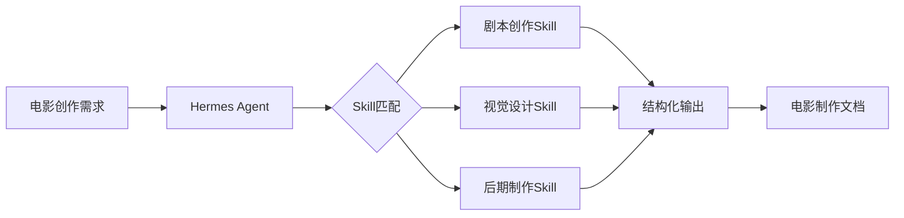
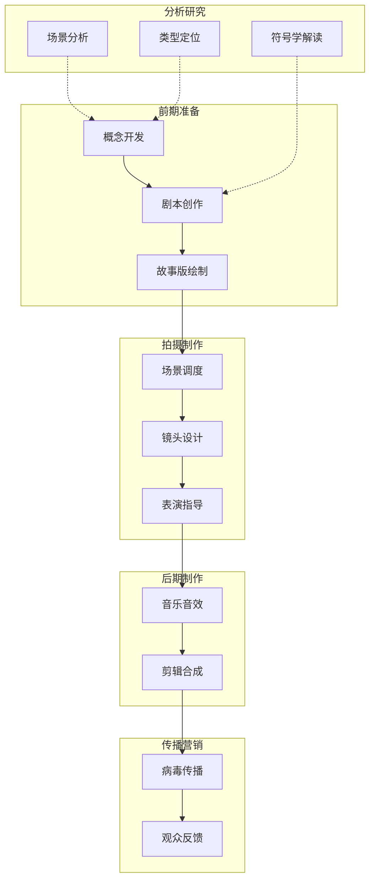
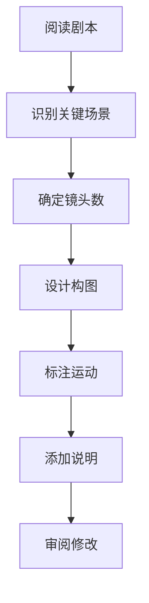
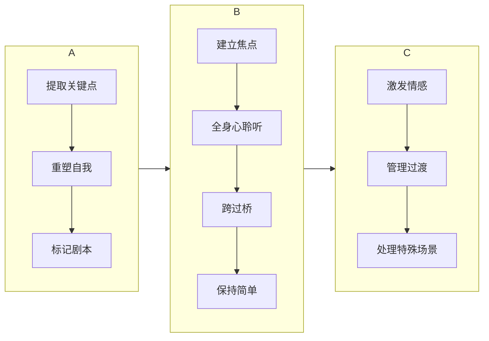
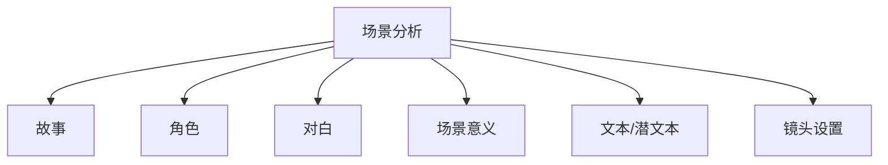
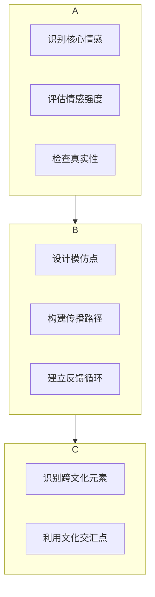

# 电影Skill使用指南

> 本文档详细说明如何在Hermes中使用电影制作Skill进行电影创作、分析和教学。

## 目录

- [[#概述]]
- [[#电影制作全流程]]
- [[#Skill清单]]
- [[#配置流程]]
- [[#Skill使用指南]]
- [[#工作流整合]]
- [[#最佳实践]]
- [[#故障排除]]

---

## 概述

### 什么是电影Skill？

电影Skill是将电影制作方法论书籍转化为结构化、可执行的知识模块。每个Skill包含：

| 组件 | 说明 |
|------|------|
| **核心理念** | 方法论的核心思想和原则 |
| **触发条件** | 自动激活的关键词和场景 |
| **执行流程** | 分阶段、分步骤的执行指南 |
| **决策规则** | 基于场景的设计选择建议 |
| **质量检查** | 每个阶段的验证清单 |
| **模板库** | 标准化的输出模板 |
| **案例库** | 经典电影的参考分析 |

### Hermes集成优势



通过Hermes集成，你可以：
- 🎬 **全流程支持**：从概念到剪辑的完整工作流
- 🎯 **自动匹配**：根据问题自动选择合适的Skill
- 🔗 **多Skill协作**：组合多个Skill处理复杂创作任务
- 📝 **结构化输出**：生成符合行业规范的文档
- ✅ **质量验证**：自动应用检查清单

---

## 电影制作全流程

### 制作流程图



### 各环节对应的Skill

| 制作阶段 | 环节 | 核心Skill | 辅助Skill |
|----------|------|-----------|-----------|
| **前期** | 概念开发 | scifi-film-analysis | scene-analysis-method |
| | 剧本创作 | save-the-cat-screenwriting | save-the-cat-strikes-back |
| | 故事版 | storyboarding-art | - |
| **拍摄** | 场景调度 | film-shot-design | shot-grammar |
| | 镜头设计 | shot-grammar | cinematography-visual-language |
| | 表演指导 | camera-acting-method | - |
| **后期** | 音乐音效 | film-scoring-guide | - |
| | 剪辑合成 | editing-grammar | film-semiotics-peirce |
| **研究** | 影片分析 | scene-analysis-method | film-semiotics-peirce |
| **传播** | 营销传播 | viral-video-method | - |

---

## Skill清单

### 剧本创作类

| Skill名称 | 来源 | 核心价值 | 适用场景 |
|-----------|------|----------|----------|
| [[#save-the-cat-screenwriting]] | Blake Snyder | 15拍结构、10种类型 | 剧本大纲、结构设计 |
| [[#save-the-cat-strikes-back]] | Blake Snyder | 问题排查、修改策略 | 剧本修改、诊断问题 |
| [[#save-the-cat-classic-scripts]] | Blake Snyder | 50部经典分析 | 参考学习、案例分析 |

### 视觉设计类

| Skill名称 | 核心价值 | 适用场景 |
|-----------|----------|----------|
| [[#storyboarding-art]] | 分镜绘制、视觉叙事 | 故事版创作、镜头规划 |
| [[#film-shot-design]] | 三角位、动作轴、对话调度 | 场景调度、演员走位 |
| [[#shot-grammar]] | 9种景别、构图规则、布光 | 镜头设计、视觉风格 |
| [[#cinematography-visual-language]] | 色彩、运动、光线、空间 | 视觉风格、摄影指导 |

### 表演指导类

| Skill名称 | 核心价值 | 适用场景 |
|-----------|----------|----------|
| [[#camera-acting-method]] | 聆听即表演、简单不失激情 | 镜头前表演、演员指导 |

### 后期制作类

| Skill名称 | 核心价值 | 适用场景 |
|-----------|----------|----------|
| [[#editing-grammar]] | 47条剪辑规则、12种镜头 | 剪辑设计、节奏控制 |
| [[#film-scoring-guide]] | 5阶段配乐流程 | 音乐创作、音效设计 |

### 分析研究类

| Skill名称 | 核心价值 | 适用场景 |
|-----------|----------|----------|
| [[#scene-analysis-method]] | 6要素场景分析 | 影片分析、场景解读 |
| [[#film-semiotics-peirce]] | 皮尔斯符号学 | 意义解读、深度分析 |
| [[#scifi-film-analysis]] | 类型定位、文化解读 | 科幻电影研究 |

### 传播营销类

| Skill名称 | 核心价值 | 适用场景 |
|-----------|----------|----------|
| [[#viral-video-method]] | 情感驱动、互动设计 | 视频营销、病毒传播 |

---

## 配置流程

### 第一步：环境准备

确保已安装Hermes Agent：

```bash
# 验证Hermes安装
hermes --version
hermes doctor

# 检查技能目录
ls ~/.hermes/skills/custom/
```

### 第二步：部署Skill文件

#### 方法一：自动部署（推荐）

```bash
# 进入项目目录
cd D:\ObsidianVault\ideal

# 复制所有电影Skill
cp 书库/电影md/*/SKILL.md ~/.hermes/skills/custom/
```

#### 方法二：选择性部署

只部署需要的Skill：

```bash
# 只部署核心创作Skill
cp 书库/电影md/save-the-cat-screenwriting/SKILL.md ~/.hermes/skills/custom/save-the-cat-screenwriting.md
cp 书库/电影md/storyboarding-art/SKILL.md ~/.hermes/skills/custom/storyboarding-art.md
cp 书库/电影md/editing-grammar/SKILL.md ~/.hermes/skills/custom/editing-grammar.md
```

### 第三步：重新加载技能

```bash
# 让Hermes重新加载技能
hermes skills reload

# 验证技能已加载
hermes skills list | grep -E "save|film|shot|editing|camera"
```

### 第四步：配置Hermes

编辑 `~/.hermes/config.yaml`：

```yaml
hermes:
  name: "电影制作助手"
  version: "2026.5.8"

model:
  provider: "openrouter"
  api_key: "${OPENROUTER_API_KEY}"
  model: "anthropic/claude-opus-4"
  temperature: 0.7
  max_tokens: 8000

memory:
  prompt_limit: 4000
  session_limit: 100
  persistence: true

skills:
  auto_load:
    - save-the-cat-screenwriting
    - storyboarding-art
    - film-shot-design
    - editing-grammar
    - camera-acting-method
    - film-scoring-guide
  custom_paths:
    - ~/.hermes/skills/custom
```

### 第五步：验证配置

```bash
# 验证单个技能
hermes skills show save-the-cat-screenwriting

# 测试技能触发
hermes "帮我写一个电影的剧本大纲"
hermes "设计一场戏的场景调度"
```

---

## Skill使用指南

### save-the-cat-screenwriting（救猫咪编剧法）

#### 触发关键词
- "剧本创作"、"写剧本"、"剧本大纲"
- "15拍结构"、"救猫咪"
- "电影类型"、"故事结构"

#### 核心方法：15拍结构

| 拍数 | 名称 | 页数 | 内容 |
|------|------|------|------|
| 1 | 开场画面 | 1-5 | 展示主角初始状态 |
| 2 | 阐述主题 | 5 | 点出故事核心议题 |
| 3 | 铺垫 | 1-10 | 建立主角生活 |
| 4 | 推动事件 | 12 | 打破平衡的事件 |
| 5 | 争论 | 12-25 | 主角犹豫不决 |
| 6 | 第二幕 | 25 | 进入新世界 |
| 7 | B故事 | 30 | 副线开始 |
| 8 | 游戏时刻 | 30-55 | 展现主要乐趣 |
| 9 | 中点 | 55 | 假胜利或假失败 |
| 10 | 反派逼近 | 55-75 | 危机升级 |
| 11 | 一无所有 | 75 | 最低点 |
| 12 | 灵魂黑夜 | 75-85 | 深度反思 |
| 13 | 第三幕 | 85 | 决定改变 |
| 14 | 终章 | 85-110 | 最终对决 |
| 15 | 终场画面 | 110 | 展示主角变化 |

#### 使用示例

```
用户: 帮我用救猫咪方法写一个爱情喜剧的剧本大纲

Hermes会自动应用:
1. 确定类型：爱情喜剧
2. 应用15拍结构填充
3. 生成完整的剧本大纲
4. 应用质量检查清单
```

#### 输出模板

```markdown
# 剧本大纲：[片名]

## 类型定位
- 主类型：[类型名称]
- 子类型：[子类型名称]

## 一句话故事
[25字以内的故事梗概]

## 15拍结构

### 第一幕（1-25页）
| 拍 | 内容 | 页数 |
|----|------|------|
| 开场画面 | ... | 1-5 |
| 阐述主题 | ... | 5 |
| 铺垫 | ... | 5-10 |
| 推动事件 | ... | 12 |
| 争论 | ... | 12-25 |

### 第二幕（25-85页）
...

### 第三幕（85-110页）
...

## 主要角色
- 主角：[角色描述]
- 对手：[角色描述]
- 恋爱对象：[角色描述]
```

---

### storyboarding-art（故事版艺术）

#### 触发关键词
- "故事版"、"分镜"、"分镜头"
- "视觉化剧本"、"镜头脚本"
- "画分镜"、"设计镜头"

#### 核心流程



#### 故事版模板

```markdown
## 场景 [编号]：[场景描述]

| 镜号 | 景别 | 内容描述 | 运镜 | 音效 | 时长 |
|------|------|----------|------|------|------|
| 1 | 远景 | ... | 推 | 环境音 | 3s |
| 2 | 中景 | ... | 摇 | 对白 | 5s |
| 3 | 特写 | ... | 固定 | 对白 | 2s |

### 走位图
\`\`\`
[场景俯视图]
    门
    │
    *─────沙发
    │
    摄影机
\`\`\`
```

---

### film-shot-design（电影镜头设计）

#### 触发关键词
- "场景调度"、"演员走位"
- "三角位"、"动作轴"、"180度规则"
- "对话场景调度"、"多人场景"

#### 三角位系统

**标准布局**：
```
        摄影机位置A
              *
             /|
            / |
           /  |
          /   *
    演员1 *---* 演员2
         位置1 位置2

摄影机可在A、B、C三点移动
始终保持180°轴线一侧
```

#### 对话场景调度决策表

| 场景类型 | 推荐调度 | 特点 |
|----------|----------|------|
| 面对面对话 | 三角位 | 标准、易理解 |
| 并排对话 | 反打镜头 | 亲密、压抑 |
| 多人群戏 | 主镜头+插入 | 展示关系 |
| 动态对话 | 跟拍+手持 | 紧张、真实 |

#### 使用示例

```
用户: 设计一场两人坐在咖啡厅对话的场景调度

Hermes输出:
1. 确定场景类型：面对面对话
2. 设计三角位布局
3. 规划机位切换
4. 标注走位路线
5. 生成调度图和说明
```

---

### shot-grammar（镜头的语法）

#### 触发关键词
- "镜头设计"、"景别选择"
- "构图规则"、"布光方案"
- "镜头语法"、"摄影技巧"

#### 9种景别速查

| 景别 | 取景范围 | 叙事功能 |
|------|----------|----------|
| 大远景 | 环境+人物极小 | 确立地点、孤寂感 |
| 远景 | 全身+环境 | 展示动作、环境关系 |
| 中远景 | 膝盖以上 | 动作、多人关系 |
| 中景 | 腰部以上 | 对话、日常互动 |
| 中近景 | 胸部以上 | 情感、重要对话 |
| 近景 | 头部+肩 | 表情、亲密感 |
| 特写 | 面部 | 情感高潮、重要物品 |
| 大特写 | 眼睛/物品细节 | 强调、心理 |
| 极特写 | 局部细节 | 极端强调 |

#### 三点布光

```
         主光（Key Light）
              │
              ▼
        ┌─────────┐
        │  被摄体  │◄─── 补光（Fill Light）
        └─────────┘
              ▲
              │
         背光（Back Light）
```

| 光位 | 功能 | 光比 |
|------|------|------|
| 主光 | 主要照明，塑造形态 | 100% |
| 补光 | 减少阴影，控制对比 | 25-50% |
| 背光 | 分离主体与背景 | 50-75% |

---

### camera-acting-method（镜头前表演法）

#### 触发关键词
- "镜头表演"、"演员指导"
- "表演技巧"、"哭戏怎么演"
- "试镜准备"、"角色准备"

#### 核心理念

> 表演的精华在于简单——简单而不失激情。镜头前容不得欺骗，你要么真诚，要么虚伪。

#### 三阶段流程



#### 哭戏处理方案

| 问题 | 解决方案 |
|------|----------|
| 哭不出来 | 使用感觉记忆，找到具体感官触发 |
| 表演痕迹 | 努力忍住眼泪，挣扎才是动人之处 |
| 干号无泪 | 不要表演哭泣，让情感自然发生 |
| 突然需要 | 请求化妆师使用甘油 |

---

### editing-grammar（剪辑的语法）

#### 触发关键词
- "剪辑技巧"、"镜头组接"
- "转场方式"、"剪辑规则"
- "蒙太奇"、"节奏控制"

#### 47条剪辑规则精要

**基础规则**：
1. **永远不要没有任何理由地切** - 每一次剪辑必须有目的
2. **动作剪辑** - 在动作进行中切换，隐藏剪辑点
3. **方向保持** - 遵守180度规则，保持空间一致性
4. **视线匹配** - 切到角色看到的事物

**转场类型**：

| 转场 | 视觉效果 | 叙事功能 |
|------|----------|----------|
| 切 | 直接跳转 | 时间连续、快节奏 |
| 叠化 | 渐变融合 | 时间流逝、回忆 |
| 淡入淡出 | 黑/白场 | 场景结束、段落分隔 |
| 划 | 滑动替换 | 风格化、时间压缩 |

**剪辑类型**：

| 类型 | 定义 | 应用场景 |
|------|------|----------|
| 连续性剪辑 | 保持时空连续 | 标准叙事 |
| 蒙太奇 | 镜头碰撞产生新意 | 情感表达、主题深化 |
| 平行剪辑 | 交替展示同时发生的事 | 悬念、张力 |
| 跳跃剪辑 | 打破时间连续 | 风格化、时间压缩 |
| 匹配剪辑 | 图形/动作/概念匹配 | 过渡、隐喻 |

---

### film-scoring-guide（电影配乐指南）

#### 触发关键词
- "电影配乐"、"背景音乐"
- "音效设计"、"电影声音"
- "作曲流程"、"配乐点"

#### 5阶段配乐流程


| 阶段 | 目标 | 关键产出 |
|------|------|----------|
| 理解影片 | 把握情感基调 | 情感地图 |
| 确定点 | 决定音乐位置 | 点清单 |
| 作曲 | 创作音乐 | 乐谱/小样 |
| 录制 | 实现音乐 | 最终音轨 |
| 商业 | 版权发行 | 发行方案 |

#### 音乐叙事功能

| 功能 | 说明 | 示例 |
|------|------|------|
| 情感引导 | 暗示观众应该如何感受 | 恐怖片的不协和音 |
| 角色主题 | 标识特定角色 | 《星球大战》角色主题曲 |
| 时代标记 | 确立时代背景 | 60年代摇滚乐 |
| 地域标记 | 标识地理位置 | 西班牙吉他 |
| 心理揭示 | 表达角色内心 | 内心独白时的音乐 |

---

### scene-analysis-method（场景分析方法）

#### 触发关键词
- "场景分析"、"影片分析"
- "这场戏什么意思"
- "解读电影场景"

#### 6要素分析框架



| 要素 | 分析问题 | 输出 |
|------|----------|------|
| 故事 | 这场戏如何推进故事？ | 叙事功能 |
| 角色 | 角色如何展现？ | 角色塑造 |
| 对白 | 对白的功能是什么？ | 对白分析 |
| 场景意义 | 场景的深层含义？ | 意义解读 |
| 文本/潜文本 | 表面vs真实意图？ | 潜文本分析 |
| 镜头设置 | 镜头如何服务叙事？ | 视觉分析 |

---

### film-semiotics-peirce（皮尔斯符号学）

#### 触发关键词
- "符号学分析"、"电影符号"
- "象似符"、"索引符"、"规约符"
- "电影意义"、"深层解读"

#### 三类符号

| 符号类型 | 定义 | 电影示例 |
|----------|------|----------|
| **象似符** Icon | 通过相似性表征 | 肖像、地图、特写 |
| **索引符** Index | 通过因果联系表征 | 烟=火、脚印=存在 |
| **规约符** Symbol | 通过约定表征 | 国旗、交通灯、文化符号 |

#### 符号学分析流程

```markdown
1. 识别符号 → 这是什么？
2. 分类符号 → 象似/索引/规约？
3. 分析关系 → 符号与指涉对象的关系？
4. 解读意义 → 在叙事中的功能？
5. 文化语境 → 在特定文化中的含义？
```

---

### scifi-film-analysis（科幻电影分析）

#### 触发关键词
- "科幻电影分析"、"科幻类型"
- "科幻主题解读"、"技术叙事"
- "科幻电影史"、"文化编码"

#### 类型定位框架

**核心科幻元素**：
- 未来社会/技术突破
- 人造生命/机器人
- 外星接触/太空探索
- 时间旅行
- 生理或心理变异
- 科学实验/灾变

**杂交类型识别**：
| 科幻-XX | 代表作品 |
|---------|----------|
| 科幻-侦探 | 《少数派报告》 |
| 科幻-战争 | 《异形2》 |
| 科幻-黑色片 | 《银翼杀手》 |
| 科幻-西部 | 《冲出宁静号》 |
| 科幻-浪漫喜剧 | 《美丽心灵的永恒阳光》 |

#### 技术叙事角色

| 角色 | 定位 | 代表作 |
|------|------|--------|
| 正面 | 帮助人类探险生存 | 《星际迷航》企业号 |
| 负面 | 技术失控反噬人类 | 《终结者》 |
| 中性 | 纯粹工具和背景 | 运输飞船 |

---

### viral-video-method（病毒视频方法）

#### 触发关键词
- "病毒视频"、"爆款内容"
- "视频营销"、"传播策略"
- "情感共鸣"、"互动设计"

#### 病毒传播三阶段



#### 情感强度评分

| 强度 | 表现 | 分享驱动力 |
|------|------|------------|
| 弱 | 轻微情绪波动 | 无分享冲动 |
| 中 | 明显情感反应 | 可能分享 |
| 强 | 强烈情感体验 | 想要分享 |
| 极强 | 歇斯底里/震撼 | 必须分享 |

---

## 工作流整合

### 完整电影制作工作流

```mermaid
graph TB
    subgraph 概念阶段
        A[创意生成] --> B[类型定位]
        B --> C[主题确立]
        C --> D[一句话故事]
    end
    
    subgraph 剧本阶段
        D --> E[15拍结构]
        E --> F[角色设计]
        F --> G[对白撰写]
        G --> H[剧本修改]
    end
    
    sub格 视觉阶段
        H --> I[故事版绘制]
        I --> J[场景调度设计]
        J --> K[镜头方案]
        K --> L[布光方案]
    end
    
    subgraph 拍摄阶段
        L --> M[表演指导]
        M --> N[现场调整]
    end
    
    subgraph 后期阶段
        N --> O[剪辑设计]
        O --> P[配乐创作]
        P --> Q[音效设计]
        Q --> R[最终合成]
    end
    
    subgraph 传播阶段
        R --> S[营销策略]
        S --> T[发布推广]
    end
```

### Skill组合使用示例

#### 场景1：新电影项目开发

```bash
# Step 1: 类型定位
hermes "分析科幻爱情类型的特点，帮我定位这部电影"

# Step 2: 剧本创作
hermes "用救猫咪方法为这个科幻爱情故事创建剧本大纲"

# Step 3: 故事版
hermes "把剧本的第一幕转化为故事版，标注镜头设计"

# Step 4: 场景调度
hermes "设计第三场关键对话戏的场景调度方案"

# Step 5: 剪辑方案
hermes "设计高潮段落蒙太奇的剪辑方案"
```

#### 场景2：影片分析研究

```bash
# Step 1: 场景分析
hermes "分析《银翼杀手》结局场景的6要素"

# Step 2: 符号学解读
hermes "用皮尔斯符号学解读这个场景中的视觉符号"

# Step 3: 类型定位
hermes "分析这部电影在科幻类型中的位置"

# Step 4: 文化解读
hermes "解读这部电影反映的80年代技术焦虑"
```

#### 场景3：短视频创作

```bash
# Step 1: 内容创意
hermes "帮我设计一个有病毒传播潜力的短视频创意"

# Step 2: 情感设计
hermes "分析这个创意的情感触发点"

# Step 3: 互动设计
hermes "设计观众可以参与模仿的元素"

# Step 4: 传播策略
hermes "规划这个视频的传播路径和关键节点"
```

---

## 最佳实践

### 1. 选择正确的Skill

```
创作阶段 → 推荐Skill

概念开发 → scifi-film-analysis（类型定位）
剧本创作 → save-the-cat-screenwriting（结构设计）
故事版 → storyboarding-art（分镜设计）
场景调度 → film-shot-design（三角位系统）
镜头设计 → shot-grammar（景别构图）
表演指导 → camera-acting-method（聆听法）
音乐音效 → film-scoring-guide（5阶段流程）
后期剪辑 → editing-grammar（47条规则）
影片分析 → scene-analysis-method（6要素）
深层解读 → film-semiotics-peirce（符号学）
传播营销 → viral-video-method（病毒传播）
```

### 2. 迭代创作流程

```
1. 快速原型 → 用save-the-cat生成剧本框架
2. 深度设计 → 用storyboarding细化视觉方案
3. 技术规划 → 用film-shot-design和shot-grammar设计镜头
4. 执行指导 → 用camera-acting-method指导表演
5. 后期完善 → 用editing-grammar设计剪辑
6. 质量验证 → 应用各Skill的检查清单
7. 迭代改进 → 重复以上步骤
```

### 3. 文档生成规范

每次使用Skill后，建议保存输出到：

```
电影项目/
├── 开发文档/
│   ├── 01_概念定位.md
│   ├── 02_剧本大纲.md
│   ├── 03_角色设计.md
│   └── 04_故事版.md
├── 技术文档/
│   ├── 场景调度方案/
│   ├── 镜头设计方案/
│   ├── 表演指导笔记/
│   └── 剪辑方案/
└── 检查清单/
    ├── 剧本检查.md
    ├── 镜头检查.md
    └── 剪辑检查.md
```

### 4. 跨Skill协同

电影制作中多个Skill需要协同使用：

| 协同场景 | 主Skill | 辅助Skill | 协同方式 |
|----------|---------|-----------|----------|
| 剧本到故事版 | save-the-cat | storyboarding-art | 剧本提供内容框架 |
| 故事版到拍摄 | storyboarding-art | film-shot-design | 分镜指导调度设计 |
| 场景到镜头 | film-shot-design | shot-grammar | 调度确定后细化镜头 |
| 拍摄到剪辑 | editing-grammar | shot-grammar | 镜头设计影响剪辑选择 |

---

## 故障排除

### Skill未被识别

```bash
# 检查文件是否在正确位置
ls ~/.hermes/skills/custom/ | grep -E "save|film|shot|editing"

# 重新加载
hermes skills reload

# 验证加载
hermes skills list
```

### 触发词不生效

```bash
# 明确指定Skill
hermes "使用save-the-cat-screenwriting帮我写剧本大纲"

# 检查Skill描述
hermes skills show save-the-cat-screenwriting
```

### 输出不完整

```bash
# 增加token限制
hermes config set max_tokens 8000

# 分步执行
hermes "只做Phase 1: 剧本类型定位"
hermes "继续Phase 2: 15拍结构填充"
```

### 多Skill冲突

```bash
# 指定优先使用的Skill
hermes "优先使用editing-grammar，帮我设计这场戏的剪辑方案"

# 或者分步骤调用不同Skill
hermes "先用scene-analysis-method分析这场戏，再用editing-grammar设计剪辑"
```

---

## 附录

### Skill快速查询表

| 需求 | Skill | 核心输出 |
|------|-------|----------|
| 写剧本大纲 | save-the-cat-screenwriting | 15拍结构表 |
| 修改剧本 | save-the-cat-strikes-back | 问题诊断报告 |
| 画故事版 | storyboarding-art | 分镜脚本 |
| 设计调度 | film-shot-design | 走位图+机位图 |
| 选择镜头 | shot-grammar | 镜头方案+布光图 |
| 指导表演 | camera-acting-method | 表演方案 |
| 设计剪辑 | editing-grammar | 剪辑方案 |
| 创作配乐 | film-scoring-guide | 配乐点清单 |
| 分析场景 | scene-analysis-method | 6要素分析报告 |
| 解读符号 | film-semiotics-peirce | 符号学分析 |
| 定位类型 | scifi-film-analysis | 类型定位报告 |
| 传播视频 | viral-video-method | 传播策略 |

### 电影制作检查清单汇总

```markdown
## 剧本阶段
- [ ] 类型定位明确
- [ ] 15拍结构完整
- [ ] 角色弧线清晰
- [ ] 对白有潜文本

## 视觉阶段
- [ ] 故事版覆盖关键场景
- [ ] 调度符合三角位原则
- [ ] 镜头设计有目的性
- [ ] 布光方案完整

## 拍摄阶段
- [ ] 表演真诚自然
- [ ] 遵守180度规则
- [ ] 声音录制质量达标

## 后期阶段
- [ ] 剪辑有节奏感
- [ ] 配乐服务叙事
- [ ] 音效层次丰富
- [ ] 整体风格统一
```

---

## 相关资源

- [[书库/电影md/电影类工具书创建skill完整指南]] - 如何创建新的电影Skill
- [[书库/电影md/save-the-cat-screenwriting/SKILL.md]] - 救猫咪编剧法
- [[书库/电影md/editing-grammar/SKILL.md]] - 剪辑的语法
- [[书库/电影md/camera-acting-method/SKILL.md]] - 镜头前表演法

---

> [!success] 文档信息
> **创建时间**: 2026-05-08
> **版本**: 1.0
> **作者**: Claudian AI助手
> **Skill数量**: 14个电影制作Skill
> **覆盖流程**: 概念→剧本→故事版→场景调度→镜头→表演→音乐音效→剪辑

> [!tip] 快速开始
> 1. 部署Skill文件到 `~/.hermes/skills/custom/`
> 2. 运行 `hermes skills reload`
> 3. 开始使用: `hermes "帮我写一个电影的剧本大纲"`
