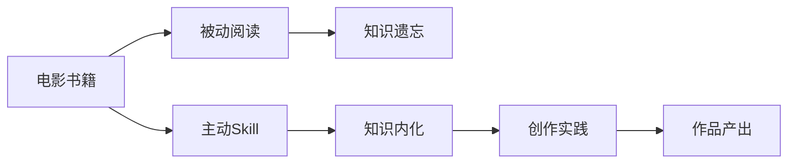

# 电影类工具书创建Skill完整指南

> 将电影方法论书籍转化为可执行的Agent Skill，让知识从"静态文本"变为"动态能力"。

## 目录

- [[#概述]]
- [[#方法论基础]]
- [[#Phase 1: 书籍分析]]
- [[#Phase 2: 框架提取]]
- [[#Phase 3: Skill构建]]
- [[#Phase 4: 质量验证]]
- [[#Phase 5: 打包发布]]
- [[#电影类Skill特殊考量]]
- [[#案例研究]]
- [[#常见问题]]

---

## 概述

### 什么是电影类Skill？

电影类Skill是将电影制作方法论书籍转化为结构化、可执行的知识模块，使AI Agent能够：

| 能力 | 说明 |
|------|------|
| **自动激活** | 根据触发条件自动选择合适的Skill |
| **分步执行** | 按照Phase-Step结构化流程执行任务 |
| **决策支持** | 根据规则表提供设计建议 |
| **质量验证** | 应用检查清单确保输出质量 |

### 为什么要创建Skill？



**传统阅读的问题**：
- 知识存储在大脑中，无法系统调用
- 方法论碎片化，难以形成工作流
- 检查清单无法自动应用

**Skill的优势**：
- 知识结构化，可被AI理解和执行
- 方法论流程化，形成完整工作流
- 质量标准内嵌，自动验证输出

---

## 方法论基础

### Skill标准结构

每个电影类Skill遵循统一结构：

```yaml
---
name: skill-name
description: |
  简短描述（50字内）
  触发场景：[场景列表]
  核心价值：[价值列表]
---

# 标题

> 核心理念金句（一句话）

## 核心理念
## 触发条件
## 执行流程
## 决策规则
## 检查清单
## 模板库
## 示例
## 局限性
## 来源
```

### 电影制作流程映射

电影制作是一个完整的流程，每个环节对应特定的Skill：


| 制作环节 | 对应Skill | 核心方法 |
|----------|-----------|----------|
| 概念开发 | scifi-film-analysis | 类型定位、文化解读 |
| 剧本创作 | save-the-cat-screenwriting | 15拍结构、10种类型 |
| 故事版 | storyboarding-art | 视觉化叙事、分镜设计 |
| 场景调度 | film-shot-design | 三角位、动作轴 |
| 镜头设计 | shot-grammar | 景别、构图、布光 |
| 表演指导 | camera-acting-method | 聆听即表演、简单不失激情 |
| 音乐音效 | film-scoring-guide | 5阶段配乐流程 |
| 后期剪辑 | editing-grammar | 47条剪辑规则 |

---

## Phase 1: 书籍分析

**目标**：深入理解书籍内容，识别可转化为Skill的核心方法论

### Step 1: 初读定位

**动作**：快速浏览全书，回答三个问题

**标准问题**：
1. 这本书解决什么问题？（目标问题）
2. 核心方法论是什么？（核心框架）
3. 方法论是否有清晰步骤？（可执行性）

**判断标准**：

| 条件 | 判断 | 处理 |
|------|------|------|
| 三个问题都有明确答案 | 适合创建Skill | 继续Phase 2 |
| 只有核心方法论 | 需要补充步骤 | 自行设计步骤 |
| 问题和方法论都不清晰 | 不适合创建Skill | 跳过此书 |

**输出**：`书籍分析报告：[目标问题] + [核心框架] + [可执行性评估]`

### Step 2: 深读提取

**动作**：精读全书，提取关键要素

**提取清单**：

```markdown
## 核心概念提取
- 定义性概念：[概念名] = [定义]
- 原则性概念：[原则名] → [适用条件]
- 方法性概念：[方法名] → [步骤]

## 流程提取
- 阶段划分：Phase 1 → Phase 2 → Phase 3
- 每阶段步骤：Step 1, Step 2, Step 3...

## 决策规则提取
- 条件1 → 行动1
- 条件2 → 行动2

## 检查清单提取
- [ ] 检查项1
- [ ] 检查项2

## 模板提取
- 模板名称
- 模板内容

## 示例提取
- 案例名称
- 案例过程
- 案例结果
```

**输出**：`提取笔记：[概念清单] + [流程清单] + [规则清单] + [模板清单]`

### Step 3: 读者画像

**动作**：明确Skill的目标用户

**标准画像维度**：

| 维度 | 问题 | 示例 |
|------|------|------|
| **专业程度** | 新手/进阶/专家？ | 电影学院学生 |
| **使用场景** | 在什么情境下使用？ | 准备拍摄时 |
| **痛点问题** | 最想解决什么问题？ | 不知道如何调度演员 |
| **期望输出** | 希望得到什么结果？ | 完整的场景调度方案 |

**输出**：`目标用户画像`

**检查点**：
- [ ] 书籍的核心价值是否识别？
- [ ] 关键要素是否完整提取？
- [ ] 目标用户是否明确？

---

## Phase 2: 框架提取

**目标**：将提取的内容转化为Skill结构

### Step 1: 设计Phase结构

**动作**：将方法论转化为Phase-Step结构

**设计原则**：
- Phase数量：3-5个为宜
- 每个Phase：有明确目标
- 每个Step：有具体动作和标准

**电影类Skill常见Phase模式**：

| Skill类型 | Phase模式 |
|-----------|-----------|
| **分析类** | 定位 → 解读 → 评价 |
| **创作类** | 准备 → 设计 → 执行 |
| **技术类** | 认知 → 操作 → 验证 |
| **管理类** | 规划 → 执行 → 监控 |

**示例**（film-scoring-guide）：

```markdown
Phase 1: 理解影片 - 目标：把握影片情感基调
Phase 2: 确定点 - 目标：决定音乐出现位置
Phase 3: 作曲 - 目标：创作符合影片的音乐
Phase 4: 录制 - 目标：实现音乐的最佳呈现
Phase 5: 商业 - 目标：处理版权和发行
```

### Step 2: 细化Step内容

**动作**：为每个Step定义动作、标准、输出

**Step标准格式**：

```markdown
#### Step X: [步骤名称]

**动作**：[具体要做什么]

**标准**：
- 标准1
- 标准2
- 标准3

**决策规则**：
| 条件 | 行动 |
|------|------|
| 如果... | 则... |

**输出**：`[输出物名称]：[内容描述]`
```

**电影类Step设计要点**：

| 要点 | 说明 | 示例 |
|------|------|------|
| **视觉化** | 强调视觉思维 | "画出机位图" |
| **技术性** | 包含具体参数 | "光圈f/2.8，ISO 800" |
| **实践性** | 可直接执行 | "标记剧本上的关键台词" |
| **检查性** | 有验证标准 | "是否符合180°规则" |

### Step 3: 构建决策规则

**动作**：将书中的建议转化为条件-行动表

**决策规则来源**：
- 书中明确的建议
- 作者的隐含偏好
- 行业通用做法

**电影类常见决策维度**：

| 维度 | 条件类型 | 示例 |
|------|----------|------|
| **类型** | 喜剧/悲剧/动作... | 如果是喜剧 → 使用明快节奏 |
| **场景** | 内景/外景/日/夜 | 如果是夜景 → 考虑布光方案 |
| **情感** | 欢快/悲伤/紧张 | 如果是紧张 → 用快速剪辑 |
| **预算** | 大制作/小成本 | 如果是小成本 → 选择简单方案 |
| **时长** | 长片/短片/广告 | 如果是广告 → 精简叙事 |

**输出**：`Skill结构草案：[Phase清单] + [Step清单] + [决策规则表]`

**检查点**：
- [ ] Phase结构是否清晰？
- [ ] 每个Step是否可执行？
- [ ] 决策规则是否完整？

---

## Phase 3: Skill构建

**目标**：按照标准格式编写Skill文件

### Step 1: 编写Frontmatter

**动作**：填写YAML头部信息

**标准格式**：

```yaml
---
name: [skill-name]
description: |
  [一句话核心描述]。
  触发场景：[场景1]/[场景2]/[场景3]。
  核心价值：[价值1]、[价值2]、[价值3]。
---
```

**命名规则**：

| 类型 | 命名模式 | 示例 |
|------|----------|------|
| 方法论 | [主题]-method | camera-acting-method |
| 指南 | [主题]-guide | film-scoring-guide |
| 分析 | [主题]-analysis | scene-analysis-method |
| 技术 | [主题]-techniques | editing-grammar |

**description撰写要点**：
- 第一句：一句话说清核心（50字内）
- 触发场景：3-5个典型场景
- 核心价值：3个关键词

### Step 2: 编写核心理念

**动作**：提炼书中的核心思想

**标准格式**：

```markdown
# [书名]：[方法论名称]

> [金句：一句话概括核心理念]

## 核心理念

本书由[作者]撰写，核心方法论围绕[中心思想]。三个核心原则：
1. **[原则1]**：[说明]
2. **[原则2]**：[说明]
3. **[原则3]**：[说明]
```

**金句撰写技巧**：
- 用对比："不是...而是..."
- 用因果："因为...所以..."
- 用类比："就像...一样..."

**电影类金句示例**：

| Skill | 金句 |
|-------|------|
| camera-acting-method | 表演的精华在于简单——简单而不失激情 |
| editing-grammar | 剪辑是隐形的艺术——最好的剪辑让观众感觉不到剪辑 |
| film-scoring-guide | 配乐是电影的潜意识——它说出角色无法言说的情感 |

### Step 3: 编写触发条件

**动作**：定义Skill自动激活的条件

**标准格式**：

```markdown
## 触发条件

当用户请求以下任务时自动激活：
- [任务类型1]
- [任务类型2]
- [任务类型3]
```

**电影类触发条件模式**：

| Skill类型 | 触发条件模式 |
|-----------|--------------|
| 创作类 | 设计X、创作X、规划X |
| 分析类 | 分析X、解读X、研究X |
| 技术类 | 如何实现X、解决X问题 |
| 解决问题类 | X不好/不对/不出来 |

### Step 4: 编写执行流程

**动作**：将Phase-Step结构转化为完整内容

**执行流程撰写原则**：

1. **每Phase有目标**
```markdown
### Phase X: [Phase名称]

**目标**：[这个Phase要达成什么]
```

2. **每Step有输入输出**
```markdown
**输入**：
- [输入1]
- [输入2]

**输出**：`[输出名称]：[内容]`
```

3. **关键Step有示例**
```markdown
**示例**：
\`\`\`
[具体示例内容]
\`\`\`
```

4. **每个Phase有检查点**
```markdown
**检查点**：
- [ ] 检查项1
- [ ] 检查项2
```

### Step 5: 编写辅助模块

**动作**：完成决策规则、检查清单、模板库、示例

**决策规则格式**：

```markdown
## 决策规则

| 条件 | 行动 | 说明 |
|------|------|------|
| 如果[条件] | [行动] | [解释] |
```

**检查清单格式**：

```markdown
## 检查清单

### [检查类型]检查

**执行时机**：[什么时候检查]

- [ ] 检查项1
- [ ] 检查项2

**不通过处理**：[如何处理不通过的情况]
```

**模板库格式**：

```markdown
## 模板库

### [模板名称]

**用途**：[什么情况下使用]

\`\`\`
[模板内容]
\`\`\`
```

**示例格式**：

```markdown
## 示例

### 示例[序号]：[示例名称]

**输入**：[输入内容]

**执行过程**：
1. Phase 1: [做了什么]
2. Phase 2: [做了什么]

**输出**：
\`\`\`
[输出内容]
\`\`\`
```

### Step 6: 编写局限性和来源

**动作**：声明Skill的边界和来源

**局限性格式**：

```markdown
## 局限性

- **不适用于**：[什么情况不能用]
- **依赖条件**：[需要什么前置条件]
- **可能失效**：[什么情况下可能失效]
- **信息截止**：[知识的时效性]
- **个人差异**：[个体差异导致的问题]
```

**来源格式**：

```markdown
## 来源

> 本 Skill 基于书籍《[书名]》（[作者]，[出版社]，[年份]）改写
>
> 改写者：[名字]
> 创建日期：[日期]
> 版本：[版本号]
```

**输出**：`完整的SKILL.md文件`

**检查点**：
- [ ] Frontmatter是否完整？
- [ ] 核心理念是否清晰？
- [ ] 触发条件是否明确？
- [ ] 执行流程是否完整？
- [ ] 辅助模块是否齐全？
- [ ] 局限性和来源是否声明？

---

## Phase 4: 质量验证

**目标**：确保Skill内容准确、可用、有价值

### Step 1: 内容准确性验证

**动作**：对照原书验证关键内容

**验证清单**：

| 验证项 | 方法 | 标准 |
|--------|------|------|
| 概念定义 | 对比原书定义 | 无歪曲、无遗漏 |
| 流程步骤 | 对照原书流程 | 顺序正确、无缺失 |
| 决策规则 | 验证规则来源 | 有据可查 |
| 示例案例 | 对照原书案例 | 情节准确 |

### Step 2: 可用性测试

**动作**：模拟使用Skill完成任务

**测试场景**：

```markdown
## 可用性测试记录

### 测试场景1：[场景描述]
- 输入：[测试输入]
- 预期输出：[预期结果]
- 实际输出：[实际结果]
- 是否通过：[通过/不通过]
- 问题记录：[如有问题]

### 测试场景2：...
```

**电影类Skill测试场景建议**：

| Skill类型 | 测试场景 |
|-----------|----------|
| 剧本创作 | 给定一个创意，生成剧本大纲 |
| 场景调度 | 给定一场戏的文本，设计调度方案 |
| 镜头设计 | 给定场景描述，设计镜头方案 |
| 剪辑 | 给定素材描述，设计剪辑方案 |

### Step 3: 价值评估

**动作**：评估Skill对目标用户的价值

**评估维度**：

| 维度 | 问题 | 评分(1-5) |
|------|------|-----------|
| **节省时间** | 能否减少用户的摸索时间？ | |
| **提高质量** | 能否提升输出质量？ | |
| **降低门槛** | 能否帮助新手入门？ | |
| **激发创意** | 能否启发新的思路？ | |
| **可复用性** | 能否反复使用？ | |

**输出**：`质量验证报告 + 问题修复`

**检查点**：
- [ ] 内容是否准确？
- [ ] 可用性测试是否通过？
- [ ] 价值评估是否达标？

---

## Phase 5: 打包发布

**目标**：将Skill文件部署到正确位置

### Step 1: 文件命名和位置

**动作**：按照规范命名文件并放置

**命名规范**：

```
[skill-name]/SKILL.md
```

**目录结构**：

```
书库/电影md/
├── [skill-name]/
│   ├── SKILL.md          # Skill主文件
│   └── [原书笔记].md      # 原书阅读笔记（可选）
```

### Step 2: 配置Hermes集成

**动作**：将Skill注册到Hermes系统

**配置方法**：

1. 复制Skill到Hermes目录：
```bash
cp 书库/电影md/[skill-name]/SKILL.md ~/.hermes/skills/custom/
```

2. 在配置文件中添加：
```yaml
skills:
  auto_load:
    - [skill-name]
```

3. 重新加载：
```bash
hermes skills reload
```

### Step 3: 创建使用指南

**动作**：在使用指南文档中添加Skill说明

**添加内容**：

```markdown
### [skill-name]

#### 触发关键词
- "[关键词1]"、"[关键词2]"

#### 使用示例
\`\`\`
用户: [示例输入]
\`\`\`

#### 核心功能
- 功能1
- 功能2
```

**输出**：`完整的Skill包`

**检查点**：
- [ ] 文件位置是否正确？
- [ ] Hermes集成是否完成？
- [ ] 使用指南是否更新？

---

## 电影类Skill特殊考量

### 视觉化表达

电影是视觉艺术，Skill中需要强调视觉化思维：

**设计原则**：
1. **用图表代替文字**：机位图、分镜图、走位图
2. **用示例代替抽象**：具体影片案例分析
3. **用模板引导输出**：可视化输出模板

**示例**（film-shot-design）：

```markdown
#### 三角位系统

**标准布局**：
\`\`\`
        摄影机位置A
              *
             /|
            / |
           /  |
          /   |
    演员1 *----* 演员2
         位置1 位置2

摄影机可在A、B、C三点移动，保持180°轴线
\`\`\`
```

### 技术参数精确性

电影制作有大量技术参数，需要精确记录：

**参数类型**：

| 类型 | 示例 | Skill中的处理 |
|------|------|---------------|
| 镜头参数 | 焦距、光圈 | 在决策规则中明确 |
| 灯光参数 | 色温、强度 | 在标准中说明 |
| 音频参数 | 分贝、频率 | 在技术要求中列出 |
| 时间参数 | 帧率、时长 | 在模板中标注 |

### 团队协作考量

电影制作是团队工作，Skill需要考虑协作：

**协作点**：

| 环节 | 协作对象 | Skill体现 |
|------|----------|-----------|
| 剧本 | 导演、制片 | 输出格式标准化 |
| 分镜 | 摄影、美术 | 图文结合模板 |
| 调度 | 演员、摄影 | 走位图和指令 |
| 剪辑 | 导演、音效 | 输出交接规范 |

---

## 案例研究

### 案例1：《如何在镜头前表演》→ camera-acting-method

**书籍特点**：
- 目标明确：教演员如何在镜头前表演
- 方法清晰：聆听→反应→桥→简单
- 实践导向：大量具体练习

**转化过程**：

| 阶段 | 关键决策 |
|------|----------|
| Phase 1 | 识别核心：聆听即表演 |
| Phase 2 | 设计3个Phase：角色准备→表演执行→情感管理 |
| Phase 3 | 提取决策规则：如果表演过火→减少外部表现 |
| Phase 4 | 测试：用"哭戏"场景验证 |
| Phase 5 | 命名：camera-acting-method |

**核心价值**：
- 将"表演"这个抽象概念转化为可操作的步骤
- 提供具体的问题解决方案（如哭戏处理）

### 案例2：《剪辑的语法》→ editing-grammar

**书籍特点**：
- 高度结构化：12种镜头+4种转场+5种剪辑类型
- 规则明确：47条具体规则
- 图文并茂：大量示意图

**转化过程**：

| 阶段 | 关键决策 |
|------|----------|
| Phase 1 | 识别核心：剪辑是隐形的艺术 |
| Phase 2 | 设计结构：按剪辑类型组织 |
| Phase 3 | 将47条规则转化为决策表 |
| Phase 4 | 测试：用实际剪辑场景验证 |
| Phase 5 | 命名：editing-grammar |

**核心价值**：
- 将碎片化规则整合为系统方法
- 提供快速查询的决策表

### 案例3：《救猫咪》→ save-the-cat-screenwriting

**书籍特点**：
- 商业化方法论：15拍结构表
- 类型化思维：10种电影类型
- 案例丰富：50部经典电影分析

**转化过程**：

| 阶段 | 关键决策 |
|------|----------|
| Phase 1 | 识别核心：结构救剧本 |
| Phase 2 | 设计Phase：类型确定→结构填充→验证 |
| Phase 3 | 将15拍转化为可执行步骤 |
| Phase 4 | 测试：用创意生成剧本大纲 |
| Phase 5 | 命名：save-the-cat-screenwriting |

**核心价值**：
- 将写作灵感转化为结构化输出
- 提供15拍模板快速填充

---

## 常见问题

### Q1: 书的内容太多，如何取舍？

**原则**：
- 保留：核心方法论、关键流程、重要规则
- 精简：案例细节、历史背景、作者轶事
- 删除：与核心方法无关的内容

**判断标准**：
问自己："这部分内容是否能帮助用户完成任务？"

### Q2: 书的方法论不够系统，如何设计Phase？

**方法**：
1. 识别书的解决问题逻辑
2. 按照时间顺序组织步骤
3. 参考同类Skill的Phase设计
4. 根据实践验证调整

### Q3: 如何处理书中相互矛盾的建议？

**处理方式**：
1. 在决策规则中区分适用条件
2. 在局限性中说明矛盾
3. 选择作者强调的主要方法

### Q4: Skill是否需要包含所有书的内容？

**不需要**：
- Skill是"方法提炼"而非"内容摘要"
- 保留核心方法，其他内容在原书中
- Skill应指向原书作为深度参考

### Q5: 如何持续更新Skill？

**更新触发**：
- 原书有新版发布
- 用户反馈问题
- 新的实践案例

**更新流程**：
1. 识别需要更新的部分
2. 对照新版内容修改
3. 重新进行质量验证
4. 更新版本号和日期

---

## 附录

### Skill文件检查清单

```markdown
## Frontmatter
- [ ] name已定义
- [ ] description包含核心描述、触发场景、核心价值

## 正文结构
- [ ] 有核心理念和金句
- [ ] 有触发条件
- [ ] 有完整的执行流程（3-5个Phase）
- [ ] 每个Phase有目标和检查点
- [ ] 每个Step有动作、标准、输出
- [ ] 有决策规则表
- [ ] 有检查清单
- [ ] 有模板库
- [ ] 有示例
- [ ] 有局限性声明
- [ ] 有来源说明
```

### 电影类Skill分类索引

| 类别 | Skill名称 | 核心方法 | 来源书籍 |
|------|-----------|----------|----------|
| **剧本创作** | save-the-cat-screenwriting | 15拍结构 | 《救猫咪》 |
| | save-the-cat-strikes-back | 问题排查 | 《救猫咪2》 |
| | save-the-cat-classic-scripts | 经典分析 | 《救猫咪3》 |
| **视觉设计** | storyboarding-art | 分镜绘制 | 《故事版艺术》 |
| | film-shot-design | 场景调度 | 《电影镜头设计》 |
| | shot-grammar | 镜头语法 | 《镜头的语法》 |
| | cinematography-visual-language | 视觉语言 | 《电影摄影与视觉语言》 |
| **表演指导** | camera-acting-method | 镜头前表演 | 《如何在镜头前表演》 |
| **后期制作** | editing-grammar | 剪辑规则 | 《剪辑的语法》 |
| | film-scoring-guide | 配乐流程 | 《电影配乐指南》 |
| **分析研究** | scene-analysis-method | 场景分析 | 《电影场景设计》 |
| | film-semiotics-peirce | 符号学分析 | 《皮尔斯符号学》 |
| | scifi-film-analysis | 科幻分析 | 《科幻电影导论》 |
| **传播营销** | viral-video-method | 病毒传播 | 《刷屏》 |

---

> [!success] 文档信息
> **创建时间**: 2026-05-08
> **版本**: 1.0
> **作者**: Claudian AI助手
> **包含案例**: 3个完整案例研究
> **Skill数量**: 14个已创建Skill

> [!tip] 快速开始
> 1. 选择一本方法论清晰的书籍
> 2. 按Phase 1-5逐步执行
> 3. 使用检查清单验证质量
> 4. 部署到Hermes系统使用
